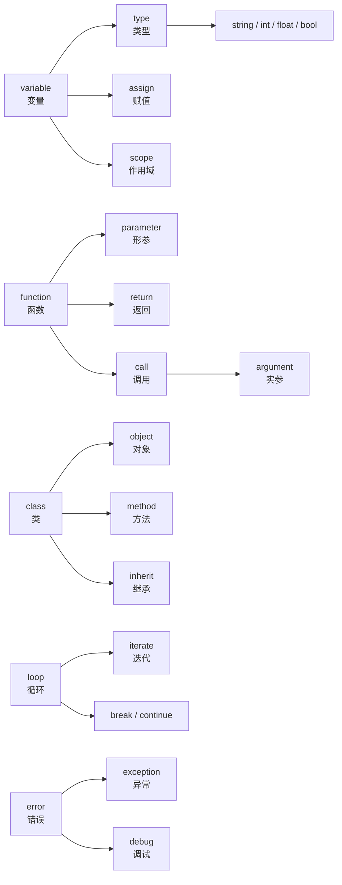

# 编程英文词汇

> **所属路径**：`00_高中复习/02_英语基础/01_技术词汇/02_编程英文词汇`
> **预计学习时间**：50 分钟
> **难度等级**：⭐

---

## 前置知识

- [数学英文词汇](../01_数学英文词汇/01_数学英文词汇.md)
- [逻辑与问题拆解](../../../03_信息素养/04_逻辑与问题拆解/)

> 建议先完成数学英文词汇的学习，因为编程中会大量使用数学概念的英文名称（如 variable、function）。

---

## 学习目标

完成本节后，你将能够：

1. 识别并说出 55 个以上编程核心概念的英文名称及常用搭配
2. 运用词根词缀规律推测陌生编程术语的含义
3. 阅读简单的英文代码注释和 Python 官方文档片段
4. 区分编程中容易混淆的近义词对（如 parameter/argument、error/exception）

---

## 正文讲解

### 1. 编程英文词汇的特殊之处

如果你已经学过数学英文词汇，你会发现编程英文有一个有趣的特点：**代码本身就是英文**。当你写 `if x > 0:` 时，你其实在用英语说"如果 $x$ 大于 0"。变量名、函数名、关键字——编程语言的每一个元素都是英文单词或缩写。

这意味着编程词汇的学习有一个天然优势：你可以在**写代码的同时学英语**。每次输入 `return`，你就在练习"返回"这个词；每次写 `import`，你就在练习"导入"。

但编程词汇也有一个需要注意的地方：很多日常英语单词在编程中有**特殊含义**。比如 `class` 不是"班级"而是"类"，`bug` 不是"虫子"而是"程序错误"。掌握这些特殊含义是学习编程英文的关键。

### 2. 基础概念词汇

这组词汇是编程世界的"基本粒子"，无论学什么编程语言都会遇到。

| 英文 | 音标 | 中文 | 常用语块 | 例句 |
| ---- | ---- | ---- | -------- | ---- |
| variable | /ˈveriəbl/ | 变量 | declare a variable, local variable | Declare a variable named `count`. |
| value | /ˈvæljuː/ | 值 | return value, default value | The value of `x` is 10. |
| assign | /əˈsaɪn/ | 赋值 | assign a value to | Assign the value 5 to `x`. |
| type | /taɪp/ | 类型 | data type, type conversion | The type of `x` is `int`. |
| string | /strɪŋ/ | 字符串 | empty string, string concatenation | A string of characters. |
| integer | /ˈɪntɪdʒər/ | 整数 | integer division | An integer value. |
| float | /floʊt/ | 浮点数 | floating-point number | A float value like 3.14. |
| boolean | /ˈbuːliən/ | 布尔值 | boolean expression | A boolean value: True or False. |
| array | /əˈreɪ/ | 数组 | array index, array element | An array of numbers. |
| list | /lɪst/ | 列表 | append to the list, list comprehension | Create an empty list. |
| dictionary | /ˈdɪkʃəneri/ | 字典 | key-value pair | A dictionary maps keys to values. |
| index | /ˈɪndeks/ | 索引 | array index, index out of range | The index starts at 0. |
| null / None | /nʌl/ /nʌn/ | 空值 | null pointer, check for None | The variable is None. |

> 💡 **记忆技巧**：string（字符串）的本义是"绳子"——想象一串字符像珠子一样穿在绳子上。boolean（布尔值）以数学家 George Boole 的名字命名，只有 True 和 False 两种值。

### 3. 控制流词汇

控制流决定了程序的执行顺序——哪些代码先执行、哪些后执行、哪些重复执行。

| 英文 | 音标 | 中文 | 常用语块 | 例句 |
| ---- | ---- | ---- | -------- | ---- |
| condition | /kənˈdɪʃən/ | 条件 | if condition is met | Check the condition. |
| loop | /luːp/ | 循环 | for loop, while loop, infinite loop | Use a for loop to iterate. |
| iterate | /ˈɪtəreɪt/ | 迭代 | iterate over a list | Iterate over each element. |
| break | /breɪk/ | 跳出 | break out of the loop | Break when condition is met. |
| continue | /kənˈtɪnjuː/ | 继续（跳过本次） | continue to the next iteration | Continue to the next item. |
| return | /rɪˈtɜːrn/ | 返回 | return a value, return type | The function returns True. |
| execute | /ˈeksɪkjuːt/ | 执行 | execute the code, execute a command | Execute the script. |
| branch | /brɑːntʃ/ | 分支 | conditional branch | The if/else creates two branches. |
| recursive | /rɪˈkɜːrsɪv/ | 递归的 | recursive function, recursive call | A recursive algorithm. |
| nested | /ˈnestɪd/ | 嵌套的 | nested loop, nested function | A nested if statement. |

> 💡 **易混词辨析**：break vs. continue——break 是"完全跳出循环"，continue 是"跳过本次循环的剩余部分，进入下一次循环"。

### 4. 函数与结构词汇

| 英文 | 音标 | 中文 | 常用语块 | 例句 |
| ---- | ---- | ---- | -------- | ---- |
| function | /ˈfʌŋkʃən/ | 函数 | define a function, call a function | Define a function `add(a, b)`. |
| parameter | /pəˈræmɪtər/ | 形参 | function parameter | The parameter `x` is required. |
| argument | /ˈɑːrɡjumənt/ | 实参 | pass an argument | Pass 5 as an argument. |
| class | /klæs/ | 类 | define a class, class method | Define a class called `Dog`. |
| object | /ˈɒbdʒekt/ | 对象 | create an object, object-oriented | Create an object of class `Dog`. |
| method | /ˈmeθəd/ | 方法 | call a method | Call the method `sort()`. |
| module | /ˈmɒdjuːl/ | 模块 | import a module | Import the `math` module. |
| library | /ˈlaɪbreri/ | 库 | standard library, third-party library | Install the library with pip. |
| package | /ˈpækɪdʒ/ | 包 | install a package | Install the package `numpy`. |
| inherit | /ɪnˈherɪt/ | 继承 | inherit from a class | Class `Cat` inherits from `Animal`. |
| instance | /ˈɪnstəns/ | 实例 | create an instance | Create an instance of the class. |
| scope | /skoʊp/ | 作用域 | local scope, global scope | The variable is in local scope. |

> 💡 **易混词辨析**：parameter vs. argument——定义函数时写在括号里的叫 parameter（形参），调用函数时传入的具体值叫 argument（实参）。例如 `def add(a, b):` 中 `a` 和 `b` 是 parameters；`add(3, 5)` 中 `3` 和 `5` 是 arguments。

### 5. 操作与调试词汇

| 英文 | 音标 | 中文 | 常用语块 | 例句 |
| ---- | ---- | ---- | -------- | ---- |
| debug | /diːˈbʌɡ/ | 调试 | debug the code, debug mode | Debug the program step by step. |
| error | /ˈerər/ | 错误 | syntax error, runtime error | Fix the error in line 5. |
| exception | /ɪkˈsepʃən/ | 异常 | raise an exception, handle the exception | Catch the exception. |
| compile | /kəmˈpaɪl/ | 编译 | compile the code | Compile the source code. |
| runtime | /ˈrʌntaɪm/ | 运行时 | runtime error, at runtime | A runtime error occurred. |
| syntax | /ˈsɪntæks/ | 语法 | syntax error, valid syntax | Check the syntax. |
| output | /ˈaʊtpʊt/ | 输出 | print the output | The output is 42. |
| input | /ˈɪnpʊt/ | 输入 | user input, input data | Read user input. |
| import | /ˈɪmpɔːrt/ | 导入 | import a module | Import numpy as np. |
| install | /ɪnˈstɔːl/ | 安装 | install a package | Install with `pip install`. |
| log | /lɒɡ/ | 日志 | log message, log file | Write to the log file. |
| deprecated | /ˈdeprəkeɪtɪd/ | 已弃用的 | deprecated function | This function is deprecated. |

> 💡 **记忆技巧**：debug 的词源很有趣——bug（虫子）→ debug（去虫）。传说 1947 年 Harvard Mark II 计算机中真的发现了一只飞蛾导致故障，此后 bug 就成了"程序错误"的代名词。

### 6. 词根词缀解码

| 词根/词缀 | 含义 | 示例词汇 | 推理过程 |
| --------- | ---- | -------- | -------- |
| de- | 去除/向下 | debug（调试）, decompose（分解） | de(去除) + bug(虫/错误) → 去除错误 |
| re- | 再次/返回 | return（返回）, recursive（递归的） | re(再次) + curse(运行) → 再次运行自己 |
| ex- / e- | 向外 | execute（执行）, exception（异常） | ex(向外) + cept(拿) + -tion → 被"拿出来"的特殊情况 |
| im- / in- | 进入 | import（导入）, input（输入） | im(进入) + port(端口) → 从外面引入 |
| com- / con- | 一起 | compile（编译）, concatenate（拼接） | com(一起) + pile(堆) → 把代码堆到一起 |
| -tion / -sion | 动作/结果 | function（函数）, exception（异常） | 动词变名词的常见后缀 |
| -er / -or | 执行者 | compiler（编译器）, iterator（迭代器） | compile → compiler = 执行编译的东西 |
| -able / -ible | 能够 | iterable（可迭代的）, callable（可调用的） | iterate + -able = 能够被迭代的 |
| over- | 过度/覆盖 | overflow（溢出）, override（重写） | over(超过) + flow(流) → 超出容量 |
| un- | 不/反转 | undefined（未定义）, unpack（解包） | un(不) + defined(已定义) → 未定义 |

### 7. 核心语块与搭配

**变量与赋值类**：
- declare/define a variable（声明/定义变量）
- assign a value to a variable（给变量赋值）
- initialize a variable（初始化变量）
- the variable is of type `int`（变量的类型是整数）

**函数与调用类**：
- define/call a function（定义/调用函数）
- pass an argument to a function（传参数给函数）
- return a value from a function（从函数返回值）
- a function takes two parameters（函数接收两个参数）

**控制流类**：
- iterate over a list/dictionary（遍历列表/字典）
- break out of the loop（跳出循环）
- the condition is met/satisfied（条件满足）
- execute the code block（执行代码块）

**错误与调试类**：
- raise/throw an exception（抛出异常）
- catch/handle the exception（捕获/处理异常）
- a syntax/runtime error occurred（发生了语法/运行时错误）
- debug the code step by step（逐步调试代码）

### 8. 真实语境阅读

下面是一段改编自 Python 官方文档风格的英文材料，尝试阅读并理解：

> *"To **define** a **function** in Python, use the `def` keyword followed by the function name and **parameters** in parentheses. The function body is **indented** and may contain a `return` statement that specifies the **return value**. When you **call** the function and **pass arguments**, Python **assigns** each **argument** to the corresponding **parameter**. If a **runtime error** occurs during **execution**, Python **raises** an **exception** with a **traceback** showing the **call stack**."*

**逐句注释**：

| 原文关键短语 | 中文理解 |
| ------------ | -------- |
| define a function | 定义一个函数 |
| parameters in parentheses | 括号中的参数 |
| the function body is indented | 函数体是缩进的 |
| return statement / return value | return 语句 / 返回值 |
| call the function and pass arguments | 调用函数并传入实参 |
| assigns each argument to the corresponding parameter | 将每个实参赋给对应的形参 |
| a runtime error occurs during execution | 执行过程中发生运行时错误 |
| raises an exception with a traceback | 抛出异常并附带调用回溯信息 |

### 9. 综合记忆地图



> 📌 **图解说明**：这张图展示了编程英文词汇的核心关系网络。变量有类型、赋值和作用域；函数有参数、返回值和调用；类产生对象、方法和继承关系；循环涉及迭代和控制语句；错误引发异常并需要调试。

---

## 记忆策略

### 代码即练习

编程词汇有一个独特的优势：**每次写代码都是在练习英语**。建议在学习编程时，有意识地注意每个关键字和函数名的英文含义：

- 写 `def add(a, b):` 时想：我在 **define** 一个 **function**，它有两个 **parameters**
- 写 `for item in list:` 时想：我在 **iterate over** 一个 **list**
- 看到 `TypeError` 时想：这是一个 **type error**（类型错误）

### 间隔重复计划

| 复习时间 | 建议方式 |
| -------- | -------- |
| 当天 | 浏览词汇表，标记不确定的词 |
| 第 2 天 | 阅读一段英文代码注释，识别学过的词汇 |
| 第 4 天 | 完成本节练习题 |
| 第 7 天 | 尝试用英文写 5 行代码的注释 |
| 第 14 天 | 阅读 Python 官方文档的一小段 |
| 第 30 天 | 与数学词汇和 AI 词汇交叉复习 |

---

## 动手实践

下面是一段包含本节核心词汇的 Python 代码。阅读代码和注释，尝试理解每个英文术语的含义：

```python
# File: code/vocab_practice.py
# Practice: identify programming vocabulary in real code

def calculate_mean(numbers):
    """Calculate the mean of a list of numbers."""
    if not isinstance(numbers, list):  # Check the type
        raise TypeError("Argument must be a list")  # Raise an exception
    
    total = 0  # Initialize a variable
    count = 0
    
    for num in numbers:  # Iterate over the list
        if not isinstance(num, (int, float)):
            continue  # Skip non-numeric values
        total += num  # Assign the sum
        count += 1
    
    if count == 0:
        return None  # Return null value
    
    return total / count  # Return the mean value

# Call the function and pass an argument
data = [10, 20, 30, 40, 50]
result = calculate_mean(data)
print(f"The mean is: {result}")  # Output the result
```

**运行说明**：
- 环境要求：Python 3.10+
- 运行命令：`python code/vocab_practice.py`

**预期输出**：
```
The mean is: 30.0
```

**任务**：在上面代码中找出并标注以下词汇的使用位置：function、parameter、argument、list、iterate、return、variable、type、exception。

---

## 典型误区

| 误区 | 正确理解 |
| ---- | -------- |
| 把 class 理解为"班级" | 在编程中，class 是"类"，用于创建对象的蓝图 |
| 混淆 error 和 exception | error 是广义的"错误"，exception 是程序可以捕获和处理的特定错误类型 |
| 混淆 parameter 和 argument | parameter 是定义函数时的形参，argument 是调用函数时传入的实参 |
| 把 library 和 framework 混用 | library（库）是你调用的工具集，framework（框架）是调用你的代码的结构 |
| 认为 compile 只属于 C/Java | Python 也有编译步骤（生成 .pyc 字节码），只是对用户透明 |
| 把 deprecated 理解为"不能用" | deprecated 是"已弃用、不推荐使用"，通常还能用但未来可能被移除 |

---

## 练习题

### 练习 1：术语分类（难度：⭐）

将以下 10 个词分为"数据类型"和"控制流"两组：

`string`, `for`, `integer`, `while`, `boolean`, `if`, `float`, `break`, `list`, `return`

<details>
<summary>💡 提示</summary>

数据类型描述的是"值是什么"，控制流描述的是"代码怎么执行"。

</details>

<details>
<summary>✅ 参考答案</summary>

**数据类型**：string, integer, boolean, float, list

**控制流**：for, while, if, break, return

</details>

### 练习 2：语块填空（难度：⭐）

用合适的语块完成以下句子：

1. Use `def` to ______ ______ ______ in Python.（使用 `def` 在 Python 中定义函数。）
2. ______ ______ ______ to the function as input.（将实参传给函数作为输入。）
3. If an error occurs, Python ______ ______ ______.（如果发生错误，Python 会抛出异常。）
4. Use a for loop to ______ ______ each element.（使用 for 循环来遍历每个元素。）

<details>
<summary>✅ 参考答案</summary>

1. define a function
2. Pass an argument（或 Pass arguments）
3. raises an exception
4. iterate over

</details>

### 练习 3：代码阅读理解（难度：⭐⭐）

阅读以下代码，回答问题：

```python
def find_max(items):
    if len(items) == 0:
        raise ValueError("List is empty")
    result = items[0]
    for item in items:
        if item > result:
            result = item
    return result
```

1. 这个 function 的 parameter 是什么？
2. 代码中使用了什么类型的 loop？
3. 在什么 condition 下会 raise 一个 exception？
4. 这个 function 的 return value 是什么？

<details>
<summary>✅ 参考答案</summary>

1. parameter 是 `items`（一个列表）
2. 使用了 for loop（for 循环）
3. 当 `items` 的长度为 0（即列表为空）时，会 raise 一个 `ValueError` exception
4. return value 是列表中的最大值（maximum value）

</details>

### 练习 4：词根推理（难度：⭐⭐）

利用词根词缀知识推测含义：

1. **immutable**：im-（不）+ mutable（可变的），意思是？
2. **substring**：sub-（下面/部分）+ string（字符串），意思是？
3. **overwrite**：over-（覆盖）+ write（写），意思是？
4. **uninstall**：un-（反转）+ install（安装），意思是？

<details>
<summary>✅ 参考答案</summary>

1. immutable = 不可变的（如 Python 中的元组和字符串）
2. substring = 子字符串（字符串的一部分）
3. overwrite = 覆写/覆盖（用新内容替换旧内容）
4. uninstall = 卸载（安装的反向操作）

</details>

---

## 下一步学习

- 📖 下一个知识点：[人工智能英文词汇](../03_人工智能英文词汇/03_人工智能英文词汇.md)
- 🔗 相关知识点：[数学英文词汇](../01_数学英文词汇/01_数学英文词汇.md)、[编程语言基础](../../../../01_基础能力/01_开发环境与技术英语/01_编程语言基础/)
- 📚 拓展阅读：[Python 官方教程](https://docs.python.org/3/tutorial/)（英文官方文档，是练习编程英文的最佳材料）

---

## 参考资料

1. [Python 官方文档 - Glossary](https://docs.python.org/3/glossary.html) — Python 官方术语表（官方文档）
2. [freeCodeCamp - English for Developers](https://www.freecodecamp.org/news/learn-english-for-developers-a2/) — 面向开发者的英语课程（CC BY-SA 许可）
3. [Real Python](https://realpython.com/) — Python 编程英文教程，适合练习技术英语阅读（公开教育资源）
4. [Stack Overflow](https://stackoverflow.com/) — 最大的编程问答社区，真实英文技术交流场景（公开社区）
5. [CSAVL - Computer Science Academic Vocabulary List](https://www.eapfoundation.com/vocab/academic/other/csavl/) — 计算机科学学术词汇表（公开学术资源）
