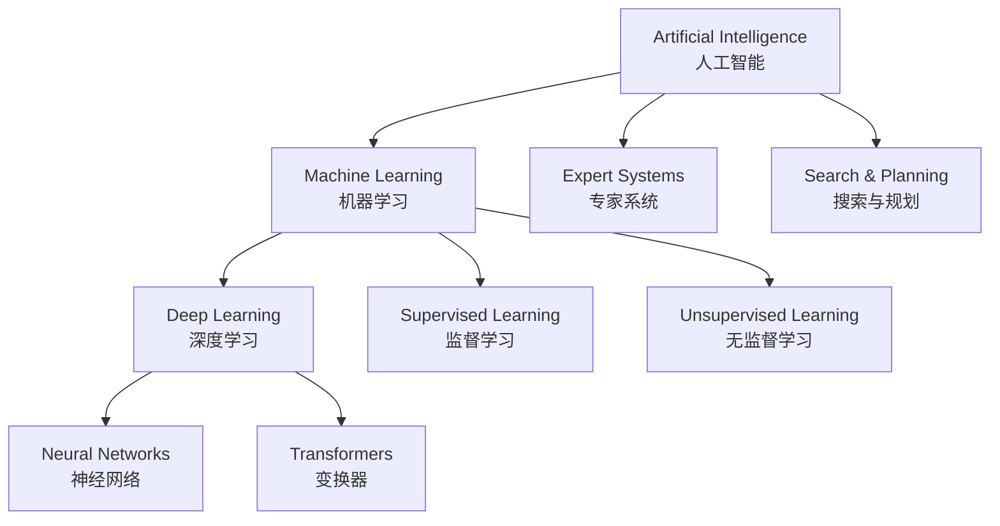
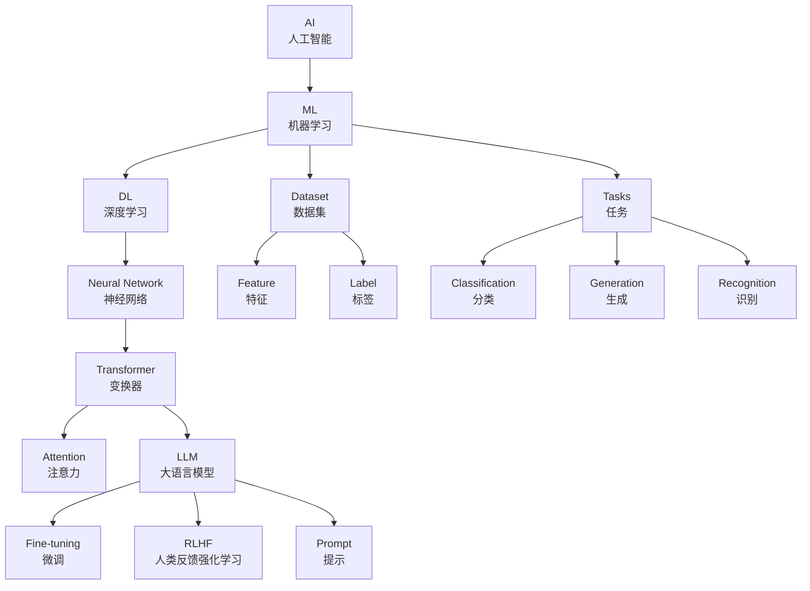

# 人工智能英文词汇

> **所属路径**：`00_高中复习/02_英语基础/01_技术词汇/03_人工智能英文词汇`
> **预计学习时间**：50 分钟
> **难度等级**：⭐⭐

---

## 前置知识

- [数学英文词汇](../01_数学英文词汇/01_数学英文词汇.md)
- [编程英文词汇](../02_编程英文词汇/02_编程英文词汇.md)

> 建议先完成前两个词汇课程，因为 AI 术语建立在数学和编程词汇之上。

---

## 学习目标

完成本节后，你将能够：

1. 识别并说出 50 个以上 AI 核心概念的英文名称和常用语块
2. 正确区分 AI、ML、DL 三个层级的术语边界
3. 阅读并理解 AI 新闻报道和论文摘要中的关键术语
4. 运用词根词缀推测新兴 AI 术语的含义

---

## 正文讲解

### 1. 从一段新闻开始

打开任何一个科技新闻网站，你都可能看到类似这样的句子：

> *"OpenAI released a new large language model with improved reasoning capabilities. The model was trained on a massive dataset using reinforcement learning from human feedback."*

这短短两句话中就包含了 **large language model**（大语言模型）、**reasoning**（推理）、**dataset**（数据集）、**reinforcement learning**（强化学习）、**human feedback**（人类反馈）等 AI 核心术语。这些词汇是你进入 AI 世界的"通行证"。

### 2. AI 核心概念词汇

这组词汇定义了人工智能的基本框架和层级关系。

| 英文 | 音标 | 中文 | 常用语块 | 例句 |
| ---- | ---- | ---- | -------- | ---- |
| artificial intelligence | /ˌɑːrtɪˈfɪʃəl ɪnˈtelɪdʒəns/ | 人工智能 | AI system, AI-powered | AI is transforming industries. |
| machine learning | /məˈʃiːn ˈlɜːrnɪŋ/ | 机器学习 | ML model, ML algorithm | Machine learning is a subset of AI. |
| deep learning | /diːp ˈlɜːrnɪŋ/ | 深度学习 | DL framework, deep learning model | Deep learning uses neural networks. |
| algorithm | /ˈælɡərɪðəm/ | 算法 | training algorithm, sorting algorithm | Design an efficient algorithm. |
| model | /ˈmɒdl/ | 模型 | train a model, pre-trained model | The model predicts outcomes. |
| data | /ˈdeɪtə/ | 数据 | training data, data pipeline | The data is preprocessed. |
| intelligence | /ɪnˈtelɪdʒəns/ | 智能 | artificial intelligence, general intelligence | Measure the intelligence of the system. |
| agent | /ˈeɪdʒənt/ | 智能体 | AI agent, autonomous agent | The agent interacts with the environment. |
| reasoning | /ˈriːzənɪŋ/ | 推理 | chain-of-thought reasoning | The model shows reasoning ability. |
| inference | /ˈɪnfərəns/ | 推断/推理 | run inference, inference speed | Run inference on the test data. |

下面这张图展示了 AI、ML、DL 三者的层级关系：

> 📌 **图解说明**：AI 是最大的概念范畴，包含多种实现途径；ML 是 AI 的一个子集，通过数据驱动学习；DL 是 ML 的一个子集，使用多层神经网络。

### 3. 神经网络与深度学习词汇

| 英文 | 音标 | 中文 | 常用语块 | 例句 |
| ---- | ---- | ---- | -------- | ---- |
| neural network | /ˈnjʊərəl ˈnetwɜːrk/ | 神经网络 | deep neural network, train a neural network | A neural network with 3 layers. |
| neuron | /ˈnjʊərɒn/ | 神经元 | artificial neuron | Each neuron computes a weighted sum. |
| layer | /ˈleɪər/ | 层 | hidden layer, output layer | Add a hidden layer. |
| weight | /weɪt/ | 权重 | update weights, weight matrix | The weights are initialized randomly. |
| bias | /ˈbaɪəs/ | 偏置/偏差 | bias term, bias in data | Add a bias to each neuron. |
| activation | /ˌæktɪˈveɪʃən/ | 激活 | activation function, ReLU activation | Apply the activation function. |
| transformer | /trænsˈfɔːrmər/ | 变换器 | transformer architecture, transformer model | GPT is based on the transformer. |
| attention | /əˈtenʃən/ | 注意力 | self-attention, attention mechanism | The attention mechanism weighs inputs. |
| embedding | /ɪmˈbedɪŋ/ | 嵌入 | word embedding, embedding layer | Convert tokens to embeddings. |
| token | /ˈtoʊkən/ | 词元 | tokenize, token sequence | Split the text into tokens. |
| encoder / decoder | /ɪnˈkoʊdər/ /dɪˈkoʊdər/ | 编码器/解码器 | encoder-decoder architecture | The encoder processes the input. |

> 💡 **记忆技巧**：neural（神经的）来自 nerve（神经）。transformer 来自 transform（变换），它通过注意力机制"变换"输入的表示。embedding 来自 embed（嵌入），把离散的词汇嵌入到连续的向量空间中。

### 4. 数据与训练词汇

| 英文 | 音标 | 中文 | 常用语块 | 例句 |
| ---- | ---- | ---- | -------- | ---- |
| dataset | /ˈdeɪtæset/ | 数据集 | training dataset, benchmark dataset | Load the dataset. |
| feature | /ˈfiːtʃər/ | 特征 | feature extraction, input features | Select the most important features. |
| label | /ˈleɪbl/ | 标签 | ground-truth label, label the data | Each sample has a label. |
| training | /ˈtreɪnɪŋ/ | 训练 | training loop, training data | Train the model for 10 epochs. |
| testing | /ˈtestɪŋ/ | 测试 | testing phase, test set | Evaluate on the test set. |
| prediction | /prɪˈdɪkʃən/ | 预测 | make a prediction | The prediction is 95% accurate. |
| preprocessing | /ˌpriːˈprɒsesɪŋ/ | 预处理 | data preprocessing | Preprocess the raw data. |
| annotation | /ˌænəˈteɪʃən/ | 标注 | data annotation | The annotation takes weeks. |
| fine-tuning | /faɪn ˈtjuːnɪŋ/ | 微调 | fine-tune a model | Fine-tune the model on our data. |
| prompt | /prɒmpt/ | 提示 | prompt engineering, prompt template | Write a clear prompt. |
| hallucination | /həˌluːsɪˈneɪʃən/ | 幻觉 | reduce hallucination | The model produces hallucinations. |
| alignment | /əˈlaɪnmənt/ | 对齐 | AI alignment, alignment with human values | Align the model with human preferences. |

### 5. 模型与任务词汇

| 英文 | 音标 | 中文 | 常用语块 | 例句 |
| ---- | ---- | ---- | -------- | ---- |
| classification | /ˌklæsɪfɪˈkeɪʃən/ | 分类 | image classification | A classification task. |
| regression | /rɪˈɡreʃən/ | 回归 | linear regression | Predict a continuous value. |
| generation | /ˌdʒenəˈreɪʃən/ | 生成 | text generation, image generation | Generate realistic images. |
| recognition | /ˌrekəɡˈnɪʃən/ | 识别 | speech recognition, image recognition | Recognize faces in photos. |
| NLP | | 自然语言处理 | NLP task, NLP model | NLP enables chatbots. |
| computer vision | /kəmˈpjuːtər ˈvɪʒən/ | 计算机视觉 | CV task, image classification | Computer vision analyzes images. |
| accuracy | /ˈækjərəsi/ | 准确率 | achieve high accuracy | The accuracy is 98%. |
| large language model | | 大语言模型 | LLM, LLM-based application | GPT is a large language model. |
| reinforcement learning | | 强化学习 | RL agent, reward signal | Train with reinforcement learning. |
| benchmark | /ˈbentʃmɑːrk/ | 基准测试 | benchmark dataset, benchmark score | Evaluate on the benchmark. |

### 6. 词根词缀解码

| 词根/词缀 | 含义 | 示例词汇 | 推理过程 |
| --------- | ---- | -------- | -------- |
| neur- | 神经 | neural（神经的）, neuron（神经元） | neur(神经) + -al(的) → 神经的 |
| artific- | 人工制造 | artificial（人工的） | arti(技艺) + fic(做) + -ial → 人工制造的 |
| pre- | 在…之前 | predict（预测）, preprocessing（预处理） | pre(前) + dict(说) → 提前说出 |
| trans- | 穿越/变换 | transformer（变换器）, transfer（迁移） | trans(穿越) + form(形态) → 变换形态 |
| re- | 再次 | recognition（识别）, regression（回归） | re(再) + cognize(认识) → 再次认识 |
| -tion / -sion | 动作/结果 | classification（分类）, generation（生成） | classify → classification |
| -ment | 过程/结果 | alignment（对齐）, embedding（嵌入） | align + -ment → 对齐的过程 |
| super- | 超越 | supervised（有监督的） | super(上方) + vise(看) → 从上方监视 |
| un- / in- | 不/无 | unsupervised（无监督的）, inference（推断） | un(不) + supervised → 无监督的 |
| multi- | 多 | multimodal（多模态）, multilingual（多语言） | multi(多) + modal(模态) → 多模态 |
| self- | 自身 | self-attention（自注意力）, self-supervised（自监督） | self(自身) + attention → 自注意力 |

### 7. 核心语块与搭配

**模型与训练类**：
- train a model on data（在数据上训练模型）
- fine-tune a pre-trained model（微调预训练模型）
- the model predicts / generates（模型预测/生成）
- achieve state-of-the-art performance（达到最先进的性能）

**数据类**：
- preprocess the raw data（预处理原始数据）
- label / annotate the dataset（标注数据集）
- split into training and test sets（划分为训练集和测试集）
- a benchmark dataset（基准数据集）

**大模型时代的新语块**：
- prompt engineering（提示工程）
- in-context learning（上下文学习）
- reinforcement learning from human feedback / RLHF（人类反馈强化学习）
- chain-of-thought reasoning（思维链推理）
- reduce hallucination（减少幻觉）
- align with human values（与人类价值观对齐）

### 8. 真实语境阅读

下面是一段改编自 AI 研究论文摘要风格的材料：

> *"We introduce a **large language model** with 70 billion **parameters**, **pre-trained** on a diverse **dataset** of text from the internet. We then **fine-tune** the model using **reinforcement learning from human feedback** (RLHF) to improve **alignment** with human preferences. Our model achieves **state-of-the-art** results on multiple **benchmarks** including reading comprehension, **reasoning**, and code **generation**. We find that **chain-of-thought prompting** significantly improves the model's **accuracy** on complex tasks. However, the model still occasionally produces **hallucinations**, particularly when asked about recent events not in its **training data**."*

**逐句注释**：

| 关键短语 | 中文理解 |
| -------- | -------- |
| large language model with 70 billion parameters | 拥有 700 亿参数的大语言模型 |
| pre-trained on a diverse dataset | 在多样化的数据集上预训练 |
| fine-tune using RLHF | 使用人类反馈强化学习进行微调 |
| improve alignment with human preferences | 提升与人类偏好的对齐 |
| state-of-the-art results on multiple benchmarks | 在多个基准测试上达到最先进的结果 |
| chain-of-thought prompting | 思维链提示 |
| produces hallucinations | 产生幻觉（生成不真实的内容） |
| training data | 训练数据 |

### 9. 综合记忆地图

> 📌 **图解说明**：AI 的层级关系以及大模型时代的核心概念网络。从 AI 到 ML 到 DL 到神经网络到 Transformer 到大语言模型，形成了清晰的技术演进脉络。

---

## 记忆策略

### AI 新闻阅读法

AI 领域发展极快，每天都有新的新闻和论文。推荐利用以下资源进行"沉浸式"词汇巩固：

- **每日 5 分钟**：浏览 [Hacker News](https://news.ycombinator.com/) 或 [Papers With Code](https://paperswithcode.com/) 的标题，识别学过的词汇
- **每周一篇**：阅读一篇 AI 科普博客（如 [The Batch by Andrew Ng](https://www.deeplearning.ai/the-batch/)），标注新词汇

### 间隔重复计划

| 复习时间 | 建议方式 |
| -------- | -------- |
| 当天 | 浏览词汇表和语块 |
| 第 2 天 | 重读"真实语境阅读"段落 |
| 第 4 天 | 完成练习题 |
| 第 7 天 | 阅读一条 AI 英文新闻 |
| 第 14 天 | 尝试用英文概述一个 AI 概念 |
| 第 30 天 | 综合复习全部四个词汇课程 |

---

## 动手实践

**AI 新闻标题解读**：阅读以下真实的 AI 新闻标题，用你学过的词汇理解它们的含义：

1. "GPT-4 achieves human-level performance on multiple benchmarks"
2. "New self-supervised learning method reduces the need for labeled data"
3. "Researchers propose attention-based architecture for image recognition"
4. "Fine-tuning large language models with reinforcement learning from human feedback"

对每个标题：用中文写出你的理解，并标出其中包含的本节词汇。

---

## 典型误区

| 误区 | 正确理解 |
| ---- | -------- |
| 认为 AI = 机器人 | AI 是一个广泛的领域，机器人只是其应用之一 |
| 混淆 AI、ML、DL 的层级 | AI ⊃ ML ⊃ DL，它们是包含关系 |
| 把 bias 只理解为"偏见" | 在神经网络中 bias 是"偏置项"，在数据中 bias 是"偏差/偏见" |
| 混淆 inference 和 reasoning | inference 侧重"模型运行推断"，reasoning 侧重"逻辑推理能力" |
| 认为 parameter 和 hyperparameter 相同 | parameter 是模型自己学到的（如权重），hyperparameter 是人为设定的（如学习率） |
| 把 epoch 理解为"时代" | 在 ML 中 epoch 是"轮次"——训练数据被完整遍历一次 |

---

## 练习题

### 练习 1：层级排序（难度：⭐）

将以下概念按照从大到小的包含关系排序：
Deep Learning, Artificial Intelligence, Machine Learning, Neural Network

✅ 参考答案

Artificial Intelligence > Machine Learning > Deep Learning > Neural Network

（AI 包含 ML，ML 包含 DL，DL 使用 Neural Network）

### 练习 2：语块填空（难度：⭐）

1. We need to ______ the model ______ a large ______.（我们需要在大数据集上训练模型。）
2. The ______ ______ ______ has 175 billion parameters.（这个大语言模型有 1750 亿参数。）
3. Use ______ ______ to improve the model's output.（使用提示工程来改善模型输出。）
4. The model was ______-______ on domain-specific data.（模型在领域特定数据上进行了微调。）

✅ 参考答案

1. train ... on ... dataset
2. large language model
3. prompt engineering
4. fine-tuned

### 练习 3：真实摘要阅读（难度：⭐⭐）

阅读以下论文摘要片段，回答问题：

> *"We propose a transformer-based model for image classification. The model uses self-attention to capture global features. Pre-trained on ImageNet, it achieves 89% accuracy. Fine-tuning on medical images improves accuracy to 95%."*

1. 模型的架构基础是什么？
2. 使用了什么机制来捕获全局特征？
3. 预训练数据集是什么？预训练后的准确率是多少？
4. 微调后准确率提升到了多少？

✅ 参考答案

1. 基于 transformer 架构
2. self-attention（自注意力）机制
3. 预训练数据集是 ImageNet，准确率 89%
4. 微调后提升到 95%

### 练习 4：词根推理（难度：⭐⭐）

1. **multimodal**：multi-（多）+ modal（模态），意思是？
2. **pretrained**：pre-（预先）+ trained（训练），意思是？
3. **self-supervised**：self-（自身）+ supervised（有监督的），意思是？
4. **unaligned**：un-（未）+ aligned（对齐的），意思是？

✅ 参考答案

1. multimodal = 多模态的（能处理文本、图像、音频等多种数据形式）
2. pretrained = 预训练的（在大量数据上预先训练过的）
3. self-supervised = 自监督的（利用数据本身生成监督信号）
4. unaligned = 未对齐的（未经过与人类偏好对齐的）

---

## 下一步学习

- 📖 下一个知识点：[机器学习常用术语](../04_机器学习常用术语/04_机器学习常用术语.md)
- 🔗 相关知识点：[编程英文词汇](../02_编程英文词汇/02_编程英文词汇.md)、[人工智能概述](../../../../02_核心原理/01_经典人工智能/01_人工智能概述/)
- 📚 拓展阅读：[Papers With Code](https://paperswithcode.com/) — AI 论文与代码开放平台，适合浏览最新术语

---

## 参考资料

1. [Google Machine Learning Glossary](https://developers.google.com/machine-learning/glossary) — Google 官方 ML 术语表（官方文档）
2. [Stanford CS229 Course Notes](https://cs229.stanford.edu/) — 斯坦福机器学习课程笔记（公开课程）
3. [The Batch by Andrew Ng](https://www.deeplearning.ai/the-batch/) — AI 周刊，适合练习 AI 英文阅读（公开订阅）
4. [Hugging Face Documentation](https://huggingface.co/docs) — 大模型开源社区文档（开源文档）
5. [Papers With Code](https://paperswithcode.com/) — 论文和代码对照平台（公开学术资源）
