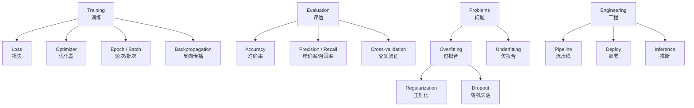

# 机器学习常用术语

> **所属路径**：`00_高中复习/02_英语基础/01_技术词汇/04_机器学习常用术语`
> **预计学习时间**：50 分钟
> **难度等级**：⭐⭐

---

## 前置知识

- [数学英文词汇](../01_数学英文词汇/01_数学英文词汇.md)
- [编程英文词汇](../02_编程英文词汇/02_编程英文词汇.md)
- [人工智能英文词汇](../03_人工智能英文词汇/03_人工智能英文词汇.md)

> 本节建立在前三个词汇课程之上。如果你对 variable、function、model 这些词还不熟悉，建议先完成前置课程。

---

## 学习目标

完成本节后，你将能够：

1. 识别并说出 50 个以上机器学习方法论中的英文术语和语块
2. 区分容易混淆的 ML 术语对（如 precision/recall、bias/variance）
3. 阅读 scikit-learn 文档片段并理解关键术语
4. 运用词根词缀推测陌生 ML 术语的含义

---

## 正文讲解

### 1. 机器学习术语的独特之处

机器学习有一个很有意思的特点：它的很多术语是"借用"自其他学科的日常词汇，但在 ML 语境中有**完全不同的含义**。比如：

- **train**（训练）——日常指"训练身体"，ML 中指"用数据训练模型"
- **loss**（损失）——日常指"丢失"，ML 中指"模型预测与真实值的差距"
- **feature**（特征）——日常指"特色"，ML 中指"输入数据的属性维度"
- **epoch**（轮次）——日常指"时代"，ML 中指"训练数据被完整遍历一次"

这意味着学习 ML 词汇时，你需要特别注意一个词的**学科语境**。

### 2. 训练流程词汇

这组词汇覆盖了 ML 模型从数据到预测的完整训练流程。

| 英文 | 音标 | 中文 | 常用语块 | 例句 |
| ---- | ---- | ---- | -------- | ---- |
| train | /treɪn/ | 训练 | train a model, training loop | Train the model for 100 epochs. |
| loss | /lɒs/ | 损失 | loss function, training loss | The loss decreases over time. |
| epoch | /ˈiːpɒk/ | 轮次 | for each epoch, number of epochs | Train for 50 epochs. |
| batch | /bætʃ/ | 批次 | mini-batch, batch size | Set the batch size to 32. |
| learning rate | /ˈlɜːrnɪŋ reɪt/ | 学习率 | set the learning rate, learning rate schedule | The learning rate is 0.001. |
| optimizer | /ˈɒptɪmaɪzər/ | 优化器 | Adam optimizer, SGD optimizer | Use the Adam optimizer. |
| convergence | /kənˈvɜːrdʒəns/ | 收敛 | convergence speed, reach convergence | The model reaches convergence. |
| backpropagation | /ˌbækprɒpəˈɡeɪʃən/ | 反向传播 | backpropagation algorithm | Compute gradients via backpropagation. |
| hyperparameter | /ˈhaɪpərpəræmɪtər/ | 超参数 | tune hyperparameters, hyperparameter search | Tune the hyperparameters. |
| pipeline | /ˈpaɪplaɪn/ | 流水线 | ML pipeline, data pipeline | Build a training pipeline. |

### 3. 评估与性能词汇

| 英文 | 音标 | 中文 | 常用语块 | 例句 |
| ---- | ---- | ---- | -------- | ---- |
| accuracy | /ˈækjərəsi/ | 准确率 | achieve high accuracy | The accuracy is 95%. |
| precision | /prɪˈsɪʒən/ | 精确率 | precision and recall | The precision is 0.92. |
| recall | /rɪˈkɔːl/ | 召回率 | improve recall | The recall is 0.88. |
| overfitting | /ˌoʊvərˈfɪtɪŋ/ | 过拟合 | prevent overfitting, overfit to the data | The model is overfitting. |
| underfitting | /ˌʌndərˈfɪtɪŋ/ | 欠拟合 | the model underfits | Underfitting means too simple. |
| generalization | /ˌdʒenərəlaɪˈzeɪʃən/ | 泛化 | generalization ability | Test generalization on new data. |
| validation | /ˌvælɪˈdeɪʃən/ | 验证 | validation set, cross-validation | Evaluate on the validation set. |
| baseline | /ˈbeɪslaɪn/ | 基线 | baseline model, establish a baseline | Compare against the baseline. |
| metric | /ˈmetrɪk/ | 指标 | evaluation metric, performance metric | Choose the right metric. |
| cross-validation | /krɒs ˌvælɪˈdeɪʃən/ | 交叉验证 | k-fold cross-validation | Use 5-fold cross-validation. |

> 💡 **易混词辨析**：precision vs. recall——precision（精确率）问的是"模型说'是'的里面有多少真的是"，recall（召回率）问的是"所有真的'是'里面模型找到了多少"。一个重视"宁缺毋滥"，一个重视"宁多勿少"。

### 4. 正则化与模型改进词汇

| 英文 | 音标 | 中文 | 常用语块 | 例句 |
| ---- | ---- | ---- | -------- | ---- |
| regularization | /ˌreɡjələrɪˈzeɪʃən/ | 正则化 | L2 regularization, add regularization | Regularization prevents overfitting. |
| dropout | /ˈdrɒpaʊt/ | 随机失活 | dropout rate, apply dropout | Set the dropout rate to 0.5. |
| augmentation | /ˌɔːɡmenˈteɪʃən/ | 增强 | data augmentation | Apply data augmentation. |
| normalization | /ˌnɔːrməlaɪˈzeɪʃən/ | 归一化 | batch normalization | Apply batch normalization. |
| ensemble | /ɒnˈsɒmbl/ | 集成 | ensemble method, ensemble of models | An ensemble of 5 models. |
| transfer learning | /ˈtrænsfɜːr ˈlɜːrnɪŋ/ | 迁移学习 | apply transfer learning | Use transfer learning for small datasets. |
| bias-variance | /baɪəs ˈveriəns/ | 偏差-方差 | bias-variance tradeoff | The bias-variance tradeoff. |
| ablation | /æˈbleɪʃən/ | 消融 | ablation study, ablation experiment | Conduct an ablation study. |

> 💡 **记忆技巧**：overfitting 是 over-（过度）+ fitting（拟合），模型"过度拟合"了训练数据，包括噪声。underfitting 是 under-（不足）+ fitting，模型"拟合不足"，太简单了。regularization 来自 regular（规则的），"让模型变得更规则/简单"就是正则化。

### 5. 数据处理与工程词汇

| 英文 | 音标 | 中文 | 常用语块 | 例句 |
| ---- | ---- | ---- | -------- | ---- |
| split | /splɪt/ | 划分 | train-test split | Split the data 80/20. |
| shuffle | /ˈʃʌfl/ | 打乱 | shuffle the data | Shuffle before splitting. |
| normalize | /ˈnɔːrməlaɪz/ | 归一化 | normalize the features | Normalize to range [0, 1]. |
| scale | /skeɪl/ | 缩放 | feature scaling, scale up | Scale the features. |
| encode | /ɪnˈkoʊd/ | 编码 | one-hot encoding, label encoding | Encode categorical features. |
| deploy | /dɪˈplɔɪ/ | 部署 | deploy a model, model deployment | Deploy the model to production. |
| inference | /ˈɪnfərəns/ | 推断 | run inference, inference time | Run inference on new data. |
| latency | /ˈleɪtənsi/ | 延迟 | low latency, inference latency | Reduce the inference latency. |
| throughput | /ˈθruːpʊt/ | 吞吐量 | high throughput | Improve throughput. |
| reproducibility | /ˌriːprəˌdjuːsəˈbɪləti/ | 可复现性 | ensure reproducibility | Set seeds for reproducibility. |

### 6. 词根词缀解码

| 词根/词缀 | 含义 | 示例词汇 | 推理过程 |
| --------- | ---- | -------- | -------- |
| over- | 过度 | overfitting（过拟合）, overflow（溢出） | over(过度) + fit(拟合) → 过度拟合 |
| under- | 不足 | underfitting（欠拟合）, undersample（欠采样） | under(不足) + fit → 拟合不足 |
| -ize / -ise | 使成为 | normalize（归一化）, optimize（优化） | normal(正常) + -ize → 使正常化 |
| -ation | 过程/结果 | regularization（正则化）, generalization（泛化） | 动词 + -ation → 名词 |
| cross- | 交叉 | cross-validation（交叉验证）, cross-entropy（交叉熵） | cross(交叉) + validation → 交叉验证 |
| re- | 再次/回 | regression（回归）, recall（召回） | re(回) + call(叫) → 召回 |
| back- | 向后 | backpropagation（反向传播） | back(向后) + propagation(传播) → 反向传播 |
| hyper- | 超越 | hyperparameter（超参数） | hyper(超) + parameter → 超参数 |
| pre- | 预先 | preprocess（预处理）, pretrained（预训练的） | pre(预先) + process → 预处理 |
| de- | 去除/部署 | deploy（部署）, decode（解码） | de(离开) + ploy(展开) → 部署 |
| -ment | 过程/结果 | deployment（部署）, augmentation（增强） | deploy + -ment → 部署过程 |

### 7. 核心语块与搭配

**训练流程类**：
- train the model on the training set（在训练集上训练模型）
- set the learning rate to 0.001（将学习率设为 0.001）
- the loss decreases over epochs（损失随着轮次递减）
- compute gradients via backpropagation（通过反向传播计算梯度）
- tune the hyperparameters（调整超参数）

**评估类**：
- evaluate on the validation/test set（在验证集/测试集上评估）
- achieve 95% accuracy on the benchmark（在基准测试上达到 95% 准确率）
- the model overfits to the training data（模型过拟合训练数据）
- compare against the baseline（与基线进行比较）
- conduct an ablation study（进行消融实验）

**数据与部署类**：
- split the data into training and test sets（将数据划分为训练集和测试集）
- normalize / scale the features（归一化/缩放特征）
- deploy the model to production（将模型部署到生产环境）
- run inference on new data（在新数据上运行推断）

### 8. 真实语境阅读

下面是一段改编自 scikit-learn 文档风格的材料：

> *"To build a **classification** model, first **split** your **dataset** into **training** and **test** sets. Next, choose a suitable **algorithm** (e.g., logistic **regression** or random forest) and **train** the model on the training data. **Evaluate** the model using **metrics** such as **accuracy**, **precision**, and **recall** on the test set. If the model shows signs of **overfitting** (high training accuracy but low test accuracy), consider adding **regularization** or using **cross-validation** to get a more robust estimate of **generalization** performance. You can also try **data augmentation** or **ensemble** methods to improve results. Finally, **tune** the **hyperparameters** (e.g., **learning rate**, **batch** size) using grid search or random search."*

**关键术语对照**：

| 术语 | 含义 |
| ---- | ---- |
| classification | 分类任务 |
| split your dataset | 划分数据集 |
| training and test sets | 训练集和测试集 |
| train the model | 训练模型 |
| evaluate the model | 评估模型 |
| metrics: accuracy, precision, recall | 指标：准确率、精确率、召回率 |
| overfitting | 过拟合 |
| regularization | 正则化 |
| cross-validation | 交叉验证 |
| generalization | 泛化 |
| data augmentation | 数据增强 |
| ensemble methods | 集成方法 |
| tune hyperparameters | 调整超参数 |

### 9. 综合记忆地图



> 📌 **图解说明**：ML 术语围绕四个核心主题组织——训练（如何让模型学习）、评估（如何衡量性能）、问题（过拟合/欠拟合及其解决方案）和工程（从模型到产品的部署流程）。

---

## 记忆策略

### 实践驱动记忆

ML 术语的最佳记忆方式是**边做实验边记单词**。当你用 scikit-learn 写出第一个 `model.fit(X_train, y_train)` 时，fit（拟合）这个词就会永远印在你脑海中。

### 间隔重复计划

| 复习时间 | 建议方式 |
| -------- | -------- |
| 当天 | 浏览词汇表，标记不确定的词 |
| 第 2 天 | 重读"真实语境阅读"段落 |
| 第 4 天 | 完成本节练习题 |
| 第 7 天 | 浏览 scikit-learn 文档的某个模型页面 |
| 第 14 天 | 用英文描述一个 ML 实验的流程 |
| 第 30 天 | 综合复习全部四个词汇课程 |

---

## 动手实践

阅读以下 scikit-learn 风格的代码片段，标注其中的 ML 术语：

```python
# File: code/ml_vocab_practice.py
from sklearn.model_selection import train_test_split  # split data
from sklearn.linear_model import LogisticRegression  # classification algorithm
from sklearn.metrics import accuracy_score, precision_score  # evaluation metrics

# Split the dataset into training and test sets
X_train, X_test, y_train, y_test = train_test_split(
    X, y, test_size=0.2, random_state=42  # reproducibility
)

# Train (fit) the model on training data
model = LogisticRegression(C=1.0)  # C is a hyperparameter (regularization)
model.fit(X_train, y_train)

# Run inference (predict) on test data
y_pred = model.predict(X_test)

# Evaluate the model using metrics
acc = accuracy_score(y_test, y_pred)
prec = precision_score(y_test, y_pred)
print(f"Accuracy: {acc:.2f}, Precision: {prec:.2f}")
```

**任务**：在代码注释中找出并翻译以下术语：split, training/test sets, classification, metrics, accuracy, precision, hyperparameter, regularization, inference, predict, evaluate。

---

## 典型误区

| 误区 | 正确理解 |
| ---- | -------- |
| 混淆 accuracy 和 precision | accuracy 是整体准确率，precision 是"预测为正例中真正为正例的比例" |
| 认为 epoch 和 iteration 相同 | epoch 是所有数据过一遍，iteration 是一个 batch 的训练步 |
| 混淆 parameter 和 hyperparameter | parameter 是模型学到的（权重），hyperparameter 是人设定的（学习率） |
| 把 validation set 和 test set 混用 | validation set 用于调参，test set 用于最终评估，二者不应混用 |
| 认为 regularization 会提升训练集表现 | 正则化通常会略微降低训练集表现，但提升泛化能力 |
| 不理解 ablation study | ablation study 是"逐一移除组件来检验每个组件贡献"的实验方法 |

---

## 练习题

### 练习 1：术语匹配（难度：⭐）

| 编号 | 英文 | | 中文 |
| ---- | ---- | -- | ---- |
| A | overfitting | | ① 学习率 |
| B | learning rate | | ② 过拟合 |
| C | recall | | ③ 部署 |
| D | deploy | | ④ 召回率 |
| E | ablation | | ⑤ 消融 |

<details>
<summary>✅ 参考答案</summary>

A — ②（overfitting = 过拟合）

B — ①（learning rate = 学习率）

C — ④（recall = 召回率）

D — ③（deploy = 部署）

E — ⑤（ablation = 消融）

</details>

### 练习 2：语块填空（难度：⭐）

1. ______ the model ______ the training ______.（在训练集上训练模型。）
2. The model ______ to the training data.（模型过拟合了训练数据。）
3. Use ______-______ cross-validation.（使用 k 折交叉验证。）
4. ______ the model to ______.（将模型部署到生产环境。）

<details>
<summary>✅ 参考答案</summary>

1. Train ... on ... set
2. overfits
3. k-fold
4. Deploy ... production

</details>

### 练习 3：概念辨析（难度：⭐⭐）

用一句话区分以下每对术语：

1. training set vs. test set
2. precision vs. recall
3. parameter vs. hyperparameter
4. overfitting vs. underfitting

<details>
<summary>✅ 参考答案</summary>

1. Training set 用于训练模型，test set 用于最终评估模型在未见数据上的表现
2. Precision 衡量"预测为正的样本中有多少是真正的正样本"，recall 衡量"所有正样本中有多少被模型正确找到"
3. Parameter 是模型从数据中学习得到的（如权重），hyperparameter 是人为设定的（如学习率、batch size）
4. Overfitting 是模型在训练集上表现好但在测试集上表现差（太复杂），underfitting 是模型在两者上都表现差（太简单）

</details>

### 练习 4：词根推理（难度：⭐⭐）

1. **oversample**：over-（过度）+ sample（采样），意思是？
2. **suboptimal**：sub-（低于）+ optimal（最优的），意思是？
3. **precompute**：pre-（预先）+ compute（计算），意思是？
4. **denoising**：de-（去除）+ noise（噪声）+ -ing，意思是？

<details>
<summary>✅ 参考答案</summary>

1. oversample = 过采样（对少数类进行重复采样以平衡数据）
2. suboptimal = 次优的（不是最好的，但可以接受的）
3. precompute = 预计算（提前计算好以节省运行时间）
4. denoising = 去噪（去除数据中的噪声）

</details>

---

## 下一步学习

- 📖 下一个主题：[阅读报错信息](../../02_阅读报错信息/)
- 🔗 相关知识点：[人工智能英文词汇](../03_人工智能英文词汇/03_人工智能英文词汇.md)
- 📚 拓展阅读：[scikit-learn Glossary](https://scikit-learn.org/stable/glossary.html) — scikit-learn 官方术语表，适合进阶学习

---

## 参考资料

1. [scikit-learn Glossary](https://scikit-learn.org/stable/glossary.html) — scikit-learn 官方术语表（官方文档）
2. [Google Machine Learning Glossary](https://developers.google.com/machine-learning/glossary) — Google 官方 ML 术语表（官方文档）
3. [Machine Learning Mastery](https://machinelearningmastery.com/) — ML 英文教程网站，适合练习技术英语阅读（公开教育资源）
4. [Kaggle Learn](https://www.kaggle.com/learn) — 免费 ML 入门课程，包含丰富英文术语（公开课程）
5. [CSAVL](https://www.eapfoundation.com/vocab/academic/other/csavl/) — 计算机科学学术词汇表（公开学术资源）
