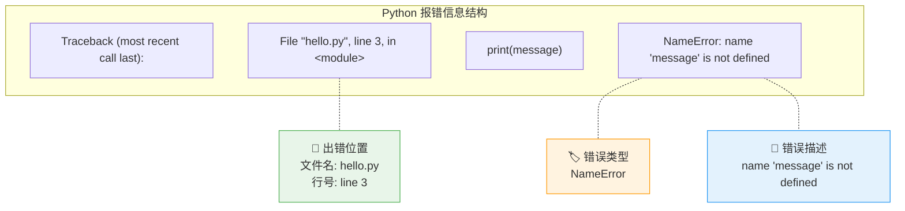

# 定位关键词

> **所属路径**：`00_高中复习/02_英语基础/02_阅读报错信息/01_定位关键词`
> **预计学习时间**：40–50 分钟
> **难度等级**：⭐

---

## 前置知识

- [编程英文词汇](../../01_技术词汇/02_编程英文词汇/02_编程英文词汇.md)

> 如果你还不熟悉 error（错误）、variable（变量）、function（函数）等基础编程词汇，建议先完成上述课程再继续。

---

## 学习目标

完成本节后，你将能够：

1. 在一段英文报错信息中快速定位出**错误类型**、**错误描述**和**出错位置**三个关键部分
2. 解释 Python 报错信息中 `SyntaxError`、`TypeError`、`NameError` 等错误类型名称的含义
3. 根据文件名和行号定位代码中出错的具体位置
4. 运用"类型 → 描述 → 位置"的三步法快速理解一条报错信息

---

## 正文讲解

### 1. 报错信息不是"敌人"，而是"线索"

如果你玩过侦探游戏，你会知道破案的关键在于从一堆线索中找出最重要的那几条。阅读报错信息也是同样的道理——屏幕上可能出现好几行英文，但你不需要逐字翻译每一个单词，只需要找到几个关键部分，就能明白出了什么问题。

让我们从一个真实的 Python 报错信息开始：

```
Traceback (most recent call last):
  File "hello.py", line 3, in <module>
    print(message)
NameError: name 'message' is not defined
```

第一次看到这段文字，你可能会有些紧张。但别担心，接下来我们一步步拆解它，你会发现它比想象中简单得多。

### 2. 报错信息的三个核心部分

每一条 Python **报错信息（Error Message）** 都包含三个核心部分，就像一份"事故报告"：

1. **错误类型（Error Type）** ——发生了什么类型的错误？
2. **错误描述（Error Description）** ——具体出了什么问题？
3. **出错位置（Error Location）** ——在哪个文件的哪一行出了错？

我们用一张图来看它们在报错信息中的位置：



> 📌 **图解说明**：这张图展示了一条完整的 Python 报错信息的结构。绿色框标注了出错位置（文件名和行号），橙色框标注了错误类型，蓝色框标注了错误描述。阅读报错时，你的目光应该先跳到最后一行，再回看位置信息。

### 3. 第一步：找到错误类型

**错误类型（Error Type）** 是报错信息中最重要的关键词。它总是出现在报错信息**最后一行**的**冒号之前**，是一个首字母大写、以 `Error` 结尾的英文单词。

让我们看几个常见的例子：

| 报错最后一行 | 错误类型 | 含义 |
| ------------ | -------- | ---- |
| `SyntaxError: invalid syntax` | SyntaxError | 语法错误——代码写法不符合规则 |
| `TypeError: unsupported operand type(s)` | TypeError | 类型错误——数据类型用错了 |
| `NameError: name 'x' is not defined` | NameError | 名称错误——使用了未定义的名称 |
| `IndexError: list index out of range` | IndexError | 索引错误——超出了列表范围 |
| `FileNotFoundError: No such file or directory` | FileNotFoundError | 文件未找到——指定的文件不存在 |

> 💡 **窍门**：错误类型的命名非常直观。`Syntax` 是"语法"，`Type` 是"类型"，`Name` 是"名称"，`Index` 是"索引"，`File` 是"文件"——把前缀翻译成中文，再加上"错误"，就能大致理解这个错误的类别。

### 4. 第二步：阅读错误描述

紧跟在错误类型后面、冒号之后的部分就是 **错误描述（Error Description）** 。它用一句简短的英文告诉你具体出了什么问题。

让我们逐条解读几个常见的错误描述：

**示例 1**：`NameError: name 'message' is not defined`

- `name 'message'`：名为 `message` 的东西
- `is not defined`：没有被定义

翻译：名为 `message` 的变量没有被定义。也就是说，你试图使用一个叫 `message` 的东西，但 Python 不知道它是什么。

**示例 2**：`TypeError: can only concatenate str (not "int") to str`

- `can only concatenate`：只能连接
- `str`：字符串（string 的缩写）
- `not "int"`：不是整数（integer 的缩写）

翻译：只能把字符串和字符串连接在一起，不能把整数和字符串连接。

**示例 3**：`SyntaxError: unexpected EOF while parsing`

- `unexpected`：意料之外的
- `EOF`：End Of File 的缩写，表示"文件结尾"
- `while parsing`：在解析的时候

翻译：Python 在读取代码时，意外地读到了文件末尾——通常意味着少写了一个括号或引号。

> 💡 **窍门**：错误描述中的单词往往反复出现。记住 `not defined`（未定义）、`not found`（未找到）、`invalid`（无效的）、`unexpected`（意外的）这几个高频短语，就能理解大部分错误描述。

### 5. 第三步：定位出错位置

现在你知道了"什么类型的错误"和"具体什么问题"，接下来需要知道"在哪里出了错"。位置信息通常出现在报错信息的中间部分，格式为：

```
File "文件名", line 行号, in 函数名
```

让我们看一个完整的例子：

```
Traceback (most recent call last):
  File "calculator.py", line 5, in <module>
    result = 10 / 0
ZeroDivisionError: division by zero
```

从这条报错中，我们可以提取出：

- **文件名**：`calculator.py`——出错的代码在 `calculator.py` 这个文件中
- **行号**：`line 5`——出错的代码在第 5 行
- **函数名**：`<module>`——出错在主程序中（不在任何函数内部）
- **出错代码**：`result = 10 / 0`——就是这一行代码导致了错误
- **错误类型**：`ZeroDivisionError`——除以零的错误
- **错误描述**：`division by zero`——除以零

### 6. 三步法：一个完整的实战流程

让我们用"三步法"来分析一个新的报错信息：

```
Traceback (most recent call last):
  File "grades.py", line 8, in <module>
    average = total / count
TypeError: unsupported operand type(s) for /: 'str' and 'int'
```

**第一步：找错误类型** → `TypeError`（类型错误）

**第二步：读错误描述** → `unsupported operand type(s) for /: 'str' and 'int'`
- `unsupported operand type(s)`：不支持的操作数类型
- `for /`：用于除法运算
- `'str' and 'int'`：字符串和整数

翻译：不能用除法运算符 `/` 对字符串和整数进行计算。

**第三步：看出错位置** → 文件 `grades.py` 的第 8 行，代码是 `average = total / count`

**结论**：在 `grades.py` 第 8 行，变量 `total` 或 `count` 中有一个是字符串类型而不是数字类型，导致无法执行除法。


> 📌 **图解说明**：这张流程图展示了阅读报错信息的三步法：先找类型、再读描述、最后看位置。养成这个习惯后，面对任何报错信息你都能从容应对。

### 7. 报错信息中的高频英文词汇

下面这张表汇总了报错信息中最常出现的英文词汇，建议收藏备查：

| 英文 | 中文含义 | 出现场景 |
| ---- | -------- | -------- |
| Error | 错误 | 所有报错的核心词 |
| Traceback | 回溯/追踪 | 报错开头，表示错误追踪信息 |
| File | 文件 | 出错文件的路径 |
| line | 行 | 出错代码的行号 |
| defined | 已定义 | NameError 中常见 |
| invalid | 无效的 | SyntaxError 中常见 |
| unexpected | 意外的 | 不该出现的东西出现了 |
| not found | 未找到 | 找不到文件或模块 |
| unsupported | 不支持的 | 不支持某种操作 |
| index | 索引 | 列表位置相关错误 |
| type | 类型 | 数据类型相关错误 |
| module | 模块 | 主程序或导入的包 |
| argument | 参数 | 函数调用时传入的值 |
| attribute | 属性 | 对象上的特征或方法 |

---

## 动手实践

下面给出三条 Python 报错信息，请你运用三步法，分别提取出错误类型、错误描述和出错位置。

**报错信息 A**：

```
Traceback (most recent call last):
  File "main.py", line 12, in <module>
    names[5]
IndexError: list index out of range
```

**报错信息 B**：

```
Traceback (most recent call last):
  File "app.py", line 3, in <module>
    import pandas
ModuleNotFoundError: No module named 'pandas'
```

**报错信息 C**：

```
  File "test.py", line 7
    if x == 5
           ^
SyntaxError: expected ':'
```

请尝试用以下表格格式整理你的分析结果：

| | 错误类型 | 错误描述（中文翻译） | 文件名 | 行号 |
| --- | -------- | -------------------- | ------ | ---- |
| A | ? | ? | ? | ? |
| B | ? | ? | ? | ? |
| C | ? | ? | ? | ? |

<details>
<summary>✅ 参考答案</summary>

| | 错误类型 | 错误描述（中文翻译） | 文件名 | 行号 |
| --- | -------- | -------------------- | ------ | ---- |
| A | IndexError | 列表索引超出范围 | main.py | 12 |
| B | ModuleNotFoundError | 没有找到名为 'pandas' 的模块 | app.py | 3 |
| C | SyntaxError | 缺少冒号 `:` | test.py | 7 |

**注意**：报错 C 比较特殊——它是一个 SyntaxError，报错格式略有不同：没有 `Traceback` 开头，而是直接显示出错文件和行号，并用 `^` 符号指向出错的具体位置。这是因为语法错误在代码执行之前就被检测到了。

</details>

---

## 典型误区

| 误区 | 正确理解 |
| ---- | -------- |
| 报错信息太长了，看不懂就放弃 | 不需要读懂每一个字，只需关注错误类型、错误描述和出错位置三个部分 |
| 报错信息说我代码写错了，程序在批评我 | 报错信息是程序在帮你定位问题，它是你的调试助手，不是批评者 |
| 看到 Error 就害怕，觉得是严重问题 | 初学者 90% 的报错都是拼写错误、缺少符号等小问题，修复起来很简单 |
| 只关注最后一行，忽略出错位置 | 错误类型和描述告诉你"什么问题"，但出错位置告诉你"在哪里修"，两者都很重要 |

---

## 练习题

### 练习 1：识别错误类型（难度：⭐）

阅读下面的报错信息，回答：错误类型是什么？这个类型名称中的 `Attribute` 是什么意思？

```
Traceback (most recent call last):
  File "demo.py", line 4, in <module>
    "hello".append("!")
AttributeError: 'str' object has no attribute 'append'
```

<details>
<summary>💡 提示</summary>

错误类型在最后一行的冒号之前。`Attribute` 在编程中指"属性"或"方法"——对象拥有的特征或能执行的操作。

</details>

<details>
<summary>✅ 参考答案</summary>

错误类型是 `AttributeError`（属性错误）。

`Attribute` 意思是"属性"。这条报错的含义是：字符串（`str`）对象没有 `append`（追加）这个属性/方法。`append` 是列表（list）才有的方法，字符串没有这个操作。

</details>

### 练习 2：完整三步分析（难度：⭐）

用三步法分析下面的报错信息，写出错误类型、错误描述的中文翻译，以及出错位置。

```
Traceback (most recent call last):
  File "convert.py", line 10, in <module>
    number = int("abc")
ValueError: invalid literal for int() with base 10: 'abc'
```

<details>
<summary>💡 提示</summary>

- `Value` 是"值"的意思
- `literal` 是"字面量"，可以理解为"写在代码里的值"
- `base 10` 是"十进制"

</details>

<details>
<summary>✅ 参考答案</summary>

**第一步——错误类型**：`ValueError`（值错误）

**第二步——错误描述**：`invalid literal for int() with base 10: 'abc'` → 用十进制的 `int()` 函数转换时，遇到了无效的字面量 `'abc'`。简单说就是：`'abc'` 不是一个合法的数字，无法转换为整数。

**第三步——出错位置**：文件 `convert.py`，第 10 行，代码 `number = int("abc")`。

</details>

### 练习 3：高频词汇配对（难度：⭐）

将左边的英文词汇与右边的中文含义连线：

| 英文 | 中文 |
| ---- | ---- |
| 1. defined | a. 无效的 |
| 2. unexpected | b. 已定义 |
| 3. invalid | c. 未找到 |
| 4. not found | d. 意外的 |
| 5. unsupported | e. 不支持的 |

<details>
<summary>✅ 参考答案</summary>

1-b、2-d、3-a、4-c、5-e

- defined = 已定义（`not defined` = 未定义）
- unexpected = 意外的
- invalid = 无效的
- not found = 未找到
- unsupported = 不支持的

</details>

---

## 下一步学习

- 📖 下一个知识点：[理解堆栈信息](../02_理解堆栈信息/02_理解堆栈信息.md)
- 🔗 相关知识点：[编程英文词汇](../../01_技术词汇/02_编程英文词汇/02_编程英文词汇.md)
- 📚 拓展阅读：[常见报错模式归纳](../04_常见报错模式归纳/04_常见报错模式归纳.md)（学完全部课程后可用作速查手册）

---

## 参考资料

1. [Python Errors and Exceptions](https://docs.python.org/3/tutorial/errors.html) — Python 官方教程中关于错误和异常的章节（官方文档）
2. [Python Built-in Exceptions](https://docs.python.org/3/library/exceptions.html) — Python 内置异常类型的完整列表和说明（官方文档）
3. [How to Read Python Error Messages](https://realpython.com/python-traceback/) — Real Python 网站关于如何阅读 Python 报错信息的教程（公开教程）
