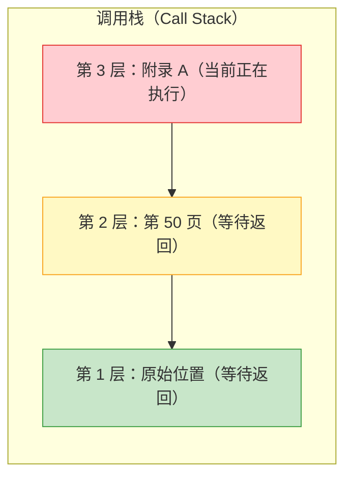
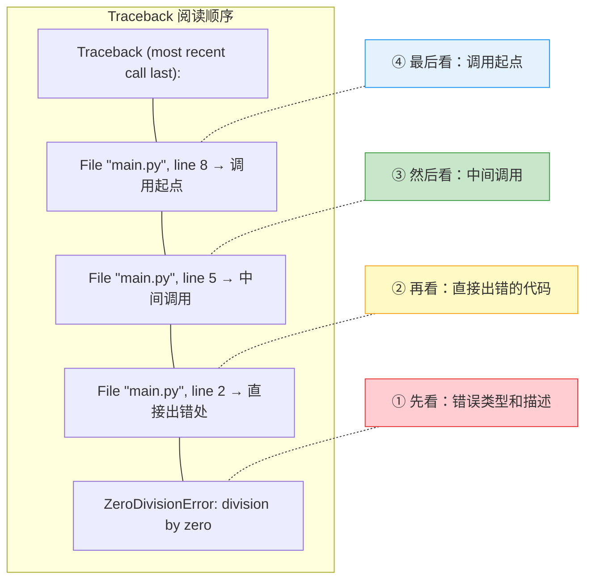

# 理解堆栈信息

> **所属路径**：`00_高中复习/02_英语基础/02_阅读报错信息/02_理解堆栈信息`
> **预计学习时间**：45–55 分钟
> **难度等级**：⭐⭐

---

## 前置知识

- [定位关键词](../01_定位关键词/01_定位关键词.md)
- [编程英文词汇](../../01_技术词汇/02_编程英文词汇/02_编程英文词汇.md)

> 如果你还不知道如何在报错信息中找到错误类型、错误描述和出错位置，请先完成"定位关键词"课程。

---

## 学习目标

完成本节后，你将能够：

1. 用自己的话解释什么是 **堆栈追踪（Stack Trace）** 以及它为什么存在
2. 从底部向上阅读 Python 的 Traceback 信息，准确找到错误的直接原因
3. 区分报错信息中"你自己写的代码"和"系统/库的代码"
4. 理解多层函数调用时报错信息变长的原因

---

## 正文讲解

### 1. 从一个生活场景说起

想象你在一家快餐店点了一份汉堡，但端上来的汉堡肉饼是生的。你向服务员投诉，服务员说："这是后厨做的。"你找到后厨，厨师说："这是供应商送来的半成品。"你打电话给供应商，供应商说："这批肉的温度确实不够。"

你看到了吗？从"你投诉"到"找到根本原因"，经过了一个逐层追溯的过程：

```
你的投诉 → 服务员 → 厨师 → 供应商（根本原因）
```

Python 中的 **堆栈追踪（Stack Trace）** 做的事情和这个过程一模一样——它告诉你，错误是如何从一个函数传到另一个函数，最终暴露出来的。在 Python 中，堆栈追踪以 `Traceback` 开头，所以也叫做 **回溯信息（Traceback）** 。

### 2. 什么是"调用栈"？

在理解堆栈追踪之前，我们先用一个类比来理解 **调用栈（Call Stack）** 的概念。

想象你在读一本书，读到某个地方，书上说"关于这个概念的详细解释，请翻到第 50 页"。于是你在当前页夹一个书签，翻到第 50 页继续读。第 50 页又说"这个公式的推导见附录 A"。你又夹一个书签，翻到附录 A。

现在你手里有两个书签：
- 书签 1：原来读到的地方
- 书签 2：第 50 页

读完附录 A 后，你取出书签 2 回到第 50 页，读完后取出书签 1 回到原来的地方。

这叠书签就是一个"栈"——**后放的书签先取出**（Last In, First Out）。程序执行函数调用时，也是同样的道理：每调用一个新函数，就"压入"一层记录；函数执行完毕，就"弹出"这层记录。



> 📌 **图解说明**：这张图展示了调用栈的层级结构。红色的第 3 层是当前正在执行的位置——如果这里出了错，Python 会把整个"书签堆"都告诉你，让你看到错误是从哪里一步步走过来的。

### 3. 阅读 Python Traceback 的核心规则

现在让我们看一个真实的 Python 堆栈追踪信息：

```
Traceback (most recent call last):
  File "main.py", line 8, in <module>
    result = calculate_average([10, 20, 30])
  File "main.py", line 5, in calculate_average
    return total / count
  File "main.py", line 2, in divide
    return a / b
ZeroDivisionError: division by zero
```

Python 的 Traceback 有一个关键短语：**most recent call last**，意思是"最近的调用在最后面"。换句话说：

> **从下往上读**：最下面一条是直接导致错误的代码，越往上是越早的调用。

让我们从下往上解读这条堆栈信息：

**第 1 步（最底部）** ——错误类型和描述：
```
ZeroDivisionError: division by zero
```
除以零的错误。

**第 2 步（倒数第二段）** ——直接出错的代码：
```
  File "main.py", line 2, in divide
    return a / b
```
在 `main.py` 文件的第 2 行，`divide` 函数内部，执行 `return a / b` 时出了错。

**第 3 步（再往上一段）** ——谁调用了出错的函数：
```
  File "main.py", line 5, in calculate_average
    return total / count
```
是 `calculate_average` 函数的第 5 行调用了导致问题的代码。

**第 4 步（最顶部）** ——最初的调用起点：
```
  File "main.py", line 8, in <module>
    result = calculate_average([10, 20, 30])
```
主程序的第 8 行调用了 `calculate_average` 函数，这是整个调用链的起点。

### 4. 从底部向上：阅读顺序图解

让我们用一张图来总结阅读 Traceback 的正确顺序：



> 📌 **图解说明**：阅读 Traceback 的正确顺序是**从底向上**。先看最后一行的错误类型和描述（①），再看直接出错的代码行（②），然后追溯中间调用（③），最后看调用起点（④）。

### 5. 区分"我的代码"和"系统代码"

当你使用别人编写的库（比如 `pandas`、`numpy`）时，堆栈追踪可能会变得很长，其中大部分是库内部的代码。新手最常犯的错误就是被这些不相关的行吓到。

来看一个例子：

```
Traceback (most recent call last):
  File "analysis.py", line 3, in <module>
    import pandas as pd
  File "/usr/lib/python3/pandas/__init__.py", line 22, in <module>
    from pandas.compat import ...
  File "/usr/lib/python3/pandas/compat/__init__.py", line 15, in <module>
    import dateutil
ModuleNotFoundError: No module named 'dateutil'
```

这个堆栈追踪有 3 层，但大部分是库内部的代码。你应该这样区分：

| 特征 | 你的代码 | 系统/库的代码 |
| ---- | -------- | ------------- |
| 文件路径 | 短文件名，如 `analysis.py` | 长路径，包含 `/usr/lib/` 或 `site-packages/` |
| 可修改性 | 你可以修改 | 通常不需要修改 |
| 关注优先级 | **优先关注** | 了解即可 |

> 💡 **实用经验**：在一个很长的堆栈追踪中，先从底部看错误类型和描述，然后**向上扫描，找到第一个属于你自己文件的行**——那通常就是你需要修改的地方。

### 6. 简单堆栈和复杂堆栈

有时候，堆栈追踪只有一层（错误直接发生在你的主程序中），非常简单：

```
Traceback (most recent call last):
  File "hello.py", line 1, in <module>
    print("Hello" + 123)
TypeError: can only concatenate str (not "int") to str
```

这种情况下，问题就出在你写的那一行代码上，定位起来非常直观。

但有时候，堆栈追踪可能有 5 层甚至更多。遇到这种情况不要慌——记住两个原则：

1. **从底向上读**：错误类型和描述永远在最后
2. **找自己的代码**：在层层追踪中，优先关注属于你自己文件的那些行

### 7. Traceback 关键英文词汇

| 英文 | 中文含义 | 说明 |
| ---- | -------- | ---- |
| Traceback | 回溯/追踪 | 堆栈追踪信息的开头标志 |
| most recent call last | 最近的调用在最后 | 说明阅读顺序应该从下往上 |
| File | 文件 | 后面跟着文件名 |
| line | 行 | 后面跟着行号 |
| in | 在……中 | 后面跟着函数名或 `<module>` |
| `<module>` | 主模块 | 表示代码不在任何函数内部，在主程序中 |
| call | 调用 | 函数被调用执行 |
| stack | 栈 | 一种后进先出的数据结构 |

---

## 动手实践

下面是一条 Python 报错信息，请你按照从底向上的顺序完成分析。

```
Traceback (most recent call last):
  File "shop.py", line 15, in <module>
    show_receipt(items)
  File "shop.py", line 10, in show_receipt
    total = sum_prices(item_list)
  File "shop.py", line 5, in sum_prices
    running_total += price
TypeError: unsupported operand type(s) for +=: 'int' and 'str'
```

请依次回答：

1. **错误类型**是什么？用中文解释这个类型的含义。
2. **错误描述**说了什么？翻译成中文。
3. **直接出错**的代码在哪个文件、哪一行、哪个函数中？
4. 这个错误是通过怎样的**调用链**传递到用户面前的？
5. 这条堆栈追踪有几层？哪些是"你的代码"？

<details>
<summary>✅ 参考答案</summary>

1. **错误类型**：`TypeError`（类型错误）——数据类型不匹配，导致操作无法执行。

2. **错误描述**：`unsupported operand type(s) for +=: 'int' and 'str'` → 不支持对整数（int）和字符串（str）使用 `+=` 运算符。简单说就是：试图把一个字符串加到一个数字上，Python 不知道怎么做。

3. **直接出错处**：文件 `shop.py`，第 5 行，`sum_prices` 函数中的 `running_total += price`。

4. **调用链**：主程序第 15 行调用了 `show_receipt` → `show_receipt` 第 10 行调用了 `sum_prices` → `sum_prices` 第 5 行执行 `running_total += price` 时出错。

5. 堆栈追踪有 **3 层**，文件路径都是 `shop.py`，全部是你自己的代码（没有系统/库的代码出现）。

</details>

---

## 典型误区

| 误区 | 正确理解 |
| ---- | -------- |
| 从上往下读 Traceback | Python 的 Traceback 应该从底向上读，最后一行的错误类型和描述最重要 |
| 堆栈追踪越长，问题越严重 | 长度只反映调用层数的深度，与问题严重程度无关 |
| 堆栈追踪中每一行都需要仔细看 | 优先关注底部的错误信息和属于你自己代码的行 |
| 看到陌生路径就害怕 | 那些是系统或第三方库的内部代码，通常不需要你修改 |
| `<module>` 是一个你应该认识的函数名 | 它只是表示"主程序"（不在任何函数内部），不是一个真正的函数名 |

---

## 练习题

### 练习 1：阅读顺序排序（难度：⭐）

下面哪个是阅读 Python Traceback 的正确顺序？

A. 从第一行开始，逐行向下阅读
B. 先看最后一行的错误类型和描述，再从底向上看出错位置
C. 只看包含 `File` 的行，忽略其他内容
D. 随机查看任意一行

<details>
<summary>✅ 参考答案</summary>

**B**。先看最后一行的错误类型和描述（了解发生了什么错误），再从底向上追溯出错位置（了解错误从哪里传递过来的）。

</details>

### 练习 2：区分我的代码和库代码（难度：⭐⭐）

下面的堆栈追踪中，哪些行是"你的代码"，哪些行是"库的代码"？

```
Traceback (most recent call last):
  File "train.py", line 12, in <module>
    model.fit(X, y)
  File "/home/user/.local/lib/python3.10/site-packages/sklearn/linear_model/_base.py", line 684, in fit
    X, y = self._validate_data(X, y)
  File "/home/user/.local/lib/python3.10/site-packages/sklearn/base.py", line 596, in _validate_data
    X, y = check_X_y(X, y)
ValueError: could not convert string to float: 'abc'
```

<details>
<summary>💡 提示</summary>

观察文件路径：你自己写的代码通常是简单的文件名（如 `train.py`），而库代码的路径中会包含 `site-packages` 或 `/usr/lib/` 等字样。

</details>

<details>
<summary>✅ 参考答案</summary>

- **你的代码**：`File "train.py", line 12` — 你写的 `train.py` 文件，第 12 行调用了 `model.fit(X, y)`
- **库的代码**：后面两行都包含 `site-packages/sklearn/` 路径，属于 scikit-learn 库的内部代码

**结论**：错误类型是 `ValueError`，描述是"不能把字符串 `'abc'` 转换为浮点数"。问题出在你传给 `model.fit()` 的数据 `X` 中包含了字符串 `'abc'`，应该在调用之前清理数据。你应该修改 `train.py` 第 12 行之前的数据处理代码，而不是去修改 sklearn 库。

</details>

### 练习 3：翻译堆栈关键短语（难度：⭐）

将以下 Traceback 中出现的英文短语翻译成中文：

1. `Traceback (most recent call last)`
2. `File "main.py", line 5, in calculate`
3. `ZeroDivisionError: division by zero`

<details>
<summary>✅ 参考答案</summary>

1. `Traceback (most recent call last)` → 回溯信息（最近的调用在最后面）
2. `File "main.py", line 5, in calculate` → 文件 "main.py"，第 5 行，在 `calculate` 函数中
3. `ZeroDivisionError: division by zero` → 除以零错误：除以零

</details>

---

## 下一步学习

- 📖 下一个知识点：[搜索报错](../03_搜索报错/03_搜索报错.md)
- 🔗 相关知识点：[定位关键词](../01_定位关键词/01_定位关键词.md)
- 📚 拓展阅读：[常见报错模式归纳](../04_常见报错模式归纳/04_常见报错模式归纳.md)

---

## 参考资料

1. [Python Errors and Exceptions](https://docs.python.org/3/tutorial/errors.html) — Python 官方教程中关于错误和异常的章节（官方文档）
2. [Understanding the Python Traceback](https://realpython.com/python-traceback/) — Real Python 上深入讲解 Traceback 的教程（公开教程）
3. [Python Stack Trace - How to Read and Understand It](https://rollbar.com/blog/python-stack-trace/) — Rollbar 博客上关于理解 Python 堆栈追踪的教程（公开博客）
