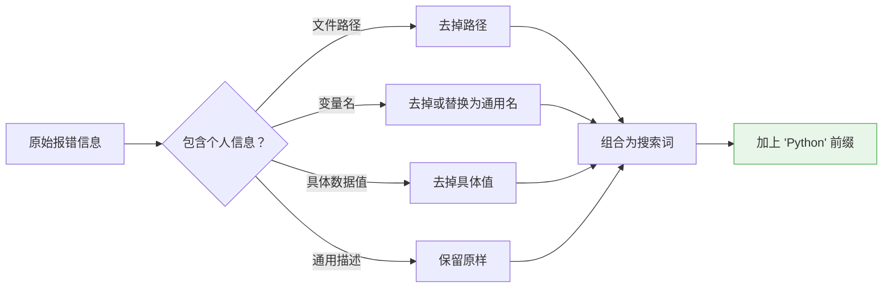
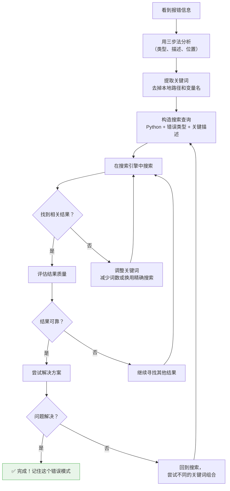

# 搜索报错

> **所属路径**：`00_高中复习/02_英语基础/02_阅读报错信息/03_搜索报错`
> **预计学习时间**：35–45 分钟
> **难度等级**：⭐

---

## 前置知识

- [定位关键词](../01_定位关键词/01_定位关键词.md)
- [理解堆栈信息](../02_理解堆栈信息/02_理解堆栈信息.md)
- [搜索与资料检索](../../../03_信息素养/02_搜索与资料检索/)

> 你需要先掌握如何在报错信息中找到错误类型和描述，才能有效地搜索解决方案。如果你对基本的搜索技巧还不熟悉，建议先了解"搜索与资料检索"中的内容。

---

## 学习目标

完成本节后，你将能够：

1. 从报错信息中提取出适合搜索的关键词
2. 运用"去除本地化信息"等技巧构造高效的搜索查询
3. 在 Stack Overflow、GitHub Issues 和官方文档中定位高质量答案
4. 评估搜索结果的可靠性和适用性

---

## 正文讲解

### 1. 你不是第一个遇到这个错误的人

这句话可能是你在整个编程学习过程中最需要记住的一句话。无论你遇到什么报错信息，世界上几乎肯定有人在你之前遇到过同样的问题，并且已经有人在网上给出了解答。你要做的，就是学会高效地找到这些答案。

报错信息的英文描述看起来可能很陌生，但正因为它是标准化的英文文本，它反而成了搜索的最佳素材——全世界的 Python 开发者看到的都是同样的英文报错。

### 2. 从报错信息中提取搜索关键词

在前两个知识点中，你已经学会了用"三步法"分析报错信息。现在我们来学习如何把分析结果变成搜索查询。

**核心规则：搜索"错误类型 + 错误描述的关键部分"。**

以这条报错为例：

```
Traceback (most recent call last):
  File "/home/zhangsan/projects/homework/main.py", line 12, in <module>
    data = json.loads(user_input)
json.decoder.JSONDecodeError: Expecting value: line 1 column 1 (char 0)
```

提取搜索关键词的步骤：

| 步骤 | 操作 | 结果 |
| ---- | ---- | ---- |
| 1. 找到错误类型 | 最后一行冒号前 | `JSONDecodeError` |
| 2. 找到错误描述 | 最后一行冒号后 | `Expecting value: line 1 column 1 (char 0)` |
| 3. 组合搜索词 | 类型 + 描述关键部分 | `Python JSONDecodeError Expecting value` |

> 💡 **窍门**：在搜索词开头加上 `Python` 可以帮助搜索引擎理解你要找的是 Python 相关的内容，避免返回其他编程语言的结果。

### 3. 去除本地化信息

报错信息中有一些内容是只属于你的电脑的——比如文件路径、变量名、具体的数据值。这些信息在搜索时应该**去掉**，因为别人的电脑上不会有同样的路径和变量名。

让我们看几个例子：

**例 1**：
```
FileNotFoundError: [Errno 2] No such file or directory: '/home/zhangsan/data/report.csv'
```

- ❌ 错误搜索：`FileNotFoundError /home/zhangsan/data/report.csv`
- ✅ 正确搜索：`Python FileNotFoundError No such file or directory`

**例 2**：
```
NameError: name 'my_special_variable' is not defined
```

- ❌ 错误搜索：`NameError name 'my_special_variable' is not defined`
- ✅ 正确搜索：`Python NameError name is not defined`

**例 3**：
```
IndexError: list index out of range
```

- ✅ 直接搜索：`Python IndexError list index out of range`（这条描述已经很通用，无需修改）

**去除原则总结**：



> 📌 **图解说明**：构造搜索查询时，需要判断报错描述中是否包含个人化信息。文件路径、变量名和具体数据值应该去掉，保留通用的错误描述部分，最后在前面加上 `Python` 限定范围。

### 4. 高级搜索技巧

掌握了基本的关键词提取后，这里有几个能显著提升搜索效率的技巧：

**技巧一：使用引号进行精确匹配**

在搜索引擎中，用双引号包裹一段文字，可以要求搜索引擎精确匹配这段文字，而不是拆散成单独的词来搜索。

- 普通搜索：`Python TypeError unsupported operand type`
- 精确搜索：`Python "unsupported operand type(s) for"`

精确搜索在错误描述较长或包含特殊短语时特别有用。

**技巧二：用 site: 限定搜索范围**

如果你想只在某个网站内搜索，可以使用 `site:` 前缀：

- `site:stackoverflow.com Python NameError is not defined`
- `site:github.com Python ImportError cannot import name`
- `site:docs.python.org TypeError`

**技巧三：添加版本号**

如果你使用的是特定版本的 Python 或某个库，在搜索中加上版本号可以得到更精准的结果：

- `Python 3.10 SyntaxError match case`
- `pandas 2.0 FutureWarning`

### 5. 去哪里找答案？

不同的搜索目的地适合不同的情况：

| 目的地 | 网址 | 适合的场景 | 特点 |
| ------ | ---- | ---------- | ---- |
| Stack Overflow | stackoverflow.com | 通用编程问题 | 有投票和采纳机制，高票答案通常可靠 |
| GitHub Issues | github.com | 特定库的 bug 或使用问题 | 可以看到开发者的官方回复 |
| Python 官方文档 | docs.python.org | 理解内置功能和错误类型 | 最权威，但可能偏技术性 |
| Real Python | realpython.com | 需要详细教程级解释 | 面向初学者，解释清晰 |
| CSDN / 博客园 | csdn.net / cnblogs.com | 中文解答 | 中文内容，理解门槛低 |

> 💡 **建议**：优先搜索英文资源（Stack Overflow、官方文档），因为报错信息本身就是英文的，英文搜索匹配度更高。如果英文结果看不太懂，再搜索中文资源作为补充。

### 6. 如何评估搜索结果的质量

找到搜索结果后，你还需要判断这些结果是否可靠和适用。这里有几条实用的评估标准：

**在 Stack Overflow 上**：
- ✅ 看投票数（upvotes）：高票答案通常经过了社区验证
- ✅ 看是否有绿色对勾（accepted answer）：表示提问者确认此答案解决了问题
- ✅ 看回答时间：Python 更新较快，优先选择近几年的回答
- ⚠️ 注意：高票但年代久远的答案可能已过时

**在 GitHub Issues 上**：
- ✅ 看 issue 是否已关闭（closed）：关闭通常意味着问题已解决
- ✅ 看维护者（maintainer）的回复：带有 "Member" 或 "Owner" 标签的回复更权威
- ⚠️ 注意：issue 中的讨论可能很长，直接跳到最后几条回复通常能看到结论

**通用评估标准**：

| 信号 | 可信度 |
| ---- | ------ |
| 有代码示例并附有解释 | 较高 |
| 多人回复并达成共识 | 较高 |
| 只有文字描述没有代码 | 一般 |
| 回答很短，语焉不详 | 较低 |
| 有人评论说"这个不对" | 需要继续寻找 |

### 7. 搜索报错的完整流程

让我们把整个过程串联起来，形成一个完整的工作流程：



> 📌 **图解说明**：这张流程图展示了搜索报错的完整流程。关键在于：搜索是一个迭代过程——如果第一次搜索没有找到好答案，调整关键词再试一次是完全正常的。

---

## 动手实践

下面给出三条报错信息，请你为每一条构造出一个合适的搜索查询。

**报错 1**：
```
Traceback (most recent call last):
  File "/Users/lihua/Desktop/project/analysis.py", line 7, in <module>
    df = pd.read_csv("data.csv")
FileNotFoundError: [Errno 2] No such file or directory: 'data.csv'
```

**报错 2**：
```
Traceback (most recent call last):
  File "homework.py", line 5, in <module>
    result = my_list[10]
IndexError: list index out of range
```

**报错 3**：
```
Traceback (most recent call last):
  File "app.py", line 2, in <module>
    from flask import Flask
ModuleNotFoundError: No module named 'flask'
```

<details>
<summary>✅ 参考答案</summary>

**报错 1 的搜索查询**：

- 推荐：`Python FileNotFoundError No such file or directory read_csv`
- 说明：去掉了个人路径 `/Users/lihua/Desktop/project/`，去掉了具体文件名 `data.csv`，保留了通用错误描述并加入了关键函数名 `read_csv` 以缩小范围。

**报错 2 的搜索查询**：

- 推荐：`Python IndexError list index out of range`
- 说明：这条报错的描述已经很通用，直接搜索即可。

**报错 3 的搜索查询**：

- 推荐：`Python ModuleNotFoundError No module named flask`
- 说明：模块名 `flask` 保留（它不是个人信息，而是一个公共库的名称），去掉了本地文件信息。

</details>

---

## 搜索报错常用语块

在搜索和阅读 Stack Overflow 答案时，以下语块非常常见：

| 语块 | 中文含义 | 使用场景 |
| ---- | -------- | -------- |
| `How to fix ...` | 如何修复… | 搜索时常用的提问句式 |
| `I'm getting an error ...` | 我遇到了一个错误… | Stack Overflow 上提问的常见开头 |
| `This is because ...` | 这是因为… | 回答中解释原因的常见句式 |
| `You need to ...` | 你需要… | 回答中给出解决方案的常见句式 |
| `Try using ... instead` | 试试用…代替 | 推荐替代方案 |
| `Make sure that ...` | 确保… | 检查清单式的建议 |
| `This error occurs when ...` | 这个错误发生在…时 | 解释触发条件 |
| `As of version ...` | 从…版本起 | 说明版本相关的变化 |
| `This has been deprecated` | 这已经被弃用了 | 提示某个功能已过时 |
| `Works for me` / `Worked!` | 对我有用 / 有效！ | 确认解决方案有效的反馈 |

> 💡 **搜索技巧语块**：在搜索引擎中使用 `Python "错误描述"` 格式（引号精确匹配），加上 `site:stackoverflow.com` 可以限定在 Stack Overflow 中搜索。

---

## 记忆策略

### 搜索模板法

把以下搜索模板记住，遇到报错时直接套用：

1. `Python {错误类型} {关键描述}` — 最通用的搜索格式
2. `Python "{完整错误描述}"` — 精确匹配
3. `{库名} {错误类型} {关键描述}` — 第三方库相关的错误
4. `{错误类型} site:stackoverflow.com` — 限定搜索范围

### 间隔复习建议

| 复习时间 | 建议方式 |
| -------- | -------- |
| 当天 | 浏览"搜索报错常用语块"表格 |
| 第 3 天 | 故意触发一个 Python 错误，用本节方法搜索解决方案 |
| 第 7 天 | 浏览 Stack Overflow 上 3 个 Python 相关问题的回答，识别常用语块 |
| 第 14 天 | 建立个人"搜索词模板"卡片 |

---

## 典型误区

| 误区 | 正确理解 |
| ---- | -------- |
| 把报错信息原封不动地粘贴到搜索引擎 | 应该提取关键词，去掉个人路径和变量名 |
| 只搜中文，不搜英文 | 报错信息是英文的，英文搜索匹配度更高，应优先搜英文 |
| 找到第一个结果就直接使用 | 应该评估结果的可靠性（投票数、时间、是否有代码示例） |
| 看不懂英文答案就放弃 | 很多答案附有代码示例，即使英文描述看不太懂，代码部分往往是通用的 |
| 搜不到就说明问题很特殊 | 更可能是搜索关键词不够精准，尝试调整关键词再搜一次 |

---

## 练习题

### 练习 1：构造搜索查询（难度：⭐）

下面的报错信息，哪个搜索查询最合适？

```
TypeError: 'int' object is not subscriptable
```

A. `TypeError int object is not subscriptable`
B. `Python "int object is not subscriptable"`
C. `Python TypeError 'int' object is not subscriptable`
D. `Python类型错误整数对象不可下标`

<details>
<summary>💡 提示</summary>

搜索时应该使用英文（因为报错是英文），包含 `Python` 前缀，保留错误类型和关键描述。引号可以帮助精确匹配，但要确保引号中的内容不会太长或太具体。

</details>

<details>
<summary>✅ 参考答案</summary>

**B 和 C 都是好的选择**。

- B 使用了精确匹配，能找到描述完全一致的结果
- C 保留了完整的错误信息，搜索引擎也能很好地匹配
- A 缺少 `Python` 前缀，可能匹配到其他语言的结果
- D 用了中文，虽然也能找到一些结果，但匹配度不如英文

</details>

### 练习 2：去除本地化信息（难度：⭐）

下面的报错信息中，哪些部分应该在搜索时去掉？

```
Traceback (most recent call last):
  File "C:\Users\WangWei\Documents\code\test.py", line 23, in <module>
    result = process_data(my_dataframe)
  File "C:\Users\WangWei\Documents\code\utils.py", line 10, in process_data
    return data.groupby("category").mean()
AttributeError: 'NoneType' object has no attribute 'groupby'
```

<details>
<summary>✅ 参考答案</summary>

应该去掉的本地化信息：
- 文件路径：`C:\Users\WangWei\Documents\code\test.py` 和 `C:\Users\WangWei\Documents\code\utils.py`
- 变量名：`my_dataframe`
- 具体的列名：`"category"`（可选，如果要搜通用问题则去掉）

推荐搜索查询：`Python AttributeError NoneType object has no attribute groupby`

这样搜索能找到大量关于"变量意外为 None 导致无法调用方法"的讨论。

</details>

### 练习 3：评估搜索结果（难度：⭐）

你在 Stack Overflow 上搜索到了两个结果，哪个更值得信赖？

**结果 A**：
- 标题匹配你的错误
- 回答时间：2019 年
- 投票数：3
- 没有被采纳（无绿色对勾）

**结果 B**：
- 标题匹配你的错误
- 回答时间：2023 年
- 投票数：127
- 已被采纳（有绿色对勾）

<details>
<summary>✅ 参考答案</summary>

**结果 B 更值得信赖**。原因：

1. 投票数更高（127 vs 3），说明经过了更多人的验证
2. 已被采纳，说明提问者确认答案有效
3. 时间更新（2023 年），更可能适用于当前版本的 Python

当然，结果 A 也不一定是错的——只是在有更好选择的情况下，应该优先查看结果 B。

</details>

---

## 下一步学习

- 📖 下一个知识点：[常见报错模式归纳](../04_常见报错模式归纳/04_常见报错模式归纳.md)
- 🔗 相关知识点：[搜索与资料检索](../../../03_信息素养/02_搜索与资料检索/)
- 📚 拓展阅读：在后续的 [阅读文档](../../03_阅读文档/) 课程中，你将学会如何阅读 Python 官方文档来深入理解错误类型

---

## 参考资料

1. [Stack Overflow](https://stackoverflow.com/) — 全球最大的编程问答社区，大部分 Python 报错都能在这里找到答案（公开社区）
2. [Python Documentation](https://docs.python.org/3/) — Python 官方文档，包含所有内置异常类型的权威说明（官方文档）
3. [How to Google Your Error Message](https://dev.to/swyx/how-to-google-your-errors-2l6o) — dev.to 上关于如何有效搜索报错信息的实用指南（公开博客）
