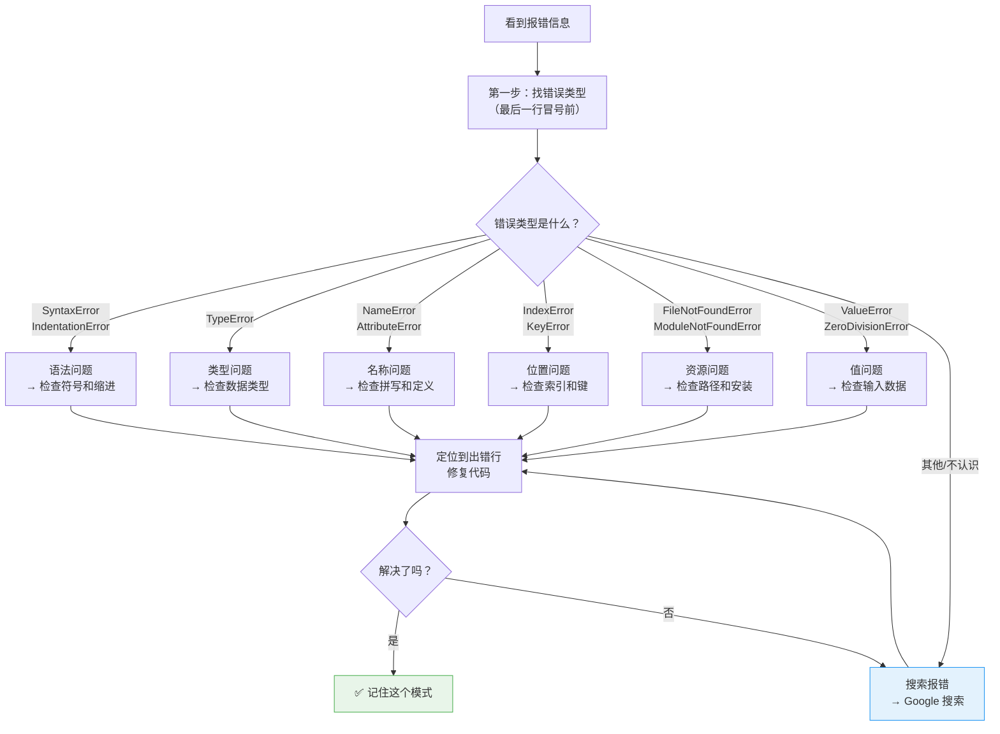
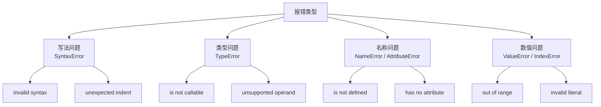

# 常见报错模式归纳

> **所属路径**：`00_高中复习/02_英语基础/02_阅读报错信息/04_常见报错模式归纳`
> **预计学习时间**：50–60 分钟
> **难度等级**：⭐⭐

---

## 前置知识

- [定位关键词](../01_定位关键词/01_定位关键词.md)
- [理解堆栈信息](../02_理解堆栈信息/02_理解堆栈信息.md)
- [搜索报错](../03_搜索报错/03_搜索报错.md)

> 本节是"阅读报错信息"主题的总结和归纳。你需要先掌握前三个知识点中的分析方法，才能更好地利用本节内容。

---

## 学习目标

完成本节后，你将能够：

1. 列举 Python 中 8 种以上常见的错误类型，并用中文解释其含义
2. 根据错误类型快速判断错误的大致原因
3. 运用本节归纳的"错误 → 原因 → 修复"对照表排查问题
4. 遇到陌生错误时，能按照分类思路缩小排查范围

---

## 正文讲解

### 1. 为什么要归纳错误模式

在前面三个知识点中，你学会了分析报错信息的"三步法"和搜索解决方案的技巧。但如果每次遇到错误都要从头分析、上网搜索，效率还是不够高。

有一个更好的方法：把常见的错误**分类归纳**，形成自己的"错误速查手册"。就像医生看病一样——虽然每个病人的症状不完全相同，但咳嗽多半和呼吸系统有关，头疼多半和神经系统有关。看到 `TypeError`，你就知道问题出在数据类型上；看到 `NameError`，你就知道某个名称没有被定义。

接下来，我们把 Python 中最常见的错误按类别归纳。每种错误都会给出：英文名称、中文含义、典型原因、修复思路和一个真实示例。

### 2. 第一类：语法错误

**语法错误（Syntax Error）** 是最基础的错误类型——代码还没开始运行，Python 在"读"你的代码时就发现写法不对。就像一句中文如果缺了标点或动词，别人读不通一样。

#### SyntaxError（语法错误）

| 项目 | 内容 |
| ---- | ---- |
| 英文描述示例 | `SyntaxError: invalid syntax` |
| 中文含义 | 代码的写法不符合 Python 的语法规则 |
| 典型原因 | 缺少冒号、括号不匹配、拼写了不存在的关键字 |
| 修复思路 | 检查报错指向的那一行及前一行，看是否少了 `:` `(` `)` 等符号 |

**示例**：

```python
# 缺少冒号
if x == 5
    print("hello")
```

```
  File "test.py", line 1
    if x == 5
             ^
SyntaxError: expected ':'
```

> 💡 注意语法错误的报错格式比较特殊：没有 `Traceback` 开头，而是直接显示出错行和一个 `^` 符号指向问题位置。

#### IndentationError（缩进错误）

| 项目 | 内容 |
| ---- | ---- |
| 英文描述示例 | `IndentationError: unexpected indent` |
| 中文含义 | 代码的缩进不正确 |
| 典型原因 | 空格和 Tab 混用、缩进层级错误 |
| 修复思路 | 检查出错行的缩进是否与上下文一致 |

**示例**：

```python
def greet():
    print("hello")
      print("world")  # 多了额外的缩进
```

```
  File "test.py", line 3
    print("world")
IndentationError: unexpected indent
```

### 3. 第二类：类型错误

**类型错误（Type Error）** 是初学者最常遇到的运行时错误之一。Python 中每个值都有"类型"（如字符串、整数、列表等），当你对某种类型的值执行了它不支持的操作时，就会触发类型错误。

#### TypeError（类型错误）

| 项目 | 内容 |
| ---- | ---- |
| 英文描述示例 | `TypeError: can only concatenate str (not "int") to str` |
| 中文含义 | 数据类型不匹配，无法执行指定操作 |
| 典型原因 | 字符串和数字混合运算、给函数传了错误类型的参数 |
| 修复思路 | 检查涉及的变量的类型，进行必要的类型转换 |

**常见变体**：

```
TypeError: can only concatenate str (not "int") to str
TypeError: unsupported operand type(s) for +: 'int' and 'str'
TypeError: 'int' object is not subscriptable
TypeError: func() takes 1 positional argument but 2 were given
```

**示例**：

```python
age = 18
message = "I am " + age + " years old"
```

```
TypeError: can only concatenate str (not "int") to str
```

修复方法：将 `age` 转换为字符串 → `"I am " + str(age) + " years old"`

### 4. 第三类：名称与作用域错误

这类错误发生在你使用了一个 Python"不认识"的名称时。

#### NameError（名称错误）

| 项目 | 内容 |
| ---- | ---- |
| 英文描述示例 | `NameError: name 'x' is not defined` |
| 中文含义 | 使用了一个未定义的变量或函数名 |
| 典型原因 | 变量名拼写错误、忘记定义变量、变量定义在其他作用域中 |
| 修复思路 | 检查变量名的拼写是否正确，是否在使用前已经赋值 |

**示例**：

```python
username = "Alice"
print(usernmae)  # 拼写错误：usernmae → username
```

```
NameError: name 'usernmae' is not defined
```

#### AttributeError（属性错误）

| 项目 | 内容 |
| ---- | ---- |
| 英文描述示例 | `AttributeError: 'str' object has no attribute 'append'` |
| 中文含义 | 对象没有你试图访问的属性或方法 |
| 典型原因 | 在错误类型的对象上调用了方法、变量意外为 `None` |
| 修复思路 | 检查变量的实际类型是否符合预期 |

**示例**：

```python
name = "Alice"
name.append("!")  # 字符串没有 append 方法
```

```
AttributeError: 'str' object has no attribute 'append'
```

### 5. 第四类：索引与键错误

这类错误发生在你试图访问一个不存在的位置或键时。

#### IndexError（索引错误）

| 项目 | 内容 |
| ---- | ---- |
| 英文描述示例 | `IndexError: list index out of range` |
| 中文含义 | 列表的索引超出了有效范围 |
| 典型原因 | 列表为空但尝试访问元素、循环的索引越界 |
| 修复思路 | 检查列表的长度和你使用的索引值 |

**示例**：

```python
fruits = ["apple", "banana", "cherry"]
print(fruits[5])  # 列表只有 3 个元素，索引最大为 2
```

```
IndexError: list index out of range
```

#### KeyError（键错误）

| 项目 | 内容 |
| ---- | ---- |
| 英文描述示例 | `KeyError: 'username'` |
| 中文含义 | 字典中不存在你要查找的键 |
| 典型原因 | 键名拼写错误、字典中尚未添加该键 |
| 修复思路 | 检查键名拼写，或使用 `.get()` 方法安全访问 |

**示例**：

```python
student = {"name": "Alice", "age": 18}
print(student["grade"])  # 字典中没有 "grade" 这个键
```

```
KeyError: 'grade'
```

### 6. 第五类：文件与导入错误

这类错误与外部资源（文件、模块）有关。

#### FileNotFoundError（文件未找到错误）

| 项目 | 内容 |
| ---- | ---- |
| 英文描述示例 | `FileNotFoundError: [Errno 2] No such file or directory: 'data.csv'` |
| 中文含义 | 找不到指定的文件 |
| 典型原因 | 文件路径写错、文件不在当前目录、文件被移动或删除 |
| 修复思路 | 检查文件路径是否正确，确认文件确实存在于指定位置 |

**示例**：

```python
with open("data.csv") as f:
    content = f.read()
```

```
FileNotFoundError: [Errno 2] No such file or directory: 'data.csv'
```

#### ImportError / ModuleNotFoundError（导入错误）

| 项目 | 内容 |
| ---- | ---- |
| 英文描述示例 | `ModuleNotFoundError: No module named 'pandas'` |
| 中文含义 | 找不到要导入的模块（包） |
| 典型原因 | 未安装对应的库、库名拼写错误、在错误的虚拟环境中运行 |
| 修复思路 | 使用 `pip install 库名` 安装缺失的库 |

**示例**：

```python
import numpy as np  # 如果没有安装 numpy
```

```
ModuleNotFoundError: No module named 'numpy'
```

### 7. 第六类：值与运算错误

这类错误表示操作本身是合法的，但具体的值有问题。

#### ValueError（值错误）

| 项目 | 内容 |
| ---- | ---- |
| 英文描述示例 | `ValueError: invalid literal for int() with base 10: 'abc'` |
| 中文含义 | 提供的值不符合要求 |
| 典型原因 | 类型转换时值不合法、函数参数值不在有效范围内 |
| 修复思路 | 检查传入的值是否满足函数或操作的要求 |

**示例**：

```python
number = int("hello")  # "hello" 无法转换为整数
```

```
ValueError: invalid literal for int() with base 10: 'hello'
```

#### ZeroDivisionError（除以零错误）

| 项目 | 内容 |
| ---- | ---- |
| 英文描述示例 | `ZeroDivisionError: division by zero` |
| 中文含义 | 尝试除以零 |
| 典型原因 | 分母变量的值意外为零 |
| 修复思路 | 在执行除法前检查分母是否为零 |

**示例**：

```python
total = 100
count = 0
average = total / count
```

```
ZeroDivisionError: division by zero
```

### 8. 错误速查总览

下面这张表汇总了本节介绍的所有错误类型，方便你日后速查：

| 错误类型 | 中文名称 | 一句话描述 | 最常见原因 |
| -------- | -------- | ---------- | ---------- |
| SyntaxError | 语法错误 | 代码写法不对 | 缺少冒号、括号不匹配 |
| IndentationError | 缩进错误 | 缩进不正确 | 空格和 Tab 混用 |
| TypeError | 类型错误 | 类型不匹配 | 字符串和数字混合运算 |
| NameError | 名称错误 | 名称未定义 | 变量名拼写错误 |
| AttributeError | 属性错误 | 属性不存在 | 对错误类型的对象调用方法 |
| IndexError | 索引错误 | 索引越界 | 访问了不存在的列表位置 |
| KeyError | 键错误 | 键不存在 | 字典中没有指定的键 |
| FileNotFoundError | 文件未找到 | 文件不存在 | 文件路径写错 |
| ModuleNotFoundError | 模块未找到 | 模块未安装 | 缺少 pip install |
| ValueError | 值错误 | 值不合法 | 类型转换时值无效 |
| ZeroDivisionError | 除以零错误 | 除以零 | 分母为零 |

### 9. 遇到报错时的排查流程

最后，让我们把前面四个知识点学到的内容串联成一个完整的排查流程图：



> 📌 **图解说明**：这张流程图是整个"阅读报错信息"主题的总结。当你遇到报错时，先判断错误类型属于哪一类，然后按照对应类别的修复思路排查。如果遇到不认识的错误类型，就使用搜索报错的技巧上网查找。

---

## 动手实践

下面给出五条报错信息，请你判断每条报错属于哪个类别，并给出修复建议。

**报错 1**：
```
TypeError: 'str' object does not support item assignment
```

**报错 2**：
```
  File "main.py", line 10
    for i in range(10)
                      ^
SyntaxError: expected ':'
```

**报错 3**：
```
KeyError: 'email'
```

**报错 4**：
```
ModuleNotFoundError: No module named 'requests'
```

**报错 5**：
```
ValueError: could not convert string to float: 'N/A'
```

<details>
<summary>✅ 参考答案</summary>

| 报错 | 错误类型 | 类别 | 修复建议 |
| ---- | -------- | ---- | -------- |
| 1 | TypeError | 类型错误 | 字符串是不可变的，不能通过索引赋值。如需修改字符串，需要创建新字符串 |
| 2 | SyntaxError | 语法错误 | `for` 语句末尾缺少冒号 `:`，应改为 `for i in range(10):` |
| 3 | KeyError | 索引与键错误 | 字典中不存在 `'email'` 这个键。检查键名是否拼写正确，或使用 `.get('email')` 安全访问 |
| 4 | ModuleNotFoundError | 文件与导入错误 | 需要安装 requests 库：在命令行执行 `pip install requests` |
| 5 | ValueError | 值与运算错误 | 字符串 `'N/A'` 无法转换为浮点数。需要在转换前检查和清理数据中的非数值内容 |

</details>

---

## 报错模式速查语块

以下是按照错误类型整理的报错信息"句式模板"。看到类似的句式，你可以立即判断出错误类型和大致原因：

**SyntaxError 系列**：
- `invalid syntax` → 代码写法不对（缺冒号、括号不匹配等）
- `unexpected indent` → 缩进错误
- `expected ':'` → 缺少冒号
- `EOL while scanning string literal` → 字符串引号没关闭
- `unexpected EOF while parsing` → 代码结构不完整（如括号没闭合）

**TypeError 系列**：
- `object is not callable` → 把非函数对象当函数调用了
- `object is not subscriptable` → 把不支持索引的对象用了 `[N]`
- `unsupported operand type(s) for` → 运算符两边的类型不匹配
- `takes N positional arguments but M were given` → 函数参数数量不对
- `can only concatenate ... to ...` → 不同类型不能直接拼接

**NameError / AttributeError 系列**：
- `name '...' is not defined` → 使用了未定义的名称
- `has no attribute '...'` → 对象没有这个属性或方法
- `module '...' has no attribute '...'` → 库中没有这个函数

**ValueError / IndexError 系列**：
- `invalid literal for int() with base 10` → 字符串不能转换为整数
- `list index out of range` → 列表索引越界
- `too many values to unpack` → 解包时变量数量不匹配

> 💡 **记忆策略**：把这些模板打印出来贴在电脑旁边。编程初期遇到报错时先对照模板查找，几周后你就不再需要这张表了。

---

## 记忆策略

### 分类联想法

把错误类型按照"问题在哪里"分为四大类，每类记住 2-3 个代表性的报错语块：



> 📌 **图解说明**：把十几种报错模式归入四大类，大脑只需要记住四个"抽屉"，遇到报错时先判断属于哪类，再对照该类的具体模式排查。

### 间隔复习建议

| 复习时间 | 建议方式 |
| -------- | -------- |
| 当天 | 浏览全部报错模式速查表 |
| 第 3 天 | 故意触发本节列出的 5 种不同错误，阅读报错信息 |
| 第 7 天 | 不看答案，完成全部练习题 |
| 第 14 天 | 开始在实际编程中不看速查表独立分析报错 |
| 第 30 天 | 回顾整个"阅读报错信息"主题，检查是否有遗忘的模式 |

---

## 典型误区

| 误区 | 正确理解 |
| ---- | -------- |
| 所有 Error 都是同一类问题 | 不同的 Error 类型指向完全不同的原因类别，应根据类型分类排查 |
| SyntaxError 的 `^` 指向的位置就是错误所在 | `^` 指向的是 Python 发现语法不对的位置，实际错误可能在该行或前一行 |
| TypeError 说明代码逻辑有问题 | TypeError 通常只说明数据类型不匹配，不一定是逻辑错误，可能只需要类型转换 |
| 遇到 ModuleNotFoundError 说明代码写错了 | 大多数情况只是缺少安装——用 `pip install` 安装对应的库就能解决 |
| 错误类型越多越难学 | 常见错误类型就那十来种，见得多了自然就认识了 |

---

## 练习题

### 练习 1：错误类型连线（难度：⭐）

将左边的报错信息与右边的错误类别配对：

| 报错信息 | 错误类别 |
| -------- | -------- |
| 1. `name 'numpy' is not defined` | a. 类型错误 |
| 2. `list index out of range` | b. 名称错误 |
| 3. `can only concatenate str (not "int") to str` | c. 语法错误 |
| 4. `expected ':'` | d. 索引错误 |

<details>
<summary>✅ 参考答案</summary>

1-b、2-d、3-a、4-c

- `name 'numpy' is not defined` → NameError（名称错误）
- `list index out of range` → IndexError（索引错误）
- `can only concatenate str (not "int") to str` → TypeError（类型错误）
- `expected ':'` → SyntaxError（语法错误）

</details>

### 练习 2：根据错误描述判断原因（难度：⭐⭐）

下面是一条完整的报错信息，请分析：这个错误属于哪个类别？最可能的原因是什么？你会如何修复？

```
Traceback (most recent call last):
  File "process.py", line 8, in <module>
    scores = [85, 92, 78, "ninety", 88]
    average = sum(scores) / len(scores)
TypeError: unsupported operand type(s) for +: 'int' and 'str'
```

<details>
<summary>💡 提示</summary>

- 这是一个 `TypeError`（类型错误），说明数据类型不匹配
- 看看列表 `scores` 中的元素是否都是同一种类型
- `sum()` 函数在内部会使用 `+` 运算符来累加列表中的元素

</details>

<details>
<summary>✅ 参考答案</summary>

**类别**：类型错误（TypeError）

**原因**：列表 `scores` 中混入了一个字符串 `"ninety"`。当 `sum()` 函数试图把整数 `78` 和字符串 `"ninety"` 相加时，Python 不知道如何将它们用 `+` 运算符连接，因此报错。

**修复方法**：将 `"ninety"` 替换为数字 `90`（或其他正确的数值），确保列表中所有元素都是数字类型：

```python
scores = [85, 92, 78, 90, 88]
average = sum(scores) / len(scores)
```

</details>

### 练习 3：综合排查练习（难度：⭐⭐）

你的同学写了以下代码，运行后遇到了报错。请你帮他分析错误，并给出修复后的代码。

代码：
```python
import math

radius = input("Enter the radius: ")
area = math.pi * radius ** 2
print("The area is: " + area)
```

假设用户输入了 `5`，会产生什么错误？如果修复了第一个错误后还会有其他错误吗？

<details>
<summary>💡 提示</summary>

- `input()` 函数返回的是什么类型？
- 字符串能做乘方运算吗？
- 数字和字符串能直接用 `+` 拼接吗？

</details>

<details>
<summary>✅ 参考答案</summary>

**第一个错误**：`TypeError: unsupported operand type(s) for ** or pow(): 'str' and 'int'`

原因：`input()` 返回的是字符串类型。`radius` 的值是字符串 `"5"` 而不是数字 `5`，不能进行乘方运算。

修复：`radius = float(input("Enter the radius: "))`

**第二个错误**（修复第一个后会出现）：`TypeError: can only concatenate str (not "float") to str`

原因：`area` 是浮点数，不能直接用 `+` 与字符串拼接。

修复：`print("The area is: " + str(area))`

**完整修复后的代码**：

```python
import math

radius = float(input("Enter the radius: "))
area = math.pi * radius ** 2
print("The area is: " + str(area))
```

</details>

---

## 下一步学习

- 📖 下一个主题：[阅读文档](../../03_阅读文档/)
- 🔗 相关知识点：[定位关键词](../01_定位关键词/01_定位关键词.md)（回顾报错分析的基础方法）
- 📚 拓展阅读：在后续学习 [编程语言基础](../../../../01_基础能力/01_开发环境与技术英语/01_编程语言基础/) 时，你将在实际编程中不断遇到这些错误类型，届时可回来查阅本节的速查表

---

## 参考资料

1. [Python Built-in Exceptions](https://docs.python.org/3/library/exceptions.html) — Python 官方文档中所有内置异常类型的完整列表（官方文档）
2. [Python Errors and Exceptions Tutorial](https://docs.python.org/3/tutorial/errors.html) — Python 官方教程中关于错误和异常处理的入门章节（官方文档）
3. [Common Python Errors and How to Fix Them](https://realpython.com/python-traceback/) — Real Python 上关于常见 Python 错误及修复方法的指南（公开教程）
4. [Python Exception Hierarchy](https://docs.python.org/3/library/exceptions.html#exception-hierarchy) — Python 异常类的继承层级图，帮助理解错误类型之间的关系（官方文档）
