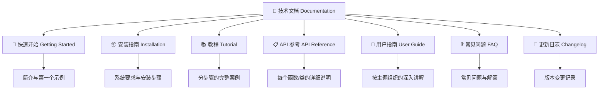

# 抓取文档结构

> **所属路径**：`00_高中复习/02_英语基础/03_阅读文档/01_抓取文档结构`
> **预计学习时间**：45 分钟
> **难度等级**：⭐

---

## 前置知识

- [阅读报错信息](../../02_阅读报错信息/)（学会阅读报错信息后，你已经具备了面对英文技术内容的基本信心）
- [技术词汇](../../01_技术词汇/)（认识常见的编程和人工智能英文词汇）

> 如果以上内容还不熟悉，建议先完成对应课程再继续。

---

## 学习目标

完成本节后，你将能够：

1. 说出英文技术文档的常见组成部分及其功能
2. 面对一份陌生的文档时，快速定位自己需要的章节
3. 识别常见的英文章节标题并理解其含义
4. 使用目录、搜索和导航栏等工具高效浏览文档

---

## 正文讲解

### 1. 为什么要学会"抓取"文档结构

想象你走进一座陌生的图书馆：书架上密密麻麻排满了书，如果没有指示牌、没有分类标签，你要找一本特定的书可能得花上几个小时。但如果图书馆有清晰的楼层指引、分区标识和电子检索系统，你几分钟就能找到目标。

**技术文档（Documentation）** 就像一座为软件工具建造的"图书馆"。它包含了该工具的所有使用说明——从安装方法到每个功能的详细描述。好消息是，几乎所有技术文档都遵循相似的组织结构，就像图书馆都有类似的分区逻辑一样。学会识别这些结构，你就拥有了在任何文档中快速找到信息的能力。

### 2. 技术文档的典型结构

让我们用一张图来展示大多数技术文档的通用结构。以 Python 官方文档为例，虽然不同项目的细节会有差异，但核心板块非常一致：



> 📌 **图解说明**：这张图展示了技术文档的七大核心板块。实际文档中不一定每个板块都有，但大多数成熟项目的文档都包含其中的四到五个。

接下来，我们逐个认识这些板块。

### 3. 七大核心板块详解

**快速开始（Getting Started / Quickstart）** 是文档的"欢迎页"。它通常用最简短的篇幅告诉你：这个工具是什么、能做什么、如何在几分钟内跑起来第一个例子。如果你是第一次接触一个工具，这里就是你的起点。Python 官方文档中，这个部分对应的是首页的 "What's New" 和 "Tutorial" 入口。

**安装指南（Installation）** 告诉你如何将这个工具安装到你的电脑上。它通常会列出系统要求（System Requirements）、安装命令和验证安装是否成功的方法。例如 NumPy 文档的安装页面会告诉你运行 `pip install numpy` 来安装。

**教程（Tutorial）** 是手把手教你完成具体任务的分步指南。与 API 参考不同，教程更像一个故事——它会带着你从零开始，一步步完成一个完整的小项目。Python 官方教程（The Python Tutorial）就是一个经典例子，从 "Hello World" 开始，逐步介绍语言的各种特性。

**API 参考（API Reference）** 是文档中信息最密集的部分。 **API（Application Programming Interface，应用程序编程接口）** 指的是软件提供的所有可调用的功能。API 参考会像字典一样，逐个列出每个函数、每个类、每个方法的详细说明，包括参数、返回值、使用示例等。当你已经知道要用哪个功能但不确定具体怎么用时，就来这里查。

**用户指南（User Guide / How-to Guide）** 介于教程和 API 参考之间。它按照主题组织内容，比如"如何处理文件""如何进行网络请求"等。用户指南假设你已经有了基本的使用经验，需要更深入地了解某个主题。

**常见问题（FAQ，Frequently Asked Questions）** 收集了大家最常遇到的问题和解答。当你遇到一个问题时，先到 FAQ 里搜搜看，很可能别人已经问过了。

**更新日志（Changelog / Release Notes）** 记录了每个版本的变更内容——新增了什么功能、修复了什么 bug、废弃了什么特性。当你升级工具版本后发现某些代码不工作了，来这里查看变更记录往往能找到答案。

### 4. 常见英文章节标题速查

在实际浏览文档时，你会遇到各种英文标题。下面这张表列出了最常见的标题及其含义，帮助你快速判断每个板块的作用：

| 英文标题 | 中文含义 | 你在这里能找到什么 |
| -------- | -------- | ------------------ |
| Getting Started / Quickstart | 快速开始 | 第一个示例，快速上手 |
| Installation / Setup | 安装 / 配置 | 安装命令和系统要求 |
| Tutorial | 教程 | 分步骤的学习指南 |
| API Reference | API 参考 | 函数/类的详细说明 |
| User Guide / How-to | 用户指南 / 操作指南 | 按主题组织的深入讲解 |
| Examples / Cookbook | 示例 / 食谱 | 实用代码示例集合 |
| FAQ | 常见问题 | 常见问题与解答 |
| Changelog / Release Notes | 更新日志 / 发布说明 | 版本变更记录 |
| Contributing | 贡献指南 | 如何参与项目开发 |
| License | 许可证 | 软件使用授权条款 |
| Deprecated | 已废弃 | 不再推荐使用的功能 |
| See Also | 另请参阅 | 相关内容的链接 |
| Note / Warning / Tip | 注意 / 警告 / 提示 | 特别提醒或建议 |

### 5. 文档导航工具：目录、搜索和面包屑

知道了文档有哪些板块之后，你还需要掌握三种常用的导航工具，帮助你在文档中快速移动。

**目录（Table of Contents, TOC）** 是文档的"地图"。大多数文档网站的左侧会有一个可展开的目录树，列出所有章节和子章节。你可以通过目录快速跳转到任何一个位置。例如，Python 官方文档的左侧栏就有一个完整的目录导航。

**搜索（Search）** 是最高效的定位方式。当你明确知道自己要找的关键词时——比如一个函数名 `read_csv` 或者一个概念 `list comprehension`——直接在文档网站的搜索框中输入就能精准定位。几乎所有现代文档网站都在页面顶部提供搜索功能，通常可以用快捷键 `/` 或 `Ctrl+K` 激活。

**面包屑导航（Breadcrumb）** 是页面顶部显示的路径指示，形如 `Home > Library Reference > Built-in Functions > print`。它告诉你当前页面在文档结构中的位置，你可以点击路径中的任何一级快速回到上层。"面包屑"这个名字来源于童话故事《汉赛尔与格蕾特》——主人公沿路撒面包屑来标记回家的路。

**侧边栏（Sidebar）** 通常位于页面左侧或右侧。左侧边栏显示文档的整体目录结构，右侧边栏（如果有的话）则显示当前页面的小节标题，方便你在长页面中跳转。

### 6. 实战演练：浏览 Python 官方文档

让我们用 Python 官方文档（https://docs.python.org）作为例子，把刚才学到的知识串起来。

假设你想了解 Python 中的 `print` 函数怎么用。你可以按照以下步骤操作：

1. **打开文档首页**：你会看到几个大的入口——"What's new"、"Tutorial"、"Library Reference"、"Language Reference" 等
2. **判断去哪个板块**：你要查的是一个具体函数的用法，所以应该去 "Library Reference"（库参考），它对应的就是 API 参考
3. **使用目录或搜索**：你可以在左侧目录中找到 "Built-in Functions"（内置函数），或者直接在搜索框输入 `print`
4. **阅读函数页面**：找到 `print` 函数后，你会看到它的参数说明、使用示例和注意事项
5. **注意面包屑**：页面顶部会显示类似 `Python 3.x Docs > Library Reference > Built-in Functions > print` 的路径，帮助你了解当前位置

这个流程适用于任何技术文档：**先判断板块 → 再使用导航工具 → 最后精读具体页面**。

### 7. 常用文档导航词汇总结

最后，我们把本节涉及的关键英文词汇汇总一下。这些词汇在各种技术文档中反复出现，值得记住：

| 英文词汇 | 中文含义 | 出现场景 |
| -------- | -------- | -------- |
| Documentation (Docs) | 文档 | 所有技术文档的统称 |
| Reference | 参考 | API 参考、语言参考 |
| Tutorial | 教程 | 分步骤的学习指南 |
| Guide | 指南 | 用户指南、操作指南 |
| Quickstart | 快速开始 | 入门页面 |
| API | 应用程序编程接口 | 函数/类的调用说明 |
| Changelog | 更新日志 | 版本变更记录 |
| Deprecated | 已废弃 | 不再推荐使用的功能标记 |
| Table of Contents (TOC) | 目录 | 文档导航 |
| Breadcrumb | 面包屑导航 | 页面位置指示 |
| Sidebar | 侧边栏 | 页面侧面的导航区域 |
| Search | 搜索 | 文档搜索功能 |

---

## 动手实践

现在让我们亲自体验一下文档导航。请打开以下三个文档网站，完成指定的任务：

**任务 1：Python 官方文档**
- 打开 https://docs.python.org/3/
- 找到左侧导航栏，点击 "Library Reference"
- 在 "Library Reference" 中找到 "Built-in Functions" 页面
- 记录下这个页面列出了多少个内置函数

**任务 2：NumPy 文档**
- 打开 https://numpy.org/doc/stable/
- 观察首页的结构：它有哪些主要板块？（Getting Started? User Guide? API Reference?）
- 使用搜索功能搜索 `array`，观察搜索结果的组织方式

**任务 3：pandas 文档**
- 打开 https://pandas.pydata.org/docs/
- 找到 "Getting Started" 部分
- 观察页面顶部的面包屑导航，记录下它显示的路径层级

> 💡 **提示**：完成以上任务不需要你理解文档中的代码或技术细节。你只需要观察文档的结构和导航方式，就像参观一座图书馆时观察它的布局一样。

---

## 文档阅读常用语块

在英文技术文档中，以下语块和句式反复出现。把它们作为整体记忆，可以大幅提升文档阅读速度：

| 语块 | 中文含义 | 出现位置 |
| ---- | -------- | -------- |
| `Getting Started` | 快速入门 | 文档导航栏的入门章节 |
| `Installation` | 安装说明 | 文档开头的安装指南 |
| `API Reference` | API 参考手册 | 详细的函数/类说明 |
| `See also` | 参见 | 指向相关内容的交叉引用 |
| `Note` / `Warning` / `Tip` | 注意/警告/提示 | 文档中的提示框 |
| `Deprecated since version X` | 从版本 X 起弃用 | 标记即将移除的功能 |
| `New in version X` | 版本 X 新增 | 标记新功能的版本号 |
| `Changed in version X` | 版本 X 中有变更 | 标记行为变化 |
| `Returns` / `Return type` | 返回值/返回类型 | 函数文档的返回值说明 |
| `Parameters` / `Args` | 参数 | 函数文档的参数说明 |
| `Raises` | 可能抛出的异常 | 函数可能触发的错误 |
| `Example` / `Examples` | 示例 | 代码使用示例 |

> 💡 **快速导航技巧**：在文档页面中按 `Ctrl+F` 搜索 "Example" 或 "Parameters"，可以快速跳转到你最需要的部分。

---

## 记忆策略

### 结构模式识别法

所有技术文档都遵循相似的结构模式。记住这个"万能框架"，面对任何文档都能快速定位信息：

```
文档首页 → Getting Started（入门） → Installation（安装） → Tutorial（教程）
    ↓
API Reference → 模块列表 → 函数/类详情（Parameters → Returns → Examples）
    ↓
Advanced Topics / Guides（进阶指南）
```

### 间隔复习建议

| 复习时间 | 建议方式 |
| -------- | -------- |
| 当天 | 浏览"文档阅读常用语块"表格 |
| 第 3 天 | 打开 Python 官方文档，识别各个结构部分 |
| 第 7 天 | 在 NumPy 文档中查找一个函数的用法 |
| 第 14 天 | 尝试仅通过阅读文档完成一个小任务 |

---

## 典型误区

| 误区 | 正确理解 |
| ---- | -------- |
| 文档要从头读到尾 | 文档是"查阅"用的参考资料，不是"阅读"用的教科书。你应该带着具体问题去查找对应章节，而不是试图通读全文 |
| 看不懂就说明文档写得不好 | 技术文档有明确的目标读者——如果你是初学者，看不懂 API 参考是正常的。先从 Tutorial 和 Getting Started 入手 |
| API 参考是最重要的部分 | 不同阶段需要不同板块。入门时 Tutorial 最重要；日常使用中 API 参考最常查阅；遇到问题时 FAQ 和搜索最有用 |
| 只有官方文档才值得看 | 官方文档最权威，但社区写的教程、博客有时更易懂。两者结合效果最好 |

---

## 练习题

### 练习 1：识别文档板块（难度：⭐）

以下是某个 Python 库文档首页的目录列表。请判断每个标题对应文档的哪个核心板块：

```
1. Installation
2. 10 Minutes to pandas
3. API reference
4. What's new in 2.0
5. User Guide
```

<details>
<summary>💡 提示</summary>

回忆本节讲的七大核心板块，将每个标题与板块名称对应起来。特别注意 "10 Minutes to pandas" 这个标题——它的名字虽然特别，但本质上属于哪个板块？

</details>

<details>
<summary>✅ 参考答案</summary>

1. **Installation** → 安装指南（Installation）
2. **10 Minutes to pandas** → 快速开始（Getting Started / Quickstart）——虽然名字独特，但它的功能是帮你在几分钟内上手使用
3. **API reference** → API 参考（API Reference）
4. **What's new in 2.0** → 更新日志（Changelog / Release Notes）
5. **User Guide** → 用户指南（User Guide）

</details>

### 练习 2：选择正确的文档板块（难度：⭐）

面对以下场景，你应该去文档的哪个板块查找信息？

- 场景 A：你第一次使用 scikit-learn，想跑一个简单的例子
- 场景 B：你已经知道要用 `fit()` 方法，但不确定它需要传什么参数
- 场景 C：你从 scikit-learn 0.24 升级到了 1.0，发现原来的代码报错了
- 场景 D：你想系统学习 scikit-learn 中的分类算法

<details>
<summary>💡 提示</summary>

将每个场景与对应的文档板块匹配：Getting Started、API Reference、Changelog、User Guide / Tutorial。

</details>

<details>
<summary>✅ 参考答案</summary>

- 场景 A → **Getting Started / Quickstart**：第一次使用，需要快速上手
- 场景 B → **API Reference**：查具体函数的参数说明
- 场景 C → **Changelog / Release Notes**：查版本之间的变更记录
- 场景 D → **User Guide / Tutorial**：系统学习某个主题

</details>

### 练习 3：导航工具选择（难度：⭐）

在以下情况下，使用哪种导航工具（目录、搜索、面包屑导航）最高效？

1. 你知道函数名叫 `DataFrame.merge`，想快速找到它的文档页面
2. 你在一个很长的文档页面中间，想知道自己当前在文档的哪个位置
3. 你不知道具体要找什么，但想浏览文档有哪些主题可以学习

<details>
<summary>💡 提示</summary>

每种导航工具的最佳使用场景不同：有目标关键词时用什么？想看全貌时用什么？想确认位置时用什么？

</details>

<details>
<summary>✅ 参考答案</summary>

1. **搜索（Search）**——你已经有明确的关键词 `DataFrame.merge`，搜索是最快的定位方式
2. **面包屑导航（Breadcrumb）**——面包屑显示的路径可以告诉你当前在文档结构中的位置
3. **目录（Table of Contents）**——浏览目录可以了解文档的整体结构和所有可用主题

</details>

---

## 下一步学习

- 📖 下一个知识点：[理解参数与返回值](../02_理解参数与返回值/02_理解参数与返回值.md)——学会了文档的整体结构后，接下来深入到最核心的内容：如何读懂函数的参数和返回值描述
- 🔗 相关知识点：[技术词汇](../../01_技术词汇/)——如果在阅读文档过程中遇到不认识的技术术语，可以回顾此主题
- 📚 拓展阅读：将来在 [阅读英文文档与技术资料](../../../../01_基础能力/01_开发环境与技术英语/08_阅读英文文档与技术资料/) 中，你将学习更高级的文档阅读技巧

---

## 参考资料

1. [Python 官方文档](https://docs.python.org/3/) — Python 语言最权威的参考资料，结构清晰，是学习文档阅读的最佳范例（官方文档）
2. [NumPy 官方文档](https://numpy.org/doc/stable/) — 科学计算库的文档，具有典型的教程+API 参考结构（官方文档）
3. [pandas 官方文档](https://pandas.pydata.org/docs/) — 数据处理库的文档，"10 Minutes to pandas" 是优秀的 Quickstart 范例（官方文档）
4. [Divio 文档系统](https://docs.divio.com/documentation-system/) — 解释技术文档四种类型（教程、操作指南、参考、解释）的经典文章（CC BY-SA 4.0 许可）
