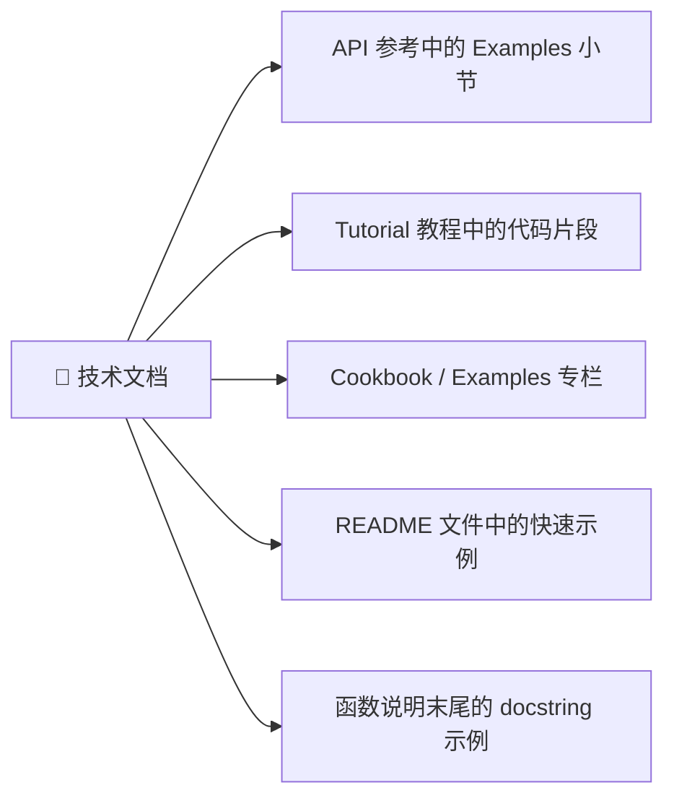

# 提炼示例代码

> **所属路径**：`00_高中复习/02_英语基础/03_阅读文档/03_提炼示例代码`
> **预计学习时间**：45 分钟
> **难度等级**：⭐⭐

---

## 前置知识

- [抓取文档结构](../01_抓取文档结构/01_抓取文档结构.md)（知道文档的各个板块以及在哪里找到示例代码）
- [理解参数与返回值](../02_理解参数与返回值/02_理解参数与返回值.md)（能读懂函数签名和参数说明，为理解示例代码中的函数调用打基础）

> 如果以上内容还不熟悉，建议先完成对应课程再继续。

---

## 学习目标

完成本节后，你将能够：

1. 在文档的不同位置找到示例代码
2. 区分可直接运行的代码、交互式代码和伪代码
3. 识别示例代码中的关键行与辅助代码
4. 掌握将文档示例改编为自己所用的基本思路

---

## 正文讲解

### 1. 示例代码为什么重要

前面两节课我们学会了如何找到文档中的正确板块，以及如何读懂函数的参数和返回值描述。但很多时候，看再多文字描述都不如看一个实际的例子来得直观——"show me the code"（给我看代码）是程序员世界的一句名言。

**示例代码（Example Code）** 就是文档作者精心编写的演示片段，用来展示"这个功能实际上怎么用"。好的示例代码就像菜谱中的"成品照片"——它让你直观地看到最终效果，再结合前面学过的参数说明（就像食材清单和烹饪步骤），你就能完整地掌握一个功能的用法。

### 2. 示例代码藏在哪里

文档中的示例代码通常出现在以下几个位置：



> 📌 **图解说明**：示例代码散布在文档的多个位置。API 参考中的示例最精简（展示单个函数的用法），Tutorial 中的示例最完整（串联多个步骤完成一个任务），Cookbook 中的示例最实用（解决具体的常见问题）。

**API 参考中的 Examples**：这是最常见的位置。大多数函数的文档在 Parameters 和 Returns 之后，都会附上一个 "Examples" 小节，展示该函数最基本的用法。

**Tutorial（教程）**：教程中的代码是一步步引导你完成一个完整任务的，示例之间有前后依赖关系——上一段代码的输出可能是下一段代码的输入。

**Cookbook / Examples 专栏**：有些文档会单独设立一个 "Cookbook"（食谱）或 "Examples"（示例集）页面，按照常见任务场景组织代码片段，比如"如何读取 CSV 文件""如何绑定多个数据表"。

**README 文件**：开源项目的 README 中通常会有一两个快速示例，让你一眼看到这个工具能做什么。

### 3. 识别代码的三种形式

文档中的代码并不总是可以直接复制运行的。你需要学会区分以下三种形式：

**第一种：交互式代码（Interactive Code）**

这是 Python 文档中最常见的格式，以 `>>>` 开头：

```python
>>> numbers = [3, 1, 4, 1, 5]
>>> sorted(numbers)
[1, 1, 3, 4, 5]
>>> sorted(numbers, reverse=True)
[5, 4, 3, 1, 1]
```

`>>>` 是 Python **交互式解释器（Interactive Interpreter）** 的提示符，表示"在这里输入命令"。没有 `>>>` 开头的行是上一条命令的输出结果。

> ⚠️ **注意**：如果你想复制这段代码去运行，需要去掉所有的 `>>>` 和 `...` 前缀以及输出行。实际要输入的代码是：
> ```python
> numbers = [3, 1, 4, 1, 5]
> sorted(numbers)
> sorted(numbers, reverse=True)
> ```

**第二种：脚本代码（Script Code）**

这种代码不带 `>>>` 前缀，可以直接复制到文件中运行：

```python
import numpy as np

# 创建一个 3x3 的零矩阵
matrix = np.zeros((3, 3))
print(matrix)
```

脚本代码中以 `#` 开头的行是 **注释（Comment）**，用于解释代码的作用，不会被执行。

**第三种：伪代码（Pseudocode）**

伪代码用于说明逻辑思路，不能直接运行。它通常使用省略号 `...` 或占位符来表示需要你填入的内容：

```python
model = SomeModel(...)
model.fit(X_train, y_train)
predictions = model.predict(X_test)
```

伪代码中的 `SomeModel`、`X_train` 等名称通常是占位符，提示你需要替换为实际的模型和数据。

下面这张表帮助你快速区分三种代码形式：

| 特征 | 交互式代码 | 脚本代码 | 伪代码 |
| ---- | ---------- | -------- | ------ |
| `>>>` 前缀 | ✅ 有 | ❌ 没有 | ❌ 没有 |
| 包含输出结果 | ✅ 通常有 | ❌ 通常没有 | ❌ 没有 |
| 可直接运行 | ⚠️ 去掉 `>>>` 后可以 | ✅ 可以 | ❌ 不可以 |
| 出现位置 | API 参考、docstring | 教程、Cookbook | 概念说明 |
| 常见标记 | `>>>` 和 `...` | `import`、`#` 注释 | `...` 省略号、占位符名称 |

### 4. 识别关键行与辅助代码

一段示例代码通常包含两类内容：

- **关键行**：直接展示你要学习的功能的那几行
- **辅助代码**：为了让示例能运行而必须存在的准备工作

让我们看一个 pandas 文档中的例子：

```python
>>> import pandas as pd                          # 辅助：导入库
>>> data = {'name': ['Alice', 'Bob', 'Charlie'],  # 辅助：准备示例数据
...         'age': [25, 30, 35]}
>>> df = pd.DataFrame(data)                       # 辅助：创建 DataFrame
>>> df.sort_values('age', ascending=False)         # 关键：这才是本例要展示的功能
      name  age
2  Charlie   35
1      Bob   30
0    Alice   25
```

在这个例子中，前三行都是为了创建一份示例数据——真正要展示的功能是最后一行 `df.sort_values('age', ascending=False)`（按年龄降序排列）。

如何快速识别关键行？几个技巧：

1. **看文档标题**：如果这段代码在 `sort_values` 的文档下，那调用 `sort_values` 的那行就是关键行
2. **看注释**：很多示例会在关键行旁边加注释说明
3. **看 import 语句**：`import` 开头的行几乎总是辅助代码
4. **看数据构造**：手动创建示例数据的代码通常是辅助代码

### 5. 常见代码标记一览

文档示例中有一些特殊标记，理解它们能帮助你更好地阅读代码：

| 标记 | 含义 | 示例 |
| ---- | ---- | ---- |
| `>>>` | 交互式提示符，表示输入行 | `>>> print("hello")` |
| `...` | 交互式续行符，表示上一行的延续 | `... if x > 0:` |
| `#` | 注释，解释代码作用 | `# 创建一个空列表` |
| `# Output:` 或 `# =>` | 输出注释，标示预期结果 | `# Output: [1, 2, 3]` |
| `...` （在代码中） | 省略号，表示此处需填入代码 | `model = MyModel(...)` |
| `<placeholder>` | 尖括号占位符 | `open('<filename>')` |
| `# noqa` / `# type: ignore` | 静默警告标记，可忽略 | 自动检查工具用的标记 |

### 6. 改编示例代码的思路

学会阅读示例代码后，下一步是学会**改编**——把文档中的示例调整为你自己需要的版本。虽然你还没开始学编程，但理解改编的思路会为将来的学习打好基础。

改编示例代码的基本步骤：

1. **保留结构，替换数据**：把示例中的示例数据换成你自己的数据
2. **调整参数**：根据前一节学到的参数知识，修改可选参数以满足你的需求
3. **删除不需要的部分**：如果示例演示了多个功能，只保留你需要的那个
4. **添加你的处理逻辑**：在关键行之后添加你自己的后续操作

例如，文档示例是：

```python
>>> import pandas as pd
>>> df = pd.read_csv('example.csv')
>>> df.head()
```

你可以改编为（思路上的改编，将来学习编程时会实际操作）：

```python
import pandas as pd
df = pd.read_csv('my_data.csv')    # 替换为你自己的文件
df.head(10)                         # 修改参数：查看前 10 行而非默认的 5 行
```

---

## 动手实践

请打开 NumPy 官方文档中 `numpy.array` 函数的页面（https://numpy.org/doc/stable/reference/generated/numpy.array.html），完成以下任务：

**任务 1：找到示例代码**
- 滚动到页面底部，找到 "Examples" 小节
- 数一数这个页面一共给出了几段示例代码

**任务 2：区分代码形式**
- 观察示例代码的格式——它们是交互式代码（带 `>>>`）还是脚本代码（不带 `>>>`）？

**任务 3：识别关键行**
- 在第一段示例代码中，找到创建数组的那一行（关键行）
- 找到准备数据的那一行（辅助代码）

> 💡 **提示**：不需要理解代码的具体含义。你只需要运用本节学到的技巧——通过 `>>>` 标记、注释、import 语句等特征来完成任务。

---

## 示例代码常用语块

在文档的示例代码部分，以下语块和注释模式频繁出现：

| 语块 | 中文含义 | 上下文 |
| ---- | -------- | ------ |
| `>>> import ...` | 导入模块 | 交互式示例的起始行 |
| `# Create / Initialize` | 创建/初始化 | 示例中的步骤注释 |
| `# Expected output:` | 预期输出 | 标注期望结果 |
| `# Note: ...` | 注意：… | 示例中的额外说明 |
| `# This is equivalent to` | 这等价于 | 展示替代写法 |
| `see :func:\`...\`` | 参见函数… | 交叉引用其他函数 |
| `For more details, see` | 详情参见 | 指向更完整的文档 |
| `Basic usage:` / `Advanced usage:` | 基本用法/高级用法 | 示例的难度分级 |

> 💡 **提炼策略**：在文档中搜索 "Example" 或 ">>>"（Python 交互式提示符），就能快速定位到可运行的代码示例。

---

## 记忆策略

### 三步提炼法

遇到任何文档示例，都用这三步来提炼可用代码：

1. **识别**：找到 `>>>` 或代码块标记
2. **剥离**：去掉 `>>>` 提示符和输出行，只保留代码
3. **适配**：将变量名和数据替换为你自己的场景

### 间隔复习建议

| 复习时间 | 建议方式 |
| -------- | -------- |
| 当天 | 浏览示例代码语块表 |
| 第 3 天 | 从 NumPy 文档中提炼一个函数的示例并运行 |
| 第 7 天 | 从 Pandas 文档中提炼并改编一个示例解决实际问题 |
| 第 14 天 | 不看课程，独立从陌生库的文档中提炼可用代码 |

---

## 典型误区

| 误区 | 正确理解 |
| ---- | -------- |
| 示例代码可以直接复制运行 | 交互式代码（带 `>>>`）需要去掉前缀和输出行才能运行；伪代码需要填入实际内容 |
| 示例代码展示了函数的所有用法 | 示例通常只展示最常见的一两种用法。要了解全部功能，需要结合 Parameters 部分阅读 |
| 看不懂示例代码就是基础太差 | 示例代码的目标读者通常有一定基础。作为初学者，先理解代码的"结构"（哪里是输入、哪里是输出），具体语法将来会学到 |
| 改编示例只需要改一两个字 | 改编时需要理解每个参数的作用，盲目修改可能导致错误。先读懂 Parameters 描述再动手改 |

---

## 练习题

### 练习 1：判断代码形式（难度：⭐）

判断以下每段代码属于哪种形式（交互式代码、脚本代码、伪代码）：

**代码 A：**
```python
>>> x = [1, 2, 3]
>>> sum(x)
6
```

**代码 B：**
```python
import torch
model = YourModel(...)
output = model(input_data)
```

**代码 C：**
```python
import numpy as np

arr = np.array([1, 2, 3, 4, 5])
mean_value = np.mean(arr)
print(f"Mean: {mean_value}")
```

<details>
<summary>💡 提示</summary>

检查三个特征：有没有 `>>>` 前缀？有没有 `...` 占位符或通用名称？代码能否直接复制运行？

</details>

<details>
<summary>✅ 参考答案</summary>

- **代码 A**：交互式代码——有 `>>>` 前缀，包含输出结果 `6`
- **代码 B**：伪代码——`YourModel(...)` 和 `input_data` 是占位符，`...` 表示需要填入实际参数
- **代码 C**：脚本代码——没有 `>>>` 前缀，没有占位符，可以直接复制运行

</details>

### 练习 2：识别关键行（难度：⭐⭐）

阅读以下示例代码，指出哪一行是"关键行"（展示核心功能的行），哪些是"辅助代码"：

```python
>>> import pandas as pd
>>> data = {'product': ['A', 'B', 'C'], 'price': [10, 20, 15]}
>>> df = pd.DataFrame(data)
>>> df.describe()
           price
count   3.000000
mean   15.000000
std     5.000000
min    10.000000
25%    12.500000
50%    15.000000
75%    17.500000
max    20.000000
```

<details>
<summary>💡 提示</summary>

如果这段代码出现在 `DataFrame.describe()` 方法的文档中，哪一行在调用 `describe()`？

</details>

<details>
<summary>✅ 参考答案</summary>

- **辅助代码**：前三行（`import pandas as pd`、创建 `data` 字典、创建 `df`）——这些都是为了准备示例数据
- **关键行**：`df.describe()`——这是本示例要展示的核心功能
- 后面的输出内容展示了 `describe()` 的返回结果

</details>

### 练习 3：改编示例（难度：⭐⭐）

假设文档给出了以下示例代码：

```python
>>> pd.read_csv('data.csv', sep=',', header=0)
```

现在你的情况是：你的文件名叫 `students.csv`，它用分号 `;` 作为分隔符，而且没有标题行。根据你在上一节学到的参数知识，你会怎么改编这行代码？

<details>
<summary>💡 提示</summary>

需要修改三个地方：文件名、`sep` 参数的值、`header` 参数的值。没有标题行时，`header` 通常设为 `None`。

</details>

<details>
<summary>✅ 参考答案</summary>

改编后的代码：

```python
pd.read_csv('students.csv', sep=';', header=None)
```

修改了三处：
1. 文件名从 `'data.csv'` 改为 `'students.csv'`
2. 分隔符从 `','`（逗号）改为 `';'`（分号）
3. 标题行从 `0`（第一行是标题）改为 `None`（没有标题行）

</details>

---

## 下一步学习

- 📖 下一个知识点：[开源项目文档导航](../04_开源项目文档导航/04_开源项目文档导航.md)——学会了从文档中提取示例代码后，接下来学习如何在开源项目中找到文档和示例
- 🔗 相关知识点：[理解参数与返回值](../02_理解参数与返回值/02_理解参数与返回值.md)——改编示例代码时经常需要回顾参数说明
- 📚 拓展阅读：将来在 [阅读英文文档与技术资料](../../../../01_基础能力/01_开发环境与技术英语/08_阅读英文文档与技术资料/) 中，你将学习更高级的代码提取和复用技巧

---

## 参考资料

1. [Python 官方教程](https://docs.python.org/3/tutorial/) — Python 官方的分步教程，包含大量交互式代码示例（官方文档）
2. [NumPy 快速开始教程](https://numpy.org/doc/stable/user/quickstart.html) — NumPy 的入门教程，示例代码从简单到复杂层层递进（官方文档）
3. [pandas Cookbook](https://pandas.pydata.org/docs/user_guide/cookbook.html) — pandas 的"食谱"页面，按任务场景组织实用代码示例（官方文档）
4. [Real Python 教程](https://realpython.com/) — 高质量的 Python 教程网站，示例代码详细且可运行（公开访问的教育资源）
