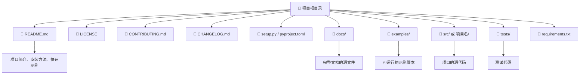
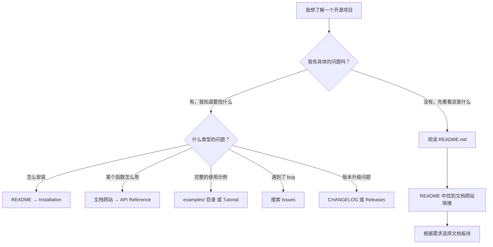
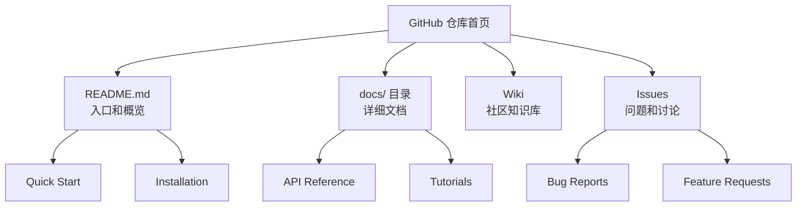

# 开源项目文档导航

> **所属路径**：`00_高中复习/02_英语基础/03_阅读文档/04_开源项目文档导航`
> **预计学习时间**：45 分钟
> **难度等级**：⭐⭐

---

## 前置知识

- [抓取文档结构](../01_抓取文档结构/01_抓取文档结构.md)（了解技术文档的通用结构和导航方法）
- [提炼示例代码](../03_提炼示例代码/03_提炼示例代码.md)（能在文档中找到并理解示例代码）

> 如果以上内容还不熟悉，建议先完成对应课程再继续。

---

## 学习目标

完成本节后，你将能够：

1. 识别 GitHub 开源项目中各个关键文件和目录的作用
2. 根据不同需求（安装、使用、贡献）快速定位到正确的文档
3. 利用 GitHub 的搜索、Issues 和 Discussions 功能查找信息
4. 导航主流 AI/ML 开源项目（如 PyTorch、scikit-learn）的文档结构

---

## 正文讲解

### 1. 从官方文档到开源项目

前几节课我们一直在学习如何阅读技术文档网站——那些排版精美、结构清晰的在线文档。但在实际学习和工作中，你经常需要直接面对 **开源项目（Open Source Project）** 的原始代码仓库，尤其是在 **GitHub** 上。

GitHub 是全球最大的代码托管平台，几乎所有你将来要用到的 AI 工具——Python、NumPy、pandas、PyTorch、scikit-learn、Hugging Face Transformers——都把源代码和文档托管在 GitHub 上。学会在 GitHub 上导航文档，就等于拥有了直接从"源头"获取信息的能力。

### 2. GitHub 项目的典型结构

每个 GitHub 项目都像一个有固定布局的"房间"。让我们用一张图来展示典型的项目结构：



> 📌 **图解说明**：这张图展示了一个典型 GitHub 项目的根目录结构。不同项目的细节会有所不同，但核心文件和目录的命名是高度一致的。

### 3. 关键文件逐个认识

让我们逐个认识这些文件和目录，了解它们各自的作用和你在什么时候需要查看它们。

**README.md** 是项目的"门面"——当你打开一个 GitHub 项目页面时，最先看到的就是 README 的内容。一个好的 README 通常包含：

- 项目名称和简介（这是什么、能做什么）
- 安装方法（怎么装到你的电脑上）
- 快速示例（一个最简单的使用例子）
- 文档链接（指向完整文档网站）
- 许可证和贡献方式的简要说明

**LICENSE** 文件声明了这个项目的使用许可。常见的有 MIT License（几乎可以随意使用）、Apache 2.0（可以商用但需保留版权声明）、GPL（修改后必须开源）等。虽然作为学习者你暂时不需要深入了解许可证的法律细节，但知道这个文件的存在很重要。

**CONTRIBUTING.md** 是贡献指南，告诉想要参与项目开发的人应该如何提交代码、报告 bug、提出建议。如果将来你想为开源项目做贡献，这是必读文件。

**CHANGELOG.md** 或 **HISTORY.md** 记录了项目每个版本的变更，与我们在第一节学到的"更新日志"板块对应。

**setup.py / pyproject.toml** 是 Python 项目的安装配置文件，定义了项目的依赖和安装方式。

**requirements.txt** 列出了项目依赖的其他库及其版本号。

**docs/ 目录** 存放完整文档的源文件。这些文件通常会被自动构建为我们之前看到的那种漂亮的文档网站。

**examples/ 目录** 包含可直接运行的示例脚本。这是学习一个项目时的"宝藏目录"——里面的代码通常比 API 文档中的示例更完整、更贴近实际使用场景。

**src/ 或 以项目名命名的目录** 是项目的核心源代码所在地。

**tests/ 目录** 包含测试代码。虽然你暂时不需要阅读测试代码，但有时候测试文件能提供很好的使用示例——因为测试代码的本质就是"调用函数并验证结果"。

### 4. 根据需求快速定位

面对一个陌生的 GitHub 项目，你通常带着某个具体需求。下面这张表帮助你根据需求快速找到对应的位置：

| 你的需求 | 去哪里找 | 关键文件/位置 |
| -------- | -------- | ------------- |
| 这个项目是做什么的？ | 项目首页 | README.md |
| 怎么安装？ | README 或文档 | README.md → Installation 部分 |
| 怎么快速上手？ | README 或文档 | README.md → Quick Start 部分，或 examples/ 目录 |
| 某个函数怎么用？ | 文档网站 | README 中的文档链接 → API Reference |
| 有没有完整的例子？ | 示例目录 | examples/ 目录 |
| 最新版本改了什么？ | 更新日志 | CHANGELOG.md 或 GitHub Releases 页面 |
| 我遇到了 bug | Issues 页面 | GitHub 项目的 Issues 标签页 |
| 我有一个使用问题 | Discussions 页面 | GitHub 项目的 Discussions 标签页 |
| 我想参与开发 | 贡献指南 | CONTRIBUTING.md |
| 能不能商用？ | 许可证 | LICENSE 文件 |

### 5. GitHub 的辅助导航功能

除了阅读文件本身，GitHub 平台还提供了几个强大的辅助功能：

**代码搜索（Code Search）**：在项目页面顶部的搜索框中输入关键词，可以在整个代码库中搜索。比如你想知道 `DataFrame.merge` 在哪里被定义或使用，直接搜索 `merge` 就能找到相关文件。

**Issues（问题追踪）**：每个 GitHub 项目都有一个 Issues 页面，用户在这里报告 bug、提出功能请求或讨论问题。当你遇到问题时，先搜索 Issues——很可能别人已经遇到过同样的问题并得到了解答。

**Discussions（讨论区）**：比 Issues 更轻松的交流场所，适合提问使用方法、讨论最佳实践等。不是所有项目都开启了 Discussions 功能。

**Releases（发布）**：项目的正式版本发布页面，通常包含下载链接、更新说明和已知问题。

**Wiki（维基）**：有些项目会在 GitHub Wiki 中放置额外的文档和教程。

### 6. 主流 AI/ML 项目的文档导航

让我们看看几个你将来一定会用到的 AI/ML 项目，它们的文档是怎么组织的：

**PyTorch（https://github.com/pytorch/pytorch）**
- README.md：项目简介和安装命令
- 文档网站：https://pytorch.org/docs/ （从 README 中的链接跳转）
- 教程网站：https://pytorch.org/tutorials/ （单独的教程站点，非常详细）
- examples/ 目录：包含图像分类、文本生成等完整示例

**scikit-learn（https://github.com/scikit-learn/scikit-learn）**
- README.md：简洁的项目介绍
- 文档网站：https://scikit-learn.org/stable/ （结构非常清晰：Tutorial → User Guide → API Reference）
- examples/ 目录：按主题分类的大量示例，是学习 ML 的宝贵资源

**Hugging Face Transformers（https://github.com/huggingface/transformers）**
- README.md：包含多语言版本的简介和快速示例
- 文档网站：https://huggingface.co/docs/transformers/ （面向大模型应用的详细文档）
- examples/ 目录：按任务分类（文本分类、翻译、问答等）

你会注意到一个共同模式：**GitHub 仓库本身主要存放代码和基本说明，完整的文档通常部署在单独的文档网站上**。README 是这两者之间的桥梁——它提供了足够的入门信息，并链接到完整文档网站。

### 7. "我想做 X，该去哪里找？"决策流程

最后，让我们把本主题的所有知识串成一个实用的决策流程。当你遇到一个新的开源项目，想要找到某个信息时，可以按照以下步骤操作：



> 📌 **图解说明**：这张决策流程图总结了面对一个新的开源项目时的导航策略。核心原则是"先 README，再文档网站，遇到问题搜 Issues"。

### 8. 常用 GitHub 导航术语

| 英文术语 | 中文含义 | 说明 |
| -------- | -------- | ---- |
| Repository (Repo) | 代码仓库 | 一个项目的所有文件 |
| README | 自述文件 | 项目的"门面"说明 |
| Issues | 问题追踪 | 报告 bug 和讨论 |
| Pull Request (PR) | 拉取请求 | 提交代码修改 |
| Releases | 发布版本 | 正式版本的下载和说明 |
| Discussions | 讨论区 | 提问和交流 |
| Wiki | 维基 | 额外的文档页面 |
| Fork | 复刻 | 复制一份项目到自己的账号 |
| Star | 收藏 | 给项目点赞/收藏 |
| Branch | 分支 | 代码的不同版本线 |
| Tag | 标签 | 标记特定版本的代码 |
| Commit | 提交 | 一次代码修改记录 |

---

## 动手实践

请打开 scikit-learn 的 GitHub 页面（https://github.com/scikit-learn/scikit-learn），完成以下导航任务：

**任务 1：阅读 README**
- 在 README 中找到安装方法（Installation）
- 找到文档网站的链接

**任务 2：探索项目结构**
- 观察项目根目录，找到以下文件/目录并记录它们是否存在：
  - `LICENSE`
  - `CONTRIBUTING.md`
  - `examples/`
  - `docs/`
  - `requirements.txt`

**任务 3：使用 Issues 搜索**
- 点击 Issues 标签页
- 在搜索框中输入一个关键词（如 `random_state`），观察搜索结果

**任务 4：查看 examples 目录**
- 进入 `examples/` 目录
- 观察示例是如何分类组织的（按主题？按算法？）

> 💡 **提示**：你不需要阅读任何代码。这个练习的目的是熟悉 GitHub 项目的布局和导航方式，就像在一座新建筑里认路一样。

---

## 开源项目文档常用语块

在 GitHub 开源项目的文档中，以下语块和标题反复出现：

| 语块 | 中文含义 | 出现位置 |
| ---- | -------- | -------- |
| `README.md` | 项目自述文件 | 仓库首页自动显示的文件 |
| `CONTRIBUTING.md` | 贡献指南 | 说明如何参与项目开发 |
| `LICENSE` | 许可证 | 说明项目的使用授权条款 |
| `CHANGELOG.md` | 变更日志 | 记录每个版本的改动 |
| `Quick Start` / `Getting Started` | 快速入门 | README 中的入门指南 |
| `Prerequisites` / `Requirements` | 前置要求 | 运行项目所需的环境和依赖 |
| `Usage` / `How to use` | 用法 | 基本使用说明 |
| `FAQ` | 常见问题 | 常见问题解答 |
| `Issues` / `Bug Reports` | 问题报告 | GitHub Issues 页面 |
| `Pull Request` / `PR` | 拉取请求 | 提交代码贡献的方式 |
| `Maintained by` / `Created by` | 由…维护/创建 | 项目作者信息 |
| `Sponsored by` / `Powered by` | 由…赞助/驱动 | 项目支持方信息 |

> 💡 **导航策略**：到达一个开源项目页面时，按顺序检查：README → docs/ 目录 → Wiki → Issues → Discussions，就能找到绝大多数信息。

---

## 记忆策略

### 项目地图法

把开源项目的文档分布想象成一张"地图"：



> 📌 **图解说明**：大多数开源项目的文档都散布在这些位置。记住这张"地图"，到任何新项目都能快速定位信息。

### 间隔复习建议

| 复习时间 | 建议方式 |
| -------- | -------- |
| 当天 | 浏览开源项目文档语块表 |
| 第 3 天 | 在 GitHub 上找一个热门 Python 项目，识别其文档结构 |
| 第 7 天 | 仅通过阅读 README 学会安装和基本使用一个新库 |
| 第 14 天 | 尝试在一个陌生项目的文档中找到特定功能的使用方法 |

---

## 典型误区

| 误区 | 正确理解 |
| ---- | -------- |
| GitHub 页面就是文档网站 | GitHub 存放的是代码和源文件。大多数项目的完整文档部署在独立的文档网站上，需要从 README 中找到链接跳转 |
| README 包含了所有需要的信息 | README 只是入口和概览。详细的 API 参考、教程和指南需要在文档网站中查阅 |
| Issues 只能用来报告 bug | Issues 也用于讨论功能请求、使用问题和改进建议。搜索 Issues 是排查问题的好方法 |
| examples/ 里的代码太复杂不值得看 | examples/ 目录中的代码通常是最接近实际使用场景的范例，比 API 文档中的示例更具参考价值。即使暂时看不懂全部，也可以从结构上学习 |

---

## 练习题

### 练习 1：文件匹配（难度：⭐）

将以下文件与它们的作用配对：

| 文件 | 作用 |
| ---- | ---- |
| A. README.md | 1. 项目的使用授权条款 |
| B. LICENSE | 2. 项目简介和快速入门 |
| C. CONTRIBUTING.md | 3. 版本变更记录 |
| D. CHANGELOG.md | 4. 如何参与项目开发 |

<details>
<summary>💡 提示</summary>

回忆每个文件的核心功能。README 是"门面"，LICENSE 是"许可证"，CONTRIBUTING 是"贡献指南"，CHANGELOG 是"变更日志"。

</details>

<details>
<summary>✅ 参考答案</summary>

- A → 2（README.md 是项目简介和快速入门）
- B → 1（LICENSE 是使用授权条款）
- C → 4（CONTRIBUTING.md 是参与开发的指南）
- D → 3（CHANGELOG.md 是版本变更记录）

</details>

### 练习 2：需求定位（难度：⭐⭐）

你在使用 Hugging Face Transformers 库时遇到了以下场景，你应该去哪里找信息？

- 场景 A：你想知道 `AutoTokenizer.from_pretrained()` 需要传什么参数
- 场景 B：你运行代码时遇到了一个报错，想看看别人有没有遇到过
- 场景 C：你第一次接触这个库，想跑一个最简单的例子
- 场景 D：你想看一个完整的文本分类项目是怎么写的

<details>
<summary>💡 提示</summary>

每个场景对应本节讲过的不同导航目标：API 参考、Issues 搜索、README/Quick Start、examples 目录。

</details>

<details>
<summary>✅ 参考答案</summary>

- 场景 A → **文档网站的 API Reference**：查具体函数的参数说明
- 场景 B → **GitHub Issues 页面**：搜索报错信息关键词，查看是否有人遇到过同样的问题
- 场景 C → **README.md 或文档网站的 Quick Start**：获取最简单的使用示例
- 场景 D → **examples/ 目录**：找到按任务分类的完整示例项目

</details>

### 练习 3：项目结构判断（难度：⭐⭐）

一个 GitHub 项目的根目录包含以下内容：

```
README.md
LICENSE
setup.py
requirements.txt
mylib/
    __init__.py
    core.py
    utils.py
tests/
    test_core.py
```

回答以下问题：
1. 这个项目有 examples/ 目录吗？这意味着什么？
2. 这个项目有 docs/ 目录吗？你去哪里找完整文档？
3. 如果你想了解这个项目的核心功能，应该先看哪个文件？

<details>
<summary>💡 提示</summary>

仔细看目录列表中有什么和缺什么。没有 examples/ 和 docs/ 时，信息会集中在哪里？

</details>

<details>
<summary>✅ 参考答案</summary>

1. 没有 examples/ 目录。这意味着该项目可能没有提供独立的示例脚本，使用示例可能包含在 README.md 中或文档网站上
2. 没有 docs/ 目录。完整文档可能在 README.md 中（小型项目通常将所有文档放在 README 里），或者需要查看 README 中是否有外部文档网站的链接
3. 应该先看 **README.md**——它是项目的入口，会介绍项目的功能和基本用法

</details>

---

## 下一步学习

- 📖 下一个主题：[总结与记笔记](../../04_总结与记笔记/)——学会了阅读文档后，接下来学习如何将读到的信息整理成自己的知识体系
- 🔗 相关知识点：[抓取文档结构](../01_抓取文档结构/01_抓取文档结构.md)——开源项目的文档网站结构与本节内容相互补充
- 📚 拓展阅读：将来在 [阅读英文文档与技术资料](../../../../01_基础能力/01_开发环境与技术英语/08_阅读英文文档与技术资料/) 中，你将学习更高级的文档导航和信息提取技巧

---

## 参考资料

1. [GitHub 官方文档 - 关于 README](https://docs.github.com/en/repositories/managing-your-repositorys-settings-and-features/customizing-your-repository/about-readmes) — 解释 README 的作用和最佳实践（官方文档）
2. [PyTorch GitHub 仓库](https://github.com/pytorch/pytorch) — 大型 AI 项目的典型仓库结构范例（开源项目，BSD 许可）
3. [scikit-learn GitHub 仓库](https://github.com/scikit-learn/scikit-learn) — 文档组织极为清晰的机器学习项目（开源项目，BSD 许可）
4. [开源指南 - 如何参与开源](https://opensource.guide/zh-hans/how-to-contribute/) — GitHub 官方维护的开源参与指南，中文版（CC BY 4.0 许可）
