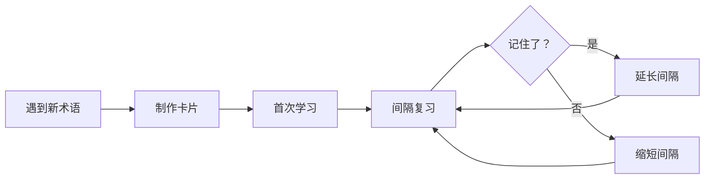
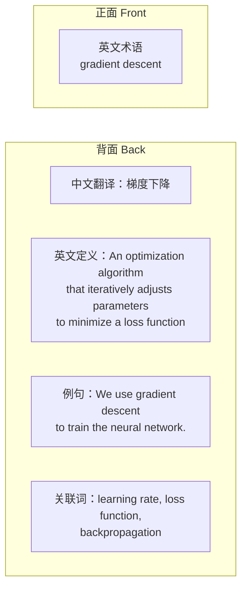

# 双语术语卡片

> **所属路径**：`00_高中复习/02_英语基础/04_总结与记笔记/01_双语术语卡片`
> **预计学习时间**：35–45 分钟
> **难度等级**：⭐

---

## 前置知识

- [技术词汇](../../01_技术词汇/)（了解数学、编程、人工智能领域的基础英文词汇）
- [阅读文档](../../03_阅读文档/)（在阅读过程中会不断遇到需要记录的新术语）

> 如果以上内容还不熟悉，建议先完成对应课程再继续。

---

## 学习目标

完成本节后，你将能够：

1. 解释为什么双语术语卡片是积累技术词汇的高效方法
2. 设计一张包含完整信息的术语卡片（英文术语、中文翻译、定义、例句、关联词）
3. 运用间隔重复原理安排卡片的复习计划
4. 使用免费工具（Anki 或实体卡片）创建和管理自己的术语卡片库

---

## 正文讲解

### 1. 为什么要用术语卡片

假设你正在阅读一篇关于机器学习的英文教程，遇到了 "gradient descent" 这个词。你查了翻译，知道它是"梯度下降"，然后继续往下读。一周后你再次遇到这个词——发现自己又忘了。这种"学了就忘"的循环，几乎每个英语学习者都经历过。

问题出在哪里？心理学研究告诉我们，人类的记忆遵循 **遗忘曲线（Forgetting Curve）** 的规律：新学的信息如果不及时复习，会在几天内快速遗忘。单纯"看一遍"远远不够，你需要一种方法来 **主动回忆（Active Recall）** ——也就是在看到提示后，先自己回想答案，而不是被动地重新阅读。

**术语卡片（Terminology Flashcard）** 正是实现主动回忆的最简单工具。卡片正面写一个英文术语，你看到后先在脑子里回忆它的含义，然后翻过来核对答案。这个"先想后看"的过程，比单纯重读有效得多。

> 📌 **图解说明**：这张流程图展示了术语卡片的基本使用循环——从遇到新词、制作卡片，到通过间隔复习不断巩固记忆。每次复习后根据掌握程度调整下次复习的间隔时间。

### 2. 一张好卡片长什么样

很多人做术语卡片时，正面写英文、背面写中文，就结束了。但这样的卡片信息太少，复习时你可能记住了翻译，却不知道这个词在什么场景下使用。一张高质量的双语术语卡片应该包含以下要素：

> 📌 **图解说明**：一张完整的双语术语卡片包含正面和背面两部分。正面只放英文术语，背面包含四项信息：中文翻译、英文定义、例句和关联词。

我们逐一看看每个要素的作用：

- **英文术语（正面）**：这是你的复习触发器。看到它时，你要尝试回忆背面的所有信息。
- **中文翻译**：帮助你建立英中对应关系。
- **英文定义**：用简单英文解释这个术语的含义。这一步很重要——它迫使你在英文语境中理解概念，而不只是做中英翻译。
- **例句**：展示这个词在真实技术语境中的用法。最好从你正在阅读的教程或文档中摘录。
- **关联词**：列出 2–3 个与这个术语经常一起出现的词。这有助于你建立 **语义网络（Semantic Network）** ——知识不是孤立的点，而是相互连接的网。

### 3. 卡片分类与组织

随着你积累的卡片越来越多，需要一种分类方式来方便管理和复习。以下是三种常用的分类维度：

**按主题分类**：把卡片按照所属领域归入不同的组。比如：

| 分类 | 示例术语 |
| ---- | -------- |
| 数学 | matrix, derivative, probability |
| 编程 | variable, function, loop |
| 机器学习 | regression, classification, overfitting |
| 深度学习 | neuron, layer, activation |

这种分类方式与你在 [技术词汇](../../01_技术词汇/) 中学到的四个领域完全对应，可以直接沿用。

**按熟悉度分类**：把卡片分为"陌生"、"模糊"和"熟练"三个等级。每次复习后根据回忆效果调整分类。这是间隔重复的核心思路——陌生的词多复习，熟练的词少复习。

**按使用频率分类**：高频词优先学习。例如 "function" 在几乎所有编程文档中都会出现，而 "eigenvalue" 只在线性代数相关内容中出现。先掌握高频词，投入产出比最高。

### 4. 间隔重复：科学的复习方法

如果你每天都复习所有卡片，效率很低——因为你把时间浪费在了已经记住的词上。 **间隔重复（Spaced Repetition）** 是一种基于遗忘曲线设计的复习策略：你记得越牢的卡片，下次复习的间隔越长；记不住的卡片，间隔越短。

一个简化的间隔重复方案如下：

| 复习结果 | 下次复习间隔 |
| -------- | ------------ |
| 完全想不起来 | 当天再复习一次 |
| 想起来但犹豫了 | 1 天后复习 |
| 比较顺利地想起来 | 3 天后复习 |
| 立刻想起来 | 7 天后复习 |
| 连续两次立刻想起来 | 14 天后复习 |

你不需要自己精确计算这些间隔——这正是软件工具可以帮你做的事情。

### 5. 工具推荐：Anki 与实体卡片

**Anki** 是一款免费开源的间隔重复软件，被全世界的语言学习者和医学生广泛使用。它的核心功能正是自动安排卡片的复习间隔。

Anki 的基本使用方式：

1. 创建一个"牌组"（Deck），例如命名为 "AI 技术词汇"
2. 添加卡片，填写正面和背面内容
3. 每天打开 Anki，它会自动呈现今天需要复习的卡片
4. 看到正面后回忆答案，然后点击"再来"、"困难"、"良好"或"简单"来告诉 Anki 你的掌握程度
5. Anki 根据你的反馈自动调整下次复习时间

Anki 支持 Windows、macOS、Linux 和 Android（AnkiDroid，免费），iOS 版本需要付费。你也可以在 AnkiWeb 网页端免费使用。

如果你不习惯使用软件，**实体卡片** 同样有效。准备一叠空白小卡片（或裁剪 A4 纸），正面写英文术语，背面写翻译、定义、例句和关联词。用橡皮筋把卡片分成"陌生"、"模糊"和"熟练"三叠，每天优先复习"陌生"那叠。

两种方式各有优缺点：

| 对比维度 | Anki | 实体卡片 |
| -------- | ---- | -------- |
| 间隔复习 | 自动安排，精确高效 | 需要手动管理 |
| 随时随地 | 手机即可复习 | 需要随身携带 |
| 制作速度 | 打字较快 | 手写有助记忆 |
| 学习成本 | 需要学习软件操作 | 零学习成本 |
| 搜索查找 | 支持搜索和标签 | 需要翻找 |

### 6. 实战示例：为"技术词汇"制作卡片

让我们用在 [数学英文词汇](../../01_技术词汇/01_数学英文词汇/01_数学英文词汇.md) 和 [编程英文词汇](../../01_技术词汇/02_编程英文词汇/02_编程英文词汇.md) 中学过的术语，实际制作几张卡片。

**卡片 1：**

| 面 | 内容 |
| -- | ---- |
| 正面 | **variable** |
| 背面 | 中文：变量 |
| | 定义：A named storage location that holds a value which can change during program execution. |
| | 例句：In Python, you can create a variable by writing `x = 5`. |
| | 关联词：data type, assignment, constant |

**卡片 2：**

| 面 | 内容 |
| -- | ---- |
| 正面 | **matrix** |
| 背面 | 中文：矩阵 |
| | 定义：A rectangular array of numbers arranged in rows and columns. |
| | 例句：A 3×3 matrix has 3 rows and 3 columns. |
| | 关联词：vector, dimension, transpose |

**卡片 3：**

| 面 | 内容 |
| -- | ---- |
| 正面 | **algorithm** |
| 背面 | 中文：算法 |
| | 定义：A step-by-step procedure for solving a problem or performing a computation. |
| | 例句：Sorting algorithms arrange data in a specific order. |
| | 关联词：complexity, input, output |

注意这三张卡片的共同特点：定义用简单英文写成、例句来自真实技术场景、关联词帮助建立知识网络。

---

## 动手实践

现在轮到你了。请从以下词汇中选择 3 个，按照本节讲解的卡片格式，制作 3 张完整的双语术语卡片：

- function（函数）
- parameter（参数）
- probability（概率）
- iteration（迭代）
- neural network（神经网络）

**制作步骤**：

1. 在纸上（或文本编辑器中）画出卡片的正面和背面
2. 正面只写英文术语
3. 背面填写：中文翻译、英文定义（用自己的话写，不超过两句）、一个例句、2–3 个关联词
4. 完成后，盖住背面，看着正面尝试回忆所有内容

**自检标准**：

- 你的英文定义是否用了简单的词汇？（如果定义比术语本身还难懂，就需要简化）
- 你的例句是否展示了这个词的实际用法？（而不是孤立的、没有上下文的句子）
- 你的关联词是否与该术语有真实的知识联系？（而不是随便写几个英文单词）

---

## 术语卡片制作常用语块

制作双语术语卡片时，以下表达模式可以帮助你更好地组织信息：

| 卡片元素 | 英文表达 | 中文含义 | 示例 |
| -------- | -------- | -------- | ---- |
| 正面 | Term / Concept | 术语/概念 | `gradient descent` |
| 背面-定义 | Definition: ... | 定义：… | `An optimization algorithm that...` |
| 背面-中文 | Chinese: ... | 中文：… | `梯度下降` |
| 背面-语块 | Common phrases: ... | 常用语块：… | `compute the gradient`, `gradient of the loss` |
| 背面-例句 | Example: ... | 例句：… | `We use gradient descent to minimize the loss.` |
| 背面-关联 | Related terms: ... | 关联术语：… | `learning rate`, `backpropagation` |

> 💡 **卡片设计原则**：每张卡片只包含**一个**核心概念。如果一张卡片上的信息超过 6 行，说明需要拆分为多张卡片。

---

## 记忆策略

### 主动回忆法

术语卡片最大的价值在于**主动回忆**而非被动浏览。使用卡片时，先看正面的英文术语，尝试自己回忆中文含义和常用语块，然后再翻看背面验证。

### 间隔复习建议

| 复习时间 | 建议方式 |
| -------- | -------- |
| 当天 | 制作当天学到的新术语卡片 |
| 第 2 天 | 用卡片进行第一轮主动回忆测试 |
| 第 4 天 | 将记住的卡片放入"已掌握"组，不确定的留在"复习"组 |
| 第 7 天 | 对"复习"组重新测试，增加语块和例句信息 |
| 第 14 天 | 混合所有领域（数学、编程、AI、ML）的卡片一起复习 |
| 第 30 天 | 综合复习，淘汰已牢固掌握的卡片 |

---

## 典型误区

| 误区 | 正确理解 |
| ---- | -------- |
| 卡片越多越好，一次性做上百张 | 每天新增 5–10 张为宜，重点是持续复习而非大量制作 |
| 只写英文和中文翻译就够了 | 缺少定义、例句和关联词会导致记忆浅层化，只记住翻译却不会使用 |
| 复习时看一眼正面就翻背面 | 必须先主动回忆，回忆不出来也要努力想，这个过程才是加深记忆的关键 |
| 所有卡片都按同样的频率复习 | 应该把更多时间花在陌生的卡片上，已掌握的卡片可以降低复习频率 |
| 只用实体卡片或只用 Anki | 两种方式可以结合使用，初次制作用手写加深印象，后续复习用 Anki 提高效率 |

---

## 练习题

### 练习 1：判断卡片质量（难度：⭐）

以下是一张术语卡片，请指出它的不足之处并改进：

| 面 | 内容 |
| -- | ---- |
| 正面 | loop |
| 背面 | 循环 |

💡 提示

对照本节"一张好卡片长什么样"中的五要素，看看这张卡片缺少了什么。

✅ 参考答案

这张卡片只有英文术语和中文翻译，缺少以下三项：

- **英文定义**：A control structure that repeats a block of code multiple times until a condition is met.
- **例句**：Use a `for` loop to iterate through each item in the list.
- **关联词**：iteration, for, while, break

改进后的卡片信息更完整，复习时能帮助你理解和使用这个术语，而不仅仅是记住翻译。

### 练习 2：设计复习计划（难度：⭐）

假设你今天新做了 8 张卡片，并且已经有 20 张之前做的卡片（其中 5 张标记为"陌生"，10 张标记为"模糊"，5 张标记为"熟练"）。请为明天的复习设计一个 15 分钟的计划。

💡 提示

考虑间隔重复的原则：优先复习掌握程度低的卡片。15 分钟大约能复习 20–30 张卡片。

✅ 参考答案

**15 分钟复习计划**：

1. **前 5 分钟**：复习 8 张新卡片（昨天刚做的，遗忘最快）
2. **中间 5 分钟**：复习 5 张"陌生"卡片（最需要巩固的）
3. **最后 5 分钟**：从 10 张"模糊"卡片中抽取 7–8 张复习

5 张"熟练"卡片今天可以跳过，留到 3–5 天后再复习。

**核心原则**：把有限的时间集中在最薄弱的卡片上，已掌握的卡片可以适当延后。

### 练习 3：术语分类练习（难度：⭐⭐）

将以下 8 个术语按主题分成 4 组，并为每组起一个分类名：

array, probability, gradient, debug, distribution, compiler, derivative, recursion

💡 提示

回忆一下 [技术词汇](../../01_技术词汇/) 中的四个分类：数学、编程、概率统计、机器学习/微积分。

✅ 参考答案

| 分类 | 术语 |
| ---- | ---- |
| 编程基础 | array, debug, compiler, recursion |
| 概率统计 | probability, distribution |
| 微积分 | gradient, derivative |

说明：这里实际分成了 3 组而非 4 组，因为这 8 个词中概率统计和微积分各只有 2 个。在实际分类中，不必强求每组数量相同，按语义归属即可。如果你把 gradient 归入"机器学习"也是合理的——分类没有唯一正确答案，关键是有组织逻辑。

---

## 下一步学习

- 📖 下一个知识点：[章节摘要](../02_章节摘要/02_章节摘要.md)
- 🔗 相关知识点：[数学英文词汇](../../01_技术词汇/01_数学英文词汇/01_数学英文词汇.md)、[编程英文词汇](../../01_技术词汇/02_编程英文词汇/02_编程英文词汇.md)
- 📚 拓展阅读：[Anki 官方文档](https://docs.ankiweb.net/)

---

## 参考资料

1. [Anki 官方网站](https://apps.ankiweb.net/) — 免费开源的间隔重复学习软件（开源软件）
2. [Spaced Repetition — Wikipedia](https://en.wikipedia.org/wiki/Spaced_repetition) — 间隔重复原理的详细介绍（公共知识库，CC BY-SA 许可）
3. [Forgetting Curve — Wikipedia](https://en.wikipedia.org/wiki/Forgetting_curve) — 艾宾浩斯遗忘曲线的背景知识（公共知识库，CC BY-SA 许可）
4. [AnkiDroid](https://github.com/ankidroid/Anki-Android) — Anki 的 Android 开源客户端（开源软件，GPL 许可）
