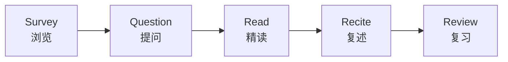
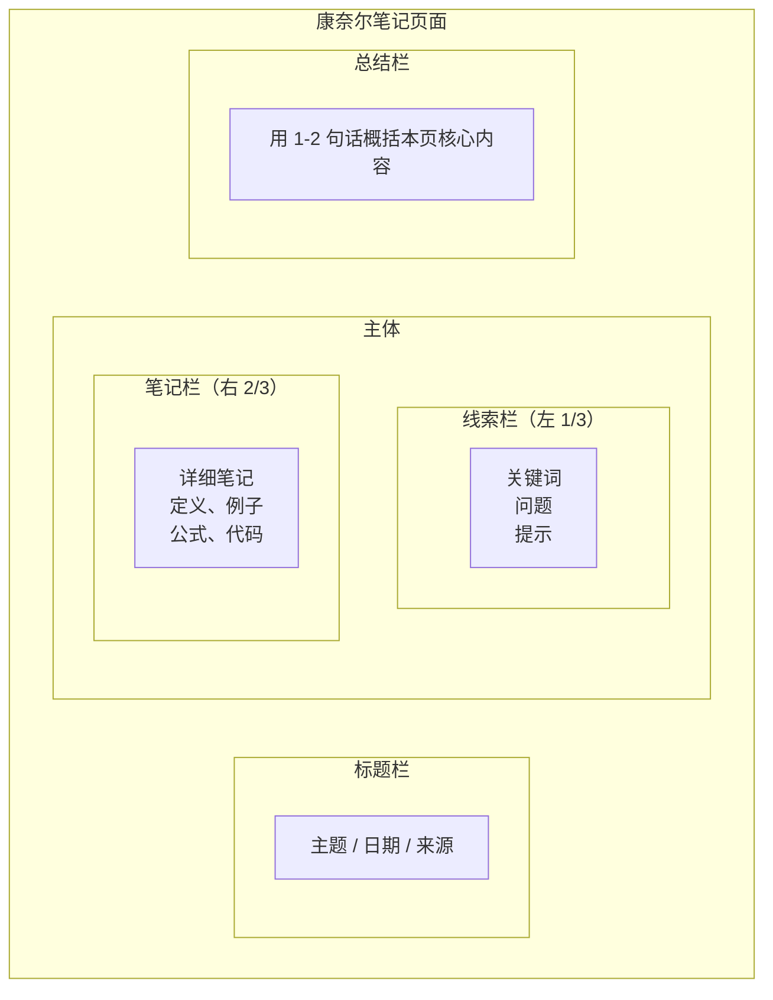

# 章节摘要

> **所属路径**：`00_高中复习/02_英语基础/04_总结与记笔记/02_章节摘要`
> **预计学习时间**：40–50 分钟
> **难度等级**：⭐⭐

---

## 前置知识

- [双语术语卡片](../01_双语术语卡片/01_双语术语卡片.md)（掌握术语卡片方法后，可以在写摘要时同步积累新词汇）
- [抓取文档结构](../../03_阅读文档/01_抓取文档结构/01_抓取文档结构.md)（理解文档结构是写出好摘要的前提）
- [理解参数与返回值](../../03_阅读文档/02_理解参数与返回值/02_理解参数与返回值.md)（阅读技术文档时能抓住关键信息）

> 如果以上内容还不熟悉，建议先完成对应课程再继续。

---

## 学习目标

完成本节后，你将能够：

1. 运用 SQ3R 阅读法系统地阅读技术文章并提取关键信息
2. 使用康奈尔笔记法整理章节摘要
3. 根据不同类型的技术内容（教程、API 文档、论文摘要）选择合适的摘要模板
4. 将一段英文技术文本压缩为结构清晰的中文摘要

---

## 正文讲解

### 1. 为什么"读完就忘"

你可能有过这样的体验：花了一个小时认真读完一篇技术教程，合上页面后却发现自己说不清楚刚才到底读了什么。这不是你记性差，而是你缺少一个关键步骤—— **主动加工（Active Processing）**。

认知科学研究表明，阅读是一种"输入"活动，而记忆需要"输出"来巩固。写摘要正是一种强制性的输出：它迫使你用自己的话重新组织信息，在这个过程中，知识从"看过"变成了"理解了"。

**章节摘要（Chapter Summary）** 不是抄笔记——它是你用自己的理解，把一段内容的核心要点提炼出来的过程。一份好的摘要应该让你在几个月后重新翻看时，能在 2 分钟内回忆起整章的关键内容。

### 2. SQ3R 阅读法

在写摘要之前，你首先需要一个有效的阅读策略。 **SQ3R 阅读法（SQ3R Method）** 是一种经典的主动阅读方法，由五个步骤组成：



> 📌 **图解说明**：SQ3R 的五个步骤依次进行——先快速浏览全文结构，然后带着问题精读，读完后尝试复述要点，最后通过回顾巩固记忆。

我们逐步展开每一步：

**Survey（浏览）**：花 2–3 分钟快速扫视全文。看标题、小标题、粗体词、图表和代码块。目标是建立一张"地图"——知道这篇文章大概讲了什么、分成几个部分。这个步骤你在 [抓取文档结构](../../03_阅读文档/01_抓取文档结构/01_抓取文档结构.md) 中已经学过。

**Question（提问）**：把每个小标题转化成一个问题。比如小标题是 "Data Preprocessing"，你就问自己："什么是数据预处理？为什么需要它？怎么做？" 带着问题读，注意力会更集中。

**Read（精读）**：逐段阅读，重点关注与你的问题相关的内容。遇到重要定义、公式和代码时做标记。不需要逐字翻译，抓住关键信息即可。

**Recite（复述）**：每读完一个小节，合上文章（或移开视线），用自己的话说出刚才读到的核心内容。如果说不出来，就回去重读那一段。

**Review（复习）**：全文读完后，回顾你在每个小节中复述的内容，整合成一份完整的摘要。

### 3. 康奈尔笔记法

掌握了阅读策略后，你需要一个结构化的记录格式。 **康奈尔笔记法（Cornell Note-taking Method）** 是一种被广泛验证有效的笔记格式，它把页面分成三个区域：



> 📌 **图解说明**：康奈尔笔记法将页面分为三个区域——左侧的线索栏用于写关键词和提问，右侧的笔记栏记录详细内容，底部的总结栏用一两句话概括整页要点。

三个区域的使用方式：

- **笔记栏（右 2/3）**：阅读时在这里记录要点、定义、例子和你的理解。使用缩进和符号组织层次。
- **线索栏（左 1/3）**：阅读后回过头来，在左栏补充关键词和问题。这些关键词就像索引一样，帮你快速定位右栏的详细内容。
- **总结栏（底部）**：用自己的话写 1–2 句总结。这是整页笔记的"压缩版"。

复习时，你可以用纸盖住右栏，只看左栏的关键词和问题，尝试回忆右栏的内容——这和术语卡片的"主动回忆"原理是一样的。

### 4. 技术内容摘要模板

不同类型的技术内容，摘要的侧重点也不同。以下是三种常见场景的摘要模板：

**模板 A：教程/课程章节摘要**

```
📖 来源：[教程名称] 第 X 章
📅 日期：YYYY-MM-DD

## 核心概念
- 概念 1：一句话解释
- 概念 2：一句话解释

## 关键步骤/方法
1. 步骤一
2. 步骤二
3. 步骤三

## 代码/公式笔记
- [记录关键代码片段或公式]

## 我的理解
- 用自己的话概括这章最重要的 1-2 个收获

## 未解决的问题
- 还没弄明白的点，留待后续解决
```

**模板 B：API 文档摘要**

```
📖 来源：[库名称] — [模块/函数名]
📅 日期：YYYY-MM-DD

## 功能概述
- 这个函数/类做什么？

## 核心参数
| 参数名 | 类型 | 含义 | 常用值 |
| ------ | ---- | ---- | ------ |
|        |      |      |        |

## 返回值
- 类型和含义

## 使用示例
- [记录最小可用的代码片段]

## 注意事项
- 常见陷阱或特殊行为
```

**模板 C：论文/技术文章摘要**

```
📖 来源：[文章标题]，[作者]，[年份]
📅 日期：YYYY-MM-DD

## 要解决的问题
- 这篇文章在解决什么问题？

## 核心方法
- 作者怎么做的？（一句话概括）

## 主要结果
- 效果如何？关键数字是什么？

## 对我的启发
- 这跟我正在学的内容有什么关系？
```

### 5. 摘要写作的实用技巧

写摘要时有几个实用技巧可以帮助你提高效率和质量：

**用中文写摘要，保留英文关键词**。摘要是给未来的自己看的，用母语写最高效。但技术术语应保留英文原词（或中英对照），因为你未来搜索这些概念时很可能用英文。例如："本章介绍了 overfitting（过拟合）的原因和三种应对方法。"

**先复述再精简**。不要一边读一边写摘要。先读完一个完整段落或小节，合上内容，口头复述要点，然后再动笔写。复述是"理解"，写摘要是"固化"。

**抓结构而非细节**。一份好摘要记录的是"这一章讲了什么概念、为什么重要、怎么用"，而不是每个段落的细节。如果将来需要细节，你可以回到原文查阅——摘要的作用是帮你快速定位"在哪里找"。

**标注你的困惑**。在摘要中用醒目的标记（如 `❓` 或 `TODO`）记录你没有理解的部分。这些困惑不是失败的标志，而是你下一步学习的路标——它们会成为你的 [问题清单](../03_问题清单/03_问题清单.md) 的素材。

---

## 动手实践

请阅读以下英文技术文本（节选自 Python 官方教程风格的内容），然后使用"教程章节摘要"模板写一份摘要。

> **原文（模拟技术教程片段）**：
>
> **Lists in Python**
>
> A list is a collection of items in a particular order. You can make a list that includes the letters of the alphabet, the digits from 0 to 9, or the names of all the people in your family. You can put anything you want into a list, and the items in your list don't have to be related in any particular way.
>
> In Python, square brackets `[]` indicate a list, and individual elements in the list are separated by commas. You can access any element in a list by telling Python the position, or index, of the item desired. To access an element in a list, write the name of the list followed by the index of the item enclosed in square brackets. Note that Python considers the first item in a list to be at position 0, not position 1.
>
> You can also use negative indexes to access items from the end of the list. For example, the index -1 always returns the last item in a list.

**写作步骤**：

1. 先快速浏览一遍全文（Survey）
2. 把标题 "Lists in Python" 转化成问题："什么是 Python 中的列表？怎么用？"（Question）
3. 精读全文，标记关键信息（Read）
4. 合上原文，用自己的话说出要点（Recite）
5. 使用模板 A 写出摘要（Review）

**自检标准**：

- 你的摘要是否在 1 分钟内就能让你回忆起原文的核心内容？
- 你是否保留了关键英文术语（如 list, index, element）？
- 你是否用自己的话重新组织了信息，而不是直接翻译原文？

---

## 典型误区

| 误区 | 正确理解 |
| ---- | -------- |
| 摘要就是翻译全文 | 摘要是提炼要点，不是逐句翻译。好摘要的长度通常不超过原文的 1/3 |
| 直接在原文上高亮就算做了笔记 | 高亮是"标记"，不是"加工"。必须用自己的话重新表述，才能真正加深理解 |
| 第一遍就要写出完美的摘要 | 先写粗略版本，复习时再修改补充。摘要是"活文档"，可以不断迭代 |
| 每篇文章都用同一种摘要格式 | 不同类型的内容（教程、API 文档、论文）应使用不同的模板，侧重点不同 |
| 只记结论不记方法 | 技术学习中"怎么做"比"结论是什么"更重要，方法和步骤一定要记录 |

---

## 练习题

### 练习 1：识别摘要模板（难度：⭐）

以下三段来源描述，分别应该使用哪种摘要模板（A、B、C）？

1. 一篇介绍如何使用 Pandas 进行数据清洗的博客教程
2. NumPy 官方文档中 `numpy.reshape()` 函数的说明页面
3. 一篇 arXiv 上介绍新型注意力机制的论文

<details>
<summary>💡 提示</summary>

回顾三种模板的适用场景：模板 A 用于教程/课程，模板 B 用于 API/函数文档，模板 C 用于论文/技术文章。

</details>

<details>
<summary>✅ 参考答案</summary>

1. **模板 A**（教程章节摘要）——这是一篇教学性质的博客，重点是学习概念和步骤。
2. **模板 B**（API 文档摘要）——这是具体函数的文档，重点是参数、返回值和用法。
3. **模板 C**（论文摘要）——这是研究论文，重点是问题、方法和结果。

</details>

### 练习 2：SQ3R 实践（难度：⭐⭐）

假设你正在阅读一篇标题为 "Introduction to Neural Networks" 的教程章节，小标题依次为：

- What is a Neural Network?
- Neurons and Layers
- Forward Propagation
- Training with Backpropagation

请完成 SQ3R 的前两步：
1. 写出你通过 Survey（浏览）获得的整体印象（1–2 句话）
2. 把每个小标题转化为至少一个问题

<details>
<summary>💡 提示</summary>

Survey 只需要看标题和小标题就能做出判断。Question 步骤使用"什么/为什么/怎么做"的提问框架。

</details>

<details>
<summary>✅ 参考答案</summary>

**Survey 印象**：这一章从神经网络的基本概念讲起，然后介绍其组成单元（神经元和层），再讲数据如何前向流动，最后讲网络如何通过反向传播来训练。是一个从概念到原理、由浅入深的结构。

**Question 提问**：

| 小标题 | 转化为问题 |
| ------ | ---------- |
| What is a Neural Network? | 神经网络是什么？它和传统程序有什么区别？ |
| Neurons and Layers | 神经元是怎么工作的？层（layer）是什么意思？有几种层？ |
| Forward Propagation | 数据是怎么从输入到输出"流过"网络的？ |
| Training with Backpropagation | 网络是怎么"学会"正确答案的？反向传播是什么？ |

</details>

### 练习 3：改进摘要（难度：⭐⭐）

以下是一位同学为 "Lists in Python" 写的摘要，请指出至少 3 个改进点：

```
Python 列表笔记
- list 是一种数据结构
- 用方括号表示
- 可以通过索引访问元素
```

<details>
<summary>💡 提示</summary>

从模板完整性、信息充分性和实用性三个角度来分析。

</details>

<details>
<summary>✅ 参考答案</summary>

至少有以下改进点：

1. **缺少来源和日期**：好的摘要应该记录信息来源，方便以后回溯原文。
2. **缺少关键细节**：没有提到"索引从 0 开始"和"负数索引"这两个重要知识点。
3. **没有用自己的话组织**：三个要点像是直接摘抄，没有体现出理解和加工的过程。
4. **缺少"我的理解"**：摘要中没有任何个人思考和关联，例如"list 类似于其他语言的 array"。
5. **缺少"未解决的问题"**：没有标注自己是否有疑问，错失了引导后续学习的机会。

改进后的摘要示例：

```
📖 来源：Python 教程 — Lists 章节
📅 日期：2025-04-10

## 核心概念
- list（列表）：Python 中存放有序元素集合的数据结构，用 [] 表示

## 关键知识点
1. 用方括号创建列表，元素用逗号分隔
2. 通过 index（索引）访问元素，索引从 0 开始（不是 1！）
3. 负数索引从末尾开始，-1 表示最后一个元素

## 我的理解
- list 可以存放任意类型的元素，很灵活
- 索引从 0 开始这一点很重要，容易和日常计数混淆

## 未解决的问题
- ❓ list 和 tuple 有什么区别？
```

</details>

---

## 下一步学习

- 📖 下一个知识点：[问题清单](../03_问题清单/03_问题清单.md)
- 🔗 相关知识点：[双语术语卡片](../01_双语术语卡片/01_双语术语卡片.md)（摘要中遇到的新术语可以制作成卡片）
- 📚 拓展阅读：[SQ3R 方法介绍](https://en.wikipedia.org/wiki/SQ3R)

---

## 参考资料

1. [SQ3R — Wikipedia](https://en.wikipedia.org/wiki/SQ3R) — SQ3R 阅读法的详细介绍（公共知识库，CC BY-SA 许可）
2. [Cornell Note-taking System — Cornell University](https://lsc.cornell.edu/how-to-study/taking-notes/cornell-note-taking-system/) — 康奈尔笔记法的官方说明（大学公开教学资源）
3. [Python Official Tutorial — Lists](https://docs.python.org/3/tutorial/introduction.html#lists) — 动手实践中引用的 Python 列表教程（官方文档，PSF 许可）
4. [How to Read a Paper — S. Keshav](http://ccr.sigcomm.org/online/files/p83-keshavA.pdf) — 经典的论文阅读方法论文章（开放获取）
