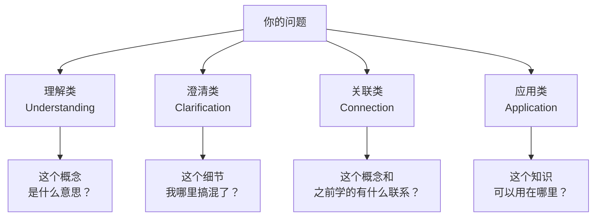
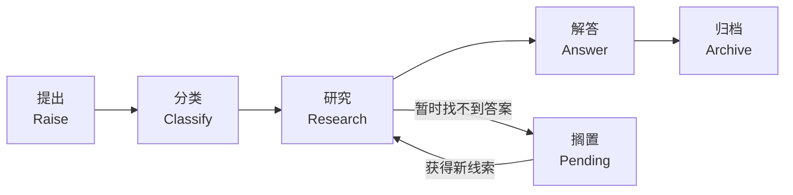

# 问题清单

> **所属路径**：`00_高中复习/02_英语基础/04_总结与记笔记/03_问题清单`
> **预计学习时间**：35–45 分钟
> **难度等级**：⭐

---

## 前置知识

- [章节摘要](../02_章节摘要/02_章节摘要.md)（写摘要时记录的"未解决问题"是问题清单的天然素材）
- [双语术语卡片](../01_双语术语卡片/01_双语术语卡片.md)（遇到不理解的术语时，会产生需要记录的问题）

> 如果以上内容还不熟悉，建议先完成对应课程再继续。

---

## 学习目标

完成本节后，你将能够：

1. 解释为什么主动提问是比被动阅读更有效的学习策略
2. 使用"什么/为什么/怎么/何时"框架为学习内容生成高质量的问题
3. 将问题分类为理解类、澄清类、关联类和应用类四种类型
4. 建立并维护一份个人问题清单，跟踪问题从提出到解答的完整生命周期

---

## 正文讲解

### 1. 提问是最被低估的学习技能

想象两个同学在学同一章内容。同学 A 从头读到尾，读完说："嗯，看完了。" 同学 B 每读两段就停下来问自己一个问题："等等，这里说的 'training data' 和 'test data' 有什么区别？为什么要分开？" 一周后测验，同学 B 的成绩几乎总是好于同学 A。

这不是巧合。教育心理学中的研究反复证明：**主动提问（Active Questioning）** 是深度学习的标志。当你提出一个问题时，你的大脑在做三件事：

1. **识别知识缺口**：你发现了"我知道什么"和"我不知道什么"之间的边界
2. **激活相关知识**：你的大脑开始搜索与这个问题相关的已有知识
3. **创造学习动机**：一个悬而未决的问题会驱动你主动寻找答案

**问题清单（Question List）** 就是把这些宝贵的问题系统地记录下来、分类管理、逐步解答的工具。它不只是一张待办清单，更是你学习旅程的路线图——每解决一个问题，你就向前迈进了一步。

### 2. 四种问题类型

并非所有问题都一样。为了更有效地管理问题，我们把问题分为四种类型：



> 📌 **图解说明**：四种问题类型从基础到高阶排列——理解类确认你知道"是什么"，澄清类消除模糊点，关联类建立知识之间的联系，应用类思考如何实际使用。

**理解类问题（Understanding）**：最基本的问题，确认你理解了核心概念。

- "什么是 overfitting？"
- "gradient descent 的目标是什么？"
- "为什么需要 activation function？"

**澄清类问题（Clarification）**：当你感觉"好像懂了但又说不清楚"时产生的问题。

- "loss function 和 cost function 是同一回事吗？"
- "这里说的 'epoch' 和 'iteration' 有什么区别？"
- "文档中的 `axis=0` 到底是沿着行还是沿着列？"

**关联类问题（Connection）**：把新知识和已有知识联系起来的问题。

- "这里的 gradient 和高中数学里的导数有什么关系？"
- "decision tree 的分裂过程和我之前学的二分查找有什么类似之处？"
- "CNN 用卷积来提取图像特征，那 RNN 用什么方式处理序列？"

**应用类问题（Application）**：思考知识如何实际使用的问题。

- "如果我想给图片分类，应该用哪种模型？"
- "这个数据清洗方法适用于中文文本吗？"
- "在实际项目中，learning rate 一般怎么选？"

### 3. "什么/为什么/怎么/何时"提问框架

如果你发现自己读完一段内容后"没有问题"，那可能不是因为你全都懂了，而是你还没学会怎么提问。这里有一个简单实用的框架，帮你为任何概念生成问题：

| 提问词 | 问题模式 | 示例（以 "regularization 正则化" 为例） |
| ------ | -------- | --------------------------------------- |
| **什么** (What) | 这个概念是什么？ | 什么是正则化？ |
| **为什么** (Why) | 为什么需要它？ | 为什么模型需要正则化？不用会怎样？ |
| **怎么** (How) | 它是怎么工作的？ | 正则化是怎么防止过拟合的？有哪些方法？ |
| **何时** (When) | 什么时候用？ | 在什么情况下应该使用正则化？所有模型都需要吗？ |

这四个提问词几乎可以覆盖任何技术概念。每当你遇到一个新术语或新概念时，依次问这四个问题，你就自动生成了一组高质量的学习引导问题。

### 4. 问题的生命周期

一个问题从产生到最终解决，有一个清晰的 **生命周期（Lifecycle）**：



> 📌 **图解说明**：问题的生命周期从"提出"开始，经过"分类"和"研究"，到"解答"后进入"归档"。如果暂时找不到答案，进入"搁置"状态，后续获得新线索时重新研究。

每个阶段的具体操作：

**提出（Raise）**：在阅读或学习时，随时记录你的疑问。不需要措辞完美，重点是第一时间捕捉到这个问题。用一句简短的话描述即可。

**分类（Classify）**：用前面讲的四种类型给问题打标签。这有助于你判断优先级——理解类问题通常要先解决，因为它们影响后续学习。

**研究（Research）**：主动寻找答案。途径包括：重新阅读相关章节、搜索官方文档、查阅 Stack Overflow、请教同学或老师。

**解答（Answer）**：找到答案后，用自己的话记录下来。答案不需要长篇大论，关键是你能清晰地解释给别人听。

**归档（Archive）**：解答后的问题不要删除，而是归入"已解决"分类。将来你可能会遇到类似的问题，过去的解答记录就是你的知识库。

**搁置（Pending）**：有些问题当前阶段无法解答（比如涉及你还没学到的高级知识）。标注为"搁置"并记录原因，等学到相关内容时再回来处理。

### 5. 问题清单的实际格式

下面是一个推荐的问题清单格式，你可以用 Markdown、电子表格或纸质笔记本来维护：

```markdown
# 问题清单

## 待解决

| 编号 | 问题 | 类型 | 来源 | 提出日期 |
| ---- | ---- | ---- | ---- | -------- |
| Q001 | loss function 和 cost function 有什么区别？ | 澄清 | 机器学习教程第 3 章 | 2025-04-10 |
| Q002 | 为什么神经网络需要非线性的激活函数？ | 理解 | 深度学习课程笔记 | 2025-04-11 |

## 搁置

| 编号 | 问题 | 类型 | 搁置原因 | 提出日期 |
| ---- | ---- | ---- | -------- | -------- |
| Q003 | Transformer 中的自注意力是怎么计算的？ | 理解 | 需要先学完线性代数 | 2025-04-11 |

## 已解决

| 编号 | 问题 | 答案摘要 | 解决日期 |
| ---- | ---- | -------- | -------- |
| Q000 | Python 列表的索引为什么从 0 开始？ | 与内存地址偏移量有关，这是 C 语言的传统 | 2025-04-09 |
```

这个格式的好处是：你可以一目了然地看到有多少问题待解决、哪些被搁置了、已经解决了多少。随着已解决的问题越来越多，你会获得巨大的成就感——这本身就是学习动力的来源。

### 6. 用问题驱动自主学习

问题清单不只是记录工具，它更是一种 **学习策略**。当你不知道"接下来该学什么"时，打开你的问题清单——那些未解决的问题就是你的学习方向。

具体做法：

1. **每次学习前**：浏览问题清单中的"待解决"和"搁置"列表，看看今天的学习内容是否能解答其中某些问题
2. **每次学习中**：遇到新问题随时添加，发现旧问题的答案随时更新
3. **每周回顾**：花 10 分钟浏览整个清单，检查是否有问题可以从"搁置"转为"待解决"（因为你可能已经学了新的知识），或者从"待解决"转为"已解决"

这种"问题驱动"的学习方式，比漫无目的地"看下一章"要高效得多——因为你始终知道自己在寻找什么。

---

## 动手实践

让我们用一个具体的场景来练习建立问题清单。

**场景**：假设你正在阅读一篇关于 "Python Functions" 的英文教程，内容包含以下几个小标题：

- Defining a Function
- Parameters and Arguments
- Return Values
- Default Values
- Variable Scope

**任务**：

1. 仅根据这些小标题（不需要阅读实际内容），使用"什么/为什么/怎么/何时"框架，为每个小标题生成至少 1 个问题
2. 为每个问题标注类型（理解/澄清/关联/应用）
3. 将所有问题整理成问题清单格式

**自检标准**：

- 你是否至少生成了 5 个问题？
- 你的问题是否覆盖了四种类型中的至少三种？
- 每个问题是否具体到可以通过学习找到答案？（"Python 是什么"太宽泛，"函数的参数和实参有什么区别"更好）

---

## 问题清单常用语块

在用英文记录学习问题时，以下句式模板非常实用：

| 问题类型 | 英文句式 | 适用场景 |
| -------- | -------- | -------- |
| 概念理解 | `What is the difference between X and Y?` | 区分容易混淆的概念 |
| 原理疑问 | `Why does X happen when ...?` | 理解某个现象背后的原理 |
| 用法疑问 | `How do I use X to do Y?` | 了解某个工具/方法的使用方式 |
| 条件疑问 | `When should I use X instead of Y?` | 理解适用场景的选择 |
| 验证 | `Is it correct that ...?` | 确认自己的理解是否正确 |
| 关联 | `How is X related to Y?` | 探索概念之间的联系 |
| 未知 | `I don't understand why ...` | 标记尚未理解的内容 |
| 追问 | `What happens if ...?` | 探索边界条件和特殊情况 |

> 💡 **提问即学习**：好的问题比好的答案更重要。能提出精确的问题，说明你已经理解了大部分内容，只是在边界处需要澄清。

---

## 记忆策略

### 问题驱动复习法

把你的问题清单作为复习工具：每次复习时不是重读笔记，而是尝试回答自己之前提出的问题。能回答的问题标记为"已解决"，不能回答的重点关注。

### 间隔复习建议

| 复习时间 | 建议方式 |
| -------- | -------- |
| 学习当天 | 写下至少 3 个关于当天内容的问题 |
| 第 3 天 | 尝试回答自己的问题，不看笔记 |
| 第 7 天 | 把已解决的问题归档，未解决的标注优先级 |
| 第 14 天 | 把未解决的问题带到社区或论坛寻求答案 |

---

## 典型误区

| 误区 | 正确理解 |
| ---- | -------- |
| 没有问题说明我都学会了 | 通常恰恰相反——"没有问题"往往意味着理解还停留在表面，还没深入到能发现疑问的程度 |
| 问题越多越好 | 质量比数量重要。一个精准的澄清类问题，比十个模糊的"这是什么"更有学习价值 |
| 问题必须当天解决 | 有些问题需要积累更多知识后才能解答，合理搁置不是逃避 |
| 问题解决后就可以删掉了 | 已解决的问题是你的学习成果记录，保留它们既能复习也能追踪进步 |
| 只在阅读时提问 | 写代码、做实验、和同学讨论时都会产生问题，随时记录才不会遗漏 |

---

## 练习题

### 练习 1：问题分类（难度：⭐）

请将以下 5 个问题分别归入"理解"、"澄清"、"关联"或"应用"类别：

1. "什么是 machine learning？"
2. "supervised learning 和 unsupervised learning 的区别是什么？"
3. "机器学习中的 training 和人类学习有什么类似之处？"
4. "我能用 machine learning 来预测明天的天气吗？"
5. "为什么 machine learning 需要大量数据？"

<details>
<summary>💡 提示</summary>

理解类问"是什么"，澄清类消除混淆，关联类建立联系，应用类关注实际使用。

</details>

<details>
<summary>✅ 参考答案</summary>

1. **理解类**——问的是核心概念的定义。
2. **澄清类**——区分两个容易混淆的概念。
3. **关联类**——把机器学习与人类学习这一已有知识进行类比。
4. **应用类**——思考这个技术能否用于具体场景。
5. **理解类**——虽然用了"为什么"，但本质上是在理解 ML 的基本原理（对数据的依赖）。

</details>

### 练习 2：为概念生成问题（难度：⭐）

使用"什么/为什么/怎么/何时"框架，为 "neural network（神经网络）" 这个概念生成 4 个问题，每个提问词至少 1 个。

<details>
<summary>💡 提示</summary>

什么——定义和组成；为什么——存在的意义；怎么——工作原理；何时——适用场景。

</details>

<details>
<summary>✅ 参考答案</summary>

| 提问词 | 问题 |
| ------ | ---- |
| 什么 | 神经网络是什么？它由哪些基本组成部分构成？ |
| 为什么 | 为什么需要神经网络？传统算法解决不了什么问题？ |
| 怎么 | 神经网络是怎么从数据中"学习"的？训练过程是什么样的？ |
| 何时 | 什么样的问题适合用神经网络来解决？什么时候用简单模型就够了？ |

你生成的问题可能和以上不同，只要每个问题具体、可回答即可。

</details>

### 练习 3：问题清单管理（难度：⭐⭐）

以下是一份问题清单的片段，请根据情境更新它的状态：

**情境**：你今天学了 Python 的 list 和 dictionary，阅读了 NumPy 的入门教程。

```
## 待解决
Q005 | list 和 array 有什么区别？ | 澄清 | Python 入门 | 2025-04-08
Q006 | 什么是 broadcasting？ | 理解 | 同学提到的 | 2025-04-09
Q007 | dictionary 的 key 可以是什么类型？ | 理解 | Python 入门 | 2025-04-10

## 搁置
Q008 | CNN 中的卷积核是怎么工作的？ | 理解 | 需要先学完深度学习 | 2025-04-07
```

问题：Q005、Q006、Q007、Q008 各应该变为什么状态？说明理由。

<details>
<summary>💡 提示</summary>

想想今天学了什么内容，哪些问题现在可以回答了？哪些还不能？

</details>

<details>
<summary>✅ 参考答案</summary>

- **Q005**：可以 → **已解决**。学了 list 又读了 NumPy 教程，应该能区分 Python list 和 NumPy array（list 是通用容器，array 是数值计算专用的同类型数组）。
- **Q006**：可以 → **已解决**或保持**待解决**。如果 NumPy 入门教程中介绍了 broadcasting（广播机制），你今天就能解答它。如果教程没有覆盖这个话题，就保持待解决。
- **Q007**：可以 → **已解决**。今天学了 dictionary，应该知道 key 必须是不可变类型（如 string、number、tuple）。
- **Q008**：保持 → **搁置**。今天学的内容与深度学习无关，解答这个问题的知识还不具备。

</details>

---

## 下一步学习

- 📖 下一个知识点：[知识管理工具](../04_知识管理工具/04_知识管理工具.md)
- 🔗 相关知识点：[章节摘要](../02_章节摘要/02_章节摘要.md)（摘要中的"未解决问题"可以直接导入问题清单）
- 📚 拓展阅读：[Socratic Method — Wikipedia](https://en.wikipedia.org/wiki/Socratic_method)

---

## 参考资料

1. [Socratic Method — Wikipedia](https://en.wikipedia.org/wiki/Socratic_method) — 苏格拉底式提问法的介绍，提问作为学习工具的哲学起源（公共知识库，CC BY-SA 许可）
2. [How to Ask Good Questions — Stack Overflow](https://stackoverflow.com/help/how-to-ask) — 学习如何提出清晰、可回答的技术问题（社区公开指南）
3. [Learning How to Learn — Coursera](https://www.coursera.org/learn/learning-how-to-learn) — Barbara Oakley 的经典学习方法论公开课，涵盖主动回忆与提问技巧（免费旁听）
