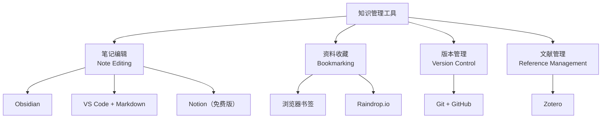
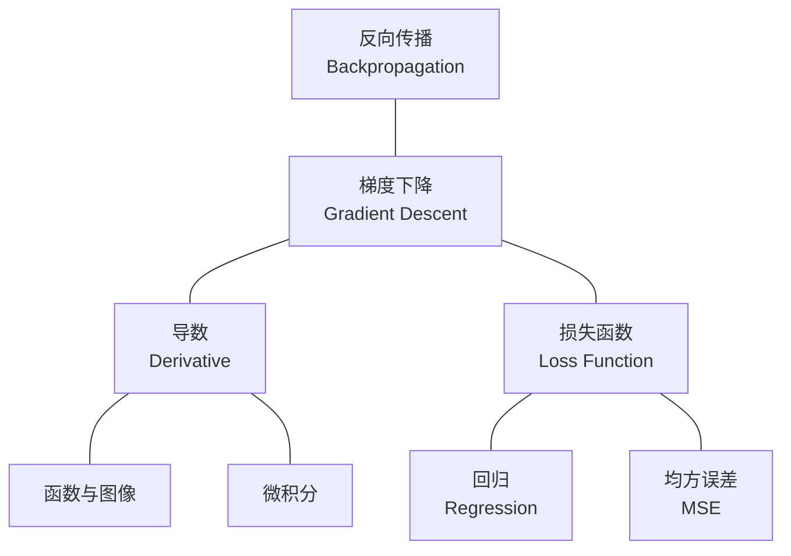

# 知识管理工具

> **所属路径**：`00_高中复习/02_英语基础/04_总结与记笔记/04_知识管理工具`
> **预计学习时间**：40–50 分钟
> **难度等级**：⭐

---

## 前置知识

- [双语术语卡片](../01_双语术语卡片/01_双语术语卡片.md)（了解术语卡片的制作方法，工具需要承载这些卡片）
- [章节摘要](../02_章节摘要/02_章节摘要.md)（掌握摘要写作方法，工具需要管理这些摘要）
- [问题清单](../03_问题清单/03_问题清单.md)（建立问题清单习惯，工具需要追踪这些问题）

> 如果以上内容还不熟悉，建议先完成对应课程再继续。

---

## 学习目标

完成本节后，你将能够：

1. 区分不同类型的知识管理工具（笔记编辑、资料收藏、版本管理、文献管理）并说明各自的适用场景
2. 使用 Markdown 语法创建格式规范的学习笔记
3. 解释卡片盒笔记法的核心理念并将其应用于个人知识库的组织
4. 为自己选择一套合适的知识管理工具组合并搭建基础架构

---

## 正文讲解

### 1. 为什么需要知识管理工具

在前面三节中，你学会了制作术语卡片、写章节摘要和维护问题清单。但随着学习的深入，你的笔记会越来越多——几百张术语卡片、几十篇摘要、上百个问题。如果这些内容散落在不同的纸本、文件、应用中，很快就会陷入"写了找不到、找到读不懂"的困境。

**知识管理（Knowledge Management）** 解决的就是这个问题：如何有效地 **存储、组织、检索和连接** 你的学习成果，让它们不只是一堆孤立的文件，而是一个可以持续生长的知识体系。

好的知识管理工具不是让你花更多时间整理笔记，而是让你花更少的时间找到需要的信息。在选择工具之前，我们先了解有哪些类型的工具可以使用。

### 2. 工具分类总览

知识管理工具可以分为四大类，每一类解决不同的需求：



> 📌 **图解说明**：知识管理工具分为四大类——笔记编辑用于创建和组织笔记，资料收藏用于保存有用的网页和链接，版本管理用于追踪笔记的修改历史，文献管理用于收集和引用学术论文。

我们逐一介绍这四类中最推荐的免费工具。

### 3. 笔记编辑：Markdown 是核心技能

在所有笔记格式中，我们强烈推荐使用 **Markdown** ——一种轻量级的纯文本标记语言。为什么？

- **纯文本**：Markdown 文件就是普通的 `.md` 文本文件，不依赖任何特定软件，任何编辑器都能打开
- **版本友好**：纯文本文件可以用 Git 追踪每次修改，而 Word 文档或 Notion 页面做不到这一点
- **技术生态通用**：GitHub、技术博客、开发文档几乎都使用 Markdown，学会它一举多得
- **格式简洁**：几个简单的符号就能实现标题、列表、粗体、代码块等常用格式

以下是 Markdown 最常用的语法，也是你写学习笔记最需要的：

```markdown
# 一级标题
## 二级标题
### 三级标题

**粗体文字**
*斜体文字*

- 无序列表项 1
- 无序列表项 2

1. 有序列表项 1
2. 有序列表项 2

> 引用文字

`行内代码`

​```python
# 代码块
print("Hello")
​```

[链接文字](URL)


| 列 1 | 列 2 |
| ---- | ---- |
| 数据 | 数据 |
```

两款最推荐的 Markdown 编辑工具：

**Obsidian（免费）**：一款功能强大的本地知识库工具。它把所有笔记存储为本地的 Markdown 文件，支持双向链接（稍后详细介绍）、图谱视图、标签系统。最大的优点是：你的数据完全在自己的电脑上，不会被任何公司"锁定"。

**VS Code + Markdown 扩展**：如果你未来要学编程（在本教程中你一定会），VS Code 是最流行的代码编辑器之一，它也是一个出色的 Markdown 编辑器。安装 "Markdown All in One" 扩展后，就能获得实时预览、快捷键和自动补全功能。

### 4. 卡片盒笔记法：让笔记相互连接

前面介绍的术语卡片、章节摘要和问题清单是三种不同的笔记类型。但如果它们只是存放在不同的文件夹中互不关联，知识就还是碎片化的。 **卡片盒笔记法（Zettelkasten Method）** 提供了一种让笔记"生长"成知识网络的方法。

卡片盒笔记法的核心理念很简单：

1. **每条笔记只包含一个想法**：不要在一个文件里塞入所有内容。每个概念、每个观点、每个发现都单独写成一条笔记。
2. **用链接连接相关笔记**：当一条笔记与另一条笔记有关时，在它们之间创建一个链接。这样，你的知识库就像一张网，而不是一棵孤立的树。
3. **用自己的话写**：每条笔记都是你对原始材料的理解和加工，不是原文摘抄。

在 Obsidian 中，创建笔记间的链接非常简单：只需要写 `[[笔记名称]]` 就能创建一个 **双向链接（Bidirectional Link）** 。当你打开任意一条笔记时，可以看到所有链接到它的其他笔记——这让你能够发现意想不到的知识联系。

举个例子，假设你有以下几条笔记：

- "梯度下降" → 链接到 "导数" 和 "损失函数"
- "导数" → 链接到 "函数与图像" 和 "微积分"
- "损失函数" → 链接到 "回归" 和 "均方误差"

这些链接自然而然地形成了一个知识网络。当你未来学到"反向传播"时，它会链接到"梯度下降"和"链式法则"，进一步扩展这张网。



> 📌 **图解说明**：这张图展示了一个小型知识网络。每个节点是一条笔记，连线表示笔记之间的链接关系。随着学习的推进，新节点不断加入，网络越来越丰富。

### 5. 资料收藏与文献管理

除了自己写的笔记，你还需要管理从外部收集的资料——教程链接、论文 PDF、参考文档等。

**资料收藏**：最简单的方法是在浏览器中创建有组织的书签文件夹。建议按以下结构组织：

```
📁 AI 学习资料
├── 📁 数学基础
│   ├── 线性代数教程
│   └── 概率论参考
├── 📁 编程基础
│   ├── Python 官方文档
│   └── NumPy 教程
├── 📁 机器学习
│   ├── scikit-learn 文档
│   └── 入门教程
└── 📁 工具与环境
    ├── VS Code 文档
    └── Git 教程
```

**文献管理**：当你开始阅读学术论文时（在 [研究与持续学习](../../../04_持续研究/01_研究与持续学习/) 阶段），你需要 **Zotero** ——一款免费开源的文献管理工具。它可以一键从网页保存论文信息，自动提取标题、作者和摘要，支持标签分类和全文搜索。虽然现阶段你可能还用不到它，但提前知道有这样的工具，将来需要时就能迅速上手。

### 6. 版本管理：用 Git 保护你的笔记

你在后续课程中会系统学习 **Git** ——一种版本控制工具。但在这里，你只需要知道一个核心概念：Git 可以记录你文件的每一次修改，就像给文件拍快照一样。如果你不小心删除或修改了某条笔记，随时可以恢复到之前的版本。

对于笔记管理来说，Git 的好处是：

- **永不丢失**：所有修改历史都被保存
- **多设备同步**：配合 GitHub 使用，你可以在不同电脑上访问同一套笔记
- **协作学习**：你甚至可以和同学共同维护一个知识库

在你学完 [版本控制](../../../01_基础能力/01_开发环境与技术英语/05_版本控制/) 课程后，就可以把你的知识库放到 GitHub 上管理了。

### 7. 搭建你的个人知识库

了解了各种工具后，现在来搭建一个实际可用的个人知识库。记住一个重要原则：**最好的工具是你真正会用的那一个。** 不要追求完美的工具搭配，先用最简单的方案开始，根据需要再逐步升级。

**入门方案（推荐零基础学习者）**：

| 需求 | 工具 | 理由 |
| ---- | ---- | ---- |
| 术语卡片 | Anki | 自动间隔重复，手机可用 |
| 学习笔记 | 本地文件夹 + 任意文本编辑器 | 零学习成本，Markdown 格式 |
| 资料收藏 | 浏览器书签 | 无需额外工具 |
| 问题追踪 | Markdown 文件 | 一个文件即可维护 |

**进阶方案（有一定计算机基础后）**：

| 需求 | 工具 | 理由 |
| ---- | ---- | ---- |
| 术语卡片 | Anki | 不变 |
| 学习笔记 | Obsidian | 双向链接，知识网络 |
| 资料收藏 | Obsidian 内嵌链接 | 笔记和资料统一管理 |
| 问题追踪 | Obsidian 标签系统 | 用 `#待解决` `#已解决` 标签管理 |
| 版本管理 | Git + GitHub | 保护笔记，多设备同步 |
| 文献管理 | Zotero | 管理论文和参考资料 |

**推荐的文件夹结构**：

```
📁 我的AI知识库/
├── 📁 00_术语卡片/
│   ├── 数学术语.md
│   ├── 编程术语.md
│   └── ML术语.md
├── 📁 01_学习笔记/
│   ├── 📁 数学基础/
│   ├── 📁 编程基础/
│   └── 📁 机器学习/
├── 📁 02_问题清单/
│   └── questions.md
├── 📁 03_项目记录/
│   └── ...
└── 📁 04_参考资料/
    └── links.md
```

这个结构把你在前三节学到的方法——术语卡片、章节摘要（存放在学习笔记中）、问题清单——整合到了一个统一的体系中。

---

## 动手实践

现在让我们动手搭建你的个人知识库的基础框架。

**步骤 1：创建文件夹结构**

在你的电脑上选择一个固定位置（比如文档文件夹内），创建以下目录：

```
我的AI知识库/
├── 00_术语卡片/
├── 01_学习笔记/
├── 02_问题清单/
├── 03_项目记录/
└── 04_参考资料/
```

**步骤 2：创建第一份笔记文件**

在 `01_学习笔记/` 下创建一个文件 `学习方法笔记.md`，用 Markdown 写下你在本主题（总结与记笔记）中学到的三个关键方法：

```markdown
# 学习方法笔记

## 双语术语卡片
- 核心要点：[用自己的话写 1-2 句]
- 推荐工具：Anki

## 章节摘要
- 核心要点：[用自己的话写 1-2 句]
- 推荐方法：SQ3R + 康奈尔笔记法

## 问题清单
- 核心要点：[用自己的话写 1-2 句]
- 四种问题类型：理解、澄清、关联、应用
```

**步骤 3：创建你的第一份问题清单**

在 `02_问题清单/` 下创建 `questions.md`，把你在学习本教程过程中产生的疑问记录下来。至少写 3 个问题。

**自检标准**：

- 文件夹结构是否创建完成？
- `学习方法笔记.md` 是否使用了 Markdown 格式（标题、列表）？
- `questions.md` 是否包含至少 3 个真实的问题？

---

## 知识管理常用语块

在使用知识管理工具组织技术英文笔记时，以下标签和分类语块可以帮助你建立统一的组织体系：

| 分类标签 | 英文 | 中文含义 | 适用内容 |
| -------- | ---- | -------- | -------- |
| `#concept` | 概念 | 核心定义和原理 | gradient descent, backpropagation |
| `#syntax` | 语法 | 编程语法和用法 | Python list comprehension |
| `#error` | 错误 | 报错信息和解决方案 | TypeError, IndexError |
| `#tool` | 工具 | 库和框架的使用方法 | NumPy, Pandas, PyTorch |
| `#vocab` | 词汇 | 新学到的技术术语 | ablation, epoch, inference |
| `#question` | 问题 | 待解决的疑问 | Why does overfitting happen? |
| `#solved` | 已解决 | 已找到答案的问题 | 问题 + 解决方案 |
| `#review` | 待复习 | 需要间隔复习的内容 | 配合复习计划使用 |
| `#link` | 链接 | 有用的外部资源 | 文档链接、教程链接 |

> 💡 **标签原则**：标签不宜过多。8-12 个核心标签就足够覆盖学习初期的所有笔记类型。随着学习深入，可以逐步增加领域专属标签（如 `#ml`, `#dl`, `#nlp`）。

---

## 记忆策略

### 知识网络构建法

知识管理的终极目标是建立知识之间的**连接**。每次添加新笔记时，问自己两个问题：
1. 这个知识点和我已有的哪些笔记有关？（添加双向链接）
2. 这个知识点属于哪个更大的知识框架？（添加分类标签）

### 间隔复习建议

| 复习时间 | 建议方式 |
| -------- | -------- |
| 每天 | 花 5 分钟整理当天的学习笔记，添加标签和链接 |
| 每周 | 浏览 `#review` 标签下的所有笔记，进行复习 |
| 每月 | 回顾整个知识库的结构，合并重复内容，更新过时信息 |
| 每季度 | 导出核心笔记为文章或教程，实践"输出驱动学习" |

---

## 典型误区

| 误区 | 正确理解 |
| ---- | -------- |
| 花大量时间研究和对比工具 | 选择工具不应超过 30 分钟。先用最简单的开始，不好用再换 |
| 追求笔记的"美观排版" | 笔记是给自己看的，内容清晰远比美观重要。不要在排版上花太多时间 |
| 所有笔记都放在一个文件里 | 一个文件太长会导致查找困难。按主题拆分，每个文件聚焦一个话题 |
| 觉得纸质笔记过时了 | 数字工具和纸质笔记各有优势。很多人习惯先在纸上快速记录，再整理到电子笔记中 |
| 把所有看到的资料都保存下来 | 只保存你真正读过或计划近期阅读的资料。"收藏"不等于"学会" |

---

## 练习题

### 练习 1：工具匹配（难度：⭐）

为以下每个需求选择最合适的工具：

1. 我想在通勤路上用手机复习英文术语
2. 我想把学习笔记同步到多台电脑上
3. 我想在笔记之间建立关联链接
4. 我想保存一篇论文的 PDF 和元数据

选项：Anki、Git + GitHub、Obsidian、Zotero

<details>
<summary>💡 提示</summary>

考虑每个工具的核心功能：Anki 擅长移动端复习，Git 擅长同步和版本管理，Obsidian 擅长笔记间链接，Zotero 擅长文献管理。

</details>

<details>
<summary>✅ 参考答案</summary>

1. **Anki**——支持手机端（AnkiDroid 免费），间隔重复复习术语最方便。
2. **Git + GitHub**——将笔记仓库推送到 GitHub，任何电脑都能拉取最新版本。
3. **Obsidian**——核心特色就是 `[[双向链接]]`，专为建立笔记间关联而设计。
4. **Zotero**——专业的文献管理工具，一键保存论文的 PDF、标题、作者等元数据。

</details>

### 练习 2：设计知识库结构（难度：⭐）

假设你正在同时学习三门课程：高中数学复习、Python 编程入门、英语技术词汇。请设计一个文件夹结构来组织你的学习笔记。要求：

- 使用数字前缀保持顺序
- 至少有两层目录层级
- 包含一个问题清单文件

<details>
<summary>💡 提示</summary>

参考本节"推荐的文件夹结构"，按学科而非按时间来组织笔记。

</details>

<details>
<summary>✅ 参考答案</summary>

```
我的知识库/
├── 00_术语卡片/
│   └── 英语技术词汇.md
├── 01_学习笔记/
│   ├── 01_数学复习/
│   │   ├── 代数笔记.md
│   │   └── 函数笔记.md
│   ├── 02_Python编程/
│   │   ├── 变量与类型.md
│   │   └── 函数与模块.md
│   └── 03_英语基础/
│       └── 阅读技巧.md
├── 02_问题清单/
│   └── questions.md
└── 03_参考资料/
    └── links.md
```

你的结构可能和以上不同，只要逻辑清晰、方便查找即可。关键是有一个合理的分类方式并且坚持使用。

</details>

### 练习 3：Markdown 语法练习（难度：⭐）

请用 Markdown 语法写一段笔记，要求包含以下元素：
- 一个二级标题
- 一段粗体文字
- 一个包含 3 个项目的无序列表
- 一个 2 行 2 列的表格

<details>
<summary>💡 提示</summary>

回顾本节中 Markdown 语法表格的内容。二级标题用 `##`，粗体用 `**文字**`，无序列表用 `-`，表格用 `|` 分隔。

</details>

<details>
<summary>✅ 参考答案</summary>

```markdown
## 今日学习总结

今天学习了 **知识管理工具** 的基本概念。

主要收获：
- 了解了四类知识管理工具
- 学会了 Markdown 基础语法
- 搭建了个人知识库的初始结构

| 工具 | 用途 |
| ---- | ---- |
| Anki | 术语复习 |
| Obsidian | 笔记管理 |
```

你的内容可以不同，只要正确使用了四种语法元素即可。

</details>

---

## 下一步学习

- 📖 下一个模块：[文件与文件夹管理](../../../03_信息素养/01_文件与文件夹管理/)（进入信息素养模块，学习更系统的数字资料管理方法）
- 🔗 相关知识点：[版本控制](../../../01_基础能力/01_开发环境与技术英语/05_版本控制/)（未来学习 Git，可以用它管理你的知识库）
- 🔗 桥接目标：[开发环境与技术英语](../../../01_基础能力/01_开发环境与技术英语/)（本模块的所有学习方法将在基础能力阶段持续使用）

---

## 参考资料

1. [Obsidian 官方网站](https://obsidian.md/) — 免费的本地知识库工具，支持 Markdown 和双向链接（免费软件）
2. [Markdown Guide](https://www.markdownguide.org/) — Markdown 语法的完整参考指南（开源项目，CC BY-SA 许可）
3. [Zotero 官方网站](https://www.zotero.org/) — 免费开源的文献管理工具（开源软件，AGPL 许可）
4. [Zettelkasten Method — Wikipedia](https://en.wikipedia.org/wiki/Zettelkasten) — 卡片盒笔记法的历史和原理（公共知识库，CC BY-SA 许可）
5. [VS Code 官方文档](https://code.visualstudio.com/docs) — Visual Studio Code 编辑器的使用指南（官方文档）
