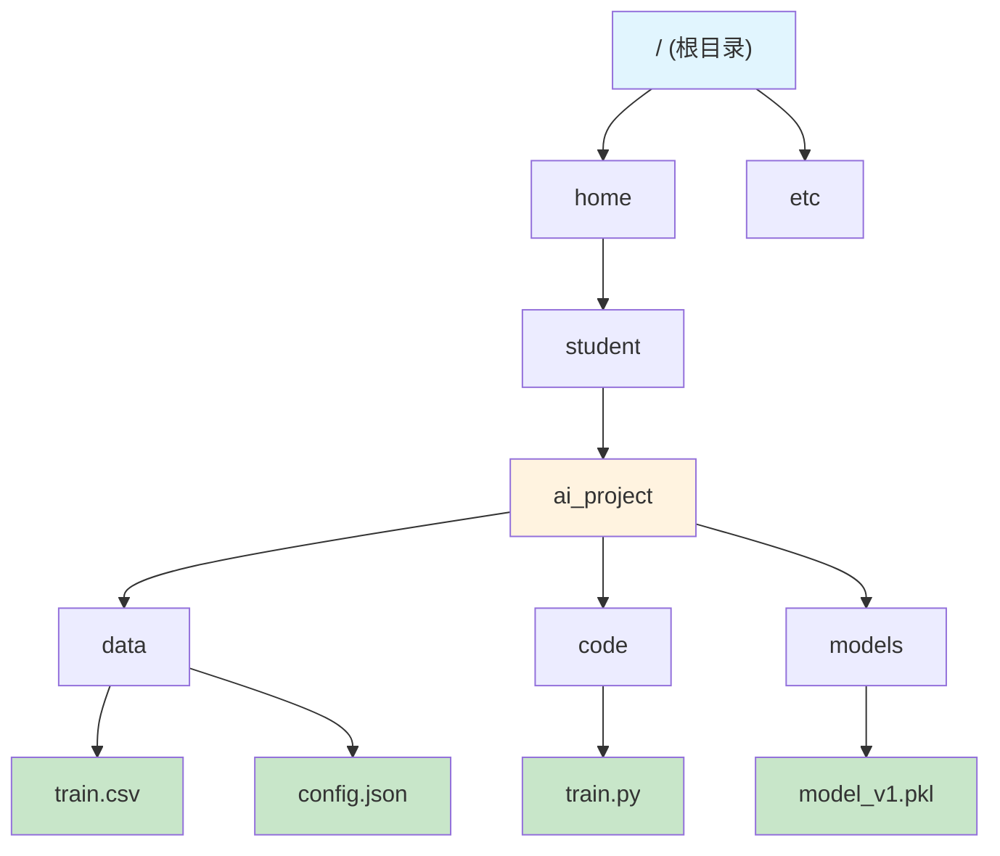
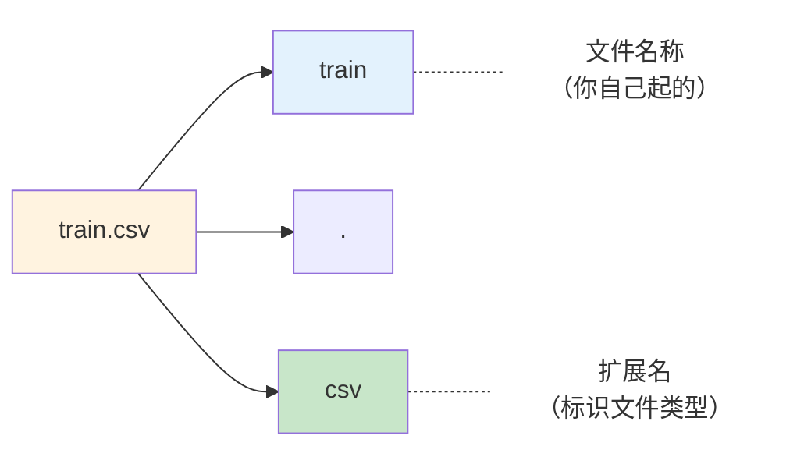

# 路径与扩展名

> **所属路径**：`00_高中复习/03_信息素养/01_文件与文件夹管理/01_路径与扩展名`
> **预计学习时间**：30 分钟
> **难度等级**：⭐

---

## 前置知识

- 基本的计算机操作（打开文件夹、创建文件、复制粘贴等）

> 本节是信息素养模块的第一课，不需要额外的前置课程。只要你会用电脑打开文件夹和文件，就可以开始了。

---

## 学习目标

完成本节后，你将能够：

1. 解释什么是文件路径，并区分**绝对路径**和**相对路径**
2. 识别不同操作系统的路径分隔符差异（`/` 与 `\`）
3. 说出常见文件扩展名的含义，并解释扩展名在人工智能学习中的作用
4. 使用 `.`、`..`、`~` 进行路径导航
5. 使用 Python 的 `os.path` 和 `pathlib` 模块操作文件路径

---

## 正文讲解

### 1. 你的文件住在哪里？

想象你住在一栋大楼里，如果有人问你家地址，你会说"XX 市 XX 区 XX 路 XX 号 XX 栋 XX 单元 XX 室"。这个地址从城市开始，一级一级精确到你家门口，任何人拿到这串地址都能找到你。

计算机中的文件也是一样——每个文件都住在某个"地址"上，这个地址就叫做**文件路径（File Path）**。路径告诉操作系统："请到这个位置去找这个文件。"如果路径写错了，操作系统就会告诉你"文件找不到"（`FileNotFoundError`），就像快递员拿着一个写错的地址，当然送不到了。

在人工智能的学习和实践中，路径的重要性怎么强调都不过分：训练数据集可能有几万个文件分散在不同文件夹中，模型权重文件需要按版本保存在特定位置，配置文件要放在程序能找到的地方。**搞错一个路径，整个程序就跑不起来。** 所以，我们先来彻底理解路径这个概念。

### 2. 目录树：文件系统的骨架

在讨论路径之前，我们需要先了解计算机是怎么组织文件的。计算机使用一种叫做**目录树（Directory Tree）** 的层级结构来管理文件，就像一棵倒过来的树——树根在最上面，树枝向下延伸。

下面这张图展示了一个典型的项目目录树：



> 📌 **图解说明**：这是一个简化的 Linux/macOS 文件系统目录树。根目录 `/` 是最顶层，然后通过 `home` → `student` → `ai_project` 一路深入到具体的项目文件夹。数据文件、代码文件和模型文件分别放在不同的子目录中，条理清晰。

从图中可以看到，每个文件都有一条从根目录到它的唯一路线。比如 `train.csv` 的完整路线是：`/` → `home` → `student` → `ai_project` → `data` → `train.csv`。把这条路线用路径分隔符连起来，就是这个文件的路径。

### 3. 绝对路径与相对路径

路径有两种写法，就像描述你家位置有两种方式。

#### 绝对路径

**绝对路径（Absolute Path）** 从文件系统的根目录开始，一级一级写到目标文件，就像你的完整家庭住址。不管你站在文件系统的哪个位置，绝对路径都能唯一确定一个文件。

在 Linux 和 macOS 上，绝对路径以 `/` 开头：

```
/home/student/ai_project/data/train.csv
```

在 Windows 上，绝对路径以盘符开头：

```
C:\Users\student\ai_project\data\train.csv
```

绝对路径的好处是**不会产生歧义**——无论你在哪个目录下运行程序，绝对路径都能准确找到文件。但缺点是太长了，而且换一台电脑就可能失效（因为别人的用户名或目录结构可能不同）。

#### 相对路径

**相对路径（Relative Path）** 不从根目录开始，而是从"你当前所在的位置"出发。就像你告诉同一层楼的邻居："我家在你家隔壁左边第二间"——你不需要从城市名开始说起。

假设你当前在 `ai_project` 目录下，那么 `train.csv` 的相对路径就是：

```
data/train.csv
```

相对路径更短，而且把项目文件夹移到别的位置后，文件之间的相对关系不变，程序仍然能正常工作。这就是为什么**编程项目中推荐使用相对路径**。

### 4. 路径分隔符：`/` 还是 `\`？

你可能已经注意到了：Linux/macOS 的路径用正斜杠 `/`（Forward Slash），Windows 的路径用反斜杠 `\`（Backslash）。这个差异是历史原因造成的，但它经常给初学者带来困扰。

| 操作系统       | 分隔符 | 示例                                        |
| -------------- | ------ | ------------------------------------------- |
| Linux / macOS  | `/`    | `/home/student/data/train.csv`              |
| Windows        | `\`    | `C:\Users\student\data\train.csv`           |

好消息是：现代 Windows 其实也能识别 `/` 作为路径分隔符，而 Python 的 `pathlib` 模块会自动处理这个差异。所以在编写代码时，你不需要操心这个问题——后面我们会看到怎么做。

> 💡 **小贴士**：在 Python 字符串中，反斜杠 `\` 是转义字符的起始符号（比如 `\n` 表示换行）。如果你要在字符串中写 Windows 路径，需要用双反斜杠 `\\` 或者在字符串前面加 `r`（表示"原始字符串"）：`r"C:\Users\student"`。

### 5. 路径导航的三个快捷符号

在使用命令行或编写代码时，有三个特殊符号可以帮助你快速导航文件系统：

| 符号 | 含义                         | 示例                        |
| ---- | ---------------------------- | --------------------------- |
| `.`  | 当前目录                     | `./data/train.csv`          |
| `..` | 上一级目录（父目录）         | `../other_project/`         |
| `~`  | 用户主目录（Home Directory） | `~/ai_project/`（Linux/macOS） |

来看一个实际场景。假设你的项目目录结构如下：

```
ai_project/
├── code/
│   └── train.py
└── data/
    └── train.csv
```

你正在编辑 `code/train.py`，想要读取 `data/train.csv`。从 `code/` 目录出发，你需要先回到上一级（`ai_project/`），再进入 `data/`。相对路径就是：

```
../data/train.csv
```

这里 `..` 的作用是"后退一步"——从 `code/` 回到 `ai_project/`。这个技巧在编程中非常常用。

### 6. 扩展名：文件的"身份证"

现在我们来聊文件名中另一个重要的部分——**文件扩展名（File Extension）**。

每个文件名通常由两部分组成：**名称**和**扩展名**，用一个点 `.` 隔开。比如 `train.csv` 中，`train` 是名称，`.csv` 是扩展名。



> 📌 **图解说明**：文件名由名称和扩展名两部分组成，中间用点号分隔。名称由用户自定义，扩展名则标识了文件的类型。

扩展名的作用就像人的"身份证"——它告诉操作系统和用户："我是什么类型的文件，应该用什么程序来打开我。" 当你双击一个 `.pdf` 文件时，操作系统看到扩展名是 `.pdf`，就知道要用 PDF 阅读器来打开它；双击 `.mp3` 文件，就会用音乐播放器。

> ⚠️ **注意**：扩展名只是一个"标签"，改掉扩展名并不会改变文件的实际内容。如果你把 `photo.jpg` 改名为 `photo.txt`，操作系统会尝试用文本编辑器打开它，结果你看到的将是一堆乱码——因为文件的内容仍然是图片数据。

### 7. 人工智能学习中的常见扩展名

在学习人工智能的过程中，你会频繁接触到以下这些文件类型。现在先混个眼熟，后续课程中你会逐一深入使用它们：

| 扩展名   | 全称 / 含义                          | 用途                                   | 打开方式                    |
| -------- | ------------------------------------ | -------------------------------------- | --------------------------- |
| `.py`    | Python                               | Python 源代码文件                      | Python 解释器、代码编辑器    |
| `.ipynb` | IPython Notebook                     | Jupyter 交互式笔记本                   | Jupyter Notebook / JupyterLab |
| `.csv`   | Comma-Separated Values               | 逗号分隔的表格数据                     | Excel、Pandas、文本编辑器    |
| `.json`  | JavaScript Object Notation           | 结构化配置或数据文件                   | 文本编辑器、Python json 库   |
| `.txt`   | Text                                 | 纯文本文件                             | 任何文本编辑器               |
| `.md`    | Markdown                             | 带格式的文档（如本教程）               | Markdown 编辑器、GitHub      |
| `.pkl`   | Pickle                               | Python 对象的序列化存储（如模型权重）  | Python pickle 库             |
| `.h5`    | HDF5                                 | 大规模数据或模型权重存储               | h5py 库、TensorFlow          |
| `.pt`    | PyTorch                              | PyTorch 模型权重                       | PyTorch 库                   |
| `.yaml`  | YAML Ain't Markup Language           | 配置文件（可读性好）                   | 文本编辑器、Python yaml 库   |
| `.png`   | Portable Network Graphics            | 图片（常用于可视化输出）               | 图片查看器                   |

看到没有？光是文件类型就已经涉及到了代码、数据、模型、配置、文档和可视化——这些正是人工智能项目中最核心的文件类别。能快速通过扩展名判断文件用途，是你高效工作的基本功。

### 8. 操作系统如何使用扩展名

不同操作系统对扩展名的处理方式略有不同，了解这些差异可以帮助你避免一些常见的坑：

- **Windows**：高度依赖扩展名。Windows 默认隐藏已知文件类型的扩展名（这经常导致初学者看不到真正的扩展名），并且通过扩展名来决定用哪个程序打开文件。建议你在 Windows 的文件资源管理器中开启"显示文件扩展名"选项。
- **macOS / Linux**：虽然也会参考扩展名，但更依赖文件内容本身的"魔术字节"（Magic Bytes）来判断文件类型。即使你删掉扩展名，系统通常也能正确识别文件类型。不过在编程时，扩展名仍然是文件类型的主要标识。

> 💡 **开启 Windows 文件扩展名显示**：打开文件资源管理器 → 点击顶部"查看"选项卡 → 勾选"文件扩展名"。这是学习编程前的必备设置！

---

## 动手实践

前面讲了这么多概念，现在让我们用 Python 来动手操作路径。Python 提供了两套处理路径的工具：较早的 `os.path` 模块和更现代的 `pathlib` 模块。我们两个都试试，然后你就会明白为什么 `pathlib` 是更推荐的选择。

### 方式一：使用 os.path

```python
# 文件：code/path_demo_os.py
# 使用 os.path 模块操作文件路径
# 环境要求：Python 3.10+（无需额外安装库）

import os

# 1. 拼接路径
project_dir = os.path.join("ai_project", "data", "train.csv")
print("拼接路径:", project_dir)

# 2. 获取当前工作目录（绝对路径）
cwd = os.getcwd()
print("当前目录:", cwd)

# 3. 把相对路径转成绝对路径
abs_path = os.path.abspath("data/train.csv")
print("绝对路径:", abs_path)

# 4. 拆分文件名和扩展名
filename = "model_v2.pkl"
name, ext = os.path.splitext(filename)
print(f"文件名: {name}, 扩展名: {ext}")

# 5. 获取路径中的目录部分和文件名部分
full_path = "/home/student/ai_project/data/train.csv"
print("目录部分:", os.path.dirname(full_path))
print("文件名部分:", os.path.basename(full_path))

# 6. 检查路径是否存在
print("当前目录存在吗?", os.path.exists("."))
print("假路径存在吗?", os.path.exists("/no/such/path"))
```

**运行命令**：`python code/path_demo_os.py`

**预期输出**（当前目录部分因你的实际环境而异）：

```
拼接路径: ai_project/data/train.csv
当前目录: /home/student
绝对路径: /home/student/data/train.csv
文件名: model_v2, 扩展名: .pkl
目录部分: /home/student/ai_project/data
文件名部分: train.csv
当前目录存在吗? True
假路径存在吗? False
```

### 方式二：使用 pathlib（推荐）

```python
# 文件：code/path_demo_pathlib.py
# 使用 pathlib 模块操作文件路径（Python 3.4+ 推荐方式）
# 环境要求：Python 3.10+（无需额外安装库）

from pathlib import Path

# 1. 创建路径对象——自动处理分隔符差异！
project_path = Path("ai_project") / "data" / "train.csv"
print("拼接路径:", project_path)

# 2. 获取当前工作目录
cwd = Path.cwd()
print("当前目录:", cwd)

# 3. 转成绝对路径
abs_path = Path("data/train.csv").resolve()
print("绝对路径:", abs_path)

# 4. 获取文件名的各个部分
p = Path("/home/student/ai_project/data/train.csv")
print("文件名:", p.name)       # train.csv
print("不含扩展名:", p.stem)   # train
print("扩展名:", p.suffix)     # .csv
print("父目录:", p.parent)     # /home/student/ai_project/data

# 5. 判断路径是文件还是目录
print("当前目录是目录吗?", Path(".").is_dir())
print("当前目录是文件吗?", Path(".").is_file())

# 6. 列出某个目录下的所有 .py 文件（如果存在的话）
current = Path(".")
py_files = list(current.glob("*.py"))
print("当前目录下的 .py 文件:", py_files)

# 7. 用 / 运算符让路径拼接像写地址一样自然
model_dir = Path("models")
model_file = model_dir / "v1" / "best_model.pt"
print("模型文件路径:", model_file)
```

**运行命令**：`python code/path_demo_pathlib.py`

**预期输出**：

```
拼接路径: ai_project/data/train.csv
当前目录: /home/student
绝对路径: /home/student/data/train.csv
文件名: train.csv
不含扩展名: train
扩展名: .csv
父目录: /home/student/ai_project/data
当前目录是目录吗? True
当前目录是文件吗? False
当前目录下的 .py 文件: []
模型文件路径: models/v1/best_model.pt
```

注意 `pathlib` 使用 `/` 运算符来拼接路径，这比 `os.path.join()` 更直观易读。而且 `pathlib` 会自动根据操作系统选择正确的分隔符——在 Windows 上运行时会自动使用 `\`，在 Linux/macOS 上使用 `/`，你完全不用操心。

> 💡 **建议**：新项目中优先使用 `pathlib`，它是 Python 官方推荐的现代路径处理方式。

---

## 典型误区

| 误区                                         | 正确理解                                                                                                   |
| -------------------------------------------- | ---------------------------------------------------------------------------------------------------------- |
| 改了扩展名就改了文件类型                     | 扩展名只是标签，不改变文件内容。把 `.jpg` 改成 `.txt` 不会让图片变成文本                                   |
| 在代码中直接写死绝对路径                     | 绝对路径在你的电脑上能用，换台电脑就失效。应使用相对路径或通过配置文件管理路径                              |
| 手动拼接路径字符串（如 `"data" + "/" + "file"`） | 手动拼接容易出错且不跨平台。应使用 `os.path.join()` 或 `pathlib` 的 `/` 运算符                              |
| Windows 上路径中的 `\` 直接写在 Python 字符串里 | `\` 在 Python 中是转义符，会导致意外错误。应使用原始字符串 `r"C:\path"` 或正斜杠 `"C:/path"`              |

---

## 练习题

### 练习 1：判断路径类型（难度：⭐）

以下哪些是绝对路径，哪些是相对路径？

- A. `/home/student/data/train.csv`
- B. `data/train.csv`
- C. `C:\Users\student\Desktop\report.pdf`
- D. `../models/best_model.pt`
- E. `~/projects/ai_project/`

<details>
<summary>💡 提示</summary>

绝对路径从文件系统的"根"开始（Linux/macOS 以 `/` 开头，Windows 以盘符如 `C:\` 开头）。相对路径从当前位置出发，不以根目录开头。`~` 代表用户主目录，在 Shell 中会被展开为绝对路径，但在编程中通常需要手动展开。

</details>

<details>
<summary>✅ 参考答案</summary>

- **A. 绝对路径** — 以 `/` 开头，从根目录出发
- **B. 相对路径** — 没有以 `/` 或盘符开头，从当前目录出发
- **C. 绝对路径** — 以 Windows 盘符 `C:\` 开头
- **D. 相对路径** — 以 `..` 开头，表示从当前目录的父目录出发
- **E. 严格来说是相对路径** — `~` 是 Shell 的快捷写法，代表用户主目录。大多数编程语言不会自动展开 `~`，需要用 `os.path.expanduser("~")` 或 `Path.home()` 来转换为真正的绝对路径

</details>

### 练习 2：通过扩展名判断文件用途（难度：⭐）

一个 AI 项目的文件夹中有以下文件。请根据扩展名判断每个文件最可能的用途，并从选项中选择：

文件列表：`preprocess.py`、`config.yaml`、`dataset.csv`、`experiment.ipynb`、`model_weights.pt`

选项：A. 训练数据 B. 模型权重 C. Python 代码 D. 配置文件 E. 交互式实验笔记本

<details>
<summary>💡 提示</summary>

回顾第 7 节中的扩展名对照表，根据每个文件的扩展名找到对应的文件类型和典型用途。

</details>

<details>
<summary>✅ 参考答案</summary>

- `preprocess.py` → **C. Python 代码**（`.py` 是 Python 源代码文件）
- `config.yaml` → **D. 配置文件**（`.yaml` 是常用的配置文件格式）
- `dataset.csv` → **A. 训练数据**（`.csv` 是逗号分隔的表格数据文件）
- `experiment.ipynb` → **E. 交互式实验笔记本**（`.ipynb` 是 Jupyter Notebook 文件）
- `model_weights.pt` → **B. 模型权重**（`.pt` 是 PyTorch 模型权重文件）

</details>

### 练习 3：用 pathlib 写路径操作代码（难度：⭐⭐）

假设你有如下项目结构：

```
my_project/
├── src/
│   └── train.py
├── data/
│   ├── raw/
│   │   └── images.zip
│   └── processed/
│       └── features.csv
└── models/
    └── v1/
        └── best.pt
```

请使用 `pathlib` 完成以下任务（写在一个 Python 文件中）：

1. 创建一个指向 `features.csv` 的路径对象
2. 获取 `features.csv` 的扩展名和不含扩展名的文件名
3. 从 `src/train.py` 出发，用相对路径表达 `data/processed/features.csv` 的位置
4. 将 `best.pt` 的路径中的文件名替换为 `best_v2.pt`

<details>
<summary>💡 提示</summary>

使用 `Path` 对象的 `.suffix` 属性获取扩展名，`.stem` 获取不含扩展名的文件名。从 `src/` 到 `data/processed/` 需要先用 `..` 回到 `my_project/`。替换文件名可以用 `.with_name()` 方法。

</details>

<details>
<summary>✅ 参考答案</summary>

```python
from pathlib import Path

# 1. 创建路径对象
features_path = Path("my_project") / "data" / "processed" / "features.csv"
print("路径:", features_path)

# 2. 获取扩展名和文件名
print("扩展名:", features_path.suffix)       # .csv
print("不含扩展名:", features_path.stem)      # features

# 3. 从 src/train.py 出发的相对路径
relative = Path("..") / "data" / "processed" / "features.csv"
print("相对路径:", relative)                   # ../data/processed/features.csv

# 4. 替换文件名
model_path = Path("my_project") / "models" / "v1" / "best.pt"
new_model_path = model_path.with_name("best_v2.pt")
print("新模型路径:", new_model_path)           # my_project/models/v1/best_v2.pt
```

</details>

### 练习 4：找出路径中的错误（难度：⭐⭐）

以下 Python 代码中有 3 处与路径相关的错误，请找出并修正：

```python
import os

# 读取训练数据
data_path = "C:\Users\student\project\data\new_data.csv"

# 拼接模型保存路径
model_dir = "models"
model_name = "best.pt"
save_path = model_dir + "/" + model_name

# 检查文件是否存在
if os.path.exists(data_path):
    print("找到数据文件")
```

<details>
<summary>💡 提示</summary>

注意三点：（1）Python 字符串中 `\` 的含义；（2）手动拼接路径的问题；（3）虽然逻辑上没错，但第一个路径写法会导致转义问题——`\U`、`\n` 等可能被 Python 当作转义序列。

</details>

<details>
<summary>✅ 参考答案</summary>

**错误 1**：`data_path` 中的反斜杠会被 Python 当作转义字符。`\U` 会触发 Unicode 转义，`\n` 会变成换行符。

修正：使用原始字符串或正斜杠。

```python
data_path = r"C:\Users\student\project\data\new_data.csv"
# 或者
data_path = "C:/Users/student/project/data/new_data.csv"
```

**错误 2**：手动用 `+` 和 `/` 拼接路径，不跨平台且容易出错。

修正：使用 `os.path.join()` 或 `pathlib`。

```python
save_path = os.path.join(model_dir, model_name)
# 或者
from pathlib import Path
save_path = Path(model_dir) / model_name
```

**错误 3**：使用了硬编码的绝对路径 `C:\Users\student\...`，换台电脑就无法运行。

修正：使用相对路径或从配置文件读取。

```python
data_path = Path("data") / "new_data.csv"
```

</details>

---

## 下一步学习

- 📖 下一个知识点：[命名规范](../02_命名规范/02_命名规范.md) — 学会路径之后，接下来我们讨论如何给文件和文件夹起一个好名字
- 🔗 相关知识点：[版本备份](../03_版本备份/03_版本备份.md) — 了解如何管理文件的不同版本
- 🔗 相关知识点：[命令行](../../../../01_基础能力/01_开发环境与技术英语/12_命令行/) — 后续课程中你将学习在命令行中使用路径导航文件系统

---

## 参考资料

1. [Python 官方文档 — pathlib](https://docs.python.org/3/library/pathlib.html) — Python 标准库中路径操作模块的完整参考文档（官方文档）
2. [Python 官方文档 — os.path](https://docs.python.org/3/library/os.path.html) — 传统路径操作模块的参考文档（官方文档）
3. [MDN Web Docs — 什么是文件路径？](https://developer.mozilla.org/en-US/docs/Learn_web_development/Getting_started/Environment_setup/Dealing_with_files) — 面向初学者的文件与路径基础介绍（CC BY-SA 许可）
4. [Linux 文件系统层次标准（FHS）](https://refspecs.linuxfoundation.org/FHS_3.0/fhs/index.html) — Linux 基金会维护的目录结构标准（开放标准）
