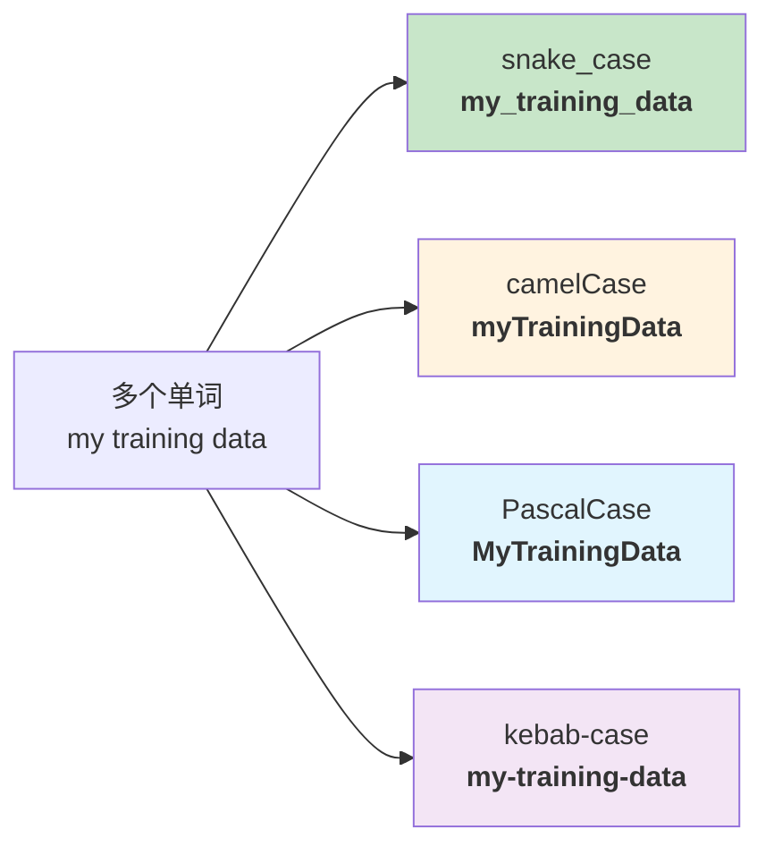
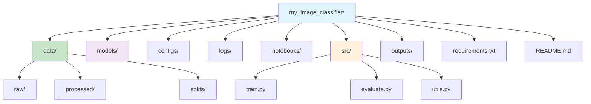

# 命名规范

> **所属路径**：`00_高中复习/03_信息素养/01_文件与文件夹管理/02_命名规范`
> **预计学习时间**：30 分钟
> **难度等级**：⭐

---

## 前置知识

- [路径与扩展名](../01_路径与扩展名/01_路径与扩展名.md)

> 如果你还不清楚什么是文件路径、扩展名以及目录树的层级结构，建议先完成上面的课程再继续。

---

## 学习目标

完成本节后，你将能够：

1. 解释为什么文件和文件夹的命名规范在编程与人工智能项目中至关重要
2. 区分并正确使用四种常见命名风格：snake_case、camelCase、PascalCase、kebab-case
3. 运用日期格式（YYYY-MM-DD）、版本号等策略为文件起清晰、可排序的名称
4. 识别并避免在文件名中使用空格和特殊字符
5. 说明不同操作系统对文件名大小写敏感性的差异
6. 为一个典型的人工智能项目设计合理的文件夹组织结构

---

## 正文讲解

### 1. 一个"名字"引发的灾难

想象一下：你正在做一个图像识别项目，训练了好几轮模型，每一轮都保存了模型文件。第一天你把模型存成 `model.pkl`，第二天又存了一个 `Model.pkl`，第三天存了 `model final.pkl`，第四天存了 `model（最终版）.pkl`……一周之后，你打开项目文件夹，面对着一堆名字五花八门的文件，完全想不起来哪个才是效果最好的那个模型。

这不是笑话——在真实的人工智能项目中，一个团队可能会产生数千个文件：训练数据集、预处理脚本、模型权重、配置文件、实验日志、可视化图表……如果没有统一的 **命名规范（Naming Convention）**，项目很快就会陷入混乱。文件名不只是一个标签，它是你和未来的自己（以及团队成员）沟通的第一道桥梁。

那么，怎样给文件起名才算"规范"呢？我们从最基本的命名风格说起。

### 2. 四种常见命名风格

在编程和技术领域，人们总结出了几种广泛使用的命名风格。它们各有特点，适用于不同场景。

#### snake_case（蛇形命名法）

所有字母小写，单词之间用下划线 `_` 连接，就像一条蛇趴在地上：

```
train_data.csv
image_classifier.py
learning_rate_scheduler.py
```

snake_case 是 Python 社区最推荐的命名风格——Python 的变量名、函数名、模块名几乎都用它。因此，在人工智能项目中，**文件和文件夹名称默认推荐使用 snake_case**。

#### camelCase（小驼峰命名法）

第一个单词小写，后续每个单词首字母大写，看起来像骆驼的驼峰：

```
trainData.csv
imageClassifier.js
learningRate.json
```

camelCase 常见于 JavaScript 和 Java 社区。在前端项目或配置文件中你会经常遇到它。

#### PascalCase（大驼峰命名法）

每个单词的首字母都大写，没有分隔符：

```
TrainData.csv
ImageClassifier.py
NeuralNetwork.py
```

PascalCase 在编程中常用于类名（比如 Python 的类名推荐使用 PascalCase），在文件命名中则较少使用。

#### kebab-case（短横线命名法）

所有字母小写，单词之间用短横线 `-` 连接，就像食物串在烤肉签上：

```
train-data.csv
image-classifier.py
learning-rate.json
```

kebab-case 在网页开发中很常见（比如 URL、CSS 类名），但在 Python 项目中应尽量避免，因为 Python 的 `import` 语句不支持包含短横线的模块名。

下面这张图总结了四种风格的对比：



> 📌 **图解说明**：同一个含义"我的训练数据"在四种命名风格下的写法。绿色的 snake_case 是 Python 和人工智能项目中最推荐的风格。

从图中可以看到，四种风格的核心区别在于如何分隔单词。选择哪一种取决于你所使用的编程语言和团队约定，但最重要的原则是：**在同一个项目中只使用一种风格，保持一致**。

### 3. 文件命名的黄金法则

掌握了命名风格之后，我们来看看给文件起名时应该遵循的几条黄金法则。

#### 法则一：名字要有描述性

文件名应该让人一眼就知道里面装的是什么。对比一下这两组文件名：

| ❌ 坏名字 | ✅ 好名字 | 原因 |
| --------- | --------- | ---- |
| `data.csv` | `mnist_train_images.csv` | 说清楚了是什么数据集、什么用途 |
| `model.pkl` | `resnet50_epoch20_acc95.pkl` | 包含模型架构、训练轮次、准确率 |
| `test.py` | `test_data_loader.py` | 明确了测试的是哪个模块 |
| `图片1.png` | `loss_curve_experiment_03.png` | 说明了图片内容和所属实验 |

#### 法则二：使用日期时采用 YYYY-MM-DD 格式

当你需要在文件名中包含日期时，请始终使用 `YYYY-MM-DD`（年-月-日）格式，这是 **ISO 8601** 国际标准：

```
2025-01-15_experiment_log.txt
2025-03-22_training_data_v2.csv
```

为什么不能用 `01-15-2025`（月-日-年）或 `15-01-2025`（日-月-年）？因为只有 `YYYY-MM-DD` 格式在按文件名排序时会自动按时间先后排列。来看一个例子：

```
# YYYY-MM-DD：排序结果就是时间顺序 ✅
2025-01-15_log.txt
2025-02-03_log.txt
2025-12-25_log.txt

# MM-DD-YYYY：排序结果混乱 ❌
01-15-2025_log.txt
02-03-2025_log.txt
12-25-2025_log.txt   ← 如果跨年，2024 的 12 月会排在 2025 的 01 月后面
```

#### 法则三：版本号有规矩

在文件名中加入版本号时，推荐使用 `v` + 数字的格式，并使用前导零保持对齐：

```
config_v01.yaml
config_v02.yaml
config_v10.yaml
```

为什么要用 `v01` 而不是 `v1`？因为当版本号超过 9 之后，`v1` 和 `v10` 在字母排序中会紧挨在一起（`v1` → `v10` → `v2`），而 `v01` → `v02` → `v10` 则完美按数字顺序排列。

#### 法则四：数字序号使用前导零

这条法则和版本号同理，适用于所有需要排序的数字编号：

```
# 有前导零：排序正确 ✅
image_001.png
image_002.png
image_010.png
image_100.png

# 无前导零：排序混乱 ❌
image_1.png
image_10.png    ← 跑到了 image_2 前面！
image_100.png   ← 跑到了 image_2 前面！
image_2.png
```

### 4. 必须避免的"危险字符"

有些字符在文件名中看似无害，实际上会引发各种问题。以下是你需要严格避免的字符：

| 危险字符 | 问题 | 示例 |
| -------- | ---- | ---- |
| **空格** ` ` | 命令行中需要用引号或转义符处理，极易出错 | `my model.pkl` → 命令行会把它当成两个文件 |
| **中文字符** | 不同系统的编码不一致，可能导致文件名乱码 | `模型_最终版.pkl` → 在某些服务器上变成乱码 |
| **特殊符号** `! @ # $ % ^ & * ( )` | 在命令行中有特殊含义，容易被错误解析 | `data(v2).csv` → 括号在 Shell 中表示子命令 |
| **斜杠** `/` `\` | 被操作系统解析为路径分隔符 | `train/test.csv` → 系统以为你要进入 `train` 文件夹 |
| **冒号** `:` | Windows 不允许文件名包含冒号 | `log:2025.txt` → Windows 上无法创建 |
| **问号、星号** `?` `*` | 被命令行解析为通配符 | `data*.csv` → 会匹配所有以 `data` 开头的 csv 文件 |

最安全的做法是：**文件名只使用英文字母（a-z、A-Z）、数字（0-9）、下划线（_）和短横线（-）**。

想一想：上一节课中我们学到的 [路径与扩展名](../01_路径与扩展名/01_路径与扩展名.md) 里提到，路径是由目录名和文件名拼接而成的。如果文件名中包含了空格或特殊符号，整个路径都可能出问题——这就是命名规范和路径知识紧密关联的地方。

### 5. 大小写敏感性：一个隐蔽的陷阱

你可能会好奇：`Model.pkl` 和 `model.pkl` 是同一个文件吗？答案是——**取决于你用的操作系统**。

| 操作系统 | 大小写敏感性 | 说明 |
| -------- | ------------ | ---- |
| **Linux** | ✅ 区分大小写 | `Model.pkl` 和 `model.pkl` 是两个不同的文件 |
| **macOS** | ❌ 默认不区分 | `Model.pkl` 和 `model.pkl` 被视为同一个文件 |
| **Windows** | ❌ 不区分 | `Model.pkl` 和 `model.pkl` 被视为同一个文件 |

这个差异在团队协作中特别危险。假设你在 macOS 上开发，把 `Config.yaml` 和 `config.yaml` 当作同一个文件，但你的同事在 Linux 服务器上运行代码时，它们是两个完全不同的文件。代码在你电脑上能跑通，到了服务器上就报错——这种 bug 非常难以排查。

**最佳实践**：文件名和文件夹名统一使用小写字母，从根源上避免大小写混淆。

### 6. 人工智能项目的文件夹组织

学会了给单个文件起名之后，我们来看看如何组织一个人工智能项目的文件夹结构。一个结构清晰的项目，就像一个整理有序的工具箱——每样东西都有自己的位置，需要时一找就到。

下面是一个典型的人工智能项目目录结构：

```
my_image_classifier/
├── data/                    ← 数据文件
│   ├── raw/                 ← 原始数据（不修改）
│   ├── processed/           ← 清洗后的数据
│   └── splits/              ← 训练/验证/测试划分
├── models/                  ← 训练好的模型权重
│   ├── resnet50_v01.pth
│   └── resnet50_v02.pth
├── configs/                 ← 配置文件
│   ├── train_config.yaml
│   └── eval_config.yaml
├── logs/                    ← 训练日志
│   ├── 2025-01-15_train.log
│   └── 2025-01-16_train.log
├── notebooks/               ← Jupyter Notebook 实验记录
│   └── eda_exploration.ipynb
├── src/                     ← 源代码
│   ├── train.py
│   ├── evaluate.py
│   └── utils.py
├── outputs/                 ← 输出结果（图表、预测结果等）
│   └── loss_curve_v02.png
├── requirements.txt         ← 依赖库清单
└── README.md                ← 项目说明
```



> 📌 **图解说明**：一个典型的图像分类项目的目录结构。不同类型的文件被归入不同的文件夹：数据放 `data/`，代码放 `src/`，模型放 `models/`，日志放 `logs/`。这种"各就各位"的组织方式让项目一目了然。

从这个结构中可以提炼出几个关键原则：

1. **按文件类型分类**：数据、代码、模型、日志、配置各有专属文件夹
2. **数据分层管理**：原始数据（`raw/`）和处理后的数据（`processed/`）分开存放，确保原始数据不被意外修改
3. **文件夹名全部小写**：使用 snake_case，简洁一致
4. **文件名包含关键信息**：模型文件名包含架构和版本号，日志文件名包含日期

### 7. 完整命名规范速查表

让我们把前面学到的所有规则整理成一张速查表，方便日后随时查阅：

| 规则 | 推荐做法 | 示例 |
| ---- | -------- | ---- |
| 命名风格 | 使用 snake_case | `train_model.py` |
| 描述性 | 名称体现内容/用途 | `mnist_train_images.csv` |
| 日期格式 | YYYY-MM-DD | `2025-01-15_log.txt` |
| 版本号 | v + 前导零数字 | `model_v03.pth` |
| 序号 | 固定位数前导零 | `image_001.png` |
| 字符限制 | 只用字母、数字、`_`、`-` | `config_v02.yaml` |
| 大小写 | 统一使用小写 | `data_loader.py` |
| 扩展名 | 保留正确扩展名 | `.py` `.csv` `.yaml` |

---

## 动手实践

学完了命名规范的理论，现在让我们用 Python 来动手验证这些规则。下面这段代码会演示：文件名排序受命名方式的影响，以及如何用 Python 批量重命名不规范的文件名。

```python
# 文件：code/naming_demo.py
# 演示命名规范对文件排序和管理的影响
# 环境要求：Python 3.10+（无额外依赖）

import os
import re

# === 第一部分：演示日期格式对排序的影响 ===
print("=" * 50)
print("【演示 1】日期格式对排序的影响")
print("=" * 50)

# 不规范的日期格式（月-日-年）
bad_dates = [
    "12-25-2024_log.txt",
    "01-15-2025_log.txt",
    "02-03-2025_log.txt",
    "11-30-2024_log.txt",
]

# 规范的日期格式（年-月-日）
good_dates = [
    "2024-12-25_log.txt",
    "2025-01-15_log.txt",
    "2025-02-03_log.txt",
    "2024-11-30_log.txt",
]

print("\n不规范格式排序结果（按文件名排序）：")
for name in sorted(bad_dates):
    print(f"  {name}")

print("\n规范格式排序结果（按文件名排序）：")
for name in sorted(good_dates):
    print(f"  {name}")

# === 第二部分：演示前导零对排序的影响 ===
print("\n" + "=" * 50)
print("【演示 2】前导零对排序的影响")
print("=" * 50)

without_padding = ["image_1.png", "image_2.png", "image_10.png", "image_20.png"]
with_padding = ["image_01.png", "image_02.png", "image_10.png", "image_20.png"]

print("\n无前导零排序：")
for name in sorted(without_padding):
    print(f"  {name}")

print("\n有前导零排序：")
for name in sorted(with_padding):
    print(f"  {name}")

# === 第三部分：批量修复不规范的文件名 ===
print("\n" + "=" * 50)
print("【演示 3】批量修复不规范文件名")
print("=" * 50)


def fix_filename(name):
    """将不规范的文件名转换为 snake_case 规范格式"""
    # 分离文件名和扩展名
    base, ext = os.path.splitext(name)
    # 将空格、短横线替换为下划线
    base = base.replace(" ", "_").replace("-", "_")
    # 移除特殊字符（只保留字母、数字、下划线）
    base = re.sub(r"[^a-zA-Z0-9_]", "", base)
    # 转为小写
    base = base.lower()
    # 合并连续下划线
    base = re.sub(r"_+", "_", base)
    # 去掉首尾下划线
    base = base.strip("_")
    return base + ext


bad_names = [
    "My Model (final).pkl",
    "Train Data v2.csv",
    "TEST-results!.txt",
    "Config File.yaml",
]

print("\n修复前 → 修复后：")
for name in bad_names:
    fixed = fix_filename(name)
    print(f"  {name:30s} → {fixed}")
```

**运行命令**：`python code/naming_demo.py`

**预期输出**：
```
==================================================
【演示 1】日期格式对排序的影响
==================================================

不规范格式排序结果（按文件名排序）：
  01-15-2025_log.txt
  02-03-2025_log.txt
  11-30-2024_log.txt
  12-25-2024_log.txt

规范格式排序结果（按文件名排序）：
  2024-11-30_log.txt
  2024-12-25_log.txt
  2025-01-15_log.txt
  2025-02-03_log.txt

==================================================
【演示 2】前导零对排序的影响
==================================================

无前导零排序：
  image_1.png
  image_10.png
  image_2.png
  image_20.png

有前导零排序：
  image_01.png
  image_02.png
  image_10.png
  image_20.png

==================================================
【演示 3】批量修复不规范文件名
==================================================

修复前 → 修复后：
  My Model (final).pkl           → my_model_final.pkl
  Train Data v2.csv              → train_data_v2.csv
  TEST-results!.txt              → test_results.txt
  Config File.yaml               → config_file.yaml
```

从输出中可以清楚地看到：使用 `YYYY-MM-DD` 日期格式和前导零编号的文件，在排序后自动呈现正确的时间和数字顺序；而不规范的命名则导致排序混乱。第三部分的 `fix_filename` 函数展示了如何用简单的字符串操作将不规范的文件名批量转换为 snake_case 格式。

---

## 典型误区

| 误区 | 正确理解 |
| ---- | -------- |
| "文件名里加空格更好读" | 空格在命令行中是参数分隔符，文件名含空格会导致路径解析错误。用下划线 `_` 代替空格既好读又安全 |
| "用中文命名文件更直观" | 中文在不同操作系统和编码环境下可能变成乱码，尤其是在 Linux 服务器上。技术项目中应使用英文命名 |
| "大小写无所谓，反正文件系统不区分" | Linux 严格区分大小写。在 macOS/Windows 上开发的代码部署到 Linux 服务器时，大小写错误会导致文件找不到 |
| "版本号直接用 v1、v2 就行" | 当版本号超过 9 时，`v1` 和 `v10` 在字母排序中会紧挨在一起。使用 `v01`、`v02` 这样的前导零格式可以保证排序正确 |

---

## 练习题

### 练习 1：诊断文件名问题（难度：⭐）

以下文件名各有什么问题？请指出问题并给出修正后的名称：

1. `My Training Data (2025).csv`
2. `模型v3.pkl`
3. `test-module.py`
4. `log_1.txt`、`log_2.txt`、……直到 `log_150.txt`

<details>
<summary>💡 提示</summary>

回忆一下我们讲过的四条黄金法则：描述性、日期格式、版本号、危险字符。逐一对照检查。

</details>

<details>
<summary>✅ 参考答案</summary>

1. `My Training Data (2025).csv`
   - 问题：包含空格和括号（特殊字符）
   - 修正：`my_training_data_2025.csv`

2. `模型v3.pkl`
   - 问题：使用了中文字符，版本号没有前导零
   - 修正：`model_v03.pkl`

3. `test-module.py`
   - 问题：Python 模块名使用了 kebab-case，`import test-module` 会报语法错误
   - 修正：`test_module.py`

4. `log_1.txt` 到 `log_150.txt`
   - 问题：数字编号没有前导零，排序时 `log_1.txt` 后面紧跟 `log_10.txt` 而不是 `log_2.txt`
   - 修正：使用三位前导零，如 `log_001.txt` 到 `log_150.txt`

</details>

### 练习 2：设计项目目录结构（难度：⭐⭐）

你正在开始一个"猫狗图像分类"项目，需要存放以下内容：

- 3000 张原始图片
- 清洗后的图片
- 训练/验证/测试的划分信息
- 两个版本的模型权重
- 一份训练配置文件
- 训练日志
- 一个训练脚本和一个评估脚本

请设计一个完整的目录结构（用缩进表示层级），所有文件名和文件夹名都遵循命名规范。

<details>
<summary>💡 提示</summary>

参考正文中"人工智能项目的文件夹组织"部分的结构。想想每类文件应该放在哪个文件夹中，文件名应该包含哪些关键信息。

</details>

<details>
<summary>✅ 参考答案</summary>

```
cat_dog_classifier/
├── data/
│   ├── raw/                    ← 3000 张原始图片
│   ├── processed/              ← 清洗后的图片
│   └── splits/                 ← 训练/验证/测试划分
│       ├── train.txt
│       ├── val.txt
│       └── test.txt
├── models/
│   ├── resnet18_v01.pth        ← 第一版模型
│   └── resnet18_v02.pth        ← 第二版模型
├── configs/
│   └── train_config.yaml       ← 训练配置
├── logs/
│   └── 2025-01-15_train.log    ← 训练日志
├── src/
│   ├── train.py                ← 训练脚本
│   └── evaluate.py             ← 评估脚本
├── requirements.txt
└── README.md
```

关键点：全部使用小写英文 + snake_case，模型文件名包含架构和版本号，日志文件名包含日期。

</details>

### 练习 3：编写文件名检查器（难度：⭐⭐）

编写一个 Python 函数 `check_filename(name)`，检查给定的文件名是否符合命名规范。规则如下：
- 只包含小写字母、数字、下划线、短横线和一个点（扩展名分隔符）
- 不包含空格
- 不以数字开头（因为以数字开头的 Python 文件名无法被 `import` 导入）

函数应返回 `True`（合规）或 `False`（不合规）。

<details>
<summary>💡 提示</summary>

可以使用 Python 的 `re`（正则表达式）模块。模式 `^[a-z][a-z0-9_-]*\.[a-z0-9]+$` 要求：以小写字母开头，中间可以有小写字母、数字、下划线、短横线，然后一个点和扩展名。

</details>

<details>
<summary>✅ 参考答案</summary>

```python
import re

def check_filename(name):
    """检查文件名是否符合命名规范"""
    pattern = r"^[a-z][a-z0-9_-]*\.[a-z0-9]+$"
    return bool(re.match(pattern, name))

# 测试
assert check_filename("train_data_v01.csv") == True
assert check_filename("model_2025-01-15.pth") == True
assert check_filename("My Model.pkl") == False       # 包含空格和大写
assert check_filename("3d_model.obj") == False        # 以数字开头
assert check_filename("config..yaml") == False        # 包含连续的点
print("所有测试通过！")
```

</details>

---

## 下一步学习

- 📖 下一个知识点：[版本备份](../03_版本备份/03_版本备份.md) — 学会了给文件规范命名之后，下一步是掌握如何保存文件的历史版本，避免误删或覆盖造成的损失
- 🔗 相关知识点：[路径与扩展名](../01_路径与扩展名/01_路径与扩展名.md) — 命名规范与路径紧密相关，好的命名让路径更清晰
- 📚 拓展阅读：在后续的 [版本控制](../../../../01_基础能力/01_开发环境与技术英语/03_版本控制/) 课程中，你将学到用 Git 进行专业的版本管理，命名规范是其重要基础

---

## 参考资料

1. [PEP 8 — Style Guide for Python Code](https://peps.python.org/pep-0008/) — Python 官方编码风格指南，包含文件名和变量命名的规范（Python 官方文档，开源）
2. [The Good Research Code Handbook — File Naming](https://goodresearch.dev/setup) — 面向研究者的代码组织指南，涵盖项目结构和文件命名最佳实践（开源在线书籍，CC BY 许可）
3. [Cookiecutter Data Science — Project Structure](https://drivendata.github.io/cookiecutter-data-science/) — 数据科学项目目录模板，被广泛用于人工智能项目的标准化组织（开源项目文档）
