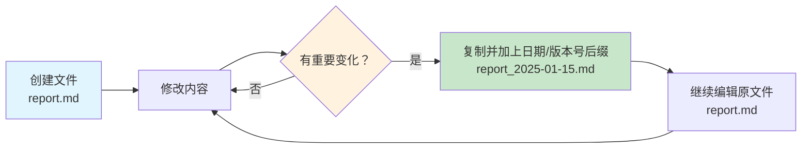
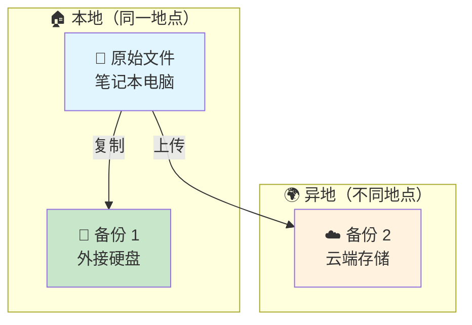
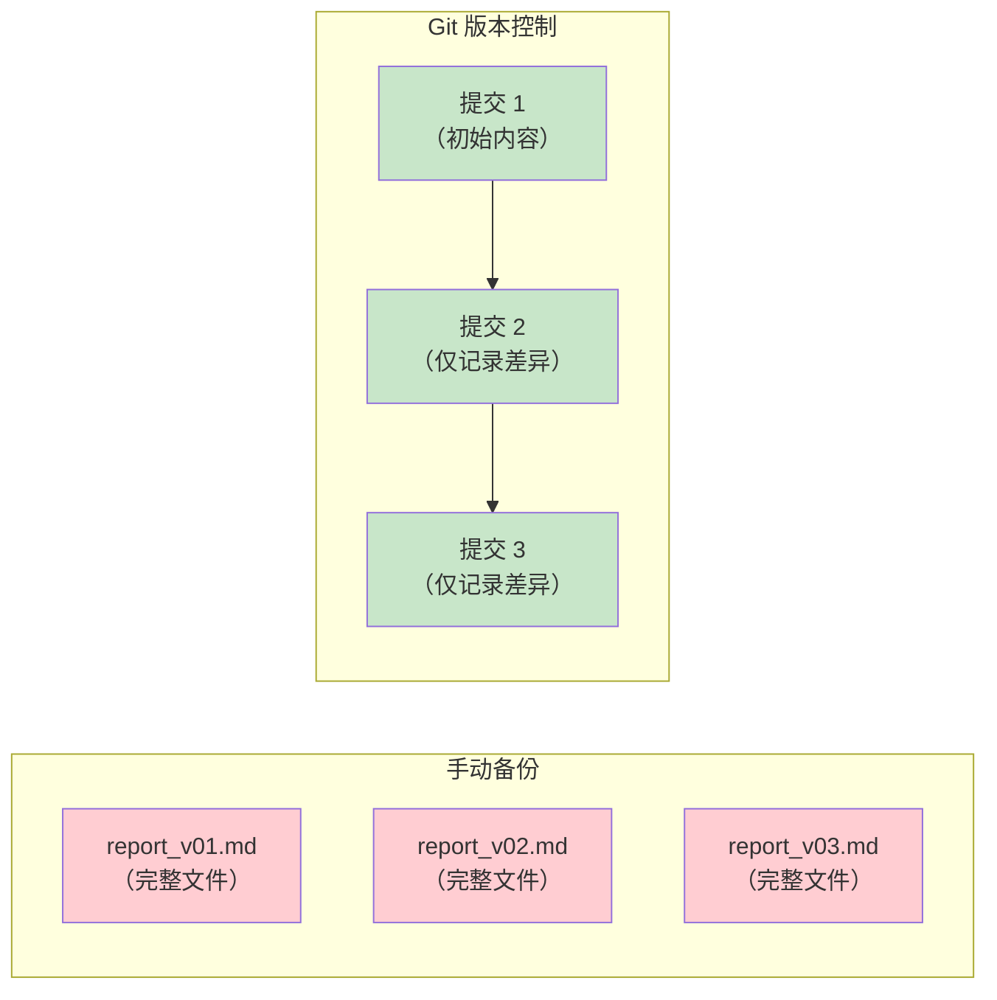

# 版本备份

> **所属路径**：`00_高中复习/03_信息素养/01_文件与文件夹管理/03_版本备份`
> **预计学习时间**：30 分钟
> **难度等级**：⭐

---

## 前置知识

- [命名规范](../02_命名规范/02_命名规范.md)

> 如果你还不熟悉文件命名中的日期格式（YYYY-MM-DD）、版本号（v01、v02）和前导零等规范，建议先完成上面的课程再继续。

---

## 学习目标

完成本节后，你将能够：

1. 解释为什么版本备份在编程和人工智能项目中至关重要
2. 使用日期后缀和版本号后缀进行手动版本备份
3. 描述 **3-2-1 备份规则** 的核心思想并加以运用
4. 区分本地备份、外部存储备份和云端备份三种方式
5. 使用 Python 编写简单的自动备份脚本
6. 说明版本备份与版本控制工具（如 Git）之间的关系

---

## 正文讲解

### 1. 一次"手滑"带来的惨痛教训

假设你花了一整个星期训练一个图像分类模型，终于得到了 95% 的准确率。你兴奋地打开代码，想做一点小改动再试试——结果不小心把效果最好的模型权重文件覆盖了。更糟糕的是，你没有保存之前的版本。一个星期的工作，就这样化为乌有。

这种事情在真实的学习和工作中一点都不罕见。丢失文件的原因有很多：误删、误覆盖、硬盘损坏、电脑被盗、甚至只是忘了保存。如果你没有 **版本备份（Version Backup）** 的习惯，任何一次意外都可能让你从头再来。

版本备份的核心思想很简单：**在文件发生重要变化时，保存一份"快照"，这样即使未来出了问题，你也能回到过去的某个状态。** 它不仅是一种安全措施，更是一种工作方式——在人工智能领域，研究者经常需要对比不同版本的代码、数据和模型，版本备份让这一切成为可能。

那么，具体该怎么做呢？我们先从最简单的手动备份开始。

### 2. 手动备份：日期后缀与版本号后缀

最基本的版本备份方法，就是在保存新版本时，给文件名加上 **日期后缀** 或 **版本号后缀**。这一点在上一节 [命名规范](../02_命名规范/02_命名规范.md) 中已经介绍过规则，这里我们把它应用到备份场景中。

#### 日期后缀法

每次修改文件时，把当天的日期加到文件名中：

```
report.md                     ← 当前正在编辑的版本
report_2025-01-15.md          ← 1 月 15 日的备份
report_2025-01-18.md          ← 1 月 18 日的备份
report_2025-02-01.md          ← 2 月 1 日的备份
```

日期格式使用 `YYYY-MM-DD`，这样按文件名排序时，备份文件会自动按时间先后排列。

#### 版本号后缀法

如果你在一天之内多次修改文件，或者更关注"改动了什么"而非"什么时候改的"，可以使用版本号：

```
model_config_v01.yaml         ← 初始版本
model_config_v02.yaml         ← 调整了学习率
model_config_v03.yaml         ← 增加了数据增强
```

#### 日期 + 版本号组合

当然，两种方式也可以结合使用，既记录时间，又记录版本：

```
experiment_2025-01-15_v01.py  ← 1 月 15 日的第一版
experiment_2025-01-15_v02.py  ← 1 月 15 日的第二版（修改了超参数）
experiment_2025-01-16_v01.py  ← 1 月 16 日的第一版（重构了代码）
```

下面这张图展示了手动版本备份的典型工作流：



> 📌 **图解说明**：手动备份的工作流程——每次文件有重要变化时，先复制一份并加上日期或版本号后缀作为备份，然后继续在原文件上工作。这样，你始终有一份"可以回退"的历史版本。

从图中可以看到，关键判断点在于"是否有重要变化"。并不是每次保存都需要备份——频繁的小改动可以先积累，等到完成一个阶段性成果（比如调通了一个功能、完成了一轮实验）时再做备份。

### 3. 备份存放在哪里？

光有备份还不够，如果备份和原文件放在同一个地方，那硬盘一坏两个都没了。所以，我们需要考虑 **备份存放的位置**。

常见的备份位置有三种：

| 备份位置 | 优点 | 缺点 | 适用场景 |
| -------- | ---- | ---- | -------- |
| **本地备份** | 速度快，随时可用 | 硬盘损坏则全部丢失 | 日常快速备份 |
| **外部存储** | 与电脑物理分离，更安全 | 需要随身携带，容易丢失 | 重要项目的额外备份 |
| **云端备份** | 随时随地访问，抗灾能力强 | 依赖网络，免费空间有限 | 最关键的文件和长期存档 |

**本地备份（Local Backup）** 是指在同一台电脑上的不同位置保存副本，比如在硬盘的另一个分区或另一个文件夹中。这是最快捷的方式，但无法应对硬盘故障。

**外部存储备份（External Storage Backup）** 是指把文件复制到外接硬盘、U 盘等物理设备上。这样即使电脑出了问题，外部设备上的备份仍然安全。

**云端备份（Cloud Backup）** 是指把文件上传到云存储服务（如 Google Drive、OneDrive、iCloud、百度网盘等）。云端备份最大的优势是"异地容灾"——即使你的电脑和外接硬盘同时损坏，云端的数据依然安全。

### 4. 3-2-1 备份规则

在数据保护领域，有一条被广泛采用的黄金准则，叫做 **3-2-1 备份规则（3-2-1 Backup Rule）**：

- **3** 份副本：重要文件至少保留 3 份（1 份原件 + 2 份备份）
- **2** 种介质：备份存储在至少 2 种不同的存储介质上（如硬盘 + 云端）
- **1** 份异地：至少有 1 份备份放在不同的物理位置（如云端或异地硬盘）

下面这张图直观展示了 3-2-1 规则：



> 📌 **图解说明**：3-2-1 规则的实践示例——原始文件在笔记本电脑上，备份 1 在外接硬盘（同一地点、不同介质），备份 2 在云端（不同地点）。这样即使家里发生火灾或被盗，云端备份仍然可以恢复数据。

从图中可以看到，3-2-1 规则的精髓在于"分散风险"——不把所有鸡蛋放在同一个篮子里。对于正在学习人工智能的你来说，不一定需要严格执行 3-2-1 规则的每一条，但至少应该做到：**原始文件之外，在另一个地方（云端或外接硬盘）保留一份备份。**

### 5. 备份频率与策略

知道了"备份什么"和"存在哪里"之后，还需要回答一个问题：**多久备份一次？**

答案取决于文件的变化频率和重要程度。以下是几种常见的备份策略：

| 策略 | 频率 | 适用场景 | 说明 |
| ---- | ---- | -------- | ---- |
| **实时备份** | 每次保存时自动同步 | 云端同步工具 | 如 Google Drive 桌面客户端 |
| **日备份** | 每天一次 | 正在进行的项目 | 每天下班/下课前备份一次 |
| **里程碑备份** | 每完成一个阶段 | 长期项目 | 每调通一个功能、跑完一轮实验时备份 |
| **周备份** | 每周一次 | 变化不频繁的资料 | 如笔记、参考文档 |

**最推荐的策略是"里程碑备份"**——每当你完成了一个有意义的阶段（代码调通了、模型训练完了、报告写好了），立刻做一次备份。这样既不会频繁得浪费时间，又能确保每个重要节点都有记录。

### 6. 从手动到自动：版本控制的引入

手动备份虽然简单直观，但有几个明显的痛点：

1. **容易忘记**：忙起来就忘了备份
2. **文件爆炸**：时间一长，备份文件越来越多，占用大量空间
3. **难以对比**：两个版本之间到底改了什么？手动对比非常费时
4. **协作困难**：多人同时编辑同一个文件时，手动备份根本不够用

正因为这些痛点，软件工程师们发明了 **版本控制系统（Version Control System, VCS）**——一种专门用来追踪文件变化历史的工具。其中最流行的就是 **Git**。

Git 的核心思想和手动备份一样，也是"保存快照"，但它做得更聪明：



> 📌 **图解说明**：手动备份（左）每次保存完整文件副本，空间消耗大；Git（右）只保存文件的差异部分，既省空间又能精确追踪每一处改动。

从图中可以看到，Git 不是每次都保存一份完整的文件拷贝，而是记录"从上一个版本到这个版本，改了什么"。这让它在处理大量文件和频繁改动时远比手动备份高效。

> ⚠️ **提前说明**：Git 的详细使用方法会在后续的 [版本控制](../../../../01_基础能力/01_开发环境与技术英语/15_版本控制/) 课程中系统学习。这里只是让你了解"版本控制"这个概念，知道手动备份的局限性以及更好的替代方案。现阶段，掌握手动备份就足够了。

### 7. 版本备份在人工智能中的应用

在人工智能领域，版本备份的重要性被放大了许多倍，因为一个人工智能项目中有更多种类型的"文件"需要追踪和保存。

#### 实验可复现性

做一次实验，涉及的要素至少有三个：代码、数据和配置（超参数）。如果其中任何一个发生了变化，实验结果就可能不同。为了 **实验可复现性（Reproducibility）**，你需要保存每次实验使用的完整"快照"：

```
experiment_2025-01-15/
├── code/
│   └── train_v03.py           ← 本次实验使用的代码版本
├── configs/
│   └── config_v03.yaml        ← 本次实验的超参数配置
├── data/
│   └── data_manifest.txt      ← 记录本次使用的数据集版本
├── models/
│   └── model_epoch50.pth      ← 训练产出的模型权重
└── logs/
    └── train_log.txt           ← 训练日志（损失值、准确率等）
```

#### 模型检查点

训练一个深度学习模型可能需要几个小时甚至几天。如果训练到一半电脑崩溃了、断电了，没有备份就意味着一切从头再来。所以，在训练过程中定期保存 **模型检查点（Model Checkpoint）** 是标准做法：

```
models/
├── checkpoint_epoch_010.pth   ← 第 10 轮的检查点
├── checkpoint_epoch_020.pth   ← 第 20 轮的检查点
├── checkpoint_epoch_030.pth   ← 第 30 轮的检查点
└── best_model.pth             ← 迄今为止最佳的模型
```

这样即使训练中断，也可以从最近的检查点继续，而不用从零开始。

#### 数据版本管理

在人工智能项目中，数据集也会随时间变化——可能会新增标注、修正错误、调整划分方式。对数据的版本管理同样重要：

```
data/
├── raw_v01/                   ← 原始收集的数据
├── raw_v02/                   ← 新增了 500 张标注图片
├── processed_v01/             ← 基于 v01 的清洗结果
└── processed_v02/             ← 基于 v02 的清洗结果
```

> 💡 **小贴士**：在后续的 [数据与模型版本控制](../../../../03_工程落地/01_人工智能工程化与部署/03_数据与模型版本控制/) 课程中，你将学到专业的工具（如 DVC）来管理大文件的版本。这里先用手动文件夹的方式建立直觉。

---

## 动手实践

理解了版本备份的概念之后，让我们用 Python 编写一个简单的自动备份脚本。这个脚本会自动把指定的文件复制到备份目录中，并在文件名中加上时间戳，省去每次手动复制、重命名的麻烦。

```python
# 文件：code/auto_backup.py
# 自动备份脚本：将指定文件复制到备份目录，并在文件名中加上时间戳
# 环境要求：Python 3.10+（无额外依赖，仅使用标准库）

import shutil
import os
from datetime import datetime


def backup_file(source_path, backup_dir="backups"):
    """
    将指定文件备份到 backup_dir，文件名自动加上时间戳。

    参数：
        source_path: 要备份的文件路径（如 "report.md"）
        backup_dir:  备份目标目录（默认为 "backups"）

    返回：
        备份后的文件路径
    """
    # 检查源文件是否存在
    if not os.path.isfile(source_path):
        print(f"错误：文件 '{source_path}' 不存在！")
        return None

    # 如果备份目录不存在，自动创建
    os.makedirs(backup_dir, exist_ok=True)

    # 分离文件名和扩展名
    filename = os.path.basename(source_path)
    name, ext = os.path.splitext(filename)

    # 生成时间戳（精确到秒，避免同一秒内多次备份冲突）
    timestamp = datetime.now().strftime("%Y-%m-%d_%H%M%S")

    # 拼接备份文件名：原名_时间戳.扩展名
    backup_name = f"{name}_{timestamp}{ext}"
    backup_path = os.path.join(backup_dir, backup_name)

    # 复制文件
    shutil.copy2(source_path, backup_path)
    print(f"✅ 备份成功：{source_path} → {backup_path}")

    return backup_path


def list_backups(backup_dir="backups"):
    """列出备份目录中的所有文件，按时间排序。"""
    if not os.path.isdir(backup_dir):
        print(f"备份目录 '{backup_dir}' 不存在。")
        return []

    files = sorted(os.listdir(backup_dir))
    if not files:
        print("备份目录为空。")
        return []

    print(f"\n📁 备份目录 '{backup_dir}' 中的文件：")
    for i, f in enumerate(files, 1):
        # 获取文件大小
        size = os.path.getsize(os.path.join(backup_dir, f))
        print(f"  {i}. {f}  ({size} 字节)")

    return files


# === 演示 ===
if __name__ == "__main__":
    # 创建一个示例文件用于演示
    demo_file = "demo_report.md"
    with open(demo_file, "w", encoding="utf-8") as f:
        f.write("# 实验报告\n\n这是第一版内容。\n")
    print("--- 创建了示例文件 ---")

    # 第一次备份
    backup_file(demo_file)

    # 修改文件内容
    with open(demo_file, "a", encoding="utf-8") as f:
        f.write("\n## 新增内容\n\n这是修改后的内容。\n")
    print("\n--- 修改了文件内容 ---")

    # 第二次备份
    backup_file(demo_file)

    # 查看备份列表
    list_backups()

    # 清理演示文件
    os.remove(demo_file)
    # 注意：实际使用时不要删除备份目录！这里仅为演示清理
    shutil.rmtree("backups", ignore_errors=True)
    print("\n--- 演示结束，已清理临时文件 ---")
```

**运行命令**：`python code/auto_backup.py`

**预期输出**：

```
--- 创建了示例文件 ---
✅ 备份成功：demo_report.md → backups/demo_report_2025-01-15_143022.md

--- 修改了文件内容 ---
✅ 备份成功：demo_report.md → backups/demo_report_2025-01-15_143023.md

📁 备份目录 'backups' 中的文件：
  1. demo_report_2025-01-15_143022.md  (42 字节)
  2. demo_report_2025-01-15_143023.md  (75 字节)

--- 演示结束，已清理临时文件 ---
```

> ⚠️ **注意**：实际输出中的时间戳会随运行时间而变化。两次备份的时间戳不同（精确到秒），所以不会互相覆盖。

从输出中可以看到，`backup_file` 函数完成了三件事：①检查源文件是否存在，②自动创建备份目录，③将文件复制到备份目录并在文件名中加上时间戳。`list_backups` 函数则列出了备份目录中的所有文件及其大小。这个脚本虽然简单，但已经能帮你省去每次手动复制重命名的麻烦。

---

## 典型误区

| 误区 | 正确理解 |
| ---- | -------- |
| "文件放在云端就不需要备份了" | 云端同步工具（如 Google Drive）只是把文件"同步"到云上，如果你在本地误删了文件，云端也会同步删除。云端同步 ≠ 云端备份，真正的备份需要保留历史版本 |
| "备份一份就够了" | 一份备份和原件放在同一个地方（比如同一块硬盘），硬盘坏了两个都没了。3-2-1 规则要求至少 2 种介质、1 份异地 |
| "每改一个字都要备份" | 过于频繁的备份会产生大量几乎相同的文件，反而难以管理。建议在"里程碑"节点做备份，日常小修改积累到一定程度再备份 |
| "有了 Git 就不需要手动备份了" | Git 管理的是代码仓库，不适合管理大文件（如模型权重、数据集）。大文件的备份需要其他策略（如云存储、DVC） |

---

## 练习题

### 练习 1：设计备份方案（难度：⭐）

你正在写一篇课程作业论文（`essay.docx`），计划花 5 天完成。请设计一个备份方案，回答以下问题：

1. 你会使用什么命名规则来保存每天的版本？
2. 你会把备份存放在哪些位置？
3. 你的备份方案是否符合 3-2-1 规则？

<details>
<summary>💡 提示</summary>

回忆一下手动备份的日期后缀法、三种备份位置（本地、外部存储、云端），以及 3-2-1 规则的三个数字分别代表什么。

</details>

<details>
<summary>✅ 参考答案</summary>

1. **命名规则**：使用日期后缀法，每天备份时复制一份并加上日期：
   - `essay_2025-01-15.docx`（第一天）
   - `essay_2025-01-16.docx`（第二天）
   - ……以此类推
   - `essay.docx` 始终是当前正在编辑的版本

2. **存放位置**（符合 3-2-1 规则）：
   - 原件在笔记本电脑硬盘上（第 1 份）
   - 每天备份一份到 U 盘或外接硬盘（第 2 份，不同介质）
   - 每天上传一份到云端（如 Google Drive）（第 3 份，异地存储）

3. **3-2-1 检查**：
   - 3 份副本 ✅（电脑 + U 盘 + 云端）
   - 2 种介质 ✅（电脑硬盘 + U 盘 是两种物理设备，云端是第三种）
   - 1 份异地 ✅（云端备份不在同一物理位置）

</details>

### 练习 2：阅读并改进备份脚本（难度：⭐⭐）

下面这段备份脚本有几个问题，请找出并修正：

```python
import shutil
import os

def backup(src):
    # 直接复制到同一目录，加上 "_backup" 后缀
    name, ext = os.path.splitext(src)
    dst = name + "_backup" + ext
    shutil.copy(src, dst)
    print(f"备份完成：{dst}")

backup("train.py")
```

<details>
<summary>💡 提示</summary>

思考以下问题：如果多次运行这个脚本会怎样？备份文件和原文件在同一个目录下安全吗？文件名中缺少了什么信息？

</details>

<details>
<summary>✅ 参考答案</summary>

这段脚本存在三个问题：

1. **每次备份都会覆盖上一次的备份**：因为备份文件名始终是 `train_backup.py`，没有时间戳或版本号来区分不同时间的备份。
   - 修正：在文件名中加入时间戳，如 `train_2025-01-15_143022.py`

2. **备份和原文件在同一目录**：如果不小心删除了整个目录，备份也一起丢失。
   - 修正：将备份保存到专门的备份目录（如 `backups/`）

3. **没有检查源文件是否存在**：如果文件不存在，`shutil.copy` 会抛出异常。
   - 修正：在复制前先用 `os.path.isfile(src)` 检查

改进后的代码：

```python
import shutil
import os
from datetime import datetime

def backup(src, backup_dir="backups"):
    if not os.path.isfile(src):
        print(f"错误：文件 '{src}' 不存在！")
        return
    os.makedirs(backup_dir, exist_ok=True)
    name, ext = os.path.splitext(os.path.basename(src))
    timestamp = datetime.now().strftime("%Y-%m-%d_%H%M%S")
    dst = os.path.join(backup_dir, f"{name}_{timestamp}{ext}")
    shutil.copy2(src, dst)
    print(f"备份完成：{dst}")
```

</details>

### 练习 3：模拟实验版本管理（难度：⭐⭐）

假设你正在做一个机器学习实验，已经完成了以下步骤：

1. 第一天：用默认参数训练，准确率 80%
2. 第二天：调整了学习率，准确率 85%
3. 第三天：增加了数据增强，准确率 92%
4. 第四天：更换了模型架构，准确率 88%（反而下降了）

请回答：

1. 你会如何组织这四次实验的文件备份？请画出目录结构。
2. 第四天实验结果不理想，你想回到第三天的状态继续改进。如果你按照你设计的结构做了备份，该如何操作？

<details>
<summary>💡 提示</summary>

参考正文中"实验可复现性"部分的目录结构。每次实验应该保存哪些文件？用什么命名方式来区分不同实验？

</details>

<details>
<summary>✅ 参考答案</summary>

1. **目录结构**：

```
my_experiment/
├── experiments/
│   ├── exp_2025-01-15_v01/        ← 第一天：默认参数，80%
│   │   ├── train_v01.py
│   │   ├── config_v01.yaml
│   │   └── model_v01.pth
│   ├── exp_2025-01-16_v02/        ← 第二天：调整学习率，85%
│   │   ├── train_v02.py
│   │   ├── config_v02.yaml
│   │   └── model_v02.pth
│   ├── exp_2025-01-17_v03/        ← 第三天：数据增强，92% ⭐ 最佳
│   │   ├── train_v03.py
│   │   ├── config_v03.yaml
│   │   └── model_v03.pth
│   └── exp_2025-01-18_v04/        ← 第四天：新架构，88%
│       ├── train_v04.py
│       ├── config_v04.yaml
│       └── model_v04.pth
├── train.py                        ← 当前工作版本
└── config.yaml                     ← 当前配置
```

2. **回退操作**：
   - 将 `experiments/exp_2025-01-17_v03/` 中的代码和配置复制回工作目录
   - 用 v03 的代码和配置作为基础继续改进
   - 新的改动保存为 v05，而不是覆盖 v04（保留完整历史）

</details>

---

## 下一步学习

- 📖 下一个知识点：[压缩与归档](../04_压缩与归档/04_压缩与归档.md) — 备份文件越来越多？学会压缩与归档，让备份更高效、更节省空间
- 🔗 相关知识点：[命名规范](../02_命名规范/02_命名规范.md) — 备份文件名中的日期格式和版本号规则，都源自命名规范
- 📚 拓展阅读：在后续的 [版本控制](../../../../01_基础能力/01_开发环境与技术英语/15_版本控制/) 课程中，你将系统学习 Git 这一专业版本控制工具，它是手动备份的"终极升级版"

---

## 参考资料

1. [US-CERT Data Backup Options](https://www.cisa.gov/news-events/news/data-backup-options) — 美国网络安全和基础设施安全局（CISA）发布的数据备份指南，介绍了 3-2-1 备份规则和各种备份策略（政府公开文档）
2. [Python shutil 模块官方文档](https://docs.python.org/3/library/shutil.html) — Python 标准库中用于文件复制和目录操作的模块文档，本课中的备份脚本基于该模块（Python 官方文档，开源）
3. [The Good Research Code Handbook](https://goodresearch.dev/) — 面向研究者的代码和实验管理指南，涵盖版本控制、实验追踪等最佳实践（开源在线书籍，CC BY 许可）
