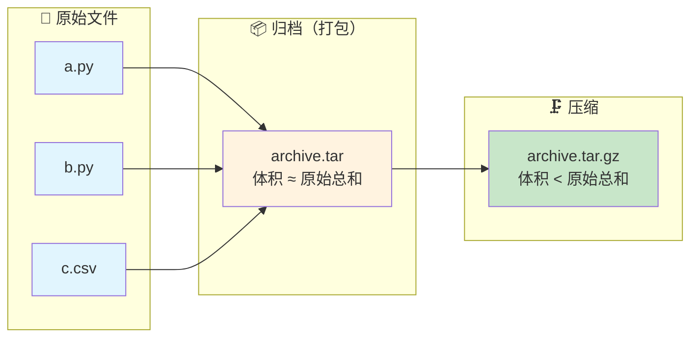
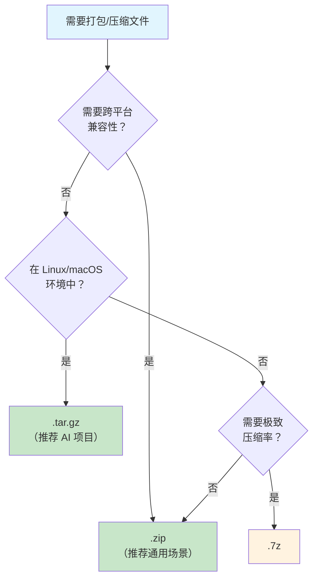
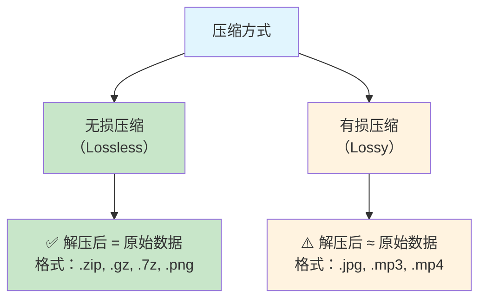

# 压缩与归档

> **所属路径**：`00_高中复习/03_信息素养/01_文件与文件夹管理/04_压缩与归档`
> **预计学习时间**：30 分钟
> **难度等级**：⭐

---

## 前置知识

- [版本备份](../03_版本备份/03_版本备份.md)

> 如果你还不熟悉如何为文件保存历史版本、如何组织备份目录，建议先完成上面的课程再继续。

---

## 学习目标

完成本节后，你将能够：

1. 解释压缩与归档的区别，以及为什么它们在人工智能项目中不可或缺
2. 识别常见的压缩与归档格式（`.zip`、`.tar`、`.gz`、`.tar.gz`、`.7z`、`.rar`）并说明各自的特点
3. 区分 **无损压缩** 与 **有损压缩** 的原理和适用场景
4. 使用 Python 标准库完成文件的压缩与解压操作
5. 在命令行中使用 `tar`、`gzip`、`zip` 等工具处理压缩文件
6. 处理人工智能领域常见的压缩格式（如数据集的 `.tar.gz`、模型权重的 `.zip`）

---

## 正文讲解

### 1. 一个 50GB 数据集引发的思考

想象一下这个场景：你正在学习图像分类，找到了一个优质的公开数据集，兴奋地点击下载——结果发现数据集有 50GB，包含 10 万张图片，分布在几百个文件夹里。如果直接传输这些零散文件，光是文件数量就会让网络传输慢得令人崩溃（每个小文件都需要单独建立连接、确认传输完成），而且 50GB 的体积也会吃掉你大半个硬盘。

幸好，你下载的不是 10 万个零散文件，而是一个名为 `dataset.tar.gz` 的单一文件，大小只有 12GB。这就是 **压缩与归档（Compression and Archiving）** 的威力——它把海量零散文件"打包"成一个文件，同时把体积"压缩"到原来的几分之一。

在上一节 [版本备份](../03_版本备份/03_版本备份.md) 中，我们学会了保存文件的历史版本，但随着备份越来越多，磁盘空间的消耗也在增长。压缩与归档正是解决这个问题的利器——它不仅节省存储空间，还让文件传输和分享变得更加高效。

那么，"压缩"和"归档"到底是什么？它们是同一件事吗？让我们从最基本的概念开始。

### 2. 归档与压缩：两个不同的概念

很多人把"压缩"和"归档"混为一谈，但它们其实是两个独立的操作，解决的是不同的问题。

**归档（Archiving）** 是把多个文件和文件夹"捆"成一个文件的过程，就像把散落在桌上的一叠纸装进一个信封。归档后的文件体积通常和原来差不多——因为它只是把文件组合在一起，并没有减小体积。最典型的归档格式是 `.tar`（Tape Archive，磁带归档），它的名字来源于早期计算机用磁带存储数据的时代。

**压缩（Compression）** 则是通过算法消除数据中的冗余信息，从而减小文件体积。就像把一句话"我喜欢苹果，我喜欢香蕉，我喜欢橙子"简化为"我喜欢苹果/香蕉/橙子"——信息完全保留了，但表达更紧凑了。

下面这张图展示了归档与压缩的关系：



> 📌 **图解说明**：归档把多个文件打包成一个 `.tar` 文件（体积基本不变），然后压缩进一步减小体积，得到 `.tar.gz` 文件。实际操作中，这两步经常合并执行。

从图中可以看到，归档和压缩可以独立使用，也可以组合使用。比如 `.tar.gz`（也常写作 `.tgz`）就是"先归档、再压缩"的组合——这也是 Linux 世界和人工智能领域最常见的打包格式。

### 3. 常见格式一览

你在日常使用中会遇到各种压缩和归档格式。了解它们的特点，才能在不同场景下做出正确的选择。

| 格式 | 类型 | 特点 | 典型使用场景 |
| ---- | ---- | ---- | ------------ |
| `.tar` | 仅归档 | 只打包不压缩，保留文件权限信息 | Linux/macOS 下打包源码 |
| `.gz`（gzip） | 仅压缩 | 只能压缩单个文件，速度快 | 压缩日志文件、单个大文件 |
| `.tar.gz` / `.tgz` | 归档 + 压缩 | `.tar` 先打包，`gzip` 再压缩 | **数据集分发、开源项目** |
| `.zip` | 归档 + 压缩 | 打包和压缩一步完成，跨平台兼容性最好 | **模型权重分发、通用文件共享** |
| `.7z` | 归档 + 压缩 | 压缩率高，但需要专用工具 | 追求极致压缩率的场景 |
| `.rar` | 归档 + 压缩 | 商业格式，解压需要专用工具 | 早期 Windows 生态中常见 |

> 💡 **小贴士**：在人工智能领域，你最常遇到的两种格式是 **`.tar.gz`** 和 **`.zip`**。数据集（如 ImageNet、CIFAR-10）几乎都以 `.tar.gz` 发布，而预训练模型权重（如 Hugging Face 上的模型）常以 `.zip` 或 `.tar.gz` 形式提供。

下面这张流程图可以帮助你根据需求选择合适的格式：



> 📌 **图解说明**：选择压缩格式的决策流程——如果需要跨平台兼容，选 `.zip`；如果在 Linux/macOS 上做人工智能项目，选 `.tar.gz`；如果追求极致压缩率，选 `.7z`。

### 4. 无损压缩与有损压缩

前面提到，压缩是"消除数据中的冗余信息"。但具体怎么消除，根据方式的不同，压缩分为两大类：

**无损压缩（Lossless Compression）** 在解压后能 100% 还原原始数据，一个字节都不差。就像用速记法记录一篇文章，虽然写得更短了，但可以完整还原原文。前面提到的 `.zip`、`.gz`、`.7z` 都是无损压缩。

**有损压缩（Lossy Compression）** 为了更高的压缩率，会丢弃一部分人类不容易感知到的信息。就像一张 5000 万像素的照片被压缩成 JPEG 格式后，肉眼看不出差别，但放大到像素级就能发现细节丢失了。常见的有损压缩格式包括 `.jpg`（图片）、`.mp3`（音频）和 `.mp4`（视频）。



> 📌 **图解说明**：无损压缩可以完美还原数据，适合代码、数据集等不能有丝毫损失的场景；有损压缩牺牲部分细节换取更高的压缩率，适合图片、音频、视频等人类感官可以容忍小损失的场景。

这个区分在人工智能中很重要：**代码、模型权重、标注文件等必须使用无损压缩**（哪怕一个字节的错误都可能导致模型无法加载），而训练用的图片、音频等原始数据可能本身就已经用有损格式存储了。

### 5. 压缩比：衡量压缩效果的指标

我们经常需要比较不同压缩方式或格式的效果。最直观的衡量标准就是 **压缩比（Compression Ratio）**：

$$
\text{压缩比} = \frac{\text{原始大小}}{\text{压缩后大小}}
$$

> **直觉解读**：压缩比越大，说明文件被压得越小、效果越好。比如一个 100MB 的文件压缩到 25MB，压缩比就是 $100 \div 25 = 4$ ，也可以说"压缩到了原来的 25%"或"节省了 75% 的空间"。

不同类型的数据，压缩效果差异巨大：

| 数据类型 | 典型压缩比 | 原因 |
| -------- | ---------- | ---- |
| 纯文本 / CSV | 5:1 ~ 10:1 | 大量重复字符和模式 |
| 源代码 | 3:1 ~ 5:1 | 有规律的结构和关键词 |
| 模型权重（浮点数） | 1.2:1 ~ 2:1 | 浮点数冗余度低 |
| 已压缩的图片（JPEG） | ≈ 1:1 | 已经是有损压缩格式，几乎无法再压缩 |

想一想：为什么 CSV 文件的压缩比远高于模型权重文件？因为 CSV 文件中有大量重复的分隔符（逗号、换行）和相似的数值模式，冗余度很高；而模型权重是密集的浮点数（如 `0.0312847`），几乎没有可供压缩算法利用的重复模式。

### 6. 命令行压缩工具

在人工智能的学习和工作中，你经常需要在命令行（终端）中处理压缩文件——特别是在远程服务器上操作时，没有图形界面可用，命令行工具就是你唯一的选择。以下是最常用的三个命令：

#### tar：打包与解包

```bash
# 打包并压缩：将 my_dataset/ 目录打包为 .tar.gz
tar -czf my_dataset.tar.gz my_dataset/

# 解包：将 .tar.gz 解压到当前目录
tar -xzf my_dataset.tar.gz

# 查看内容（不解压）：列出 .tar.gz 中的文件清单
tar -tzf my_dataset.tar.gz
```

参数说明：`-c` 创建归档（Create）、`-x` 解压（eXtract）、`-t` 列出内容（lisT）、`-z` 使用 gzip 压缩/解压、`-f` 指定文件名（File）。

#### gzip：压缩与解压单个文件

```bash
# 压缩：将 data.csv 压缩为 data.csv.gz（原文件会被删除）
gzip data.csv

# 解压：将 data.csv.gz 还原为 data.csv
gunzip data.csv.gz

# 保留原文件的压缩方式
gzip -k data.csv
```

#### zip / unzip：跨平台通用

```bash
# 压缩：将整个目录打包为 .zip
zip -r model_weights.zip model_weights/

# 解压
unzip model_weights.zip

# 查看内容（不解压）
unzip -l model_weights.zip
```

> ⚠️ **提前说明**：命令行的详细使用方法会在后续的 [命令行](../../../../01_基础能力/01_开发环境与技术英语/02_命令行/) 课程中系统学习。这里只需要了解这几个最常用的命令，能在需要时查找使用即可。

### 7. 人工智能中的压缩文件实战

压缩与归档在人工智能领域无处不在。下面列举几个你一定会遇到的典型场景：

#### 下载数据集

几乎所有公开数据集都以压缩格式发布。以经典的 CIFAR-10 数据集为例：

```
cifar-10-python.tar.gz      ← 下载到的文件（约 170MB）
  └── cifar-10-batches-py/   ← 解压后的目录（约 180MB）
      ├── data_batch_1       ← 训练数据（第 1 批）
      ├── data_batch_2       ← 训练数据（第 2 批）
      ├── ...
      ├── test_batch          ← 测试数据
      └── batches.meta        ← 类别标签元数据
```

#### 分享模型权重

训练好的模型权重通常以 `.zip` 或 `.tar.gz` 格式分享：

```
my_classifier.zip
  ├── model.pth              ← PyTorch 模型权重
  ├── config.json            ← 模型配置
  └── vocab.txt              ← 词表文件（NLP 模型）
```

#### 压缩实验备份

结合上一节的版本备份知识，你可以把每次实验的完整快照打包压缩后归档，大幅节省磁盘空间：

```
archives/
├── exp_2025-01-15_v01.tar.gz   ← 第一次实验（压缩后 50MB）
├── exp_2025-01-16_v02.tar.gz   ← 第二次实验（压缩后 55MB）
└── exp_2025-01-17_v03.tar.gz   ← 第三次实验（压缩后 48MB）
```

和之前每次实验保存完整目录相比，压缩后的备份可能只需要三分之一甚至更少的空间。

---

## 动手实践

理解了概念之后，让我们用 Python 动手操作压缩与解压。Python 标准库提供了 `zipfile`、`tarfile` 和 `gzip` 三个模块，覆盖了最常见的压缩格式，不需要安装任何第三方库。

### 实践 1：使用 zipfile 模块

下面这段代码演示了如何创建一个 `.zip` 压缩包，然后查看并解压其中的内容：

```python
# 文件：code/zip_demo.py
# 演示使用 Python zipfile 模块进行压缩与解压
# 环境要求：Python 3.10+（无额外依赖，仅使用标准库）

import zipfile
import os


def create_zip(file_list, zip_name):
    """
    将多个文件压缩为一个 .zip 文件。

    参数：
        file_list: 要压缩的文件路径列表
        zip_name:  输出的 .zip 文件名
    """
    with zipfile.ZipFile(zip_name, 'w', zipfile.ZIP_DEFLATED) as zf:
        for filepath in file_list:
            # arcname 参数指定文件在压缩包中的名称（去掉路径前缀）
            zf.write(filepath, arcname=os.path.basename(filepath))
    print(f"✅ 创建压缩包：{zip_name}")


def inspect_zip(zip_name):
    """查看 .zip 文件中的内容清单。"""
    with zipfile.ZipFile(zip_name, 'r') as zf:
        print(f"\n📦 压缩包 '{zip_name}' 的内容：")
        total_compressed = 0
        total_original = 0
        for info in zf.infolist():
            ratio = info.compress_size / info.file_size if info.file_size > 0 else 0
            print(f"  {info.filename:30s}  原始: {info.file_size:>8d} 字节"
                  f"  压缩后: {info.compress_size:>8d} 字节"
                  f"  ({ratio:.1%})")
            total_compressed += info.compress_size
            total_original += info.file_size
        if total_original > 0:
            overall = total_compressed / total_original
            print(f"  {'合计':30s}  原始: {total_original:>8d} 字节"
                  f"  压缩后: {total_compressed:>8d} 字节"
                  f"  ({overall:.1%})")


def extract_zip(zip_name, extract_dir):
    """将 .zip 文件解压到指定目录。"""
    with zipfile.ZipFile(zip_name, 'r') as zf:
        zf.extractall(extract_dir)
    print(f"\n📂 已解压到：{extract_dir}/")
    for f in os.listdir(extract_dir):
        print(f"  - {f}")


# === 演示 ===
if __name__ == "__main__":
    # 创建示例文件
    os.makedirs("demo_files", exist_ok=True)
    # 创建一个有大量重复内容的 CSV（容易压缩）
    with open("demo_files/data.csv", "w") as f:
        f.write("id,name,score\n")
        for i in range(500):
            f.write(f"{i},student_{i % 10},{80 + i % 20}\n")

    # 创建一个 Python 脚本
    with open("demo_files/train.py", "w") as f:
        f.write("# 训练脚本示例\n")
        f.write("import numpy as np\n\n")
        f.write("def train(epochs=10, lr=0.001):\n")
        f.write("    print(f'训练 {epochs} 轮，学习率 {lr}')\n")
        f.write("    for epoch in range(epochs):\n")
        f.write("        loss = 1.0 / (epoch + 1)\n")
        f.write("        print(f'  第 {epoch+1} 轮，损失: {loss:.4f}')\n\n")
        f.write("if __name__ == '__main__':\n")
        f.write("    train()\n")

    print("--- 创建了示例文件 ---")
    for f in os.listdir("demo_files"):
        size = os.path.getsize(os.path.join("demo_files", f))
        print(f"  {f}: {size} 字节")

    # 压缩
    files = [os.path.join("demo_files", f) for f in os.listdir("demo_files")]
    create_zip(files, "demo_archive.zip")

    # 查看压缩包内容
    inspect_zip("demo_archive.zip")

    # 解压到新目录
    extract_zip("demo_archive.zip", "demo_extracted")

    # 清理
    import shutil
    shutil.rmtree("demo_files")
    shutil.rmtree("demo_extracted")
    os.remove("demo_archive.zip")
    print("\n--- 演示结束，已清理临时文件 ---")
```

**运行命令**：`python code/zip_demo.py`

**预期输出**：

```
--- 创建了示例文件 ---
  data.csv: 11479 字节
  train.py: 282 字节
✅ 创建压缩包：demo_archive.zip

📦 压缩包 'demo_archive.zip' 的内容：
  data.csv                        原始:    11479 字节  压缩后:     1866 字节  (16.3%)
  train.py                        原始:      282 字节  压缩后:      213 字节  (75.5%)
  合计                            原始:    11761 字节  压缩后:     2079 字节  (17.7%)

📂 已解压到：demo_extracted/
  - data.csv
  - train.py

--- 演示结束，已清理临时文件 ---
```

从输出中可以看到两个有趣的现象：CSV 文件的压缩效果非常好（压缩到了原来的 16.3%，接近 6:1 的压缩比），因为其中有大量重复的逗号、换行符和相似的数值模式；而 Python 脚本本身很小，压缩率就没那么惊人了。这印证了我们之前讨论的——数据中的冗余度决定了压缩效果。

### 实践 2：使用 tarfile 模块

在人工智能领域更常见的 `.tar.gz` 格式，用 Python 的 `tarfile` 模块也可以轻松处理：

```python
# 文件：code/targz_demo.py
# 演示使用 Python tarfile 模块处理 .tar.gz 文件
# 环境要求：Python 3.10+（无额外依赖，仅使用标准库）

import tarfile
import os
import shutil


def create_targz(source_dir, output_name):
    """将整个目录打包为 .tar.gz 文件。"""
    with tarfile.open(output_name, "w:gz") as tar:
        tar.add(source_dir, arcname=os.path.basename(source_dir))
    # 计算压缩前后的大小
    original_size = sum(
        os.path.getsize(os.path.join(dp, f))
        for dp, _, filenames in os.walk(source_dir)
        for f in filenames
    )
    compressed_size = os.path.getsize(output_name)
    print(f"✅ 打包完成：{output_name}")
    print(f"   原始大小: {original_size:,} 字节")
    print(f"   压缩后:   {compressed_size:,} 字节")
    if original_size > 0:
        print(f"   压缩比:   {original_size / compressed_size:.1f}:1")


def list_targz(filename):
    """列出 .tar.gz 中的文件清单。"""
    with tarfile.open(filename, "r:gz") as tar:
        print(f"\n📦 '{filename}' 中的文件：")
        for member in tar.getmembers():
            print(f"  {member.name:40s}  {member.size:>8,} 字节")


def extract_targz(filename, extract_dir):
    """将 .tar.gz 解压到指定目录。"""
    with tarfile.open(filename, "r:gz") as tar:
        tar.extractall(path=extract_dir)
    print(f"\n📂 已解压到：{extract_dir}/")


# === 演示 ===
if __name__ == "__main__":
    # 模拟一个小型数据集目录
    os.makedirs("mini_dataset/train", exist_ok=True)
    os.makedirs("mini_dataset/test", exist_ok=True)

    for i in range(20):
        with open(f"mini_dataset/train/sample_{i:03d}.txt", "w") as f:
            f.write(f"特征向量: {[round(0.1 * j + i * 0.01, 4) for j in range(10)]}\n")
            f.write(f"标签: {i % 3}\n")

    for i in range(5):
        with open(f"mini_dataset/test/sample_{i:03d}.txt", "w") as f:
            f.write(f"特征向量: {[round(0.2 * j + i * 0.05, 4) for j in range(10)]}\n")

    print("--- 创建了模拟数据集 ---")

    # 打包为 .tar.gz
    create_targz("mini_dataset", "mini_dataset.tar.gz")

    # 查看内容
    list_targz("mini_dataset.tar.gz")

    # 解压
    extract_targz("mini_dataset.tar.gz", "unpacked")

    # 清理
    shutil.rmtree("mini_dataset")
    shutil.rmtree("unpacked")
    os.remove("mini_dataset.tar.gz")
    print("\n--- 演示结束，已清理临时文件 ---")
```

**运行命令**：`python code/targz_demo.py`

**预期输出**：

```
--- 创建了模拟数据集 ---
✅ 打包完成：mini_dataset.tar.gz
   原始大小: 2,150 字节
   压缩后:   492 字节
   压缩比:   4.4:1
   
📦 'mini_dataset.tar.gz' 中的文件：
  mini_dataset                                      0 字节
  mini_dataset/train                                 0 字节
  mini_dataset/train/sample_000.txt                 86 字节
  ...（省略部分输出）
  mini_dataset/test/sample_004.txt                  66 字节

📂 已解压到：unpacked/

--- 演示结束，已清理临时文件 ---
```

> ⚠️ **注意**：实际输出中的文件大小可能因 Python 版本和系统环境略有不同。核心要观察的是压缩比——文本类数据通常可以获得不错的压缩效果。

从两个实践中可以看出，Python 标准库让压缩和解压变得非常简单：`zipfile` 适合处理 `.zip` 格式，`tarfile` 适合处理 `.tar.gz` 格式。在未来遇到需要下载或分享数据集时，这些代码可以直接复用。

---

## 典型误区

| 误区 | 正确理解 |
| ---- | -------- |
| "压缩一个 JPEG 图片能节省很多空间" | JPEG 本身就是有损压缩格式，再用 `.zip` 压缩几乎不会变小（压缩比接近 1:1）。对已压缩格式二次压缩没有意义 |
| "`.tar.gz` 和 `.zip` 是一样的" | `.tar.gz` 是先归档再压缩（两步操作），在 Linux 上更常用且保留文件权限信息；`.zip` 是一步完成归档和压缩，跨平台兼容性更好。它们适用场景不同 |
| "压缩后的文件损坏了一点没关系" | 无损压缩格式对数据完整性要求极高——哪怕一个字节损坏，整个压缩包可能无法解压。因此压缩文件的传输和存储更需要注意完整性校验 |
| "归档和压缩是同一回事" | 归档（如 `.tar`）只是打包，不减小体积；压缩（如 `.gz`）才真正减小体积。`.tar.gz` 是两者的组合，而 `.zip` 将两步合为一步 |

---

## 练习题

### 练习 1：格式选择（难度：⭐）

你在以下三个场景中分别需要打包文件，请为每个场景选择最合适的压缩格式，并说明理由：

1. 你要把一个训练好的模型（包含 `.pth` 权重文件和 `.json` 配置文件）发送给一个使用 Windows 的同学
2. 你要在 Linux 服务器上把一个包含 5 万张图片的数据集打包归档
3. 你有一个 2GB 的日志文件，需要压缩后节省磁盘空间

<details>
<summary>💡 提示</summary>

回忆一下各格式的特点：`.zip` 的跨平台兼容性、`.tar.gz` 在 Linux 上的优势、`gzip` 对单个文件的处理方式。

</details>

<details>
<summary>✅ 参考答案</summary>

1. **选 `.zip`**：对方使用 Windows，`.zip` 是 Windows 原生支持的格式，不需要安装额外工具就能解压。
2. **选 `.tar.gz`**：在 Linux 服务器上操作，`.tar.gz` 是最自然的选择——`tar` 可以保留文件权限和目录结构，且 `gzip` 在 Linux 上是标准工具。
3. **选 `.gz`（gzip）**：只有一个文件，不需要归档（打包多个文件），直接用 `gzip data.log` 即可。这样最简洁，且 `.gz` 在 Linux 服务器上随处可用。

</details>

### 练习 2：计算压缩比（难度：⭐）

一个数据集目录原始大小为 800MB，压缩为 `.tar.gz` 后为 200MB。请计算：

1. 压缩比是多少？
2. 节省了百分之多少的空间？
3. 如果你的硬盘还剩 1GB 可用空间，能否存放这个压缩包以及解压后的完整数据？

<details>
<summary>💡 提示</summary>

压缩比 = 原始大小 ÷ 压缩后大小。注意第 3 题需要同时考虑压缩包本身和解压后的文件占用的总空间。

</details>

<details>
<summary>✅ 参考答案</summary>

1. **压缩比**：

$$800 \div 200 = 4:1$$

2. **节省空间**：

$$\dfrac{800 - 200}{800} \times 100\% = 75\%$$

即节省了 75% 的空间。

3. **能否存放**：压缩包 200MB + 解压后 800MB = 共需 1000MB = 1GB。恰好等于剩余空间，但实际上文件系统本身也需要少量空间记录文件信息，所以 **很可能不够**。安全做法是确保剩余空间大于 1GB，或者在解压完成后删除压缩包。

</details>

### 练习 3：编写压缩脚本（难度：⭐⭐）

请编写一个 Python 脚本，实现以下功能：

1. 接收一个目录路径作为输入
2. 将该目录打包为 `.zip` 文件，文件名中包含当前日期（如 `backup_2025-01-15.zip`）
3. 打印压缩前后的大小和压缩比

<details>
<summary>💡 提示</summary>

结合本课的 `zipfile` 示例和上一课的日期后缀方法。使用 `os.walk()` 遍历目录下的所有文件，用 `datetime.now().strftime()` 获取日期字符串。

</details>

<details>
<summary>✅ 参考答案</summary>

```python
import zipfile
import os
from datetime import datetime

def backup_as_zip(source_dir):
    """将目录打包为带日期的 .zip 文件。"""
    if not os.path.isdir(source_dir):
        print(f"错误：目录 '{source_dir}' 不存在！")
        return

    date_str = datetime.now().strftime("%Y-%m-%d")
    dir_name = os.path.basename(os.path.normpath(source_dir))
    zip_name = f"{dir_name}_{date_str}.zip"

    original_size = 0
    with zipfile.ZipFile(zip_name, 'w', zipfile.ZIP_DEFLATED) as zf:
        for dirpath, dirnames, filenames in os.walk(source_dir):
            for filename in filenames:
                filepath = os.path.join(dirpath, filename)
                arcname = os.path.relpath(filepath, source_dir)
                zf.write(filepath, arcname)
                original_size += os.path.getsize(filepath)

    compressed_size = os.path.getsize(zip_name)
    ratio = original_size / compressed_size if compressed_size > 0 else 0
    print(f"✅ 压缩完成：{zip_name}")
    print(f"   原始大小: {original_size:,} 字节")
    print(f"   压缩后:   {compressed_size:,} 字节")
    print(f"   压缩比:   {ratio:.1f}:1")

# 使用示例：backup_as_zip("my_experiment")
```

</details>

### 练习 4：解压真实数据集（思考题）（难度：⭐⭐）

假设你从网上下载了一个名为 `flowers_dataset.tar.gz` 的植物图像数据集，大小为 350MB。请回答：

1. 这个文件经历了哪两步操作才变成 `.tar.gz` 格式？
2. 如果你想先看看里面有什么文件再决定是否解压，应该用什么命令？
3. 如果解压后发现图片都是 `.jpg` 格式，你再把解压后的目录重新压缩为 `.zip`，压缩比可能是多少？为什么？

<details>
<summary>💡 提示</summary>

回忆 `.tar.gz` 的两步含义、`tar -tzf` 命令的作用，以及 JPEG 图片的压缩特性。

</details>

<details>
<summary>✅ 参考答案</summary>

1. **两步操作**：
   - 第一步：使用 `tar` 将所有图片文件和目录 **归档** 为一个 `.tar` 文件
   - 第二步：使用 `gzip` 对 `.tar` 文件进行 **压缩**，得到 `.tar.gz`

2. **查看内容的命令**：
   ```bash
   tar -tzf flowers_dataset.tar.gz
   ```
   这会列出压缩包中的所有文件名，但不会实际解压，方便快速了解内容结构。

3. **重新压缩的压缩比**：**接近 1:1**，几乎无法进一步缩小。因为 `.jpg` 图片本身已经是有损压缩格式，数据中的冗余已经被 JPEG 算法消除了，无损压缩算法（如 ZIP 使用的 DEFLATE）对它几乎无能为力。

</details>

---

## 下一步学习

- 📖 下一个知识主题：[搜索与资料检索](../../02_搜索与资料检索/) — 学会了管理和打包文件之后，下一步是掌握如何高效地搜索和获取所需的信息资料
- 🔗 相关知识点：[版本备份](../03_版本备份/03_版本备份.md) — 压缩与归档是版本备份的好搭档，压缩后的备份更节省空间
- 📚 拓展阅读：在后续的 [命令行](../../../../01_基础能力/01_开发环境与技术英语/02_命令行/) 课程中，你将更系统地学习 `tar`、`gzip`、`zip` 等命令行工具的使用

---

## 参考资料

1. [Python zipfile 模块官方文档](https://docs.python.org/3/library/zipfile.html) — Python 标准库中用于创建、读取和解压 ZIP 文件的模块文档（Python 官方文档，开源）
2. [Python tarfile 模块官方文档](https://docs.python.org/3/library/tarfile.html) — Python 标准库中用于处理 tar 归档文件的模块文档，支持 gzip、bzip2 等压缩方式（Python 官方文档，开源）
3. [GNU tar 手册](https://www.gnu.org/software/tar/manual/) — GNU tar 工具的官方完整手册，涵盖所有命令选项和使用示例（GNU 自由文档许可证）
4. [数据压缩 - 维基百科](https://zh.wikipedia.org/wiki/%E6%95%B0%E6%8D%AE%E5%8E%8B%E7%BC%A9) — 数据压缩的基本原理、历史和分类的综合介绍（公共知识库，CC BY-SA 许可）
