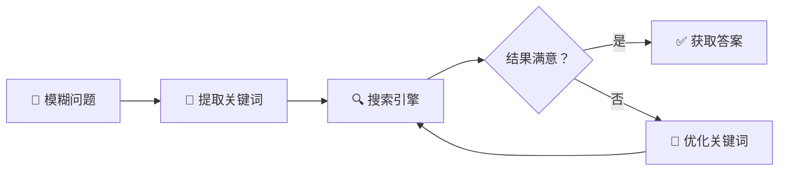
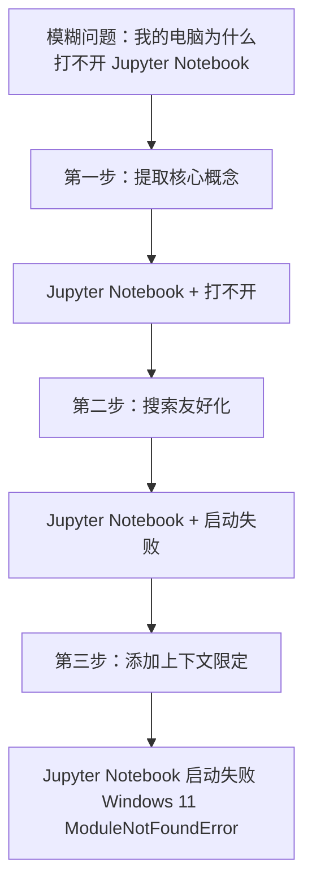
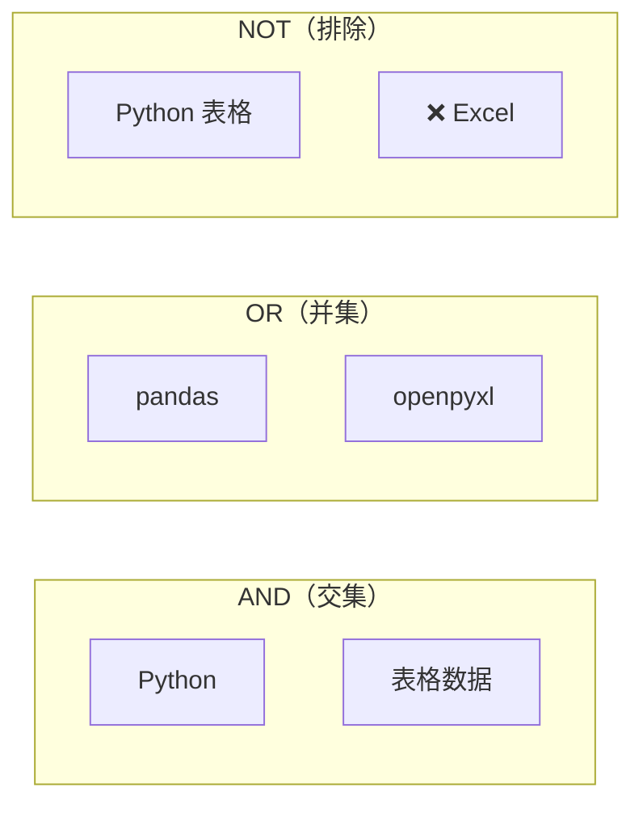
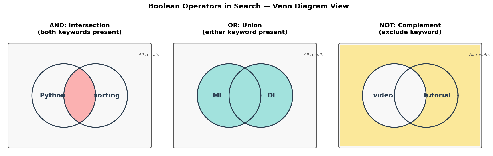
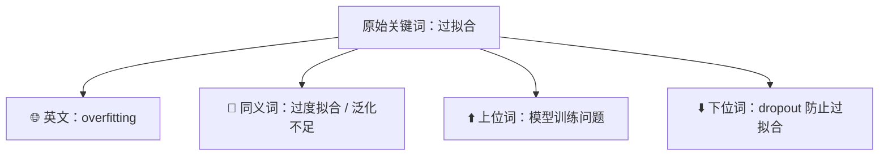

# 关键词设计

> **所属路径**：`00_高中复习/03_信息素养/02_搜索与资料检索/01_关键词设计`
> **预计学习时间**：30 分钟
> **难度等级**：⭐

---

## 前置知识

- [路径与扩展名](../../01_文件与文件夹管理/01_路径与扩展名/01_路径与扩展名.md) — 了解文件类型有助于使用 `filetype:` 等搜索语法

> 如果以上内容还不熟悉，建议先完成对应课程再继续。

---

## 学习目标

完成本节后，你将能够：

1. 将一个模糊的问题拆解为精准的搜索关键词组合
2. 使用布尔运算符（AND、OR、NOT）组合关键词以缩小或扩大搜索范围
3. 运用搜索引擎高级语法（引号、`site:`、`filetype:`、`intitle:` 等）精确定位信息
4. 针对人工智能和编程场景设计领域专用关键词
5. 通过迭代优化策略逐步改善搜索结果的质量

---

## 正文讲解

### 1. 为什么关键词设计如此重要

想象一下你刚开始学习编程，运行一段 Python 代码时屏幕突然弹出一堆红色的报错信息。你慌了，赶紧打开搜索引擎，在搜索框里输入："Python 代码运行出错了怎么办"。搜索结果？一大堆笼统的初学者教程，没有一个能解决你的具体问题。但如果你仔细看一眼报错信息，把其中的关键内容——比如 `TypeError: unsupported operand type(s) for +: 'int' and 'str'` ——直接粘贴到搜索框，几秒钟之内你就能找到精确的解答。

这就是 **关键词设计（Keyword Design）** 的力量。搜索引擎并不理解你的"意思"，它只是在数十亿网页中匹配你输入的词。因此，你给它的词越精准，返回的结果就越有用。对于学习人工智能的人来说，这项技能尤其重要——你需要搜索官方文档来理解框架用法，需要检索学术论文来了解最新进展，需要寻找数据集来训练模型，需要查找报错信息来调试代码。这些任务的效率，从根本上取决于你设计关键词的能力。



> 📌 **图解说明**：关键词设计是一个迭代过程——从模糊问题出发，提取关键词进行搜索，根据结果质量不断调整关键词，直到找到满意的答案。

### 2. 从模糊问题到精准关键词

很多人搜索的第一反应是把整个问题原封不动地输入搜索框，比如"我的电脑为什么打不开 Jupyter Notebook"。这种自然语言式的查询包含了太多"噪音"——搜索引擎并不需要"我的""为什么""打不开"这些词。

要想从一个模糊的问题变成精准的关键词，你可以遵循三个步骤：

**第一步：识别核心概念。** 问自己"我到底想找什么？"——从问题中提取出最核心的名词和动词。"我的电脑为什么打不开 Jupyter Notebook"的核心概念就是 `Jupyter Notebook` 和 `打不开`。

**第二步：转化为搜索友好的表达。** 用更专业、更通用的词替换口语化的描述。"打不开"可以替换成 `无法启动`、`启动失败` 或英文的 `not opening`、`failed to start`。

**第三步：添加上下文限定词。** 添加操作系统、版本号、报错信息等限定条件，进一步缩小搜索范围。例如：`Jupyter Notebook 启动失败 Windows 11 ModuleNotFoundError`。



> 📌 **图解说明**：三步法将一个口语化的问题逐步转化为一个精确的搜索查询。每一步都在去除噪音、增加精度。

### 3. 布尔运算符：AND、OR、NOT

当你的搜索需要组合多个条件时，**布尔运算符（Boolean Operators）** 就派上用场了。它们的名字来源于数学家乔治·布尔，正是 [集合运算](../../04_逻辑与问题拆解/) 在搜索领域的实际应用。

**AND（与）**：要求搜索结果同时包含多个关键词。大多数搜索引擎默认就是 AND 关系——你输入 `Python 列表排序`，引擎会寻找同时包含这三个词的页面。

**OR（或）**：要求搜索结果包含其中任意一个关键词。当你不确定对方用哪个术语时，OR 非常有用。例如搜索 `机器学习 OR machine learning` 可以同时找到中英文结果。

**NOT（非）**：排除包含某个关键词的结果。在 Google 中用减号 `-` 表示。例如 `Python 教程 -视频` 可以过滤掉视频教程，只保留文字教程。

来看一个实际例子。假设你想找关于用 Python 处理表格数据的资料，但不想看到 Excel 相关的内容：

| 搜索查询 | 含义 |
| --- | --- |
| `Python 表格数据` | 同时包含三个词（默认 AND） |
| `Python pandas OR openpyxl` | 包含 Python，并且包含 pandas 或 openpyxl |
| `Python 表格数据 -Excel` | 包含"Python"和"表格数据"，但排除含"Excel"的页面 |



> 📌 **图解说明**：AND 取交集缩小范围，OR 取并集扩大范围，NOT 排除干扰项。三种运算符可以灵活组合。

用几何图形来理解会更直观。下面的韦恩图把每个关键词匹配到的结果集看作一个圆形区域，布尔运算符就是对这些区域做集合运算：



> 📌 **图解说明**：左图 AND 对应两个圆的交集（红色）——搜索结果必须同时包含两个关键词；中图 OR 对应并集（青色）——包含任一关键词即可；右图 NOT 对应补集（黄色）——排除左圆代表的关键词，只保留其余结果。你可以运行 `code/plot_search_boolean_venn.py` 自行生成这张图。

### 4. 搜索引擎高级语法

除了布尔运算符，主流搜索引擎还提供了一套强大的 **高级搜索语法（Advanced Search Syntax）**。掌握这些语法，你的搜索精度会提升一个量级。

**引号 `""`（精确匹配）**：将多个词用引号括起来，搜索引擎会把它当作一个完整短语来匹配，而不是把每个词拆开。例如，搜索 `"attention is all you need"` 会精确定位那篇著名的 Transformer 论文，而不是随意包含 attention、is、all 等词的页面。

**`site:` （站内搜索）**：限定搜索范围为某个特定网站。当你知道答案可能在某个网站上，但那个网站自己的搜索功能不好用时，这个语法就特别有用。例如：
- `site:pytorch.org DataLoader 教程` —— 只在 PyTorch 官网中搜索
- `site:stackoverflow.com Python list comprehension` —— 只在 Stack Overflow 中搜索
- `site:github.com transformer implementation` —— 只在 GitHub 中搜索

**`filetype:`（文件类型过滤）**：只返回特定类型的文件。还记得在 [路径与扩展名](../../01_文件与文件夹管理/01_路径与扩展名/01_路径与扩展名.md) 中学到的文件扩展名吗？这里就用上了。例如：
- `机器学习入门 filetype:pdf` —— 找 PDF 文档（通常是教材或讲义）
- `iris dataset filetype:csv` —— 直接找数据集文件

**`intitle:`（标题限定）**：要求关键词必须出现在网页的标题中。标题通常是对内容最精炼的概括，所以这个语法能帮你找到与主题最相关的页面。例如：`intitle:transformer 论文解读` 会找到标题中包含 "transformer" 的论文解读文章。

下面用一张表格总结这些语法：

| 语法 | 作用 | 示例 |
| --- | --- | --- |
| `"..."` | 精确匹配完整短语 | `"gradient descent algorithm"` |
| `site:` | 限定搜索特定网站 | `site:docs.python.org print format` |
| `filetype:` | 限定文件类型 | `深度学习 filetype:pdf` |
| `intitle:` | 关键词须在标题中 | `intitle:PyTorch 入门教程` |
| `-` | 排除某关键词 | `Python 教程 -视频 -付费` |

### 5. 关键词扩展与同义词策略

有时候，你搜索的关键词没有返回理想的结果，不是因为信息不存在，而是因为作者使用了不同的措辞。这时候就需要 **关键词扩展（Keyword Expansion）** 策略——换个说法试试。

**中英文互换**：技术领域的很多优质资源是英文的。如果中文关键词搜不到好结果，试试英文。例如 `过拟合解决方法` 搜不到满意结果时，换成 `how to prevent overfitting` 可能会找到更多高质量的回答。

**同义词替换**：同一个概念在不同语境中可能有不同的叫法。例如：
- `损失函数` = `代价函数` = `目标函数`（在某些语境下）
- `特征工程` = `feature engineering`
- `数据清洗` = `data cleaning` = `data preprocessing`

**上位词与下位词**：如果搜索太具体没有结果，试试更宽泛的词（上位词）；如果结果太多太杂，试试更具体的词（下位词）。例如：
- `LSTM 梯度消失` 找不到 → 试试上位词 `循环神经网络 训练问题`
- `深度学习框架` 结果太多 → 试试下位词 `PyTorch 入门教程`



> 📌 **图解说明**：当原始关键词搜索不理想时，可以从中英互换、同义词替换、上下位词调整三个方向进行扩展。

### 6. AI 领域的关键词设计模式

学习人工智能时，你会频繁遇到几类典型的搜索场景。每类场景都有自己的"关键词设计模式"，掌握这些模式能大幅提升你的搜索效率。

**场景一：调试报错信息。** 把报错信息中最具特征性的那一行直接作为搜索关键词。通常是最后一行的错误类型和描述。例如：

```
# 报错信息：
RuntimeError: CUDA out of memory. Tried to allocate 2.00 MiB

# 好的搜索关键词：
"CUDA out of memory" PyTorch 解决方法
```

**场景二：查找技术文档。** 使用 `官方文档` 或 `documentation` 加上具体的函数名或模块名。例如：

```
# 想了解 PyTorch 的 DataLoader 怎么用
PyTorch DataLoader documentation
# 或者使用 site: 语法
site:pytorch.org DataLoader parameters
```

**场景三：搜索学术论文。** 使用论文标题、关键术语或作者名。如果你知道论文名称，用引号精确匹配：

```
# 搜索 Transformer 原始论文
"Attention Is All You Need" paper
# 搜索某个研究方向的综述
transformer attention mechanism survey 2024
```

**场景四：寻找数据集。** 使用数据集名称加上 `dataset`、`download` 或 `benchmark`：

```
# 找经典的图像分类数据集
ImageNet dataset download
# 找中文 NLP 数据集
中文文本分类 数据集 开源
```

### 7. 迭代优化：搜索是一个循环过程

没有人能一次就设计出完美的关键词——即使是经验丰富的研究者也是如此。搜索的本质是一个 **迭代优化（Iterative Refinement）** 的过程：搜索、观察结果、调整关键词、再搜索。

这个过程有几个实用技巧：

**从搜索结果中学习新词**：当你搜索 `图片识别` 却发现专业文章都在说 `图像分类（image classification）` 时，你就学到了一个更精确的关键词，可以用它进行下一轮搜索。

**利用搜索引擎的联想功能**：大多数搜索引擎会在你输入关键词时提供自动补全建议，在搜索结果页面底部也会显示"相关搜索"。这些建议来自其他用户的真实搜索行为，往往能帮你发现更好的关键词。

**逐步缩小范围**：先用宽泛的关键词了解大致方向，然后用更具体的关键词定位精确答案。例如：
1. 第一轮：`神经网络 训练慢` → 了解到可能与学习率、批大小等有关
2. 第二轮：`神经网络 学习率调整方法` → 了解到 learning rate scheduler
3. 第三轮：`PyTorch learning rate scheduler cosine annealing` → 找到具体实现方法

---

## 动手实践

前面我们学习了关键词设计的理论和技巧，现在来写一段 Python 代码，模拟将模糊问题转化为结构化搜索查询的过程。这段代码演示了如何利用模板自动组合出高质量的搜索关键词。

```python
# 文件：code/keyword_builder.py
# 用途：演示关键词设计的组合策略
# 环境要求：Python 3.10+（无需额外库）

def build_search_query(core_terms, context=None, site=None, filetype=None, exclude=None):
    """
    将核心关键词和搜索条件组合为一条搜索查询。
    
    参数：
        core_terms: list[str] - 核心关键词列表
        context: str | None - 上下文限定词（如操作系统、版本号）
        site: str | None - 限定搜索的网站
        filetype: str | None - 限定文件类型
        exclude: list[str] | None - 需要排除的关键词
    返回：
        str - 组合后的搜索查询字符串
    """
    # 第一步：将核心关键词用空格连接（默认 AND 关系）
    query_parts = list(core_terms)
    
    # 第二步：添加上下文限定
    if context:
        query_parts.append(context)
    
    # 第三步：添加高级搜索语法
    if site:
        query_parts.append(f"site:{site}")
    if filetype:
        query_parts.append(f"filetype:{filetype}")
    
    # 第四步：添加排除词
    if exclude:
        for word in exclude:
            query_parts.append(f"-{word}")
    
    return " ".join(query_parts)


# === 场景 1：调试 Python 报错 ===
query1 = build_search_query(
    core_terms=['"TypeError: unsupported operand"', "Python"],
    context="解决方法",
    site="stackoverflow.com"
)
print(f"场景1 - 调试报错：\n  {query1}\n")

# === 场景 2：查找 PyTorch 官方文档 ===
query2 = build_search_query(
    core_terms=["DataLoader", "num_workers"],
    site="pytorch.org"
)
print(f"场景2 - 查文档：\n  {query2}\n")

# === 场景 3：搜索深度学习 PDF 教材 ===
query3 = build_search_query(
    core_terms=["深度学习", "入门教程"],
    filetype="pdf",
    exclude=["视频", "付费"]
)
print(f"场景3 - 找教材：\n  {query3}\n")

# === 场景 4：搜索 Transformer 相关论文 ===
query4 = build_search_query(
    core_terms=['"attention is all you need"'],
    context="paper 2017"
)
print(f"场景4 - 找论文：\n  {query4}\n")

# === 场景 5：用 OR 扩展同义词 ===
query5 = build_search_query(
    core_terms=["过拟合 OR overfitting", "解决方法"],
    context="深度学习"
)
print(f"场景5 - 同义词扩展：\n  {query5}\n")


# === 关键词迭代优化演示 ===
print("=" * 50)
print("关键词迭代优化演示：从模糊到精确")
print("=" * 50)

iterations = [
    ("第1轮：模糊搜索", ["模型", "训练慢"]),
    ("第2轮：增加领域词", ["神经网络", "训练速度", "优化"]),
    ("第3轮：精确定位", ["PyTorch", "learning rate scheduler", "cosine annealing"]),
]

for description, terms in iterations:
    query = build_search_query(core_terms=terms)
    print(f"\n{description}：\n  → {query}")
```

**运行说明**：
- 环境要求：Python 3.10+，无需安装额外库
- 运行命令：`python code/keyword_builder.py`

**预期输出**：
```
场景1 - 调试报错：
  "TypeError: unsupported operand" Python 解决方法 site:stackoverflow.com

场景2 - 查文档：
  DataLoader num_workers site:pytorch.org

场景3 - 找教材：
  深度学习 入门教程 filetype:pdf -视频 -付费

场景4 - 找论文：
  "attention is all you need" paper 2017

场景5 - 同义词扩展：
  过拟合 OR overfitting 解决方法 深度学习

==================================================
关键词迭代优化演示：从模糊到精确
==================================================

第1轮：模糊搜索：
  → 模型 训练慢
第2轮：增加领域词：
  → 神经网络 训练速度 优化
第3轮：精确定位：
  → PyTorch learning rate scheduler cosine annealing
```

从输出可以看到，通过 `build_search_query` 函数，我们可以将分散的搜索策略（核心词、限定条件、排除词、高级语法）系统地组合成一条高效的搜索查询。而迭代优化演示则展示了关键词是如何从模糊一步步走向精确的。

---

## 典型误区

| 误区 | 正确理解 |
| --- | --- |
| 把完整的自然语言句子输入搜索框（如"请问怎么解决 Python 报错"） | 搜索引擎匹配的是关键词而非自然语言，应提取核心名词和动词，去掉"请问""怎么"等无意义词 |
| 只用中文搜索技术问题 | 技术领域的大量优质资源是英文的，尤其是报错信息、官方文档和学术论文，优先使用英文关键词 |
| 搜索结果不理想时换一个搜索引擎 | 更有效的做法是先优化关键词——换同义词、加限定条件、使用高级语法，而不是换搜索引擎 |
| 认为搜索引擎排名第一的结果就是最好的 | 排名受广告、SEO 等因素影响，需要结合来源可信度判断结果质量，这将在 [可信来源判断](../02_可信来源判断/02_可信来源判断.md) 中详细讨论 |

---

## 练习题

### 练习 1：从问题到关键词（难度：⭐）

你在学习 Python 时遇到了这个报错：`IndentationError: unexpected indent`。请按照"三步法"（提取核心概念 → 搜索友好化 → 添加上下文限定）设计一条搜索查询。

<details>
<summary>💡 提示</summary>

报错信息本身就是最好的核心概念。思考一下：你需要在哪个网站上搜索最可能找到答案？

</details>

<details>
<summary>✅ 参考答案</summary>

**第一步**：核心概念 → `IndentationError: unexpected indent`

**第二步**：搜索友好化 → 报错信息本身已经很精确，保留原文即可

**第三步**：添加上下文 → 加上 `Python` 和搜索限定

最终查询：`"IndentationError: unexpected indent" Python site:stackoverflow.com`

使用引号确保精确匹配错误信息，`site:` 限定在 Stack Overflow 中搜索以获取高质量解答。

</details>

### 练习 2：布尔运算符实战（难度：⭐）

你想找关于用 Python 做数据可视化的教程，但只想看 matplotlib 或 seaborn 相关的内容，不想看付费课程。请写出搜索查询。

<details>
<summary>💡 提示</summary>

用 OR 连接两个可选的库名，用减号 `-` 排除不想要的内容。

</details>

<details>
<summary>✅ 参考答案</summary>

搜索查询：`Python 数据可视化 matplotlib OR seaborn 教程 -付费 -课程`

说明：`matplotlib OR seaborn` 表示结果中包含其中之一即可；`-付费 -课程` 排除含有这些词的商业推广页面。

</details>

### 练习 3：高级语法组合（难度：⭐⭐）

请分别为以下三个目标各设计一条搜索查询，要求使用至少一种高级搜索语法：

1. 在 GitHub 上找一个用 PyTorch 实现的图像分类项目
2. 找一份关于机器学习的中文 PDF 讲义
3. 在 scikit-learn 官方文档中查找交叉验证的用法

<details>
<summary>💡 提示</summary>

分别考虑使用 `site:`、`filetype:` 和 `site:` 语法。对于第 1 题，想想 GitHub 上项目描述常用的词汇。

</details>

<details>
<summary>✅ 参考答案</summary>

1. `site:github.com PyTorch image classification implementation`

2. `机器学习 讲义 filetype:pdf`

3. `site:scikit-learn.org cross validation tutorial`

每条查询都使用了至少一种高级语法来精确限定搜索范围，避免了结果过于分散的问题。

</details>

### 练习 4：迭代优化模拟（难度：⭐⭐）

假设你想了解"如何让神经网络训练更快"。请模拟三轮搜索迭代过程：写出每一轮的搜索关键词，以及你从结果中可能学到哪些新的关键词来指导下一轮搜索。

<details>
<summary>💡 提示</summary>

第一轮用最直觉的中文关键词；第二轮根据搜索结果中出现的专业术语调整；第三轮用最精确的英文术语加上具体工具名。

</details>

<details>
<summary>✅ 参考答案</summary>

**第一轮**：`神经网络 训练速度 加快`
- 从结果中学到：学习率、批大小、混合精度、数据加载是影响训练速度的主要因素

**第二轮**：`深度学习 训练加速 混合精度 数据加载优化`
- 从结果中学到：混合精度的术语是 mixed precision training，PyTorch 中使用 `torch.cuda.amp`

**第三轮**：`PyTorch mixed precision training torch.cuda.amp tutorial`
- 找到了具体的官方文档和代码示例，问题解决

每一轮搜索不仅获取答案，还学习到更精确的关键词，为下一轮搜索做铺垫。这就是迭代优化的核心思路。

</details>

---

## 下一步学习

- 📖 下一个知识点：[可信来源判断](../02_可信来源判断/02_可信来源判断.md) — 学会了搜索之后，如何判断搜索结果是否可信？
- 🔗 相关知识点：[检索记录](../03_检索记录/) — 如何系统地记录你的搜索过程
- 🔗 相关知识点：[学术搜索与论文获取](../04_学术搜索与论文获取/) — 将关键词设计技巧应用于学术论文检索

---

## 参考资料

1. [Google Search Help — Refine web searches](https://support.google.com/websearch/answer/2466433) — Google 官方的搜索技巧指南，详细介绍了各种高级搜索语法（官方文档）
2. [How to Google It Like a Senior Software Engineer — YouTube (Fireship)](https://www.youtube.com/watch?v=cEBkvm0-rg0) — 面向程序员的搜索技巧短视频，实用性强（公开教育视频）
3. [Search Tips — DuckDuckGo Help Pages](https://duckduckgo.com/duckduckgo-help-pages/results/syntax/) — DuckDuckGo 搜索语法参考，涵盖布尔运算符和高级语法（官方文档）
