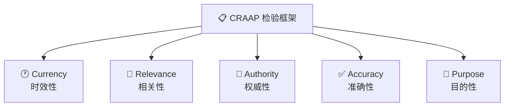
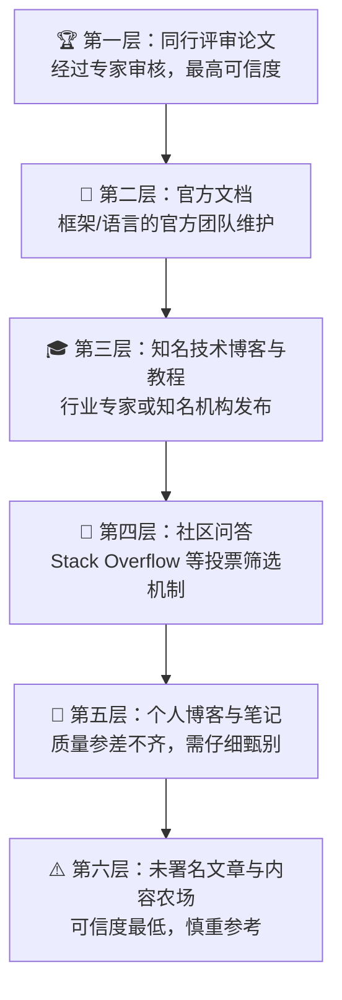
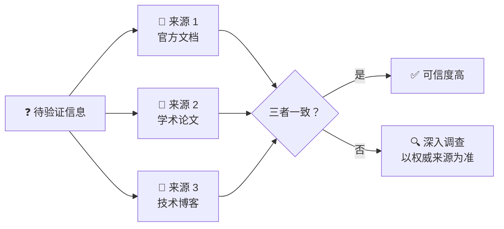
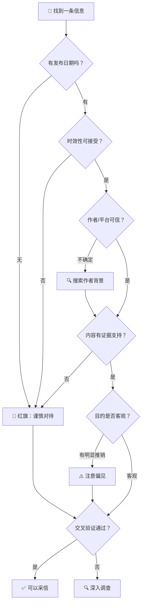

# 可信来源判断

> **所属路径**：`00_高中复习/03_信息素养/02_搜索与资料检索/02_可信来源判断`
> **预计学习时间**：35 分钟
> **难度等级**：⭐

---

## 前置知识

- [关键词设计](../01_关键词设计/01_关键词设计.md) — 学会搜索之后，下一步就是判断搜索结果是否值得信赖

> 如果以上内容还不熟悉，建议先完成对应课程再继续。

---

## 学习目标

完成本节后，你将能够：

1. 解释为什么在人工智能学习中判断信息来源的可信度至关重要
2. 运用 CRAAP 检验框架从五个维度系统评估一条信息的可靠性
3. 区分一手来源与二手来源，并说明各自的优缺点
4. 识别不可靠来源的常见"红旗"信号
5. 通过交叉验证策略提高信息判断的准确性

---

## 正文讲解

### 1. 搜到了不等于搜对了

上一节课我们学会了如何设计关键词来高效搜索。但搜索只是第一步——想象一下这样的场景：你在学习机器学习时搜索"如何训练神经网络"，搜索引擎返回了上百条结果。你点开排名靠前的一篇博客，按照它的教程一步步操作，结果代码报错、模型不收敛、调了一晚上参数都不对。第二天你请教一位有经验的同学，他瞟了一眼那篇博客说："这篇文章用的是 TensorFlow 1.x 的写法，三年前就过时了，而且里面的超参数设置有明显的错误。"

这种经历几乎每个学习者都会遇到。互联网上的信息鱼龙混杂——有些内容是权威专家写的，有些是初学者的个人笔记，有些甚至是 AI 自动生成的、未经验证的文本。搜索引擎的排名算法优化的是"点击率"和"相关性"，并不等于"准确性"和"可信度"。这意味着排名靠前的结果未必是最正确的。

对于学习人工智能的人来说，信息可信度的判断尤其关键，原因有三：

- **技术迭代极快**：深度学习框架每隔几个月就会更新 API，半年前的教程可能已经无法运行
- **错误代价高昂**：一个错误的模型实现或不当的数据预处理方式，可能导致你浪费数小时甚至数天的训练时间
- **误信息传播广泛**：社交媒体和内容平台上充斥着对 AI 能力的夸大宣传和对技术细节的错误解读

因此，**可信来源判断（Evaluating Source Credibility）** 是每个信息时代学习者的必备技能——它不是让你"不相信任何东西"，而是让你有能力区分"可以信"和"需要再查查"的信息。

### 2. CRAAP 检验框架：五个维度评估信息

面对一条搜索结果，你该怎么判断它是否可靠？美国加州州立大学的图书馆团队提出了一个被广泛使用的评估框架，叫做 **CRAAP 检验（CRAAP Test）**。这个名字听起来有点好笑，但它确实是一套非常实用的工具。CRAAP 是五个评估维度的首字母缩写：

> 📌 **图解说明**：CRAAP 框架包含五个维度——时效性、相关性、权威性、准确性和目的性。对任何一条信息，你都可以从这五个角度逐一评估。

下面我们逐一展开这五个维度，每个维度都会给出在人工智能学习场景中的具体判断方法。

#### 时效性（Currency）

**核心问题**：这条信息是什么时候发布的？在这个领域，它还算"新"吗？

在人工智能领域，时效性特别重要。以下是一些判断标准：

| 信息类型 | 合理的时效范围 | 说明 |
| -------- | -------------- | ---- |
| 深度学习框架教程 | 1–2 年内 | PyTorch、TensorFlow 等框架 API 更新频繁 |
| 学术论文 | 视领域而定 | 经典论文不过时，但"最新进展"类需关注近 1–2 年 |
| 数学基础教材 | 无严格时限 | 线性代数、微积分的基础知识几十年不变 |
| AI 行业趋势分析 | 6 个月内 | 大模型领域发展极快，半年前的判断可能已不准确 |

> 💡 **小技巧**：在搜索引擎中使用时间过滤功能（如 Google 的"工具 → 时间"），可以快速筛除过时的结果。

#### 相关性（Relevance）

**核心问题**：这条信息是在回答我的问题吗？它的目标读者是我吗？

有时候一篇文章标题看起来完全匹配你的搜索词，但点进去才发现它讨论的是另一个层面的问题。比如你搜索"正则化"，找到一篇讲编程中"正则表达式"的文章——虽然都叫"正则"，但完全是两回事。判断相关性时，问自己：

- 这篇文章讨论的对象和我要找的一样吗？
- 它的深度适合我当前的水平吗？（太简单或太深奥都不合适）
- 它是针对我使用的编程语言/框架/版本吗？

#### 权威性（Authority）

**核心问题**：作者是谁？发布平台是什么？他们有资格谈论这个话题吗？

权威性的判断可以从"人"和"平台"两个层面入手：

**关于作者**：
- 作者是否标注了真实姓名和所属机构？
- 作者在这个领域有没有可查证的背景（如学术论文、开源项目、知名公司任职经历）？
- 匿名作者的内容不一定是错的，但需要更加谨慎对待

**关于平台**：
- 内容发布在官方文档网站（如 pytorch.org）还是个人博客？
- 平台是否有编辑审核机制（如学术期刊的同行评审）？
- 社区平台（如 Stack Overflow）上的回答通常经过投票筛选，可信度相对较高

#### 准确性（Accuracy）

**核心问题**：这条信息的内容是否正确？有没有证据支持？

准确性是最核心也是最难判断的维度。以下是一些实用的检查方法：

- **代码是否可运行**：如果是编程教程，试着运行其中的代码。能跑通不代表一定正确，但跑不通基本说明有问题
- **是否引用了来源**：可靠的文章通常会引用论文、官方文档或其他权威来源
- **数据和结论是否一致**：如果文章声称"方法 A 优于方法 B"，看看它是否提供了实验数据来支持这个结论
- **是否有同行验证**：学术论文经过同行评审，Stack Overflow 的回答有投票和评论，这些都是准确性的间接指标

#### 目的性（Purpose）

**核心问题**：作者写这篇文章的目的是什么？是教育、推销，还是吸引流量？

不同目的的内容有不同的可信度风险：

| 目的 | 典型特征 | 可信度风险 |
| ---- | -------- | ---------- |
| 教育/分享 | 详细解释原理，提供代码和推导 | 较低 |
| 推广产品 | 突出某个工具/平台的优势，淡化缺点 | 中等 |
| 吸引流量 | 标题夸张，内容空洞，广告多 | 较高 |
| 营销/广告 | 直接推销课程或服务 | 高 |

> 💡 **提醒**：一篇文章可以同时有多个目的。比如一个云平台发布的深度学习教程，内容可能是高质量的，但它的最终目的是推广自家的云服务。了解目的不是为了否定内容，而是为了保持警觉。

### 3. 信息来源的可信度层级

不同类型的来源天然具有不同的可信度。了解这个层级结构，能帮助你在搜索时优先选择更可靠的来源。

> 📌 **图解说明**：来源的可信度大致可以分为六个层级。层级越高，信息经过审核和验证的程度越高。但低层级来源中也可能有高质量的内容，关键在于结合 CRAAP 框架综合判断。

需要强调的是，这个层级不是绝对的。一篇优秀的个人博客文章可能比一篇质量一般的论文更有实用价值。层级结构给出的是"默认信任度"——当你没有时间做深入调查时，优先选择高层级来源是一个安全的策略。

### 4. 一手来源与二手来源

在评估信息时，还有一个重要的区分维度：这条信息是 **一手来源（Primary Source）** 还是 **二手来源（Secondary Source）** ？

- **一手来源**：信息的原始出处。例如 PyTorch 的官方文档、某个算法的原始论文、某个实验的原始数据
- **二手来源**：对一手来源的引用、解读或总结。例如一篇博客对 Transformer 论文的解读、一个视频教程对官方文档的讲解

| 来源类型 | 优点 | 缺点 | 示例 |
| -------- | ---- | ---- | ---- |
| 一手来源 | 最准确、最权威 | 可能较难理解，信息量大 | 原始论文、官方 API 文档 |
| 二手来源 | 更易懂，有人帮你梳理过 | 可能引入误解或遗漏关键细节 | 技术博客、视频教程 |

最好的学习策略是：**先通过二手来源建立初步理解，再回到一手来源核实关键细节**。比如你先看一篇博客了解某个算法的大致思路，然后再去读原始论文或官方文档确认细节。这样既高效又准确。

### 5. 不可靠来源的"红旗"信号

有些来源一眼就能看出问题。以下是一些常见的 **"红旗"信号（Red Flags）** ——如果你在一条信息中发现了这些特征，就要特别警惕：

- **没有作者署名，也没有发布日期**：连谁写的、什么时候写的都不知道，可信度大打折扣
- **标题极度夸张**：如"5 分钟学会深度学习""这一个技巧让你的模型准确率达到 99%"
- **充斥广告和弹窗**：内容农场（Content Farm）的典型特征
- **代码片段没有上下文**：只给了几行代码却没有解释原理、没有完整的可运行示例
- **从不引用来源**：做出大胆声明却不提供任何依据
- **只展示成功案例**：真正的技术内容会讨论局限性和失败情况
- **与其他权威来源矛盾**：如果一篇文章的说法和官方文档明显不一致，要优先相信官方文档
- **AI 生成但未经审核**：随着大语言模型的普及，大量 AI 生成的文章出现在网上，其中可能包含"看起来很有道理但实际上是编造的"内容（即 **幻觉（Hallucination）** ）

### 6. 评估 AI 教程与技术博客的实用技巧

在学习人工智能的过程中，你会大量阅读技术博客和在线教程。以下是一些专门针对这类内容的评估技巧：

**评估文章质量**：
- 作者是否解释了"为什么"而不仅仅是"怎么做"？好的教程会讲原理，而不只是罗列步骤
- 代码是否包含完整的导入语句和环境说明？能让你直接复制运行的教程通常更用心
- 文章是否讨论了方法的局限性？只说优点不说缺点的文章往往不够客观

**评估 GitHub 仓库**：当你在 GitHub 上找到一个开源项目，可以从以下几个角度判断它的质量：

| 评估维度 | 高质量信号 | 低质量信号 |
| -------- | ---------- | ---------- |
| ⭐ Star 数量 | 数百或数千，说明社区认可 | 个位数（但新项目除外） |
| 📅 最近更新 | 几天或几周内有提交 | 一年以上没有更新 |
| 📖 文档质量 | 有清晰的 README、使用说明和示例 | 只有代码，没有任何说明 |
| 🧪 测试覆盖 | 有自动化测试和 CI 徽章 | 没有任何测试 |
| 🐛 Issue 处理 | Issue 有人回复、及时关闭 | 大量 Issue 无人理会 |
| 📜 开源许可 | 明确标注许可证 | 没有许可证信息 |

**官方文档 vs. 社区教程**：当两者说法不一致时，几乎总是应该以官方文档为准。社区教程的价值在于用更易懂的方式解释概念，但具体的 API 用法和参数说明以官方文档为准。

### 7. 交叉验证：多来源互相印证

即使一个来源看起来很可靠，最安全的做法仍然是 **交叉验证（Cross-referencing）** ——用多个独立来源互相印证同一条信息。

> 📌 **图解说明**：交叉验证是用多个独立来源互相印证同一条信息的策略。如果多个来源说法一致，可信度就很高；如果互相矛盾，则需要进一步调查，并优先信任权威来源。

交叉验证在以下场景特别有用：

- **学习新概念时**：不要只看一篇文章就认为自己理解了。至少再看一两篇不同来源的解释，确保你的理解是准确的
- **遇到矛盾说法时**：如果两篇文章给出了不同的建议，去查第三个来源（最好是官方文档或论文），看看哪一个更可靠
- **使用 AI 生成的内容时**：大语言模型生成的回答有时会包含错误，一定要用其他来源验证关键信息

### 8. 完整的来源评估决策流程

把前面学到的所有方法整合起来，我们可以得到一个完整的来源评估决策流程：

> 📌 **图解说明**：这个流程图展示了从"找到一条信息"到"决定是否采信"的完整评估路径。它综合了 CRAAP 框架的五个维度和交叉验证策略。即使某一步出现了红旗，也不意味着必须抛弃这条信息——而是提醒你需要更加谨慎，并通过交叉验证来确认。

---

## 动手实践

前面我们学习了评估来源可信度的理论框架，现在让我们来动手实践。下面是一个小练习——假设你搜索"如何用 Python 实现梯度下降"后找到了三条结果，请用 CRAAP 框架评估它们：

| 编号 | 来源描述 |
| ---- | -------- |
| A | 一篇 2024 年发布的博客文章，作者是某知名大学的机器学习研究员，文中包含完整的 Python 代码和数学推导，引用了原始论文 |
| B | 一篇没有日期的文章，作者匿名，标题是"5 分钟学会梯度下降"，网页上有大量广告，代码只有两行且没有导入语句 |
| C | PyTorch 官方文档中的"自动求导"教程，最近一次更新是 2024 年 |

**评估参考**：

| 维度 | 来源 A | 来源 B | 来源 C |
| ---- | ------ | ------ | ------ |
| 时效性 | ✅ 2024 年 | ❌ 无日期 | ✅ 近期更新 |
| 相关性 | ✅ 直接相关 | ⚠️ 标题相关但内容可能空洞 | ✅ 直接相关 |
| 权威性 | ✅ 大学研究员 | ❌ 匿名作者 | ✅ 官方文档 |
| 准确性 | ✅ 有推导和引用 | ❌ 代码不完整 | ✅ 官方维护 |
| 目的性 | ✅ 教育分享 | ⚠️ 可能是流量导向 | ✅ 官方教育 |
| **综合判断** | **优先参考** | **谨慎对待** | **最佳来源** |

这个练习的核心启示是：**同一个搜索词返回的不同结果，可信度可能天差地别**。养成快速扫描来源的习惯，能帮你在搜索阶段就过滤掉大量低质量内容，把时间花在真正值得阅读的材料上。

---

## 典型误区

| 误区 | 正确理解 |
| ---- | -------- |
| 搜索排名靠前的结果一定更可靠 | 搜索排名主要基于关键词匹配和点击率，与内容准确性没有直接关系。排名靠前的可能是 SEO 优化做得好的营销内容 |
| Star 数量多的 GitHub 项目一定是高质量的 | Star 多说明项目受关注，但不等于代码质量高或维护良好。还需要看文档完整度、Issue 处理情况和最近更新时间 |
| 论文里说的一定是对的 | 即使是同行评审论文，也可能存在实验设置不合理、结果难以复现等问题。论文的可信度较高，但并非"绝对正确" |
| 官方文档太难懂，不如看博客 | 官方文档确实可能不易读，但它是最准确的来源。正确的做法是先看博客建立直觉，再回到官方文档确认细节 |

---

## 练习题

### 练习 1：识别红旗信号（难度：⭐）

以下是四条信息的描述，请判断哪些存在"红旗"信号，并说明理由。

1. 一篇标题为"最新！AI 突破：一夜之间取代所有程序员"的文章，发布在一个充满弹窗广告的网站上
2. Stack Overflow 上一个得到 150 票赞同的回答，回答者的个人资料显示他是 Google 的高级工程师
3. 一篇没有作者署名的文章，标题是"Python 列表操作全指南"，内容详尽但没有标注日期
4. PyTorch 官方教程网站上的"60 分钟快速入门"教程

💡 提示

回顾"红旗"信号清单：没有作者、没有日期、标题夸张、广告过多、不引用来源等。逐条对照检查即可。

✅ 参考答案

1. **存在红旗** 🚩：标题极度夸张（"一夜之间取代所有程序员"），且网站充满弹窗广告，是内容农场的典型特征。
2. **基本可靠** ✅：有投票筛选机制（150 票赞同）、作者背景可查证（Google 高级工程师）。但仍需注意回答的时效性。
3. **存在红旗** 🚩：没有作者署名且没有日期。内容可能是正确的，但无法确认时效性和作者背景，需要交叉验证。
4. **可靠来源** ✅：官方文档，由 PyTorch 团队维护，有明确的更新机制。这属于来源层级中的"第二层"。

### 练习 2：CRAAP 框架实战（难度：⭐⭐）

你在搜索"什么是注意力机制"时找到了以下来源。请用 CRAAP 框架的五个维度分别评估，并给出综合判断。

- **来源 X**：一篇 2017 年的论文《Attention Is All You Need》，发表在 NeurIPS 会议上，作者来自 Google Brain 团队
- **来源 Y**：一篇 2024 年的个人博客文章"图解注意力机制"，作者是一名自称"AI 爱好者"的匿名博主，文中有丰富的图解但没有引用任何论文

💡 提示

注意来源 X 虽然是 2017 年的论文，但它是注意力机制的原始论文——经典论文不会因为"年代久远"而失去时效性。来源 Y 虽然时间较新，但需要检查其他维度。

✅ 参考答案

**来源 X 评估**：

- 时效性：2017 年发表，作为原始论文（一手来源），经典性不受时效影响 ✅
- 相关性：直接相关 ✅
- 权威性：Google Brain 团队，NeurIPS 顶级会议发表 ✅
- 准确性：同行评审论文，被引用次数极高 ✅
- 目的性：学术研究与分享 ✅
- **综合判断：最权威的一手来源，必读**

**来源 Y 评估**：

- 时效性：2024 年，较新 ✅
- 相关性：直接相关 ✅
- 权威性：匿名博主，背景无法验证 ⚠️
- 准确性：图解丰富但不引用论文，无法追溯来源 ⚠️
- 目的性：可能是分享，但也可能是流量导向 ⚠️
- **综合判断：可以作为辅助理解的二手来源，但关键内容需与原始论文交叉验证**

### 练习 3：GitHub 仓库评估（难度：⭐⭐）

你正在寻找一个 Python 数据可视化库，找到了以下两个 GitHub 仓库。根据所给信息，判断哪个更值得使用，并说明理由。

- **仓库 A**：12,000 ⭐、3 天前最后更新、README 详细且有中英文、有完整的测试套件和 CI 徽章、Issue 回复及时、MIT 许可证
- **仓库 B**：50 ⭐、18 个月前最后更新、README 只有一行"一个可视化库"、没有测试、有 30 个未回复的 Issue、没有许可证信息

💡 提示

回顾评估 GitHub 仓库的六个维度：Star 数量、最近更新、文档质量、测试覆盖、Issue 处理、开源许可。逐项对比即可。

✅ 参考答案

**仓库 A 更值得使用**，理由如下：

| 维度 | 仓库 A | 仓库 B |
| ---- | ------ | ------ |
| Star 数量 | 12,000 ✅ 社区广泛认可 | 50 ⚠️ 关注度低 |
| 最近更新 | 3 天前 ✅ 活跃维护 | 18 个月前 ❌ 可能已停止维护 |
| 文档质量 | README 详细，中英文 ✅ | 只有一行描述 ❌ |
| 测试覆盖 | 完整测试 + CI ✅ | 没有测试 ❌ |
| Issue 处理 | 回复及时 ✅ | 30 个未回复 ❌ |
| 开源许可 | MIT 许可证 ✅ | 无许可证 ❌ |

仓库 B 几乎在每个维度上都亮起了"红旗"。即使它的核心代码恰好能满足你的需求，使用一个没有许可证、长期无人维护的项目也存在法律和技术风险。

---

## 下一步学习

- 📖 下一个知识点：[检索记录](../03_检索记录/03_检索记录.md) — 学会了搜索和判断来源之后，如何系统地记录和组织你的检索过程
- 🔗 相关知识点：[学术搜索与论文获取](../04_学术搜索与论文获取/04_学术搜索与论文获取.md) — 学术论文是最高层级的信息来源，这节课会教你如何找到并获取它们
- 🔗 相关知识点：[证据强弱](../../../04_科学思维/04_图表与证据/02_证据强弱/) — 从科学思维的角度理解不同类型证据的可靠性

---

## 参考资料

1. [Evaluating Information – Applying the CRAAP Test](https://library.csuchico.edu/help/source-or-information-good) — 加州州立大学奇科分校图书馆，CRAAP 检验框架的原始来源（公开教育资源）
2. [Wikipedia: Source Criticism](https://en.wikipedia.org/wiki/Source_criticism) — 维基百科关于"来源批评"的综合介绍，涵盖历史学与信息科学的来源评估方法（公共知识库）
3. [How to Evaluate Sources](https://guides.lib.uw.edu/research/evaluate) — 华盛顿大学图书馆的信息评估指南，提供了多种实用的评估框架和示例（公开教育资源）
