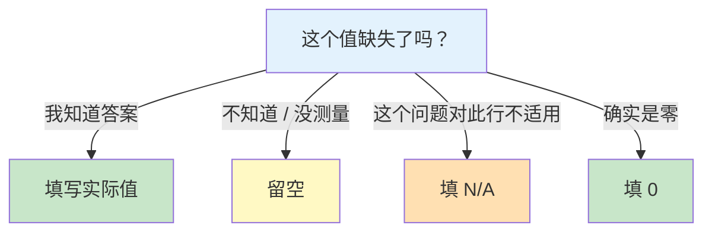

# 数据录入规范

> **所属路径**：`00_高中复习/03_信息素养/03_表格与数据处理/01_数据录入规范`
> **预计学习时间**：30 分钟
> **难度等级**：⭐

---

## 前置知识

- [命名规范](../../01_文件与文件夹管理/02_命名规范/02_命名规范.md) — 良好的命名习惯同样适用于数据表中的列名设计
- 基本的电子表格操作（打开 Excel 或 Google Sheets，能输入文字和数字）

> 如果以上内容还不熟悉，建议先完成对应课程再继续。

---

## 学习目标

完成本节后，你将能够：

1. 解释为什么数据录入规范对数据分析和人工智能至关重要
2. 描述 **整洁数据** 的三条核心原则，并判断一张表是否符合标准
3. 区分文本、数字、日期、布尔值四种常见数据类型，并选择正确的录入方式
4. 使用统一的格式约定录入日期、数值和分类文本
5. 正确处理缺失值，理解空值、`N/A`、`0` 之间的本质区别
6. 设计规范的表头行，使其既适合人阅读、也适合程序读取
7. 使用 Python 读取 CSV 文件并完成基本的数据质量检查

---

## 正文讲解

### 1. 为什么要关心"怎么填表"？

你可能觉得"填表"是一件再简单不过的事情——打开表格软件，把数据敲进去就行了。然而在数据分析和人工智能领域，有一句经典格言：

> **"Garbage in, garbage out"（垃圾进，垃圾出）**

意思是：如果输入的数据是混乱的、不一致的，那么无论你的分析方法多先进、模型多强大，得到的结论都不可信。就好比你用一把刻度歪了的尺子去量东西——量得再认真，结果也是错的。

让我们看一个真实场景：假设你要统计全班同学的身高体重，有的同学写 `175`，有的写 `175cm`，有的写 `1.75m`，还有人在体重栏填了一个"还行"。当你想用这些数据计算平均身高时，程序会直接报错——它不知道如何把 `175cm` 这样的文字当作数字来计算。

这就是为什么我们需要 **数据录入规范（Data Entry Standards）**：一套关于"数据怎么填"的约定，确保每一条数据都是干净的、一致的、可被计算机理解的。


> 📌 **图解说明**：数据从原始状态到被 AI 模型使用，需要经过"录入规范"这道关卡。规范越严格，下游分析的质量就越高。

### 2. 整洁数据：好表格长什么样？

在着手学习具体规范之前，我们先来认识一个核心概念—— **整洁数据（Tidy Data）**。这个概念由统计学家 Hadley Wickham 提出，定义了"好表格"的三条黄金法则：

1. **每一列是一个变量（Variable）**：比如"姓名""身高""体重"各占一列，不要把两种信息塞进同一列。
2. **每一行是一个观测（Observation）**：比如每一行代表一个同学的记录，不要把两个人的数据写在同一行。
3. **每一个单元格是一个值（Value）**：比如身高列里只填一个数字 `175`，不要写 `175/180`（站着/穿鞋）。

来看一个对比：

**❌ 不整洁的表格：**

| 学生 | 身高体重 | 成绩 |
| ---- | -------- | ---- |
| 张三 | 175cm/65kg | 语文85/数学92 |
| 李四 | 168cm/55kg | 语文78/数学88 |

这张表的问题在于：身高和体重被塞进了同一列，语文和数学成绩也混在一起。程序无法直接提取身高数值或计算数学平均分。

**✅ 整洁的表格：**

| name | height_cm | weight_kg | chinese_score | math_score |
| ---- | --------- | --------- | ------------- | ---------- |
| 张三 | 175 | 65 | 85 | 92 |
| 李四 | 168 | 55 | 78 | 88 |

每列一个变量，每行一个学生，每个格子里只有一个值。程序可以轻松计算平均身高：

$$
\bar{h} = \frac{175 + 168}{2} = 171.5
$$

> **直觉解读**： $\bar{h}$ 表示平均身高。因为数据是干净的纯数字，我们才能直接用公式计算。

### 3. 数据类型：每一列该填什么"种类"的值？

整洁数据的每一列都应该有一个明确的 **数据类型（Data Type）**。常见的四种数据类型如下：

| 数据类型 | 英文 | 示例 | 说明 |
| -------- | ---- | ---- | ---- |
| 文本 | Text / String | `张三`、`北京` | 姓名、地址、分类标签 |
| 数字 | Number | `175`、`3.14` | 身高、成绩、价格（纯数字，不带单位） |
| 日期 | Date | `2024-09-01` | 出生日期、测量日期 |
| 布尔值 | Boolean | `TRUE`、`FALSE` | 是否通过、是否缺席（只有两种取值） |

为什么区分数据类型这么重要？因为计算机对不同类型的数据做不同的处理：

- 数字可以求和、求平均、画图。
- 文本可以搜索、分类、统计词频。
- 日期可以计算间隔（"距离考试还有多少天"）。
- 布尔值可以做逻辑判断（"筛选出所有通过的同学"）。

如果你把数字 `175` 录入成文本 `"175cm"`，计算机就不认为它是数字了——你没法对它求平均值。这就好比你问计算器 `175cm + 168cm` 等于多少，计算器只会给你一个问号。

> 💡 **小贴士**：单位信息应该写在列名里（如 `height_cm`），而不是写在每个单元格里。这样既保留了单位信息，又不影响数值计算。

### 4. 格式统一：日期、数值和分类文本的约定

知道了数据类型还不够，同一种类型内部也必须格式统一。这是数据录入中最容易出问题的地方。

#### 日期格式

日期的写法在不同国家差异很大：美国写 `09/01/2024`（月/日/年），中国写 `2024年9月1日`，欧洲写 `01.09.2024`（日.月.年）。这种混乱对计算机来说是灾难。

国际标准 **ISO 8601** 规定了统一的日期格式：

```
YYYY-MM-DD
```

例如 `2024-09-01` 表示 2024 年 9 月 1 日。这种格式的好处是：

- **无歧义**：不会分不清月和日。
- **可排序**：按字符串排序就能自动按时间排序。
- **全球通用**：程序默认就能解析这种格式。

| ❌ 不推荐 | ✅ 推荐 |
| --------- | ------- |
| `9月1日` | `2024-09-01` |
| `09/01/2024` | `2024-09-01` |
| `2024.9.1` | `2024-09-01` |
| `Sept 1, 2024` | `2024-09-01` |

#### 数值格式

数值录入的核心原则：**只填纯数字，不带单位，不带多余符号**。

| ❌ 不推荐 | ✅ 推荐 | 说明 |
| --------- | ------- | ---- |
| `175cm` | `175` | 单位放在列名里 |
| `65公斤` | `65` | 单位放在列名里 |
| `1,234.5` | `1234.5` | 避免千位分隔符（有些地区用逗号做小数点） |
| `约170` | `170` | 不确定性用单独的列记录 |

#### 分类文本

如果某一列是分类变量（如"性别""年级""颜色"），所有值必须使用完全一致的写法：

| ❌ 不一致 | ✅ 一致 |
| --------- | ------- |
| `男`、`Male`、`男性`、`M` | 统一用 `男` 或统一用 `M` |
| `高一`、`高1`、`Grade 10` | 统一用 `高一` |
| `红色`、`红`、`Red`、`RED` | 统一用 `红` 或 `red` |

> ⚠️ **注意**：`Red` 和 `red` 在计算机看来是两个不同的值！大小写必须统一。

### 5. 缺失值：空着 ≠ 填 0 ≠ 填"无"

在实际数据采集中，难免会遇到"这个值我不知道"或"这个值不适用"的情况。很多人会随手填一个 `0`、`无`、`N/A` 或者干脆留空。但这几种做法的含义完全不同！

| 填写方式 | 实际含义 | 举例 |
| -------- | -------- | ---- |
| 空白（留空） | 数据缺失，未知 | 体检时这个同学请假了，没有测量 |
| `0` | 数值确实为零 | 这个同学的迟到次数为 $0$ 次 |
| `N/A` | 不适用（Not Applicable） | "配偶姓名"列对未婚学生不适用 |
| `无` | 含义模糊——是"没有"还是"不知道"？ | ⚠️ 尽量避免使用 |



> 📌 **图解说明**：面对缺失数据时，先判断缺失的原因，再选择合适的填写方式。这四种情况在后续的数据分析中会被完全不同地处理。

为什么这个区别如此重要？假设你要计算全班平均成绩：

- 如果缺考的同学留空，程序会跳过这些行，只对有成绩的同学求平均——这是正确的。
- 如果缺考的同学被填了 `0`，程序会把 $0$ 也纳入平均值计算，结果就会偏低——这就错了。

### 6. 表头行设计：列名怎么起？

表头行（第一行）定义了每一列的含义，是整张表格的"说明书"。一个好的表头应该满足以下要求：

| 原则 | ❌ 不推荐 | ✅ 推荐 | 说明 |
| ---- | --------- | ------- | ---- |
| 使用英文或拼音 | `身高（厘米）` | `height_cm` | 中文列名在某些编程语言中会导致编码问题 |
| 使用下划线连接 | `math score` | `math_score` | 空格在编程中容易引发错误 |
| 名称简洁明确 | `x1`、`col2` | `birth_date` | 别人（包括未来的你）看到列名就能理解含义 |
| 包含单位信息 | `height` | `height_cm` | 明确单位，避免混淆 |
| 不使用特殊字符 | `score(%)` | `score_pct` | 括号、百分号等在代码中有特殊含义 |
| 全部小写 | `Height_CM` | `height_cm` | 避免大小写不一致的问题 |

你可能会问："表头用英文，那中文说明放在哪里？" 好问题！推荐的做法是：在表格文件之外维护一份 **数据字典（Data Dictionary）**，专门记录每一列的中文名称、数据类型、取值范围和说明。


> 📌 **图解说明**：数据表和数据字典分开维护。数据表保持程序友好，数据字典保持人类友好。

### 7. 数据验证：怎么确保填对了？

即使有了明确的规范，手工录入时还是可能出错。**数据验证（Data Validation）** 就是在数据录入时或录入后，自动检查数据是否符合预期规则。

常见的验证规则包括：

| 验证类型 | 规则示例 | 检查目的 |
| -------- | -------- | -------- |
| 类型检查 | 身高列必须是数字 | 防止误录文字 |
| 范围检查 | 身高在 $50$ 到 $250$ 之间 | 防止异常值（如误录 `1750`） |
| 格式检查 | 日期必须是 `YYYY-MM-DD` | 防止格式不一致 |
| 唯一性检查 | 学号不能重复 | 防止重复录入 |
| 非空检查 | 姓名列不能为空 | 防止遗漏关键信息 |
| 枚举检查 | 性别只能是 `男` 或 `女` | 防止拼写错误 |

在 Excel/Google Sheets 中，你可以通过"数据验证"功能设置下拉菜单、数值范围等限制。在编程中，我们可以用代码来自动检查——接下来的"动手实践"部分就会演示这一点。

### 8. 常见错误清单

在结束正文之前，我们把最常见的数据录入错误汇总成一张检查清单，方便你在每次录入后逐项对照：

| 错误类型 | 典型表现 | 正确做法 |
| -------- | -------- | -------- |
| 混合数据类型 | 身高列出现 `175` 和 `一米七五` | 统一为纯数字 |
| 单位不一致 | 有的行用厘米，有的用米 | 统一单位，放在列名中 |
| 日期格式混乱 | `2024/9/1`、`9月1号`、`Sept 1` | 统一用 `YYYY-MM-DD` |
| 前后空格 | ` 张三 `（名字前后有空格） | 录入后用程序去除空格 |
| 拼写不一致 | `Beijing`、`beijing`、`北京` | 统一用一种写法 |
| 把缺失值填为 0 | 缺考成绩填 `0` | 留空或填 `N/A` |
| 合并单元格 | Excel 中合并了多行 | 每行独立，不合并 |
| 一格多值 | `85/92`（语文/数学） | 拆成两列 |

### 9. 与人工智能的连接

你可能会想："我只是填个表，为什么要这么讲究？" 因为在人工智能领域，数据就是模型的"教材"。

- **机器学习（Machine Learning）** 模型通过数据来学习规律。如果训练数据中身高列混着文字和数字，模型根本无法开始学习。
- 数据科学家的日常工作中，据估计有 **60%–80%** 的时间花在数据清洗上。如果从源头就按规范录入，就能大幅减少后期清洗的工作量。
- 从现在开始养成规范录入数据的习惯，将来学习 [特征工程](../../../../01_基础能力/05_数据能力/03_特征工程/) 和 [数据清洗](../../../../01_基础能力/05_数据能力/02_数据清洗/) 时，你会发现自己比别人多了一个巨大的优势：你的数据从一开始就是干净的。

---

## 动手实践

前面我们学了很多规范，现在来动手验证：用 Python 读取一个 CSV 文件，检查其中的数据质量问题。

下面的代码会创建一份故意包含错误的示例数据，然后逐项检查并报告问题。

```python
# 文件：code/check_data_quality.py
# 用途：演示如何用 Python 基础库检查 CSV 数据质量
# 环境要求：Python 3.10+（仅使用标准库，无需额外安装）

import csv
import io

# ========== 1. 准备一份"有问题"的示例数据 ==========
raw_csv = """name,height_cm,weight_kg,birth_date,passed
张三,175,65,2024-09-01,TRUE
李四,168cm,55,2024/09/02,FALSE
王五,,70,2024-09-03,TRUE
赵六,180,0,2024-09-01,是
钱七,175, 60 ,Sept 1,TRUE
"""

# ========== 2. 读取 CSV 数据 ==========
reader = csv.DictReader(io.StringIO(raw_csv))
rows = list(reader)
headers = reader.fieldnames

print("=== 数据质量检查报告 ===\n")
print(f"共 {len(rows)} 行数据，{len(headers)} 列")
print(f"列名：{headers}\n")

# ========== 3. 逐行逐列检查 ==========
issues = []

for i, row in enumerate(rows, start=2):  # 从第2行开始（第1行是表头）
    name = row["name"]

    # 检查 1：height_cm 是否为纯数字
    height = row["height_cm"].strip()
    if height == "":
        issues.append(f"第{i}行 [{name}]：height_cm 为空（缺失值）")
    else:
        try:
            h = float(height)
            if h < 50 or h > 250:
                issues.append(f"第{i}行 [{name}]：height_cm={h}，超出合理范围 50~250")
        except ValueError:
            issues.append(f"第{i}行 [{name}]：height_cm='{height}'，不是纯数字")

    # 检查 2：weight_kg 是否有前后空格或为 0（可能是误填）
    weight = row["weight_kg"]
    if weight != weight.strip():
        issues.append(f"第{i}行 [{name}]：weight_kg='{weight}'，包含多余空格")
    if weight.strip() == "0":
        issues.append(f"第{i}行 [{name}]：weight_kg=0，请确认是否为缺失值")

    # 检查 3：birth_date 是否为 YYYY-MM-DD 格式
    date = row["birth_date"].strip()
    parts = date.split("-")
    if len(parts) != 3 or len(parts[0]) != 4:
        issues.append(f"第{i}行 [{name}]：birth_date='{date}'，不符合 YYYY-MM-DD 格式")

    # 检查 4：passed 是否为 TRUE/FALSE
    passed = row["passed"].strip()
    if passed not in ("TRUE", "FALSE"):
        issues.append(f"第{i}行 [{name}]：passed='{passed}'，应为 TRUE 或 FALSE")

# ========== 4. 输出检查结果 ==========
if issues:
    print(f"发现 {len(issues)} 个问题：\n")
    for issue in issues:
        print(f"  ⚠️  {issue}")
else:
    print("✅ 未发现数据质量问题！")
```

**运行说明**：
- 环境要求：Python 3.10+（仅使用标准库）
- 运行命令：`python code/check_data_quality.py`

**预期输出**：
```
=== 数据质量检查报告 ===

共 5 行数据，5 列
列名：['name', 'height_cm', 'weight_kg', 'birth_date', 'passed']

发现 7 个问题：

  ⚠️  第3行 [李四]：height_cm='168cm'，不是纯数字
  ⚠️  第3行 [李四]：birth_date='2024/09/02'，不符合 YYYY-MM-DD 格式
  ⚠️  第4行 [王五]：height_cm 为空（缺失值）
  ⚠️  第5行 [赵六]：weight_kg=0，请确认是否为缺失值
  ⚠️  第5行 [赵六]：passed='是'，应为 TRUE 或 FALSE
  ⚠️  第6行 [钱七]：weight_kg=' 60 '，包含多余空格
  ⚠️  第6行 [钱七]：birth_date='Sept 1'，不符合 YYYY-MM-DD 格式
```

回头看看这段代码检测出的问题：`168cm` 混入了单位、日期格式不统一、缺失值留空、`0` 可能是误填、布尔值用了中文"是"、数值前后有空格。这些正是我们在正文中逐一讲过的常见错误。通过编写这样的检查脚本，你可以在数据录入后快速发现问题，而不必靠肉眼逐行检查。

---

## 典型误区

| 误区 | 正确理解 |
| ---- | -------- |
| "数据填了就行，格式不重要" | 格式不一致会导致程序无法处理，后期清洗成本远大于录入时多花的几秒钟 |
| "缺失值填 0 比留空好，至少不会报错" | `0` 是一个有明确含义的数值，会被纳入统计计算；缺失值应该留空或用专门标记 |
| "表头用中文更直观" | 中文表头在编程环境中常导致编码错误，推荐用英文列名 + 数据字典的组合 |
| "合并单元格让表格更好看" | 合并单元格会破坏"每行一个观测"的原则，导致程序无法正确读取 |
| "一个格子里多填点信息更紧凑" | 一格多值违反整洁数据原则，应拆分成多列 |

---

## 练习题

### 练习 1：判断整洁数据（难度：⭐）

以下哪张表符合整洁数据的原则？请指出不符合的表存在什么问题。

**表 A：**

| student | info |
| ------- | ---- |
| 张三 | 身高175/体重65 |
| 李四 | 身高168/体重55 |

**表 B：**

| student | height_cm | weight_kg |
| ------- | --------- | --------- |
| 张三 | 175 | 65 |
| 李四 | 168 | 55 |

<details>
<summary>💡 提示</summary>

回顾整洁数据的三条原则：每列一个变量、每行一个观测、每格一个值。

</details>

<details>
<summary>✅ 参考答案</summary>

**表 B 符合整洁数据原则。**

表 A 的问题：`info` 列中将身高和体重两个变量塞进了同一个单元格（`身高175/体重65`），违反了"每列一个变量"和"每格一个值"的原则。程序无法直接从中提取数字进行计算。

</details>

### 练习 2：修正错误数据（难度：⭐）

以下数据表存在多个录入问题，请找出所有问题并给出修正后的表格。

| Name | height | birthday | gender |
| ---- | ------ | -------- | ------ |
| 张三 | 175cm | 2008年3月 | 男 |
| 李四 | 1.68m | 03/15/2008 | male |
| 王五 | 170 | 2008-05-20 | 男性 |

<details>
<summary>💡 提示</summary>

检查以下方面：列名格式、数值是否带单位、日期格式、分类文本是否一致。

</details>

<details>
<summary>✅ 参考答案</summary>

发现的问题：

1. **列名**：`Name` 首字母大写不一致，`height` 缺少单位信息，`birthday` 和 `gender` 可以更规范。
2. **身高**：`175cm` 混入单位，`1.68m` 单位不统一（应统一为厘米）。
3. **日期**：三种不同格式，应统一为 `YYYY-MM-DD`。
4. **性别**：`男`、`male`、`男性` 三种写法不一致。

修正后：

| name | height_cm | birth_date | gender |
| ---- | --------- | ---------- | ------ |
| 张三 | 175 | 2008-03-01 | 男 |
| 李四 | 168 | 2008-03-15 | 男 |
| 王五 | 170 | 2008-05-20 | 男 |

> 注意：张三的原始日期只有"2008年3月"，缺少具体日期。这里暂填 `2008-03-01`，实际应标注为日期不完整或联系本人确认。

</details>

### 练习 3：缺失值辨析（难度：⭐⭐）

某校记录学生课外活动参与情况，部分数据如下：

| name | club | weekly_hours |
| ---- | ---- | ------------ |
| 张三 | 篮球 | 4 |
| 李四 | | 0 |
| 王五 | N/A | |

请分别解释每一行中空白和 `0` 以及 `N/A` 的含义，并判断哪些可能存在录入问题。

<details>
<summary>💡 提示</summary>

想一想：`club` 列的空白和 `N/A` 分别表示什么？`weekly_hours` 为 `0` 和为空分别是什么意思？

</details>

<details>
<summary>✅ 参考答案</summary>

- **李四**：`club` 为空 → 可能是没有参加社团，也可能是忘了填写（含义模糊，需确认）。`weekly_hours` 为 `0` → 如果确实没参加社团， $0$ 小时是合理的；但如果 `club` 是因为忘填而为空，那 `0` 也可能是错误的。
- **王五**：`club` 为 `N/A` → 明确表示"不适用"（可能该同学因故免参加课外活动）。`weekly_hours` 为空 → 由于不适用，时间也无法填写，留空是合理的。

**可能的录入问题**：李四那一行的 `club` 为空含义不明确。更好的做法是：如果确实没参加社团，应填写"无"或使用统一的标记如 `none`；如果是忘了填，应尽快补录。

</details>

### 练习 4：编写验证规则（难度：⭐⭐）

假设你需要录入一份学生成绩表，包含以下列：`student_id`（学号）、`name`（姓名）、`math_score`（数学成绩）、`exam_date`（考试日期）。请为每一列写出至少一条数据验证规则。

<details>
<summary>💡 提示</summary>

参考正文中"数据验证"部分的验证类型：类型检查、范围检查、格式检查、唯一性检查、非空检查。

</details>

<details>
<summary>✅ 参考答案</summary>

| 列名 | 验证规则 |
| ---- | -------- |
| `student_id` | ① 非空检查：不能为空。② 唯一性检查：不能重复。③ 格式检查：如学号为 8 位数字，应匹配该格式 |
| `name` | ① 非空检查：不能为空。② 类型检查：必须为文本 |
| `math_score` | ① 类型检查：必须为数字。② 范围检查： $0 \leq \text{score} \leq 150$ （假设满分 150）。③ 非空检查：如果缺考应留空而非填 $0$ |
| `exam_date` | ① 格式检查：必须符合 `YYYY-MM-DD` 格式。② 范围检查：日期不应晚于今天。③ 非空检查：不能为空 |

</details>

---

## 下一步学习

- 📖 下一个知识点：[排序与筛选](../02_排序与筛选/02_排序与筛选.md) — 学完录入规范后，接下来学习如何对规范的数据进行排序和筛选操作
- 🔗 相关知识点：[数据清洗](../../../../01_基础能力/05_数据能力/02_数据清洗/) — 当数据已经录入但存在质量问题时，如何用编程手段进行系统性清洗
- 🔗 相关知识点：[探索性数据分析](../../../../01_基础能力/05_数据能力/08_探索性数据分析/) — 在数据录入完成后，如何通过统计和可视化手段快速了解数据全貌

---

## 参考资料

1. [Tidy Data — Hadley Wickham](https://vita.had.co.nz/papers/tidy-data.html) — 整洁数据概念的原始论文，开放获取（Journal of Statistical Software）
2. [Python csv 模块官方文档](https://docs.python.org/zh-cn/3/library/csv.html) — Python 标准库中 CSV 读写模块的完整说明（官方文档）
3. [ISO 8601 日期格式 — 维基百科](https://zh.wikipedia.org/wiki/ISO_8601) — 国际日期格式标准的详细介绍（公共知识库）
4. [Data Organization in Spreadsheets — Karl Broman & Kara Woo](https://doi.org/10.1080/00031305.2017.1375989) — 电子表格数据组织的最佳实践指南，开放获取（The American Statistician）
