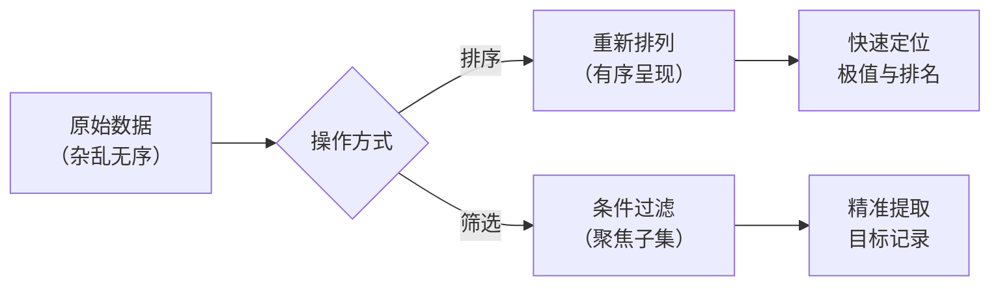
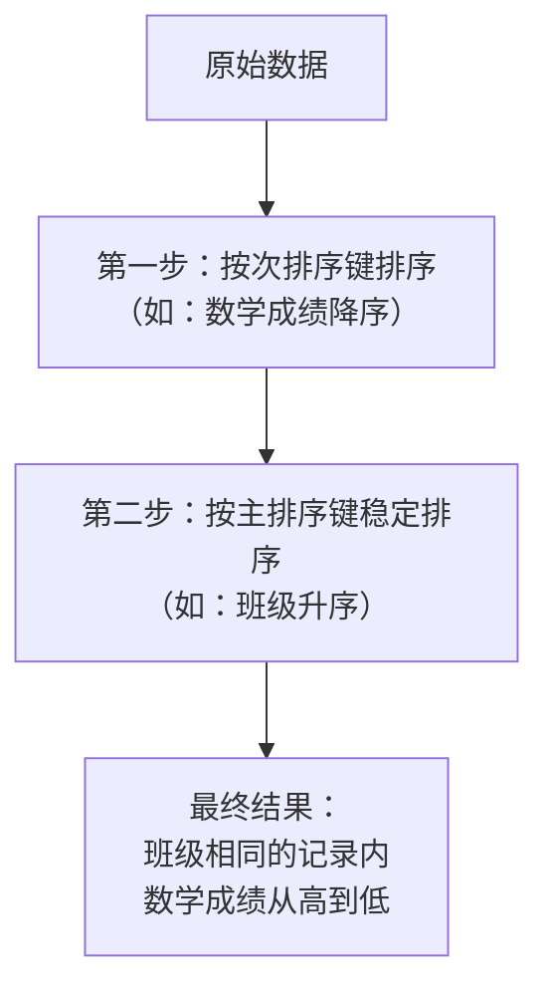
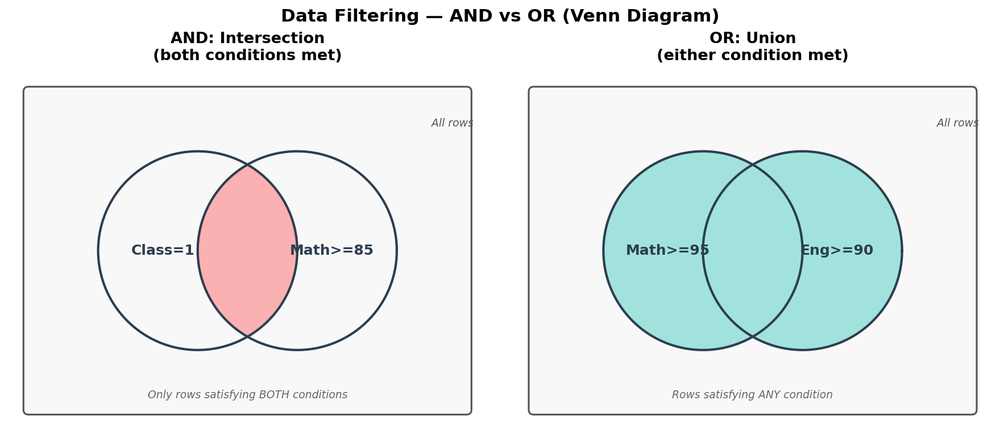
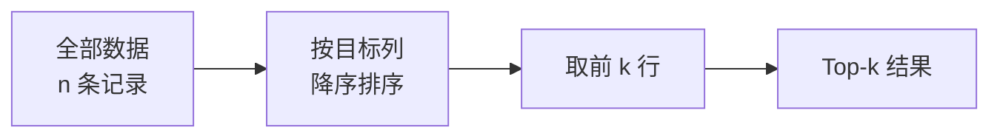

# 排序与筛选

> **所属路径**：`00_高中复习/03_信息素养/03_表格与数据处理/02_排序与筛选`
> **预计学习时间**：30 分钟
> **难度等级**：⭐

---

## 前置知识

- [数据录入规范](../01_数据录入规范/01_数据录入规范.md)

> 如果以上内容还不熟悉，建议先完成对应课程再继续。

---

## 学习目标

完成本节后，你将能够：

1. 解释排序与筛选在数据探索中的作用，并区分两者的适用场景
2. 对一组数据执行升序、降序排序，以及按多列进行复合排序
3. 使用单条件与多条件（与 / 或逻辑）对数据进行筛选
4. 用 Python 代码实现排序与筛选操作，并理解 Top-k 选取的基本思路

---

## 正文讲解

### 1. 为什么需要排序与筛选

想象你面前有一张 500 行的成绩表，里面记录着全年级同学的姓名、班级、语文成绩、数学成绩和英语成绩。现在老师问你："数学成绩最高的 10 位同学是谁？三班有哪些同学英语成绩不及格？" 如果你只能从上到下一行一行地找，那将非常费时。

这就是 **排序（Sorting）** 与 **筛选（Filtering）** 要解决的问题。排序把数据按照某个规则重新排列，让"最大""最小""最前""最后"一目了然；筛选则像一个过滤器，只留下满足特定条件的行，其余全部隐藏。两者结合使用，就能让你在几秒钟内从海量数据中提取出关键信息。

在人工智能领域，数据探索几乎总是从排序和筛选开始的。无论是查看哪些特征取值异常，还是选出评分最高的候选模型，排序与筛选都是最基础也最频繁的操作。后续学习 **[探索性数据分析（Exploratory Data Analysis, EDA）](../../../../01_基础能力/05_数据能力/08_探索性数据分析/)** 和 **[特征选择（Feature Selection）](../../../../01_基础能力/05_数据能力/03_特征工程/)** 时，你会发现它们的核心思路依然离不开"排序 + 筛选"。



> 📌 **图解说明**：排序和筛选是从杂乱数据中提取信息的两条基本路径——排序让数据有序，筛选让数据聚焦。

### 2. 排序：让数据井然有序

**排序（Sorting）** 就是把一组数据按照某个规则重新排列。最常见的两种顺序是：

- **升序（Ascending）**：从小到大排列，如 $1, 3, 5, 7, 9$ 。
- **降序（Descending）**：从大到小排列，如 $9, 7, 5, 3, 1$ 。

对于文本数据，排序通常按照 **字典序（Lexicographic Order）** 进行，就像查字典一样，先比较第一个字符，如果相同再比较第二个字符。例如 "apple" 排在 "banana" 前面，因为字母 'a' 在 'b' 之前。对于中文，电子表格通常按拼音首字母或 Unicode 编码排列。

下面这张表展示了一个简单的学生成绩数据：

| 姓名 | 班级 | 数学 | 英语 |
| ---- | ---- | ---- | ---- |
| 小明 | 1班 | 92 | 78 |
| 小红 | 2班 | 85 | 91 |
| 小刚 | 1班 | 78 | 85 |
| 小丽 | 2班 | 95 | 88 |
| 小强 | 1班 | 88 | 72 |

如果我们按数学成绩降序排序，结果就变成了：

| 姓名 | 班级 | 数学 | 英语 |
| ---- | ---- | ---- | ---- |
| 小丽 | 2班 | 95 | 88 |
| 小明 | 1班 | 92 | 78 |
| 小强 | 1班 | 88 | 72 |
| 小红 | 2班 | 85 | 91 |
| 小刚 | 1班 | 78 | 85 |

一眼就能看出谁的数学成绩最高——这就是排序的威力。

### 3. 多列排序与稳定排序

实际工作中，经常需要按多个列同时排序。比如"先按班级排，同一班级内再按数学成绩从高到低排"。这种操作叫做 **多列排序（Multi-column Sorting）** ，也叫复合排序。

多列排序有两个关键概念：

- **主排序键（Primary Key）**：最优先比较的列。在上面的例子中就是"班级"。
- **次排序键（Secondary Key）**：当主排序键相同时，用来进一步区分的列。在上面的例子中就是"数学成绩"。

按"班级升序 → 数学降序"排列后的结果：

| 姓名 | 班级 | 数学 | 英语 |
| ---- | ---- | ---- | ---- |
| 小明 | 1班 | 92 | 78 |
| 小强 | 1班 | 88 | 72 |
| 小刚 | 1班 | 78 | 85 |
| 小丽 | 2班 | 95 | 88 |
| 小红 | 2班 | 85 | 91 |

这里还值得一提一个概念—— **稳定排序（Stable Sort）** 。它的含义是：当两条记录在排序键上取值相同时，它们在排序结果中的相对顺序和原始数据保持一致。举个例子，如果小明和小强的数学成绩碰巧一样，那么在原始数据中谁排在前面，排序后谁就仍然排在前面。

为什么稳定性很重要？因为在多列排序中，我们通常先按次排序键排一遍，再按主排序键排一遍。如果第二次排序是稳定的，那么第一次排序的结果在主排序键相同的记录之间就会被保留下来，最终得到正确的复合排序结果。



> 📌 **图解说明**：多列排序可以通过两次排序实现——先排次要列，再稳定排主要列。稳定排序保证了次要列的排列不被打乱。

### 4. 筛选：只看你需要的数据

**筛选（Filtering）** 是从数据中提取满足特定条件的记录。与排序不同，筛选不会改变记录的顺序，而是"隐藏"不满足条件的行，只显示你关心的部分。

#### 单条件筛选

最简单的筛选只涉及一个条件。例如：

- 筛选"数学成绩 $\geq 90$ 的同学"→ 结果：小明（92）、小丽（95）
- 筛选"班级 = 2班 的同学"→ 结果：小红、小丽

#### 多条件筛选：与（AND）和或（OR）

当我们需要同时满足或任意满足多个条件时，就需要用到逻辑运算符：

- **与（AND）**：所有条件都必须满足。例如"班级 = 1班 **并且** 数学 $\geq 85$ "→ 结果：小明（1班, 92）、小强（1班, 88）。
- **或（OR）**：只要满足其中一个条件即可。例如"数学 $\geq 95$ **或者** 英语 $\geq 90$ "→ 结果：小丽（数学 95）、小红（英语 91）。

这两个逻辑概念在后续学习 **[命题与逻辑连接词](../../../../../../00_高中复习/01_数学基础/11_集合与逻辑/02_命题与逻辑连接词/)** 时会有更严格的数学定义。现在只需要记住：AND 是"两个条件都要满足"，OR 是"满足一个就行"。

用几何图形来理解最为直观。把满足每个条件的数据行看作一个圆形区域，AND 和 OR 就是对这些区域做集合运算：



> 📌 **图解说明**：左图 AND 对应两个条件集合的交集（红色）——只有同时满足"班级=1班"和"数学≥85"的行才会被保留；右图 OR 对应并集（青色）——满足"数学≥95"或"英语≥90"中任一条件的行都会被保留。你可以运行 `code/plot_filter_boolean_venn.py` 自行生成这张图。

### 5. 在电子表格中的操作思路

无论你使用哪种电子表格软件（如 WPS、Excel 或 Google Sheets），排序与筛选的操作思路都是一样的：

| 操作 | 通用步骤 |
| ---- | -------- |
| 单列排序 | 选中数据区域 → 选择"排序"功能 → 指定排序列和升/降序 |
| 多列排序 | 选择"排序"功能 → 添加多个排序级别 → 设定各级别的列和顺序 |
| 自动筛选 | 选中表头行 → 启用"筛选"功能 → 在下拉菜单中设置条件 |
| 多条件筛选 | 在同一列的筛选中勾选多个值，或在不同列分别设置条件 |

电子表格中的排序默认就是稳定排序，所以你在设置多列排序时可以放心——排在前面的级别就是主排序键，后面的就是次排序键。

> 💡 **提示**：筛选功能不会删除数据，只是隐藏了不满足条件的行。取消筛选后，所有数据会重新显示。

### 6. Top-k 选取：排序的延伸

有一类常见的需求是"从一堆数据中选出最好的前 $k$ 个"，这就是 **Top-k 选取（Top-k Selection）** 。比如：

- 选出数学成绩最高的前 3 名同学
- 从 1000 个候选特征中选出对模型最重要的前 10 个

最直观的做法就是先降序排序，然后取前 $k$ 行。这个思路看起来简单，却是人工智能中非常重要的操作。在后续学习 **[特征选择（Feature Selection）](../../../../01_基础能力/05_数据能力/03_特征工程/)** 时，你会发现很多方法的核心步骤就是"给每个特征打分 → 排序 → 选前 $k$ 个"。



> 📌 **图解说明**：Top-k 选取的流程非常直观——排序后截取前 $k$ 条记录即可。

---

## 动手实践

前面我们理解了排序与筛选的概念，现在用 Python 来实际动手试一试。Python 内置的 `sorted()` 函数和列表推导式就足以完成这些操作。

```python
# 文件：code/sort_and_filter.py
# 用 Python 实现排序与筛选的基本操作
# 环境要求：Python 3.10+（无需额外库）

# ---- 准备数据 ----
students = [
    {"姓名": "小明", "班级": "1班", "数学": 92, "英语": 78},
    {"姓名": "小红", "班级": "2班", "数学": 85, "英语": 91},
    {"姓名": "小刚", "班级": "1班", "数学": 78, "英语": 85},
    {"姓名": "小丽", "班级": "2班", "数学": 95, "英语": 88},
    {"姓名": "小强", "班级": "1班", "数学": 88, "英语": 72},
]

# ---- 1. 单列排序：按数学成绩降序 ----
by_math_desc = sorted(students, key=lambda s: s["数学"], reverse=True)
print("=== 按数学成绩降序 ===")
for s in by_math_desc:
    print(f"  {s['姓名']}  数学={s['数学']}")

# ---- 2. 多列排序：先按班级升序，再按数学成绩降序 ----
# Python 的 sorted() 是稳定排序，因此可以先排次要键再排主要键
by_class_math = sorted(students, key=lambda s: s["数学"], reverse=True)  # 先排次要键
by_class_math = sorted(by_class_math, key=lambda s: s["班级"])           # 再排主要键（稳定）
print("\n=== 按班级升序 → 数学降序 ===")
for s in by_class_math:
    print(f"  {s['姓名']}  班级={s['班级']}  数学={s['数学']}")

# ---- 3. 也可以用元组一次完成多列排序 ----
# 技巧：对需要降序的数值取负数
by_class_math_v2 = sorted(students, key=lambda s: (s["班级"], -s["数学"]))
print("\n=== 多列排序（元组法） ===")
for s in by_class_math_v2:
    print(f"  {s['姓名']}  班级={s['班级']}  数学={s['数学']}")

# ---- 4. 单条件筛选：数学 >= 90 ----
math_ge_90 = [s for s in students if s["数学"] >= 90]
print("\n=== 筛选：数学 >= 90 ===")
for s in math_ge_90:
    print(f"  {s['姓名']}  数学={s['数学']}")

# ---- 5. 多条件筛选（AND）：1班 且 数学 >= 85 ----
class1_math_ge_85 = [s for s in students if s["班级"] == "1班" and s["数学"] >= 85]
print("\n=== 筛选：1班 AND 数学 >= 85 ===")
for s in class1_math_ge_85:
    print(f"  {s['姓名']}  班级={s['班级']}  数学={s['数学']}")

# ---- 6. 多条件筛选（OR）：数学 >= 95 或 英语 >= 90 ----
high_scorers = [s for s in students if s["数学"] >= 95 or s["英语"] >= 90]
print("\n=== 筛选：数学 >= 95 OR 英语 >= 90 ===")
for s in high_scorers:
    print(f"  {s['姓名']}  数学={s['数学']}  英语={s['英语']}")

# ---- 7. Top-k 选取：数学成绩前 3 名 ----
k = 3
top_k_math = sorted(students, key=lambda s: s["数学"], reverse=True)[:k]
print(f"\n=== Top-{k}：数学成绩前 {k} 名 ===")
for rank, s in enumerate(top_k_math, start=1):
    print(f"  第{rank}名: {s['姓名']}  数学={s['数学']}")
```

**运行说明**：
- 环境要求：Python 3.10+，无需安装任何第三方库
- 运行命令：`python code/sort_and_filter.py`

**预期输出**：
```
=== 按数学成绩降序 ===
  小丽  数学=95
  小明  数学=92
  小强  数学=88
  小红  数学=85
  小刚  数学=78

=== 按班级升序 → 数学降序 ===
  小明  班级=1班  数学=92
  小强  班级=1班  数学=88
  小刚  班级=1班  数学=78
  小丽  班级=2班  数学=95
  小红  班级=2班  数学=85

=== 多列排序（元组法） ===
  小明  班级=1班  数学=92
  小强  班级=1班  数学=88
  小刚  班级=1班  数学=78
  小丽  班级=2班  数学=95
  小红  班级=2班  数学=85

=== 筛选：数学 >= 90 ===
  小明  数学=92
  小丽  数学=95

=== 筛选：1班 AND 数学 >= 85 ===
  小明  班级=1班  数学=92
  小强  班级=1班  数学=88

=== 筛选：数学 >= 95 OR 英语 >= 90 ===
  小红  数学=85  英语=91
  小丽  数学=95  英语=88

=== Top-3：数学成绩前 3 名 ===
  第1名: 小丽  数学=95
  第2名: 小明  数学=92
  第3名: 小强  数学=88
```

从运行结果可以验证我们前面讲解的每个概念：降序排序把最大值排在最前面，多列排序正确地实现了"先分组再组内排名"，AND 筛选只保留同时满足两个条件的记录，OR 筛选保留了满足任意一个条件的记录，Top-k 选取则直接截取了排序后的前 $k$ 行。

---

## 典型误区

| 误区 | 正确理解 |
| ---- | -------- |
| 排序会改变原始数据 | 电子表格中的排序确实会改变行的顺序，但筛选只是隐藏行而不删除。Python 中 `sorted()` 会返回一个**新列表**，原始列表不受影响；只有 `.sort()` 方法才会就地修改原列表 |
| 多列排序中先排主排序键 | 如果使用稳定排序的两次排序法，应该**先排次排序键，后排主排序键**。当然也可以使用元组法一步完成，就不需要关心顺序 |
| 筛选中 AND 和 OR 混用不加括号 | 在编写多条件筛选时，AND 的优先级高于 OR。如果逻辑复杂，一定要用括号明确优先级，例如 `(条件A or 条件B) and 条件C` |
| 文本排序和数值排序的结果一样 | 文本 "9" 会排在 "10" 后面（因为字符 '9' > '1'），而数值 $9 < 10$ 。如果数据类型不对，排序结果可能出乎意料 |

---

## 练习题

### 练习 1：手动排序（难度：⭐）

有以下 4 位同学的信息：

| 姓名 | 语文 | 数学 |
| ---- | ---- | ---- |
| 张三 | 88 | 76 |
| 李四 | 92 | 88 |
| 王五 | 88 | 91 |
| 赵六 | 75 | 95 |

请手动写出"先按语文降序，语文相同时按数学降序"的排序结果。

<details>
<summary>💡 提示</summary>

先找出语文最高的同学排在最前面。如果两位同学语文成绩相同，再比较他们的数学成绩。

</details>

<details>
<summary>✅ 参考答案</summary>

排序结果：

1. 李四（语文 92，数学 88）
2. 王五（语文 88，数学 91）— 语文与张三相同，但数学更高
3. 张三（语文 88，数学 76）
4. 赵六（语文 75，数学 95）

</details>

### 练习 2：编写筛选条件（难度：⭐）

使用正文中的 5 位同学成绩数据，写出满足以下条件的同学名单：

- 条件："英语成绩 $\geq 80$ **并且** 数学成绩 $\geq 80$ "

<details>
<summary>💡 提示</summary>

逐行检查每位同学是否**同时**满足两个条件。AND 要求两个条件都为真。

</details>

<details>
<summary>✅ 参考答案</summary>

逐行检查：

- 小明：英语 78 < 80 ❌ → 不满足
- 小红：英语 91 ≥ 80 ✅，数学 85 ≥ 80 ✅ → **满足**
- 小刚：英语 85 ≥ 80 ✅，数学 78 < 80 ❌ → 不满足
- 小丽：英语 88 ≥ 80 ✅，数学 95 ≥ 80 ✅ → **满足**
- 小强：英语 72 < 80 ❌ → 不满足

结果：**小红、小丽**

</details>

### 练习 3：Python 代码实现（难度：⭐⭐）

给定以下数据，请用 Python 写代码完成两个任务：
1. 按 `score` 降序排序
2. 筛选出 `category` 为 `"A"` 且 `score` $> 80$ 的记录

```python
items = [
    {"name": "x1", "category": "A", "score": 95},
    {"name": "x2", "category": "B", "score": 82},
    {"name": "x3", "category": "A", "score": 77},
    {"name": "x4", "category": "A", "score": 88},
    {"name": "x5", "category": "B", "score": 90},
]
```

<details>
<summary>💡 提示</summary>

排序使用 `sorted()` 配合 `key` 参数和 `reverse=True`。筛选使用列表推导式，在 `if` 中用 `and` 连接两个条件。

</details>

<details>
<summary>✅ 参考答案</summary>

```python
# 按 score 降序排序
by_score = sorted(items, key=lambda x: x["score"], reverse=True)
# 结果: x1(95), x5(90), x4(88), x2(82), x3(77)

# 筛选 category="A" 且 score > 80
filtered = [x for x in items if x["category"] == "A" and x["score"] > 80]
# 结果: x1(A, 95), x4(A, 88)
```

</details>

### 练习 4：Top-k 思考题（难度：⭐⭐）

假设你有 10000 条商品数据，需要选出销量最高的前 5 件商品。

1. 如果用"先完整排序，再取前 5"的方法，排序的时间复杂度大约是多少？（用大 $O$ 记号表示， $n = 10000$ ）
2. 你觉得有没有更高效的方法，不需要对所有数据完整排序就能找到前 5 名？（只需要给出思路即可）

<details>
<summary>💡 提示</summary>

常见排序算法（如归并排序、快速排序）的平均时间复杂度是 $O(n \log n)$ 。想一想：如果你只需要前 $k$ 个，是否有必要把所有 $n$ 个元素都排好序？

</details>

<details>
<summary>✅ 参考答案</summary>

1. 完整排序的时间复杂度约为 $O(n \log n)$ ，对于 $n = 10000$ 大约是 $O(10000 \times 13) \approx 130000$ 次比较。

2. 可以使用 **堆（Heap）** 数据结构来更高效地解决。维护一个大小为 $k = 5$ 的最小堆，遍历所有数据，每遇到一个比堆顶更大的值就替换堆顶并调整堆。这样只需 $O(n \log k)$ 的时间，当 $k$ 远小于 $n$ 时比完整排序快很多。Python 中的 `heapq.nlargest(k, data)` 就是这个思路的实现。这个概念在后续学习数据结构中的 **堆与优先队列** 时会深入讲解。

</details>

---

## 下一步学习

- 📖 下一个知识点：[基础公式](../03_基础公式/03_基础公式.md)
- 🔗 相关知识点：[排序与查找](../../../../01_基础能力/03_编程与计算机基础/02_算法/02_排序与查找/)（深入学习排序算法的原理与实现）
- 🔗 相关知识点：[探索性数据分析](../../../../01_基础能力/05_数据能力/08_探索性数据分析/)（在真实数据集上运用排序与筛选）

---

## 参考资料

1. [Python 官方文档 - Sorting HOW TO](https://docs.python.org/3/howto/sorting.html) — Python 排序功能的官方教程，涵盖 `sorted()`、`key` 参数与稳定排序（官方文档）
2. [Google Sheets 帮助 - 排序和筛选数据](https://support.google.com/docs/answer/3540681) — Google Sheets 中排序与筛选功能的操作指南（官方文档）
3. [维基百科 - 排序算法](https://zh.wikipedia.org/wiki/%E6%8E%92%E5%BA%8F%E7%AE%97%E6%B3%95) — 各种排序算法的概述与比较（公共知识库）
