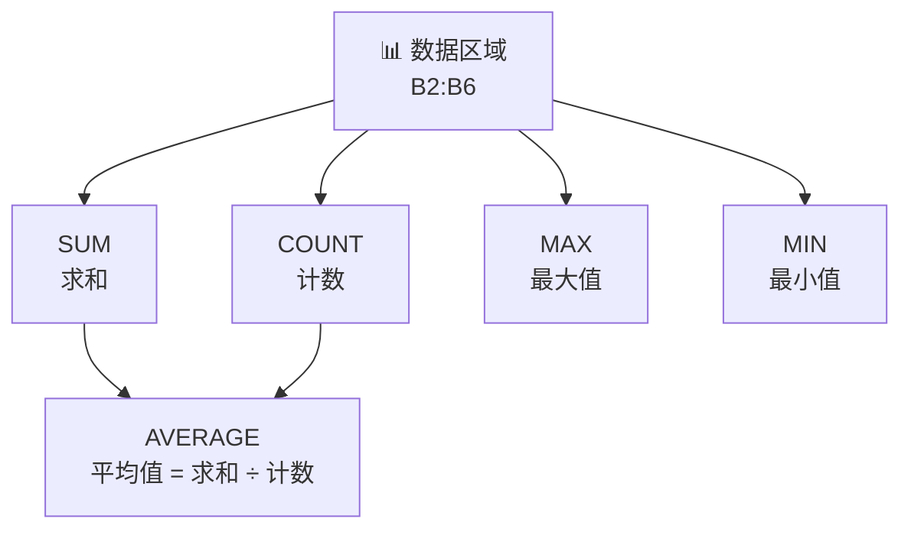
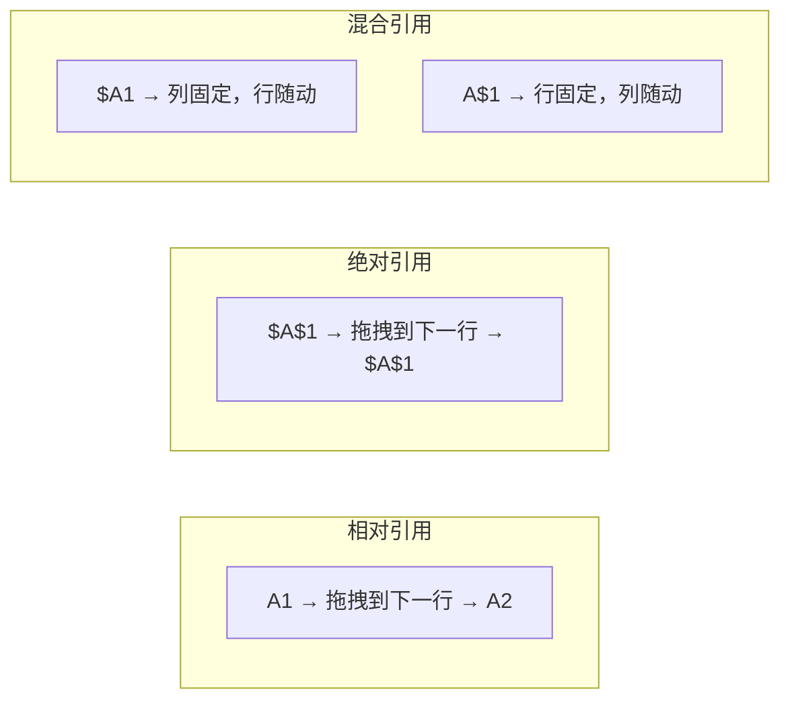
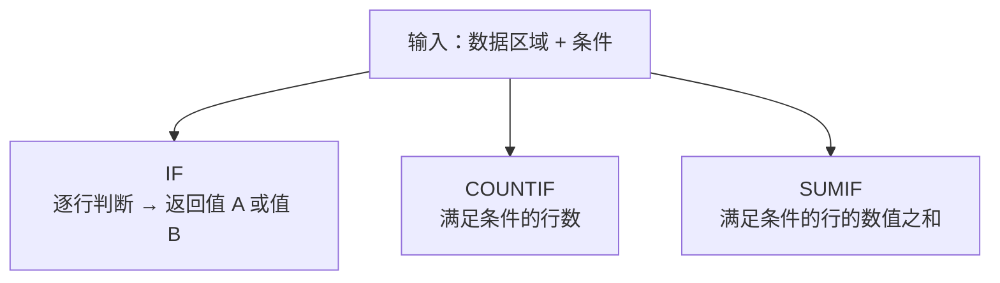
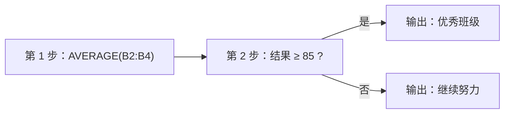

# 基础公式

> **所属路径**：`00_高中复习/03_信息素养/03_表格与数据处理/03_基础公式`
> **预计学习时间**：35 分钟
> **难度等级**：⭐⭐

---

## 前置知识

- [排序与筛选](../02_排序与筛选/02_排序与筛选.md) — 表格的基本操作与数据组织方式
- [平均数中位数众数](../../../../01_数学基础/10_统计基础/01_平均数中位数众数/01_平均数中位数众数.md) — 统计概念的数学基础

> 如果以上内容还不熟悉，建议先完成对应课程再继续。

---

## 学习目标

完成本节后，你将能够：

1. 解释公式在表格处理中的核心价值，以及它如何减少人为错误
2. 使用 SUM、AVERAGE、COUNT、MAX、MIN 等基础函数完成常见统计计算
3. 区分相对引用与绝对引用，并在实际场景中正确选用
4. 运用 IF、COUNTIF、SUMIF 等条件公式实现按条件汇总
5. 阅读嵌套公式并理解其从内到外的执行逻辑
6. 用 Python 实现与表格公式等价的计算，为后续数据分析打下基础

---

## 正文讲解

### 1. 为什么要学公式？

想象你是一名班主任，期末考试结束了，你手里有全班 50 名同学的语文、数学、英语三科成绩。你需要算出每个人的总分、班级平均分、最高分和最低分——如果靠手动逐个相加、再拿计算器除以 50，不仅耗时耗力，还极容易出错。

这正是 **公式（Formula）** 要解决的问题。在电子表格中，公式是一段以等号 `=` 开头的指令，它告诉表格软件："请帮我自动完成这个计算。"公式的核心价值可以概括为两点：

- **自动化重复计算**：一个公式写好后，可以瞬间应用到成千上万行数据上。
- **减少人为错误**：机器不会把 `78` 看成 `87`，也不会忘记把第 37 行的数据加进去。

在人工智能领域，数据预处理、 **[特征工程（Feature Engineering）](../../../../01_基础能力/05_数据能力/03_特征工程/)** 和 **[评估指标（Evaluation Metrics）](../../../../02_核心原理/02_经典机器学习/11_评估指标/)** 的计算，其底层逻辑与表格公式如出一辙——只不过换成了 Python 代码和更大规模的数据。所以，理解表格公式是迈向数据科学的第一步。

### 2. 核心统计函数

电子表格软件（如 Excel、Google Sheets、WPS 表格）内置了大量函数。下面这五个是最基础、最常用的：

| 函数 | 含义 | 示例 | 结果说明 |
| ---- | ---- | ---- | -------- |
| `SUM` | 求和 | `=SUM(B2:B6)` | 将 B2 到 B6 的所有数值相加 |
| `AVERAGE` | 求平均值 | `=AVERAGE(B2:B6)` | 所有数值之和除以个数 |
| `COUNT` | 计数（仅数值） | `=COUNT(B2:B6)` | 统计 B2 到 B6 中有多少个数值 |
| `MAX` | 最大值 | `=MAX(B2:B6)` | 找出 B2 到 B6 中的最大数值 |
| `MIN` | 最小值 | `=MIN(B2:B6)` | 找出 B2 到 B6 中的最小数值 |

让我们用一个具体的成绩表来感受它们的作用：

| | A（姓名） | B（语文） | C（数学） | D（英语） |
| ---- | --------- | --------- | --------- | --------- |
| 第 2 行 | 张三 | 85 | 92 | 78 |
| 第 3 行 | 李四 | 90 | 88 | 95 |
| 第 4 行 | 王五 | 76 | 95 | 82 |

如果我们想知道语文的平均分，只需在一个空单元格中输入 `=AVERAGE(B2:B4)`，表格软件会自动计算出：

$$
\bar{x}_{\text{语文}} = \frac{85 + 90 + 76}{3} = 83.67
$$

这背后的数学原理正是 **算术平均数（Arithmetic Mean）** 的公式：

$$
\bar{x} = \frac{1}{n}\sum_{i=1}^{n} x_i
$$

> **直觉解读**：把所有数据 $x_1, x_2, \ldots, x_n$ 加起来，再除以数据个数 $n$ ，就是平均值。这个公式在统计学和机器学习中无处不在——模型训练时的 **[损失函数（Loss Function）](../../../../02_核心原理/03_深度学习/07_损失函数设计/)** 通常就是对所有样本误差的平均。

下面这张图展示了五个核心函数之间的逻辑关系：



> 📌 **图解说明**：五个核心函数都作用于同一个数据区域。其中 AVERAGE 可以理解为 SUM 和 COUNT 的组合——先求和、再除以个数。

### 3. 单元格引用：相对引用与绝对引用

在表格中写公式时，我们几乎总是通过"单元格地址"来引用数据，而不是直接写数字。这样做的好处是：当源数据变化时，公式结果会自动更新。

但有一个问题：当你把公式从一个单元格"拖拽"复制到另一个单元格时，公式中的引用地址会怎么变？这取决于你使用的是 **相对引用（Relative Reference）** 还是 **绝对引用（Absolute Reference）** 。

**相对引用**：写作 `A1`，复制时地址会随位置自动偏移。例如把 `=A1+B1` 从第 1 行往下拖到第 2 行，公式会自动变为 `=A2+B2`。

**绝对引用**：写作 `$A$1`，复制时地址保持不变。无论你拖到哪里，它始终指向 A1 单元格。

还有一种 **混合引用（Mixed Reference）** ：`$A1`（列固定、行随动）或 `A$1`（行固定、列随动），适合更复杂的场景。



> 📌 **图解说明**：相对引用像"随行就市"，绝对引用像"锚定不动"。混合引用则是二者的折中。

**什么时候用绝对引用？** 当公式中有一个"公共参数"需要所有行共享时——比如税率、汇率、固定系数。假设 E1 单元格存储税率 `0.13`，你想给每一行的销售额乘以税率，公式应写作 `=B2*$E$1`。这样向下拖拽时，B2 会变成 B3、B4……但 `$E$1` 始终指向税率所在的单元格。

### 4. 百分比与比率计算

百分比和比率是数据分析中最常见的衍生指标。在表格中，计算百分比就是一个简单的除法：

$$
\text{百分比} = \frac{\text{部分}}{\text{整体}} \times 100\%
$$

例如：张三语文考了 85 分，满分 100 分，则得分率为：

$$
\frac{85}{100} \times 100\% = 85\%
$$

在表格公式中，只需输入 `=B2/100`，然后将单元格格式设为"百分比"即可。

如果你需要计算"每个人的语文成绩占全班语文总分的比例"，公式为 `=B2/SUM($B$2:$B$4)`。注意这里分母使用了绝对引用 `$B$2:$B$4` ，因为全班总分对每一行来说是同一个数值，不应随拖拽而偏移。

这个思路在机器学习中也很常见。比如 **Softmax 函数** 就是将一组原始分数转化为概率分布，本质上就是"每个值占总和的比例"。

### 5. 条件公式：按条件统计

有时我们不想把所有数据一股脑地求和或计数，而是只想统计满足某个条件的数据。这时就需要 **条件公式（Conditional Formula）** 。

**IF 函数**：根据条件返回不同的值。

```
=IF(B2>=90, "优秀", "继续加油")
```

这句话的意思是：如果 B2 的值大于等于 90，就显示"优秀"；否则显示"继续加油"。

**COUNTIF 函数**：统计满足条件的单元格数量。

```
=COUNTIF(B2:B50, ">=90")
```

计算 B2 到 B50 中有多少个值大于等于 90。

**SUMIF 函数**：对满足条件的数据求和。

```
=SUMIF(A2:A50, "男", C2:C50)
```

含义是：在 A 列中找出所有值为"男"的行，然后把这些行对应的 C 列数值加起来。

下面这张图展示了三个条件函数的逻辑结构：



> 📌 **图解说明**：三个条件函数都接收"数据区域 + 条件"作为输入，但输出不同——IF 输出的是每行的判断结果，COUNTIF 输出的是计数，SUMIF 输出的是求和。

想一想：在机器学习中，当我们按类别统计样本数（"正样本有多少个？负样本有多少个？"），其实就是 COUNTIF 的逻辑；而统计每个类别的平均损失，就是 SUMIF 加上 COUNTIF 的组合。

### 6. 公式嵌套：从内到外阅读

当一个函数的参数本身又是另一个函数时，就形成了 **公式嵌套（Nested Formula）** 。例如：

```
=IF(AVERAGE(B2:B4)>=85, "优秀班级", "继续努力")
```

这个公式该怎么读？秘诀是 **从内到外** ：

1. **最内层**：`AVERAGE(B2:B4)` → 先算出平均值
2. **外层**：`IF(结果>=85, "优秀班级", "继续努力")` → 用平均值去做判断



> 📌 **图解说明**：嵌套公式的执行顺序是从内到外——先计算最内层的函数，再把结果作为外层函数的输入。

公式嵌套的层数越多，阅读难度越大。一个好的习惯是：当嵌套超过三层时，考虑拆分为多个辅助列，每列只做一步计算，这样既方便调试，也方便他人理解。

### 7. 从表格公式到 Python：相同逻辑，不同写法

表格公式和 Python 代码处理的是同一类问题，只是语法不同。下面这张对照表帮你建立两者的映射：

| 表格公式 | Python 等价 | 说明 |
| -------- | ----------- | ---- |
| `=SUM(B2:B6)` | `sum(scores)` | 内置函数求和 |
| `=AVERAGE(B2:B6)` | `sum(scores) / len(scores)` 或 `statistics.mean(scores)` | 求平均 |
| `=COUNT(B2:B6)` | `len(scores)` | 计数 |
| `=MAX(B2:B6)` | `max(scores)` | 最大值 |
| `=MIN(B2:B6)` | `min(scores)` | 最小值 |
| `=IF(B2>=90, ...)` | `"优秀" if score >= 90 else "继续加油"` | 条件判断 |
| `=COUNTIF(...)` | `sum(1 for s in scores if s >= 90)` | 条件计数 |

这种对应关系非常重要：当你未来学习 **[NumPy 基础](../../../../01_基础能力/04_数值计算与科学计算/01_NumPy基础/)** 和 **[Pandas 基础](../../../../01_基础能力/04_数值计算与科学计算/02_Pandas基础/)** 时，你会发现它们提供的函数（如 `np.mean()`、`df.sum()`）与表格公式在概念上完全一致，只是能处理更大规模的数据。

### 8. 连接人工智能：从基础统计到模型评估

你可能会问：学这些基础公式，和人工智能有什么关系？关系比你想象的更直接：

1. **数据预处理阶段**：清洗数据时，你需要用 SUM、COUNT 检查数据完整性，用 AVERAGE 了解数据分布，用 MAX/MIN 发现异常值。
2. **特征工程阶段**：构造新特征时，百分比、比率、条件统计都是常用手段。例如"用户过去 30 天的购买次数"本质上就是 COUNTIF。
3. **模型评估阶段**：计算准确率、召回率等指标，就是条件计数和除法的组合。例如：

$$
\text{准确率} = \frac{\text{预测正确的样本数}}{\text{总样本数}}
$$

这和你在表格中用 `=COUNTIF(结果列, "正确") / COUNT(结果列)` 的逻辑完全一样。

所以，表格公式不是一个"低级技能"，而是数据思维的起点。掌握了这些基础概念，你在后续学习编程和机器学习时会更加得心应手。

---

## 动手实践

理解了公式的概念后，让我们用 Python 来动手验证。下面的代码模拟了一个班级成绩表，使用 Python 内置函数和 `statistics` 模块完成与表格公式等价的计算。

```python
# 文件：code/basic_formulas.py
# 用 Python 模拟表格中的基础公式操作
# 环境要求：Python 3.10+（仅使用标准库）

import statistics

# ========== 模拟成绩数据 ==========
students = {
    "张三": {"语文": 85, "数学": 92, "英语": 78},
    "李四": {"语文": 90, "数学": 88, "英语": 95},
    "王五": {"语文": 76, "数学": 95, "英语": 82},
    "赵六": {"语文": 93, "数学": 71, "英语": 88},
    "孙七": {"语文": 68, "数学": 84, "英语": 91},
}

# 提取语文成绩列表（相当于选中表格中的一列）
chinese_scores = [info["语文"] for info in students.values()]

# ========== 核心统计函数（对应 SUM / AVERAGE / COUNT / MAX / MIN）==========
print("=" * 45)
print("核心统计函数")
print("=" * 45)
print(f"SUM     → 语文总分：{sum(chinese_scores)}")
print(f"COUNT   → 人数：{len(chinese_scores)}")
print(f"AVERAGE → 语文平均分：{sum(chinese_scores) / len(chinese_scores):.2f}")
print(f"          （使用 statistics）：{statistics.mean(chinese_scores):.2f}")
print(f"MAX     → 语文最高分：{max(chinese_scores)}")
print(f"MIN     → 语文最低分：{min(chinese_scores)}")

# ========== 百分比计算 ==========
print(f"\n{'=' * 45}")
print("百分比计算")
print("=" * 45)
total = sum(chinese_scores)
for name, info in students.items():
    pct = info["语文"] / total * 100
    print(f"{name} 语文成绩占全班总分的比例：{pct:.1f}%")

# ========== 条件公式（对应 IF / COUNTIF / SUMIF）==========
print(f"\n{'=' * 45}")
print("条件公式")
print("=" * 45)

# IF：逐行判断
for name, info in students.items():
    label = "优秀" if info["语文"] >= 90 else "继续加油"
    print(f"IF      → {name} 语文 {info['语文']} 分 → {label}")

# COUNTIF：满足条件的计数
count_excellent = sum(1 for s in chinese_scores if s >= 90)
print(f"\nCOUNTIF → 语文 ≥ 90 的人数：{count_excellent}")

# SUMIF：满足条件的求和
sum_excellent = sum(s for s in chinese_scores if s >= 90)
print(f"SUMIF   → 语文 ≥ 90 的总分：{sum_excellent}")

# ========== 公式嵌套（对应嵌套函数）==========
print(f"\n{'=' * 45}")
print("公式嵌套")
print("=" * 45)
avg = statistics.mean(chinese_scores)
result = "优秀班级" if avg >= 85 else "继续努力"
print(f"嵌套    → IF(AVERAGE(语文) >= 85, ...) → 平均分 {avg:.2f} → {result}")

# ========== 连接 AI：模拟准确率计算 ==========
print(f"\n{'=' * 45}")
print("连接 AI：模拟准确率计算")
print("=" * 45)
predictions = ["正确", "正确", "错误", "正确", "错误",
               "正确", "正确", "正确", "错误", "正确"]
correct_count = sum(1 for p in predictions if p == "正确")
accuracy = correct_count / len(predictions)
print(f"预测结果：{predictions}")
print(f"COUNTIF(正确) = {correct_count}")
print(f"COUNT(全部)   = {len(predictions)}")
print(f"准确率 = {correct_count}/{len(predictions)} = {accuracy:.0%}")
```

**运行说明**：
- 环境要求：Python 3.10+（仅使用标准库，无需额外安装）
- 运行命令：`python code/basic_formulas.py`

**预期输出**：
```
=============================================
核心统计函数
=============================================
SUM     → 语文总分：412
COUNT   → 人数：5
AVERAGE → 语文平均分：82.40
          （使用 statistics）：82.40
MAX     → 语文最高分：93
MIN     → 语文最低分：68

=============================================
百分比计算
=============================================
张三 语文成绩占全班总分的比例：20.6%
李四 语文成绩占全班总分的比例：21.8%
王五 语文成绩占全班总分的比例：18.4%
赵六 语文成绩占全班总分的比例：22.6%
孙七 语文成绩占全班总分的比例：16.5%

=============================================
条件公式
=============================================
IF      → 张三 语文 85 分 → 继续加油
IF      → 李四 语文 90 分 → 优秀
IF      → 王五 语文 76 分 → 继续加油
IF      → 赵六 语文 93 分 → 优秀
IF      → 孙七 语文 68 分 → 继续加油

COUNTIF → 语文 ≥ 90 的人数：2
SUMIF   → 语文 ≥ 90 的总分：183

=============================================
公式嵌套
=============================================
嵌套    → IF(AVERAGE(语文) >= 85, ...) → 平均分 82.40 → 继续努力

=============================================
连接 AI：模拟准确率计算
=============================================
预测结果：['正确', '正确', '错误', '正确', '错误', '正确', '正确', '正确', '错误', '正确']
COUNTIF(正确) = 7
COUNT(全部)   = 10
准确率 = 7/10 = 70%
```

从输出中可以看到，Python 的 `sum()`、`len()`、`max()`、`min()` 和 `statistics.mean()` 与表格中的 SUM、COUNT、MAX、MIN、AVERAGE 函数完全对应。而条件判断和条件统计，也只是 Python 中 `if` 表达式和生成器的简单应用。

---

## 典型误区

| 误区 | 正确理解 |
| ---- | -------- |
| "公式只是用来算加减乘除的" | 公式的真正价值在于自动化和可复用。一个公式可以自动适应数据变化，应用到成千上万行 |
| "AVERAGE 和 SUM÷COUNT 不一样" | `AVERAGE(B2:B6)` 本质上就是 `SUM(B2:B6)/COUNT(B2:B6)` ，只是写法更简洁 |
| "用绝对引用总比相对引用好" | 绝对引用用于固定不变的参数（如税率）；大多数场景下相对引用更方便，因为拖拽时会自动适应新行 |
| "嵌套公式层数越多越厉害" | 过度嵌套会导致公式难以阅读和调试。超过三层嵌套时，建议拆分为多个辅助列 |
| "COUNTIF 和 COUNT 差不多" | COUNT 统计所有数值的个数，COUNTIF 只统计满足指定条件的个数，二者用途完全不同 |

---

## 练习题

### 练习 1：核心函数应用（难度：⭐）

某小组有 6 名同学的数学成绩如下：72、88、95、63、81、90。请分别写出求以下结果的表格公式（假设数据在 B2:B7 中）：

1. 总分
2. 平均分
3. 最高分
4. 成绩在 90 分及以上的人数

<details>
<summary>💡 提示</summary>

前三个使用 SUM、AVERAGE、MAX 函数；第四个需要使用 COUNTIF 函数，条件写作 `">=90"` 。

</details>

<details>
<summary>✅ 参考答案</summary>

1. `=SUM(B2:B7)` → 结果为 $72 + 88 + 95 + 63 + 81 + 90 = 489$
2. `=AVERAGE(B2:B7)` → 结果为 $489 \div 6 = 81.5$
3. `=MAX(B2:B7)` → 结果为 $95$
4. `=COUNTIF(B2:B7, ">=90")` → 结果为 $2$ （95 和 90）

</details>

### 练习 2：绝对引用实战（难度：⭐⭐）

假设 A 列是商品名称，B 列是不含税价格，E1 单元格存储税率 `0.13`。请写一个公式放在 C2 中，用于计算第一个商品的含税价格，并使其可以向下拖拽到 C3、C4 等行。

<details>
<summary>💡 提示</summary>

含税价格 = 不含税价格 × (1 + 税率)。关键在于：拖拽时 B 列的行号应该随行变化，但税率单元格必须固定。

</details>

<details>
<summary>✅ 参考答案</summary>

公式为 `=B2*(1+$E$1)`

- `B2` 是相对引用，向下拖拽时自动变为 `B3`、`B4`……
- `$E$1` 是绝对引用，始终指向税率单元格

假设 B2 = 100，则含税价格为：

$$100 \times (1 + 0.13) = 113$$

</details>

### 练习 3：嵌套公式阅读（难度：⭐⭐）

请解读以下公式的执行逻辑，并说明最终输出什么：

```
=IF(MAX(B2:B6) - MIN(B2:B6) > 30, "差距大", "差距小")
```

假设 B2:B6 的数据为 72、88、95、63、81。

<details>
<summary>💡 提示</summary>

从内到外阅读：先算 MAX 和 MIN，再算它们的差值，最后用 IF 判断。

</details>

<details>
<summary>✅ 参考答案</summary>

执行步骤：

1. `MAX(B2:B6)` → $95$
2. `MIN(B2:B6)` → $63$
3. $95 - 63 = 32$
4. $32 > 30$ 为真 → 输出 "差距大"

最终输出：**差距大**

这类公式在数据分析中常用来判断数据的离散程度（极差）。

</details>

### 练习 4：Python 等价实现（难度：⭐⭐）

用 Python 完成以下任务：给定列表 `scores = [72, 88, 95, 63, 81, 90]`，计算满足"大于等于平均分"的成绩个数。

<details>
<summary>💡 提示</summary>

先用 `sum()` 和 `len()` 求平均分，再用条件表达式做 COUNTIF 等价操作。

</details>

<details>
<summary>✅ 参考答案</summary>

```python
scores = [72, 88, 95, 63, 81, 90]
avg = sum(scores) / len(scores)  # 81.5
count = sum(1 for s in scores if s >= avg)
print(f"平均分：{avg}，达到平均分的人数：{count}")
# 输出：平均分：81.5，达到平均分的人数：4
```

对应的表格公式为 `=COUNTIF(B2:B7, ">="&AVERAGE(B2:B7))` 。

</details>

---

## 下一步学习

- 📖 下一个知识点：[数据透视与可视化](../04_数据透视与可视化/04_数据透视与可视化.md) — 学习如何将数据汇总为透视表并用图表呈现
- 🔗 相关知识点：[平均数中位数众数](../../../../01_数学基础/10_统计基础/01_平均数中位数众数/01_平均数中位数众数.md) — 回顾统计量的数学定义
- 🔗 相关知识点：[基础公式](../../../../01_基础能力/04_数值计算与科学计算/01_NumPy基础/) — 未来用 NumPy 处理更大规模的数值计算

---

## 参考资料

1. [Google Sheets 函数列表](https://support.google.com/docs/table/25273) — Google 官方文档，涵盖所有内置函数的用法和示例（官方文档）
2. [Python `statistics` 模块文档](https://docs.python.org/zh-cn/3/library/statistics.html) — Python 官方中文文档，介绍均值、中位数等统计函数（官方文档）
3. [Mozilla 开发者网络 — JavaScript 数组方法](https://developer.mozilla.org/zh-CN/docs/Web/JavaScript/Reference/Global_Objects/Array) — 对照理解编程语言中的聚合操作（CC BY-SA 许可）
