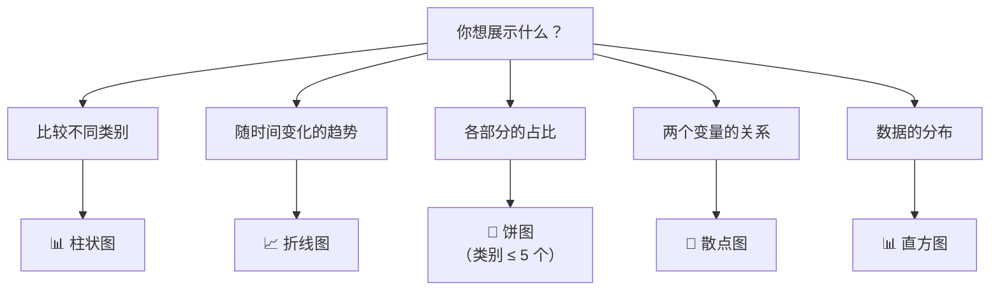

# 数据透视与可视化

> **所属路径**：`00_高中复习/03_信息素养/03_表格与数据处理/04_数据透视与可视化`
> **预计学习时间**：40 分钟
> **难度等级**：⭐⭐

---

## 前置知识

- [基础公式](../03_基础公式/03_基础公式.md) — 使用 SUM、AVERAGE、COUNT 等函数完成常见统计计算

> 如果以上内容还不熟悉，建议先完成对应课程再继续。

---

## 学习目标

完成本节后，你将能够：

1. 解释什么是数据透视表，以及它如何通过"分组 + 聚合"将明细数据压缩为有洞察力的汇总表
2. 区分常见聚合方式（求和、计数、平均值、最大值、最小值）并选择合适的聚合方式
3. 识别五种常用图表类型（柱状图、折线图、饼图、散点图、直方图），并根据分析目的选用正确的图表
4. 用 Python 编写简单的分组聚合代码，并输出文本形式的可视化结果
5. 理解数据可视化在人工智能探索性数据分析中的基础作用

---

## 正文讲解

### 1. 从一堆数据到一张好表——透视表的力量

假设你是班级的学习委员，期中考试结束后，老师交给你一份全班 40 个同学 5 门科目的成绩单——一共 200 行数据。现在校长想知道：**每门科目的平均分是多少？哪门科目最难？** 你会怎么做？

最笨的办法是手动翻阅每一行，把语文的分数抄到一边，数学的抄到另一边，再分别用计算器算平均值。但如果你会使用 **数据透视表（Pivot Table）** ，只需要几秒钟就能得到答案。

所谓数据透视表，就是把原始的"一行一条记录"的明细数据，按照某个 **分类字段**（比如科目）进行 **分组（Group By）** ，然后对另一个 **数值字段**（比如分数）进行 **聚合（Aggregation）** ，最终生成一张更紧凑、更有洞察力的汇总表。这个过程可以用一句话概括：

> **透视 = 分组 + 聚合**

为了理解这个过程，让我们先从"分组"和"聚合"两个核心概念讲起。

### 2. 分组——把数据按类别归拢

**分组（Group By）** 的核心思路很简单：把拥有相同特征的行归到一起。就像把一副扑克牌按花色分成四堆——黑桃一堆、红心一堆、方块一堆、梅花一堆。

以下面这张成绩表为例：

| 姓名   | 科目 | 分数 |
| ------ | ---- | ---- |
| 小明   | 语文 | 85   |
| 小红   | 语文 | 92   |
| 小明   | 数学 | 78   |
| 小红   | 数学 | 88   |
| 小明   | 英语 | 90   |
| 小红   | 英语 | 95   |

如果我们 **按"科目"分组** ，就等于把这 6 行拆成了三堆：

- **语文组**：小明 85，小红 92
- **数学组**：小明 78，小红 88
- **英语组**：小明 90，小红 95

分完之后，每一堆里的数据都属于同一个科目。但光分组还不够——我们还需要对每一堆做一个"汇总动作"，这就是 **聚合** 。

### 3. 聚合——每一堆出一个数字

**聚合（Aggregation）** 就是对每一组数据应用一个计算规则，把一堆数字压缩成一个数字。在前一节 [基础公式](../03_基础公式/03_基础公式.md) 中你已经学会了 SUM、AVERAGE、COUNT 等函数，它们其实就是最常见的聚合操作：

| 聚合方式 | 含义 | 适用场景 | 示例结果（语文组） |
| -------- | ---- | -------- | ------------------ |
| 求和 SUM | 把所有值加起来 | 总销售额、总人数 | $85 + 92 = 177$ |
| 计数 COUNT | 数一共有几条记录 | 参与人数、订单数 | $2$ |
| 平均值 AVERAGE | 所有值的算术平均 | 平均分、平均消费 | $\frac{85 + 92}{2} = 88.5$ |
| 最大值 MAX | 找出最大的那个值 | 最高分、峰值温度 | $92$ |
| 最小值 MIN | 找出最小的那个值 | 最低分、最低价格 | $85$ |

将分组和聚合组合起来，我们就可以得到一张 **透视表** ：

**按科目分组，聚合方式为平均值：**

| 科目 | 平均分 |
| ---- | ------ |
| 语文 | 88.5   |
| 数学 | 83.0   |
| 英语 | 92.5   |

一眼就能看出：英语平均分最高，数学最难。原来 6 行的明细数据被"透视"成了 3 行汇总数据——数据量减少了，但信息含量反而增加了。

下面这张流程图展示了透视表从原始数据到汇总结果的完整过程：


> 📌 **图解说明**：透视表的制作只需四步——确定原始数据、选分组字段、选数值字段、选聚合方式。这个流程对电子表格和编程都适用。

想一想：如果我们换一种分组方式——**按"姓名"分组，对分数求平均** ，会得到什么？答案是每个同学的综合平均分。同一份原始数据，通过不同的"分组 + 聚合"组合，可以从不同角度回答不同的问题——这就是透视表的威力。

### 4. 为什么需要可视化——让数据"说话"

透视表帮我们把数据压缩成了关键数字，但数字本身仍然需要人去"读"。当汇总结果只有三五行时，肉眼看数字就够了；但如果有几十个分类、上百个指标呢？

这时候就轮到 **数据可视化（Data Visualization）** 登场了。人类天生是视觉动物——我们对颜色、长度、位置和形状的感知比对一串数字的感知灵敏得多。同样是"英语 92.5，数学 83.0"，看一串数字要花几秒才能判断差距大小，但看一张柱状图只需要一眼。

> 一张好图胜过一千行数据。

可视化的本质是把数字 **映射** 到视觉元素上：把数值映射为柱子的高度、线条的走势、扇形的面积……让人类的视觉系统替大脑分担"比较"和"发现规律"的工作。

### 5. 五种常用图表——选对图表就成功了一半

不同的分析目的应该使用不同类型的图表。下面介绍五种最常用的图表类型：

**柱状图（Bar Chart）** ——用于 **比较不同类别** 的数值大小。每个类别对应一根柱子，柱子的高度代表数值。适合回答"哪个最多/最少"这类问题。例如：各科目平均分对比。

**折线图（Line Chart）** ——用于展示 **趋势变化** ，尤其是数据随时间变化的规律。横轴通常是时间，纵轴是数值，数据点用线段连接。适合回答"是上升还是下降"这类问题。例如：每月销售额变化。

**饼图（Pie Chart）** ——用于展示各部分在整体中的 **占比构成** 。每个扇形的面积代表该部分占总体的比例。适合回答"各部分分别占百分之多少"这类问题。例如：班级各分数段人数占比。但要注意：当类别超过 5 个时，饼图会变得难以阅读，此时应考虑使用柱状图代替。

**散点图（Scatter Plot）** ——用于探索两个 **变量之间的关系** 。每个数据点在二维平面上对应一个位置，横轴和纵轴分别代表两个变量。适合回答"这两个变量有没有关联"这类问题。例如：学习时间与考试成绩的关系。

**直方图（Histogram）** ——用于展示一组数据的 **分布情况** 。它把数值范围分成若干 **区间（Bin）** ，统计每个区间内有多少数据点落入。适合回答"数据集中在哪个范围"这类问题。例如：全班成绩的分布。

> ⚠️ **注意**：直方图和柱状图虽然外形相似，但用途完全不同。柱状图的横轴是分类（如科目），各柱子之间有间隔；直方图的横轴是连续数值区间，各柱子紧密相连。

下面这张决策流程图帮助你根据分析目的快速选择合适的图表类型：



> 📌 **图解说明**：选择图表类型的关键在于明确你的 **分析目的** 。记住这五个关键词——比较、趋势、占比、关系、分布——就能快速做出正确选择。

### 6. 透视表与可视化的组合拳

在实际工作中，透视表和可视化往往是 **搭配使用** 的：先用透视表把原始数据按需求聚合成汇总表，再把汇总结果画成图表，让结论一目了然。

比如，假设你有一份某地区水果店的月度销售数据：

| 月份 | 水果   | 销售额 |
| ---- | ------ | ------ |
| 1月  | 苹果   | 1200   |
| 1月  | 香蕉   | 800    |
| 2月  | 苹果   | 1500   |
| 2月  | 香蕉   | 900    |
| 3月  | 苹果   | 1100   |
| 3月  | 香蕉   | 1000   |

你可以做两张透视表来回答两个不同的问题：

**问题 1：各水果总销售额是多少？** → 按水果分组，对销售额求和 → 用 **柱状图** 比较。

**问题 2：销售额的月度趋势如何？** → 按月份分组，对销售额求和 → 用 **折线图** 看趋势。

这种"透视 + 可视化"的分析模式，正是未来学习 **[探索性数据分析（Exploratory Data Analysis, EDA）](../../../../01_基础能力/05_数据能力/08_探索性数据分析/)** 的核心思路。在人工智能领域，训练模型之前的第一步往往就是对数据进行 EDA——通过分组统计和图表可视化来发现数据的特征、异常和规律。你现在学到的"透视 + 可视化"组合拳，就是 EDA 的雏形。

---

## 动手实践

前面我们理解了透视表和可视化的概念，现在让我们动手用 Python 来实现一个简单的例子。这段代码不需要安装任何外部库，用 Python 内置功能就能完成分组聚合和文本可视化。

```python
# 文件：code/pivot_and_visualize.py
# 用途：演示分组聚合（透视表）和简单文本柱状图
# 环境要求：Python 3.10+（无需外部库）

# ---------- 第一步：准备原始数据 ----------
# 每条记录是一个字典，包含姓名、科目、分数
records = [
    {"姓名": "小明", "科目": "语文", "分数": 85},
    {"姓名": "小红", "科目": "语文", "分数": 92},
    {"姓名": "小刚", "科目": "语文", "分数": 78},
    {"姓名": "小明", "科目": "数学", "分数": 78},
    {"姓名": "小红", "科目": "数学", "分数": 88},
    {"姓名": "小刚", "科目": "数学", "分数": 95},
    {"姓名": "小明", "科目": "英语", "分数": 90},
    {"姓名": "小红", "科目": "英语", "分数": 95},
    {"姓名": "小刚", "科目": "英语", "分数": 82},
]

# ---------- 第二步：按科目分组 ----------
groups = {}  # 键=科目，值=该科目所有分数的列表
for r in records:
    subject = r["科目"]
    if subject not in groups:
        groups[subject] = []
    groups[subject].append(r["分数"])

print("=== 分组结果 ===")
for subject, scores in groups.items():
    print(f"  {subject}: {scores}")

# ---------- 第三步：对每组进行聚合 ----------
print("\n=== 透视表：各科目统计 ===")
print(f"{'科目':<6} {'平均分':<8} {'最高分':<8} {'最低分':<8} {'人数':<6}")
print("-" * 36)

pivot = {}  # 保存透视结果，后面画图用
for subject, scores in groups.items():
    avg = sum(scores) / len(scores)
    pivot[subject] = round(avg, 1)
    print(f"{subject:<6} {avg:<8.1f} {max(scores):<8} {min(scores):<8} {len(scores):<6}")

# ---------- 第四步：文本柱状图可视化 ----------
print("\n=== 各科目平均分（文本柱状图） ===")
for subject, avg in pivot.items():
    bar_length = int(avg / 2)  # 每 2 分画一个 █
    bar = "█" * bar_length
    print(f"  {subject} | {bar} {avg}")
```

**运行命令**：`python code/pivot_and_visualize.py`

**预期输出**：
```
=== 分组结果 ===
  语文: [85, 92, 78]
  数学: [78, 88, 95]
  英语: [90, 95, 82]

=== 透视表：各科目统计 ===
科目     平均分     最高分     最低分     人数
------------------------------------
语文     85.0     92       78       3
数学     87.0     95       78       3
英语     89.0     95       82       3

=== 各科目平均分（文本柱状图） ===
  语文 | ██████████████████████████████████████████ 85.0
  数学 | ███████████████████████████████████████████████ 87.0
  英语 | ████████████████████████████████████████████ 89.0
```

从文本柱状图中可以直观看到：英语的柱子最长，平均分最高；语文的柱子最短，平均分最低。这就是可视化的效果——把数字差异转化为视觉长度差异，一眼就能判断。

如果你的环境中安装了 matplotlib 库，还可以用以下代码生成一张真正的柱状图：

```python
# 文件：code/pivot_bar_chart.py
# 用途：用 matplotlib 绘制各科目平均分柱状图
# 环境要求：Python 3.10+, matplotlib>=3.5

import matplotlib.pyplot as plt

subjects = ["Chinese", "Math", "English"]
averages = [85.0, 87.0, 89.0]

plt.rcParams['font.sans-serif'] = ['DejaVu Sans']
plt.rcParams['axes.unicode_minus'] = False

fig, ax = plt.subplots(figsize=(6, 4))
bars = ax.bar(subjects, averages, color=['#4CAF50', '#2196F3', '#FF9800'])

# 在柱子顶部标注数值
for bar, val in zip(bars, averages):
    ax.text(bar.get_x() + bar.get_width() / 2, bar.get_height() + 0.5,
            f'{val}', ha='center', va='bottom', fontsize=12)

ax.set_ylabel('Average Score')
ax.set_title('Average Score by Subject')
ax.set_ylim(0, 100)
ax.spines['top'].set_visible(False)
ax.spines['right'].set_visible(False)
ax.grid(axis='y', alpha=0.3)

plt.tight_layout()
plt.savefig('assets/avg_score_by_subject.png', dpi=150,
            facecolor='white', bbox_inches='tight')
plt.show()
print("图表已保存到 assets/avg_score_by_subject.png")
```

代码运行后你会看到一张清晰的柱状图。对比之前的文本版本，图形版本在颜色区分、精确读数和美观程度上都更胜一筹。不过文本柱状图的好处是 **零依赖** ——在任何环境下都能运行，这在调试和快速探索时很有用。

---

## 典型误区

| 误区 | 正确理解 |
| ---- | -------- |
| 透视表只是电子表格的功能，和编程没关系 | 透视表的核心是"分组 + 聚合"思想，Python 的字典分组、Pandas 的 `groupby`、SQL 的 `GROUP BY` 都是同一思路的不同实现 |
| 饼图是展示数据最好的方式 | 饼图只适合展示少量类别（ $\leq 5$ 个）的占比，类别多时人眼很难比较扇形大小，应改用柱状图 |
| 直方图和柱状图是一回事 | 柱状图用于比较 **分类** 数据（柱子之间有间隔），直方图用于展示 **连续** 数值的分布（柱子紧密相连） |
| 图表画得越花哨越好 | 好的可视化应该简洁清晰——去掉不必要的装饰（3D 效果、过多颜色），让数据本身成为主角 |

---

## 练习题

### 练习 1：手动透视（难度：⭐）

下面是一份小型销售数据：

| 地区 | 产品 | 销售额 |
| ---- | ---- | ------ |
| 北京 | 手机 | 5000   |
| 上海 | 手机 | 6000   |
| 北京 | 电脑 | 8000   |
| 上海 | 电脑 | 7000   |
| 北京 | 手机 | 4000   |

请完成以下任务：
1. 按 **地区** 分组，对销售额 **求和** ，写出透视表
2. 按 **产品** 分组，对销售额求 **平均值** ，写出透视表

<details>
<summary>💡 提示</summary>

按地区分组后，北京有 3 条记录（5000、8000、4000），上海有 2 条记录（6000、7000）。

</details>

<details>
<summary>✅ 参考答案</summary>

**按地区求和：**

| 地区 | 销售额合计 |
| ---- | ---------- |
| 北京 | 17000      |
| 上海 | 13000      |

计算过程：北京 = $5000 + 8000 + 4000 = 17000$ ，上海 = $6000 + 7000 = 13000$ 。

**按产品求平均值：**

| 产品 | 平均销售额 |
| ---- | ---------- |
| 手机 | 5000       |
| 电脑 | 7500       |

计算过程：手机有 3 条（5000、6000、4000），平均值为：

$$\dfrac{5000 + 6000 + 4000}{3} = 5000$$

电脑有 2 条（8000、7000），平均值为：

$$\dfrac{8000 + 7000}{2} = 7500$$

</details>

### 练习 2：选择正确的图表（难度：⭐）

对于以下每个分析场景，从柱状图、折线图、饼图、散点图、直方图中选择最合适的图表类型，并简要说明理由：

1. 展示某班级 50 名同学数学成绩的分布
2. 比较 5 个城市的年平均气温
3. 展示某商品过去 12 个月的销售额变化
4. 探索身高与体重之间是否存在关联

<details>
<summary>💡 提示</summary>

回忆五个关键词：比较→柱状图，趋势→折线图，占比→饼图，关系→散点图，分布→直方图。

</details>

<details>
<summary>✅ 参考答案</summary>

1. **直方图** — 成绩是连续数值，需要查看分布在各分数段的人数
2. **柱状图** — 5 个城市是不同类别，需要比较数值大小
3. **折线图** — 12 个月代表时间序列，需要观察趋势变化
4. **散点图** — 身高和体重是两个连续变量，需要探索它们之间的关系

</details>

### 练习 3：用 Python 实现透视（难度：⭐⭐）

请修改动手实践中的代码，将分组方式改为 **按姓名分组** ，聚合方式改为 **对分数求和** （计算每个同学的总分），并输出文本柱状图。

<details>
<summary>💡 提示</summary>

只需要把分组的键从 `r["科目"]` 改为 `r["姓名"]`，聚合时使用 `sum(scores)` 而不是 `sum(scores) / len(scores)`。

</details>

<details>
<summary>✅ 参考答案</summary>

核心修改部分：

```python
groups = {}
for r in records:
    name = r["姓名"]          # 改为按姓名分组
    if name not in groups:
        groups[name] = []
    groups[name].append(r["分数"])

print("=== 透视表：各同学总分 ===")
pivot = {}
for name, scores in groups.items():
    total = sum(scores)       # 改为求和
    pivot[name] = total
    print(f"  {name}: {total}")

print("\n=== 各同学总分（文本柱状图） ===")
for name, total in pivot.items():
    bar = "█" * (total // 5)  # 每 5 分画一个 █
    print(f"  {name} | {bar} {total}")
```

预期输出：

```
=== 透视表：各同学总分 ===
  小明: 253
  小红: 275
  小刚: 255

=== 各同学总分（文本柱状图） ===
  小明 | ██████████████████████████████████████████████████ 253
  小红 | ███████████████████████████████████████████████████████ 275
  小刚 | ███████████████████████████████████████████████████ 255
```

从文本柱状图中可以一眼看出小红的总分最高。

</details>

### 练习 4：思考题——透视表的多种组合（难度：⭐⭐）

同一份数据，用不同的"分组字段 + 聚合方式"组合可以回答不同的问题。请针对动手实践中的成绩数据，设计 **两种** 你认为有意义的"分组 + 聚合"组合，分别说明它回答了什么问题。

<details>
<summary>💡 提示</summary>

想一想：除了"按科目"和"按姓名"，还可以怎么组合？聚合方式除了平均值和求和，MAX 和 MIN 也能回答有趣的问题。

</details>

<details>
<summary>✅ 参考答案</summary>

示例组合（答案不唯一）：

**组合 1**：按科目分组，对分数取 MAX → 回答"每门科目的最高分是多少？谁是单科冠军？"

**组合 2**：按姓名分组，对分数取 MIN → 回答"每个同学最弱的科目得了多少分？哪一科拖了后腿？"

其他合理组合也正确，关键是能清晰说明"分组字段 + 聚合方式 → 回答了什么问题"。

</details>

---

## 下一步学习

- 📖 下一个知识主题：[逻辑与问题拆解](../../04_逻辑与问题拆解/) — 数据处理能力支撑逻辑分析与问题分解
- 🔗 相关知识点（进阶）：[数据可视化](../../../../01_基础能力/05_数据能力/04_数据可视化/) — 使用 Matplotlib、Seaborn 等专业工具进行可视化
- 🔗 相关知识点（进阶）：[探索性数据分析](../../../../01_基础能力/05_数据能力/08_探索性数据分析/) — 系统性地运用透视与可视化进行数据探索

---

## 参考资料

1. [Python 官方文档 — 数据结构](https://docs.python.org/zh-cn/3/tutorial/datastructures.html) — 字典与列表的使用方法，是实现分组聚合的基础（官方文档）
2. [Matplotlib 官方教程 — Pyplot Tutorial](https://matplotlib.org/stable/tutorials/pyplot.html) — 学习用 Python 绑制各类图表的入门教程（官方文档，BSD 许可）
3. [维基百科 — 数据透视表](https://zh.wikipedia.org/wiki/%E6%95%B0%E6%8D%AE%E9%80%8F%E8%A7%86%E8%A1%A8) — 数据透视表的概念、历史和应用介绍（公共知识库）
