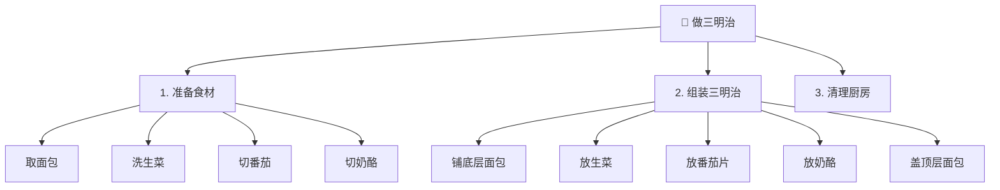
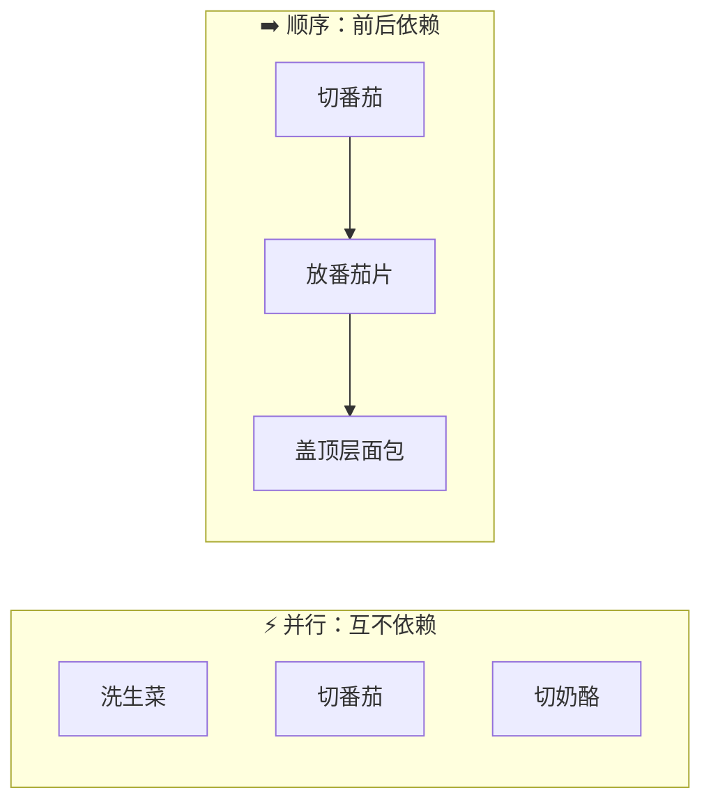
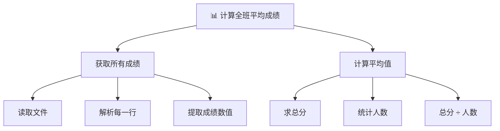
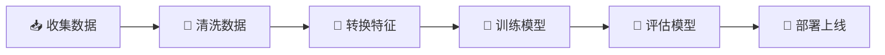

# 步骤分解

> **所属路径**：`00_高中复习/03_信息素养/04_逻辑与问题拆解/02_步骤分解`
> **预计学习时间**：30 分钟
> **难度等级**：⭐

---

## 前置知识

- [输入输出分析](../01_输入输出分析/01_输入输出分析.md) — 每个步骤都有自己的输入和输出，理解输入输出是拆解步骤的基础

> 如果以上内容还不熟悉，建议先完成对应课程再继续。

---

## 学习目标

完成本节后，你将能够：

1. 解释为什么把大问题拆成小步骤能降低解题难度
2. 使用自顶向下的方法将一个复杂任务分解为多个子任务
3. 区分顺序步骤与并行步骤，并判断步骤间的依赖关系
4. 判断一个步骤是否已经足够小（原子化 / 可直接执行）
5. 将分解思路应用到编程中，用函数组织代码

---

## 正文讲解

### 1. 为什么要"步骤分解"

有一句经典的问答："怎么吃掉一头大象？一口一口地吃。"这句话虽然是笑话，却道出了解决复杂问题的核心策略——把一个看起来庞大、无从下手的任务，拆成一系列小到可以直接动手的步骤。

在日常生活中，我们其实一直在不自觉地做这件事。比如"做一顿晚饭"，你不会愣在厨房里发呆，而是自然地想到：先决定吃什么、然后买菜、洗菜、切菜、炒菜、装盘。每一步都很明确，做完一步就做下一步。

这种把大问题拆成小问题的思维方式，在计算机科学中被称为 **分解（Decomposition）**。它是 **计算思维（Computational Thinking）** 的四大支柱之一，也是你未来学习编程和人工智能时最基础、最重要的思维能力。

> 💡 **核心洞察**：你不需要一次性想清楚整个问题的解法，只需要把它分成足够小的部分，逐个击破。

### 2. 自顶向下分解

**自顶向下分解（Top-Down Decomposition）** 是最常用的分解策略。它的思路很简单：从最终目标出发，问自己"要达到这个目标，需要先完成哪几件事？"然后对每件事再问同样的问题，直到每一步都小到可以直接执行。

我们用一个生活中的例子来体会这个过程。假设你的任务是"做一个三明治"：

**第一层分解**：做三明治 = 准备食材 + 组装三明治 + 清理厨房

**第二层分解**（以"准备食材"为例）：
- 准备食材 = 取面包 + 洗生菜 + 切番茄 + 切奶酪

**第二层分解**（以"组装三明治"为例）：
- 组装三明治 = 铺底层面包 + 放生菜 + 放番茄片 + 放奶酪 + 盖顶层面包

我们可以用一棵树状图来展示这个分解过程：



> 📌 **图解说明**：这是一棵"分解树"。根节点是最终目标，每向下一层就更具体、更可执行。叶子节点（最底层）就是可以直接动手的步骤。

注意，在分解过程中，我们其实在运用上一节学过的 **[输入输出分析](../01_输入输出分析/01_输入输出分析.md)**：每个步骤都有自己的输入和输出。例如"切番茄"的输入是一整个番茄和一把刀，输出是番茄片。上一个步骤的输出，往往就是下一个步骤的输入。

### 3. 顺序步骤与并行步骤

把任务拆成小步骤之后，一个自然的问题是：这些步骤必须一个接一个地做，还是有些可以同时进行？

**顺序步骤（Sequential Steps）** 是指必须按照固定顺序执行的步骤——前一步的输出是后一步的输入，因此不能调换顺序。比如"切番茄"必须在"放番茄片"之前。

**并行步骤（Parallel Steps）** 是指彼此独立、可以同时进行的步骤。比如"洗生菜"和"切番茄"之间没有依赖关系，如果有两个人，完全可以同时做。



> 📌 **图解说明**：左边三个步骤可以同时进行（并行），右边三个步骤必须按顺序执行。区分这两种关系有助于提高效率。

判断步骤是顺序还是并行，关键看一个问题：**步骤 B 是否需要步骤 A 的输出作为输入？** 如果是，就是顺序；如果不是，就可以并行。

这个概念在计算机领域非常重要。现代计算机之所以快，很大程度上就是因为它能同时执行许多互不依赖的任务——这就是 **并行计算（Parallel Computing）** 的基本思想。

### 4. 步骤的粒度：什么时候够小了

分解到什么程度才算够？这就涉及到 **粒度（Granularity）** 的判断。

一个实用的判断标准是：**如果一个步骤已经可以直接执行，不需要再思考"怎么做"，那它就够小了。** 我们把这样的步骤称为 **原子步骤（Atomic Step）**——就像原子是物质的基本单位，原子步骤是任务分解的基本单位。

| 粒度 | 示例 | 是否原子步骤 |
| ---- | ---- | ------------ |
| 太大 | "做晚饭" | ❌ 还需要继续分解 |
| 适中 | "把番茄切成 5mm 厚的片" | ✅ 可以直接动手 |
| 太小 | "把刀抬起 3 厘米" | ❌ 过度分解，浪费精力 |

> 💡 **判断技巧**：问自己"我能不用再想，直接动手做这一步吗？"如果能，就是原子步骤。如果你还需要问"这一步具体怎么做"，就说明还不够小，需要继续分解。

粒度的选择也取决于**执行者的能力**。对于一个厨艺新手，"切番茄"可能需要进一步分解为"把番茄放稳→从顶部开始切→每片约 5mm"；而对于一个熟练的厨师，"切番茄"本身就已经足够明确了。

在编程中也是同样的道理：对于初学者，"读取文件"可能需要分解为"打开文件→逐行读取→关闭文件"；但对于有经验的程序员，"读取文件"已经是一个原子操作了。

### 5. 实战案例：计算全班平均成绩

现在让我们用步骤分解来解决一个更接近编程的问题。

> 📋 **任务**：给你一个文本文件 `scores.txt`，每行是一个学生的名字和成绩（用逗号分隔），请计算全班的平均成绩。

如果不做任何分解，直接面对这个任务，你可能会觉得有点复杂。但是，让我们用自顶向下分解来拆解它：

**第一层**：计算平均成绩 = 获取所有成绩 + 计算平均值

**第二层**：
- 获取所有成绩 = 读取文件 + 解析每一行 + 提取成绩数值
- 计算平均值 = 求总分 + 统计人数 + 总分 ÷ 人数



> 📌 **图解说明**：把"计算全班平均成绩"这个看似复杂的任务拆成了 6 个小步骤。每个小步骤都足够简单，可以直接用几行代码实现。

注意这里的步骤顺序：必须先"读取文件"，才能"解析每一行"；必须先"提取成绩数值"，才能"求总分"和"统计人数"。但"求总分"和"统计人数"之间没有依赖，理论上可以并行。

让我们用数学语言来表达最终的计算。假设 $n$ 个学生的成绩分别为 $s_1, s_2, \ldots, s_n$ ，则平均成绩为：

$$
\bar{s} = \dfrac{s_1 + s_2 + \cdots + s_n}{n} = \dfrac{\sum_{i=1}^{n} s_i}{n}
$$

> **直觉解读**：把所有成绩加起来，再除以人数。这就是平均值的定义——虽然公式看起来简洁，但要让计算机执行它，我们就需要把"加起来"和"数人数"这些操作一步步拆开。

### 6. 分解模式：人工智能中的数据管道

步骤分解不只是初学者的技巧，它是专业工程师每天都在使用的核心方法。在人工智能领域，一个典型的分解模式叫做 **数据管道（Data Pipeline）**。

训练一个人工智能模型，听起来很复杂，但拆解开来就是这样一条管道：



> 📌 **图解说明**：人工智能工程中的数据管道。每个环节都是一个独立的步骤，有明确的输入和输出。这正是"步骤分解"在真实工程中的应用。

每个环节的输入和输出非常清晰：

| 步骤 | 输入 | 输出 |
| ---- | ---- | ---- |
| 收集数据 | 数据来源（网页、传感器、数据库） | 原始数据集 |
| 清洗数据 | 原始数据集 | 干净的数据集 |
| 转换特征 | 干净的数据集 | 特征矩阵 |
| 训练模型 | 特征矩阵 + 标签 | 训练好的模型 |
| 评估模型 | 模型 + 测试数据 | 评估报告 |
| 部署上线 | 模型 + 服务配置 | 在线服务 |

你看，即使是"训练一个人工智能模型"这样听起来很高深的任务，拆解之后每一步都变得具体而可操作。这就是步骤分解的力量。

### 7. 从分解到函数：编程中的步骤分解

在编程中，步骤分解有一个天然的对应物——**函数（Function）**。每一个分解出来的步骤，都可以写成一个函数：函数名是步骤的描述，参数是步骤的输入，返回值是步骤的输出。

这就是为什么有经验的程序员写出来的代码读起来就像在读一份计划书：

```python
# 伪代码示意
def 计算全班平均成绩(文件路径):
    原始内容 = 读取文件(文件路径)
    成绩列表 = 解析成绩(原始内容)
    平均分 = 计算平均值(成绩列表)
    return 平均分
```

主函数读起来就像任务的分解大纲，而每个子函数负责具体的实现细节。这种"先想清楚步骤，再逐个实现"的方式，正是步骤分解思维在代码中的直接体现。

---

## 动手实践

前面我们分析了"计算全班平均成绩"的分解过程，现在让我们把它变成真正可以运行的 Python 代码。注意观察代码的结构——每个函数对应一个分解出来的步骤。

```python
# 文件：code/class_average.py
# 环境要求：Python 3.10+（无需额外库）
# 用途：演示如何把"计算全班平均成绩"分解为多个函数

def read_file(file_path):
    """步骤 1：读取文件，返回所有行的列表"""
    with open(file_path, "r", encoding="utf-8") as f:
        lines = f.readlines()
    return lines


def parse_scores(lines):
    """步骤 2：解析每一行，提取成绩数值"""
    scores = []
    for line in lines:
        line = line.strip()
        if not line:
            continue
        # 每行格式："姓名,成绩"
        parts = line.split(",")
        name = parts[0].strip()
        score = float(parts[1].strip())
        scores.append(score)
        print(f"  读取到：{name} -> {score} 分")
    return scores


def compute_average(scores):
    """步骤 3：计算平均值 = 总分 / 人数"""
    total = sum(scores)
    count = len(scores)
    average = total / count
    return average


def main():
    """主函数：按分解的步骤依次调用"""
    # 为了演示，先创建一个示例数据文件
    sample_data = "小明,88\n小红,95\n小华,76\n小李,82\n小张,91\n"
    with open("scores.txt", "w", encoding="utf-8") as f:
        f.write(sample_data)

    print("=== 步骤 1：读取文件 ===")
    lines = read_file("scores.txt")
    print(f"  共读取 {len(lines)} 行\n")

    print("=== 步骤 2：解析成绩 ===")
    scores = parse_scores(lines)
    print(f"  共解析 {len(scores)} 个成绩\n")

    print("=== 步骤 3：计算平均值 ===")
    average = compute_average(scores)
    print(f"  总分 = {sum(scores)}")
    print(f"  人数 = {len(scores)}")
    print(f"  平均成绩 = {average:.1f} 分")


if __name__ == "__main__":
    main()
```

**运行说明**：
- 环境要求：Python 3.10+，无需安装额外库
- 运行命令：`python code/class_average.py`

**预期输出**：
```
=== 步骤 1：读取文件 ===
  共读取 5 行

=== 步骤 2：解析成绩 ===
  读取到：小明 -> 88.0 分
  读取到：小红 -> 95.0 分
  读取到：小华 -> 76.0 分
  读取到：小李 -> 82.0 分
  读取到：小张 -> 91.0 分
  共解析 5 个成绩

=== 步骤 3：计算平均值 ===
  总分 = 432.0
  人数 = 5
  平均成绩 = 86.4 分
```

从运行结果中可以看到，代码的执行顺序与我们之前的分解完全一致：先读取文件，再解析成绩，最后计算平均值。每个函数只负责一件事，逻辑清晰、容易调试。如果某个步骤出了问题（比如文件格式变了），你只需要修改对应的函数，不会影响其他步骤。

---

## 典型误区

| 误区 | 正确理解 |
| ---- | -------- |
| "分解就是把任务随便切几块" | 分解要有逻辑：每个子步骤应该有明确的输入和输出，步骤之间的依赖关系要清晰 |
| "分解得越细越好" | 过度分解会增加管理成本。粒度应以"可直接执行"为标准，不必拆到最小物理动作 |
| "步骤的顺序不重要" | 有依赖关系的步骤必须按顺序执行。搞错顺序会导致输入缺失或结果错误 |
| "分解只在开始时做一次" | 分解是迭代过程。做着做着发现某一步太复杂，随时可以进一步拆解 |

---

## 练习题

### 练习 1：分解日常任务（难度：⭐）

请将"整理书包准备上学"这个任务分解为 4–6 个顺序步骤，并标注哪些步骤之间是顺序关系，哪些可以并行。

<details>
<summary>💡 提示</summary>

想一想：检查课表和准备文具之间有依赖关系吗？装课本和装水壶呢？

</details>

<details>
<summary>✅ 参考答案</summary>

一种合理的分解：

1. 查看明天的课表（输入：课程表；输出：需要的科目清单）
2. 按科目清单取出课本和作业（输入：科目清单；输出：课本和作业）
3. 准备文具（铅笔、橡皮、尺子）
4. 装入书包
5. 放入水壶和纸巾

**依赖分析**：
- 步骤 1 → 步骤 2：顺序（必须先知道需要什么科目）
- 步骤 2 和步骤 3：并行（互不依赖）
- 步骤 2、3 → 步骤 4：顺序（必须先准备好才能装）
- 步骤 4 和步骤 5：并行（装课本和装水壶互不影响）

</details>

### 练习 2：判断粒度是否合适（难度：⭐）

以下步骤中，哪些粒度合适（原子步骤），哪些还需要进一步分解？

- A. "写一篇作文"
- B. "把第三段的错别字改成正确的字"
- C. "学好数学"
- D. "用计算器算出 $3.14 \times 5^2$ 的值"

<details>
<summary>💡 提示</summary>

问自己：这一步能直接动手做吗？还是需要先想想"具体怎么做"？

</details>

<details>
<summary>✅ 参考答案</summary>

- **A. "写一篇作文"**：❌ 需要分解（选题、列提纲、写初稿、修改……）
- **B. "把第三段的错别字改成正确的字"**：✅ 原子步骤，可以直接执行
- **C. "学好数学"**：❌ 需要大量分解（太宽泛，不是一个可执行的步骤）
- **D. "用计算器算出 $3.14 \times 5^2$ 的值"**：✅ 原子步骤，可以直接执行

$$\text{结果} = 3.14 \times 25 = 78.5$$

</details>

### 练习 3：分解编程任务（难度：⭐⭐）

请将以下任务分解为 4–5 个步骤，并为每个步骤写出输入和输出：

> **任务**：统计一段英文文本中每个单词出现的次数，并找出出现最多的单词。

<details>
<summary>💡 提示</summary>

回忆"计算平均成绩"的分解方式：先获取原始数据，再处理数据，最后得到结果。

</details>

<details>
<summary>✅ 参考答案</summary>

| 步骤 | 操作 | 输入 | 输出 |
| ---- | ---- | ---- | ---- |
| 1 | 读取文本 | 文本字符串 | 原始文本 |
| 2 | 拆分为单词列表 | 原始文本 | 单词列表 |
| 3 | 统一为小写 | 单词列表 | 规范化后的单词列表 |
| 4 | 统计每个单词出现次数 | 规范化后的单词列表 | 词频字典 |
| 5 | 找出出现次数最多的单词 | 词频字典 | 最高频单词及次数 |

对应的 Python 代码结构：

```python
def count_words(text):
    words = text.split()            # 步骤 2
    words = [w.lower() for w in words]  # 步骤 3
    freq = {}
    for w in words:                 # 步骤 4
        freq[w] = freq.get(w, 0) + 1
    top_word = max(freq, key=freq.get)  # 步骤 5
    return top_word, freq[top_word]
```

</details>

### 练习 4：画分解树（难度：⭐⭐）

请为以下任务画一棵分解树（可以用文字缩进表示层级）：

> **任务**：组织一次班级春游。

要求至少分解到两层，叶子节点应为原子步骤。

<details>
<summary>💡 提示</summary>

第一层可以考虑：前期准备、出行当天、活动结束后。每一项再进一步拆解。

</details>

<details>
<summary>✅ 参考答案</summary>

```
组织班级春游
├── 1. 前期准备
│   ├── 确定日期和目的地
│   ├── 统计参加人数
│   ├── 安排交通方式
│   └── 准备应急物资（药品、雨具）
├── 2. 出行当天
│   ├── 集合点名
│   ├── 乘车前往目的地
│   ├── 开展活动（游戏、拍照）
│   └── 集合返程
└── 3. 活动结束后
    ├── 整理照片
    └── 写活动总结
```

其中"确定日期和目的地""统计参加人数"等都是可以直接执行的原子步骤。

</details>

---

## 下一步学习

- 📖 下一个知识点：[边界情况](../03_边界情况/03_边界情况.md) — 学会识别任务中的特殊情况和极端条件
- 🔗 相关知识点：[输入输出分析](../01_输入输出分析/01_输入输出分析.md) — 回顾每个步骤的输入输出关系
- 🔗 相关知识点：[流程图与伪代码](../04_流程图与伪代码/) — 用图形化的方式表达分解后的步骤

---

## 参考资料

1. [Computational Thinking — BBC Bitesize](https://www.bbc.co.uk/bitesize/guides/zp92mp3/revision/1) — BBC 出品的计算思维入门教程，包含分解、模式识别、抽象等核心概念（公开教育资源）
2. [Problem Solving with Algorithms and Data Structures using Python](https://runestone.academy/ns/books/published/pythonds3/index.html) — 开源交互式教材，涵盖问题分解与算法设计基础（CC BY-NC-SA 许可）
3. [Python 官方教程 - 定义函数](https://docs.python.org/zh-cn/3/tutorial/controlflow.html#defining-functions) — 理解如何用函数实现步骤分解（官方文档）
