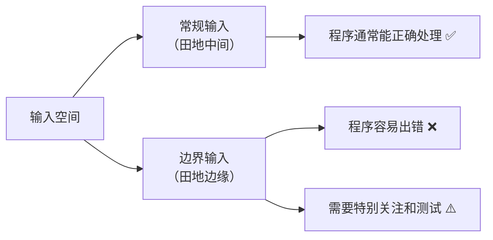
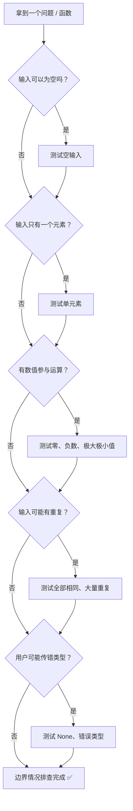
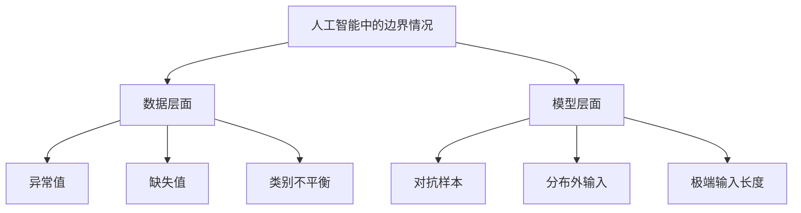

# 边界情况

> **所属路径**：`00_高中复习/03_信息素养/04_逻辑与问题拆解/03_边界情况`
> **预计学习时间**：35 分钟
> **难度等级**：⭐⭐

---

## 前置知识

- [步骤分解](../02_步骤分解/02_步骤分解.md) — 分解好步骤之后，需要考虑每个步骤可能遇到的特殊情况

> 如果以上内容还不熟悉，建议先完成对应课程再继续。

---

## 学习目标

完成本节后，你将能够：

1. 解释什么是边界情况，以及为什么它在解决问题时至关重要
2. 列举常见的边界情况类别（空输入、单元素、极端值、零与负数等）
3. 运用系统化方法主动识别和检查边界情况
4. 编写能够正确处理边界情况的简单 Python 函数，并用断言进行验证

---

## 正文讲解

### 1. 从一个"翻车"故事说起

假设你写了一个程序，功能很简单：输入一组考试成绩，计算平均分。你用自己的成绩测试了一下——85、90、78——程序输出 84.3，完美！然后你信心满满地把程序交给老师使用。

第二天老师来找你："我还没输入任何成绩，程序就崩了。"

你一脸困惑地打开代码，才发现：当成绩列表为空的时候，程序会做一次"除以 0"的运算，直接报错退出。这就是一个典型的 **边界情况（Edge Case / Boundary Case）** 没有被考虑到而导致的 bug。

> 💡 边界情况并不是什么罕见的极端场景，它往往就藏在"正常使用"的边缘——空列表、只有一个元素、数值为零……这些看似不起眼的输入，却是 bug 最爱藏身的地方。

### 2. 什么是边界情况

**边界情况（Edge Case）** 指的是在输入空间的"边界"或"极端"位置出现的特殊输入，它们虽然合法，但往往容易被程序员忽略，从而导致程序出错或产生意料之外的结果。

我们可以把输入空间想象成一块田地：

- **"田地中间"**：那些最常见、最普通的输入——就像你平时测试用的数据。
- **"田地边缘"**：那些处于极限、特殊或罕见状态的输入——就是边界情况。



> 📌 **图解说明**：常规输入位于输入空间的"舒适区"，程序处理它们通常没问题；而边界输入位于"边缘地带"，是 bug 最容易出现的地方。

为什么 bug 偏爱边界？因为程序员在设计算法时，脑中想的往往是"正常情况"。比如计算平均值时，你自然假设列表里有好几个数字——但你没有想过"如果一个数字都没有呢？"

### 3. 常见的边界情况类别

边界情况并不是随机的，它们有规律可循。下面是几类最常见的边界情况：

#### 空输入

这是最经典的边界情况。当输入为"什么都没有"时，程序还能正常运作吗？

- 空列表 `[]`
- 空字符串 `""`
- 空文件（文件存在但内容为空）

#### 单元素

只有一个元素的输入，介于"空"和"多"之间，常常暴露出循环逻辑或比较逻辑的问题。

- 列表里只有一个数字 `[42]`
- 字符串只有一个字符 `"a"`

#### 极大与极小

当数值非常大或非常小时，会不会出现溢出、精度丢失或性能问题？

- 列表包含 $10^6$ 个元素
- 数值接近 $10^{18}$ 或 $-10^{18}$

#### 零与负数

很多程序默认输入是正数，但零和负数往往打破这个假设。

- 除数为 $0$
- 负数作为数组长度
- 负数的平方根

#### 重复值

输入中有大量重复值时，排序、去重、统计等操作可能表现异常。

- 所有元素都相同 `[5, 5, 5, 5]`
- 排序时有重复元素

#### 无效或意外的输入类型

用户传入了不符合预期类型的数据。

- 本应传数字，却传了字符串
- 本应传列表，却传了 `None`

下面这张决策图可以帮助你系统地排查边界情况：



> 📌 **图解说明**：这张决策流程图提供了一个系统化的检查清单——拿到任何函数或问题，沿着这棵决策树走一遍，就能覆盖最常见的边界情况。

### 4. 系统化方法：ZOMBIE 检查法

为了更好地记住边界情况的排查思路，业界有一个广为流传的助记方法，叫做 **ZOMBIE 检查法**。每个字母对应一类需要测试的场景：

| 字母 | 含义 | 说明 |
| ---- | ---- | ---- |
| **Z** | Zero（零） | 输入为 $0$ 或结果为 $0$ 的情况 |
| **O** | One（一） | 只有一个元素或刚好一次循环 |
| **M** | Many（多） | 多个元素，检查一般情况 |
| **B** | Boundary（边界） | 输入范围的上限和下限 |
| **I** | Interface（接口） | 传入参数的类型是否正确 |
| **E** | Exceptional（异常） | 空输入、`None`、负数等异常情况 |

> 💡 想一想：你之前写过的作业或程序中，有没有因为忘记检查某个 ZOMBIE 场景而出过错？

### 5. 真实案例：除以零与空列表的平均值

让我们用具体的代码来看看边界情况是如何"搞事情"的。

**案例一：除以零**

假设你写了一个计算百分比的函数：

```python
def percentage(part, total):
    return (part / total) * 100
```

当 `total = 0` 时会怎样？Python 会抛出 `ZeroDivisionError`，程序直接崩溃。

**案例二：空列表的平均值**

```python
def average(numbers):
    return sum(numbers) / len(numbers)
```

当 `numbers = []` 时，`len(numbers)` 为 $0$ ，同样触发 `ZeroDivisionError`。

这两个案例都说明了同一件事：**如果你只用"正常"数据测试，一切看起来都很好；但边界情况一出现，程序立刻暴露问题。**

那么，如何修复呢？关键在于——在运算之前，先检查边界条件：

```python
def safe_percentage(part, total):
    if total == 0:
        return 0.0  # 或者返回 None，取决于业务需求
    return (part / total) * 100

def safe_average(numbers):
    if len(numbers) == 0:
        return 0.0  # 或者返回 None，表示"无法计算"
    return sum(numbers) / len(numbers)
```

从这个对比中可以看到，处理边界情况的核心思路就是：**在执行核心逻辑之前，先用条件判断拦截那些"会出事"的特殊输入。**

### 6. 边界情况与人工智能的关系

你可能会想：边界情况是编程的事，跟人工智能有什么关系？其实关系非常密切。

在人工智能领域，边界情况无处不在：

- **数据中的边界情况**：训练数据里可能有 **异常值（Outlier）**——比如一组身高数据中出现了 300 厘米的记录；可能有 **缺失值（Missing Value）**——某些行的"年龄"字段为空；还可能有 **类别不平衡（Class Imbalance）**——100 封邮件里 99 封是正常邮件、只有 1 封是垃圾邮件。
- **模型的边界情况**：即使模型在常规数据上表现很好，面对精心构造的 **对抗样本（Adversarial Example）** 时，模型可能会做出完全错误的判断——比如在一张熊猫图片上加上人眼不可见的噪声，模型就把它识别成了长臂猿。



> 📌 **图解说明**：人工智能中的边界情况可以从数据和模型两个层面来理解。数据层面的边界情况影响训练质量，模型层面的边界情况影响推理可靠性。

所以，学会识别和处理边界情况，不仅是编程的基本功，也是将来学习人工智能时不可或缺的思维方式。

### 7. 用断言测试边界情况

知道了边界情况的重要性，我们还需要一个办法来系统地验证：我们的程序是否真的能正确处理这些边界？

Python 中有一个简单而强大的工具叫做 **断言（Assertion）**，语法是 `assert 条件, "错误信息"`。如果条件为 `True`，什么都不会发生；如果条件为 `False`，程序会立刻报错并显示你写的错误信息。

```python
# 断言的基本语法
assert 1 + 1 == 2, "数学崩溃了！"   # 通过，什么都不会发生
assert 1 + 1 == 3, "这不对！"       # 失败，抛出 AssertionError
```

用断言来测试边界情况，就像给你的程序做一次"体检"——每个 `assert` 就是一项检查，通过了说明程序在这个边界情况下是健康的。

---

## 动手实践

下面我们来完整实践一下：先写一个有 bug 的函数，观察它在边界情况下的崩溃，然后修复它，并用断言验证修复结果。

```python
# 文件：code/edge_cases_demo.py
# 演示边界情况的识别、修复与测试
# 环境要求：Python 3.10+

# ============================================================
# 第一步：一个"看起来正确"的函数
# ============================================================

def find_max(numbers):
    """找出列表中的最大值。"""
    max_val = numbers[0]  # 假设列表非空，直接取第一个元素
    for num in numbers:
        if num > max_val:
            max_val = num
    return max_val


# 常规测试——一切正常
print("=== 常规测试 ===")
print(find_max([3, 1, 4, 1, 5, 9]))  # 输出: 9
print(find_max([10, 20, 30]))          # 输出: 30

# 边界测试——程序崩溃！
print("\n=== 边界测试 ===")
try:
    print(find_max([]))  # 空列表 → IndexError!
except IndexError as e:
    print(f"空列表崩溃了: {e}")

try:
    print(find_max(None))  # None → TypeError!
except TypeError as e:
    print(f"None 崩溃了: {e}")


# ============================================================
# 第二步：修复后的安全版本
# ============================================================

def safe_find_max(numbers):
    """找出列表中的最大值（安全版本，处理边界情况）。"""
    # 边界情况 1：输入为 None 或不是列表
    if numbers is None or not isinstance(numbers, list):
        return None

    # 边界情况 2：空列表
    if len(numbers) == 0:
        return None

    # 核心逻辑（此时可以安全地假设列表非空）
    max_val = numbers[0]
    for num in numbers:
        if num > max_val:
            max_val = num
    return max_val


# ============================================================
# 第三步：用断言系统地测试所有边界情况（ZOMBIE 检查法）
# ============================================================

print("\n=== 断言测试 ===")

# Z - Zero：包含零
assert safe_find_max([0, -1, -5]) == 0, "包含零的情况应返回 0"

# O - One：只有一个元素
assert safe_find_max([42]) == 42, "单元素应返回该元素本身"

# M - Many：多个元素（常规情况）
assert safe_find_max([3, 1, 4, 1, 5, 9]) == 9, "常规多元素应返回最大值"

# B - Boundary：边界值（全部相同、包含负数）
assert safe_find_max([7, 7, 7]) == 7, "全部相同应返回该值"
assert safe_find_max([-3, -1, -7]) == -1, "全负数应返回最大的负数"

# I - Interface：接口/类型问题
assert safe_find_max(None) is None, "传入 None 应返回 None"
assert safe_find_max("not a list") is None, "传入非列表应返回 None"

# E - Exceptional：异常情况
assert safe_find_max([]) is None, "空列表应返回 None"

print("所有断言测试通过！✅")
```

**运行说明**：
- 环境要求：Python 3.10+，无额外依赖
- 运行命令：`python code/edge_cases_demo.py`

**预期输出**：
```
=== 常规测试 ===
9
30

=== 边界测试 ===
空列表崩溃了: list index out of range
None 崩溃了: 'NoneType' object is not subscriptable

=== 断言测试 ===
所有断言测试通过！✅
```

从运行结果可以看到，原始的 `find_max` 在空列表和 `None` 输入时直接崩溃，而修复后的 `safe_find_max` 能够优雅地处理所有边界情况。断言测试则确认了每个 ZOMBIE 场景都被正确覆盖。

---

## 典型误区

| 误区 | 正确理解 |
| ---- | -------- |
| "边界情况很罕见，不用管" | 在真实使用中，边界情况的出现频率远超预期。用户会输入空值、按错键、传入意外数据——程序必须对此有准备 |
| "只要程序不崩溃就行" | 不崩溃不等于正确。比如空列表返回 $0$ 当作平均值，虽然不崩溃，但语义上是错误的——应该返回 `None` 或给出明确提示 |
| "边界情况只有空输入和零" | 边界情况的种类很多：单元素、极大极小值、重复值、类型错误等，需要用 ZOMBIE 等方法系统排查 |
| "处理完边界情况代码会变得很复杂" | 实际上，边界检查通常只需要几行 `if` 语句放在函数开头。这几行代码换来的是程序的健壮性，是最划算的"投资" |

---

## 练习题

### 练习 1：安全除法（难度：⭐）

编写一个函数 `safe_divide(a, b)`，返回 $a \div b$ 的结果。要求：
- 当 $b = 0$ 时，返回 `None` 而不是崩溃
- 当 $a$ 或 $b$ 不是数字时，返回 `None`

请写出函数并用断言测试以下边界情况：`safe_divide(10, 2)`、`safe_divide(10, 0)`、`safe_divide(0, 5)`、`safe_divide("a", 2)`。

<details>
<summary>💡 提示</summary>

使用 `isinstance(x, (int, float))` 可以检查 $x$ 是否为数字类型。先处理类型检查，再处理除以零的情况。

</details>

<details>
<summary>✅ 参考答案</summary>

```python
def safe_divide(a, b):
    if not isinstance(a, (int, float)) or not isinstance(b, (int, float)):
        return None
    if b == 0:
        return None
    return a / b

assert safe_divide(10, 2) == 5.0
assert safe_divide(10, 0) is None
assert safe_divide(0, 5) == 0.0
assert safe_divide("a", 2) is None
assert safe_divide(3, "b") is None
print("练习 1 全部通过！✅")
```

</details>

### 练习 2：列出边界情况（难度：⭐）

假设你需要编写一个函数 `count_positive(numbers)`，作用是统计列表中正数的个数。请不写代码，只列出你认为应该测试的所有边界情况（至少 5 个）。

<details>
<summary>💡 提示</summary>

按照 ZOMBIE 检查法逐项思考：零、一个元素、多个元素、边界值、接口类型、异常情况。

</details>

<details>
<summary>✅ 参考答案</summary>

应测试的边界情况：

1. **空列表** `[]` → 应返回 $0$
2. **单个正数** `[5]` → 应返回 $1$
3. **单个非正数** `[0]` 或 `[-3]` → 应返回 $0$
4. **全部为正数** `[1, 2, 3]` → 应返回 $3$
5. **全部为负数** `[-1, -2, -3]` → 应返回 $0$
6. **包含零** `[0, 1, -1]` → 应返回 $1$ （零不是正数）
7. **传入 `None`** → 应返回 $0$ 或 `None`
8. **包含非数字** `[1, "a", 3]` → 取决于设计决策

</details>

### 练习 3：修复有 bug 的函数（难度：⭐⭐）

下面的函数用于计算列表中所有数字的乘积，但它有多个边界情况没有处理。请找出问题并修复：

```python
def product(numbers):
    result = numbers[0]
    for i in range(1, len(numbers)):
        result *= numbers[i]
    return result
```

要求修复后的函数能正确处理：空列表（返回 $1$ ，因为乘法的单位元是 $1$ ）、单元素列表、`None` 输入。

<details>
<summary>💡 提示</summary>

空列表时 `numbers[0]` 会触发 `IndexError`。乘法的"空乘积"约定为 $1$ ，类似加法的"空求和"为 $0$ 。

</details>

<details>
<summary>✅ 参考答案</summary>

```python
def product(numbers):
    if numbers is None or not isinstance(numbers, list):
        return None
    if len(numbers) == 0:
        return 1  # 空乘积的数学约定
    result = numbers[0]
    for i in range(1, len(numbers)):
        result *= numbers[i]
    return result

assert product([]) == 1
assert product([5]) == 5
assert product([2, 3, 4]) == 24
assert product(None) is None
assert product([0, 5, 3]) == 0
print("练习 3 全部通过！✅")
```

关键修复：

1. 添加 `None` 和类型检查 → 防止 `TypeError`
2. 添加空列表检查并返回 $1$ → 防止 `IndexError`

</details>

### 练习 4：ZOMBIE 检查清单（难度：⭐⭐）

为以下函数编写完整的 ZOMBIE 检查测试。函数功能：接受一个整数列表，返回其中的最小值与最大值之差（即 **极差**）。

$$
\text{极差} = \max(\text{numbers}) - \min(\text{numbers})
$$

请先编写 `safe_range(numbers)` 函数，再为 ZOMBIE 的每个字母编写至少一条断言。

<details>
<summary>💡 提示</summary>

注意：当列表只有一个元素时，极差为 $0$ ；当列表为空时，极差无法计算，应返回 `None`。

</details>

<details>
<summary>✅ 参考答案</summary>

```python
def safe_range(numbers):
    if numbers is None or not isinstance(numbers, list):
        return None
    if len(numbers) == 0:
        return None
    return max(numbers) - min(numbers)

# Z - Zero
assert safe_range([0, 0, 0]) == 0

# O - One
assert safe_range([42]) == 0

# M - Many
assert safe_range([1, 5, 3, 9, 2]) == 8

# B - Boundary
assert safe_range([-10, 10]) == 20
assert safe_range([7, 7, 7, 7]) == 0

# I - Interface
assert safe_range(None) is None
assert safe_range("hello") is None

# E - Exceptional
assert safe_range([]) is None

print("练习 4 全部通过！✅")
```

</details>

---

## 下一步学习

- 📖 下一个知识点：[流程图与伪代码](../04_流程图与伪代码/04_流程图与伪代码.md) — 学完边界情况后，你将学习如何用流程图和伪代码把完整的逻辑（包括边界处理）清晰地表达出来
- 🔗 相关知识点：[输入输出分析](../01_输入输出分析/01_输入输出分析.md) — 边界情况的分析离不开对输入输出的深入理解
- 🔗 相关知识点：[步骤分解](../02_步骤分解/02_步骤分解.md) — 在分解步骤的过程中同时考虑边界情况，能让你的方案更加健壮

---

## 参考资料

1. [Python 官方文档 — 错误和异常](https://docs.python.org/zh-cn/3/tutorial/errors.html) — Python 错误处理的官方教程，帮助理解边界情况导致的异常类型（官方文档）
2. [Think Python: How to Think Like a Computer Scientist](https://greenteapress.com/thinkpython2/html/) — Allen Downey 的开源教材，第 11-12 章涉及调试与边界条件的思维方式（CC BY-NC 3.0 许可）
3. [Boundary Value Analysis — Software Testing Fundamentals](https://softwaretestingfundamentals.com/boundary-value-analysis/) — 边界值分析方法的入门介绍，从软件测试角度解释边界情况（公开教育资源）
