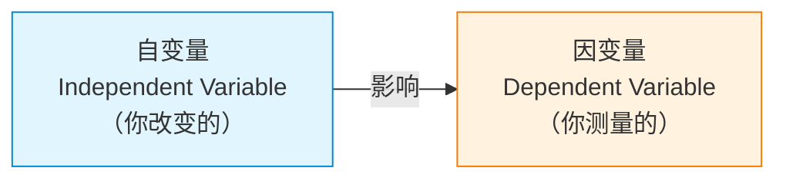
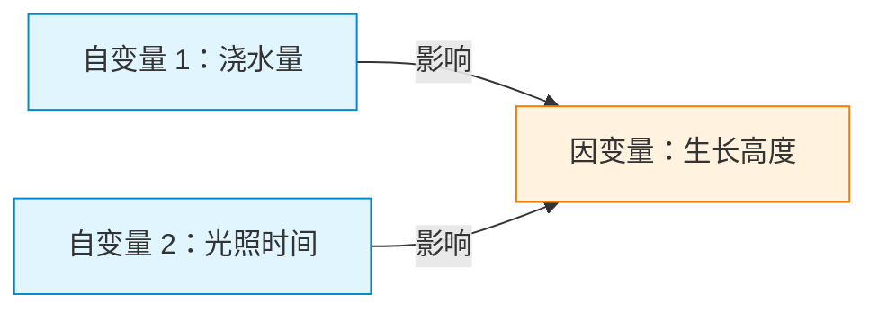

# 自变量与因变量

> **所属路径**：`00_高中复习/04_科学思维/01_变量与控制/01_自变量与因变量`
> **预计学习时间**：35 分钟
> **难度等级**：⭐

---

## 前置知识

- 基本的数学运算能力（加减乘除）
- 对"实验"有一个朴素的理解（比如知道科学课上做过实验）

> 本节是科学思维的第一课，不需要额外的前置课程。只要你有好奇心，就可以开始了。

---

## 学习目标

完成本节后，你将能够：

1. 解释什么是自变量和因变量，并说出二者的区别
2. 在给定的实验场景中准确识别自变量和因变量
3. 用 Python 模拟一个简单的自变量与因变量关系
4. 说明自变量和因变量与人工智能中"特征"和"标签"的对应关系

---

## 正文讲解

### 1. 从一个问题开始：浇水多少影响植物生长吗？

假设你养了一盆绿萝，每天精心照料。有一天你好奇：**如果我每天多浇点水，它会长得更快吗？**

为了回答这个问题，你决定做一个小实验：准备五盆一模一样的绿萝，每天分别浇 50ml、100ml、150ml、200ml 和 250ml 的水，一个月后测量每盆绿萝的生长高度。

在这个实验里，有两个关键的"角色"：

- **你主动改变的东西**：每天的浇水量（50ml、100ml、……）
- **你观察和测量的结果**：绿萝一个月后的生长高度

这两个角色，就是我们今天要认识的主角。

### 2. 正式认识：自变量与因变量

你主动改变的那个因素，在科学中叫做 **自变量（Independent Variable）** ——它是"自主"的，由你决定取什么值。在上面的例子中，浇水量就是自变量。

你观察到的、随自变量变化而变化的结果，叫做 **因变量（Dependent Variable）** ——它"依赖"自变量的变化而变化。在上面的例子中，植物的生长高度就是因变量。



> 📌 **图解说明**：自变量是"原因"，因变量是"结果"。箭头方向表示影响关系：改变自变量 → 观察因变量如何变化。

一个简单的记忆方法：**自变量 = 我主动调的旋钮，因变量 = 仪表盘上跳动的读数。**

### 3. 更多例子：练出识别的直觉

掌握概念最好的方式是多看例子。下面列出几个常见场景，你可以试着自己先判断，再看答案：

| 实验场景 | 自变量（你改变的） | 因变量（你测量的） |
| -------- | -------------------- | -------------------- |
| 不同剂量的药物对血压的影响 | 药物剂量 | 血压值 |
| 复习时间长短对考试成绩的影响 | 复习时间 | 考试成绩 |
| 不同温度对酵母发酵速度的影响 | 温度 | 发酵速度（产气量） |
| 广告投放金额对销售额的影响 | 广告金额 | 销售额 |

> 💡 **识别技巧**：在实验描述中，通常 "X 对 Y 的影响" 这个句式里，X 就是自变量，Y 就是因变量。

### 4. 不止一个自变量？

现实中的问题往往不那么简单。回到种绿萝的例子：除了浇水量，光照时间也可能影响生长高度。如果你同时想研究浇水量和光照时间这两个因素，那你就有了**两个自变量**。



> 📌 **图解说明**：多个自变量可以同时影响一个因变量。在人工智能中，这种"多因素影响一个结果"的模式极为常见。

当存在多个自变量时，事情会变得复杂——我们怎么知道是浇水量在起作用，还是光照时间在起作用，还是两者共同作用？这就是为什么我们需要学习 **[控制变量（Control Variable）](../02_控制变量/)** 的方法，这是下一节的内容。

### 5. 连接人工智能：特征与标签

你可能会问：这些和人工智能有什么关系？关系非常密切！

在机器学习中，我们用数据来"训练"模型，让模型学会从输入推断输出。其中：

- **特征（Feature）** 就是自变量——模型用来做判断的依据。比如预测房价时，房屋面积、卧室数量、所在地段都是特征。
- **标签 / 目标（Label / Target）** 就是因变量——模型要预测的结果。比如房价本身。

| 科学实验术语 | 机器学习术语 | 角色 |
| ------------ | ------------ | ---- |
| 自变量 | 特征（Feature） | 输入 / 原因 |
| 因变量 | 标签（Label） | 输出 / 结果 |

所以，当你学会识别自变量和因变量时，你其实已经在学习机器学习最基础的思维方式了：**找到"什么影响什么"**。

---

## 动手实践

理解了概念，我们来动手用 Python 模拟一下浇水量对植物生长的影响。

```python
# 文件：code/plant_growth.py
# 模拟浇水量（自变量）对植物生长高度（因变量）的影响
# 环境要求：Python 3.10+

# 自变量：每天浇水量（毫升）
water_amounts = [50, 100, 150, 200, 250]

# 模拟因变量：生长高度（厘米）
# 假设浇水量在 150ml 左右最好，过多或过少都不利
def simulate_growth(water_ml):
    """模拟植物生长高度（简化模型）"""
    # 最佳浇水量为 150ml，偏离越多生长越差
    optimal = 150
    growth = 30 - 0.002 * (water_ml - optimal) ** 2
    return round(max(growth, 0), 1)  # 生长高度不会为负

# 计算每组实验的结果
print("浇水量实验结果：")
print(f"{'浇水量(ml)':<15} {'生长高度(cm)':<15}")
print("-" * 30)
for water in water_amounts:
    height = simulate_growth(water)
    print(f"{water:<15} {height:<15}")

# 找出最佳浇水量
results = {w: simulate_growth(w) for w in water_amounts}
best_water = max(results, key=results.get)
print(f"\n结论：在测试范围内，每天浇 {best_water}ml 水时植物长得最高。")
print(f"自变量 = 浇水量，因变量 = 生长高度")
```

**运行说明**：
- 环境要求：Python 3.10+（无需额外安装库）
- 运行命令：`python code/plant_growth.py`

**预期输出**：
```
浇水量实验结果：
浇水量(ml)       生长高度(cm)
------------------------------
50              10.0
100             25.0
150             30.0
200             25.0
250             10.0

结论：在测试范围内，每天浇 150ml 水时植物长得最高。
自变量 = 浇水量，因变量 = 生长高度
```

从输出中我们可以清楚地看到：随着自变量（浇水量）从 50ml 增加到 150ml，因变量（生长高度）先增大；超过 150ml 后反而减小。这种"先升后降"的模式在真实世界中很常见——任何东西都不是越多越好。

---

## 典型误区

| 误区 | 正确理解 |
| ---- | -------- |
| "自变量就是变化的量" | 自变量是你**主动改变**的量，不是任何变化的量。因变量也在变，但它是**被动变化**的 |
| "因变量就是不重要的变量" | 恰恰相反，因变量是你最关心的结果。整个实验的目的就是看因变量怎么变 |
| "一个实验只能有一个自变量" | 可以有多个自变量，但初学时建议每次只研究一个自变量，其他保持不变（控制变量法） |
| "自变量一定是数字" | 不一定。自变量也可以是类别，比如"不同品牌的肥料"或"有无音乐背景" |

---

## 练习题

### 练习 1：识别自变量和因变量（难度：⭐）

小明想研究"不同品牌的跑鞋对 100 米跑步成绩的影响"。请回答：

1. 自变量是什么？
2. 因变量是什么？
3. 列出至少两个需要保持不变的因素。

<details>
<summary>💡 提示</summary>

想想"什么是小明主动改变的"和"什么是他要测量的结果"。

</details>

<details>
<summary>✅ 参考答案</summary>

1. 自变量：跑鞋的品牌（小明主动选择不同品牌）
2. 因变量：100 米跑步成绩（秒）
3. 需要保持不变的因素（控制变量）：
   - 跑步的人（同一个人穿不同鞋测试）
   - 跑道条件（同一条跑道）
   - 天气条件（同一天或相似天气下测试）
   - 体力状态（每次测试前充分休息）

</details>

### 练习 2：多自变量识别（难度：⭐）

某同学做实验研究"温度和湿度对面包发霉速度的影响"。请回答：

1. 有几个自变量？分别是什么？
2. 因变量是什么？
3. 如果同时改变温度和湿度，能否判断是哪个因素导致面包更快发霉？为什么？

<details>
<summary>💡 提示</summary>

关键词"和"提示了不止一个自变量。第 3 小题关乎控制变量法的核心思想。

</details>

<details>
<summary>✅ 参考答案</summary>

1. 有 2 个自变量：温度和湿度
2. 因变量：面包发霉的速度（可用"几天后开始发霉"来测量）
3. 不能。如果同时改变温度和湿度，我们无法区分到底是温度的作用还是湿度的作用，或者两者的共同作用。正确做法是每次只改变一个自变量，保持另一个不变——这就是下一节要学的 **[控制变量](../02_控制变量/)** 方法。

</details>

### 练习 3：用 Python 模拟实验（难度：⭐⭐）

请修改动手实践中的代码，模拟"复习时间对考试成绩的影响"。假设：

- 复习时间（自变量）：0、1、2、3、4、5 小时
- 考试成绩（因变量）：基础分 40 分，每多复习 1 小时增加 10 分，但最高不超过 95 分

<details>
<summary>💡 提示</summary>

使用 `min()` 函数限制最高分。公式：成绩 $= \min(40 + 10 \times \text{hours}, 95)$ 。

</details>

<details>
<summary>✅ 参考答案</summary>

```python
study_hours = [0, 1, 2, 3, 4, 5]

def simulate_score(hours):
    return min(40 + 10 * hours, 95)

print(f"{'复习时间(小时)':<18} {'考试成绩(分)':<15}")
print("-" * 33)
for h in study_hours:
    score = simulate_score(h)
    print(f"{h:<18} {score:<15}")
```

预期输出：

```
复习时间(小时)      考试成绩(分)
---------------------------------
0                  40
1                  50
2                  60
3                  70
4                  80
5                  90
```

</details>

---

## 下一步学习

- 📖 下一个知识点： **[控制变量](../02_控制变量/02_控制变量.md)** — 当有多个因素时，如何只改变一个来得出可靠结论
- 🔗 相关知识点： **[相关关系](../../03_相关与因果/01_相关关系/)** — 两个变量之间有关联不代表有因果关系
- 📚 拓展阅读：阶段 01 中的"特征工程"和"探索性数据分析"将更深入地探讨自变量（特征）的选择与分析

---

## 参考资料

1. [Khan Academy — Identifying Variables](https://www.khanacademy.org/science/biology/intro-to-biology/science-of-biology/a/experiments-and-observations) — 可汗学院关于实验中变量识别的免费教程（公开课程）
2. [Wikipedia — Dependent and Independent Variables](https://en.wikipedia.org/wiki/Dependent_and_independent_variables) — 维基百科对自变量与因变量的全面介绍（公共知识库）
3. [Python 官方教程](https://docs.python.org/zh-cn/3/tutorial/) — Python 基础语法参考（官方文档）
