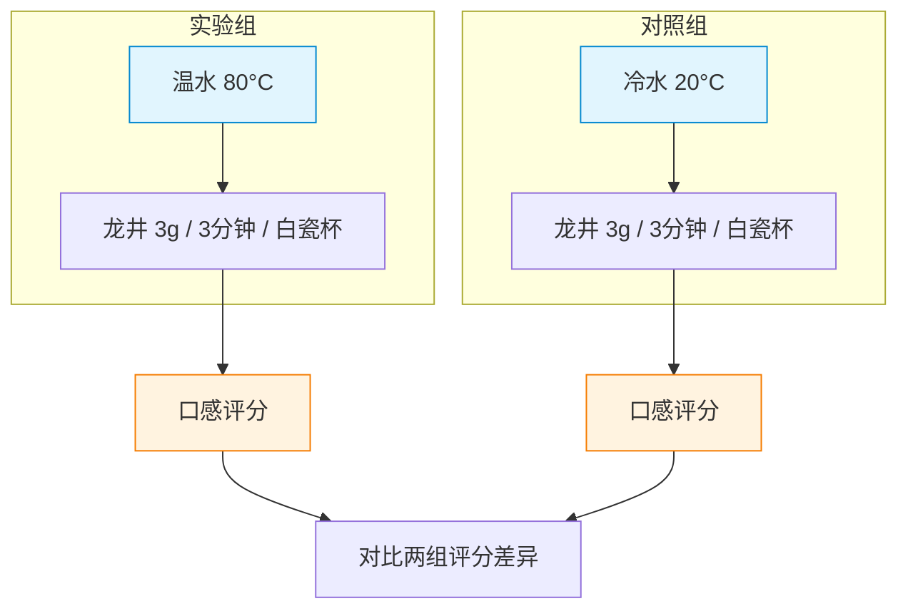

# 控制变量

> **所属路径**：`00_高中复习/04_科学思维/01_变量与控制/02_控制变量`
> **预计学习时间**：35 分钟
> **难度等级**：⭐

---

## 前置知识

- [自变量与因变量](../01_自变量与因变量/01_自变量与因变量.md) — 需要知道什么是自变量和因变量

> 如果还不清楚自变量和因变量的区别，建议先完成上一节课程。

---

## 学习目标

完成本节后，你将能够：

1. 解释什么是控制变量以及为什么需要控制变量
2. 在给定实验中识别哪些因素应该被控制
3. 用 Python 演示控制变量法的效果
4. 说明控制变量法在人工智能调参中的应用

---

## 正文讲解

### 1. 一个"不靠谱"的实验

上一节我们学会了区分自变量和因变量。现在来看一个实验：

小丽想知道"用温水还是冷水泡茶更好喝"。她用温水泡了一杯龙井，用冷水泡了一杯红茶，然后让朋友品尝。朋友说温水那杯更好喝。小丽于是得出结论：温水泡茶更好喝。

你觉得这个结论靠谱吗？

仔细想想就会发现问题：她不仅换了水温（温水 vs 冷水），还换了茶叶种类（龙井 vs 红茶）！朋友觉得温水那杯好喝，到底是因为水温的原因，还是因为龙井本身就比红茶好喝？**我们没法区分。**

这个例子揭示了一个关键问题：**如果同时改变了两个因素，你就无法判断到底是哪个因素导致了结果的变化。**

### 2. 控制变量法：一次只动一个旋钮

为了避免上面的问题，科学家发明了一种方法，叫做 **控制变量法（Controlled Variable Method）** ，核心思想非常简单：

> **每次只改变一个自变量，其他所有可能影响结果的因素都保持不变。**

那些被刻意保持不变的因素，就叫做 **控制变量（Controlled Variable）** 。

回到小丽的实验，正确的做法是：

- **自变量**：水温（温水 vs 冷水）
- **因变量**：茶的口感评分
- **控制变量**：茶叶种类（都用龙井）、茶叶量（都放 3 克）、浸泡时间（都泡 3 分钟）、杯子（都用同款白瓷杯）



> 📌 **图解说明**：两组实验中，除了水温（自变量）不同，其他条件完全一样。这样，口感评分的差异就只能归因于水温的不同。

### 3. 为什么必须控制变量？

你可能觉得"这也太小心了吧"。但请想象一下不控制变量的后果：

假设你想测试一种新肥料是否能让植物长得更高。你在花园阳光充足的角落种了施肥组，在阴暗潮湿的角落种了对照组。一个月后施肥组果然长得更高——但你能说这是肥料的功劳吗？也许只是因为阳光更充足！

这里的阳光就是一个没有被控制住的变量。它作为"隐藏因素"混入了实验，让你无法分辨到底是肥料还是阳光在起作用。这种隐藏因素有一个专门的名字—— **[干扰因素（Confounding Variable）](../03_干扰因素/)** ，我们下一节会详细讨论。

### 4. 控制变量法的步骤

把控制变量法总结成清晰的操作步骤：

1. **明确研究问题**：你想知道什么？（例如：水温是否影响茶的口感？）
2. **确定自变量**：你要改变什么？（水温）
3. **确定因变量**：你要测量什么？（口感评分）
4. **列出所有可能影响结果的因素**：茶叶种类、茶叶量、浸泡时间、杯子、品尝者……
5. **将除自变量以外的所有因素设为控制变量**：保持它们不变
6. **设计实验组和对照组**：只有自变量不同
7. **记录数据、对比结果**

### 5. 连接人工智能：调参中的控制变量

在机器学习中，训练一个模型需要设定很多 **超参数（Hyperparameter）** ——比如学习率、训练轮数、网络层数等等。如果你想知道"增大学习率会不会提高模型准确率"，你该怎么做？

答案就是控制变量法：**只改变学习率，其他超参数全部保持不变**，然后对比两次训练的结果。

| 科学实验 | 机器学习调参 |
| -------- | ------------ |
| 自变量：水温 | 自变量：学习率 |
| 因变量：口感评分 | 因变量：模型准确率 |
| 控制变量：茶叶、水量、时间 | 控制变量：训练轮数、网络结构、数据集 |

如果同时改了学习率和网络层数，模型变好了——你不知道是该归功于学习率还是网络层数。这和小丽同时换水温和茶叶种类犯的是完全一样的错误！

---

## 动手实践

让我们用 Python 模拟一下控制变量法的威力。假设植物的生长高度受两个因素影响：浇水量和光照时间。我们来对比"控制变量"和"不控制变量"两种实验方式的结果。

```python
# 文件：code/control_variable.py
# 演示控制变量法的重要性
# 环境要求：Python 3.10+

import random

random.seed(42)  # 固定随机种子，确保结果可复现

def plant_growth(water_ml, light_hours):
    """模拟植物生长高度（受浇水量和光照共同影响）"""
    # 浇水贡献（最优 150ml）
    water_effect = 30 - 0.002 * (water_ml - 150) ** 2
    # 光照贡献（每小时增加 2cm，最多 8 小时有效）
    light_effect = min(light_hours, 8) * 2
    # 加入一点随机波动
    noise = random.uniform(-1, 1)
    return round(max(water_effect + light_effect + noise, 0), 1)

# ===== 错误做法：同时改变浇水量和光照 =====
print("【错误做法】同时改变浇水量和光照：")
print(f"  A 组：水 100ml + 光照 4h → 生长 {plant_growth(100, 4)} cm")
print(f"  B 组：水 200ml + 光照 8h → 生长 {plant_growth(200, 8)} cm")
print("  → B 组更高，但无法判断是浇水还是光照的功劳！\n")

# ===== 正确做法：控制光照不变，只改变浇水量 =====
random.seed(42)  # 重置随机种子
print("【正确做法】控制光照 = 6h，只改变浇水量：")
print(f"{'浇水量(ml)':<15} {'生长高度(cm)':<15}")
print("-" * 30)
for water in [50, 100, 150, 200, 250]:
    height = plant_growth(water, 6)  # 光照固定为 6 小时
    print(f"{water:<15} {height:<15}")
print("  → 可以清楚看出浇水量对生长的影响！")
```

**运行说明**：
- 环境要求：Python 3.10+（无需额外安装库）
- 运行命令：`python code/control_variable.py`

**预期输出**：
```
【错误做法】同时改变浇水量和光照：
  A 组：水 100ml + 光照 4h → 生长 33.5 cm
  B 组：水 200ml + 光照 8h → 生长 41.0 cm
  → B 组更高，但无法判断是浇水还是光照的功劳！

【正确做法】控制光照 = 6h，只改变浇水量：
浇水量(ml)       生长高度(cm)
------------------------------
50              21.5
100             37.0
150             42.5
200             37.0
250             22.0
  → 可以清楚看出浇水量对生长的影响！
```

从"正确做法"的结果中，我们清晰地看到浇水量与生长高度之间的倒 U 型关系——150ml 左右是最佳浇水量。这个清晰的结论，正是控制变量法带来的。

---

## 典型误区

| 误区 | 正确理解 |
| ---- | -------- |
| "控制变量就是让所有变量都不变" | 不是。自变量是你刻意改变的，控制变量才是你保持不变的。总有一个量需要改变，否则就不是实验了 |
| "只要我控制了一个变量就够了" | 需要控制**所有**可能影响结果的因素，而不是仅仅控制一个 |
| "控制变量法太麻烦，差不多就行" | 不控制变量的实验得出的结论是不可靠的，可能完全错误。在 AI 调参中也一样，一次改多个超参数会让你无法定位问题 |
| "随机对照就不需要控制变量了" | 随机化是另一种处理方式，它通过随机分组来"平均化"干扰因素，但理解控制变量仍然是基础 |

---

## 练习题

### 练习 1：找出控制变量（难度：⭐）

小刚想研究"不同颜色的灯光对人阅读速度的影响"。他准备了白光和黄光两种灯。

请列出：
1. 自变量是什么？
2. 因变量是什么？
3. 至少列出 4 个需要控制的变量。

<details>
<summary>💡 提示</summary>

想想除了灯光颜色以外，还有哪些因素可能影响阅读速度？

</details>

<details>
<summary>✅ 参考答案</summary>

1. 自变量：灯光颜色（白光 vs 黄光）
2. 因变量：阅读速度（每分钟阅读字数）
3. 控制变量（至少 4 个）：
   - 灯光亮度（两种灯的亮度要相同）
   - 阅读材料（同一篇文章或难度相同的文章）
   - 阅读者（同一个人，或能力相似的人）
   - 阅读环境（同一房间、同一时间段）
   - 阅读者的疲劳程度（每次测试前休息相同时间）

</details>

### 练习 2：判断实验设计的问题（难度：⭐）

以下实验设计有什么问题？请指出并改正。

> 小华想研究"每天跑步是否能降低体重"。她让喜欢运动的同学 A 每天跑步 30 分钟，让不爱运动的同学 B 不做运动。一个月后，同学 A 体重下降了，她得出结论：跑步能降低体重。

<details>
<summary>💡 提示</summary>

注意两个同学的起始条件是否一样。"喜欢运动的"和"不爱运动的"意味着什么？

</details>

<details>
<summary>✅ 参考答案</summary>

主要问题：没有控制好变量。

- 同学 A "喜欢运动"，可能本身就有更健康的饮食习惯和更好的体质基础
- 同学 B "不爱运动"，可能饮食习惯也不同
- 两个人的初始体重、饮食、睡眠、年龄、性别等都可能不同

改正方案：
- 选择体质条件相似的两个人（或同一个人分两个阶段）
- 控制饮食（两人吃同样的食物）、睡眠时间、其他运动量等
- 只有"是否每天跑步 30 分钟"这一个因素不同

</details>

### 练习 3：Python 模拟——模型调参（难度：⭐⭐）

假设一个简单模型的"准确率"受两个超参数影响：学习率 $lr$ 和训练轮数 $epochs$ 。准确率公式为：

$$
\text{accuracy} = 100 - 50 \times |lr - 0.01| \times 100 - \dfrac{200}{\text{epochs}}
$$

请编写 Python 代码：
1. 固定 $epochs = 100$ ，测试 $lr$ 在 $[0.001, 0.005, 0.01, 0.02, 0.05]$ 时的准确率
2. 找出最佳学习率

<details>
<summary>💡 提示</summary>

这就是控制变量法在 AI 调参中的应用：固定一个超参数，调另一个。

</details>

<details>
<summary>✅ 参考答案</summary>

```python
def accuracy(lr, epochs):
    return round(100 - 50 * abs(lr - 0.01) * 100 - 200 / epochs, 1)

epochs = 100  # 控制变量：固定训练轮数
learning_rates = [0.001, 0.005, 0.01, 0.02, 0.05]

print(f"固定 epochs = {epochs}，测试不同学习率：")
print(f"{'学习率':<12} {'准确率(%)':<12}")
print("-" * 24)

best_lr, best_acc = None, -999
for lr in learning_rates:
    acc = accuracy(lr, epochs)
    print(f"{lr:<12} {acc:<12}")
    if acc > best_acc:
        best_lr, best_acc = lr, acc

print(f"\n最佳学习率：{best_lr}，准确率：{best_acc}%")
```

</details>

---

## 下一步学习

- 📖 下一个知识点： **[干扰因素](../03_干扰因素/03_干扰因素.md)** — 那些即使你很小心也可能被忽略的"隐藏变量"
- 🔗 相关知识点： **[自变量与因变量](../01_自变量与因变量/01_自变量与因变量.md)** — 回顾变量分类的基础
- 📚 拓展阅读：阶段 01 中的"实验设计"将更系统地介绍训练集/验证集/测试集划分——这是控制变量法在 AI 中的直接应用

---

## 参考资料

1. [Khan Academy — Controlled Experiments](https://www.khanacademy.org/science/biology/intro-to-biology/science-of-biology/a/experiments-and-observations) — 可汗学院关于控制实验的免费教程（公开课程）
2. [Wikipedia — Scientific Control](https://en.wikipedia.org/wiki/Scientific_control) — 维基百科对科学对照实验的全面介绍（公共知识库）
3. [Scikit-learn — Tuning Hyperparameters](https://scikit-learn.org/stable/modules/grid_search.html) — scikit-learn 超参数搜索文档，控制变量法在 AI 中的实践（官方文档）
