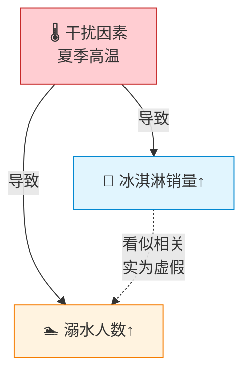

# 干扰因素

> **所属路径**：`00_高中复习/04_科学思维/01_变量与控制/03_干扰因素`
> **预计学习时间**：40 分钟
> **难度等级**：⭐⭐

---

## 前置知识

- [自变量与因变量](../01_自变量与因变量/01_自变量与因变量.md) — 需要知道什么是自变量和因变量
- [控制变量](../02_控制变量/02_控制变量.md) — 需要知道为什么要保持其他条件不变

> 如果还不清楚控制变量法，建议先完成前两节课程。

---

## 学习目标

完成本节后，你将能够：

1. 解释什么是干扰因素（混杂变量），以及它如何导致错误结论
2. 识别常见场景中的干扰因素
3. 用 Python 模拟干扰因素如何歪曲数据分析的结果
4. 说明干扰因素与人工智能中数据泄漏、虚假相关性的联系

---

## 正文讲解

### 1. 冰淇淋导致溺水？——一个反直觉的发现

有一组真实的统计数据发现：**冰淇淋销售量越高的月份，溺水死亡人数也越多**。如果只看数据，你可能会得出一个荒唐的结论——"吃冰淇淋导致溺水"。

但稍微想想就知道这不对。真正的原因是什么？是 **夏天** ！

- 夏天天气热 → 人们买更多冰淇淋 → 冰淇淋销量上升
- 夏天天气热 → 人们更多去游泳 → 溺水风险增加

"夏天/高温"这个因素同时影响了冰淇淋销量和溺水人数，制造了一种"冰淇淋和溺水有关"的假象。这个隐藏在背后、同时影响自变量和因变量的第三方因素，就叫做 **干扰因素（Confounding Variable）** ，也叫 **混杂变量** 。



> 📌 **图解说明**：干扰因素（红色）同时影响两个变量，制造了虚假的关联（虚线箭头）。虚线表示这种关联不是因果关系，而是被干扰因素"制造"出来的。

### 2. 干扰因素的正式定义

**干扰因素（Confounding Variable）** 是指一个同时与自变量和因变量都相关的第三方变量，它能让我们误以为自变量和因变量之间存在因果关系，而实际上这种关系可能是部分甚至完全虚假的。

干扰因素的三个特征：

1. **与自变量相关**——它和你研究的"原因"有关联
2. **与因变量相关**——它也和你观察的"结果"有关联
3. **不是因果链上的中间环节**——它不是自变量导致因变量过程中的一个步骤

> 💡 **一句话总结**：干扰因素是那个"藏在幕后、同时牵着两根线"的家伙。

### 3. 更多真实世界的例子

干扰因素无处不在。来看几个经典案例：

**案例 1：鞋码与阅读能力**

统计发现：鞋码越大的孩子，阅读能力越强。难道大脚有助于阅读？当然不是——干扰因素是 **年龄** 。年龄越大，脚越大，阅读能力也越强。

**案例 2：消防员人数与火灾损失**

数据显示：出动消防员人数越多的火灾，财产损失越大。难道消防员越多损失越大？干扰因素是 **火灾规模** 。大火需要更多消防员，大火也导致更多损失。

**案例 3：咖啡与心脏病**

早期研究发现喝咖啡与心脏病有关联。但后续研究发现干扰因素是 **吸烟** ——当时喝咖啡的人中吸烟者比例更高，而吸烟才是心脏病的真正风险因素。

| 表面关联 | 干扰因素 | 真实解释 |
| -------- | -------- | -------- |
| 冰淇淋销量 ↔ 溺水人数 | 夏季高温 | 高温同时导致两者增加 |
| 鞋码 ↔ 阅读能力 | 年龄 | 年龄增长同时导致脚变大和阅读能力提升 |
| 消防员人数 ↔ 火灾损失 | 火灾规模 | 大火需要更多消防员，也造成更多损失 |
| 喝咖啡 ↔ 心脏病 | 吸烟 | 咖啡消费者中吸烟比例更高 |

### 4. 如何识别和应对干扰因素？

识别干扰因素需要的不是高深的数学，而是 **批判性思维** ——看到两个东西"有关系"时，先别急着下结论，问自己一个关键问题：

> **"有没有第三个因素，同时影响了这两个变量？"**

应对干扰因素的常见方法：

1. **控制变量法**：在实验中直接控制干扰因素（让它保持不变）。这是上一节学过的方法。
2. **随机化**：把实验对象随机分组，让干扰因素在各组中"平均分布"。
3. **分层分析**：按干扰因素分组后分别分析，比如分别看夏天和冬天的数据。
4. **统计调整**：在数据分析时用数学方法"剔除"干扰因素的影响。

### 5. 连接人工智能：虚假特征与数据泄漏

在人工智能中，干扰因素的问题以更隐蔽的形式出现：

**虚假特征（Spurious Feature）** ：模型可能学到了与结果"表面相关"但没有因果关系的特征。比如，一个图像分类模型发现"有蓝天背景的照片大多是飞机"，于是学会了用"蓝天"来判断——但蓝天不是飞机的本质特征，当你给它一张蓝天下的鸟的照片，它就会犯错。

**数据泄漏（Data Leakage）** ：训练数据中混入了"未来信息"或"不应该知道的信息"，导致模型在训练时看起来表现很好，实际部署时却不行。这本质上也是一种干扰因素——不合理的信息干扰了模型真正该学的东西。

| 科学实验中的干扰 | AI 中的对应问题 |
| ---------------- | --------------- |
| 温度同时影响冰淇淋和溺水 | 背景颜色同时与飞机和蓝天关联 |
| 没控制好的混杂变量 | 训练数据中的虚假特征 |
| 实验设计不严谨 | 数据泄漏导致模型"作弊" |

---

## 动手实践

让我们用 Python 模拟干扰因素如何制造虚假关联。我们会生成一批"学生数据"，其中干扰因素"年龄"同时影响"身高"和"数学成绩"。

```python
# 文件：code/confounding.py
# 演示干扰因素如何制造虚假关联
# 环境要求：Python 3.10+

import random

random.seed(42)

# 模拟 20 名学生的数据
students = []
for _ in range(20):
    # 干扰因素：年龄（10-18岁）
    age = random.randint(10, 18)
    # 身高受年龄影响（年龄越大越高）
    height = 100 + age * 5 + random.uniform(-3, 3)
    # 数学成绩也受年龄影响（年龄越大学得越多）
    math_score = 30 + age * 4 + random.uniform(-5, 5)
    students.append({
        "age": age,
        "height": round(height, 1),
        "math_score": round(math_score, 1)
    })

# 计算身高与数学成绩的相关性（忽略年龄）
heights = [s["height"] for s in students]
scores = [s["math_score"] for s in students]

# 简单计算相关系数（皮尔逊相关）
n = len(heights)
mean_h = sum(heights) / n
mean_s = sum(scores) / n
cov = sum((h - mean_h) * (s - mean_s) for h, s in zip(heights, scores)) / n
std_h = (sum((h - mean_h) ** 2 for h in heights) / n) ** 0.5
std_s = (sum((s - mean_s) ** 2 for s in scores) / n) ** 0.5
correlation = round(cov / (std_h * std_s), 3)

print("=== 虚假关联演示：身高 vs 数学成绩 ===\n")
print(f"{'年龄':<6} {'身高(cm)':<12} {'数学成绩':<10}")
print("-" * 28)
for s in sorted(students, key=lambda x: x["age"])[:8]:  # 显示前8名
    print(f"{s['age']:<6} {s['height']:<12} {s['math_score']:<10}")
print("... (共 20 条数据)\n")

print(f"身高与数学成绩的相关系数：{correlation}")
print(f"→ 相关系数接近 1，说明身高和数学成绩高度正相关！")
print(f"\n但是，这不代表'长得高数学就好'！")
print(f"干扰因素是【年龄】：年龄越大 → 身高越高，年龄越大 → 学得越多")
print(f"如果只看同年龄的学生，身高和数学成绩之间几乎没有关系。")
```

**运行说明**：
- 环境要求：Python 3.10+（无需额外安装库）
- 运行命令：`python code/confounding.py`

**预期输出**：
```
=== 虚假关联演示：身高 vs 数学成绩 ===

年龄    身高(cm)      数学成绩
----------------------------
10     152.5        71.2
11     153.9        73.8
11     156.7        76.5
12     161.8        80.3
13     163.2        81.9
14     172.4        87.1
15     174.1        92.5
15     177.3        91.8
... (共 20 条数据)

身高与数学成绩的相关系数：0.952
→ 相关系数接近 1，说明身高和数学成绩高度正相关！

但是，这不代表'长得高数学就好'！
干扰因素是【年龄】：年龄越大 → 身高越高，年龄越大 → 学得越多
如果只看同年龄的学生，身高和数学成绩之间几乎没有关系。
```

代码结果清楚地展示了干扰因素的魔力：虽然身高和数学成绩的相关系数高达 0.95（非常强的正相关），但这完全是年龄这个干扰因素造成的假象。如果我们能 **[控制](../02_控制变量/02_控制变量.md)** 住年龄（只看同龄学生），身高和成绩之间的关联就会消失。

---

## 典型误区

| 误区 | 正确理解 |
| ---- | -------- |
| "两个变量相关就一定有因果关系" | 相关可能是干扰因素制造的假象。相关不等于因果，这是统计学最重要的原则之一 |
| "干扰因素就是噪声/随机误差" | 干扰因素是 **系统性** 的偏差，不是随机波动。它有明确的方向和影响模式 |
| "大数据时代不需要担心干扰因素" | 数据量再大，如果存在系统性的干扰因素，错误结论只会被"更自信"地得出 |
| "只要变量多，模型自己会处理干扰因素" | 模型不会自动区分因果和相关。如果训练数据中存在虚假关联，模型会学到这些虚假模式 |

---

## 练习题

### 练习 1：识别干扰因素（难度：⭐）

研究发现："拥有游泳池的家庭，孩子的学业成绩更好。"

请问：
1. 这里的干扰因素可能是什么？
2. 真实的因果链是怎样的？

<details>
<summary>💡 提示</summary>

什么样的家庭更可能有游泳池？这个因素是否也会影响孩子的学业？

</details>

<details>
<summary>✅ 参考答案</summary>

1. 干扰因素：**家庭经济条件/收入水平**
2. 真实因果链：
   - 家庭收入高 → 买得起带游泳池的房子 → "有游泳池"
   - 家庭收入高 → 能提供更好的教育资源（辅导班、书籍、学习环境） → "学业成绩更好"

游泳池本身不会让孩子成绩变好，是家庭经济条件这个干扰因素同时影响了两者。

</details>

### 练习 2：虚假特征分析（难度：⭐⭐）

一个 AI 模型用来判断照片中的动物是"狼"还是"哈士奇"。训练数据中，狼的照片背景大多是雪地，哈士奇的照片背景大多是草地/室内。

1. 模型可能学到了什么"虚假特征"？
2. 干扰因素是什么？
3. 如何改善这个问题？

<details>
<summary>💡 提示</summary>

模型可能不看动物本身的特征，而是看什么？

</details>

<details>
<summary>✅ 参考答案</summary>

1. 模型可能学到了"有雪地背景 = 狼，无雪地背景 = 哈士奇"这个虚假特征。
2. 干扰因素是 **拍摄环境/背景** ——狼通常在野外被拍摄（雪地背景多），哈士奇通常在家中或城市被拍摄（室内/草地背景多）。背景与动物类别相关，但不是区分两者的真正特征。
3. 改善方法：
   - 让训练数据中狼和哈士奇都包含各种背景（数据多样化）
   - 使用数据增强，随机替换背景
   - 使用注意力机制引导模型关注动物本身而非背景

这是 AI 领域一个经典的干扰因素案例（来自 Ribeiro 等人 2016 年的研究）。

</details>

### 练习 3：用分层分析消除干扰（难度：⭐⭐）

在动手实践的代码基础上，请添加代码：只看 14 岁学生的数据，计算这些同龄学生中身高和数学成绩的相关系数。相关性是否还那么强？

<details>
<summary>💡 提示</summary>

用列表推导式筛选 `age == 14` 的学生，然后用同样的方法计算相关系数。由于同龄人的身高差异主要来自个体差异而非年龄，相关性应该会大幅下降。

</details>

<details>
<summary>✅ 参考答案</summary>

```python
import random
random.seed(42)

# 生成更多数据以确保每个年龄段有足够样本
students = []
for _ in range(200):
    age = random.randint(10, 18)
    height = 100 + age * 5 + random.uniform(-3, 3)
    math_score = 30 + age * 4 + random.uniform(-5, 5)
    students.append({"age": age, "height": round(height, 1),
                     "math_score": round(math_score, 1)})

# 只看 14 岁学生
age_14 = [s for s in students if s["age"] == 14]
h = [s["height"] for s in age_14]
m = [s["math_score"] for s in age_14]

n = len(h)
mean_h = sum(h) / n
mean_m = sum(m) / n
cov = sum((a - mean_h) * (b - mean_m) for a, b in zip(h, m)) / n
std_h = (sum((a - mean_h) ** 2 for a in h) / n) ** 0.5
std_m = (sum((b - mean_m) ** 2 for b in m) / n) ** 0.5
corr = round(cov / (std_h * std_m), 3) if std_h > 0 and std_m > 0 else 0

print(f"14 岁学生共 {n} 人")
print(f"身高与数学成绩相关系数：{corr}")
print("→ 控制年龄后，相关性大幅下降！")
```

控制了年龄这个干扰因素后，身高和数学成绩的相关系数会接近 0，证明之前的高相关性确实是干扰因素造成的假象。

</details>

---

## 下一步学习

- 📖 下一个知识点： **[实验设计入门](../04_实验设计入门/04_实验设计入门.md)** — 学会如何从头设计一个有效的实验，系统性地排除干扰因素
- 🔗 相关知识点： **[相关与因果](../../03_相关与因果/)** — 更深入地理解"相关不等于因果"
- 🔗 相关知识点： **[伪相关案例](../../03_相关与因果/03_伪相关案例/)** — 更多虚假相关的经典案例
- 📚 拓展阅读：阶段 01 中的"数据泄漏"和"特征工程"将更系统地讨论如何在 AI 实践中处理干扰因素

---

## 参考资料

1. [Wikipedia — Confounding](https://en.wikipedia.org/wiki/Confounding) — 维基百科对混杂变量的全面介绍（公共知识库）
2. [Spurious Correlations](https://www.tylervigen.com/spurious-correlations) — Tyler Vigen 的虚假相关性可视化网站，展示大量有趣的伪相关案例（公开网站）
3. [Khan Academy — Correlation and Causality](https://www.khanacademy.org/math/probability/scatterplots-a1/creating-interpreting-scatterplots/v/correlation-and-causality) — 可汗学院关于相关与因果的免费视频（公开课程）
