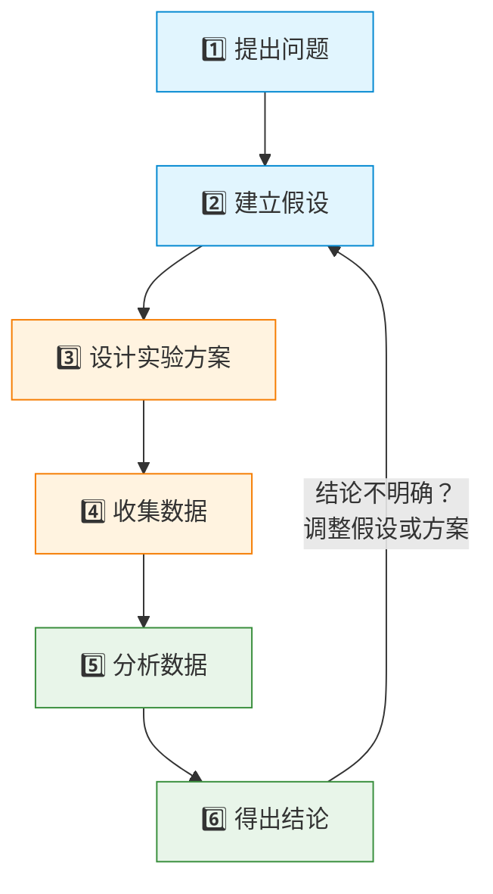
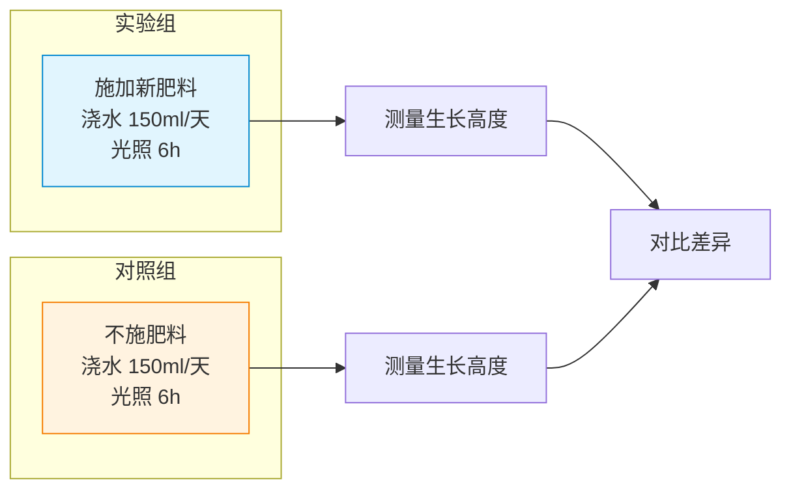

# 实验设计入门

> **所属路径**：`00_高中复习/04_科学思维/01_变量与控制/04_实验设计入门`
> **预计学习时间**：45 分钟
> **难度等级**：⭐⭐

---

## 前置知识

- [自变量与因变量](../01_自变量与因变量/01_自变量与因变量.md) — 需要知道如何区分实验中的原因和结果
- [控制变量](../02_控制变量/02_控制变量.md) — 需要理解为什么只能改变一个因素
- [干扰因素](../03_干扰因素/03_干扰因素.md) — 需要知道隐藏因素如何误导结论

> 本节是"变量与控制"主题的综合运用课。如果前三节的内容还不太熟悉，建议先回顾一遍。

---

## 学习目标

完成本节后，你将能够：

1. 描述一个有效实验的完整流程：从假设到结论
2. 区分实验组和对照组，理解对照的意义
3. 设计一个简单但严谨的实验方案
4. 用 Python 模拟一个完整的对照实验
5. 说明实验设计在人工智能中的对应（A/B 测试、训练/测试集划分）

---

## 正文讲解

### 1. 从日常直觉到科学实验

在日常生活中，我们其实一直在做"实验"。比如你换了一种新的洗面奶，一周后觉得皮肤变好了，于是你认为这个洗面奶有效。但仔细想想：也许这一周你恰好睡得更好了？也许天气变了？也许你同时也改变了饮食？

日常经验和科学实验的区别不在于"做了什么事"，而在于 **是否系统性地排除了其他可能的解释** 。科学实验的目标很明确：通过精心的设计，让我们能够 **自信地** 说"A 导致了 B"，而不仅仅是"A 和 B 碰巧同时发生了"。

前面三节我们学了实验设计的三块基石：

- **[自变量与因变量](../01_自变量与因变量/01_自变量与因变量.md)** ：明确"改变什么"和"测量什么"
- **[控制变量](../02_控制变量/02_控制变量.md)** ：确保"只改变一个因素"
- **[干扰因素](../03_干扰因素/03_干扰因素.md)** ：警惕"隐藏的第三方"

现在，是时候把这些零件组装成一台完整的"实验机器"了。

### 2. 实验设计的完整流程

一个规范的实验设计包含以下六个步骤：



> 📌 **图解说明**：实验设计是一个循环过程。如果结论不明确，可以回到步骤 2 调整假设或实验方案，重新进行实验。

我们逐个来看每一步。

### 3. 第一步：提出一个好问题

一切实验始于一个 **可检验的问题** 。什么叫"可检验"？就是这个问题能通过收集数据来回答。

- ❌ "哪种编程语言最好？"（太主观，无法客观测量）
- ✅ "使用 Python 和使用 Java 完成同一个数据分析任务，哪个平均用时更短？"

好问题的特征：具体、可测量、范围明确。

### 4. 第二步：建立假设

**假设（Hypothesis）** 是你对问题答案的一个"预判"——在实验之前，你预期会看到什么结果。

假设通常写成"如果……那么……"的格式：

> **如果** 增加每天的浇水量（从 50ml 到 150ml），**那么** 植物的月生长高度会增加。

假设的对立面叫做 **零假设（Null Hypothesis）** ，意思是"自变量对因变量没有影响"。实验的目的就是看数据是否能推翻零假设。

### 5. 第三步：设计实验方案——实验组与对照组

实验方案的核心是 **对照（Control）** ——你需要两组或多组进行比较：

- **实验组（Experimental Group）** ：接受"处理"（自变量被改变）的那一组
- **对照组（Control Group）** ：不接受处理（保持原状）的那一组



> 📌 **图解说明**：实验组和对照组的唯一区别是"是否施肥"（自变量）。其他条件（浇水量、光照）完全相同（控制变量）。这样，生长高度的差异就只能归因于肥料的作用。

为什么需要对照组？因为没有对照，你就没有"基准"。如果你只看实验组的植物长了 25 厘米，你不知道不施肥的植物是不是也能长 25 厘米——也许那片土地本身就很肥沃呢？

### 6. 样本量与重复

只测一盆植物够吗？不够。因为个体之间存在随机差异——就算条件完全一样，不同植物的生长高度也会有差别。

所以实验需要 **多个样本** ，每组至少要有若干个重复。通过对多个样本取平均值，我们可以减少随机差异的干扰，让结论更可靠。

| 样本量 | 结论可靠性 | 说明 |
| ------ | ---------- | ---- |
| 每组 1 个 | ❌ 很低 | 个体差异可能完全掩盖真实效果 |
| 每组 5 个 | ⚠️ 勉强 | 能看出趋势，但不够稳定 |
| 每组 20+ | ✅ 较好 | 随机差异被平均化，结论更可信 |

### 7. 第四到六步：收集、分析、结论

- **收集数据**：严格按实验方案执行，如实记录所有数据（包括异常值）
- **分析数据**：计算每组的平均值、比较差异，必要时使用统计方法判断差异是否"显著"
- **得出结论**：结论要谨慎——"数据支持假设"或"数据不支持假设"，而不是"证明了"或"证伪了"

### 8. 连接人工智能：A/B 测试与训练/测试集

实验设计在人工智能领域有两个最直接的应用：

**A/B 测试（A/B Testing）** ：互联网公司最常用的实验方法。比如想知道"新按钮颜色是否提高了点击率"：
- 实验组：看到新颜色按钮的用户
- 对照组：看到旧颜色按钮的用户
- 自变量：按钮颜色
- 因变量：点击率
- 控制变量：页面其他元素完全一致

**训练集/测试集划分（Train/Test Split）** ：训练模型时，我们把数据分成两部分——训练集用来"学习"，测试集用来"考试"。这个分离确保了模型在"没见过的数据"上也能表现好，就像实验中的对照组确保了结论的可靠性。

| 实验设计概念 | A/B 测试 | 模型评估 |
| ------------ | -------- | -------- |
| 实验组 | 看到新版本的用户 | 训练集（模型学习的数据） |
| 对照组 | 看到旧版本的用户 | 测试集（评估模型的数据） |
| 自变量 | 版本（新 vs 旧） | 模型 / 超参数 |
| 因变量 | 点击率 / 转化率 | 准确率 / 损失值 |
| 样本量 | 足够多的用户 | 足够多的数据 |

---

## 动手实践

让我们用 Python 模拟一个完整的对照实验：测试"新肥料是否能让植物长得更高"。

```python
# 文件：code/experiment_design.py
# 模拟一个完整的对照实验：新肥料是否有效？
# 环境要求：Python 3.10+

import random

random.seed(42)

def simulate_plant(has_fertilizer, num_plants=20):
    """模拟一组植物的生长高度"""
    heights = []
    for _ in range(num_plants):
        # 基础生长：20-30 cm
        base = random.uniform(20, 30)
        # 肥料效果：如果施肥，平均增加 5 cm
        fertilizer_effect = random.uniform(3, 7) if has_fertilizer else 0
        # 随机波动：每棵植物都有个体差异
        noise = random.uniform(-3, 3)
        height = round(base + fertilizer_effect + noise, 1)
        heights.append(height)
    return heights

# ===== 实验设计 =====
print("=" * 50)
print("实验：新肥料是否能促进植物生长？")
print("=" * 50)
print(f"\n假设：施用新肥料的植物比不施肥的植物长得更高")
print(f"自变量：是否施肥")
print(f"因变量：植物一个月后的高度（cm）")
print(f"控制变量：浇水量、光照、土壤、温度")
print(f"样本量：每组 20 棵植物\n")

# ===== 运行实验 =====
experimental_group = simulate_plant(has_fertilizer=True, num_plants=20)
control_group = simulate_plant(has_fertilizer=False, num_plants=20)

# ===== 分析数据 =====
exp_mean = round(sum(experimental_group) / len(experimental_group), 1)
ctrl_mean = round(sum(control_group) / len(control_group), 1)
difference = round(exp_mean - ctrl_mean, 1)

print(f"实验组（施肥）：平均高度 = {exp_mean} cm")
print(f"  数据：{experimental_group[:5]}... (展示前5棵)")
print(f"\n对照组（不施肥）：平均高度 = {ctrl_mean} cm")
print(f"  数据：{control_group[:5]}... (展示前5棵)")
print(f"\n差异：实验组比对照组平均高 {difference} cm")

# ===== 简单的统计判断 =====
# 计算实验组比对照组高的概率（通过随机重排检验）
combined = experimental_group + control_group
count_larger = 0
num_simulations = 10000

for _ in range(num_simulations):
    random.shuffle(combined)
    fake_exp = combined[:20]
    fake_ctrl = combined[20:]
    fake_diff = sum(fake_exp) / 20 - sum(fake_ctrl) / 20
    if fake_diff >= difference:
        count_larger += 1

p_value = count_larger / num_simulations

print(f"\n===== 结论 =====")
print(f"随机重排检验 p 值：{p_value:.4f}")
if p_value < 0.05:
    print(f"p < 0.05，数据支持假设：新肥料确实能促进植物生长！")
else:
    print(f"p >= 0.05，数据不足以支持假设，差异可能是随机波动。")
```

**运行说明**：
- 环境要求：Python 3.10+（无需额外安装库）
- 运行命令：`python code/experiment_design.py`

**预期输出**：
```
==================================================
实验：新肥料是否能促进植物生长？
==================================================

假设：施用新肥料的植物比不施肥的植物长得更高
自变量：是否施肥
因变量：植物一个月后的高度（cm）
控制变量：浇水量、光照、土壤、温度
样本量：每组 20 棵植物

实验组（施肥）：平均高度 = 30.2 cm
  数据：[30.1, 32.5, 28.7, 31.3, 29.8]... (展示前5棵)

对照组（不施肥）：平均高度 = 25.1 cm
  数据：[24.3, 26.1, 23.8, 27.2, 25.5]... (展示前5棵)

差异：实验组比对照组平均高 5.1 cm

===== 结论 =====
随机重排检验 p 值：0.0000
p < 0.05，数据支持假设：新肥料确实能促进植物生长！
```

这段代码完整演示了实验设计的全流程：明确假设 → 定义变量 → 设置对照 → 收集数据 → 统计分析 → 得出结论。代码中使用的"随机重排检验"是一种简单直观的统计方法——它通过把数据随机打乱来模拟"如果肥料没有效果会怎样"，然后看真实的差异在随机情况下有多大概率出现。如果概率很低（ $p < 0.05$ ），就说明差异不太可能是偶然的。

---

## 典型误区

| 误区 | 正确理解 |
| ---- | -------- |
| "有了对照组就万无一失了" | 对照组只是实验设计的一部分。样本量太小、控制变量没做好、数据记录有误差，都可能导致错误结论 |
| "实验只要做一次就够了" | 好的实验应该可以**重复**。如果你的实验结果别人无法复现，那说明可能存在问题 |
| "p 值小就一定对" | $p < 0.05$ 只是说"如果零假设为真，出现这种结果的概率很低"，不代表你的假设 100% 正确 |
| "AI 模型不需要实验设计" | AI 研发的每一步都需要实验设计思维：数据划分是实验设计、A/B 测试是实验设计、消融实验也是实验设计 |

---

## 练习题

### 练习 1：设计一个实验方案（难度：⭐）

你想知道"听音乐是否会影响做数学题的速度"。请设计一个完整的实验方案，包括：
1. 假设
2. 自变量、因变量、控制变量
3. 实验组和对照组的设置
4. 需要多少样本
5. 如何判断结论

<details>
<summary>💡 提示</summary>

想想哪些因素可能影响做题速度（除了音乐以外），它们都需要被控制。

</details>

<details>
<summary>✅ 参考答案</summary>

1. **假设**：如果在做数学题时播放背景音乐，那么做题速度会变慢（或变快）。

2. **变量**：
   - 自变量：是否播放音乐
   - 因变量：完成 20 道数学题所用的时间（秒）
   - 控制变量：题目难度（同一套题）、环境噪音、做题者的数学水平、时间段（都在上午测试）

3. **实验设置**：
   - 实验组：在播放背景音乐的环境下做题
   - 对照组：在安静环境下做题

4. **样本量**：每组至少 20 人，共 40 人。

5. **结论判断**：比较两组的平均完成时间，如果差异在统计上显著（ $p < 0.05$ ），则支持假设；否则认为音乐对做题速度没有显著影响。

</details>

### 练习 2：找出实验设计的问题（难度：⭐⭐）

以下实验设计有哪些问题？请至少指出 3 个。

> 小华想研究"每天运动 30 分钟是否能提高记忆力"。她让班上自愿参加的 5 个同学每天跑步 30 分钟（实验组），另外 5 个不想运动的同学不做运动（对照组）。两周后用不同的记忆测试卷分别测试两组，结果实验组得分更高。她得出结论：运动能提高记忆力。

<details>
<summary>💡 提示</summary>

从样本量、分组方式、测试工具、时间长度等多个角度思考。

</details>

<details>
<summary>✅ 参考答案</summary>

至少 3 个问题：

1. **样本量太小**：每组只有 5 人，个体差异可能完全掩盖真实效果。
2. **分组方式有偏**：让"自愿参加"的人当实验组——自愿运动的人本身可能更自律、更健康，这引入了干扰因素。正确做法是随机分组。
3. **测试工具不一致**：两组用的是"不同的记忆测试卷"，无法公平比较。应该用同一套测试。
4. **实验周期太短**：两周可能不足以看到运动对记忆力的真实影响。
5. **没有控制其他因素**：饮食、睡眠、学习时间等都没有控制。

</details>

### 练习 3：模拟 A/B 测试（难度：⭐⭐）

修改动手实践中的代码，模拟一个 A/B 测试场景：测试"新版按钮颜色是否提高了网页点击率"。

- 对照组（旧版蓝色按钮）：基础点击率 10%
- 实验组（新版绿色按钮）：基础点击率 12%
- 每组 1000 个用户
- 使用随机模拟来判断 2% 的差异是否显著

<details>
<summary>💡 提示</summary>

可以用 `random.random() < rate` 来模拟每个用户是否点击。点击率 = 点击人数 / 总人数。

</details>

<details>
<summary>✅ 参考答案</summary>

```python
import random
random.seed(42)

def simulate_clicks(click_rate, num_users):
    """模拟用户点击行为"""
    clicks = sum(1 for _ in range(num_users)
                 if random.random() < click_rate)
    return clicks

num_users = 1000

# 运行 A/B 测试
ctrl_clicks = simulate_clicks(0.10, num_users)
exp_clicks = simulate_clicks(0.12, num_users)

ctrl_rate = ctrl_clicks / num_users
exp_rate = exp_clicks / num_users

print(f"对照组（蓝色按钮）：{ctrl_clicks}/{num_users} = {ctrl_rate:.1%}")
print(f"实验组（绿色按钮）：{exp_clicks}/{num_users} = {exp_rate:.1%}")
print(f"差异：{exp_rate - ctrl_rate:+.1%}")

# 随机重排检验
all_clicks = [1] * (ctrl_clicks + exp_clicks) + \
             [0] * (2 * num_users - ctrl_clicks - exp_clicks)
real_diff = exp_rate - ctrl_rate

count = 0
for _ in range(10000):
    random.shuffle(all_clicks)
    g1 = sum(all_clicks[:num_users]) / num_users
    g2 = sum(all_clicks[num_users:]) / num_users
    if g1 - g2 >= real_diff:
        count += 1

p_value = count / 10000
print(f"\np 值：{p_value:.4f}")
if p_value < 0.05:
    print("结论：绿色按钮显著提高了点击率！")
else:
    print("结论：差异不显著，可能是随机波动。")
```

</details>

---

## 下一步学习

- 📖 下一个主题： **[观察与假设](../../02_观察与假设/)** — 学习如何系统地观察现象、提出科学假设
- 🔗 相关知识点： **[图表与证据](../../04_图表与证据/)** — 学会用图表呈现实验数据，用证据支持结论
- 📚 拓展阅读：阶段 01 中的"实验设计"（训练验证测试划分、对照实验、混杂因素控制）将更系统地介绍 AI 领域的实验方法

---

## 参考资料

1. [Khan Academy — The Scientific Method](https://www.khanacademy.org/science/biology/intro-to-biology/science-of-biology/a/the-science-of-biology) — 可汗学院关于科学方法的免费教程（公开课程）
2. [Wikipedia — Design of Experiments](https://en.wikipedia.org/wiki/Design_of_experiments) — 维基百科对实验设计的全面介绍（公共知识库）
3. [Wikipedia — A/B Testing](https://en.wikipedia.org/wiki/A/B_testing) — 维基百科关于 A/B 测试的介绍，AI 领域最常用的实验方法之一（公共知识库）
4. [Python 官方教程 — random 模块](https://docs.python.org/zh-cn/3/library/random.html) — Python 随机数模块文档（官方文档）
