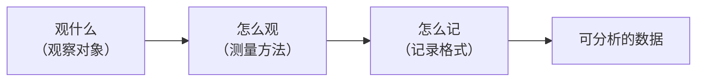
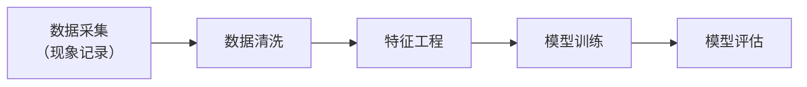

# 现象记录

> **所属路径**：`00_高中复习/04_科学思维/02_观察与假设/01_现象记录`
> **预计学习时间**：30 分钟
> **难度等级**：⭐

---

## 前置知识

- [自变量与因变量](../../01_变量与控制/01_自变量与因变量/01_自变量与因变量.md) — 知道什么是"变化的量"，能区分原因和结果
- [控制变量](../../01_变量与控制/02_控制变量/02_控制变量.md) — 理解为什么要"固定其他条件"

> 如果以上内容还不熟悉，建议先完成对应课程再继续。

---

## 学习目标

完成本节后，你将能够：

1. 区分"随意观察"和"系统观察"，并说明两者在数据质量上的差异
2. 使用结构化表格或日志记录观察到的现象
3. 解释为什么规范的数据记录是人工智能数据采集的第一步
4. 用 Python 的字典和列表组织观察数据

---

## 正文讲解

### 1. 从日常说起：你真的"看到"了吗？

每天早上你走出家门，可能会说"今天好像比昨天冷"。这句话包含了一次观察——你感受到了温度变化。但如果有人问你"冷了多少度？是从几点开始变冷的？"你大概率回答不上来。

这就是 **随意观察（Casual Observation）** 的局限：它依赖感觉和印象，模糊、不精确、难以重复验证。

想象另一种场景：你每天早上 7 点在同一个地方用温度计测量气温，把读数、日期、天气状况记在一张表格里。一个月后，你能清楚地看到气温的变化趋势。这就是 **系统观察（Systematic Observation）**——有计划、有结构、可重复的观察。

> 💡 **想一想**：为什么我们强调"同一个地方、同一个时间"？回忆一下上节课学到的 **[控制变量](../../01_变量与控制/02_控制变量/02_控制变量.md)** ——如果每天换一个地方测温，你根本分不清温度变化是因为天气还是因为地点。

### 2. 系统观察的三要素

把随意观察升级为系统观察，需要解决三个问题：



> 📌 **图解说明**：系统观察的三要素依次是确定观察对象、选择测量方法、规范记录格式，最终产出可供分析的数据。

**观什么**：明确你关注的是哪个变量。比如"植物的生长"太笼统，"植物每天的茎高度（厘米）"才够具体。

**怎么观**：选择合适的工具和时机。用卷尺还是激光测距仪？每天测一次还是每小时测一次？测量的 **精度（Precision）** 和 **频率（Frequency）** 直接影响数据质量。

**怎么记**：用统一的格式把每次观察的结果写下来。这就引出了我们的核心话题——数据记录格式。

### 3. 数据记录的两种常见格式

在科学探究和人工智能领域，最常见的两种记录格式是 **表格（Table）** 和 **日志（Log）**。

#### 表格格式

表格适合记录结构化的、每次观察包含相同字段的数据：

| 日期 | 时间 | 气温 (°C) | 湿度 (%) | 天气 |
| ---- | ---- | --------- | --------- | ---- |
| 2025-03-01 | 07:00 | 5.2 | 68 | 晴 |
| 2025-03-02 | 07:00 | 3.8 | 72 | 多云 |
| 2025-03-03 | 07:00 | 6.1 | 65 | 晴 |

表格的优点是一目了然，方便对比和统计。它对应到编程中的"结构化数据"，也是你将来在 **[探索性数据分析（Exploratory Data Analysis, EDA）](../../../../01_基础能力/05_数据能力/08_探索性数据分析/)** 中最常打交道的数据形态。

#### 日志格式

日志适合记录不规则发生的事件，侧重"什么时候发生了什么"：

```
[2025-03-01 07:05] 观察到东方天空有卷积云，风力约2级
[2025-03-01 07:20] 树上的鸟群突然起飞，方向朝南
[2025-03-01 12:30] 午间温度明显升高，体感闷热
```

日志的优点是灵活、信息丰富，适合探索性阶段。但它不够规整，后续分析时需要人工或程序进行"信息提取"。

### 4. 好记录的四个标准

不管你用表格还是日志，一条好的观察记录应该满足以下标准：

| 标准 | 说明 | 反面例子 |
| ---- | ---- | -------- |
| **具体** | 用数字和明确描述代替模糊词语 | ❌ "今天挺热" → ✅ "气温 32.5°C" |
| **时间戳** | 注明精确的观察时间 | ❌ "上午" → ✅ "2025-03-01 10:30" |
| **可重复** | 别人按你的描述能做出相同观察 | ❌ "在某个地方测的" → ✅ "在学校操场中央测量" |
| **原始** | 记录第一手数据，不加解读 | ❌ "因为下雨所以冷了" → ✅ "气温 8°C，正在下雨" |

最后一条特别重要：**记录和解释要分开**。"气温 8°C，正在下雨"是记录；"因为下雨所以冷了"是解释。把解释混在记录里，会让后续分析变得困难，因为你的"解释"可能是错的。

### 5. 连接人工智能：数据采集是一切的起点

在人工智能中，**数据采集（Data Collection）** 是机器学习流水线的第一步。你可以把它想象成"大规模的系统观察"：



> 📌 **图解说明**：机器学习流水线的起点就是数据采集，它直接对应我们这节课学到的"现象记录"。数据质量差，后面的每一步都会出问题——这在业界有一句俗语叫 **"垃圾进，垃圾出"（Garbage In, Garbage Out, GIGO）**。

比如，训练一个天气预报模型需要收集多年的气温、湿度、风速、气压等数据。如果传感器记录不准确、时间戳混乱、某些字段经常缺失，模型学到的就是错误的"规律"。这和你在观察记录中偷懒写"大概下午吧"是一样的道理——模糊的输入只能产生模糊的输出。

在阶段 01 中，你将系统学习 **[数据清洗](../../../../01_基础能力/05_数据能力/02_数据清洗/)** 和 **[数据标注](../../../../01_基础能力/05_数据能力/09_数据标注/)** 的专业方法，而这一切的前提是：数据在采集阶段就足够规范。

---

## 动手实践

学会了记录的原则，让我们用 Python 来实际操作。下面我们模拟一个场景：你连续一周每天记录教室的温度和学生的专注程度，想看看两者之间有没有关系。

```python
# 文件：code/observation_record.py
# 用 Python 字典和列表进行结构化观察记录
# 环境要求：Python 3.10+

# ---- 第一步：定义记录格式 ----
# 每条记录是一个字典，包含日期、时间、温度、专注度评分（1-10）

observations = [
    {"日期": "2025-03-10", "时间": "09:00", "温度_C": 22.0, "专注度": 8},
    {"日期": "2025-03-11", "时间": "09:00", "温度_C": 26.5, "专注度": 6},
    {"日期": "2025-03-12", "时间": "09:00", "温度_C": 18.3, "专注度": 9},
    {"日期": "2025-03-13", "时间": "09:00", "温度_C": 28.0, "专注度": 5},
    {"日期": "2025-03-14", "时间": "09:00", "温度_C": 21.0, "专注度": 8},
    {"日期": "2025-03-15", "时间": "09:00", "温度_C": 30.2, "专注度": 4},
    {"日期": "2025-03-16", "时间": "09:00", "温度_C": 23.5, "专注度": 7},
]

# ---- 第二步：打印结构化表格 ----
print("=" * 55)
print(f"{'日期':<12} {'时间':<8} {'温度(°C)':<10} {'专注度':<6}")
print("=" * 55)
for obs in observations:
    print(f"{obs['日期']:<12} {obs['时间']:<8} {obs['温度_C']:<10.1f} {obs['专注度']:<6}")
print("=" * 55)

# ---- 第三步：基本统计 ----
temps = [obs["温度_C"] for obs in observations]
focus = [obs["专注度"] for obs in observations]

avg_temp = sum(temps) / len(temps)
avg_focus = sum(focus) / len(focus)

print(f"\n平均温度: {avg_temp:.1f}°C")
print(f"平均专注度: {avg_focus:.1f}")
print(f"记录条数: {len(observations)}")

# ---- 第四步：分组对比 ----
hot_focus = [obs["专注度"] for obs in observations if obs["温度_C"] >= 25]
cool_focus = [obs["专注度"] for obs in observations if obs["温度_C"] < 25]

print(f"\n温度 ≥ 25°C 时的平均专注度: {sum(hot_focus)/len(hot_focus):.1f}")
print(f"温度 < 25°C 时的平均专注度: {sum(cool_focus)/len(cool_focus):.1f}")
print("\n初步印象：温度较高时专注度似乎更低——但这只是观察，不是结论！")
```

**运行说明**：
- 环境要求：Python 3.10+（仅使用标准库）
- 运行命令：`python code/observation_record.py`

**预期输出**：
```
=======================================================
日期           时间     温度(°C)    专注度  
=======================================================
2025-03-10   09:00    22.0       8     
2025-03-11   09:00    26.5       6     
2025-03-12   09:00    18.3       9     
2025-03-13   09:00    28.0       5     
2025-03-14   09:00    21.0       8     
2025-03-15   09:00    30.2       4     
2025-03-16   09:00    23.5       7     
=======================================================

平均温度: 24.2°C
平均专注度: 6.7
记录条数: 7

温度 ≥ 25°C 时的平均专注度: 5.0
温度 < 25°C 时的平均专注度: 8.0

初步印象：温度较高时专注度似乎更低——但这只是观察，不是结论！
```

注意代码最后一行的提醒：我们发现了一个"模式"，但还不能说"温度高导致专注度低"。从观察到结论，中间还需要经过 **[提出假设](../02_提出假设/02_提出假设.md)** 和 **[验证思路](../03_验证思路/03_验证思路.md)** 两个步骤——这正是接下来两节课的内容。

---

## 典型误区

| 误区 | 正确理解 |
| ---- | -------- |
| "观察就是用眼睛看" | 观察可以借助各种工具（温度计、传感器、问卷），核心是系统、可重复地收集信息 |
| "记录越详细越好" | 记录应该聚焦于与研究问题相关的变量，无关信息太多反而增加噪声 |
| "先有结论再找数据" | 应该先客观记录，再从数据中发现规律；带着预设去"挑数据"会造成确认偏差 |
| "数据少也没关系" | 样本量太小会导致结论不可靠，后续你将在 **[统计基础](../../../01_数学基础/10_统计基础/)** 中学到原因 |

---

## 练习题

### 练习 1：设计观察表（难度：⭐）

你想研究"每天的运动时间和睡眠质量之间是否有关系"。请设计一张观察记录表，至少包含 5 个字段（列），并说明每个字段的含义和记录标准。

<details>
<summary>💡 提示</summary>

想一想：除了"运动时间"和"睡眠质量"这两个核心变量，还有哪些因素可能影响睡眠？这些应该作为控制变量记录下来。睡眠质量用什么度量——时长？醒来次数？主观评分？

</details>

<details>
<summary>✅ 参考答案</summary>

一个合理的观察表设计如下：

| 字段 | 含义 | 记录标准 |
| ---- | ---- | -------- |
| 日期 | 记录日期 | YYYY-MM-DD 格式 |
| 运动时间(分钟) | 当天运动总时长 | 整数，精确到分钟 |
| 运动类型 | 进行了什么运动 | 如"跑步""游泳""无" |
| 咖啡因摄入 | 当天是否饮用咖啡/茶 | "是"或"否"，及杯数 |
| 入睡时间 | 实际入睡时间 | HH:MM 格式 |
| 睡眠时长(小时) | 总睡眠时间 | 精确到 0.5 小时 |
| 睡眠质量评分 | 主观感受 | 1-10 整数，10 为最佳 |

关键点：记录了"咖啡因摄入"作为控制变量，避免把咖啡因的影响误归到运动上。

</details>

### 练习 2：改正不规范的记录（难度：⭐）

以下观察日志有多处不规范，请找出问题并改正：

```
3月5号：今天很热，植物长得特别快，可能是因为昨天浇了水。
周三：温度适中，植物正常。
3.7：冷了，植物没怎么长，叶子有点黄。
```

<details>
<summary>💡 提示</summary>

回顾"好记录的四个标准"：具体、时间戳、可重复、原始。逐条对照检查。

</details>

<details>
<summary>✅ 参考答案</summary>

**问题列表**：

1. 日期格式不统一（"3月5号""周三""3.7"），应统一使用 YYYY-MM-DD
2. "很热""温度适中""冷了" 太模糊，应记录具体温度数值
3. "长得特别快""正常""没怎么长" 缺少量化，应记录茎高度（厘米）
4. "可能是因为昨天浇了水" 混入了解释，应只记录事实

**改正后**：

| 日期 | 温度 (°C) | 茎高度 (cm) | 浇水 | 备注 |
| ---- | --------- | ----------- | ---- | ---- |
| 2025-03-05 | 31.2 | 15.3 | 前一天浇水 200ml | 叶色正常 |
| 2025-03-06 | 24.0 | 15.8 | 无 | 叶色正常 |
| 2025-03-07 | 12.5 | 15.9 | 无 | 部分叶尖发黄 |

</details>

### 练习 3：Python 数据记录（难度：⭐⭐）

请仿照"动手实践"中的代码，用 Python 列表+字典的形式，记录你最近 5 天的"学习时间（小时）"和"心情评分（1-10）"。然后计算平均学习时间和平均心情评分，并将学习时间 ≥3 小时和 <3 小时的心情评分分别算出平均值。

<details>
<summary>💡 提示</summary>

模仿示例代码的结构：先定义数据列表，再用列表推导式提取字段，最后用条件筛选分组。

</details>

<details>
<summary>✅ 参考答案</summary>

```python
records = [
    {"日期": "2025-03-10", "学习时间_h": 4.0, "心情": 8},
    {"日期": "2025-03-11", "学习时间_h": 1.5, "心情": 5},
    {"日期": "2025-03-12", "学习时间_h": 3.5, "心情": 7},
    {"日期": "2025-03-13", "学习时间_h": 2.0, "心情": 6},
    {"日期": "2025-03-14", "学习时间_h": 5.0, "心情": 9},
]

hours = [r["学习时间_h"] for r in records]
moods = [r["心情"] for r in records]

print(f"平均学习时间: {sum(hours)/len(hours):.1f} 小时")
print(f"平均心情评分: {sum(moods)/len(moods):.1f}")

high = [r["心情"] for r in records if r["学习时间_h"] >= 3]
low = [r["心情"] for r in records if r["学习时间_h"] < 3]

print(f"学习 ≥3h 平均心情: {sum(high)/len(high):.1f}")
print(f"学习 <3h 平均心情: {sum(low)/len(low):.1f}")
```

</details>

---

## 下一步学习

- 📖 下一个知识点：[提出假设](../02_提出假设/02_提出假设.md) — 把观察中发现的模式变成可检验的猜测
- 🔗 相关知识点：[控制变量](../../01_变量与控制/02_控制变量/02_控制变量.md) — 为什么观察时需要固定条件
- 🔗 相关知识点：[图表与证据](../../04_图表与证据/) — 如何用图表呈现你记录的数据

---

## 参考资料

1. [Understanding Science — How Science Works](https://undsci.berkeley.edu/understanding-science-101/how-science-works/) — 加州大学伯克利分校的科学方法入门（公开教育资源）
2. [Python 官方教程 — 数据结构](https://docs.python.org/zh-cn/3/tutorial/datastructures.html) — Python 列表和字典的官方文档（官方文档）
3. [Wikipedia — Scientific method](https://en.wikipedia.org/wiki/Scientific_method) — 科学方法概述（公共知识库）
