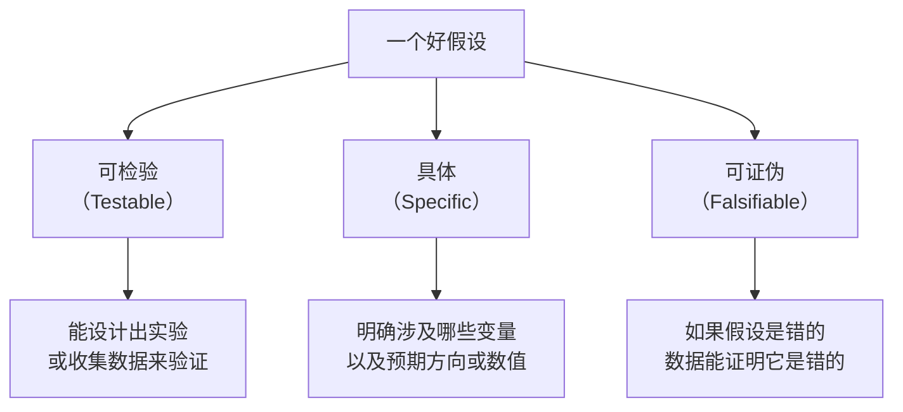
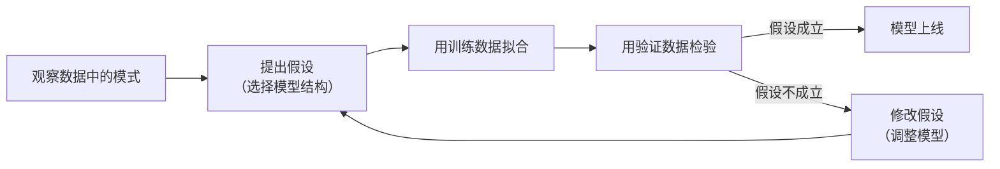

# 提出假设

> **所属路径**：`00_高中复习/04_科学思维/02_观察与假设/02_提出假设`
> **预计学习时间**：30 分钟
> **难度等级**：⭐

---

## 前置知识

- [现象记录](../01_现象记录/01_现象记录.md) — 能够用结构化方式记录观察数据
- [自变量与因变量](../../01_变量与控制/01_自变量与因变量/01_自变量与因变量.md) — 理解变量之间的因果方向

> 如果以上内容还不熟悉，建议先完成对应课程再继续。

---

## 学习目标

完成本节后，你将能够：

1. 区分"问题""观察"和"假设"这三个概念
2. 说出一个好假设的三个特征：可检验、具体、可证伪
3. 将一个模糊的猜测改写为规范的假设陈述
4. 理解"假设"在人工智能模型训练中的类比意义

---

## 正文讲解

### 1. 从观察到疑问：一个自然的过渡

在上一节 **[现象记录](../01_现象记录/01_现象记录.md)** 中，我们学会了系统地记录数据。假设你记录了一周的教室温度和学生专注度，发现了一个有趣的模式：温度高的时候，专注度似乎更低。

这时你的脑海里自然会冒出一个问题："温度高了，学生是不是就不容易集中注意力？"

但请注意，这只是一个 **问题（Question）**，它表达了好奇心，但还没有给出可以验证的回答。要从问题走向科学探究，你需要把它升级为一个 **假设（Hypothesis）**。

### 2. 什么是假设？

**假设（Hypothesis）** 是对观察到的现象提出的一种 **可检验的、暂时性的解释或预测**。

我们来对比一下问题和假设的区别：

| 类型 | 示例 | 特点 |
| ---- | ---- | ---- |
| 问题 | "温度和专注度有关系吗？" | 开放性，不含预测方向 |
| 猜测 | "温度高了肯定不行" | 含方向，但模糊、不可验证 |
| **假设** | "当教室温度超过 28°C 时，学生的平均专注度评分将低于 6 分" | 具体、有方向、可检验 |

从问题到假设的转变，本质上是在说："我不仅好奇，我还有一个具体的预测，并且我愿意用数据来检验它。"

### 3. 好假设的三个标准

不是所有的猜测都是好假设。一个科学意义上的好假设需要满足三个条件：



> 📌 **图解说明**：好假设的三个特征——可检验性保证假设不是空谈，具体性保证假设不是模糊的感觉，可证伪性保证假设有被推翻的可能。

我们逐一展开。

#### 可检验（Testable）

"命运决定了一切" 这句话你无法用实验验证——它不是假设。但"浇水量增加一倍，植物两周后的平均高度将增加至少 3 厘米"是可以检验的：你可以真的去浇水、量高度。

#### 具体（Specific）

"多运动对身体好" 太笼统了。"每天跑步 30 分钟的人，4 周后静息心率将比不运动的人平均低 5 次/分钟"——这才够具体。

具体性意味着你需要说清楚：

- **谁/什么**受到影响？
- **哪个变量**发生变化？
- **变化方向和幅度**是什么？

#### 可证伪（Falsifiable）

这是最关键也最常被忽视的标准。**可证伪（Falsifiability）** 的意思是：必须存在某种观测结果，能够证明你的假设是错的。

"学习有助于进步" 几乎无法证伪——不管观测到什么结果，你都可以辩解。但"背单词 30 分钟后，10 分钟内能默写出的单词数将增加至少 5 个"是可证伪的：如果你实际只多默写出了 1 个，假设就被推翻了。

> 💡 **为什么可证伪性这么重要？** 科学哲学家卡尔·波普尔（Karl Popper）指出，科学理论的核心特征不是"能被证实"，而是"原则上能被证伪"。如果一个假设怎么都不会错，那它其实什么都没说。

### 4. 假设的标准句式

为了帮助你从模糊猜测过渡到规范假设，这里提供一个实用的句式模板：

> **"如果 [条件/操作]，那么 [可观测的结果]，因为 [推测的机制]。"**

| 组成部分 | 作用 | 示例 |
| -------- | ---- | ---- |
| 如果…… | 说明自变量或操作条件 | 如果每天给植物照射 8 小时光照 |
| 那么…… | 预测因变量的变化 | 那么 2 周后植物高度将超过 15 厘米 |
| 因为…… | 给出背后的推测理由（可选） | 因为光合作用需要充足的光源 |

"因为"部分在高中阶段是可选的，但养成补充理由的习惯对后续学习非常有帮助——在机器学习中，这相当于你对模型 **[特征工程](../../../../01_基础能力/05_数据能力/03_特征工程/)** 的直觉判断。

### 5. 一个常见的坑：假设不是愿望

初学者常犯的错误是把"希望发生的事"当作假设。比如：

- ❌ "我希望新的教学方法能提高成绩" —— 这是愿望
- ✅ "使用新教学方法的班级，期末平均分将比对照班高至少 5 分" —— 这是假设

假设必须客观、中立，不包含价值判断。你可能非常希望某个结果成立，但假设本身只是一个等待验证的陈述。

### 6. 连接人工智能：模型训练就是验证假设

在人工智能中，训练一个模型本质上就是在验证一个假设。



> 📌 **图解说明**：模型训练的循环本质上就是"提出假设→检验假设→修改假设"的科学过程。

举个例子：

- **观察**：房价数据显示面积大的房子通常更贵
- **假设**：房价与面积之间存在近似线性关系（即 $价格 \approx w \times 面积 + b$ ）
- **验证**：用训练数据拟合直线，然后在测试数据上看预测是否准确
- **修正**：如果线性关系不好，可能需要加入更多变量（地段、楼层等），即修改假设

在阶段 02 的 **[回归](../../../../02_核心原理/02_经典机器学习/01_回归/)** 课程中，你将正式学习这个过程。现在你只需要记住：**每次选择一个模型结构，就是在提出一个关于数据模式的假设**。

---

## 动手实践

下面我们用 Python 模拟"从数据中发现模式，然后提出假设"的过程。

```python
# 文件：code/formulate_hypothesis.py
# 从模拟数据中发现模式并提出假设
# 环境要求：Python 3.10+

import random

# ---- 第一步：生成模拟数据 ----
# 假设"真实规律"是：复习时间越长，考试分数越高（带随机波动）
random.seed(42)

students = []
for i in range(20):
    study_hours = random.uniform(0.5, 6.0)  # 复习时间：0.5~6 小时
    noise = random.gauss(0, 5)               # 随机波动
    score = 50 + 7 * study_hours + noise      # 真实关系（学生不知道）
    score = max(0, min(100, score))            # 限制在 0-100
    students.append({
        "编号": i + 1,
        "复习时间_h": round(study_hours, 1),
        "考试分数": round(score, 1),
    })

# ---- 第二步：展示数据（模拟"观察"） ----
print("学生考试数据：")
print(f"{'编号':<6} {'复习时间(h)':<14} {'考试分数':<10}")
print("-" * 30)
for s in students[:10]:  # 只显示前 10 条
    print(f"{s['编号']:<6} {s['复习时间_h']:<14} {s['考试分数']:<10}")
print(f"...（共 {len(students)} 条记录）\n")

# ---- 第三步：从数据中发现模式 ----
high_study = [s for s in students if s["复习时间_h"] >= 3.5]
low_study = [s for s in students if s["复习时间_h"] < 3.5]

avg_high = sum(s["考试分数"] for s in high_study) / len(high_study)
avg_low = sum(s["考试分数"] for s in low_study) / len(low_study)

print(f"复习 ≥ 3.5h 的平均分: {avg_high:.1f}（{len(high_study)} 人）")
print(f"复习 < 3.5h 的平均分: {avg_low:.1f}（{len(low_study)} 人）")

# ---- 第四步：基于观察提出假设 ----
print("\n" + "=" * 50)
print("从观察到假设的过程：")
print("=" * 50)
print(f"  观察：复习多的学生（≥3.5h）平均分 {avg_high:.1f}")
print(f"        复习少的学生（<3.5h）平均分 {avg_low:.1f}")
print(f"  差异：{avg_high - avg_low:.1f} 分")
print()
print("  问题：复习时间和考试分数之间有关系吗？")
print()
print("  假设：复习时间每增加 1 小时，考试分数将提高约 5~10 分。")
print("        （可检验 ✓  具体 ✓  可证伪 ✓）")
print()
print("  下一步：收集更多数据，用验证方法检验这个假设。")
```

**运行说明**：
- 环境要求：Python 3.10+（仅使用标准库）
- 运行命令：`python code/formulate_hypothesis.py`

**预期输出**：
```
学生考试数据：
编号     复习时间(h)      考试分数    
------------------------------
1      4.0            76.0      
2      5.8            94.3      
3      1.1            59.0      
4      5.4            87.3      
5      3.4            76.7      
6      3.5            71.6      
7      2.8            75.4      
8      1.1            52.2      
9      2.2            69.3      
10     3.2            75.7      
...（共 20 条记录）

复习 ≥ 3.5h 的平均分: 81.5（9 人）
复习 < 3.5h 的平均分: 66.7（11 人）

==================================================
从观察到假设的过程：
==================================================
  观察：复习多的学生（≥3.5h）平均分 81.5
        复习少的学生（<3.5h）平均分 66.7
  差异：14.8 分

  问题：复习时间和考试分数之间有关系吗？

  假设：复习时间每增加 1 小时，考试分数将提高约 5~10 分。
        （可检验 ✓  具体 ✓  可证伪 ✓）

  下一步：收集更多数据，用验证方法检验这个假设。
```

代码演示了完整的思维链条：先记录数据（观察），再计算分组差异（发现模式），最后提出一个具体的、可检验的假设。下一节 **[验证思路](../03_验证思路/03_验证思路.md)** 将教你如何设计验证方案来检验这个假设。

---

## 典型误区

| 误区 | 正确理解 |
| ---- | -------- |
| "假设必须是对的" | 假设只是暂时性的猜测，被推翻同样有价值——它帮你排除了一种可能性 |
| "假设和问题是一回事" | 问题是开放性的（"有没有关系？"），假设是带预测的陈述（"A 增加，B 也增加"） |
| "假设越大胆越好" | 好假设需要平衡大胆与具体——"外星人影响了实验" 很大胆但无法检验 |
| "一次只能有一个假设" | 同一个观察可以提出多个竞争假设，然后用数据逐一排除 |

---

## 练习题

### 练习 1：辨别问题与假设（难度：⭐）

以下哪些是"假设"，哪些只是"问题"或"猜测"？

A. 手机使用时间和视力有关吗？
B. 每天使用手机超过 4 小时的人，近视发生率将高于每天使用不超过 1 小时的人。
C. 手机对眼睛不好。
D. 如果将手机屏幕亮度降低 50%，那么连续使用 2 小时后的眼疲劳评分将降低至少 2 分。

<details>
<summary>💡 提示</summary>

对每一条逐一检查三个标准：可检验？具体？可证伪？

</details>

<details>
<summary>✅ 参考答案</summary>

- **A**：问题——开放性提问，没有预测方向
- **B**：✅ 假设——有具体数值（4 小时 vs 1 小时）、可检验（统计近视率）、可证伪（如果两组近视率相同则假设被推翻）
- **C**：猜测——太模糊，"不好"没有量化标准，无法检验
- **D**：✅ 假设——条件具体（亮度降低 50%），预测具体（疲劳评分降低至少 2 分），可检验且可证伪

</details>

### 练习 2：改写为规范假设（难度：⭐）

将以下模糊猜测改写为符合"可检验、具体、可证伪"标准的假设：

"听音乐学习效率更高。"

<details>
<summary>💡 提示</summary>

使用"如果……那么……因为……"句式。想清楚：什么类型的音乐？学习什么内容？"效率"怎么衡量？

</details>

<details>
<summary>✅ 参考答案</summary>

**改写后的假设**：

"如果学生在做数学题时播放无歌词的轻音乐，那么 30 分钟内正确完成的题目数将比安静环境下多至少 2 道，因为轻音乐可能帮助缓解焦虑、提高专注力。"

**分析**：
- 可检验 ✓ — 可以安排两组学生对比
- 具体 ✓ — 明确了音乐类型（无歌词轻音乐）、任务（数学题）、指标（正确题数）、阈值（至少 2 道）
- 可证伪 ✓ — 如果两组题数相同或音乐组更少，假设被推翻

</details>

### 练习 3：从数据到假设（难度：⭐⭐）

运行以下 Python 代码，观察输出结果，然后基于数据提出一个符合三个标准的假设。

```python
import random
random.seed(123)
data = []
for _ in range(15):
    sleep = round(random.uniform(4, 10), 1)
    reaction = round(400 - 20 * sleep + random.gauss(0, 15), 1)
    data.append({"睡眠(h)": sleep, "反应时间(ms)": reaction})
for d in data:
    print(f"  睡眠: {d['睡眠(h)']:.1f}h  反应时间: {d['反应时间(ms)']:.1f}ms")
```

<details>
<summary>💡 提示</summary>

先运行代码观察数据，看睡眠时间和反应时间的大致趋势。然后用"如果……那么……"句式把你的发现写成假设。

</details>

<details>
<summary>✅ 参考答案</summary>

运行后会发现：睡眠时间越长的人，反应时间通常越短（更快）。

**假设示例**：

"如果一个人的夜间睡眠时间增加 1 小时，那么次日的视觉反应时间将缩短约 15~25 毫秒。"

- 可检验 ✓ — 可以收集更多人的睡眠和反应时间数据来验证
- 具体 ✓ — 指定了变量（睡眠时间、反应时间）和预期范围（15~25ms）
- 可证伪 ✓ — 如果数据显示反应时间不随睡眠变化，假设被推翻

</details>

---

## 下一步学习

- 📖 下一个知识点：[验证思路](../03_验证思路/03_验证思路.md) — 有了假设之后，如何设计验证方案来检验它
- 🔗 相关知识点：[自变量与因变量](../../01_变量与控制/01_自变量与因变量/01_自变量与因变量.md) — 假设中涉及的变量关系
- 📚 拓展阅读：[相关与因果](../../03_相关与因果/) — 假设的验证结果是"相关"还是"因果"？

---

## 参考资料

1. [Understanding Science — Hypotheses](https://undsci.berkeley.edu/understanding-science-101/how-science-works/) — 加州大学伯克利分校的假设形成指南（公开教育资源）
2. [Khan Academy — The Scientific Method](https://www.khanacademy.org/science/biology/intro-to-biology/science-of-biology/a/the-science-of-biology) — 可汗学院的科学方法入门（CC BY-NC-SA 许可）
3. [Wikipedia — Falsifiability](https://en.wikipedia.org/wiki/Falsifiability) — 可证伪性概念详解（公共知识库）
