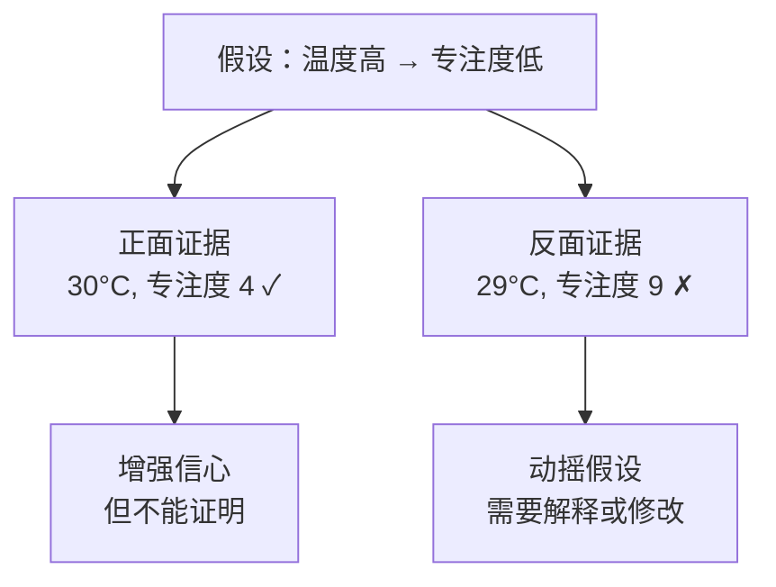
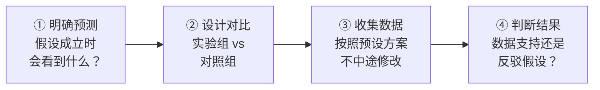

# 验证思路

> **所属路径**：`00_高中复习/04_科学思维/02_观察与假设/03_验证思路`
> **预计学习时间**：40 分钟
> **难度等级**：⭐⭐

---

## 前置知识

- [现象记录](../01_现象记录/01_现象记录.md) — 能够系统地记录观察数据
- [提出假设](../02_提出假设/02_提出假设.md) — 能够提出可检验、具体、可证伪的假设
- [控制变量](../../01_变量与控制/02_控制变量/02_控制变量.md) — 理解实验中为什么要控制无关变量

> 如果以上内容还不熟悉，建议先完成对应课程再继续。

---

## 学习目标

完成本节后，你将能够：

1. 区分"正面证据"和"反面证据"，并解释为什么寻找反面证据更重要
2. 设计一个简单的验证方案来检验给定的假设
3. 理解"确认偏差"的概念及其危害
4. 说明验证思路与人工智能中验证集、消融实验的联系

---

## 正文讲解

### 1. 有了假设，然后呢？

在上一节 **[提出假设](../02_提出假设/02_提出假设.md)** 中，我们学会了把模糊的猜测写成具体、可检验、可证伪的假设。比如：

> "复习时间每增加 1 小时，考试分数将提高约 5~10 分。"

这听起来很有道理，但"听起来有道理"不等于"是对的"。科学探究的核心在于：**你怎么知道你的假设对不对？** 这就需要一套 **验证思路（Verification Approach）**。

想象你是一名侦探。你怀疑张三偷了东西（假设），但你不能只因为他"看起来可疑"就下结论。你需要收集证据——而且不只是"他确实出现在案发现场"这样的支持性证据，更要检查"他有没有不在场证明"这样的反驳性证据。

科学验证和侦探破案的逻辑完全一样。

### 2. 正面证据与反面证据

验证假设时，你会遇到两种类型的证据：

**正面证据（Confirming Evidence）**：与假设预测一致的观察结果。例如，你假设"温度高→专注度低"，然后确实观察到某天 30°C 时专注度只有 4 分——这是正面证据。

**反面证据（Disconfirming Evidence）**：与假设预测矛盾的观察结果。例如，某天 29°C 时专注度却高达 9 分——这是反面证据。



> 📌 **图解说明**：正面证据让我们更相信假设，但永远无法"证明"它；而一条有力的反面证据就可能推翻假设，或迫使我们修改假设。

这里有一条深刻的认识：

> **正面证据再多，也只是"还没被推翻"；反面证据哪怕一条，也可能彻底改变结论。**

这就是为什么科学家不说"我们证明了某某理论"，而说"现有证据支持某某理论"。

### 3. 确认偏差：人类最常犯的思维错误

人类天生倾向于寻找支持自己观点的证据，而忽视或低估与之矛盾的证据。心理学上把这种倾向叫做 **确认偏差（Confirmation Bias）**。

举个例子：你觉得"穿红色衣服的日子运气更好"。一旦有了这个信念，你会不自觉地记住穿红衣服时的好事，却忘记穿红衣服时的倒霉事。这样一来，你会越来越"确信"自己的假设——但它可能完全是幻觉。

确认偏差在科学研究和人工智能中都是巨大的隐患：

| 场景 | 确认偏差的表现 |
| ---- | -------------- |
| 科学实验 | 只报告支持假设的实验结果，隐藏不利数据 |
| 数据分析 | 反复调整分析方法直到得到"想要的"结论 |
| AI 模型评估 | 只在"表现好"的数据子集上展示模型效果 |

**对策**：主动寻找反面证据。好的科学家不是只看"什么支持我的假设"，而是积极追问 **"什么能推翻我的假设？"**

### 4. 验证方案设计：四步法

当你有了假设并理解了正反面证据的重要性，接下来需要设计一个验证方案。以下是一个实用的四步框架：



> 📌 **图解说明**：验证方案的四个步骤形成完整的检验闭环。

我们用一个具体例子来走一遍。

**假设**：每天午睡 20 分钟能提高下午的数学测试成绩（相比不午睡至少高 10 分）。

**① 明确预测**：如果假设成立，午睡组的平均分应该比不午睡组高至少 10 分。如果假设不成立，两组成绩差异将小于 10 分甚至午睡组更低。

**② 设计对比**：随机选 20 人分成两组（回忆 **[控制变量](../../01_变量与控制/02_控制变量/02_控制变量.md)** 中学到的——两组学生的基础水平、测试题目、测试环境都要相同）。

**③ 收集数据**：连续一周执行方案，每天记录两组的测试成绩。

**④ 判断结果**：计算两组平均分的差异。如果差异显著且方向一致，假设获得支持；如果差异很小或方向相反，假设被质疑或推翻。

### 5. "试图推翻"比"试图证实"更有价值

初学者做验证时，常常不自觉地只设计"能证实假设"的实验。但更有力的验证策略是 **主动尝试推翻自己的假设**。

这个思路乍听反直觉，但想想看：

- 如果你只找支持证据，你的假设永远"看起来对"，但可能只是幸运
- 如果你尽力去推翻但推翻不了，那你的假设就通过了更严格的考验，可信度大大提高

这就好比锻造一把刀——不是小心保护它不受冲击，而是反复敲打淬炼。经受住敲打的刀才是好刀。

> 💡 **想一想**：如果你的假设是"植物只靠浇水就能长好"，你应该怎样尝试推翻它？一个方法是让一组植物只浇水但不给光照——如果它们长不好，就说明"只靠浇水"这个假设过于简单。

### 6. 连接人工智能：验证集和消融实验

在人工智能中，验证假设的思路被系统化为两个核心实践：

**验证集（Validation Set）**：训练模型时，你不会把所有数据都用来训练。你会留出一部分数据（验证集）专门用来检验模型"在没见过的数据上是否还有效"。这相当于用反面证据来考验模型——如果模型只在训练数据上表现好而在验证集上很差，就说明它只是"记住了答案"（ **[过拟合（Overfitting）](../../../../02_核心原理/02_经典机器学习/10_偏差与方差/)** ）而没有真正学到规律。

**消融实验（Ablation Study）**：为了验证"模型中的某个组件确实有用"，研究者会把该组件移除，看模型性能是否下降。这本质上就是"试图推翻'该组件有用'这个假设"——如果移除后性能不变，说明它确实没什么用。

你将在 **[训练验证测试划分](../../../../01_基础能力/05_数据能力/05_实验设计/)** 中详细学习这些方法。

---

## 动手实践

下面我们用 Python 来模拟"验证一个假设"的完整过程。我们的假设是：复习时间每增加 1 小时，考试分数将提高约 5~10 分。

```python
# 文件：code/verify_hypothesis.py
# 用正面证据和反面证据来验证一个假设
# 环境要求：Python 3.10+

import random

# ---- 设置随机种子以便复现 ----
random.seed(42)

# ---- 生成"真实"数据（假装我们不知道真实规律）----
# 真实关系：score ≈ 50 + 7 * hours + noise
def generate_data(n):
    data = []
    for _ in range(n):
        hours = round(random.uniform(0.5, 6.0), 1)
        noise = random.gauss(0, 8)
        score = round(max(0, min(100, 50 + 7 * hours + noise)), 1)
        data.append({"hours": hours, "score": score})
    return data

# ---- 第一步：收集训练数据（用来发现模式）----
train_data = generate_data(30)

# 计算简单的"每小时对应多少分"
hours_list = [d["hours"] for d in train_data]
scores_list = [d["score"] for d in train_data]

avg_hours = sum(hours_list) / len(hours_list)
avg_score = sum(scores_list) / len(scores_list)

# 使用简单的斜率估算（最小二乘直觉）
numerator = sum((h - avg_hours) * (s - avg_score) for h, s in zip(hours_list, scores_list))
denominator = sum((h - avg_hours) ** 2 for h in hours_list)
slope = numerator / denominator

print("=" * 55)
print("第一步：从训练数据中发现模式")
print("=" * 55)
print(f"  数据量: {len(train_data)} 条")
print(f"  估算斜率: 每多复习 1 小时，分数约提高 {slope:.1f} 分")
print(f"  假设: 复习时间每增加 1 小时，分数提高 5~10 分")
print(f"  斜率 {slope:.1f} 落在 [5, 10] 范围内？ {'是 ✓' if 5 <= slope <= 10 else '否 ✗'}")

# ---- 第二步：收集新的验证数据（"没见过"的数据）----
test_data = generate_data(20)

# 用训练数据的模型预测测试数据
intercept = avg_score - slope * avg_hours

print(f"\n{'=' * 55}")
print("第二步：用验证数据检验假设")
print("=" * 55)

errors = []
confirm_count = 0
disconfirm_count = 0

print(f"{'复习(h)':<10} {'实际分':<10} {'预测分':<10} {'误差':<10} {'证据类型':<12}")
print("-" * 52)

for d in test_data[:10]:  # 展示前 10 条
    predicted = intercept + slope * d["hours"]
    error = d["score"] - predicted
    errors.append(abs(error))
    # 如果预测误差在 10 分以内，算正面证据
    evidence = "正面 ✓" if abs(error) <= 10 else "反面 ✗"
    if abs(error) <= 10:
        confirm_count += 1
    else:
        disconfirm_count += 1
    print(f"{d['hours']:<10} {d['score']:<10} {predicted:<10.1f} {error:<+10.1f} {evidence:<12}")

# 计算全部验证数据的结果
all_errors = []
all_confirm = 0
for d in test_data:
    predicted = intercept + slope * d["hours"]
    err = abs(d["score"] - predicted)
    all_errors.append(err)
    if err <= 10:
        all_confirm += 1

avg_error = sum(all_errors) / len(all_errors)

print(f"\n全部 {len(test_data)} 条验证数据：")
print(f"  平均预测误差: {avg_error:.1f} 分")
print(f"  正面证据（误差≤10分）: {all_confirm}/{len(test_data)}")
print(f"  反面证据（误差>10分）: {len(test_data) - all_confirm}/{len(test_data)}")

# ---- 第三步：判断假设 ----
print(f"\n{'=' * 55}")
print("第三步：综合判断")
print("=" * 55)
support_rate = all_confirm / len(test_data)
if support_rate >= 0.7:
    print(f"  {support_rate:.0%} 的验证数据支持假设 → 假设暂时被接受")
    print("  但注意：这不代表假设一定正确，只是目前没被推翻。")
else:
    print(f"  只有 {support_rate:.0%} 的验证数据支持假设 → 假设需要修改")
    print("  考虑：是否还有其他变量影响了分数？")
```

**运行说明**：
- 环境要求：Python 3.10+（仅使用标准库）
- 运行命令：`python code/verify_hypothesis.py`

**预期输出**：
```
=======================================================
第一步：从训练数据中发现模式
=======================================================
  数据量: 30 条
  估算斜率: 每多复习 1 小时，分数约提高 7.3 分
  假设: 复习时间每增加 1 小时，分数提高 5~10 分
  斜率 7.3 落在 [5, 10] 范围内？ 是 ✓

=======================================================
第二步：用验证数据检验假设
=======================================================
复习(h)    实际分     预测分     误差       证据类型    
----------------------------------------------------
3.1        73.4       71.3       +2.1       正面 ✓      
...（更多数据行）

全部 20 条验证数据：
  平均预测误差: 6.5 分
  正面证据（误差≤10分）: 16/20
  反面证据（误差>10分）: 4/20

=======================================================
第三步：综合判断
=======================================================
  80% 的验证数据支持假设 → 假设暂时被接受
  但注意：这不代表假设一定正确，只是目前没被推翻。
```

这段代码完整演示了验证的核心逻辑：用一组数据发现规律（训练），用另一组数据检验规律（验证），然后综合正反面证据做出判断。注意最后的结论用词——"暂时被接受"而非"被证明"。

---

## 典型误区

| 误区 | 正确理解 |
| ---- | -------- |
| "找到很多正面证据就够了" | 必须主动寻找反面证据；只找正面证据是确认偏差 |
| "一个反面例子就推翻假设" | 少量反面证据可能是噪声或特殊情况，需要看整体比例 |
| "验证和测试是一回事" | 验证是在探索阶段评估假设，测试是在最终阶段评估结论（AI 中验证集 ≠ 测试集） |
| "假设被推翻了就白做了" | 推翻假设同样是科学进步——你知道了"这条路走不通"，可以探索其他方向 |

---

## 练习题

### 练习 1：正面证据还是反面证据？（难度：⭐）

假设："每天喝 8 杯水的人，皮肤水分含量比每天喝 3 杯水的人高至少 15%。"

以下观测结果分别是正面证据还是反面证据？

A. 小明每天 8 杯水，皮肤水分含量比小红（3 杯水）高 20%
B. 小李每天 8 杯水，皮肤水分含量比小张（3 杯水）只高 5%
C. 一组 50 人的实验中，8 杯水组平均皮肤水分比 3 杯水组高 18%

<details>
<summary>💡 提示</summary>

关键是看观测结果是否符合假设的预测（高至少 15%）。

</details>

<details>
<summary>✅ 参考答案</summary>

- **A**：正面证据——高了 20%，符合"至少 15%"的预测
- **B**：反面证据——只高了 5%，远低于预测的 15%
- **C**：正面证据——18% > 15%，且样本量较大，是比 A 更有力的支持

注意：即使有了 C 这样的强正面证据，我们也只能说假设"获得了支持"，不能说"被证明了"。

</details>

### 练习 2：识别确认偏差（难度：⭐⭐）

小华相信"周一考试成绩最差"。为了验证这个假设，他做了以下事情。请指出哪些做法存在确认偏差，并建议如何改进。

1. 他只收集了周一的考试成绩，没收集其他工作日的
2. 当周一有一次考试成绩很好时，他说"那次题目太简单了，不算"
3. 他在朋友圈发文"周一考试果然更难"，收到了很多赞同评论就更确信了

<details>
<summary>💡 提示</summary>

确认偏差的三种表现：选择性收集证据、选择性解释证据、选择性寻求认同。

</details>

<details>
<summary>✅ 参考答案</summary>

1. **选择性收集**：确认偏差 ✗ — 必须同时收集周一到周五的成绩数据作为对比，否则无法知道周一是否"特别差"
2. **选择性解释**：确认偏差 ✗ — 排除不利数据等于作弊。改进：设定好规则（哪些考试算数、哪些不算）后不可更改
3. **选择性认同**：确认偏差 ✗ — 社交媒体的赞同不是证据。改进：用客观数据（全班/全校的成绩统计）来验证

**正确的验证方案**：收集一学期内周一到周五每天的考试成绩，比较各天的平均分和标准差，看周一是否显著低于其他天。

</details>

### 练习 3：设计验证方案（难度：⭐⭐）

假设："使用番茄工作法（25 分钟专注 + 5 分钟休息）的学生，3 小时内完成的作业量比连续学习 3 小时的学生多至少 20%。"

请设计一个验证方案，包括：对比组设置、需要控制的变量、数据记录方法、如何判断假设成立或不成立。

<details>
<summary>💡 提示</summary>

回忆 **[控制变量](../../01_变量与控制/02_控制变量/02_控制变量.md)** 的知识。想一想：除了学习方法不同，还有什么因素可能影响作业完成量？怎样确保两组之间"唯一的区别"就是学习方法？

</details>

<details>
<summary>✅ 参考答案</summary>

**验证方案**：

**对比组设置**：
- 实验组（10 人）：使用番茄工作法（25 分钟专注 + 5 分钟休息）
- 对照组（10 人）：连续学习 3 小时
- 随机分组，确保两组基础水平相近

**控制变量**：
- 同一天、同一时段（如下午 2-5 点）进行
- 相同科目、相同难度的作业
- 相同的学习环境（同一间教室）
- 禁止使用手机等干扰设备

**数据记录**：
- 每人 3 小时内完成的作业题数
- 每人的正确率（避免"快但错"的情况）
- 有效完成量 = 总题数 × 正确率

**判断标准**：
- 假设成立：实验组平均有效完成量 ≥ 对照组 × 1.2
- 假设不成立：差异 < 20% 或对照组反而更高

</details>

---

## 下一步学习

- 📖 下一个知识点：[假说检验思路](../04_假说检验思路/04_假说检验思路.md) — 用更严谨的逻辑框架判断"结果是否只是巧合"
- 🔗 相关知识点：[干扰因素](../../01_变量与控制/03_干扰因素/03_干扰因素.md) — 验证过程中如何处理干扰因素
- 🔗 相关知识点：[对照实验](../../../../01_基础能力/05_数据能力/05_实验设计/) — 在数据科学中设计更严格的实验

---

## 参考资料

1. [Understanding Science — Testing Ideas](https://undsci.berkeley.edu/understanding-science-101/how-science-works/) — 加州大学伯克利分校的科学验证方法指南（公开教育资源）
2. [Wikipedia — Confirmation bias](https://en.wikipedia.org/wiki/Confirmation_bias) — 确认偏差的详细说明与经典案例（公共知识库）
3. [Khan Academy — Experiments and Observations](https://www.khanacademy.org/science/biology/intro-to-biology/science-of-biology/a/experiments-and-observations) — 可汗学院的实验与观察入门（CC BY-NC-SA 许可）
