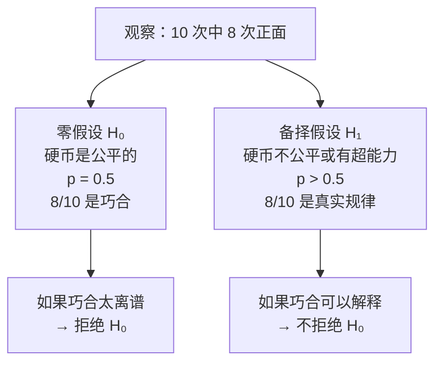
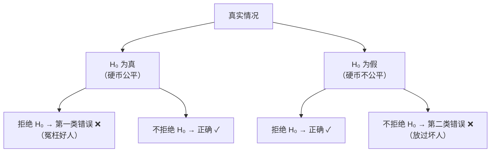

# 假说检验思路

> **所属路径**：`00_高中复习/04_科学思维/02_观察与假设/04_假说检验思路`
> **预计学习时间**：45 分钟
> **难度等级**：⭐⭐

---

## 前置知识

- [提出假设](../02_提出假设/02_提出假设.md) — 能够提出可检验的假设
- [验证思路](../03_验证思路/03_验证思路.md) — 理解正面证据、反面证据和确认偏差
- [古典概率](../../../01_数学基础/09_概率基础/01_古典概率/01_古典概率.md) — 知道"概率"是什么意思
- [平均数中位数众数](../../../01_数学基础/10_统计基础/01_平均数中位数众数/01_平均数中位数众数.md) — 能够计算基本的统计量

> 如果以上内容还不熟悉，建议先完成对应课程再继续。

---

## 学习目标

完成本节后，你将能够：

1. 用自己的话解释"零假设"和"备择假设"的含义
2. 理解"一个结果是否令人惊讶"的直觉——即 $p$ 值的本质
3. 通过硬币模拟实验感受"偶然波动"与"真实规律"的区别
4. 说出假说检验思路与人工智能中 A/B 测试的联系

---

## 正文讲解

### 1. 一个让人纠结的问题

假设你的朋友声称自己有"超能力"，能靠意念控制硬币正面朝上。你让他当场表演，他连续抛了 10 次硬币，结果有 8 次正面朝上。

你心里开始犯嘀咕：

- "8/10 确实很多啊……但也有可能只是运气好吧？"
- "如果换我来抛，也有可能偶尔抛出 8/10 吧？"
- "到底多少次正面才能让我相信他的'超能力'不是靠运气？"

这正是 **假说检验（Hypothesis Testing）** 要回答的核心问题：**观察到的结果，到底是真有规律，还是纯属巧合？**

> ⚠️ **提醒**：本节只介绍假说检验的 **思维框架和直觉**，完整的数学处理将在阶段 01 的 **[概率论与统计](../../../../01_基础能力/02_数学基础/03_概率论与统计/)** 中学习。

### 2. 两个对立的假设

面对"8/10 是超能力还是巧合"的问题，我们先设立两个对立的假设：

**零假设（Null Hypothesis, $H_0$ ）**：没什么特别的，硬币是公平的，正面的概率是 $p = 0.5$ ，8/10 只是随机波动。

**备择假设（Alternative Hypothesis, $H_1$ ）**：有点特别——硬币正面的概率 $p > 0.5$ （不管是超能力还是硬币不公平）。



> 📌 **图解说明**：假说检验的逻辑是先假设"没有特别的事情发生"（零假设），然后看数据是否足以推翻这个假设。

这里有一个关键的思维方式：**我们不是直接证明 $H_1$ 是对的，而是看 $H_0$ 是否说不通。** 如果在"硬币是公平的"前提下，出现 8/10 这种结果的概率非常小，我们就有理由怀疑硬币不是公平的。

这和 **[验证思路](../03_验证思路/03_验证思路.md)** 中"试图推翻"的逻辑一脉相承——我们试图推翻"什么特别的都没发生"这个假设。

### 3. "有多令人惊讶？"—— $p$ 值的直觉

现在核心问题变成：**如果硬币真的是公平的，出现"10 次中至少 8 次正面"的概率有多大？**

这个概率就是传说中的 **$p$ 值（p-value）**。

我们先用直觉估算。一枚公平的硬币抛 10 次：

- 5 正 5 反：很正常，不令人惊讶
- 6 正 4 反：有点偏，但也算常见
- 7 正 3 反：开始有点不寻常了
- 8 正 2 反：这就比较稀少了
- 9 正 1 反：相当罕见
- 10 正 0 反：极其罕见

用组合数学可以精确计算（利用 **[排列组合](../../../01_数学基础/08_排列组合/)** 的知识）：

$$
P(X \geq 8) = P(X=8) + P(X=9) + P(X=10)
$$

其中 $P(X=k) = \binom{10}{k} \times 0.5^{10}$ 。

$$
P(X \geq 8) = \binom{10}{8} \times 0.5^{10} + \binom{10}{9} \times 0.5^{10} + \binom{10}{10} \times 0.5^{10}
$$

$$
= (45 + 10 + 1) \times \dfrac{1}{1024} = \dfrac{56}{1024} \approx 0.055
$$

也就是说，如果硬币真是公平的，出现 8 次或更多正面的概率约为 **5.5%**——不太高，但也不是极其罕见。

### 4. 决策门槛：拒绝还是不拒绝？

有了 $p$ 值，接下来我们需要一个 **判断标准**。科学界常用的标准是：

> 如果 $p$ 值小于 **显著性水平** $\alpha$（通常取 $\alpha = 0.05$ ），就认为结果"足够令人惊讶"，拒绝零假设。

在我们的例子中， $p \approx 0.055 > 0.05$ ，**恰好没有达到拒绝标准**。也就是说：虽然 8/10 看起来很多，但统计上还不足以排除"纯属运气"的可能性。

| $p$ 值范围 | 直觉解读 | 决策 |
| ---------- | -------- | ---- |
| $p > 0.10$ | "这结果一点也不稀奇" | 完全不拒绝 $H_0$ |
| $0.05 < p \leq 0.10$ | "有点意思，但还不够有力" | 谨慎，不拒绝 $H_0$ |
| $0.01 < p \leq 0.05$ | "这结果确实不太寻常" | 拒绝 $H_0$ |
| $p \leq 0.01$ | "这结果非常令人惊讶" | 强烈拒绝 $H_0$ |

> 💡 **重要提醒**：$\alpha = 0.05$ 不是"宇宙法则"，它只是一个被广泛接受的约定。不同领域（比如粒子物理学用 $\alpha = 0.0000003$ ）可能采用不同的标准。

### 5. 两种可能犯的错误

假说检验不能保证 100% 正确。它可能犯两种错误：

| 错误类型 | 含义 | 通俗比喻 |
| -------- | ---- | -------- |
| **第一类错误（假阳性）** | 零假设是对的，但你错误地拒绝了它 | 硬币是公平的，但你冤枉它"不公平" |
| **第二类错误（假阴性）** | 零假设是错的，但你没能拒绝它 | 硬币确实不公平，但你没发现 |



> 📌 **图解说明**：假说检验的四种可能结果。 $\alpha$ 水平越严格，第一类错误越少，但第二类错误可能增多——这是一个权衡。

这两种错误的权衡是统计学的核心课题之一，你将在 **[假设检验](../../../../01_基础能力/02_数学基础/03_概率论与统计/06_假设检验/)** 中深入学习。

### 6. 连接人工智能：A/B 测试和特征选择

假说检验思路在人工智能工程中无处不在：

**A/B 测试**：互联网公司想知道"新版网页是否比旧版带来更多点击"。他们把用户随机分成两组，一组看旧版（对照组），一组看新版（实验组）。然后统计两组的点击率差异，用假说检验判断差异是"真实的"还是"随机波动"。你将在 **[分组对照测试](../../../../03_工程落地/01_人工智能工程化与部署/09_分组对照测试/)** 中详细学习这个流程。

**特征选择**：在训练机器学习模型时，你可能有 100 个候选特征（变量）。为了判断某个特征"是否真的对预测有帮助"，一种方法是对每个特征做假说检验：零假设是"这个特征和目标变量无关"，如果 $p$ 值很小就保留该特征。这个思路在 **[特征选择](../../../../01_基础能力/05_数据能力/03_特征工程/)** 中会进一步展开。

---

## 动手实践

理论说了这么多，让我们用 Python 来"亲手感受"一下。我们通过模拟大量硬币实验来理解"巧合"和"真实规律"的区别。

```python
# 文件：code/hypothesis_testing_intuition.py
# 用硬币模拟实验建立假说检验的直觉
# 环境要求：Python 3.10+

import random

random.seed(42)

# ---- 场景：你的朋友抛了 10 次硬币，8 次正面 ----
# 问题：这是超能力还是巧合？

# ---- 第一步：模拟"公平硬币"的世界 ----
# 如果硬币真的是公平的，抛 10 次，正面次数的分布是怎样的？

n_experiments = 100000  # 模拟 10 万次实验
n_flips = 10            # 每次实验抛 10 枚

results = []
for _ in range(n_experiments):
    heads = sum(1 for _ in range(n_flips) if random.random() < 0.5)
    results.append(heads)

# ---- 第二步：统计各种结果出现的频率 ----
print("如果硬币是公平的，抛 10 次的正面次数分布：")
print(f"{'正面次数':<10} {'出现次数':<12} {'频率':<10} {'直方图'}")
print("-" * 55)

for k in range(11):
    count = results.count(k)
    freq = count / n_experiments
    bar = "█" * int(freq * 200)  # 可视化条形
    marker = " ← 朋友的结果" if k == 8 else ""
    print(f"  {k:<8} {count:<12} {freq:<10.4f} {bar}{marker}")

# ---- 第三步：计算 p 值 ----
extreme_count = sum(1 for r in results if r >= 8)
p_value = extreme_count / n_experiments

print(f"\n正面 ≥ 8 次的实验比例（模拟 p 值）: {p_value:.4f}")
print(f"也就是说，公平硬币出现 ≥8 次正面的概率约为 {p_value:.1%}")

# ---- 第四步：做出判断 ----
alpha = 0.05
print(f"\n判断标准：显著性水平 α = {alpha}")
if p_value < alpha:
    print(f"  p = {p_value:.4f} < {alpha} → 拒绝零假设！")
    print("  结论：有统计证据表明硬币可能不公平。")
else:
    print(f"  p = {p_value:.4f} ≥ {alpha} → 不拒绝零假设。")
    print("  结论：8/10 虽然看起来很多，但还不足以排除运气因素。")

# ---- 第五步：如果是 9/10 呢？ ----
print("\n" + "=" * 55)
print("如果朋友抛出了 9/10 正面呢？")
extreme_count_9 = sum(1 for r in results if r >= 9)
p_value_9 = extreme_count_9 / n_experiments
print(f"  p 值: {p_value_9:.4f}")
if p_value_9 < alpha:
    print(f"  p = {p_value_9:.4f} < {alpha} → 拒绝零假设！")
    print("  结论：9/10 的结果足够"惊人"，值得怀疑硬币的公平性。")
else:
    print(f"  p = {p_value_9:.4f} ≥ {alpha} → 仍然不拒绝零假设。")

# ---- 第六步：可视化"惊讶区间" ----
print("\n" + "=" * 55)
print("直觉总结：")
print(f"  5/10 正面 → 完全正常（p ≈ {sum(1 for r in results if r >= 5)/n_experiments:.2f}）")
print(f"  7/10 正面 → 有点偏  （p ≈ {sum(1 for r in results if r >= 7)/n_experiments:.4f}）")
print(f"  8/10 正面 → 比较少见（p ≈ {sum(1 for r in results if r >= 8)/n_experiments:.4f}）")
print(f"  9/10 正面 → 相当罕见（p ≈ {sum(1 for r in results if r >= 9)/n_experiments:.4f}）")
print(f" 10/10 正面 → 极其罕见（p ≈ {sum(1 for r in results if r >= 10)/n_experiments:.4f}）")
```

**运行说明**：
- 环境要求：Python 3.10+（仅使用标准库）
- 运行命令：`python code/hypothesis_testing_intuition.py`

**预期输出**：
```
如果硬币是公平的，抛 10 次的正面次数分布：
正面次数    出现次数      频率       直方图
-------------------------------------------------------
  0        105          0.0010     
  1        993          0.0099     ██
  2        4340         0.0434     █████████
  3        11675        0.1168     ███████████████████████
  4        20549        0.2055     █████████████████████████████████████████
  5        24611        0.2461     █████████████████████████████████████████████████
  6        20437        0.2044     █████████████████████████████████████████
  7        11821        0.1182     ████████████████████████
  8        4382         0.0438     █████████ ← 朋友的结果
  9        996          0.0100     ██
  10       91           0.0009     

正面 ≥ 8 次的实验比例（模拟 p 值）: 0.0547
也就是说，公平硬币出现 ≥8 次正面的概率约为 5.5%

判断标准：显著性水平 α = 0.05
  p = 0.0547 ≥ 0.05 → 不拒绝零假设。
  结论：8/10 虽然看起来很多，但还不足以排除运气因素。

=======================================================
如果朋友抛出了 9/10 正面呢？
  p 值: 0.0109
  p = 0.0109 < 0.05 → 拒绝零假设！
  结论：9/10 的结果足够"惊人"，值得怀疑硬币的公平性。

=======================================================
直觉总结：
  5/10 正面 → 完全正常（p ≈ 0.62）
  7/10 正面 → 有点偏  （p ≈ 0.1721）
  8/10 正面 → 比较少见（p ≈ 0.0547）
  9/10 正面 → 相当罕见（p ≈ 0.0109）
 10/10 正面 → 极其罕见（p ≈ 0.0009）
```

通过这个模拟，你可以直观地看到：在"公平硬币"的世界里，大部分实验结果集中在 4~6 次正面。8 次正面虽然不多见，但也不是不可能（约 5.5%）；而 9 次和 10 次正面就真的非常罕见了。这就是 $p$ 值的本质——**它告诉你"在零假设成立的情况下，观测到这么极端结果的概率有多小"**。

---

## 典型误区

| 误区 | 正确理解 |
| ---- | -------- |
| "$p$ 值是假设为真的概率" | 错！ $p$ 值是"在零假设成立的前提下，观测到这么极端或更极端结果的概率" |
| "不拒绝 $H_0$ 就意味着 $H_0$ 是对的" | 不拒绝只是说"证据不足以推翻"，不代表 $H_0$ 一定正确 |
| "$p < 0.05$ 就是铁证如山" | $\alpha = 0.05$ 只是约定俗成的标准，5% 的错判概率仍然存在 |
| "样本越大 $p$ 值越小" | 样本量大时，很小的差异也会显著——"统计显著"不等于"实际重要" |

---

## 练习题

### 练习 1：直觉判断（难度：⭐）

你掷一枚骰子 60 次，记录"6"出现的次数。如果骰子公平，"6"出现的期望次数是多少？以下哪个结果最让你怀疑骰子不公平？

A. 出现了 12 次 "6"
B. 出现了 8 次 "6"
C. 出现了 20 次 "6"
D. 出现了 10 次 "6"

<details>
<summary>💡 提示</summary>

公平骰子掷 60 次，"6"出现的期望次数 = $60 \times \dfrac{1}{6} = 10$ 次。偏离期望越远越可疑。

</details>

<details>
<summary>✅ 参考答案</summary>

期望次数为 10 次。

- A（12 次）：比期望多 2 次，偏离不大
- B（8 次）：比期望少 2 次，偏离不大
- C（20 次）：比期望多 10 次，**偏离很大** → 最可疑
- D（10 次）：恰好等于期望，完全不可疑

答案是 **C**。20 次远超期望值，让人强烈怀疑骰子可能被做过手脚。

</details>

### 练习 2：零假设与备择假设（难度：⭐）

某品牌声称其灯泡的平均寿命为 1000 小时。消费者协会怀疑实际寿命不到 1000 小时。请写出这个场景的零假设 $H_0$ 和备择假设 $H_1$ 。

<details>
<summary>💡 提示</summary>

零假设通常是"没有差异"或"等于宣传值"的立场。备择假设是你怀疑的方向。

</details>

<details>
<summary>✅ 参考答案</summary>

$$H_0: \mu = 1000 \text{（灯泡平均寿命等于宣传的 1000 小时）}$$

$$H_1: \mu < 1000 \text{（灯泡平均寿命低于 1000 小时）}$$

这是一个单侧检验，因为消费者协会只关心"是否不到 1000 小时"。

</details>

### 练习 3：修改模拟实验（难度：⭐⭐）

在"动手实践"的代码基础上，修改实验参数：将硬币抛掷次数从 10 次改为 **100 次**，观察你的朋友抛出 **80 次正面**时的 $p$ 值。提示：你只需要修改 `n_flips = 10` 和判断条件中的 8。

<details>
<summary>💡 提示</summary>

修改两处：`n_flips = 100` 和判断 `heads >= 80`。运行后观察 $p$ 值会比 10 次实验时小很多——因为样本量增大后，同样比例的偏差变得更"令人惊讶"。

</details>

<details>
<summary>✅ 参考答案</summary>

修改代码后运行，你会发现：

100 次中 80 次正面（80%）的 $p$ 值接近 $0$（远远小于 0.05）。

这说明：同样是 80% 正面率，10 次中 8 次（$p \approx 0.055$ ）可能只是运气，但 100 次中 80 次（$p \approx 0$ ）几乎不可能是巧合。**样本量越大，同样的偏差越有统计意义。**

```python
import random
random.seed(42)
n_experiments = 100000
n_flips = 100
extreme = sum(
    1 for _ in range(n_experiments)
    if sum(1 for _ in range(n_flips) if random.random() < 0.5) >= 80
)
print(f"p 值 ≈ {extreme / n_experiments:.6f}")
# 输出: p 值 ≈ 0.000000（10 万次模拟中没有一次达到 80）
```

</details>

### 练习 4：生活中的假说检验（难度：⭐⭐）

你注意到某家奶茶店的队伍总是很长。你的朋友说"这家一定比别家好喝"。请用假说检验的思路分析：零假设是什么？需要收集什么数据？什么样的结果能让你拒绝零假设？

<details>
<summary>💡 提示</summary>

"队伍长"不一定是因为"好喝"——可能是因为位置好、价格低、出杯慢等原因。零假设应该是"这家奶茶和其他店在口味上没有显著差异"。

</details>

<details>
<summary>✅ 参考答案</summary>

**零假设 $H_0$**：这家奶茶店的口味评分与同商圈其他奶茶店没有显著差异。

**备择假设 $H_1$**：这家奶茶店的口味评分显著高于其他店。

**需要收集的数据**：
- 随机选择 30+ 名顾客，让他们 **盲评**（不知道品牌的情况下）品尝这家和其他 2-3 家奶茶店的产品
- 每人对每家店打 1-10 的口味评分

**判断标准**：
- 计算这家店的平均评分与其他店的平均评分差异
- 如果 $p < 0.05$ ，说明差异大概率不是巧合，拒绝 $H_0$
- 如果 $p \geq 0.05$ ，说明排队长可能另有原因（位置、价格、社交媒体效应等）

**额外注意**：即使口味确实好，也要排除"出杯慢导致排队长"的混杂因素——这联系到 **[干扰因素](../../01_变量与控制/03_干扰因素/03_干扰因素.md)** 中学到的知识。

</details>

---

## 下一步学习

- 📖 下一个主题：[相关与因果](../../03_相关与因果/) — 学会区分"两件事有关联"和"一件事导致另一件事"
- 🔗 相关知识点：[概率基础](../../../01_数学基础/09_概率基础/) — 为假说检验提供数学工具
- 🔗 相关知识点：[统计基础](../../../01_数学基础/10_统计基础/) — 描述性统计是假说检验的前置
- 📚 拓展阅读（阶段 01）：[假设检验](../../../../01_基础能力/02_数学基础/03_概率论与统计/06_假设检验/) — 完整的统计假设检验方法

---

## 参考资料

1. [Khan Academy — Hypothesis Testing](https://www.khanacademy.org/math/statistics-probability/significance-tests-one-sample) — 可汗学院的假设检验入门课程（CC BY-NC-SA 许可）
2. [Seeing Theory — Frequentist Inference](https://seeing-theory.brown.edu/frequentist-inference/index.html) — 布朗大学的可视化统计教程，可交互体验 $p$ 值（公开教育资源）
3. [Wikipedia — Statistical hypothesis testing](https://en.wikipedia.org/wiki/Statistical_hypothesis_testing) — 假设检验概述（公共知识库）
4. [Python 官方文档 — random 模块](https://docs.python.org/zh-cn/3/library/random.html) — 本节代码使用的随机数生成器（官方文档）
