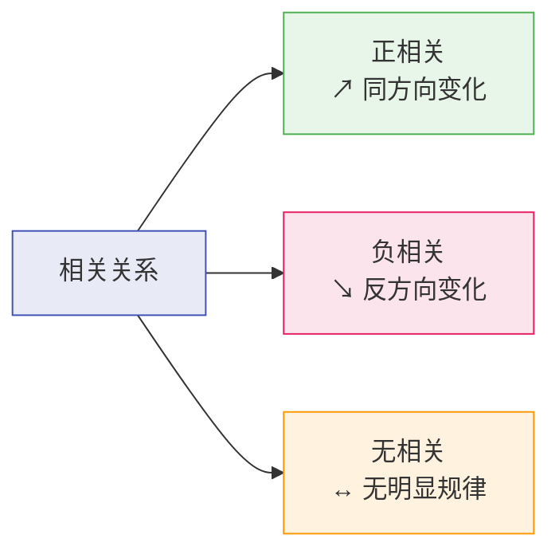
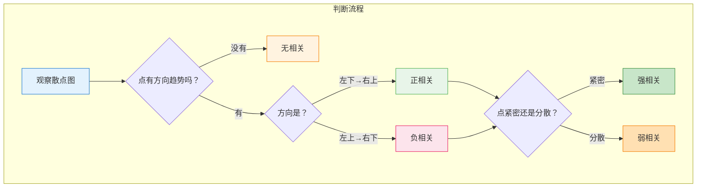

# 相关关系

> **所属路径**：`00_高中复习/04_科学思维/03_相关与因果/01_相关关系`
> **预计学习时间**：35 分钟
> **难度等级**：⭐

---

## 前置知识

- [自变量与因变量](../../01_变量与控制/01_自变量与因变量/01_自变量与因变量.md) — 知道什么是变量，以及变量之间可能存在关系
- [现象记录](../../02_观察与假设/01_现象记录/01_现象记录.md) — 知道如何记录观察到的数据和现象

> 如果以上内容还不熟悉，建议先完成对应课程再继续。

---

## 学习目标

完成本节后，你将能够：

1. 解释什么是相关关系，并区分正相关、负相关和无相关
2. 用散点图直观判断两个变量之间的相关方向和强度
3. 理解相关系数的直觉含义（不需要手算公式）
4. 用 Python 生成相关数据并计算相关系数
5. 说明相关分析在人工智能中的初步应用场景

---

## 正文讲解

### 1. 从生活中的"一起变化"说起

你有没有注意到这些现象？

- 气温越高的天，冰淇淋的销量往往越高
- 一个学生花在复习上的时间越长，考试成绩通常越好
- 一个人的身高越高，鞋码往往越大

这些现象有一个共同特点：**两个事物在变化时，似乎有某种"步调一致"的关系**。当一个变大时，另一个也跟着变大（或变小）。这种"两个变量之间存在某种关联"的现象，就是我们今天要学的 **相关关系（Correlation）** 。

但要注意：相关关系只是告诉我们"它们的变化之间有联系"，至于是不是一个 *导致* 了另一个，那是另一个故事——我们将在 **[因果关系](../02_因果关系/02_因果关系.md)** 中详细讨论。

### 2. 三种基本类型：正相关、负相关、无相关

相关关系按照"变化的方向"可以分为三种：

**正相关（Positive Correlation）** ：一个变量增大时，另一个也倾向于增大。例如身高与体重——通常越高的人越重。

**负相关（Negative Correlation）** ：一个变量增大时，另一个倾向于减小。例如海拔与气温——海拔越高，气温通常越低。

**无相关（No Correlation）** ：一个变量的变化与另一个变量的变化之间没有明显的规律。例如一个人的鞋码与他的数学成绩——这两者之间很难找到规律。



> 📌 **图解说明**：相关关系按变化方向分为三类。正相关像两个人手拉手向右上走；负相关像跷跷板——一头上另一头下；无相关则像两个各走各路的人。

### 3. 散点图：一眼看出相关关系

判断两个变量是否相关，最直观的工具就是 **散点图（Scatter Plot）** 。在散点图上，每个数据点用横坐标表示一个变量的值，纵坐标表示另一个变量的值。

想一想：如果你把全班同学的"每周锻炼时间"作为横轴，"体能测试成绩"作为纵轴，画出散点图后：

- 如果点大致从左下到右上排列——**正相关**
- 如果点大致从左上到右下排列——**负相关**
- 如果点散落一地，看不出方向——**无相关**

除了方向，散点图还能告诉我们"相关的强度"：如果数据点紧密地聚集在一条直线附近，说明相关性很强；如果数据点分散得很开，说明相关性很弱。



> 📌 **图解说明**：通过散点图判断相关关系的流程——先看有没有方向趋势，再看方向，最后看数据点的紧密程度。

### 4. 相关系数：给"相关程度"打个分

光看散点图有时不够精确——"有点相关"和"非常相关"之间差多少？为了量化相关关系的强度和方向，统计学家发明了 **相关系数（Correlation Coefficient）** ，最常用的是 **皮尔逊相关系数（Pearson Correlation Coefficient）** ，通常用字母 $r$ 表示。

$r$ 的取值范围是 $-1$ 到 $+1$ ：

$$
-1 \leq r \leq +1
$$

它的直觉含义是：

| $r$ 的值 | 含义 |
| -------- | ---- |
| $r = +1$ | 完美正相关：所有点精确排列在一条向右上倾斜的直线上 |
| $r = -1$ | 完美负相关：所有点精确排列在一条向右下倾斜的直线上 |
| $r = 0$ | 完全无线性相关 |
| $0 < r < 1$ | 正相关，越接近 1 越强 |
| $-1 < r < 0$ | 负相关，越接近 -1 越强 |

> **直觉解读**：你可以把 $r$ 想象成一个"评分"。 $r = 0.9$ 意味着"几乎可以用一条直线来描述两个变量的关系"； $r = 0.2$ 意味着"有一点点趋势，但噪声太多了"； $r = 0$ 意味着"完全看不出线性关系"。

在阶段 00 我们不需要记忆皮尔逊相关系数的计算公式——Python 一行代码就能帮我们算出来。重要的是理解它的含义：方向和强度。

> 💡 **想一想**：如果两个变量的相关系数 $r = -0.85$ ，这说明什么？答案：它们是强负相关——一个增大时，另一个明显减小，而且这种趋势非常一致。

### 5. 相关关系与人工智能

在人工智能中，相关分析是数据探索的重要工具。在训练模型之前，数据科学家通常会先做 **[探索性数据分析](../../../../01_基础能力/05_数据能力/08_探索性数据分析/)** ，其中一个关键步骤就是计算各个特征之间以及特征与目标变量之间的相关系数。

比如你要预测房价，手上有"面积"、"房间数"、"距地铁距离"等特征。通过计算相关系数，你可能发现"面积"与房价的相关系数高达 $r = 0.88$ ，而"距地铁距离"与房价的相关系数为 $r = -0.45$ 。这些信息帮助你初步判断哪些特征可能对预测有用。

但请始终记住：**相关不等于因果**。即使两个变量高度相关，也不一定意味着一个导致了另一个。我们将在下一节深入讨论这个至关重要的区别。

---

## 动手实践

下面我们用 Python 来生成不同类型的相关数据，计算相关系数，并通过打印输出来"看到"相关关系。

```python
# 文件：code/correlation_demo.py
# 演示正相关、负相关、无相关的数据生成与相关系数计算
# 环境要求：Python 3.10+（仅使用标准库和内置函数概念）

import random
import math

random.seed(42)

def mean(data):
    """计算平均值"""
    return sum(data) / len(data)

def correlation(x, y):
    """计算皮尔逊相关系数（简化实现）"""
    n = len(x)
    mean_x, mean_y = mean(x), mean(y)
    numerator = sum((x[i] - mean_x) * (y[i] - mean_y) for i in range(n))
    denom_x = math.sqrt(sum((xi - mean_x) ** 2 for xi in x))
    denom_y = math.sqrt(sum((yi - mean_y) ** 2 for yi in y))
    if denom_x == 0 or denom_y == 0:
        return 0
    return numerator / (denom_x * denom_y)

def mini_scatter(x, y, width=40, height=15):
    """用字符在终端中画一个简易散点图"""
    min_x, max_x = min(x), max(x)
    min_y, max_y = min(y), max(y)
    range_x = max_x - min_x if max_x != min_x else 1
    range_y = max_y - min_y if max_y != min_y else 1
    grid = [[' ' for _ in range(width)] for _ in range(height)]
    for xi, yi in zip(x, y):
        col = int((xi - min_x) / range_x * (width - 1))
        row = int((1 - (yi - min_y) / range_y) * (height - 1))
        row = max(0, min(height - 1, row))
        col = max(0, min(width - 1, col))
        grid[row][col] = '*'
    print("  +" + "-" * width + "+")
    for row in grid:
        print("  |" + "".join(row) + "|")
    print("  +" + "-" * width + "+")

# --- 场景 1：正相关（学习时间 vs 考试成绩）---
print("=" * 50)
print("场景 1：正相关（学习时间 vs 考试成绩）")
print("=" * 50)
study_hours = [random.uniform(1, 10) for _ in range(30)]
scores = [h * 8 + 20 + random.gauss(0, 5) for h in study_hours]
r1 = correlation(study_hours, scores)
print(f"相关系数 r = {r1:.3f}")
print("散点图（横轴：学习时间，纵轴：考试成绩）：")
mini_scatter(study_hours, scores)

# --- 场景 2：负相关（海拔 vs 气温）---
print(f"\n{'=' * 50}")
print("场景 2：负相关（海拔 vs 气温）")
print("=" * 50)
altitude = [random.uniform(0, 5000) for _ in range(30)]
temperature = [30 - 0.006 * a + random.gauss(0, 2) for a in altitude]
r2 = correlation(altitude, temperature)
print(f"相关系数 r = {r2:.3f}")
print("散点图（横轴：海拔/米，纵轴：气温/°C）：")
mini_scatter(altitude, temperature)

# --- 场景 3：无相关（鞋码 vs 数学成绩）---
print(f"\n{'=' * 50}")
print("场景 3：无相关（鞋码 vs 数学成绩）")
print("=" * 50)
shoe_size = [random.uniform(36, 46) for _ in range(30)]
math_score = [random.uniform(40, 100) for _ in range(30)]
r3 = correlation(shoe_size, math_score)
print(f"相关系数 r = {r3:.3f}")
print("散点图（横轴：鞋码，纵轴：数学成绩）：")
mini_scatter(shoe_size, math_score)

# --- 总结 ---
print(f"\n{'=' * 50}")
print("总结")
print("=" * 50)
print(f"正相关示例 r = {r1:.3f}  （接近 +1）")
print(f"负相关示例 r = {r2:.3f}  （接近 -1）")
print(f"无相关示例 r = {r3:.3f}  （接近  0）")
```

**运行说明**：
- 环境要求：Python 3.10+（仅使用标准库 `random` 和 `math`）
- 运行命令：`python code/correlation_demo.py`

**预期输出**（数值因随机种子固定而确定，散点图为字符画）：
```
==================================================
场景 1：正相关（学习时间 vs 考试成绩）
==================================================
相关系数 r = 0.985
散点图（横轴：学习时间，纵轴：考试成绩）：
  +----------------------------------------+
  |                                   *  * |
  |                                 *      |
  |                              **        |
  |                          * *           |
  |                        *               |
  ...
==================================================
总结
==================================================
正相关示例 r = 0.985  （接近 +1）
负相关示例 r = -0.994  （接近 -1）
无相关示例 r = -0.057  （接近  0）
```

从运行结果中可以直观看到：正相关的散点图从左下到右上排列，负相关从左上到右下，无相关则散落一地。相关系数精确地量化了我们从散点图中感受到的趋势。

---

## 典型误区

| 误区 | 正确理解 |
| ---- | -------- |
| "相关系数为 0 就说明两个变量完全没有关系" | 相关系数衡量的是 **线性** 相关。两个变量可能存在非线性关系（如抛物线），此时 $r$ 可能接近 0，但它们确实有关系 |
| "相关系数越大就越好" | $r$ 的正负表示方向，绝对值表示强度。 $r = -0.9$ 比 $r = 0.3$ 的相关性强得多 |
| "看到相关就能说因果" | **这是最危险的误区**。相关只描述"共同变化"，不能证明"一个导致另一个"。详见下一节 **[因果关系](../02_因果关系/02_因果关系.md)** |

---

## 练习题

### 练习 1：判断相关类型（难度：⭐）

以下场景分别是正相关、负相关还是无相关？

1. 汽车速度越快，到达目的地所需时间越短
2. 一个人的血型与他喜欢的音乐类型
3. 气温越高，取暖费用越低

<details>
<summary>💡 提示</summary>

想一想：当一个变量增大时，另一个是增大、减小、还是没有规律？

</details>

<details>
<summary>✅ 参考答案</summary>

1. **负相关**——速度增大，时间减小
2. **无相关**——血型和音乐偏好之间没有已知的规律
3. **负相关**——气温升高，取暖需求降低，费用减少

</details>

### 练习 2：解读相关系数（难度：⭐）

某研究计算了以下相关系数，请按相关强度从强到弱排序：

- A 组： $r = 0.45$
- B 组： $r = -0.82$
- C 组： $r = 0.91$
- D 组： $r = -0.12$

<details>
<summary>💡 提示</summary>

相关强度看的是 $r$ 的 **绝对值** ，不看正负号。正负号只表示方向。

</details>

<details>
<summary>✅ 参考答案</summary>

按绝对值排序：C 组 $|r| = 0.91$ > B 组 $|r| = 0.82$ > A 组 $|r| = 0.45$ > D 组 $|r| = 0.12$

所以从强到弱为：**C > B > A > D**

注意 B 组虽然是负数，但相关性比 A 组更强。

</details>

### 练习 3：代码实践（难度：⭐⭐）

修改上面的 Python 代码，模拟一个"中等正相关"（ $r$ 大约在 0.5 左右）的场景。提示：增大随机噪声的标准差。

<details>
<summary>💡 提示</summary>

在 `random.gauss(0, 5)` 中，第二个参数是噪声的标准差。把它调大（比如 20 或 30），相关性就会变弱。

</details>

<details>
<summary>✅ 参考答案</summary>

将场景 1 中的噪声标准差从 5 调大到约 20：

```python
scores = [h * 8 + 20 + random.gauss(0, 20) for h in study_hours]
```

重新运行后，相关系数会下降到 0.5 左右。这说明当噪声增大时，线性趋势被"淹没"，相关性减弱。

</details>

---

## 下一步学习

- 📖 下一个知识点：[因果关系](../02_因果关系/02_因果关系.md) — 了解"相关不等于因果"这一科学思维的核心原则
- 🔗 相关知识点：[统计基础](../../../01_数学基础/10_统计基础/) — 更系统地学习均值、方差等统计量
- 🔗 相关知识点：[图表与证据](../../04_图表与证据/) — 学习如何用图表呈现证据

---

## 参考资料

1. [Statistics - Correlation（W3Schools）](https://www.w3schools.com/statistics/statistics_correlation.php) — 交互式在线教程，配有可动手操作的练习（公开教程）
2. [Seeing Theory - Correlation](https://seeing-theory.brown.edu/) — 布朗大学可视化统计学教程，通过动画直观理解相关性（开源项目，CC BY-NC-SA 4.0）
3. [Python 官方文档 - random 模块](https://docs.python.org/3/library/random.html) — 本节代码中使用的随机数生成函数参考（官方文档）
