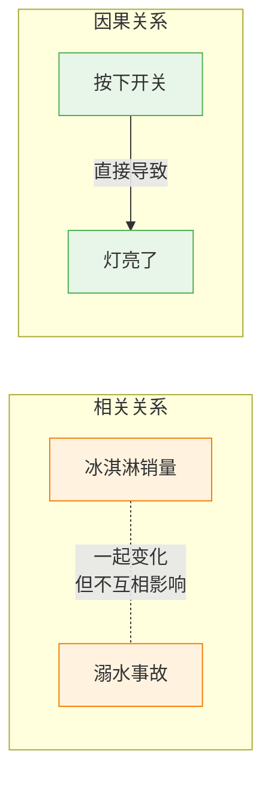
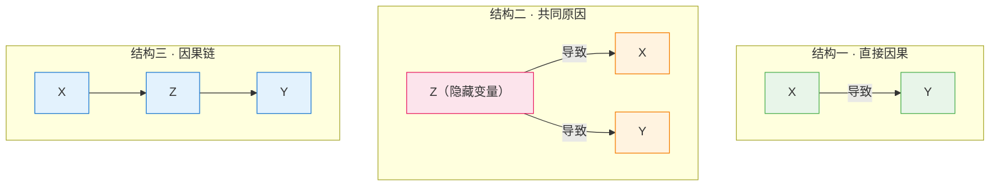

# 因果关系

> **所属路径**：`00_高中复习/04_科学思维/03_相关与因果/02_因果关系`
> **预计学习时间**：40 分钟
> **难度等级**：⭐⭐

---

## 前置知识

- [相关关系](../01_相关关系/01_相关关系.md) — 知道什么是正相关、负相关和无相关，理解相关系数的含义
- [控制变量](../../01_变量与控制/02_控制变量/02_控制变量.md) — 知道为什么实验中要保持其他因素不变
- [干扰因素](../../01_变量与控制/03_干扰因素/03_干扰因素.md) — 知道隐藏变量可能干扰我们的判断

> 如果以上内容还不熟悉，建议先完成对应课程再继续。

---

## 学习目标

完成本节后，你将能够：

1. 解释因果关系的定义，并说出它与相关关系的根本区别
2. 用"反事实"的思路判断两个变量之间是否有因果关系
3. 列出建立因果关系的基本条件
4. 用 Python 模拟两种不同的因果结构，观察它们产生的相关性
5. 说明为什么机器学习模型学到的是相关性而非因果性

---

## 正文讲解

### 1. 一个让人困惑的现象

在上一节我们学到，冰淇淋的销量和溺水事故数量之间呈现出很强的 **[正相关](../01_相关关系/01_相关关系.md)** ——冰淇淋卖得越多的月份，溺水事故往往也越多。

那么，是冰淇淋导致了溺水吗？当然不是！那反过来呢——是溺水事故促进了冰淇淋销售？更不可能。

这里的"秘密"在于，有一个隐藏的第三者——**气温**。夏天气温高，人们既更想吃冰淇淋，也更多地去游泳（从而增加了溺水风险）。冰淇淋和溺水之间看起来有"关联"，但它们并没有互相影响。

这个例子完美地展示了今天的核心主题：**相关不等于因果（Correlation does not imply causation）** 。

### 2. 什么是因果关系

**因果关系（Causation / Causal Relationship）** 是指一个事件（原因）直接导致了另一个事件（结果）的发生。用更精确的方式说：

> 如果 A 是 B 的原因，那么当 A 发生变化时（在其他条件不变的情况下），B 会随之发生可预测的变化；而如果 A 没有发生，B 也不会以同样的方式发生。

这种"如果 A 没发生会怎样"的思考方式，叫做 **反事实思维（Counterfactual Thinking）** ，它是判断因果关系的黄金标准。

让我们对比一下相关关系和因果关系：



> 📌 **图解说明**：左侧是纯相关——两个变量一起变化但没有因果箭头。右侧是因果关系——存在一个从原因到结果的直接箭头。虚线表示"看起来有关联"，实线箭头表示"实际导致"。

### 3. 建立因果关系的条件

在科学研究中，要确认 A 导致了 B，通常需要满足以下条件：

| 条件 | 说明 | 例子 |
| ---- | ---- | ---- |
| **时间先后** | 原因必须发生在结果之前 | 先服药，后退烧 |
| **共变关系** | 原因变化时，结果也随之变化（即存在相关性） | 增加药量，退烧更快 |
| **排除替代解释** | 不能有其他因素同时解释这种变化 | 排除"恰好这天天气变凉"等干扰 |

注意第三个条件——它是最难满足的，也是相关关系经常被误认为因果关系的根本原因。在 **[干扰因素](../../01_变量与控制/03_干扰因素/03_干扰因素.md)** 那节中，我们已经初步接触了这个问题。

> 💡 **想一想**：你能想到一个满足"时间先后"和"共变关系"但不满足"排除替代解释"的例子吗？提示：公鸡打鸣和太阳升起。

### 4. 三种常见的因果结构

在现实中，两个变量 $X$ 和 $Y$ 之间的关系可以有多种底层结构。以下三种最为常见：

**结构一：直接因果（ $X \to Y$ ）**

$X$ 直接导致 $Y$ 。例如：按下开关 → 灯亮。

**结构二：共同原因（ $X \leftarrow Z \to Y$ ）**

$X$ 和 $Y$ 都是由第三个变量 $Z$ 造成的，它们之间并没有直接的因果关系，但在数据中会呈现出相关性。例如：气温（ $Z$ ）同时导致冰淇淋销量（ $X$ ）上升和溺水事故（ $Y$ ）增多。

**结构三：因果链（ $X \to Z \to Y$ ）**

$X$ 通过中间变量 $Z$ 间接影响 $Y$ 。例如：下雨（ $X$ ）→ 路滑（ $Z$ ）→ 车祸增多（ $Y$ ）。



> 📌 **图解说明**：三种因果结构。关键区别在于箭头的方向和有没有隐藏的第三个变量。**结构二（共同原因）** 是最容易被误认为直接因果的情况——你会在后面的 **[伪相关案例](../03_伪相关案例/03_伪相关案例.md)** 中看到更多例子。

### 5. 为什么机器学习模型只学到相关性

这里有一个对人工智能非常重要的洞察：**机器学习模型本质上是在历史数据中寻找相关性的工具，它并不理解因果关系。**

想象你训练了一个图像识别模型来判断"照片中的动物是不是牛"。如果你的训练数据中，所有牛的照片背景都是绿色的草地，模型可能会"学到"一个捷径：**看到绿色背景就判断是牛**。这不是因为绿色导致了牛的存在，而是训练数据中恰好存在这种相关性。当模型遇到一张白色雪地上的牛时，它可能就会判断错误。

这种现象在人工智能中被称为 **捷径学习（Shortcut Learning）** 或 **虚假相关（Spurious Correlation）** ——模型抓住了数据中不可靠的相关性，而不是真正的因果特征。

这就是为什么理解因果关系对 AI 实践者至关重要：我们需要知道模型可能会犯什么样的错误，并想办法通过更好的数据和实验设计来减少这种风险。

---

## 动手实践

下面用 Python 模拟上面讲的两种因果结构——"直接因果"和"共同原因"，观察它们在数据中产生的相关性。

```python
# 文件：code/causation_demo.py
# 演示直接因果 vs 共同原因两种结构都能产生相关性
# 环境要求：Python 3.10+（仅使用标准库）

import random
import math

random.seed(42)

def mean(data):
    return sum(data) / len(data)

def correlation(x, y):
    n = len(x)
    mx, my = mean(x), mean(y)
    num = sum((x[i] - mx) * (y[i] - my) for i in range(n))
    dx = math.sqrt(sum((xi - mx) ** 2 for xi in x))
    dy = math.sqrt(sum((yi - my) ** 2 for yi in y))
    if dx == 0 or dy == 0:
        return 0
    return num / (dx * dy)

n = 200

# === 场景 1：直接因果（X → Y）===
# 施肥量直接影响产量
print("=" * 55)
print("场景 1：直接因果（施肥量 → 产量）")
print("=" * 55)
fertilizer = [random.uniform(0, 100) for _ in range(n)]
# 产量 = 施肥量的函数 + 噪声
crop_yield = [0.5 * f + 20 + random.gauss(0, 5) for f in fertilizer]
r1 = correlation(fertilizer, crop_yield)
print(f"施肥量与产量的相关系数 r = {r1:.3f}")
print("解读：存在正相关——但这次是真正的因果关系！")
print("       增加施肥量确实会导致产量增加。\n")

# === 场景 2：共同原因（X ← Z → Y）===
# Z = 气温，同时影响冰淇淋销量（X）和溺水事故（Y）
print("=" * 55)
print("场景 2：共同原因（气温 → 冰淇淋 & 气温 → 溺水）")
print("=" * 55)
temperature = [random.uniform(5, 40) for _ in range(n)]
# 冰淇淋销量受气温驱动
icecream = [3 * t + 10 + random.gauss(0, 8) for t in temperature]
# 溺水事故数也受气温驱动
drowning = [0.5 * t - 5 + random.gauss(0, 2) for t in temperature]
r2 = correlation(icecream, drowning)
print(f"冰淇淋销量与溺水事故的相关系数 r = {r2:.3f}")
print("解读：看起来也高度正相关——但这不是因果！")
print("       是因为它们有共同的原因（气温）。\n")

# === 关键对比 ===
print("=" * 55)
print("关键对比")
print("=" * 55)
print(f"场景 1（直接因果）相关系数：r = {r1:.3f}")
print(f"场景 2（共同原因）相关系数：r = {r2:.3f}")
print()
print("两个场景都产生了很强的正相关！")
print("但场景 1 中施肥量真的导致了产量变化，")
print("而场景 2 中冰淇淋和溺水之间没有任何因果关系。")
print()
print("教训：仅看相关系数，无法区分这两种结构。")
print("      这就是'相关不等于因果'的核心含义。")

# === 验证：控制气温后，冰淇淋和溺水的相关性消失 ===
print(f"\n{'=' * 55}")
print("验证：如果我们'控制'气温（只看相近温度的数据）...")
print("=" * 55)
# 只取气温在 25-30 度之间的数据
filtered = [(ic, dr) for t, ic, dr in zip(temperature, icecream, drowning)
            if 25 <= t <= 30]
if len(filtered) > 5:
    ic_f, dr_f = zip(*filtered)
    r3 = correlation(list(ic_f), list(dr_f))
    print(f"控制气温在 25-30°C 后的相关系数 r = {r3:.3f}")
    print(f"样本量：{len(filtered)}")
    print("相关性大幅下降！说明原来的相关性是气温造成的。")
else:
    print("筛选后样本量不足，请扩大数据量重试。")
```

**运行说明**：
- 环境要求：Python 3.10+（仅使用标准库 `random` 和 `math`）
- 运行命令：`python code/causation_demo.py`

**预期输出**：
```
=======================================================
场景 1：直接因果（施肥量 → 产量）
=======================================================
施肥量与产量的相关系数 r = 0.984
解读：存在正相关——但这次是真正的因果关系！
       增加施肥量确实会导致产量增加。

=======================================================
场景 2：共同原因（气温 → 冰淇淋 & 气温 → 溺水）
=======================================================
冰淇淋销量与溺水事故的相关系数 r = 0.960
解读：看起来也高度正相关——但这不是因果！
       是因为它们有共同的原因（气温）。

=======================================================
关键对比
=======================================================
场景 1（直接因果）相关系数：r = 0.984
场景 2（共同原因）相关系数：r = 0.960

两个场景都产生了很强的正相关！
但场景 1 中施肥量真的导致了产量变化，
而场景 2 中冰淇淋和溺水之间没有任何因果关系。

教训：仅看相关系数，无法区分这两种结构。
      这就是'相关不等于因果'的核心含义。

=======================================================
验证：如果我们'控制'气温（只看相近温度的数据）...
=======================================================
控制气温在 25-30°C 后的相关系数 r = 0.115
样本量：28
相关性大幅下降！说明原来的相关性是气温造成的。
```

这段代码最精彩的部分是最后的验证：当我们"控制住"气温（只看气温相近的数据）后，冰淇淋和溺水之间的相关性急剧下降。这正是 **[控制变量](../../01_变量与控制/02_控制变量/02_控制变量.md)** 思想在数据分析中的直接应用。

---

## 典型误区

| 误区 | 正确理解 |
| ---- | -------- |
| "两个变量高度相关就说明有因果关系" | **这是最经典的逻辑错误。** 相关只说明"共同变化"，可能是因果，也可能是共同原因或纯粹巧合 |
| "做了很多次实验都显示 A 和 B 相关，所以 A 一定导致了 B" | 重复观察到的相关性仍然不能证明因果。要证明因果，需要进行 **控制实验** ——主动操控 A 并观察 B 是否变化，同时排除其他因素 |
| "因果关系一定能在数据中看到相关性" | 大多数情况下是的，但因果效应可能被其他变量掩盖，导致数据中反而看不到相关性（这正是辛普森悖论的核心，见 **[辛普森悖论与混杂](../04_辛普森悖论与混杂/04_辛普森悖论与混杂.md)** ） |

---

## 练习题

### 练习 1：判断因果还是相关（难度：⭐）

以下哪些是因果关系，哪些仅仅是相关关系？

1. 运动量增加 → 心肺功能提高
2. 手掌大的人数学成绩好
3. 吸烟 → 肺癌风险增加
4. 城市的消防员人数越多，火灾损失越大

<details>
<summary>💡 提示</summary>

对于每一条，问自己："如果我改变了前者（其他条件不变），后者会不会随之改变？有没有隐藏的第三个因素？"

</details>

<details>
<summary>✅ 参考答案</summary>

1. **因果关系**——运动直接提高心肺功能，有大量控制实验支持
2. **仅相关**——手掌大 → 可能年龄更大 → 数学学习时间更长。隐藏变量是年龄
3. **因果关系**——大量控制研究（流行病学证据）证实吸烟导致肺癌
4. **仅相关**——隐藏变量是城市规模。大城市消防员多，火灾也多，但消防员不是火灾的原因

</details>

### 练习 2：设计验证方案（难度：⭐⭐）

有人说："喝咖啡的人工作效率更高，所以咖啡能提高工作效率。"请指出这个结论的问题，并设计一个简单的实验来验证。

<details>
<summary>💡 提示</summary>

想想有哪些隐藏变量可能同时影响"喝咖啡"和"工作效率"。然后想想如何用 **[控制变量](../../01_变量与控制/02_控制变量/02_控制变量.md)** 法来排除它们。

</details>

<details>
<summary>✅ 参考答案</summary>

**问题**：可能的隐藏变量包括——工作压力大的人既更倾向于喝咖啡，也因为工作动力更强而效率更高。所以"喝咖啡"和"工作效率"可能只是相关，共同原因是工作压力。

**实验设计**：
1. 招募一组工作性质相似的志愿者
2. 随机分为两组：一组喝咖啡，一组喝口感相似但不含咖啡因的饮品（安慰剂）
3. 两组在相同条件下工作，测量工作效率
4. 比较两组的效率差异

关键是 **随机分组** 和 **安慰剂对照** ——这样可以排除"自我选择"这个干扰因素。

</details>

### 练习 3：代码探索（难度：⭐⭐）

修改上面代码中的"共同原因"场景：将气温的范围从 `(5, 40)` 缩小到 `(20, 25)` ，观察冰淇淋与溺水之间的相关系数会如何变化。为什么？

<details>
<summary>💡 提示</summary>

当气温变化范围缩小时，由气温驱动的冰淇淋和溺水的变化也会缩小，随机噪声的占比就会增大。

</details>

<details>
<summary>✅ 参考答案</summary>

将 `random.uniform(5, 40)` 改为 `random.uniform(20, 25)` 后，相关系数会显著下降（通常降到 0.3 以下）。

原因：气温范围缩小后，它对冰淇淋和溺水的驱动力减弱，随机噪声的影响变得更大。这再次证明——两者的相关性是气温驱动的，而非它们之间的直接关系。这和最后"控制气温"的验证本质上是同一个道理。

</details>

---

## 下一步学习

- 📖 下一个知识点：[伪相关案例](../03_伪相关案例/03_伪相关案例.md) — 看看现实世界中有多少令人啼笑皆非的虚假相关
- 🔗 相关知识点：[干扰因素](../../01_变量与控制/03_干扰因素/03_干扰因素.md) — 复习隐藏变量如何干扰我们的判断
- 🔗 相关知识点：[概率基础](../../../01_数学基础/09_概率基础/) — 条件概率是理解因果推理的数学基础

---

## 参考资料

1. [Correlation vs Causation — Towards Data Science](https://towardsdatascience.com/correlation-is-not-causation-ae05d03c1f53) — 通俗讲解相关与因果区别的技术博文（公开技术博客）
2. [Spurious Correlations（Tyler Vigen）](https://www.tylervigen.com/spurious-correlations) — 收集了大量真实世界的伪相关案例，非常有趣（公开网站）
3. [维基百科 - 因果关系](https://zh.wikipedia.org/wiki/%E5%9B%A0%E6%9E%9C%E5%85%B3%E7%B3%BB) — 因果关系的百科式介绍（公共知识库）
