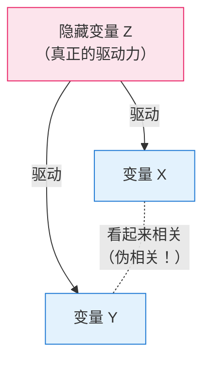
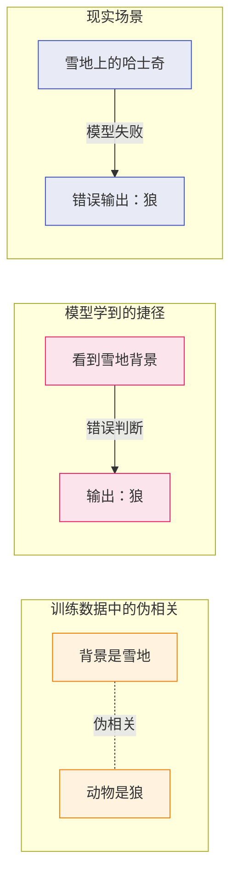

# 伪相关案例

> **所属路径**：`00_高中复习/04_科学思维/03_相关与因果/03_伪相关案例`
> **预计学习时间**：40 分钟
> **难度等级**：⭐⭐

---

## 前置知识

- [相关关系](../01_相关关系/01_相关关系.md) — 知道什么是正相关和相关系数
- [因果关系](../02_因果关系/02_因果关系.md) — 理解"相关不等于因果"的原则，知道共同原因结构

> 如果以上内容还不熟悉，建议先完成对应课程再继续。

---

## 学习目标

完成本节后，你将能够：

1. 用自己的话解释什么是伪相关，以及它产生的常见原因
2. 列举至少 3 个真实世界的伪相关案例，并识别其中的隐藏变量
3. 用 Python 模拟隐藏变量导致伪相关的过程
4. 说明伪相关在人工智能中的危害（虚假特征和捷径学习）

---

## 正文讲解

### 1. 一个荒唐的发现：尼古拉斯·凯奇和游泳池

如果有人告诉你，美国演员尼古拉斯·凯奇每年拍的电影数量和每年美国游泳池溺亡人数高度相关（ $r = 0.87$ ），你会怎么想？

你的第一反应大概是："这也太荒谬了吧？"没错，这确实荒谬。尼古拉斯·凯奇拍不拍电影，跟谁会在游泳池溺亡，显然没有任何关系。

但数据确实显示了很强的相关性。这类看起来有统计关联、实际上毫无因果关系的现象，就叫做 **伪相关（Spurious Correlation）** 。

这个例子来自 Tyler Vigen 的著名网站 "Spurious Correlations"，该网站收集了大量类似的荒诞案例。它们的存在提醒我们一个重要事实：**在足够大的数据中，你几乎总能找到一些"看起来相关"的变量对——但其中大部分只是巧合。**

### 2. 更多经典伪相关案例

让我们再看几个广为流传的案例：

| 变量 A | 变量 B | 看起来的关系 | 真相 |
| ------ | ------ | ------------ | ---- |
| 冰淇淋销量 | 溺水事故 | 正相关 | 隐藏变量：**气温** 。夏天气温高，冰淇淋卖得多，游泳的人也多 |
| 巧克力消费量 | 诺贝尔奖获奖人数 | 正相关 | 隐藏变量：**国家经济发展水平** 。富裕国家教育投入高且巧克力消费高 |
| 有机食品销量 | 自闭症诊断数 | 正相关 | 隐藏变量：**时间趋势** 。两者恰好都在同一时期增长，但原因各不相同 |
| 鞋码大小 | 阅读能力 | 正相关 | 隐藏变量：**年龄** 。年纪大的孩子鞋码大，阅读能力也更强 |

仔细观察会发现，这些案例都有一个共同模式：存在一个 **隐藏的第三变量（Hidden Third Variable）** ，它同时影响了看似相关的两个变量。

### 3. 伪相关产生的原因

理解了上面的案例后，我们来总结伪相关产生的三个主要原因：

**原因一：共同原因（混杂变量）**

这是最常见的原因，也就是我们在 **[因果关系](../02_因果关系/02_因果关系.md)** 中学到的"共同原因"结构。一个隐藏变量 $Z$ 同时影响了 $X$ 和 $Y$ ，使得 $X$ 和 $Y$ 在数据中呈现出相关性。



> 📌 **图解说明**：隐藏变量 $Z$ 像一个"幕后操纵者"，同时影响着 $X$ 和 $Y$ 。我们在数据中只看到了 $X$ 和 $Y$ 的变化，误以为它们之间有关系。

**原因二：纯粹的统计巧合**

当你同时观察数百个变量时，总会有一些变量对 *恰好* 表现出类似的变化趋势。数据量越大、变量越多，"巧合"出现的概率就越高。尼古拉斯·凯奇和游泳池溺亡就是这种情况——两条时间序列恰好在某段时期内走势相似。

**原因三：共同的时间趋势**

很多变量都会随时间自然增长（人口、技术使用量、消费水平……）。如果你把任意两个"随时间增长"的变量放在一起，它们几乎一定会呈现正相关，但这并不说明任何问题。

> 💡 **想一想**：有人说"互联网用户数量和全球平均寿命高度相关，所以上网能延长寿命"。你能指出这里的问题吗？

### 4. 伪相关在人工智能中的危害

伪相关不仅是一个统计学好奇心——在人工智能领域，它是一个严重的实际问题。

**虚假特征（Spurious Features）** ：如果训练数据中存在伪相关，机器学习模型会把这些虚假的关联当作"有用的信号"来学习。例如：

- 一个判断肺炎严重程度的模型发现，某家医院的 X 光片中肺炎标记更多——模型于是学会了识别 *医院的标志* 而不是肺炎本身
- 一个识别狼和哈士奇的模型发现，训练数据中狼的照片背景几乎都是雪地——模型学会了"有雪 = 狼"

这种现象叫做 **捷径学习（Shortcut Learning）** ：模型找到了一条"捷径"来完成任务，但这条捷径依赖的是数据中的伪相关，而非真正的因果特征。



> 📌 **图解说明**：训练数据中"雪地背景"和"狼"恰好共同出现（伪相关），模型将此当作判断依据（捷径），导致遇到雪地中的哈士奇时判断错误。

**防范思路**：在 AI 实践中，减轻伪相关危害的核心方法包括——

1. **数据多样化**：确保训练数据覆盖多种场景，打破虚假的相关模式
2. **特征审查**：分析模型依赖了哪些特征，检查是否合理
3. **因果思维**：从"什么因素真正导致了结果"的角度审视数据和模型

---

## 动手实践

下面用 Python 模拟一个典型的伪相关场景：**隐藏变量同时驱动两个表面变量，制造出虚假的相关性。**

```python
# 文件：code/spurious_correlation_demo.py
# 演示隐藏变量如何制造伪相关
# 环境要求：Python 3.10+（仅使用标准库）

import random
import math

random.seed(42)

def mean(data):
    return sum(data) / len(data)

def correlation(x, y):
    n = len(x)
    mx, my = mean(x), mean(y)
    num = sum((x[i] - mx) * (y[i] - my) for i in range(n))
    dx = math.sqrt(sum((xi - mx) ** 2 for xi in x))
    dy = math.sqrt(sum((yi - my) ** 2 for yi in y))
    if dx == 0 or dy == 0:
        return 0
    return num / (dx * dy)

n = 300

# === 模拟场景：冰淇淋销量 vs 防晒霜销量 ===
# 隐藏变量：紫外线指数（由季节/天气决定）
print("=" * 55)
print("模拟场景：冰淇淋销量 vs 防晒霜销量")
print("隐藏变量：紫外线指数")
print("=" * 55)

# 步骤 1：生成隐藏变量（紫外线指数，0-12）
uv_index = [random.uniform(1, 12) for _ in range(n)]

# 步骤 2：冰淇淋销量受紫外线驱动（天热 → 想吃冰淇淋）
icecream = [15 * uv + 50 + random.gauss(0, 20) for uv in uv_index]

# 步骤 3：防晒霜销量也受紫外线驱动（紫外线强 → 需要防晒）
sunscreen = [10 * uv + 30 + random.gauss(0, 15) for uv in uv_index]

# 步骤 4：计算冰淇淋和防晒霜之间的相关系数
r_spurious = correlation(icecream, sunscreen)
print(f"\n冰淇淋销量 vs 防晒霜销量的相关系数：r = {r_spurious:.3f}")
print("看起来高度正相关！但冰淇淋和防晒霜之间没有因果关系。")

# 步骤 5：验证真正的驱动力
r_uv_ice = correlation(uv_index, icecream)
r_uv_sun = correlation(uv_index, sunscreen)
print(f"\n紫外线 vs 冰淇淋的相关系数：r = {r_uv_ice:.3f}")
print(f"紫外线 vs 防晒霜的相关系数：r = {r_uv_sun:.3f}")
print("真正的驱动力是紫外线指数！")

# 步骤 6：控制紫外线后，伪相关消失
print(f"\n{'=' * 55}")
print("控制紫外线指数（只看 UV 在 5-7 之间的数据）")
print("=" * 55)

filtered = [(ic, ss) for uv, ic, ss in zip(uv_index, icecream, sunscreen)
            if 5 <= uv <= 7]
if len(filtered) > 10:
    ic_f, ss_f = zip(*filtered)
    r_controlled = correlation(list(ic_f), list(ss_f))
    print(f"控制后的相关系数：r = {r_controlled:.3f}")
    print(f"样本量：{len(filtered)}")
    print("伪相关几乎消失了！")
else:
    print("筛选后样本不足，请扩大数据量。")

# === 教训总结 ===
print(f"\n{'=' * 55}")
print("教训总结")
print("=" * 55)
print("1. 两个变量看起来高度相关，可能只是因为隐藏变量的驱动")
print("2. 控制住隐藏变量后，伪相关就会消失")
print("3. 在 AI 中，如果模型学到了这种伪相关，")
print("   换个场景（比如紫外线水平不同）就会失效")
```

**运行说明**：
- 环境要求：Python 3.10+（仅使用标准库 `random` 和 `math`）
- 运行命令：`python code/spurious_correlation_demo.py`

**预期输出**：
```
=======================================================
模拟场景：冰淇淋销量 vs 防晒霜销量
隐藏变量：紫外线指数
=======================================================

冰淇淋销量 vs 防晒霜销量的相关系数：r = 0.936
看起来高度正相关！但冰淇淋和防晒霜之间没有因果关系。

紫外线 vs 冰淇淋的相关系数：r = 0.972
紫外线 vs 防晒霜的相关系数：r = 0.967
真正的驱动力是紫外线指数！

=======================================================
控制紫外线指数（只看 UV 在 5-7 之间的数据）
=======================================================
控制后的相关系数：r = 0.068
样本量：51
伪相关几乎消失了！

=======================================================
教训总结
=======================================================
1. 两个变量看起来高度相关，可能只是因为隐藏变量的驱动
2. 控制住隐藏变量后，伪相关就会消失
3. 在 AI 中，如果模型学到了这种伪相关，
   换个场景（比如紫外线水平不同）就会失效
```

注意最后的关键验证：当我们控制住紫外线指数（只看相近紫外线水平的数据）后，冰淇淋和防晒霜之间的 $r$ 从 0.936 急剧降到了 0.068——伪相关消失了。这个"控制变量"的方法，与 **[控制变量](../../01_变量与控制/02_控制变量/02_控制变量.md)** 一节中学到的思想完全一致。

---

## 典型误区

| 误区 | 正确理解 |
| ---- | -------- |
| "数据不会骗人" | 数据本身不会说谎，但如果你不考虑隐藏变量，数据中的相关性可能 **严重误导** 你的结论 |
| "用更多数据就能避免伪相关" | 更多数据只能让伪相关的统计显著性更强！问题不在数据量，而在于 **是否考虑了隐藏变量** |
| "机器学习模型够复杂就能自动区分真假相关" | 模型只会利用数据中存在的所有相关性来做预测，无论它是真是假。避免伪相关需要人类的因果思维和数据审查 |

---

## 练习题

### 练习 1：识别隐藏变量（难度：⭐）

下面的伪相关案例中，隐藏变量分别是什么？

1. 城市中的星巴克数量越多，房价越高
2. 消防员出动次数越多的地方，火灾损失越大
3. 维生素补充剂的销量与马拉松参赛人数正相关

<details>
<summary>💡 提示</summary>

对于每一条，问自己："有什么因素会同时影响这两个变量？"

</details>

<details>
<summary>✅ 参考答案</summary>

1. 隐藏变量：**地段繁华程度或经济发展水平**——繁华地段既吸引星巴克入驻，房价也自然更高
2. 隐藏变量：**火灾规模**——大火灾需要出动更多消防员，损失也更大。消防员多不是导致损失大的原因
3. 隐藏变量：**健康意识**——注重健康的人群既更倾向购买维生素，也更倾向参加马拉松

</details>

### 练习 2：判断 AI 中的伪相关（难度：⭐⭐）

假设你在训练一个模型来判断邮件是否为垃圾邮件。你发现模型在训练集上表现很好，但上线后效果很差。经过分析，你发现训练数据中所有垃圾邮件恰好都是在凌晨发送的。

1. 模型可能学到了什么"捷径"？
2. 这属于哪种伪相关类型？
3. 你会如何改进？

<details>
<summary>💡 提示</summary>

想想"发送时间"和"是否垃圾邮件"的关系——这是真正的因果特征，还是训练数据中的巧合？

</details>

<details>
<summary>✅ 参考答案</summary>

1. 模型可能学到了"凌晨发送的邮件 = 垃圾邮件"这个捷径
2. 这是 **训练数据中的伪相关** ——恰好数据收集时期的垃圾邮件集中在凌晨，但"发送时间"不是判断垃圾邮件的因果特征
3. 改进方法：
   - 收集更多时间段的数据，打破"时间-垃圾邮件"的虚假关联
   - 在特征中去掉"发送时间"或降低其权重
   - 检查模型的特征重要性，确认模型是否依赖了合理的特征（如邮件内容、发件人信誉等）

</details>

### 练习 3：代码实验（难度：⭐⭐）

在上面的代码中，尝试将紫外线对冰淇淋的影响系数从 15 改为 3（即 `15 * uv` → `3 * uv`），然后重新运行。观察冰淇淋和防晒霜的相关系数变化。这说明什么？

<details>
<summary>💡 提示</summary>

当紫外线对冰淇淋的影响减弱后，噪声在冰淇淋数据中的占比变大。

</details>

<details>
<summary>✅ 参考答案</summary>

将系数从 15 降为 3 后，冰淇淋与防晒霜的相关系数会显著下降（从约 0.94 降到约 0.5 或更低）。

原因：隐藏变量（紫外线）对冰淇淋的驱动力减弱后，冰淇淋数据中随机噪声的占比增大，"通过紫外线传递"的伪相关也随之减弱。

这启示我们：**伪相关的强度取决于隐藏变量对两个表面变量的驱动力**——驱动力越强，伪相关越明显；驱动力越弱，伪相关越容易被噪声掩盖。

</details>

---

## 下一步学习

- 📖 下一个知识点：[辛普森悖论与混杂](../04_辛普森悖论与混杂/04_辛普森悖论与混杂.md) — 见证数据中最反直觉的现象——分组看和整体看得出相反结论
- 🔗 相关知识点：[干扰因素](../../01_变量与控制/03_干扰因素/03_干扰因素.md) — 复习隐藏变量干扰判断的基础概念
- 🔗 相关知识点：[图表与证据](../../04_图表与证据/) — 学习如何正确地解读图表中的证据

---

## 参考资料

1. [Spurious Correlations（Tyler Vigen）](https://www.tylervigen.com/spurious-correlations) — 收集了大量真实世界的伪相关案例，直观有趣（公开网站）
2. [维基百科 - 虚假关系](https://zh.wikipedia.org/wiki/%E8%99%9A%E5%81%87%E5%85%B3%E7%B3%BB) — 伪相关的百科式介绍，包含产生原因和经典案例（公共知识库）
3. [Shortcut Learning in Deep Neural Networks (arXiv:2004.07780)](https://arxiv.org/abs/2004.07780) — 深度学习中捷径学习现象的系统综述（arXiv 开放获取论文）
