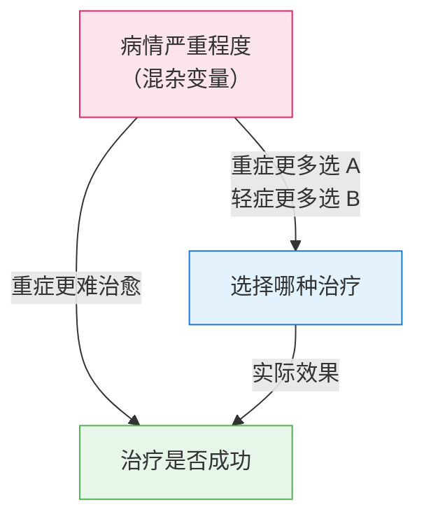
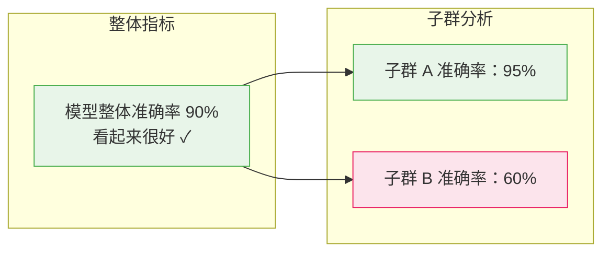

# 辛普森悖论与混杂

> **所属路径**：`00_高中复习/04_科学思维/03_相关与因果/04_辛普森悖论与混杂`
> **预计学习时间**：50 分钟
> **难度等级**：⭐⭐⭐

---

## 前置知识

- [相关关系](../01_相关关系/01_相关关系.md) — 知道如何判断两个变量之间的相关方向和强度
- [因果关系](../02_因果关系/02_因果关系.md) — 理解因果与相关的区别，知道"共同原因"结构
- [伪相关案例](../03_伪相关案例/03_伪相关案例.md) — 了解隐藏变量如何制造虚假的关联
- [干扰因素](../../01_变量与控制/03_干扰因素/03_干扰因素.md) — 知道隐藏因素可以干扰实验结论

> 如果以上内容还不熟悉，建议先完成对应课程再继续。本节是"相关与因果"主题中最有挑战性的一课，前面的基础非常重要。

---

## 学习目标

完成本节后，你将能够：

1. 用自己的话解释什么是辛普森悖论
2. 通过具体数字示例展示数据合并与分组时如何产生相反结论
3. 解释混杂变量如何导致辛普森悖论
4. 用 Python 模拟辛普森悖论并验证趋势反转
5. 说明辛普森悖论在人工智能公平性和子群分析中的重要意义

---

## 正文讲解

### 1. 一个令人震惊的故事

1973 年，加州大学伯克利分校（UC Berkeley）的研究人员发现了一件让人困惑不已的事情：

从 **整体数据** 来看，男性申请者的录取率（约 44%）明显高于女性申请者的录取率（约 35%）。乍一看，这似乎是赤裸裸的性别歧视。

但当他们 **按院系分组** 查看数据后，却发现一个完全相反的结论——在大多数院系中，女性的录取率反而与男性相当，甚至更高！

怎么可能？整体看男性录取率更高，分开看女性录取率又不低？数据在说谎吗？

这就是 **辛普森悖论（Simpson's Paradox）** ——统计学中最反直觉、也最重要的现象之一。

### 2. 用一个简化例子把它讲清楚

伯克利的原始数据涉及很多院系，数字比较复杂。让我们用一个更简单的例子来理解辛普森悖论的核心机制。

假设某医院在测试两种治疗肾结石的方法：**治疗 A** 和 **治疗 B** 。患者按病情严重程度分为"轻症"和"重症"两组。以下是数据：

**轻症患者：**

| 治疗方法 | 成功 / 总数 | 成功率 |
| -------- | ----------- | ------ |
| 治疗 A | 81 / 87 | 93.1% |
| 治疗 B | 234 / 270 | 86.7% |

**重症患者：**

| 治疗方法 | 成功 / 总数 | 成功率 |
| -------- | ----------- | ------ |
| 治疗 A | 192 / 263 | 73.0% |
| 治疗 B | 55 / 80 | 68.8% |

分组看，**治疗 A 在轻症和重症中成功率都更高** 。看起来治疗 A 全面胜出，对吧？

但是，当我们把数据合并：

**合并后（所有患者）：**

| 治疗方法 | 成功 / 总数 | 成功率 |
| -------- | ----------- | ------ |
| 治疗 A | (81+192) / (87+263) = 273 / 350 | 78.0% |
| 治疗 B | (234+55) / (270+80) = 289 / 350 | 82.6% |

整体看，**治疗 B 的成功率反而更高** ！

这完全违反直觉：**每个子组里 A 都比 B 好，但合在一起 B 反而比 A 好！**

### 3. 为什么会这样：混杂变量的魔力

秘密在于数据中隐藏着一个 **混杂变量（Confounding Variable）** ——病情严重程度。

让我们仔细看看数据的分布：

- 治疗 A 的 350 名患者中，有 263 名（75%）是重症
- 治疗 B 的 350 名患者中，有 270 名（77%）是轻症

看到了吗？**治疗 A 被分配了远多于治疗 B 的重症患者！** 重症患者本身治愈难度就大（无论用什么方法），所以治疗 A 的整体成功率被拉低了。



> 📌 **图解说明**：病情严重程度同时影响了"选择哪种治疗"和"治疗是否成功"。它就像一个"幕后操纵者"，扭曲了我们对治疗效果的判断。这就是 **混杂变量（Confounding Variable）** 的作用——它是辛普森悖论产生的根本原因。

辛普森悖论的核心机制可以用一句话概括：**当子组的大小比例不同时，整体趋势可能与子组趋势完全相反。**

### 4. 回到伯克利：性别歧视的真相

现在回到伯克利的案例。真相是：

- 女性申请者更多地申请了录取率较低的院系（如文科院系）
- 男性申请者更多地申请了录取率较高的院系（如工科院系）

这里的混杂变量是 **院系选择** 。当按院系分组后，每个院系内部的男女录取率差异很小。整体的差异是由男女在院系选择上的不同分布造成的，而非性别歧视。

### 5. 辛普森悖论与人工智能

辛普森悖论对人工智能有两个非常重要的启示：

**启示一：子群分析（Subgroup Analysis）**

在评估 AI 模型的性能时，不能只看整体指标。一个模型整体准确率 90%，不代表它在每个子群上都表现良好——它可能在某些子群（如少数群体）上表现很差，但因为该子群人数少，对整体指标影响不大。

**启示二：公平性（Fairness）**

假设一个贷款审批模型整体对男女的通过率相同，但分别看高收入和低收入群体时，发现在每个收入层内，女性的通过率都低于男性。这就是辛普森悖论在公平性中的体现——整体看"公平"的模型，分组看可能并不公平。



> 📌 **图解说明**：整体准确率 90% 掩盖了子群 B 准确率只有 60% 的事实。这正是辛普森悖论的思路——合并数据可能掩盖子群中的真实情况。

这个思维方式在后续学习 **[公平性](../../../../04_持续研究/02_伦理安全与产品思维/02_公平性/)** 和 **[评估指标](../../../../02_核心原理/02_经典机器学习/11_评估指标/)** 时会被反复用到。

---

## 动手实践

下面用 Python 模拟上面的肾结石治疗案例，亲手验证辛普森悖论。

```python
# 文件：code/simpsons_paradox_demo.py
# 用肾结石治疗数据演示辛普森悖论
# 环境要求：Python 3.10+（仅使用标准库）

def show_table(title, rows):
    """格式化输出表格"""
    print(f"\n{title}")
    print("-" * 50)
    print(f"{'治疗方法':<10} {'成功/总数':<15} {'成功率':<10}")
    print("-" * 50)
    for name, success, total in rows:
        rate = success / total * 100
        print(f"{name:<10} {success:>3}/{total:<3}  ({success}/{total})  {rate:>6.1f}%")
    print("-" * 50)

# === 原始数据 ===
# 治疗 A
a_light_success, a_light_total = 81, 87    # 轻症
a_heavy_success, a_heavy_total = 192, 263  # 重症

# 治疗 B
b_light_success, b_light_total = 234, 270  # 轻症
b_heavy_success, b_heavy_total = 55, 80    # 重症

print("=" * 55)
print("       辛普森悖论演示：肾结石治疗")
print("=" * 55)

# 分组查看
show_table("📊 轻症患者（分组数据）", [
    ("治疗 A", a_light_success, a_light_total),
    ("治疗 B", b_light_success, b_light_total),
])
a_light_rate = a_light_success / a_light_total
b_light_rate = b_light_success / b_light_total
winner_light = "A" if a_light_rate > b_light_rate else "B"
print(f">>> 轻症中，治疗 {winner_light} 更好")

show_table("📊 重症患者（分组数据）", [
    ("治疗 A", a_heavy_success, a_heavy_total),
    ("治疗 B", b_heavy_success, b_heavy_total),
])
a_heavy_rate = a_heavy_success / a_heavy_total
b_heavy_rate = b_heavy_success / b_heavy_total
winner_heavy = "A" if a_heavy_rate > b_heavy_rate else "B"
print(f">>> 重症中，治疗 {winner_heavy} 更好")

# 合并查看
a_total_success = a_light_success + a_heavy_success
a_total = a_light_total + a_heavy_total
b_total_success = b_light_success + b_heavy_success
b_total = b_light_total + b_heavy_total

show_table("📊 所有患者（合并数据）", [
    ("治疗 A", a_total_success, a_total),
    ("治疗 B", b_total_success, b_total),
])
a_total_rate = a_total_success / a_total
b_total_rate = b_total_success / b_total
winner_total = "A" if a_total_rate > b_total_rate else "B"
print(f">>> 合并后，治疗 {winner_total} 更好")

# 悖论揭示
print(f"\n{'=' * 55}")
print("🔍 辛普森悖论揭示")
print("=" * 55)
print(f"分组看：轻症中 A 更好，重症中 A 也更好")
print(f"合并看：B 反而更好！")
print(f"\n原因分析：")
print(f"  治疗 A 的重症比例：{a_heavy_total}/{a_total} = "
      f"{a_heavy_total/a_total*100:.1f}%")
print(f"  治疗 B 的重症比例：{b_heavy_total}/{b_total} = "
      f"{b_heavy_total/b_total*100:.1f}%")
print(f"\n  治疗 A 被分配了 {a_heavy_total/a_total*100:.0f}% 的重症患者，")
print(f"  治疗 B 只有 {b_heavy_total/b_total*100:.0f}% 的重症患者。")
print(f"  重症本身难治愈，拉低了 A 的整体成功率。")

print(f"\n{'=' * 55}")
print("💡 核心教训")
print("=" * 55)
print("1. 合并数据的结论可能与分组数据完全相反")
print("2. 混杂变量（病情严重程度）是罪魁祸首")
print("3. 在评估效果时，必须考虑分组分析")
print("4. 在 AI 中：整体指标好 ≠ 每个子群都好")
```

**运行说明**：
- 环境要求：Python 3.10+（仅使用标准库）
- 运行命令：`python code/simpsons_paradox_demo.py`

**预期输出**：
```
=======================================================
       辛普森悖论演示：肾结石治疗
=======================================================

📊 轻症患者（分组数据）
--------------------------------------------------
治疗方法     成功/总数         成功率
--------------------------------------------------
治疗 A      81/87   (81/87)    93.1%
治疗 B     234/270  (234/270)  86.7%
--------------------------------------------------
>>> 轻症中，治疗 A 更好

📊 重症患者（分组数据）
--------------------------------------------------
治疗方法     成功/总数         成功率
--------------------------------------------------
治疗 A     192/263  (192/263)  73.0%
治疗 B      55/80   (55/80)   68.8%
--------------------------------------------------
>>> 重症中，治疗 A 更好

📊 所有患者（合并数据）
--------------------------------------------------
治疗方法     成功/总数         成功率
--------------------------------------------------
治疗 A     273/350  (273/350)  78.0%
治疗 B     289/350  (289/350)  82.6%
--------------------------------------------------
>>> 合并后，治疗 B 更好

=======================================================
🔍 辛普森悖论揭示
=======================================================
分组看：轻症中 A 更好，重症中 A 也更好
合并看：B 反而更好！

原因分析：
  治疗 A 的重症比例：263/350 = 75.1%
  治疗 B 的重症比例：80/350 = 22.9%

  治疗 A 被分配了 75% 的重症患者，
  治疗 B 只有 23% 的重症患者。
  重症本身难治愈，拉低了 A 的整体成功率。

=======================================================
💡 核心教训
=======================================================
1. 合并数据的结论可能与分组数据完全相反
2. 混杂变量（病情严重程度）是罪魁祸首
3. 在评估效果时，必须考虑分组分析
4. 在 AI 中：整体指标好 ≠ 每个子群都好
```

亲手运行这段代码后，你会深刻感受到辛普森悖论的反直觉性——同一组数据，看法不同，结论完全相反。

---

## 典型误区

| 误区 | 正确理解 |
| ---- | -------- |
| "辛普森悖论说明数据是不可信的" | 数据是可信的，问题出在 **如何分析** 数据。悖论提醒我们在分析数据时必须考虑潜在的混杂变量 |
| "分组后的结论一定比整体结论更正确" | 不一定。关键是要找到 **正确的分组方式** 。如果分组变量本身就是混杂变量（比如本例中的病情严重程度），分组后看到的才是真相 |
| "辛普森悖论只是一种理论上的可能，实际很少发生" | 辛普森悖论在现实中非常常见——医学、教育、社会科学、AI 公平性评估中都有大量实际案例 |

---

## 练习题

### 练习 1：数字验证（难度：⭐⭐）

某学校两个班级考试通过率如下：

| | 理科班 | 文科班 |
| ---- | ------ | ------ |
| 方法 X | 通过 40/50 = 80% | 通过 12/20 = 60% |
| 方法 Y | 通过 9/10 = 90% | 通过 30/60 = 50% |

请计算合并后的通过率，看是否会出现辛普森悖论。

<details>
<summary>💡 提示</summary>

分别把方法 X 和方法 Y 的成功数和总数合并，再计算总通过率。

</details>

<details>
<summary>✅ 参考答案</summary>

方法 X 合并：

$$\dfrac{40 + 12}{50 + 20} = \dfrac{52}{70} \approx 74.3\%$$

方法 Y 合并：

$$\dfrac{9 + 30}{10 + 60} = \dfrac{39}{70} \approx 55.7\%$$

分组看，方法 Y 在理科班更好（90% > 80%），在文科班方法 X 更好（60% > 50%）——**两个组的赢家不同**。

合并看，方法 X 更好（74.3% > 55.7%）。

这不是经典的辛普森悖论（经典形式是每组都是同一方赢，合并后反转），但它展示了 **合并数据如何改变结论** 的核心机制。

</details>

### 练习 2：概念理解（难度：⭐⭐）

假设你在评估两个 AI 模型（模型 A 和模型 B）的准确率。整体上模型 A 的准确率为 88%，模型 B 为 85%。但有人告诉你"这个数据集有辛普森悖论的风险"。

1. 你会怎样进一步分析来检查是否存在辛普森悖论？
2. 如果确实存在悖论，你会信任整体结论还是分组结论？

<details>
<summary>💡 提示</summary>

想想有哪些因素可能是"混杂变量"——比如数据中不同类别（子群）的样本量是否均衡。

</details>

<details>
<summary>✅ 参考答案</summary>

1. **按子群分组分析**：按数据集中的关键类别（如图片类型、文本领域、用户群体等）分组，分别计算两个模型在每个子群中的准确率。如果在大多数子群中模型 B 更好，但因为模型 A 恰好在样本量大的"简单"子群上表现突出，拉高了整体指标——这就是辛普森悖论。

2. **信任分组结论**：当混杂变量被正确识别时（比如任务难度），分组后的结论通常更可靠。因为整体指标被不均匀的样本量分布"扭曲"了。

在 AI 公平性评估中，这种分组分析尤其重要——确保模型在每个子群上都表现合理，而不是只追求整体指标的好看。

</details>

### 练习 3：寻找生活中的辛普森悖论（难度：⭐⭐⭐）

尝试构造一个你自己的辛普森悖论场景。要求：

1. 定义两个"处理方法"和一个混杂变量
2. 编造合理的数据，使得分组看和合并看的结论相反
3. 解释混杂变量是如何导致逆转的

<details>
<summary>💡 提示</summary>

关键技巧：让一种处理方法在"困难"组中占多数，另一种在"容易"组中占多数。这样"困难"组会拉低前者的整体成绩。

</details>

<details>
<summary>✅ 参考答案</summary>

示例：两家餐厅的好评率

**工作日（客流量小，顾客挑剔）：**
- 餐厅 A：好评 7/10 = 70%
- 餐厅 B：好评 30/50 = 60%

**周末（客流量大，顾客宽容）：**
- 餐厅 A：好评 45/50 = 90%
- 餐厅 B：好评 8/10 = 80%

分组看：A 在工作日和周末都好于 B。

合并看：
- A：52/60 = 86.7%
- B：38/60 = 63.3%

这个例子没有反转（A 仍然赢）。要制造反转，需要调整比例——让 A 主要在工作日（难组）评价，B 主要在周末（易组）评价：

**工作日：**
- 餐厅 A：好评 36/50 = 72%
- 餐厅 B：好评 8/10 = 70%

**周末：**
- 餐厅 A：好评 9/10 = 90%
- 餐厅 B：好评 42/50 = 84%

分组看：A 在两组都更高（72% > 70%，90% > 84%）。

合并看：A = 45/60 = 75%，B = 50/60 = 83.3%。B 反而更高！因为 A 的大部分评价来自"困难"的工作日。

</details>

---

## 下一步学习

- 📖 后续主题：[图表与证据](../../04_图表与证据/) — 学习如何正确使用图表来呈现数据证据，避免被合并数据误导
- 🔗 相关知识点：[统计基础](../../../01_数学基础/10_统计基础/) — 更系统地学习数据分析的统计方法
- 🔗 进阶方向：[概率基础](../../../01_数学基础/09_概率基础/) — 条件概率为理解混杂效应提供数学基础
- 📚 进阶方向：在核心原理阶段，你将在 [评估指标](../../../../02_核心原理/02_经典机器学习/11_评估指标/) 和 [公平性](../../../../04_持续研究/02_伦理安全与产品思维/02_公平性/) 中再次遇到辛普森悖论的思想

---

## 参考资料

1. [维基百科 - 辛普森悖论](https://zh.wikipedia.org/wiki/%E8%BE%9B%E6%99%AE%E6%A3%AE%E6%82%96%E8%AE%BA) — 包含伯克利案例和肾结石案例的详细讲解（公共知识库）
2. [Simpson's Paradox — Stanford Encyclopedia of Philosophy](https://plato.stanford.edu/entries/paradox-simpson/) — 斯坦福哲学百科的深入分析（开放获取学术资源）
3. [Sex Bias in Graduate Admissions: Data from Berkeley (Bickel et al., 1975)](https://doi.org/10.1126/science.187.4175.398) — 伯克利录取案例的原始论文，发表于 Science（经典学术论文，可通过学术搜索获取摘要）
