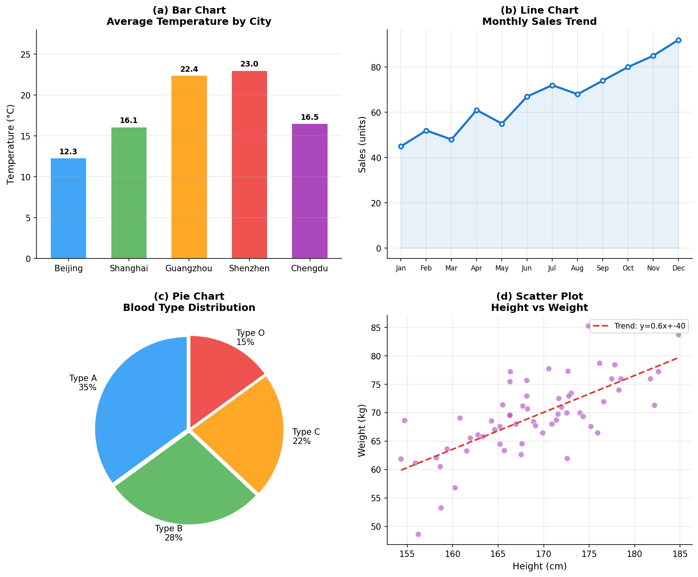
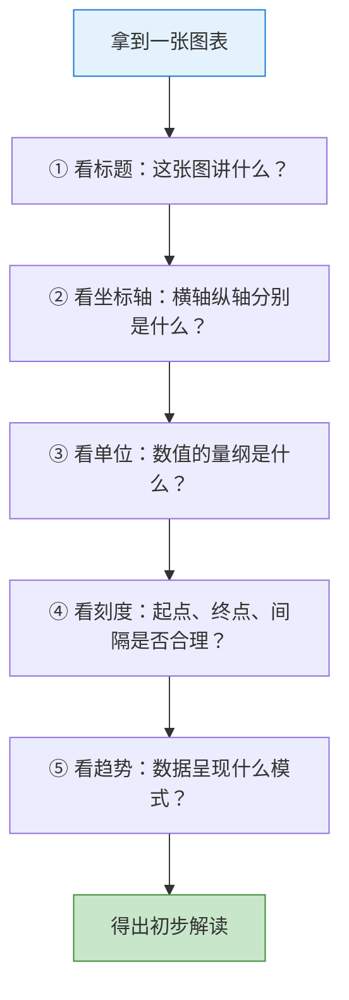
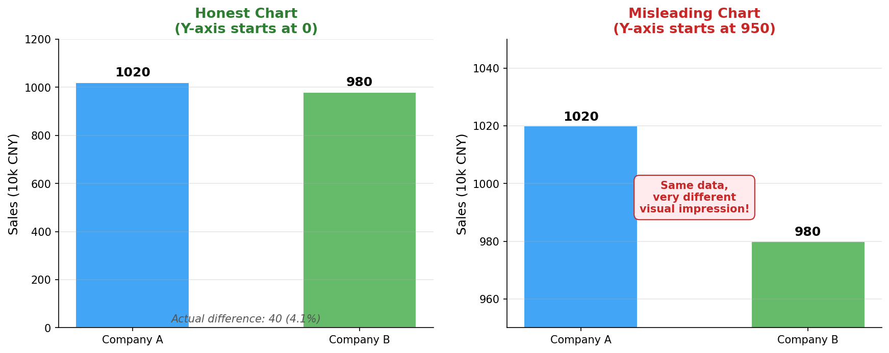

# 图表解读

> **所属路径**：`00_高中复习/04_科学思维/04_图表与证据/01_图表解读`
> **预计学习时间**：35 分钟
> **难度等级**：⭐

---

## 前置知识

- [相关关系](../../03_相关与因果/01_相关关系/01_相关关系.md) — 你需要了解散点图的基本概念和相关性的含义
- [统计图表](../../../01_数学基础/10_统计基础/03_统计图表/03_统计图表.md) — 你需要知道常见统计图表的基本形态
- [现象记录](../../02_观察与假设/01_现象记录/01_现象记录.md) — 你需要知道如何客观记录观察到的数据

> 如果以上内容还不熟悉，建议先完成对应课程再继续。

---

## 学习目标

完成本节后，你将能够：

1. 识别柱状图、折线图、饼图、散点图四种常见图表类型及其适用场景
2. 系统地读取图表的五要素：标题、坐标轴、单位、刻度、数据趋势
3. 发现常见的图表误导手法（截断坐标轴、不等距刻度、面积误导）
4. 用 Python 演示同一份数据如何因展示方式不同而产生不同的视觉印象
5. 说明图表解读能力在人工智能中的应用（如阅读训练损失曲线）

---

## 正文讲解

### 1. 一张图胜过千言万语——但也可能骗过千人

假设你在新闻上看到这样一个标题："A 公司的销售额远超 B 公司！"下面配了一张柱状图。你一眼望去，A 的柱子确实比 B 高出很多。但你仔细看纵轴——起始值不是 0，而是从 950 开始的！A 公司的销售额是 1020 万，B 公司是 980 万，实际上只差了 4%。但通过截断坐标轴，这 4% 的差距在视觉上被放大了十几倍。

这个例子揭示了一个重要事实：**图表既是传递信息的好工具，也可能成为误导的武器**。学会"读图"，不是简单地看一眼形状，而是需要一套系统的检查方法。

### 2. 四种基本图表类型

在正式学习读图方法之前，我们先来认识四种最基本的图表类型。每种图表都有自己最擅长表达的信息。

下面这张图展示了四种基本图表类型的真实示例，每种图表都使用了实际数据：



> 📌 **图解说明**：(a) **柱状图（Bar Chart）** 用柱子高度比较不同类别的数值，如不同城市的平均气温；(b) **折线图（Line Chart）** 用连线展示数据随时间的变化趋势，如月度销售额；(c) **饼图（Pie Chart）** 用扇形面积表示各部分占比，适合少于 5-6 个类别；(d) **散点图（Scatter Plot）** 用平面上的点展示两个变量之间的关系，如身高与体重。你可以运行 `code/plot_chart_types.py` 自行生成这张图。

从图中可以看到，每种图表都有自己最擅长表达的信息：

- **柱状图**：最适合比较不同类别之间的数值差异。例如"不同城市的平均气温"、"各科考试成绩"。
- **折线图**：最适合展示数据随时间或顺序的变化趋势。例如"过去 12 个月的销售额变化"、"模型训练过程中的损失值变化"。
- **饼图**：最适合展示各部分占总体的比例。注意饼图只适合少量类别（一般不超过 5-6 个），否则会变得难以阅读。
- **散点图**：最适合探索两个变量的关系。在前面学习 **[相关关系](../../03_相关与因果/01_相关关系/01_相关关系.md)** 时，我们已经大量使用过散点图。

选择图表时，可以参考以下简单规则：比较类别用柱状图，展示趋势用折线图，展示比例用饼图，探索关系用散点图。

### 3. 读图五要素检查法

拿到任何一张图表，不要急着看数据本身——先做一次"五要素检查"：

**要素一：标题（Title）** 。图表的标题告诉你这张图在展示什么。没有标题的图表，就像没有名字的人，你无法确定它的身份。

**要素二：坐标轴（Axes）** 。横轴和纵轴分别代表什么变量？它们的名称是否清晰？在折线图和散点图中，坐标轴的含义决定了整张图的解读方向。

**要素三：单位（Units）** 。数值的单位是什么？是"万元"还是"元"？是"摄氏度"还是"华氏度"？单位错了，理解就全错了。

**要素四：刻度（Scale）** 。坐标轴是从 0 开始还是从某个中间值开始？刻度是等距的还是对数的？这是图表误导最常发生的地方。

**要素五：数据趋势（Trend）** 。做完前四步检查后，最后才来看数据本身的趋势——是上升、下降、平稳还是波动？有没有异常值？



> 📌 **图解说明**：读图五要素检查法——按照标题→坐标轴→单位→刻度→趋势的顺序，系统地解读任何图表。

### 4. 当心！图表中的常见误导手法

了解了正确的读图方法后，我们来揭露几种常见的误导手法。知道这些手法不是为了去误导别人，而是为了保护自己不被误导。

**手法一：截断坐标轴（Truncated Axis）** 。将纵轴的起始值从 0 改为一个较大的值，微小的差异在视觉上会被极度放大。这就是本节开头那个"A 公司远超 B 公司"的把戏。

**手法二：不等距刻度** 。将坐标轴的刻度间隔设为不等距，让某些区间看起来变化更剧烈。在没有明确标注使用对数坐标的情况下，不等距刻度往往是在制造假象。

**手法三：面积误导** 。在使用图标或图形表示数量时，如果按照线性比例放大图标，面积会以平方倍增长。比如 A 是 B 的两倍，但如果图标的长和宽都放大 2 倍，视觉面积就变成了 4 倍。

**手法四：省略数据点** 。只选择性地展示有利的数据区间，隐藏不利的部分。比如一只股票在 12 个月中有 8 个月下跌，但只展示上涨的 4 个月。

> 💡 **想一想**：你在新闻、广告或社交媒体中见过哪些可能使用了这些手法的图表？

### 5. 人工智能中的图表解读

在人工智能领域，图表解读是每天都要用的基本功。以下是几个典型场景：

**训练损失曲线（Training Loss Curve）** ：这是一张折线图，横轴是训练轮次（epoch），纵轴是损失值（loss）。你需要判断：损失是否在持续下降？是否趋于平稳（收敛）？是否出现了先下降后上升的情况（ **[过拟合（Overfitting）](../../../01_数学基础/10_统计基础/05_回归分析初步/)** 的信号）？

**准确率对比图** ：用柱状图比较不同模型在同一测试集上的准确率。这时你需要检查：纵轴是否从 0 开始？差异在统计上是否显著？

**混淆矩阵热力图** ：用颜色深浅表示分类模型在各个类别上的预测正确率。这是一种更复杂的图表，但读图的基本原则不变——先看标题、轴标签和单位。

---

## 动手实践

让我们用真实的图表来演示同一份数据如何因坐标轴设置不同而产生截然不同的视觉效果。下面这张图展示了完全相同的数据——A 公司销售额 1020 万、B 公司 980 万——在两种不同的坐标轴设置下呈现出的对比效果：



> 📌 **图解说明**：左图坐标轴从 0 开始，两家公司的柱子高度几乎一样，差距微小；右图坐标轴从 950 开始，同样 4.1% 的差距在视觉上被极度放大。你可以运行 `code/plot_axis_manipulation.py` 自行生成这张图。

从图中可以清晰看到：完全相同的数据，仅仅因为坐标轴的起始值不同，就能给读者留下截然不同的印象。下次看到柱状图时，第一件事就是检查纵轴是否从 0 开始。

下面的 Python 代码用纯文本方式模拟了同样的效果，即使没有安装 matplotlib 也可以直接运行体验：

```python
# 文件：code/axis_manipulation.py
# 演示截断坐标轴如何误导读者
# 环境要求：Python 3.10+（仅使用标准库）

def draw_bar(label, value, max_val, bar_width=30):
    """用文本字符绘制一个横向柱状图条目"""
    filled = int(value / max_val * bar_width)
    bar = "█" * filled + "░" * (bar_width - filled)
    return f"  {label} |{bar}| {value}"

# 数据：两家公司的季度销售额（单位：万元）
company_a = 1020
company_b = 980

print("=" * 55)
print("【图 1】诚实的图表 —— 坐标轴从 0 开始")
print("=" * 55)
print(f"\n  销售额对比（万元），坐标范围：0 ~ {1200}")
print()
print(draw_bar("A 公司", company_a, 1200))
print(draw_bar("B 公司", company_b, 1200))
print()
diff_pct = abs(company_a - company_b) / company_b * 100
print(f"  → 实际差距：{company_a - company_b} 万元（{diff_pct:.1f}%）")
print(f"  → 视觉感受：两根柱子差不多长，差别不大")

print()
print("=" * 55)
print("【图 2】误导的图表 —— 坐标轴从 950 开始")
print("=" * 55)

# 截断坐标轴：从 950 开始，只展示 950~1050 的范围
axis_min = 950
axis_max = 1050
adjusted_a = company_a - axis_min
adjusted_b = company_b - axis_min
display_range = axis_max - axis_min

print(f"\n  销售额对比（万元），坐标范围：{axis_min} ~ {axis_max}")
print()
filled_a = int(adjusted_a / display_range * 30)
filled_b = int(adjusted_b / display_range * 30)
bar_a = "█" * filled_a + "░" * (30 - filled_a)
bar_b = "█" * filled_b + "░" * (30 - filled_b)
print(f"  A 公司 |{bar_a}| {company_a}")
print(f"  B 公司 |{bar_b}| {company_b}")
print()
print(f"  → 实际差距：仍然是 {company_a - company_b} 万元（{diff_pct:.1f}%）")
print(f"  → 视觉感受：A 的柱子看起来是 B 的好几倍！")
print()
print("  ⚠️  同样的数据，只是坐标轴起始值不同，")
print("     视觉印象就完全不同了！")
```

**运行说明**：
- 环境要求：Python 3.10+（仅使用标准库）
- 运行命令：`python code/axis_manipulation.py`

---

## 典型误区

| 误区 | 正确理解 |
| ---- | -------- |
| "柱子越高差距就越大" | 柱子的视觉差距取决于坐标轴设置，必须看实际数值和比例 |
| "折线图向上就是好的" | 要看纵轴表示什么——如果是损失值，向上反而意味着模型变差了 |
| "饼图能精确比较大小" | 人类对角度和面积的感知远不如对长度精确，细微差距用柱状图更清楚 |
| "图表里画出来的就是事实" | 图表只是数据的一种展示方式，展示方式的选择可能带有倾向性 |

---

## 练习题

### 练习 1：五要素检查（难度：⭐）

假设你看到一张折线图，标题是"某校近五年高考平均分变化"，横轴标注了 2019–2023 年，纵轴标注了"分数"。请回答：

1. 这张图缺少了五要素中的哪一个关键信息？
2. 如果纵轴从 680 分开始（而非 0 分），从 2019 年的 690 分到 2023 年的 710 分的变化在视觉上会被如何影响？

<details>
<summary>💡 提示</summary>

回忆五要素：标题、坐标轴、单位、刻度、趋势。这张图哪一项不够明确？

</details>

<details>
<summary>✅ 参考答案</summary>

1. 缺少的关键信息是**单位**——"分数"只说明了变量类型，但没有说明是总分 750 分制还是其他制度，也没有标注"分"这个单位。

2. 纵轴从 680 分开始意味着只展示了 680–710 的范围（30 分区间），实际变化量是 20 分，但在视觉上会占据整个图表高度的 $\dfrac{2}{3}$ ，看起来涨幅非常大。如果纵轴从 0 开始（0–750），20 分的变化在 750 分的范围内只占约 $\dfrac{20}{750} \approx 2.7\%$ ，视觉上几乎看不出变化。

</details>

### 练习 2：识别误导手法（难度：⭐）

某广告声称"使用我们的产品后，用户满意度提升了 200%！"配图显示一个小笑脸和一个大笑脸，大笑脸的宽度和高度都是小笑脸的 3 倍。请分析这里可能存在什么误导。

<details>
<summary>💡 提示</summary>

思考面积误导：如果长和宽都放大 3 倍，面积会变成多少倍？

</details>

<details>
<summary>✅ 参考答案</summary>

这里存在**面积误导**。"提升 200%"意味着变为原来的 3 倍（100% + 200% = 300%）。如果用图标表示，应该让面积变为 3 倍。但大笑脸的宽度和高度都是小笑脸的 3 倍，面积就变成了 $3 \times 3 = 9$ 倍，远超实际的 3 倍提升。视觉上，读者会感觉满意度提升了 9 倍而不是 3 倍。

正确的做法是：如果要用面积表示 3 倍关系，大图标的边长应为小图标的 $\sqrt{3} \approx 1.73$ 倍。

</details>

### 练习 3：编程挑战——模拟折线图误导（难度：⭐⭐）

请修改动手实践中的代码，改为用文本字符模拟一条"折线图"。用同一组月度数据 `[100, 102, 98, 105, 103, 107]`，分别展示纵轴从 0 开始和从 95 开始的两种效果。观察两种展示方式下数据波动的视觉差异。

<details>
<summary>💡 提示</summary>

可以用竖向排列的字符来模拟折线图的高度，每个月份对应一列。或者用水平方式，每个月份一行，用 `█` 的长度表示数值大小。

</details>

<details>
<summary>✅ 参考答案</summary>

```python
data = [100, 102, 98, 105, 103, 107]
months = ["1月", "2月", "3月", "4月", "5月", "6月"]

print("【从 0 开始】")
for m, v in zip(months, data):
    bar = "█" * (v // 5)
    print(f"  {m} |{bar}| {v}")

print("\n【从 95 开始】")
for m, v in zip(months, data):
    bar = "█" * ((v - 95) * 3)
    print(f"  {m} |{bar}| {v}")
```

从 0 开始时，所有柱子长度接近，波动几乎看不出来。从 95 开始时，波动在视觉上被放大了很多倍。

</details>

---

## 下一步学习

- 📖 下一个知识点：[证据强弱](../02_证据强弱/02_证据强弱.md) — 学会读图之后，接下来学习如何判断图表背后的证据是否可靠
- 🔗 相关知识点：[统计图表](../../../01_数学基础/10_统计基础/03_统计图表/03_统计图表.md) — 更详细的统计图表知识
- 🔗 相关知识点：[相关关系](../../03_相关与因果/01_相关关系/01_相关关系.md) — 散点图在相关分析中的应用

---

## 参考资料

1. [How Charts Lie — Alberto Cairo](https://albertocairo.com/visualization-books/) — 数据可视化专家 Alberto Cairo 关于图表误导的著作介绍页（公开访问）
2. [Misleading Graphs — Wikipedia](https://en.wikipedia.org/wiki/Misleading_graph) — 维基百科上关于误导性图表的系统总结（公共知识库）
3. [Python 官方教程](https://docs.python.org/zh-cn/3/tutorial/) — Python 基础语法参考（官方文档）
4. [Matplotlib 官方教程](https://matplotlib.org/stable/tutorials/index.html) — Python 绘图库官方教程（官方文档）
