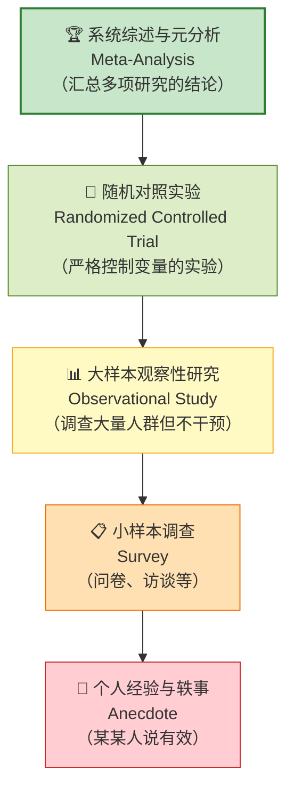
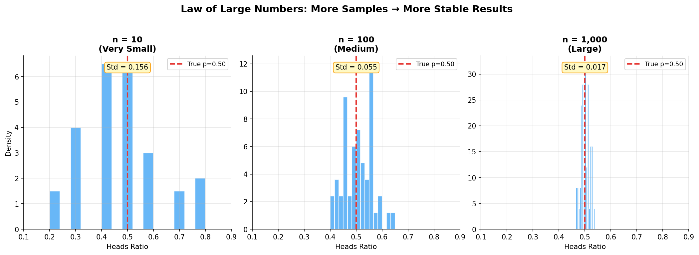
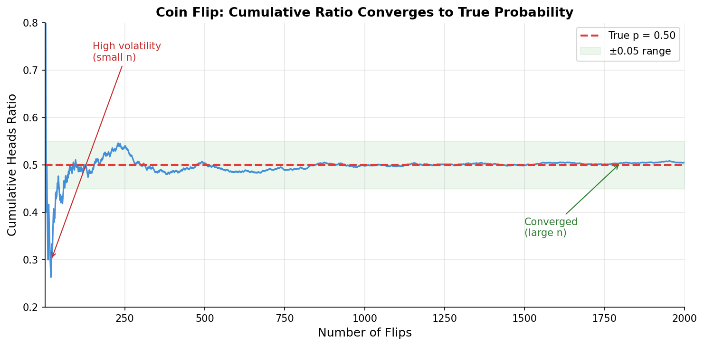

# 证据强弱

> **所属路径**：`00_高中复习/04_科学思维/04_图表与证据/02_证据强弱`
> **预计学习时间**：40 分钟
> **难度等级**：⭐⭐

---

## 前置知识

- [图表解读](../01_图表解读/01_图表解读.md) — 你需要知道如何正确读取图表中的信息
- [控制变量](../../01_变量与控制/02_控制变量/02_控制变量.md) — 你需要理解为什么实验中要控制变量
- [验证思路](../../02_观察与假设/03_验证思路/03_验证思路.md) — 你需要知道假设验证的基本流程

> 如果以上内容还不熟悉，建议先完成对应课程再继续。

---

## 学习目标

完成本节后，你将能够：

1. 解释为什么不同类型的证据具有不同的说服力
2. 描述证据强度的层次：个人经验 < 调查 < 对照实验 < 系统综述
3. 说明样本量如何影响结论的可靠性
4. 理解统计显著性的基本直觉（不需要计算公式）
5. 将证据强弱的概念与人工智能中的测试集、交叉验证联系起来

---

## 正文讲解

### 1. "我朋友用了很有效"——为什么个人经验不够

想象一个场景：你感冒了，朋友推荐了一种保健品，说"我上次吃了第二天就好了"。你可能会想："既然他说有效，那应该管用吧？"但仔细想想——感冒本身过几天也会好，你朋友的感冒好了，到底是因为保健品还是因为身体自愈？仅凭一个人的经验，我们根本无法分辨。

这就引出了一个关键问题：**不是所有证据都同样可信**。一个人的经历、一百个人的调查、一次严格控制的实验、一项汇总了几十次实验的系统综述——它们的说服力是天差地别的。学会评估证据的强弱，是科学思维的核心能力之一。

### 2. 证据强度金字塔

科学界对不同类型证据的强度有一个大致共识，可以用一个金字塔来表示——越往上，证据越强：



> 📌 **图解说明**：证据强度金字塔——从底部的个人轶事到顶部的系统综述，证据的可信度逐级提升。越往上，样本越大、控制越严格、偏差越小。

让我们逐层理解：

**个人经验与轶事（Anecdote）** ：某个人的亲身经历。问题在于：样本量只有 1，容易受个人偏见、安慰剂效应、巧合等因素影响。

**小样本调查（Survey）** ：通过问卷或访谈收集一组人的数据。比个人经验好，但可能存在样本偏差（只问了特定群体）和自我报告偏差（人们不一定如实回答）。

**大样本观察性研究（Observational Study）** ：研究者观察大量样本，但不对它们施加干预。例如统计吸烟人群和不吸烟人群的肺癌发病率。这类研究能发现 **[相关关系](../../03_相关与因果/01_相关关系/01_相关关系.md)** ，但由于缺乏控制，不能直接证明 **[因果关系](../../03_相关与因果/02_因果关系/02_因果关系.md)** 。

**随机对照实验（Randomized Controlled Trial, RCT）** ：将参与者随机分为实验组和对照组，只改变一个 **[自变量](../../01_变量与控制/01_自变量与因变量/01_自变量与因变量.md)** ，其他条件保持一致。这是建立因果关系最可靠的方法。

**系统综述与元分析（Meta-Analysis）** ：收集并汇总多项独立研究的结果，用统计方法得出综合结论。它不是做一次新实验，而是"对实验做实验"——通过整合大量数据，得到最稳健的结论。

### 3. 样本量为什么这么重要

"我抛了 3 次硬币，全是正面，所以这枚硬币不公平！"——你觉得这个结论靠谱吗？

大多数人会直觉地说"3 次太少了，不能说明问题"。这个直觉完全正确。即使是一枚完全公平的硬币，连续 3 次正面的概率也有 $\frac{1}{8} = 12.5\%$ ——并不罕见。但如果你抛了 1000 次，有 700 次是正面，那说明硬币不公平的可信度就高得多了。

这背后的原理叫做 **大数定律（Law of Large Numbers）** ：样本量越大，样本的统计特征就越接近真实值。换句话说，数据越多，我们的结论就越可靠。

下面这张图直观地展示了样本量对结果稳定性的影响。我们模拟了 50 次抛硬币实验，分别使用 10 次、100 次、1000 次三种样本量，观察结果的波动范围：



> 📌 **图解说明**：三张直方图展示了不同样本量下 50 次独立实验的正面比例分布。样本量为 10 时结果分散，偏离真实值 0.50 的可能性很大；样本量增大到 1000 时，几乎所有实验结果都集中在 0.50 附近。标准差（Std）从左到右显著缩小。你可以运行 `code/plot_sample_size.py` 自行生成这张图。

下面这张图进一步展示了一次 2000 次抛硬币实验中，累积正面比例随抛掷次数增加而逐渐趋近于真实概率的过程：



> 📌 **图解说明**：蓝色曲线是累积正面比例，红色虚线是真实概率 0.50。抛掷次数很少时（左侧），比例波动剧烈；随着次数增多（右侧），曲线逐渐收敛到真实值。这就是大数定律的直观体现。

在人工智能中，这个原理直接决定了为什么我们需要大量的测试数据：

- 如果你只用 10 张图片测试一个图像分类模型，准确率是 90%，这能说明什么吗？可能只是碰巧。
- 但如果用 10000 张图片测试，准确率是 90%，那就相当可靠了。

### 4. 统计显著性的直觉

你可能在新闻中看过"研究结果具有统计显著性"这样的表述。什么意思呢？

简单地说，**统计显著性（Statistical Significance）** 回答的是这样一个问题："我们观察到的差异，有多大可能只是偶然造成的？"

还是用抛硬币的例子。如果你抛 100 次，得到 53 次正面——这和预期的 50 次差了 3 次，可能只是运气。但如果你得到 73 次正面——差了 23 次，这就很难用"运气"来解释了。

统计学中用 **$p$ 值（p-value）** 来量化"偶然性"的大小。 $p$ 值越小，说明结果越不可能是偶然的。通常，当 $p < 0.05$ 时（即偶然出现的概率小于 5%），我们称结果"具有统计显著性"。

> 💡 **想一想**：如果某个 AI 模型的准确率从 85% 提升到 86%，你需要什么信息才能判断这个 1% 的提升是"真的更好"还是"碰巧测试集上表现好"？（提示：样本量和重复实验）

### 5. 人工智能中的证据思维

理解了证据强弱，你就能理解人工智能领域中许多看似"繁琐"的做法背后的逻辑：

**为什么需要测试集？** 用训练数据来评估模型，就像让考生自己出题自己考——不可信。独立的测试集提供了更可靠的证据。

**为什么需要交叉验证？** 单次划分训练集和测试集可能碰巧有利或不利，交叉验证通过多次划分来降低偶然性——就像多抛几次硬币来判断公平性。

**为什么论文中要做基准对比（Benchmark）？** 光说"我的模型准确率 95%"没有意义，必须和其他模型在相同数据集上对比，这就是对照实验的思想。

**为什么关注统计显著性？** 如果两个模型的差距很小（比如 0.3%），我们需要确认这个差距不是测试数据碰巧造成的，而是真实存在的优势。

---

## 动手实践

让我们用 Python 来模拟"样本量如何影响结论可靠性"——通过多次抛硬币实验，直观感受大数定律的力量。

```python
# 文件：code/sample_size_simulation.py
# 模拟抛硬币实验：展示样本量对结论可靠性的影响
# 环境要求：Python 3.10+（仅使用标准库）

import random

def coin_experiment(n_flips, true_prob=0.5):
    """
    模拟抛 n_flips 次硬币，返回正面比例。
    true_prob: 硬币正面的真实概率（0.5 表示公平硬币）
    """
    heads = sum(1 for _ in range(n_flips) if random.random() < true_prob)
    return heads / n_flips

# 设置随机种子以便复现
random.seed(42)

print("=" * 60)
print("  实验：样本量如何影响结论可靠性")
print("  （使用公平硬币，真实正面概率 = 0.50）")
print("=" * 60)

sample_sizes = [10, 50, 100, 500, 1000, 10000]

print(f"\n{'样本量':>8} | {'正面比例':>10} | {'与 0.50 的偏差':>14} | 判断")
print("-" * 60)

for n in sample_sizes:
    ratio = coin_experiment(n)
    deviation = abs(ratio - 0.50)
    # 简单判断：偏差超过 0.10 视为"可能不公平"
    judgment = "⚠️ 偏差较大" if deviation > 0.10 else "✅ 接近公平"
    print(f"{n:>8} | {ratio:>10.4f} | {deviation:>14.4f} | {judgment}")

# 多次实验演示波动性
print("\n" + "=" * 60)
print("  重复实验：每种样本量做 10 次，观察结果的波动")
print("=" * 60)

for n in [10, 100, 1000]:
    results = [coin_experiment(n) for _ in range(10)]
    min_r = min(results)
    max_r = max(results)
    spread = max_r - min_r
    
    # 可视化波动范围
    bar_width = 40
    low_pos = int((min_r - 0.2) / 0.6 * bar_width)
    high_pos = int((max_r - 0.2) / 0.6 * bar_width)
    mid_pos = int((0.5 - 0.2) / 0.6 * bar_width)
    
    print(f"\n  样本量 = {n}")
    print(f"  10 次实验的正面比例范围：{min_r:.3f} ~ {max_r:.3f}")
    print(f"  波动幅度：{spread:.3f}")
    
    # 用文本绘制范围
    bar = list("." * bar_width)
    bar[mid_pos] = "|"  # 标记真实值 0.50
    for i in range(max(0, low_pos), min(bar_width, high_pos + 1)):
        bar[i] = "█"
    print(f"  [0.2 {''.join(bar)} 0.8]")
    print(f"       {'':>{mid_pos}}↑ 真实值 0.50")

print("\n" + "=" * 60)
print("  🔑 结论：")
print("  • 样本量越小，结果波动越大，越容易得到偏离真相的结论")
print("  • 样本量越大，结果越稳定，越接近真实概率")
print("  • 这就是为什么 AI 中需要大量测试数据来评估模型！")
print("=" * 60)
```

**运行说明**：
- 环境要求：Python 3.10+（仅使用标准库）
- 运行命令：`python code/sample_size_simulation.py`

**预期输出**（由于使用了固定随机种子，结果可复现）：
```
============================================================
  实验：样本量如何影响结论可靠性
  （使用公平硬币，真实正面概率 = 0.50）
============================================================

  样本量 |   正面比例 |   与 0.50 的偏差 | 判断
------------------------------------------------------------
      10 |     0.4000 |         0.1000 | ✅ 接近公平
      50 |     0.5200 |         0.0200 | ✅ 接近公平
     100 |     0.5300 |         0.0300 | ✅ 接近公平
     500 |     0.5100 |         0.0100 | ✅ 接近公平
    1000 |     0.4930 |         0.0070 | ✅ 接近公平
   10000 |     0.5022 |         0.0022 | ✅ 接近公平
```

代码生动地展示了大数定律：样本量为 10 时，正面比例可能偏离真实值 10% 甚至更多；样本量增大到 10000 时，偏差通常缩小到千分位。这就是为什么在评估 AI 模型时，我们需要足够大的测试集——小样本上的"好成绩"可能只是巧合。

---

## 典型误区

| 误区 | 正确理解 |
| ---- | -------- |
| "有数据就是有证据" | 数据的质量和收集方式决定了证据的强弱，脏数据不如没数据 |
| "样本量越大越好，不管怎么收集" | 有偏的大样本不如无偏的小样本，10 万条偏斜调查不如 500 人的随机对照实验 |
| "统计显著就意味着实际重要" | 统计显著只说明结果不太可能是偶然的，但效果大小可能微不足道 |
| "一篇论文说有效就是有效" | 单个研究可能有设计缺陷，系统综述汇总多项研究的结论更可靠 |

---

## 练习题

### 练习 1：证据分级（难度：⭐）

请将以下四条"证据"按可信度从低到高排列：

- A. 一项覆盖 5000 名用户的随机对照实验显示新功能提升了 8% 的点击率
- B. 某产品经理说"我觉得用户更喜欢新设计"
- C. 一份汇总了 15 项独立实验的元分析报告
- D. 一份 200 人的在线问卷调查

<details>
<summary>💡 提示</summary>

回忆证据强度金字塔的五个层级，将每条证据对应到相应层级。

</details>

<details>
<summary>✅ 参考答案</summary>

按可信度从低到高：

1. **B**（个人经验/轶事）— 仅凭一个人的主观感觉，最不可靠
2. **D**（小样本调查）— 有数据但样本较小且无对照
3. **A**（随机对照实验）— 有对照组、样本量大、随机分配
4. **C**（元分析/系统综述）— 汇总了多项独立实验，证据最强

</details>

### 练习 2：样本量判断（难度：⭐⭐）

你训练了一个图像分类模型，需要评估它的准确率。你手头有两个测试方案：

- 方案 A：用 20 张精心挑选的"有代表性"的图片测试
- 方案 B：用 2000 张随机抽取的图片测试

哪个方案更可靠？为什么？如果方案 A 的准确率是 95%，方案 B 的准确率是 88%，你会如何判断？

<details>
<summary>💡 提示</summary>

思考两个方面：样本量和样本的选取方式。"精心挑选"和"随机抽取"有什么区别？

</details>

<details>
<summary>✅ 参考答案</summary>

**方案 B 更可靠**，原因有二：

1. **样本量**：2000 张远多于 20 张，根据大数定律，结果更接近模型的真实表现。
2. **抽样方式**：方案 A "精心挑选"意味着存在选择偏差——挑选的图片可能恰好是模型容易处理的类型。方案 B 随机抽取更能代表真实场景中的图片分布。

因此，方案 A 的 95% 可能是高估（因为选了容易的图片），方案 B 的 88% 更可能是模型在真实场景中的表现。应该信任方案 B 的结果。

</details>

### 练习 3：编程挑战——不公平硬币检测（难度：⭐⭐）

修改动手实践中的代码，模拟一枚不公平硬币（正面概率为 0.6）。分别用 20 次和 2000 次抛掷来判断这枚硬币是否公平。重复实验 100 次，统计在每种样本量下，有多少次实验能"正确发现"硬币不公平（正面比例偏离 0.50 超过 0.05）。

<details>
<summary>💡 提示</summary>

使用 `coin_experiment(n, true_prob=0.6)` 来模拟不公平硬币。对每种样本量做 100 次实验，统计正面比例偏离 0.50 超过 0.05 的次数。

</details>

<details>
<summary>✅ 参考答案</summary>

```python
import random
random.seed(42)

def coin_experiment(n_flips, true_prob=0.5):
    heads = sum(1 for _ in range(n_flips) if random.random() < true_prob)
    return heads / n_flips

for n in [20, 2000]:
    detected = 0
    for _ in range(100):
        ratio = coin_experiment(n, true_prob=0.6)
        if abs(ratio - 0.50) > 0.05:
            detected += 1
    print(f"样本量 {n:>5}: 100 次实验中 {detected} 次发现不公平")
```

预期结果：样本量 20 时可能只有约 40-50 次能发现不公平；样本量 2000 时几乎 100 次都能发现。这说明样本量越大，越容易检测出真实存在的差异。

</details>

---

## 下一步学习

- 📖 下一个知识点：[结论表达](../03_结论表达/03_结论表达.md) — 知道证据的强弱后，接下来学习如何用严谨的语言表达你的结论
- 🔗 相关知识点：[方差与标准差](../../../01_数学基础/10_统计基础/02_方差与标准差/02_方差与标准差.md) — 用数学工具量化数据的波动程度
- 🔗 相关知识点：[伪相关案例](../../03_相关与因果/03_伪相关案例/03_伪相关案例.md) — 看似有力的"相关性证据"有时完全是假象

---

## 参考资料

1. [Evidence-Based Medicine — Wikipedia](https://en.wikipedia.org/wiki/Evidence-based_medicine) — 循证医学中的证据等级体系，本课借鉴了其分层思想（公共知识库）
2. [Seeing Theory — Brown University](https://seeing-theory.brown.edu/) — 布朗大学开发的概率统计交互式可视化教程，对理解大数定律特别有帮助（公开教育资源）
3. [Python random 模块文档](https://docs.python.org/zh-cn/3/library/random.html) — Python 标准库随机数模块的官方文档（官方文档）
