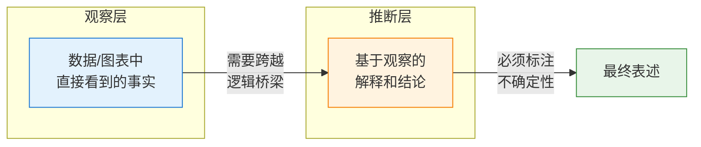
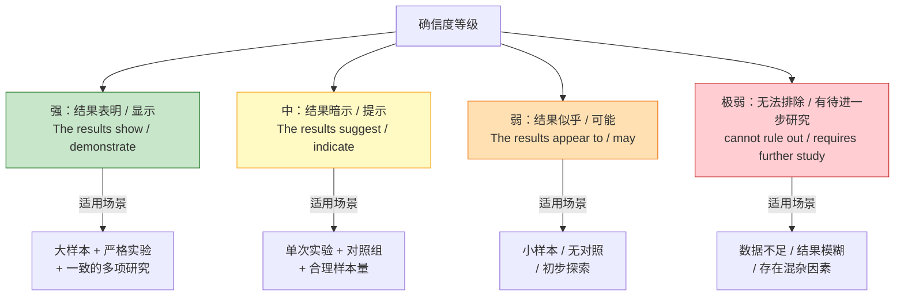

# 结论表达

> **所属路径**：`00_高中复习/04_科学思维/04_图表与证据/03_结论表达`
> **预计学习时间**：40 分钟
> **难度等级**：⭐⭐

---

## 前置知识

- [证据强弱](../02_证据强弱/02_证据强弱.md) — 你需要知道不同类型的证据可信度不同
- [因果关系](../../03_相关与因果/02_因果关系/02_因果关系.md) — 你需要理解相关关系和因果关系的区别
- [提出假设](../../02_观察与假设/02_提出假设/02_提出假设.md) — 你需要了解假设和验证的基本流程

> 如果以上内容还不熟悉，建议先完成对应课程再继续。

---

## 学习目标

完成本节后，你将能够：

1. 区分"观察"（数据本身说了什么）和"推断"（我们从数据中猜测了什么）
2. 使用恰当的限定词表达结论，避免过度推断
3. 在结论中正确说明研究的局限性
4. 将这些表达习惯与人工智能中的模型评估报告、论文写作关联起来
5. 用 Python 编写一个结构化的实验结论生成器

---

## 正文讲解

### 1. "证明了"还是"暗示了"？——一词之差的巨大鸿沟

假设你做了一个实验：让 100 名学生分成两组，一组使用新学习方法，另一组使用传统方法。最终新方法组的平均成绩比传统组高了 5 分。你会怎么描述这个发现？

- 说法 A："新方法**证明了**它能提高成绩。"
- 说法 B："在本次实验中，使用新方法的学生平均成绩**高于**传统方法组 5 分，这**表明**新方法**可能**有助于提高成绩。"

哪个更好？答案是说法 B。说法 A 存在两个严重问题：第一，"证明了"这个词太强——一次实验不能"证明"任何事情；第二，它没有说明具体条件和限制。说法 B 更准确，因为它区分了"观察到的事实"和"基于事实的推断"，并用了"可能"来表示不确定性。

这就是 **结论表达（Conclusion Statement）** 的核心技能：**用精确的语言区分你看到了什么（观察）和你认为这意味着什么（推断）**。

### 2. 观察与推断：两个不同的层次

**观察（Observation）** 是对数据本身的客观描述，不添加任何解释。例如：

- "A 组的平均分为 82 分，B 组为 77 分"
- "在 10000 张测试图片上，模型 X 的准确率为 91.3%"
- "训练损失从 2.4 降低到 0.3"

**推断（Inference）** 是基于观察提出的解释或结论，包含了你的判断。例如：

- "新方法可能有助于提高成绩"（从分数差推断方法的效果）
- "模型 X 在该数据集上表现优于基线"（从准确率推断模型质量）
- "模型已经收敛"（从损失变化推断训练状态）



> 📌 **图解说明**：从观察到推断需要跨越一座"逻辑桥梁"。这座桥梁越长（推断越远离直接证据），我们的表述就应该越谨慎。

关键原则是：**观察可以直接陈述，推断必须加上限定词**。你可以说"A 组得分更高"（观察），但不应该说"A 组更聪明"（过度推断）。

### 3. 限定词的艺术：从"证明"到"暗示"

科学写作中有一套精细的限定词体系，用来表示不同程度的确信度。了解这些表达方式，能让你的结论既严谨又准确。



> 📌 **图解说明**：限定词的强度与证据的可靠性相匹配——证据越强，表述越可以肯定；证据越弱，表述越需要谨慎。

请注意一个特别重要的词：**"证明（prove）"** 。在严格的科学语境中，几乎从不使用"证明"这个词（数学证明除外）。科学实验只能"支持"或"不支持"一个假设，不能"证明"它。因为总可能存在我们尚未考虑到的因素。

### 4. 说明局限性：诚实是最好的策略

好的结论不仅说"我发现了什么"，还要说"我的发现有什么局限"。这不是在"示弱"，恰恰相反——能够正确识别并坦承局限性，是专业性和诚实度的体现。

常见的局限性包括：

**样本局限**："本实验仅在 XX 数据集上测试，结果可能无法推广到其他数据集。"

**条件局限**："实验在受控环境下进行，真实场景中可能存在更多 **[干扰因素](../../01_变量与控制/03_干扰因素/03_干扰因素.md)** 。"

**方法局限**："本研究采用观察性设计，无法排除 **[混杂变量](../../03_相关与因果/04_辛普森悖论与混杂/)** 的影响。"

**度量局限**："准确率只反映了总体表现，未考虑不同类别之间的表现差异。"

在人工智能论文中，专门有一个 "Limitations" 章节来讨论这些问题。这已经成为学术界的标准做法。

### 5. 一个完整的结论模板

综合以上内容，我们可以总结出一个结构化的结论表达模板：

```
1. 实验目标：我们想研究什么？
2. 实验方法：我们怎么做的？（简要）
3. 观察结果：数据直接告诉我们什么？（客观描述）
4. 推断结论：这些数据可能意味着什么？（带限定词）
5. 局限说明：这个结论有什么限制？
6. 后续方向：接下来可以做什么来进一步验证？
```

让我们把上面的学习方法实验用这个模板重写：

> **实验目标**：比较新学习方法和传统方法对考试成绩的影响。
>
> **实验方法**：100 名学生随机分为两组，分别使用两种方法学习 4 周后参加相同考试。
>
> **观察结果**：新方法组平均分 82 分（标准差 8.2），传统方法组平均分 77 分（标准差 9.1），差异为 5 分。
>
> **推断结论**：结果**表明**，在本实验条件下，新学习方法**可能**有助于提高考试成绩。
>
> **局限说明**：本实验仅涉及一所学校的学生，可能存在样本选择偏差；实验周期较短（4 周），长期效果有待验证。
>
> **后续方向**：建议在多所学校开展更大规模的重复实验，并延长实验周期。

### 6. 从结论表达到 AI 实践

在人工智能领域，结论表达直接体现在以下场景中：

**模型评估报告**：描述模型在各个指标上的表现时，要区分观察（"准确率为 91.3%"）和推断（"模型在该任务上表现良好"）。

**论文摘要**：好的摘要会说"Our model achieves 91.3% accuracy, suggesting that the proposed architecture is effective for this task"，而不会说"Our model proves that..."。

**实验对比**：在比较多个模型时，要说明比较的条件（相同数据集、相同硬件、相同超参数），并在结论中承认局限。

---

## 动手实践

让我们用 Python 编写一个"结构化实验结论生成器"，帮助你养成规范表达结论的习惯。

```python
# 文件：code/conclusion_formatter.py
# 结构化实验结论生成器
# 环境要求：Python 3.10+（仅使用标准库）

def format_conclusion(
    objective: str,
    method: str,
    group_a_name: str,
    group_a_score: float,
    group_b_name: str,
    group_b_score: float,
    sample_size: int,
    metric_name: str = "得分",
    limitations: list[str] | None = None,
    next_steps: list[str] | None = None,
):
    """
    根据实验数据生成结构化的结论表述。
    自动根据样本量和差异大小选择合适的限定词。
    """
    diff = group_a_score - group_b_score
    diff_pct = abs(diff) / max(group_b_score, 0.001) * 100

    # 根据证据强度选择限定词
    if sample_size >= 1000 and diff_pct > 5:
        hedge_word = "表明"
        confidence = "较高"
    elif sample_size >= 100:
        hedge_word = "提示"
        confidence = "中等"
    elif sample_size >= 30:
        hedge_word = "可能暗示"
        confidence = "较低"
    else:
        hedge_word = "初步暗示，但尚无法确认"
        confidence = "很低"

    better = group_a_name if diff > 0 else group_b_name
    worse = group_b_name if diff > 0 else group_a_name

    print("=" * 60)
    print("  📋 结构化实验结论报告")
    print("=" * 60)

    print(f"\n  【实验目标】")
    print(f"  {objective}")

    print(f"\n  【实验方法】")
    print(f"  {method}")
    print(f"  样本量：{sample_size}")

    print(f"\n  【观察结果】（客观描述，不加解释）")
    print(f"  • {group_a_name} 的{metric_name}为 {group_a_score:.2f}")
    print(f"  • {group_b_name} 的{metric_name}为 {group_b_score:.2f}")
    print(f"  • 差异：{abs(diff):.2f}（{diff_pct:.1f}%）")

    print(f"\n  【推断结论】（带限定词，标注确信度）")
    print(f"  结果{hedge_word}，{better}在{metric_name}方面")
    print(f"  可能优于{worse}。")
    print(f"  （确信度：{confidence}，基于样本量 {sample_size}）")

    print(f"\n  【局限说明】")
    if limitations:
        for i, lim in enumerate(limitations, 1):
            print(f"  {i}. {lim}")
    else:
        print(f"  1. 单次实验结果，未经重复验证")
        print(f"  2. 样本量为 {sample_size}，统计功效有待评估")

    print(f"\n  【后续方向】")
    if next_steps:
        for i, step in enumerate(next_steps, 1):
            print(f"  {i}. {step}")
    else:
        print(f"  1. 增大样本量后重复实验")
        print(f"  2. 在不同条件下验证结论的普适性")

    print("\n" + "=" * 60)


# ---- 示例 1：学习方法对比实验 ----
print("\n📌 示例 1：学习方法对比\n")
format_conclusion(
    objective="比较新学习方法和传统方法对数学考试成绩的影响",
    method="将 100 名学生随机分为两组，分别使用两种方法学习 4 周后参加相同考试",
    group_a_name="新方法组",
    group_a_score=82.0,
    group_b_name="传统方法组",
    group_b_score=77.0,
    sample_size=100,
    metric_name="平均分",
    limitations=[
        "仅在一所学校进行，可能存在样本选择偏差",
        "实验周期为 4 周，长期效果未知",
        "未控制学生的课外学习时间",
    ],
    next_steps=[
        "在多所学校开展重复实验",
        "延长实验周期至一个学期",
        "记录并控制更多干扰变量",
    ],
)

# ---- 示例 2：AI 模型对比 ----
print("\n📌 示例 2：AI 模型准确率对比\n")
format_conclusion(
    objective="比较模型 A 和模型 B 在图像分类任务上的准确率",
    method="在 ImageNet 验证集上评估两个模型的 Top-1 准确率",
    group_a_name="模型 A (ResNet-50)",
    group_a_score=76.1,
    group_b_name="模型 B (VGG-16)",
    group_b_score=71.6,
    sample_size=50000,
    metric_name="准确率（%）",
    limitations=[
        "仅在 ImageNet 数据集上测试，对其他领域的泛化能力未知",
        "仅比较了准确率，未考虑推理速度和模型大小",
        "未进行多次随机种子的重复实验",
    ],
    next_steps=[
        "在更多数据集上对比两个模型",
        "综合准确率、速度、模型大小进行多维度评估",
    ],
)
```

**运行说明**：
- 环境要求：Python 3.10+（仅使用标准库）
- 运行命令：`python code/conclusion_formatter.py`

**预期输出**（示例 2 部分）：
```
📌 示例 2：AI 模型准确率对比

============================================================
  📋 结构化实验结论报告
============================================================

  【实验目标】
  比较模型 A 和模型 B 在图像分类任务上的准确率

  【实验方法】
  在 ImageNet 验证集上评估两个模型的 Top-1 准确率
  样本量：50000

  【观察结果】（客观描述，不加解释）
  • 模型 A (ResNet-50) 的准确率（%）为 76.10
  • 模型 B (VGG-16) 的准确率（%）为 71.60
  • 差异：4.50（6.3%）

  【推断结论】（带限定词，标注确信度）
  结果表明，模型 A (ResNet-50)在准确率（%）方面
  可能优于模型 B (VGG-16)。
  （确信度：较高，基于样本量 50000）

  【局限说明】
  1. 仅在 ImageNet 数据集上测试，对其他领域的泛化能力未知
  2. 仅比较了准确率，未考虑推理速度和模型大小
  3. 未进行多次随机种子的重复实验

  【后续方向】
  1. 在更多数据集上对比两个模型
  2. 综合准确率、速度、模型大小进行多维度评估

============================================================
```

这个结论生成器帮助你养成一个习惯：每次得到实验结果后，不要急着下结论，而是按照"目标→方法→观察→推断→局限→后续"的结构来组织表达。注意程序会根据样本量自动选择不同强度的限定词——样本量越大，表述越可以肯定。

---

## 典型误区

| 误区 | 正确理解 |
| ---- | -------- |
| "数据说明了 X"（将推断当作观察） | 数据本身不会"说明"什么——说明是人做出的解释，应该加限定词 |
| "结果证明了我们的假设" | 实验只能"支持"或"不支持"假设，几乎不能"证明"（数学除外） |
| "说局限性会让结论显得不可信" | 恰恰相反，坦承局限性是专业和诚实的表现，反而增加可信度 |
| "显著差异就是大差异" | "统计显著"和"实际重要"是两回事——0.1% 的差异可能统计显著但实际无关紧要 |

---

## 练习题

### 练习 1：区分观察与推断（难度：⭐）

请判断以下每条陈述是"观察"还是"推断"：

1. "模型在测试集上的准确率为 87.5%。"
2. "新模型明显优于旧模型。"
3. "训练损失从第 10 轮开始不再下降。"
4. "模型已经过拟合了。"
5. "数据集中有 30% 的样本属于类别 A。"

<details>
<summary>💡 提示</summary>

观察是直接从数据中读取的事实，不需要判断或解释。推断是基于观察做出的判断或结论。

</details>

<details>
<summary>✅ 参考答案</summary>

1. **观察** — 直接从测试结果中读取的数值
2. **推断** — "明显优于"是一个判断，需要统计检验支持
3. **观察** — 直接从损失曲线中读取的趋势
4. **推断** — 过拟合是对"训练损失下降但验证损失上升"现象的解释
5. **观察** — 直接从数据统计中得到的比例

</details>

### 练习 2：改写过度推断的结论（难度：⭐⭐）

以下结论存在过度推断的问题，请改写为更严谨的版本：

> "我们的实验证明，深度学习模型在所有图像识别任务中都优于传统机器学习方法。实验中，我们在 CIFAR-10 数据集上测试了 ResNet 和 SVM，ResNet 准确率为 93%，SVM 为 78%。"

<details>
<summary>💡 提示</summary>

找出三个问题：（1）用了"证明"；（2）说了"所有任务"但只测了一个数据集；（3）只比较了一对模型。改写时应将观察和推断分开，并说明局限。

</details>

<details>
<summary>✅ 参考答案</summary>

改写后：

> **观察**：在 CIFAR-10 数据集上，ResNet 的准确率为 93%，SVM 的准确率为 78%，差距为 15 个百分点。
>
> **推断**：结果**表明**，在 CIFAR-10 图像分类任务中，ResNet **可能**具有显著优势。
>
> **局限**：本实验仅在一个数据集（CIFAR-10）上比较了一个深度学习模型和一个传统模型，**无法推广**到"所有图像识别任务"。此外，SVM 的超参数可能未充分优化。

关键修改：将"证明"改为"表明"；将"所有任务"限定为"CIFAR-10"；增加了局限说明。

</details>

### 练习 3：编程挑战——结论强度自动评估（难度：⭐⭐）

编写一个函数 `evaluate_conclusion(text)`，接收一句结论文本，检测其中是否包含过度推断的词语（如"证明""肯定""所有""总是"），并给出修改建议。

<details>
<summary>💡 提示</summary>

定义一个过度推断词语的列表，对输入文本进行逐词匹配，发现时输出警告和推荐替换词。

</details>

<details>
<summary>✅ 参考答案</summary>

```python
def evaluate_conclusion(text):
    overstatements = {
        "证明": "表明/提示",
        "肯定": "可能/很可能",
        "所有": "在测试范围内的",
        "总是": "在多数情况下",
        "绝对": "在本实验条件下",
        "必然": "在一定程度上",
    }
    print(f"原文：{text}\n")
    found = False
    for word, suggestion in overstatements.items():
        if word in text:
            found = True
            print(f"  ⚠️ 发现过度推断词：'{word}'")
            print(f"     建议替换为：'{suggestion}'")
    if not found:
        print("  ✅ 未发现明显的过度推断，表述较为严谨。")

evaluate_conclusion("实验证明该方法在所有场景下都肯定有效。")
print()
evaluate_conclusion("实验结果表明该方法在测试数据集上可能具有优势。")
```

</details>

---

## 下一步学习

- 📖 下一个知识点：[数据可视化基础](../04_数据可视化基础/04_数据可视化基础.md) — 学会表达结论后，最后学习如何制作清晰诚实的图表来支撑你的结论
- 🔗 相关知识点：[假说检验思路](../../02_观察与假设/04_假说检验思路/04_假说检验思路.md) — 更系统地了解假设检验的流程
- 📚 拓展阅读：[回归分析初步](../../../01_数学基础/10_统计基础/05_回归分析初步/) — 用统计方法来量化变量间的关系

---

## 参考资料

1. [How to Write a Scientific Conclusion — WikiHow](https://www.wikihow.com/Write-a-Conclusion-for-a-Research-Paper) — 科学结论写作的通俗指南（公开访问）
2. [Hedging in Academic Writing — University of Manchester](https://www.phrasebank.manchester.ac.uk/being-cautious/) — 曼彻斯特大学学术短语库中关于限定词的用法指南（公开教育资源）
3. [Python 字符串方法文档](https://docs.python.org/zh-cn/3/library/stdtypes.html#string-methods) — Python 字符串操作的官方文档（官方文档）
