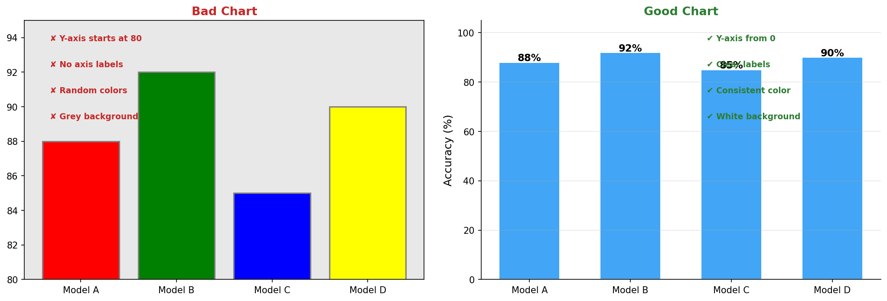
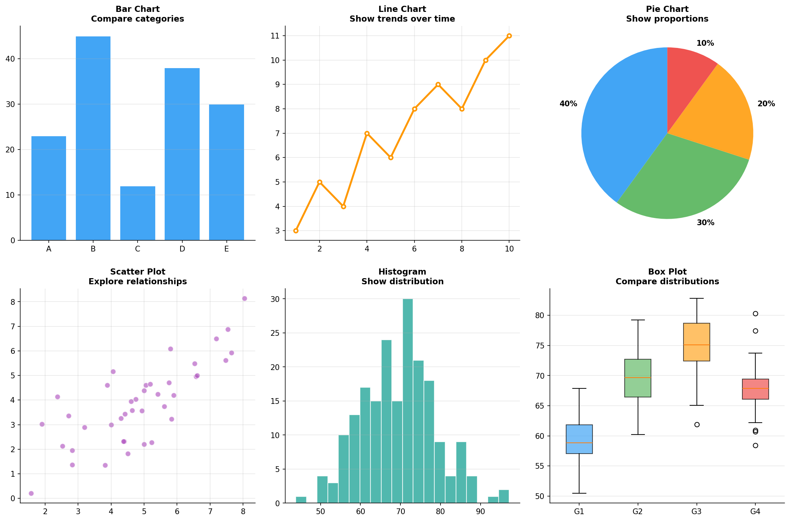
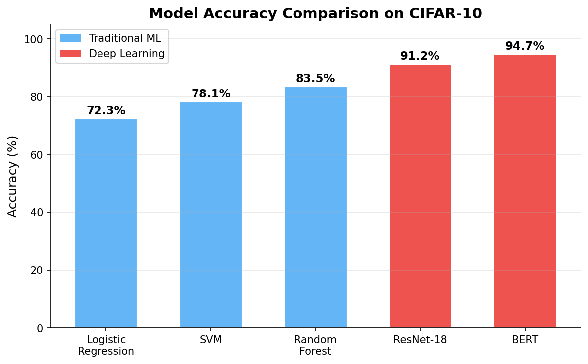
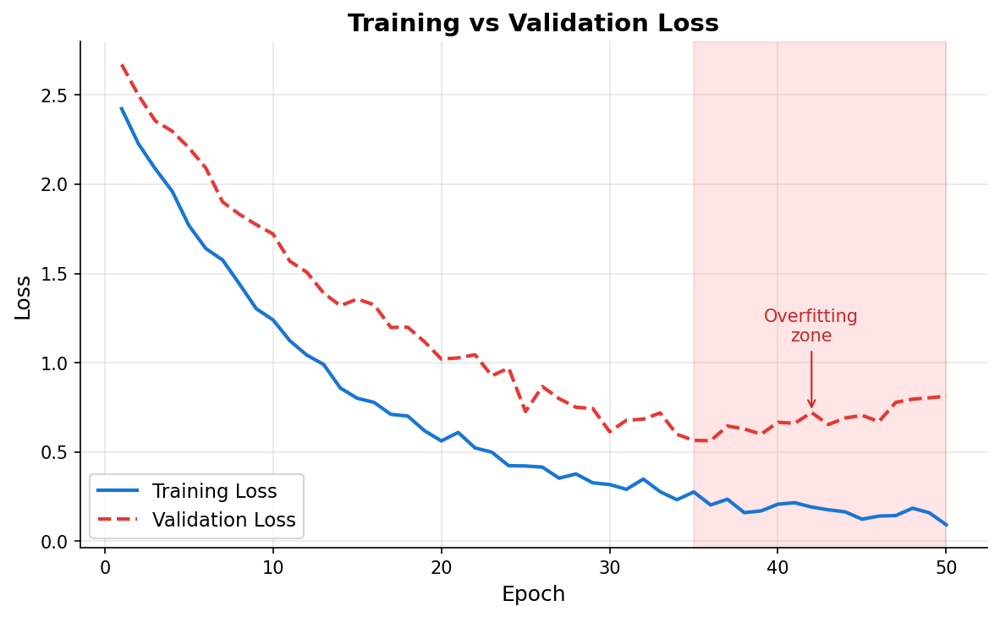
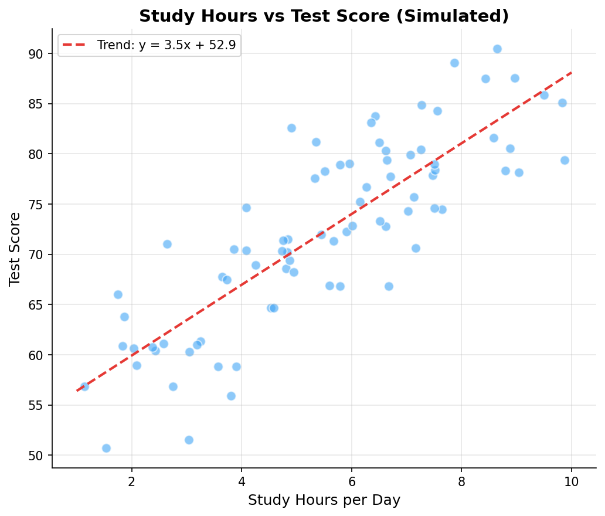

# 数据可视化基础

> **所属路径**：`00_高中复习/04_科学思维/04_图表与证据/04_数据可视化基础`
> **预计学习时间**：45 分钟
> **难度等级**：⭐⭐

---

## 前置知识

- [图表解读](../01_图表解读/01_图表解读.md) — 你需要知道四种基本图表类型和读图五要素
- [结论表达](../03_结论表达/03_结论表达.md) — 你需要理解如何用严谨的方式表达数据发现
- [统计图表](../../../01_数学基础/10_统计基础/03_统计图表/03_统计图表.md) — 你需要了解常见统计图表的基本形态

> 如果以上内容还不熟悉，建议先完成对应课程再继续。

---

## 学习目标

完成本节后，你将能够：

1. 描述优秀数据可视化的核心原则（清晰、诚实、简洁）
2. 根据数据类型选择合适的图表类型
3. 理解"数据墨水比"的概念并应用到图表设计中
4. 用 Python 的 matplotlib 库创建基本的柱状图、折线图和散点图
5. 将数据可视化原则应用于人工智能中的训练监控和结果展示

---

## 正文讲解

### 1. 从"能看懂"到"做得好"

在 **[图表解读](../01_图表解读/01_图表解读.md)** 中，我们学会了如何读懂别人画的图表——检查标题、坐标轴、单位、刻度、趋势。现在，我们要跨越到另一个层面：**自己制作一张好图**。

什么是"好图"？好的数据可视化有三个核心原则：

- **清晰（Clear）** ：读者一眼就能看出图表在传达什么信息
- **诚实（Honest）** ：不歪曲、不夸大、不隐瞒数据
- **简洁（Simple）** ：去除一切不必要的装饰，让数据本身成为主角

美国统计学家和可视化先驱 Edward Tufte 用一个精妙的概念总结了这三个原则。

### 2. 数据墨水比：少即是多

**数据墨水比（Data-Ink Ratio）** 是 Edward Tufte 在其经典著作中提出的概念。它的定义很直观：

$$
\text{数据墨水比} = \frac{\text{用于展示数据的墨水量}}{\text{图表中全部墨水量}}
$$

> **直觉解读**：一张图上有多少"墨水"是在展示实际数据的？如果你去掉某个元素后图表传达的信息没有减少，那这个元素就是多余的"非数据墨水"。

好的图表应该追求高数据墨水比——把每一滴"墨水"都花在展示数据上，而不是花在花哨的装饰上。

哪些是常见的"非数据墨水"？

- 过于密集的网格线
- 不必要的 3D 效果（把简单的柱状图做成 3D 立体）
- 花哨的背景色和纹理填充
- 过多的图例和标注
- 装饰性的边框和阴影

下面这张图直观地对比了"差图"和"好图"的区别：



> 📌 **图解说明**：左图（差图）犯了多个常见错误——坐标轴从 80 开始、随机颜色、灰色背景、缺少标签；右图（好图）修复了所有问题——坐标轴从 0 开始、统一颜色、白色背景、清晰标签。同样的数据，展示方式的差异极大地影响了阅读体验和信息传达。你可以运行 `code/plot_visualization_examples.py` 自行生成这张图。

### 3. 选择正确的图表类型

选错图表类型，就像用锤子去拧螺丝——虽然勉强能用，但效果很差。以下是一个实用的选择指南：

| 你想表达的信息 | 推荐的图表 | 不推荐的图表 | 为什么 |
| -------------- | ---------- | ------------ | ------ |
| 不同类别的数量比较 | 柱状图 | 饼图 | 人眼对长度的比较比对角度精确 |
| 随时间的变化趋势 | 折线图 | 柱状图 | 折线的连续性更好地表达趋势 |
| 各部分占总体的比例 | 饼图（≤5 类） | 柱状图 | 饼图天然传达"部分与整体"的关系 |
| 两个变量的关系 | 散点图 | 折线图 | 散点图不假设数据有顺序关系 |
| 数据的分布形态 | 直方图 / 箱线图 | 饼图 | 直方图展示频率分布，箱线图展示五数概括 |

下面这张图展示了六种常见图表类型的真实示例。每种图表都使用了实际数据，让你一目了然地看到它们的形态和适用场景：



> 📌 **图解说明**：六种常见图表类型——(a) 柱状图适合比较类别；(b) 折线图适合展示趋势；(c) 饼图适合展示比例（类别不超过 5-6 个）；(d) 散点图适合探索两变量关系；(e) 直方图适合展示数据分布；(f) 箱线图适合比较多组数据的分布特征。你可以运行 `code/plot_visualization_examples.py` 自行生成这张图。

### 4. 好图表的七个细节

除了选对类型和保持简洁，一张好图表还需要注意以下细节：

**① 标题要具体**：不写"数据图"，写"2023 年各省份高考录取率对比"。标题应该让读者不看图就知道图表在说什么。

**② 坐标轴要标注**：每个轴都需要名称和单位。"分数（分）"比"分数"更清晰，"时间（月）"比"时间"更明确。

**③ 从零开始（柱状图）** ：柱状图的纵轴应该从 0 开始，否则会像我们在 **[图表解读](../01_图表解读/01_图表解读.md)** 中看到的那样产生误导。折线图例外——当你关注变化趋势而非绝对值时，可以调整坐标范围。

**④ 颜色要有意义**：不要为了好看随意使用颜色。同一组数据用同一种颜色，不同组用不同颜色。注意对色觉障碍友好——避免仅依靠红绿来区分。

**⑤ 网格线要淡**：网格线的作用是辅助读数，不应该喧宾夺主。设置较低的透明度（如 $\alpha = 0.3$ ）即可。

**⑥ 去除多余边框**：图表的上边框和右边框通常是多余的，去掉它们可以让图表更清爽。

**⑦ 数据标注要精准**：在关键数据点上标注具体数值，但不要在每个点都标——那会让图表变得混乱。

### 5. 人工智能中的可视化实践

在人工智能工作中，你最常需要制作的图表包括：

**训练监控图**：折线图展示训练损失和验证损失随 epoch 的变化。这是判断模型是否收敛、是否过拟合的核心工具。好的训练监控图应该同时展示训练曲线和验证曲线，让读者一目了然。

**模型对比图**：柱状图对比不同模型在同一基准上的表现。注意坐标轴从 0 开始，并在柱子上标注具体数值。

**数据分布图**：直方图展示数据集中各个类别的样本数量分布。如果分布严重不平衡（比如 90% 的样本属于一个类别），需要在报告中特别说明。

**特征关系图**：散点图展示两个特征之间的关系，帮助判断是否存在 **[相关关系](../../03_相关与因果/01_相关关系/01_相关关系.md)** ，或者是否有异常值需要处理。

---

## 动手实践

让我们用 Python 的 matplotlib 库来实践上面学到的原则，创建几种常见的图表。下面展示的三张图分别演示了柱状图、折线图和散点图的制作，每张图都遵循了我们讨论过的可视化原则。

### 图表 1：模型准确率对比（柱状图）

下面这张柱状图对比了传统机器学习模型和深度学习模型在 CIFAR-10 数据集上的准确率：



> 📌 **图解说明**：柱状图从 0 开始，蓝色表示传统 ML 模型，红色表示深度学习模型。每根柱子上标注了具体数值，去掉了多余的上边框和右边框，网格线设为半透明（ $\alpha = 0.3$ ）。

### 图表 2：训练损失曲线（折线图）

下面这张折线图展示了模型训练过程中训练损失和验证损失的变化，并标注了过拟合区域：



> 📌 **图解说明**：蓝色实线为训练损失，红色虚线为验证损失。第 35 轮之后，验证损失开始上升而训练损失继续下降——这是过拟合的典型信号，用红色阴影区域标出。

### 图表 3：特征关系（散点图）

下面这张散点图展示了学习时长与考试成绩之间的关系，并添加了线性趋势线：



> 📌 **图解说明**：每个蓝色点代表一名学生，红色虚线为线性趋势。从图中可以看到正相关趋势——学习时间越长，成绩倾向越高，但也存在个体差异。

以下是生成这三张图的完整 Python 代码：

```python
# 文件：code/plot_visualization_examples.py
# 数据可视化基础：用 matplotlib 创建清晰诚实的图表
# 环境要求：Python 3.10+, matplotlib>=3.7, numpy>=1.24

import os
import matplotlib.pyplot as plt
import numpy as np

# ---- 全局设置 ----
plt.rcParams['font.sans-serif'] = ['DejaVu Sans']
plt.rcParams['axes.unicode_minus'] = False

# 使用脚本自身位置计算输出路径
script_dir = os.path.dirname(os.path.abspath(__file__))
assets_dir = os.path.join(script_dir, '..', 'assets')
os.makedirs(assets_dir, exist_ok=True)

# ============================================================
# 图 1：柱状图 —— 模型准确率对比
# ============================================================
fig, ax = plt.subplots(figsize=(8, 5), facecolor='white')

models = ['Logistic\nRegression', 'SVM', 'Random\nForest', 'ResNet-18', 'BERT']
accuracy = [72.3, 78.1, 83.5, 91.2, 94.7]
colors = ['#64b5f6', '#64b5f6', '#64b5f6', '#ef5350', '#ef5350']

bars = ax.bar(models, accuracy, color=colors, width=0.6, edgecolor='white')

# 在柱子上标注数值
for bar, acc in zip(bars, accuracy):
    ax.text(bar.get_x() + bar.get_width() / 2, bar.get_height() + 0.8,
            f'{acc}%', ha='center', va='bottom', fontsize=11, fontweight='bold')

ax.set_ylim(0, 105)
ax.set_ylabel('Accuracy (%)', fontsize=12)
ax.set_title('Model Accuracy Comparison on CIFAR-10', fontsize=14, fontweight='bold')
ax.spines['top'].set_visible(False)
ax.spines['right'].set_visible(False)
ax.grid(axis='y', alpha=0.3)

# 添加图例说明颜色含义
from matplotlib.patches import Patch
legend_elements = [Patch(facecolor='#64b5f6', label='Traditional ML'),
                   Patch(facecolor='#ef5350', label='Deep Learning')]
ax.legend(handles=legend_elements, loc='upper left', fontsize=10)

plt.tight_layout()
save_path = os.path.join(assets_dir, 'model_comparison.png')
plt.savefig(save_path, dpi=150, bbox_inches='tight', facecolor='white')
print(f"✅ 图 1 已保存：{save_path}")
plt.close()

# ============================================================
# 图 2：折线图 —— 训练损失曲线
# ============================================================
fig, ax = plt.subplots(figsize=(8, 5), facecolor='white')

epochs = np.arange(1, 51)
np.random.seed(42)
train_loss = 2.5 * np.exp(-0.08 * epochs) + 0.1 + np.random.normal(0, 0.03, 50)
val_loss = 2.5 * np.exp(-0.06 * epochs) + 0.3 + np.random.normal(0, 0.05, 50)
# 模拟后期过拟合：验证损失在后期回升
val_loss[35:] += np.linspace(0, 0.4, 15)

ax.plot(epochs, train_loss, color='#1976d2', linewidth=2, label='Training Loss')
ax.plot(epochs, val_loss, color='#e53935', linewidth=2, label='Validation Loss',
        linestyle='--')

# 标注过拟合区域
ax.axvspan(35, 50, alpha=0.1, color='red')
ax.annotate('Overfitting\nzone', xy=(42, val_loss[41]), fontsize=10,
            color='#c62828', ha='center',
            arrowprops=dict(arrowstyle='->', color='#c62828'),
            xytext=(42, val_loss[41] + 0.4))

ax.set_xlabel('Epoch', fontsize=12)
ax.set_ylabel('Loss', fontsize=12)
ax.set_title('Training vs Validation Loss', fontsize=14, fontweight='bold')
ax.legend(fontsize=11)
ax.spines['top'].set_visible(False)
ax.spines['right'].set_visible(False)
ax.grid(alpha=0.3)

plt.tight_layout()
save_path = os.path.join(assets_dir, 'training_loss.png')
plt.savefig(save_path, dpi=150, bbox_inches='tight', facecolor='white')
print(f"✅ 图 2 已保存：{save_path}")
plt.close()

# ============================================================
# 图 3：散点图 —— 特征关系
# ============================================================
fig, ax = plt.subplots(figsize=(7, 6), facecolor='white')

np.random.seed(123)
study_hours = np.random.uniform(1, 10, 80)
scores = 50 + 4 * study_hours + np.random.normal(0, 5, 80)
scores = np.clip(scores, 0, 100)

ax.scatter(study_hours, scores, color='#42a5f5', alpha=0.6, edgecolors='white',
           s=60)

# 添加趋势线
z = np.polyfit(study_hours, scores, 1)
p = np.poly1d(z)
x_line = np.linspace(1, 10, 100)
ax.plot(x_line, p(x_line), color='#e53935', linewidth=2, linestyle='--',
        label=f'Trend: y = {z[0]:.1f}x + {z[1]:.1f}')

ax.set_xlabel('Study Hours per Day', fontsize=12)
ax.set_ylabel('Test Score', fontsize=12)
ax.set_title('Study Hours vs Test Score (Simulated)', fontsize=14, fontweight='bold')
ax.legend(fontsize=10)
ax.spines['top'].set_visible(False)
ax.spines['right'].set_visible(False)
ax.grid(alpha=0.3)

plt.tight_layout()
save_path = os.path.join(assets_dir, 'scatter_study.png')
plt.savefig(save_path, dpi=150, bbox_inches='tight', facecolor='white')
print(f"✅ 图 3 已保存：{save_path}")
plt.close()

print("\n🎉 所有图表已生成！请查看 assets/ 目录下的 PNG 文件。")
print("\n📌 注意这些图表遵循的原则：")
print("   • 坐标轴从 0 开始（柱状图）")
print("   • 去除了上边框和右边框")
print("   • 使用淡网格线（alpha=0.3）")
print("   • 关键数据点有标注")
print("   • 颜色有明确含义（蓝=传统ML，红=深度学习）")
print("   • 白色背景，适合各种显示环境")
```

**运行说明**：
- 环境要求：Python 3.10+, matplotlib>=3.7, numpy>=1.24
- 安装依赖：`pip install matplotlib numpy`
- 运行命令：`python code/plot_visualization_examples.py`

**预期输出**：
```
✅ 图 1 已保存：assets/model_comparison.png
✅ 图 2 已保存：assets/training_loss.png
✅ 图 3 已保存：assets/scatter_study.png

🎉 所有图表已生成！请查看 assets/ 目录下的 PNG 文件。

📌 注意这些图表遵循的原则：
   • 坐标轴从 0 开始（柱状图）
   • 去除了上边框和右边框
   • 使用淡网格线（alpha=0.3）
   • 关键数据点有标注
   • 颜色有明确含义（蓝=传统ML，红=深度学习）
   • 白色背景，适合各种显示环境
```

运行这段代码后，你会在 `assets/` 目录下得到三张 PNG 图片（上方已展示）。仔细观察它们——每一个设计选择（坐标轴范围、颜色、标注位置、边框）都对应着我们在正文中讨论的原则。尝试修改代码，比如把柱状图的 `set_ylim(0, 105)` 改成 `set_ylim(70, 100)`，看看"截断坐标轴"的效果。

---

## 典型误区

| 误区 | 正确理解 |
| ---- | -------- |
| "图表越花哨越专业" | 恰恰相反，过多的装饰元素会降低数据墨水比，分散读者注意力 |
| "饼图万能，什么都能用" | 饼图只适合展示少量类别的比例关系，超过 5-6 个类别时应改用柱状图 |
| "3D 效果让图表更立体更好看" | 3D 效果会严重歪曲数据的视觉比例，是数据可视化中最常见的反模式 |
| "只要数据准确，图表怎么画都行" | 展示方式本身就会影响读者的理解——同样准确的数据，不同的呈现方式可能传达完全不同的印象 |

---

## 练习题

### 练习 1：选择图表类型（难度：⭐）

请为以下每种数据场景选择最合适的图表类型，并说明理由：

1. 展示公司四个部门各自的收入占总收入的百分比
2. 展示一个城市过去 30 天的气温变化
3. 展示 5 种手机品牌的销量对比
4. 探索学生的睡眠时间与注意力得分之间的关系

<details>
<summary>💡 提示</summary>

回忆图表类型选择流程：比例→饼图，趋势→折线图，类别比较→柱状图，两变量关系→散点图。

</details>

<details>
<summary>✅ 参考答案</summary>

1. **饼图** — 4 个类别的比例，类别数量合适，适合展示"部分与整体"的关系
2. **折线图** — 时间序列数据，折线图最适合展示随时间的变化趋势
3. **柱状图** — 5 个类别的数量比较，用柱子长度直观对比
4. **散点图** — 两个连续变量的关系，散点图可以同时展示方向、强度和异常值

</details>

### 练习 2：找出图表中的问题（难度：⭐⭐）

假设你看到一张图表，具有以下特征：
- 3D 立体柱状图
- 纵轴从 85 开始（而非 0）
- 每根柱子都有渐变色和阴影效果
- 没有坐标轴标签和标题
- 背景是深蓝色星空图案

请列出这张图表违反了哪些数据可视化原则，并说明如何改进。

<details>
<summary>💡 提示</summary>

逐条检查：数据墨水比、坐标轴起始值、图表必要元素（标题、标签、单位）、3D 效果的影响。

</details>

<details>
<summary>✅ 参考答案</summary>

违反的原则及改进建议：

1. **3D 效果** → 改为 2D 柱状图。3D 效果歪曲柱子的视觉高度，不同角度看同一数据会产生不同印象
2. **纵轴从 85 开始** → 改为从 0 开始。截断坐标轴会放大微小差异，造成误导
3. **渐变色和阴影** → 改为纯色填充。这些装饰降低了数据墨水比
4. **缺少标题和标签** → 添加描述性标题、坐标轴名称和单位
5. **星空背景** → 改为白色背景。花哨背景严重分散注意力，数据墨水比极低

改进后应该是：白色背景、2D 纯色柱状图、纵轴从 0 开始、有清晰的标题和坐标轴标签。

</details>

### 练习 3：编程挑战——改善一张"差图"（难度：⭐⭐）

以下代码生成了一张违反多项可视化原则的"差图"。请修改代码，使其符合好图表的标准。

```python
import matplotlib.pyplot as plt

categories = ['A', 'B', 'C', 'D']
values = [88, 92, 85, 90]

fig, ax = plt.subplots()
ax.bar(categories, values, color=['red', 'green', 'blue', 'yellow'])
ax.set_ylim(80, 95)  # 截断坐标轴
plt.savefig('bad_chart.png')
```

<details>
<summary>💡 提示</summary>

需要修改的地方：(1) 坐标轴从 0 开始；(2) 添加标题和坐标轴标签；(3) 使用有意义的颜色；(4) 去除多余边框；(5) 添加数据标注。

</details>

<details>
<summary>✅ 参考答案</summary>

```python
import matplotlib.pyplot as plt

categories = ['Model A', 'Model B', 'Model C', 'Model D']
values = [88, 92, 85, 90]

fig, ax = plt.subplots(figsize=(8, 5), facecolor='white')
bars = ax.bar(categories, values, color='#42a5f5', width=0.6,
              edgecolor='white')

for bar, val in zip(bars, values):
    ax.text(bar.get_x() + bar.get_width() / 2, bar.get_height() + 0.5,
            f'{val}%', ha='center', fontsize=11, fontweight='bold')

ax.set_ylim(0, 105)       # 从 0 开始
ax.set_ylabel('Accuracy (%)', fontsize=12)
ax.set_title('Model Accuracy Comparison', fontsize=14, fontweight='bold')
ax.spines['top'].set_visible(False)
ax.spines['right'].set_visible(False)
ax.grid(axis='y', alpha=0.3)
plt.tight_layout()
plt.savefig('good_chart.png', dpi=150, bbox_inches='tight',
            facecolor='white')
```

</details>

---

## 下一步学习

本节是"图表与证据"主题的最后一个知识点，也是"科学思维"模块的最后一站。恭喜你完成了整个阶段 00（高中复习）的科学思维部分！🎉

你已经建立起了一套完整的科学思维工具链：

1. 📐 [变量与控制](../../01_变量与控制/) — 学会了设计实验
2. 🔍 [观察与假设](../../02_观察与假设/) — 学会了从观察中提出假设
3. 🔗 [相关与因果](../../03_相关与因果/) — 学会了区分相关与因果
4. 📊 [图表与证据](../) — 学会了用图表呈现证据、评判证据强弱、表达结论、制作可视化

**接下来的学习方向**：

- 🚀 **进入阶段 01（基础能力）** ：[开发环境与技术英语](../../../../01_基础能力/01_开发环境与技术英语/) — 开始搭建你的编程工具链，学习 Python 编程、命令行操作和版本控制，为后续的人工智能学习打下坚实的工程基础
- 📊 **深入数据可视化**：[数据可视化](../../../../01_基础能力/05_数据能力/04_数据可视化/) — 在基础能力阶段进一步学习专业的数据可视化技术
- 📈 **强化统计基础**：[统计基础](../../../01_数学基础/10_统计基础/) — 用更严格的数学工具量化数据特征和关系

---

## 参考资料

1. [The Visual Display of Quantitative Information — Edward Tufte](https://en.wikipedia.org/wiki/The_Visual_Display_of_Quantitative_Information) — Tufte 的经典著作介绍（维基百科，公共知识库），"数据墨水比"概念的出处
2. [Matplotlib 官方教程](https://matplotlib.org/stable/tutorials/index.html) — Python 最流行的绘图库的官方教程（官方文档）
3. [From Data to Viz](https://www.data-to-viz.com/) — 一个帮助你根据数据类型选择图表类型的交互式网站（公开教育资源）
4. [Fundamentals of Data Visualization — Claus O. Wilke](https://clauswilke.com/dataviz/) — 一本关于数据可视化原则的开源在线教材（CC BY-NC-ND 许可）
