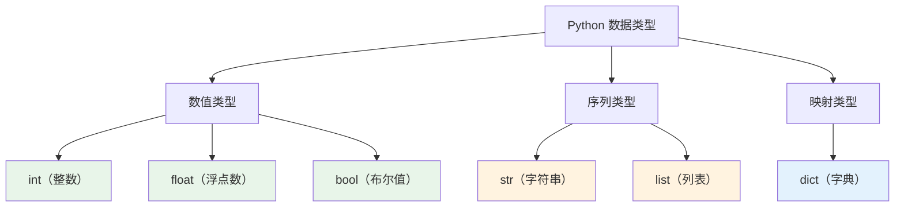
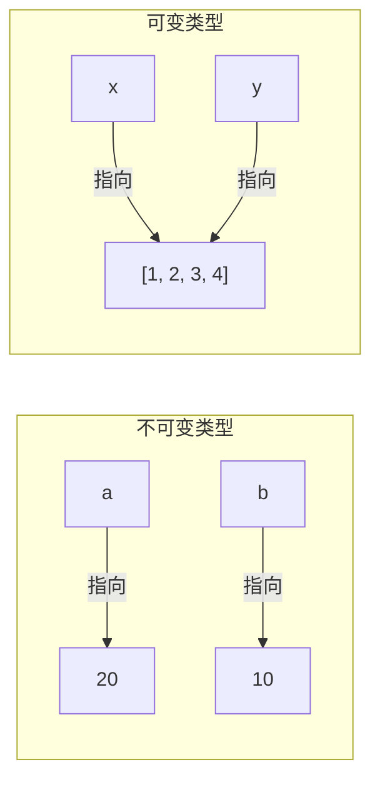

# 变量与数据类型

> **所属路径**：`01_基础能力/01_开发环境与技术英语/01_编程语言基础/01_变量与数据类型`
> **预计学习时间**：50 分钟
> **难度等级**：⭐

---

## 前置知识

- [高中复习/信息素养/文件与文件夹管理](../../../../00_高中复习/03_信息素养/01_文件与文件夹管理/)（了解文件系统和基本操作）
- [高中复习/数学基础/集合与逻辑](../../../../00_高中复习/01_数学基础/11_集合与逻辑/)（了解集合、真假值等基本概念）

> 如果以上内容还不熟悉，建议先完成对应课程再继续。

---

## 学习目标

完成本节后，你将能够：

1. 解释什么是变量，以及 Python 中变量的工作原理（"标签"模型）
2. 区分 Python 的六种核心数据类型：整数、浮点数、布尔值、字符串、列表、字典
3. 使用 `type()` 函数查看任意对象的类型
4. 理解可变类型与不可变类型的区别，并预测赋值操作的行为
5. 完成基本的类型转换操作

---

## 正文讲解

### 1. 从"记住一个数"开始

想象你正在超市购物，手里拿着一张便签纸。你在上面写下今天的预算：`500`。购物过程中你买了一件 `128` 元的商品，于是在便签纸上划掉 `500`，写上 `372`。

编程中的 **变量（Variable）** 就像这张便签纸——它是一个"名字"，指向存储在计算机内存中的某个值。你可以随时查看它，也可以随时更新它。

```python
budget = 500          # 在便签纸上写下 500
budget = budget - 128 # 划掉旧值，写上新值
print(budget)         # 查看便签纸：372
```

不过，Python 中的变量和"便签纸"有一个重要的区别：Python 变量更像是 **贴在物品上的标签**，而不是装东西的盒子。当你写 `budget = 500` 时，Python 先在内存中创建了一个整数对象 `500`，然后把 `budget` 这个标签贴在了它上面。


> 📌 **图解说明**：变量 `budget` 是一个标签（引用），它指向内存中实际存储的整数对象 `500`。

这个"标签模型"对于理解后续的赋值行为、可变类型与不可变类型至关重要，我们稍后会回到这个概念。

### 2. Python 的核心数据类型

便签纸上不只能写数字。你可能还会写"买牛奶"、"√ 已完成"这样的文字和标记。同样，Python 中的数据也有不同的 **数据类型（Data Type）** 。让我们从最常用的六种开始。

#### 整数（int）

**整数（Integer, int）** 就是没有小数点的数字，可以是正数、负数或零。Python 的整数没有大小限制——不管多大的数都能精确表示，这和很多其他编程语言不同。

```python
age = 25
temperature = -3
big_number = 10 ** 100  # 10的100次方，照样精确
print(type(age))        # <class 'int'>
```

#### 浮点数（float）

**浮点数（Floating-point Number, float）** 是带小数点的数字。它在计算机内部使用 IEEE 754 标准存储，这意味着它的精度是有限的——大约 15–17 位有效数字。

```python
pi = 3.14159
price = 19.99
tiny = 1e-10       # 科学计数法，等于 0.0000000001
print(type(price))  # <class 'float'>
```

> ⚠️ **注意**：浮点数精度有限！`0.1 + 0.2` 在 Python 中不等于 `0.3`，而是 `0.30000000000000004`。这不是 Python 的 bug，而是所有使用浮点数的编程语言的共同特征。在后续的 [数值稳定性](../../04_数值计算与科学计算/03_数值稳定性/) 课程中，我们会深入讨论这个问题。

#### 布尔值（bool）

**布尔值（Boolean, bool）** 只有两个取值：`True` 和 `False`。它是做判断和决策的基础，在 [条件与循环](../02_条件与循环/) 课程中会大量使用。

```python
is_student = True
has_discount = False
print(type(is_student))  # <class 'bool'>

# 布尔值可以参与数学运算，True=1, False=0
print(True + True)       # 2
print(False * 10)        # 0
```

#### 字符串（str）

**字符串（String, str）** 是文本数据，用引号包裹。单引号 `'...'` 和双引号 `"..."` 等价，三引号 `'''...'''` 或 `"""..."""` 可以跨多行。

```python
name = "Alice"
greeting = '你好，世界！'
poem = """静夜思
床前明月光，
疑是地上霜。"""
print(type(name))  # <class 'str'>
print(len(name))   # 5（字符串长度）
```

字符串是 **序列类型**，支持索引和切片：

```python
s = "Python"
print(s[0])    # 'P'（第一个字符，索引从0开始）
print(s[-1])   # 'n'（最后一个字符）
print(s[1:4])  # 'yth'（切片：从索引1到3）
```

#### 列表（list）

**列表（List）** 是一种有序的、可以修改的集合，用方括号 `[...]` 表示。列表中的元素可以是任意类型，甚至可以混合类型。

```python
scores = [85, 92, 78, 96]
mixed = [1, "hello", True, 3.14]
print(type(scores))  # <class 'list'>
print(scores[0])     # 85（访问第一个元素）
scores.append(88)    # 在末尾添加元素
print(scores)        # [85, 92, 78, 96, 88]
```

列表在 AI 中无处不在——训练数据的样本集合、模型的超参数列表、批量预测的输出……都可以用列表来表示。

#### 字典（dict）

**字典（Dictionary, dict）** 是一种键值对的集合，用花括号 `{...}` 表示。它的特点是通过"键"快速查找"值"，就像真正的字典通过单词查释义。

```python
student = {
    "name": "Alice",
    "age": 20,
    "scores": [85, 92, 78]
}
print(type(student))      # <class 'dict'>
print(student["name"])    # 'Alice'
student["grade"] = "A"    # 添加新的键值对
```

在 AI 领域，字典常用于存储模型配置、超参数设置、评估指标结果等。

下面这张图总结了六种核心类型之间的关系：



> 📌 **图解说明**：Python 的六种核心数据类型可以分为三大类——数值类型（用于数学运算）、序列类型（有序的、可以通过索引访问的数据）和映射类型（通过键查找值的数据）。

### 3. 可变与不可变

现在让我们回到之前的"标签模型"。Python 的数据类型分为两大阵营：

- **不可变类型（Immutable）**：`int` 、 `float` 、 `bool` 、 `str` 。一旦创建，对象本身不能被修改。
- **可变类型（Mutable）**：`list` 、 `dict` 。对象创建后，内容可以就地修改。

这个区别非常重要！来看一个经典的例子：

```python
# 不可变类型的行为
a = 10
b = a       # b 和 a 都贴在同一个 10 上
a = 20      # a 重新贴到 20 上，b 不受影响
print(b)    # 10

# 可变类型的行为
x = [1, 2, 3]
y = x       # y 和 x 都贴在同一个列表上
x.append(4) # 修改了那个列表对象本身
print(y)    # [1, 2, 3, 4]  ← y 也变了！
```



> 📌 **图解说明**：不可变类型赋值后，修改其中一个变量不影响另一个（它们指向了不同的对象）。可变类型赋值后，两个变量指向同一个对象，修改会同时反映在两个变量上。

如果你想复制一个列表而不受"共享引用"的影响，可以使用切片或 `list()` ：

```python
x = [1, 2, 3]
y = x[:]      # 浅拷贝：创建一个新的列表对象
x.append(4)
print(y)      # [1, 2, 3]  ← y 没有变化
```

### 4. 类型转换

有时候你需要在不同类型之间进行转换。Python 提供了内置函数来完成这件事：

```python
# 字符串 → 整数
age_str = "25"
age = int(age_str)
print(age + 1)  # 26

# 整数 → 浮点数
x = float(10)
print(x)        # 10.0

# 数值 → 字符串
price = 19.99
message = "价格是 " + str(price) + " 元"
print(message)  # 价格是 19.99 元

# 更推荐使用 f-string（格式化字符串）
message = f"价格是 {price} 元"
print(message)  # 价格是 19.99 元
```

类型转换在读取文件数据时特别常用——从文件读进来的数据通常是字符串，你需要用 `int()` 或 `float()` 转换成数字才能做数学运算。这一点在 [文件操作与IO](../07_文件操作与IO/) 课程中会有更详细的实践。

### 5. 动态类型与 `type()` 检查

Python 是一门 **动态类型（Dynamic Typing）** 语言，这意味着你不需要提前声明变量的类型——Python 会在运行时自动推断：

```python
x = 42          # 此时 x 是 int
x = "hello"     # 现在 x 变成了 str
x = [1, 2, 3]   # 又变成了 list
```

这种灵活性让 Python 写起来非常方便，但也可能带来隐患——如果你不小心把一个字符串传给了期望数字的函数，程序就会出错。`type()` 函数是你的"类型检查器"：

```python
value = 3.14
print(type(value))              # <class 'float'>
print(isinstance(value, float)) # True
print(isinstance(value, int))   # False
```

> 💡 **AI 连接**：在机器学习中，数据类型错误是最常见的 bug 来源之一。例如，将一个包含字符串 `"NaN"` 的列表传入 NumPy 数组，就会导致后续所有数值计算失败。后续课程 [类型提示与静态检查](../08_类型提示与静态检查/) 会介绍如何在编码阶段就提前发现这类问题。

---

## 动手实践

让我们用一段完整的代码来综合练习以上所有概念：

```python
# 文件：code/variables_demo.py
# 演示 Python 变量与数据类型的核心概念

# ========== 1. 变量赋值与类型检查 ==========
name = "小明"                    # str
age = 18                         # int
height = 1.75                    # float
is_student = True                # bool
hobbies = ["编程", "读书", "跑步"]  # list
profile = {                      # dict
    "name": name,
    "age": age,
    "height": height,
}

# 打印每个变量的值和类型
for var_name, var_value in [
    ("name", name), ("age", age), ("height", height),
    ("is_student", is_student), ("hobbies", hobbies), ("profile", profile)
]:
    print(f"{var_name:12s} = {str(var_value):30s}  类型: {type(var_value).__name__}")

print()

# ========== 2. 可变 vs 不可变 ==========
print("--- 可变 vs 不可变 ---")
# 不可变：int
a = 100
b = a
a = 200
print(f"a = {a}, b = {b}")  # b 不受影响

# 可变：list
x = [1, 2, 3]
y = x
x.append(4)
print(f"x = {x}, y = {y}")  # y 跟着变了

# 安全复制
x2 = [1, 2, 3]
y2 = x2.copy()  # 或 x2[:]
x2.append(4)
print(f"x2 = {x2}, y2 = {y2}")  # y2 不受影响

print()

# ========== 3. 类型转换 ==========
print("--- 类型转换 ---")
score_str = "95"
score = int(score_str)
print(f"字符串 '{score_str}' → 整数 {score}，加10后 = {score + 10}")

pi = 3.14159
print(f"浮点数 {pi} → 整数 {int(pi)}（截断，不是四舍五入！）")
print(f"整数 10 → 浮点数 {float(10)}")

# ========== 4. 浮点数精度陷阱 ==========
print()
print("--- 浮点数精度 ---")
result = 0.1 + 0.2
print(f"0.1 + 0.2 = {result}")
print(f"0.1 + 0.2 == 0.3? {result == 0.3}")
print(f"近似相等? {abs(result - 0.3) < 1e-9}")  # 推荐的比较方式
```

**运行说明**：
- 环境要求：Python 3.10+
- 运行命令：`python code/variables_demo.py`

**预期输出**：
```
name         = 小明                              类型: str
age          = 18                              类型: int
height       = 1.75                            类型: float
is_student   = True                            类型: bool
hobbies      = ['编程', '读书', '跑步']          类型: list
profile      = {'name': '小明', 'age': 18, 'height': 1.75}  类型: dict

--- 可变 vs 不可变 ---
a = 200, b = 100
x = [1, 2, 3, 4], y = [1, 2, 3, 4]
x2 = [1, 2, 3, 4], y2 = [1, 2, 3]

--- 类型转换 ---
字符串 '95' → 整数 95，加10后 = 105
浮点数 3.14159 → 整数 3（截断，不是四舍五入！）
整数 10 → 浮点数 10.0

--- 浮点数精度 ---
0.1 + 0.2 = 0.30000000000000004
0.1 + 0.2 == 0.3? False
近似相等? True
```

从输出中可以清楚地看到：每个变量都携带了明确的类型信息；可变类型的"共享引用"行为确实会让两个变量同步变化；浮点数精度问题也确实存在。这些都是日后编写 AI 代码时需要时刻注意的基础知识。

---

## 典型误区

| 误区 | 正确理解 |
| ---- | -------- |
| "变量是一个盒子，数据装在里面" | Python 变量是标签（引用），贴在对象上。一个对象可以有多个标签 |
| " `=` 是数学里的等于号" | `=` 是赋值运算符，表示"让左边的名字指向右边的值"。数学等于用 `==` |
| "整数和浮点数没什么区别" | 整数精度无限，浮点数精度有限（约15位）。 `int(3.9)` 是 `3` 而不是 `4` |
| " `True` 和 `'True'` 是一回事" | `True` 是布尔值（可以参与运算），`'True'` 是一个普通字符串 |
| "列表赋值后是独立的两份" | 列表赋值只是复制了引用，两个变量指向同一个对象。需要 `.copy()` 或切片来创建独立副本 |

---

## 练习题

### 练习 1：类型识别（难度：⭐）

观察以下变量，写出每个变量的类型（`int`、`float`、`bool`、`str`、`list`、`dict`）：

```python
a = 42
b = 42.0
c = "42"
d = [42]
e = {"value": 42}
f = True
g = None
```

<details>
<summary>💡 提示</summary>

注意 `42` 和 `42.0` 的区别；想想 `None` 是什么类型？你可以用 `type()` 来验证。

</details>

<details>
<summary>✅ 参考答案</summary>

- `a` → `int`
- `b` → `float`（有小数点就是浮点数）
- `c` → `str`（引号包裹的都是字符串）
- `d` → `list`（方括号）
- `e` → `dict`（花括号 + 键值对）
- `f` → `bool`
- `g` → `NoneType`（ `None` 是 Python 的"空值"，它有自己专属的类型）

</details>

### 练习 2：可变类型陷阱（难度：⭐⭐）

阅读以下代码，**不运行**，预测输出结果：

```python
data = [10, 20, 30]
backup = data
data[0] = 99
print(backup)

info = {"city": "北京"}
info2 = info
info["city"] = "上海"
print(info2)
```

<details>
<summary>💡 提示</summary>

列表和字典都是可变类型。赋值操作只复制引用，不复制内容。

</details>

<details>
<summary>✅ 参考答案</summary>

```
[99, 20, 30]
{'city': '上海'}
```

因为 `backup` 和 `data` 指向同一个列表对象，修改 `data[0]` 后 `backup` 也会看到变化。同理，`info` 和 `info2` 指向同一个字典。

如果想要独立副本：
```python
backup = data.copy()    # 或 data[:]
info2 = info.copy()
```

</details>

### 练习 3：类型转换实践（难度：⭐⭐）

编写一个程序，要求用户输入两个数字（通过 `input()` 函数），然后打印它们的和。注意 `input()` 返回的总是字符串！

<details>
<summary>💡 提示</summary>

你需要使用 `int()` 或 `float()` 将字符串转换为数字。想想什么时候用 `int()`，什么时候用 `float()` 更合适？

</details>

<details>
<summary>✅ 参考答案</summary>

```python
# 方法1：假设输入的是整数
a = int(input("请输入第一个数字："))
b = int(input("请输入第二个数字："))
print(f"它们的和是：{a + b}")

# 方法2：支持小数输入
a = float(input("请输入第一个数字："))
b = float(input("请输入第二个数字："))
print(f"它们的和是：{a + b}")
```

使用 `float()` 更通用，因为它既能处理整数输入（如 `"42"`）也能处理小数输入（如 `"3.14"`）。

</details>

---

## 下一步学习

- 📖 下一个知识点：[条件与循环](../02_条件与循环/02_条件与循环.md) — 学习如何让程序做出判断和重复执行
- 🔗 相关知识点：[字符串与编码](../../02_字符串与编码/) — 深入学习字符串的高级用法
- 🔗 相关知识点：[容器类型深入](../../03_容器类型深入/) — 深入学习列表、字典等容器类型
- 📚 拓展阅读：[Python 数据模型](../../10_元编程与高级特性/05_Python数据模型/) — 了解 Python 对象系统的底层机制

---

## 参考资料

1. [Python 官方教程 - 非正式简介](https://docs.python.org/zh-cn/3/tutorial/introduction.html) — Python 官方中文文档，涵盖数字、字符串和列表（官方文档）
2. [Python 官方教程 - 数据结构](https://docs.python.org/zh-cn/3/tutorial/datastructures.html) — 列表、字典等数据结构的详细说明（官方文档）
3. [Think Python 3rd Edition](https://greenteapress.com/wp/think-python-3rd-edition/) — Allen B. Downey 著，免费在线阅读的 Python 入门教材（CC BY-NC-SA 许可）
4. [Real Python - Basic Data Types](https://realpython.com/python-data-types/) — 图文并茂的 Python 数据类型教程（公开教程）
