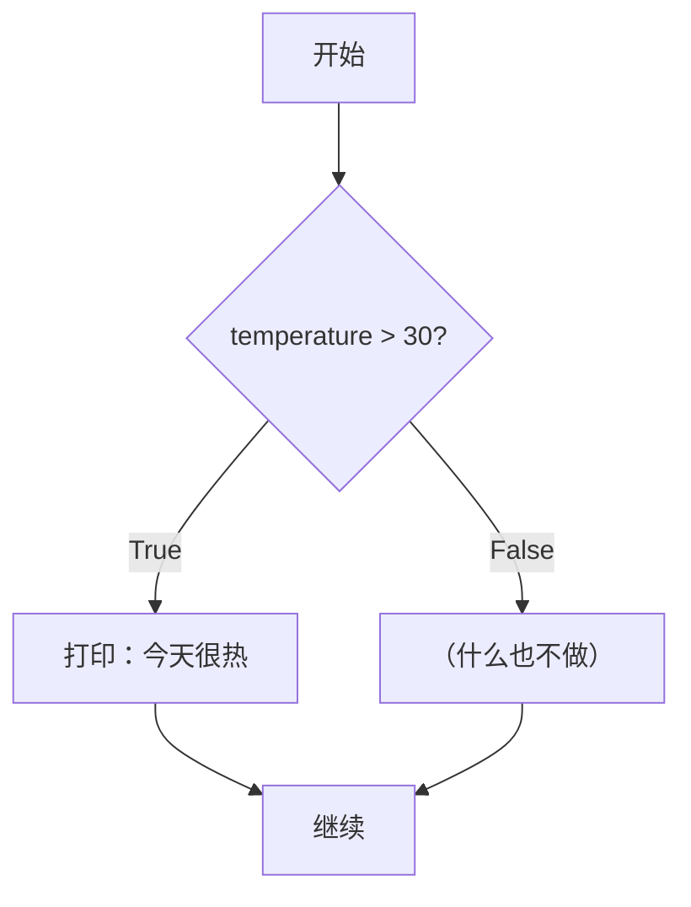
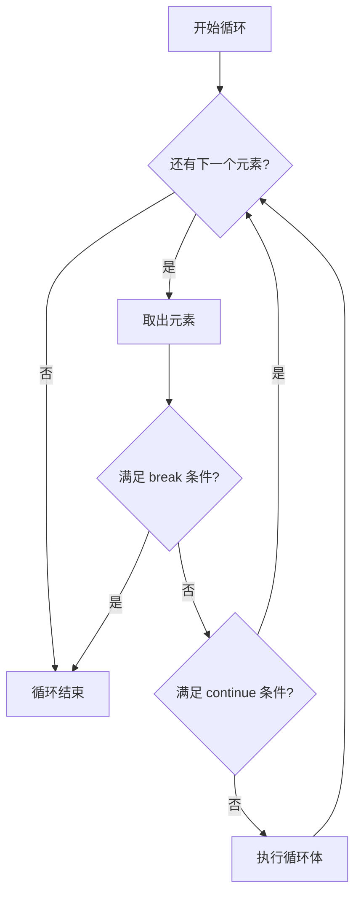

# 条件与循环

> **所属路径**：`01_基础能力/01_开发环境与技术英语/01_编程语言基础/02_条件与循环`
> **预计学习时间**：50 分钟
> **难度等级**：⭐

---

## 前置知识

- [变量与数据类型](../01_变量与数据类型/01_变量与数据类型.md)（理解布尔值、基本数据类型和赋值操作）
- [高中复习/集合与逻辑/命题与逻辑连接词](../../../../00_高中复习/01_数学基础/11_集合与逻辑/02_命题与逻辑连接词/02_命题与逻辑连接词.md)（理解与、或、非逻辑运算）

> 如果以上内容还不熟悉，建议先完成对应课程再继续。

---

## 学习目标

完成本节后，你将能够：

1. 使用 `if` / `elif` / `else` 编写多分支条件判断
2. 使用比较运算符和逻辑运算符构造复杂条件
3. 使用 `for` 循环遍历序列数据
4. 使用 `while` 循环处理条件驱动的重复任务
5. 正确使用 `break` 、 `continue` 控制循环执行流程
6. 编写嵌套循环解决二维问题

---

## 正文讲解

### 1. 程序的"岔路口"——条件判断

现实生活中，我们每天都在做判断：如果下雨了就带伞，否则直接出门；如果考试成绩 ≥ 90 就是优秀，≥ 60 就是及格，否则不及格。程序也需要这种"做判断"的能力，这就是 **条件判断（Conditional Statement）** 。

Python 使用 `if` 关键字来实现条件判断：

```python
temperature = 35

if temperature > 30:
    print("今天很热，记得防晒！")
```

注意两个语法要点：

1. `if` 后面跟一个 **条件表达式** ，条件表达式的结果必须是布尔值（`True` 或 `False`）
2. 条件表达式后面是冒号 `:` ，下一行是缩进的代码块



> 📌 **图解说明**：`if` 语句就像一个岔路口：条件为 `True` 时走左边，为 `False` 时走右边。

#### 多分支判断：if / elif / else

很多时候，判断不止两个分支。Python 用 `elif`（else if 的缩写）和 `else` 来处理多条件：

```python
score = 85

if score >= 90:
    grade = "优秀"
elif score >= 80:
    grade = "良好"
elif score >= 60:
    grade = "及格"
else:
    grade = "不及格"

print(f"成绩：{score}，等级：{grade}")  # 成绩：85，等级：良好
```

Python 从上到下依次检查每个条件，一旦找到第一个为 `True` 的条件，就执行对应的代码块，然后跳过剩余的所有分支。

### 2. 比较运算符和逻辑运算符

条件判断的核心在于构造条件表达式。Python 提供了丰富的 **比较运算符（Comparison Operator）** ：

| 运算符 | 含义 | 示例 | 结果 |
| ------ | ---- | ---- | ---- |
| `==` | 等于 | `5 == 5` | `True` |
| `!=` | 不等于 | `5 != 3` | `True` |
| `>` | 大于 | `5 > 3` | `True` |
| `<` | 小于 | `5 < 3` | `False` |
| `>=` | 大于等于 | `5 >= 5` | `True` |
| `<=` | 小于等于 | `5 <= 3` | `False` |

你还可以用 **逻辑运算符（Logical Operator）** 组合多个条件：

| 运算符 | 含义 | 示例 | 结果 |
| ------ | ---- | ---- | ---- |
| `and` | 与（两个都为真） | `True and False` | `False` |
| `or` | 或（至少一个为真） | `True or False` | `True` |
| `not` | 非（取反） | `not True` | `False` |

一个实用的例子：

```python
age = 25
has_license = True

if age >= 18 and has_license:
    print("可以驾驶")
elif age >= 18 and not has_license:
    print("年龄够了，但需要先考驾照")
else:
    print("年龄不够，不能驾驶")
```

> 💡 **Python 特有技巧**：Python 支持链式比较，`18 <= age < 65` 等价于 `age >= 18 and age < 65`，更接近数学书写习惯。

### 3. 真值测试与 Falsy 值

Python 中不只是布尔值可以做条件——任何对象都可以放在 `if` 后面。Python 会自动判断对象的"真假性"。以下值被视为 `False`（称为 **Falsy 值** ）：

- `False` 、 `None`
- 数值零：`0` 、 `0.0`
- 空序列/集合：`""` 、 `[]` 、 `{}` 、 `()`

其他所有值都视为 `True`（称为 **Truthy 值** ）。

```python
data = []
if data:
    print("数据不为空")
else:
    print("数据为空，需要先加载数据")  # ← 执行这里
```

这个特性在 AI 编程中非常常用——比如检查数据集是否为空、模型参数是否已加载等。

### 4. 重复的力量——for 循环

很多任务需要重复执行：遍历数据集中的每个样本、对每个像素做处理、训练模型的每一个 epoch……这就需要 **循环（Loop）** 。

**`for` 循环** 用于遍历一个序列（列表、字符串、范围等）中的每个元素：

```python
fruits = ["苹果", "香蕉", "橙子"]
for fruit in fruits:
    print(f"我喜欢吃{fruit}")
```

#### range() 函数

当你需要循环固定次数时，使用 `range()` 函数：

```python
# range(n)：生成 0 到 n-1 的整数序列
for i in range(5):
    print(i, end=" ")  # 0 1 2 3 4

print()

# range(start, stop)：从 start 到 stop-1
for i in range(2, 6):
    print(i, end=" ")  # 2 3 4 5

print()

# range(start, stop, step)：指定步长
for i in range(0, 10, 3):
    print(i, end=" ")  # 0 3 6 9
```

#### enumerate() 函数

当你既需要元素的值，又需要元素的索引时，使用 `enumerate()` ：

```python
students = ["Alice", "Bob", "Charlie"]
for index, name in enumerate(students):
    print(f"第{index + 1}名：{name}")
```

### 5. 条件驱动——while 循环

**`while` 循环** 会在条件为 `True` 时反复执行代码块：

```python
count = 0
while count < 5:
    print(f"第 {count} 次循环")
    count += 1  # 别忘了更新计数器！
```

> ⚠️ **警告**：如果 `while` 的条件永远为 `True`，循环就永远不会结束（ **无限循环** ）。确保循环体内有使条件最终变为 `False` 的逻辑，或者有 `break` 语句来手动退出。

`while` 循环适合那些事先不知道要循环多少次的场景：

```python
# 模拟：不断猜数字直到猜对
import random
target = random.randint(1, 10)
guess = 0

while guess != target:
    guess = int(input("猜一个1到10的数字："))
    if guess < target:
        print("太小了！")
    elif guess > target:
        print("太大了！")

print("恭喜，猜对了！")
```

### 6. 循环控制：break 和 continue

有时你需要在循环中途做一些特殊操作：

- **`break`** ：立即退出整个循环
- **`continue`** ：跳过当前这一次迭代，直接进入下一次

```python
# break 示例：找到第一个偶数就停下
numbers = [1, 3, 7, 4, 9, 2]
for n in numbers:
    if n % 2 == 0:
        print(f"找到第一个偶数：{n}")
        break

# continue 示例：只打印奇数
for n in range(10):
    if n % 2 == 0:
        continue  # 跳过偶数
    print(n, end=" ")  # 1 3 5 7 9
```



> 📌 **图解说明**：`break` 直接跳出循环；`continue` 跳过本次循环体的剩余部分，回到循环的条件判断处。

### 7. 嵌套循环

循环可以嵌套——外层循环每执行一次，内层循环会完整执行一遍。这在处理二维数据（如图像像素、矩阵）时非常常见。

```python
# 打印一个 3x3 的乘法表
for i in range(1, 4):
    for j in range(1, 4):
        print(f"{i}×{j}={i*j:2d}", end="  ")
    print()  # 每行结束后换行
```

输出：
```
1×1= 1  1×2= 2  1×3= 3  
2×1= 2  2×2= 4  2×3= 6  
3×1= 3  3×2= 6  3×3= 9  
```

> 💡 **AI 连接**：在深度学习中，嵌套循环的概念无处不在。训练一个模型的基本结构就是两层循环：外层是 epoch（训练轮次），内层是 batch（数据批次）。后续在 [深度学习框架](../../../02_核心原理/03_深度学习/) 课程中你会反复看到这个模式。

---

## 动手实践

下面这段代码综合运用了条件判断、for 循环和 while 循环：

```python
# 文件：code/control_flow_demo.py
# 综合演示条件判断和循环

# ========== 1. 成绩分级 ==========
print("=== 成绩分级系统 ===")
scores = [95, 82, 67, 45, 78, 91, 55, 88]

grade_counts = {"优秀": 0, "良好": 0, "及格": 0, "不及格": 0}

for score in scores:
    if score >= 90:
        grade = "优秀"
    elif score >= 80:
        grade = "良好"
    elif score >= 60:
        grade = "及格"
    else:
        grade = "不及格"
    grade_counts[grade] += 1
    print(f"  分数 {score:3d} → {grade}")

print(f"\n统计结果：{grade_counts}")

# ========== 2. 找素数 ==========
print("\n=== 100以内的素数 ===")
primes = []
for num in range(2, 101):
    is_prime = True
    for divisor in range(2, int(num ** 0.5) + 1):
        if num % divisor == 0:
            is_prime = False
            break
    if is_prime:
        primes.append(num)

print(f"共 {len(primes)} 个素数：")
print(primes)

# ========== 3. 模拟训练过程 ==========
print("\n=== 模拟模型训练 ===")
loss = 10.0       # 初始损失
epoch = 0
target_loss = 0.1 # 目标损失

while loss > target_loss:
    epoch += 1
    loss *= 0.7   # 假设每轮损失降低 30%
    if epoch % 3 == 0:  # 每3轮打印一次
        print(f"  Epoch {epoch:2d}: loss = {loss:.4f}")

print(f"训练完成！共 {epoch} 轮，最终 loss = {loss:.4f}")
```

**运行说明**：
- 环境要求：Python 3.10+
- 运行命令：`python code/control_flow_demo.py`

**预期输出**：
```
=== 成绩分级系统 ===
  分数  95 → 优秀
  分数  82 → 良好
  分数  67 → 及格
  分数  45 → 不及格
  分数  78 → 及格
  分数  91 → 优秀
  分数  55 → 不及格
  分数  88 → 良好

统计结果：{'优秀': 2, '良好': 2, '及格': 2, '不及格': 2}

=== 100以内的素数 ===
共 25 个素数：
[2, 3, 5, 7, 11, 13, 17, 19, 23, 29, 31, 37, 41, 43, 47, 53, 59, 61, 67, 71, 73, 79, 83, 89, 97]

=== 模拟模型训练 ===
  Epoch  3: loss = 3.4300
  Epoch  6: loss = 1.1765
  Epoch  9: loss = 0.4035
  Epoch 12: loss = 0.1384
训练完成！共 13 轮，最终 loss = 0.0969
```

---

## 典型误区

| 误区 | 正确理解 |
| ---- | -------- |
| "忘记冒号和缩进" | Python 用缩进（4个空格）代替大括号表示代码块，`if` 、 `for` 、 `while` 后面必须有冒号 |
| " `=` 和 `==` 搞混" | `=` 是赋值，`==` 是比较。`if x = 5` 在 Python 中会报语法错误 |
| " `elif` 写成 `else if` " | Python 中是 `elif`，不是 `else if`（这是 C/Java 的写法） |
| "忘记更新 while 循环的计数器" | 这会导致无限循环。写 `while` 时先想好退出条件 |
| " `range(5)` 包含 5" | `range(5)` 生成 `0, 1, 2, 3, 4`，不包含 5。Python 的范围是左闭右开 |

---

## 练习题

### 练习 1：FizzBuzz（难度：⭐）

打印 1 到 30 的数字，但是：
- 如果数字能被 3 整除，打印 "Fizz"
- 如果数字能被 5 整除，打印 "Buzz"
- 如果能同时被 3 和 5 整除，打印 "FizzBuzz"
- 否则打印数字本身

<details>
<summary>💡 提示</summary>

先判断能否同时被 3 和 5 整除（即被 15 整除），再分别判断 3 和 5。注意 `if/elif` 的顺序很重要。

</details>

<details>
<summary>✅ 参考答案</summary>

```python
for i in range(1, 31):
    if i % 15 == 0:
        print("FizzBuzz")
    elif i % 3 == 0:
        print("Fizz")
    elif i % 5 == 0:
        print("Buzz")
    else:
        print(i)
```

</details>

### 练习 2：逆序输出（难度：⭐）

使用 `while` 循环，将一个整数的各位数字逆序打印出来。例如输入 `12345`，输出 `5 4 3 2 1`。

<details>
<summary>💡 提示</summary>

用 `%10` 取出最后一位，用 `//10` 去掉最后一位，循环直到数字变成 0。

</details>

<details>
<summary>✅ 参考答案</summary>

```python
num = 12345
while num > 0:
    digit = num % 10
    print(digit, end=" ")
    num = num // 10
# 输出：5 4 3 2 1
```

</details>

### 练习 3：数据清洗统计（难度：⭐⭐）

给定一个包含学生信息的列表，统计有效数据的数量（成绩在 0–100 之间为有效），并计算有效成绩的平均分：

```python
records = [
    {"name": "Alice", "score": 85},
    {"name": "Bob", "score": -1},      # 无效
    {"name": "Charlie", "score": 92},
    {"name": "Diana", "score": 150},    # 无效
    {"name": "Eve", "score": 78},
]
```

<details>
<summary>💡 提示</summary>

使用 `for` 循环遍历列表，用 `if` 判断成绩是否在有效范围内，用 `continue` 跳过无效数据。

</details>

<details>
<summary>✅ 参考答案</summary>

```python
records = [
    {"name": "Alice", "score": 85},
    {"name": "Bob", "score": -1},
    {"name": "Charlie", "score": 92},
    {"name": "Diana", "score": 150},
    {"name": "Eve", "score": 78},
]

valid_count = 0
total_score = 0

for record in records:
    score = record["score"]
    if not (0 <= score <= 100):
        print(f"跳过无效数据：{record['name']}（成绩={score}）")
        continue
    valid_count += 1
    total_score += score

avg = total_score / valid_count if valid_count > 0 else 0
print(f"有效数据：{valid_count} 条，平均分：{avg:.1f}")
# 输出：
# 跳过无效数据：Bob（成绩=-1）
# 跳过无效数据：Diana（成绩=150）
# 有效数据：3 条，平均分：85.0
```

</details>

---

## 下一步学习

- 📖 下一个知识点：[函数与模块](../03_函数与模块/03_函数与模块.md) — 学习如何组织和复用代码
- 🔗 相关知识点：[变量与数据类型](../01_变量与数据类型/01_变量与数据类型.md) — 回顾数据类型和布尔值
- 📚 拓展阅读：[列表推导与生成器](../06_列表推导与生成器/06_列表推导与生成器.md) — 用更简洁的方式写循环

---

## 参考资料

1. [Python 官方教程 - 控制流](https://docs.python.org/zh-cn/3/tutorial/controlflow.html) — Python 条件、循环、函数的官方说明（官方文档）
2. [Think Python - Conditionals and Recursion](https://greenteapress.com/wp/think-python-3rd-edition/) — 条件和递归的详细讲解（CC BY-NC-SA 许可）
3. [Python Tutor](https://pythontutor.com/) — 可视化 Python 代码执行过程，非常适合理解循环和条件（公开工具）
