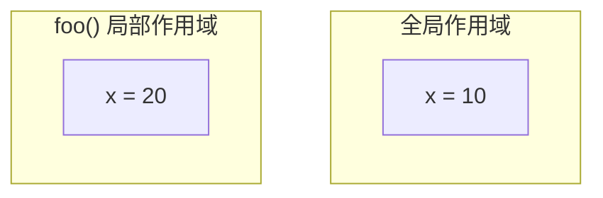

# 函数与模块

> **所属路径**：`01_基础能力/01_开发环境与技术英语/01_编程语言基础/03_函数与模块`
> **预计学习时间**：55 分钟
> **难度等级**：⭐

---

## 前置知识

- [变量与数据类型](../01_变量与数据类型/01_变量与数据类型.md)（理解数据类型和赋值）
- [条件与循环](../02_条件与循环/02_条件与循环.md)（理解控制流和代码块缩进）

> 如果以上内容还不熟悉，建议先完成对应课程再继续。

---

## 学习目标

完成本节后，你将能够：

1. 定义和调用函数，理解参数传递和返回值
2. 区分位置参数、关键字参数、默认参数和可变参数
3. 理解变量作用域（局部与全局）
4. 使用 `import` 导入标准库模块和自定义模块
5. 编写包含多个函数的程序并合理组织代码结构

---

## 正文讲解

### 1. 为什么需要函数？

假设你正在分析一组学生成绩，需要反复计算平均分。不用函数的话，你的代码会充满重复：

```python
# 第一组
scores1 = [85, 92, 78]
total1 = sum(scores1)
avg1 = total1 / len(scores1)
print(f"第一组平均分：{avg1:.1f}")

# 第二组（几乎一样的代码！）
scores2 = [90, 65, 88]
total2 = sum(scores2)
avg2 = total2 / len(scores2)
print(f"第二组平均分：{avg2:.1f}")

# 第三组（又来一遍……）
scores3 = [70, 95, 82]
total3 = sum(scores3)
avg3 = total3 / len(scores3)
print(f"第三组平均分：{avg3:.1f}")
```

这段代码的问题很明显——同样的逻辑写了三遍。如果计算公式需要修改（比如改成加权平均），你就要改三个地方，很容易漏改导致 bug。

**函数（Function）** 就是解决这个问题的工具：把一段可复用的逻辑封装成一个有名字的代码块，需要时用名字调用它。

```python
def calculate_average(scores):
    """计算一组分数的平均值"""
    return sum(scores) / len(scores)

# 现在三行搞定
print(f"第一组：{calculate_average([85, 92, 78]):.1f}")
print(f"第二组：{calculate_average([90, 65, 88]):.1f}")
print(f"第三组：{calculate_average([70, 95, 82]):.1f}")
```


> 📌 **图解说明**：函数就像一台小机器——你把原料（参数）送进去，它加工后给你成品（返回值）。

### 2. 定义与调用

Python 使用 `def` 关键字定义函数：

```python
def greet(name):
    """向指定的人打招呼（这是文档字符串）"""
    message = f"你好，{name}！欢迎学习 Python。"
    return message
```

让我们逐行解读：

- `def` ：告诉 Python "我要定义一个函数"
- `greet` ：函数的名字（遵循变量命名规则，用小写字母和下划线）
- `(name)` ：**参数（Parameter）** 列表，函数的输入
- `"""..."""` ：**文档字符串（Docstring）** ，说明函数的用途
- `return` ：将结果返回给调用者

调用函数时，用函数名加括号：

```python
result = greet("小明")
print(result)  # 你好，小明！欢迎学习 Python。
```

> 💡 **最佳实践**：养成为每个函数写 docstring 的习惯。用 `help(greet)` 或 `greet.__doc__` 可以查看文档字符串。在 AI 项目中，函数的文档往往比注释更重要——它帮助团队成员和未来的你快速理解函数的用途。

### 3. 参数的多种形式

Python 的函数参数非常灵活，支持多种传参方式。

#### 位置参数和关键字参数

```python
def power(base, exponent):
    """计算 base 的 exponent 次方"""
    return base ** exponent

# 位置参数：按顺序传入
print(power(2, 10))         # 1024

# 关键字参数：用名字传入，顺序无关
print(power(exponent=10, base=2))  # 1024
```

#### 默认参数

```python
def power(base, exponent=2):
    """默认计算平方"""
    return base ** exponent

print(power(5))      # 25（使用默认值 exponent=2）
print(power(5, 3))   # 125（覆盖默认值）
```

> ⚠️ **陷阱提醒**：默认参数的值只在函数定义时计算一次。如果默认值是可变对象（如列表），会导致意想不到的行为：
> ```python
> # 错误示范！
> def add_item(item, items=[]):
>     items.append(item)
>     return items
>
> print(add_item("a"))  # ['a']
> print(add_item("b"))  # ['a', 'b'] ← 意外！列表在调用之间共享了
>
> # 正确做法：用 None 作为默认值
> def add_item(item, items=None):
>     if items is None:
>         items = []
>     items.append(item)
>     return items
> ```

#### 可变参数

当你不确定调用者会传入多少个参数时，可以使用 `*args` 和 `**kwargs` ：

```python
def print_scores(*args):
    """接受任意数量的位置参数"""
    for i, score in enumerate(args):
        print(f"  第{i+1}门：{score}")

print_scores(85, 92, 78)

def create_profile(**kwargs):
    """接受任意数量的关键字参数"""
    for key, value in kwargs.items():
        print(f"  {key}: {value}")

create_profile(name="Alice", age=20, major="CS")
```

### 4. 返回值

函数可以返回任意类型的值。Python 还支持返回多个值（实际上是返回一个元组）：

```python
def analyze_scores(scores):
    """返回最小值、最大值和平均值"""
    min_score = min(scores)
    max_score = max(scores)
    avg_score = sum(scores) / len(scores)
    return min_score, max_score, avg_score

low, high, avg = analyze_scores([85, 92, 78, 96, 65])
print(f"最低：{low}，最高：{high}，平均：{avg:.1f}")
# 最低：65，最高：96，平均：83.2
```

如果函数没有 `return` 语句，或者 `return` 后面没有值，函数会返回 `None` ：

```python
def say_hello(name):
    print(f"Hello, {name}!")
    # 没有 return

result = say_hello("World")
print(result)  # None
```

### 5. 变量作用域

函数内部定义的变量是 **局部变量（Local Variable）** ，只在函数内部可见。函数外部定义的变量是 **全局变量（Global Variable）** 。

```python
x = 10  # 全局变量

def foo():
    x = 20  # 局部变量，和全局的 x 是不同的变量！
    print(f"函数内部：x = {x}")

foo()                     # 函数内部：x = 20
print(f"函数外部：x = {x}")  # 函数外部：x = 10
```



> 📌 **图解说明**：函数内部和外部的 `x` 是两个完全独立的变量，互不影响。

> ⚠️ **最佳实践**：尽量避免使用全局变量。函数应该通过参数接收输入，通过 `return` 输出结果。这样的函数更容易测试、理解和复用。

### 6. 模块与导入

当代码量增大时，把所有代码放在一个文件里会变得难以维护。Python 的 **模块（Module）** 系统让你可以把代码组织到不同的文件中。

#### 导入标准库模块

Python 自带了丰富的 **标准库（Standard Library）** ，用 `import` 导入即可使用：

```python
import math
print(math.pi)        # 3.141592653589793
print(math.sqrt(16))  # 4.0

import random
print(random.randint(1, 100))  # 随机整数

import os
print(os.getcwd())    # 当前工作目录
```

常见的导入方式：

```python
# 方式1：导入整个模块
import math
math.sqrt(16)

# 方式2：导入特定函数
from math import sqrt, pi
sqrt(16)

# 方式3：给模块起别名（AI 领域的惯例）
import numpy as np
import pandas as pd
```

#### 创建自定义模块

任何 `.py` 文件都可以作为模块被导入。假设你创建了一个 `my_utils.py` 文件：

```python
# 文件：my_utils.py
def calculate_average(numbers):
    """计算平均值"""
    return sum(numbers) / len(numbers)

def calculate_variance(numbers):
    """计算方差"""
    avg = calculate_average(numbers)
    return sum((x - avg) ** 2 for x in numbers) / len(numbers)
```

在另一个文件中就可以导入使用：

```python
# 文件：main.py
from my_utils import calculate_average, calculate_variance

data = [85, 92, 78, 96, 65]
print(f"平均值：{calculate_average(data):.1f}")
print(f"方差：{calculate_variance(data):.1f}")
```

#### `if __name__ == "__main__"` 惯用法

当你希望一个文件既可以作为模块被导入，又可以作为脚本直接运行时，使用这个惯用法：

```python
# 文件：my_utils.py
def calculate_average(numbers):
    return sum(numbers) / len(numbers)

if __name__ == "__main__":
    # 只有直接运行此文件时才执行以下代码
    # 作为模块导入时不会执行
    test_data = [1, 2, 3, 4, 5]
    print(f"测试：平均值 = {calculate_average(test_data)}")
```

> 💡 **AI 连接**：在机器学习项目中，模块化组织代码是标准实践。典型的项目结构会把数据加载、模型定义、训练逻辑、评估逻辑分别放在不同的模块中。后续在 [Python 项目实践](../../18_Python项目实践/) 课程中会详细学习这种组织方式。

---

## 动手实践

```python
# 文件：code/functions_demo.py
# 演示函数定义、参数、返回值和模块使用

import math
import statistics

# ========== 1. 基础函数 ==========
def celsius_to_fahrenheit(celsius):
    """摄氏温度转华氏温度"""
    return celsius * 9 / 5 + 32

def fahrenheit_to_celsius(fahrenheit):
    """华氏温度转摄氏温度"""
    return (fahrenheit - 32) * 5 / 9

print("=== 温度转换 ===")
for c in [0, 20, 37, 100]:
    f = celsius_to_fahrenheit(c)
    print(f"  {c}°C = {f:.1f}°F")

# ========== 2. 多返回值 ==========
def describe_data(data):
    """返回数据的基本统计信息"""
    n = len(data)
    mean = sum(data) / n
    sorted_data = sorted(data)
    median = sorted_data[n // 2] if n % 2 == 1 else (sorted_data[n//2-1] + sorted_data[n//2]) / 2
    std = math.sqrt(sum((x - mean) ** 2 for x in data) / n)
    return n, mean, median, std

print("\n=== 数据描述 ===")
scores = [85, 92, 78, 96, 65, 88, 73, 91]
count, mean, median, std = describe_data(scores)
print(f"  样本数：{count}")
print(f"  平均值：{mean:.1f}")
print(f"  中位数：{median:.1f}")
print(f"  标准差：{std:.1f}")

# ========== 3. 默认参数和可变参数 ==========
def create_model_config(name, learning_rate=0.001, **extra):
    """创建模型配置字典"""
    config = {
        "model_name": name,
        "learning_rate": learning_rate,
    }
    config.update(extra)
    return config

print("\n=== 模型配置 ===")
config1 = create_model_config("ResNet")
config2 = create_model_config("BERT", learning_rate=0.0001, epochs=10, batch_size=32)
print(f"  配置1：{config1}")
print(f"  配置2：{config2}")

# ========== 4. 函数组合 ==========
def normalize(data):
    """将数据归一化到 [0, 1] 范围"""
    min_val = min(data)
    max_val = max(data)
    if max_val == min_val:
        return [0.0] * len(data)
    return [(x - min_val) / (max_val - min_val) for x in data]

print("\n=== 数据归一化 ===")
raw = [10, 45, 20, 80, 55]
normalized = normalize(raw)
for r, n in zip(raw, normalized):
    print(f"  {r:3d} → {n:.3f}")
```

**运行说明**：
- 环境要求：Python 3.10+
- 运行命令：`python code/functions_demo.py`

**预期输出**：
```
=== 温度转换 ===
  0°C = 32.0°F
  20°C = 68.0°F
  37°C = 98.6°F
  100°C = 212.0°F

=== 数据描述 ===
  样本数：8
  平均值：83.5
  中位数：86.5
  标准差：9.6

=== 模型配置 ===
  配置1：{'model_name': 'ResNet', 'learning_rate': 0.001}
  配置2：{'model_name': 'BERT', 'learning_rate': 0.0001, 'epochs': 10, 'batch_size': 32}

=== 数据归一化 ===
   10 → 0.000
   45 → 0.500
   20 → 0.143
   80 → 1.000
   55 → 0.643
```

---

## 典型误区

| 误区 | 正确理解 |
| ---- | -------- |
| "函数定义后就会执行" | 函数定义只是"注册"了一段代码，只有调用（加括号）才会执行 |
| "可变默认参数是安全的" | 可变默认参数（如 `items=[]`）在调用之间共享，应使用 `None` 代替 |
| " `return` 和 `print` 一样" | `return` 将值返回给调用者，`print` 只是在屏幕上显示。没有 `return` 的函数返回 `None` |
| "函数内外同名变量是同一个" | 函数内的变量是局部变量，与函数外的同名全局变量无关 |
| " `import *` 很方便" | `from module import *` 会污染命名空间，可能导致名称冲突。应明确导入需要的内容 |

---

## 练习题

### 练习 1：BMI 计算器（难度：⭐）

编写一个函数 `calculate_bmi(weight, height)`，输入体重（千克）和身高（米），返回 BMI 值和对应的评级（偏瘦 < 18.5 ≤ 正常 < 24 ≤ 偏胖 < 28 ≤ 肥胖）。

<details>
<summary>💡 提示</summary>

BMI 公式：

$$BMI = \dfrac{体重(kg)}{身高(m)^2}$$

函数可以返回两个值：BMI 数值和评级字符串。

</details>

<details>
<summary>✅ 参考答案</summary>

```python
def calculate_bmi(weight, height):
    bmi = weight / (height ** 2)
    if bmi < 18.5:
        category = "偏瘦"
    elif bmi < 24:
        category = "正常"
    elif bmi < 28:
        category = "偏胖"
    else:
        category = "肥胖"
    return bmi, category

bmi, cat = calculate_bmi(70, 1.75)
print(f"BMI = {bmi:.1f}，评级：{cat}")
# BMI = 22.9，评级：正常
```

</details>

### 练习 2：密码强度检查器（难度：⭐⭐）

编写一个函数 `check_password(password)`，检查密码是否满足以下条件，返回强度等级（弱/中/强）：
- 长度 ≥ 8（基本要求）
- 包含大写字母（+1分）
- 包含小写字母（+1分）
- 包含数字（+1分）
- 包含特殊字符（+1分）

3–4 分为"强"，2 分为"中"，其余为"弱"。

<details>
<summary>💡 提示</summary>

使用字符串的 `.isupper()`、`.islower()`、`.isdigit()` 方法来检查单个字符。用 `any()` 函数配合生成器表达式来检查列表中是否存在满足条件的字符。

</details>

<details>
<summary>✅ 参考答案</summary>

```python
def check_password(password):
    if len(password) < 8:
        return "弱", "密码长度不足8位"

    score = 0
    if any(c.isupper() for c in password):
        score += 1
    if any(c.islower() for c in password):
        score += 1
    if any(c.isdigit() for c in password):
        score += 1
    if any(not c.isalnum() for c in password):
        score += 1

    if score >= 3:
        return "强", f"得分{score}/4"
    elif score >= 2:
        return "中", f"得分{score}/4"
    else:
        return "弱", f"得分{score}/4"

for pwd in ["abc", "abcdefgh", "Abc12345", "Abc@1234"]:
    strength, detail = check_password(pwd)
    print(f"  '{pwd}' → {strength}（{detail}）")
```

</details>

### 练习 3：统计工具模块（难度：⭐⭐）

创建一个名为 `stats.py` 的模块，包含以下函数：
- `mean(data)` ：计算平均值
- `variance(data)` ：计算方差
- `std(data)` ：计算标准差

然后在另一个文件中导入并使用这些函数。

<details>
<summary>💡 提示</summary>

标准差是方差的平方根。在 `std()` 函数内部可以复用 `variance()` 函数。使用 `math.sqrt()` 计算平方根。

</details>

<details>
<summary>✅ 参考答案</summary>

```python
# stats.py
import math

def mean(data):
    return sum(data) / len(data)

def variance(data):
    avg = mean(data)
    return sum((x - avg) ** 2 for x in data) / len(data)

def std(data):
    return math.sqrt(variance(data))

if __name__ == "__main__":
    test = [2, 4, 4, 4, 5, 5, 7, 9]
    print(f"均值：{mean(test):.2f}")
    print(f"方差：{variance(test):.2f}")
    print(f"标准差：{std(test):.2f}")
```

```python
# main.py
from stats import mean, variance, std

scores = [85, 92, 78, 96, 65]
print(f"平均分：{mean(scores):.1f}")
print(f"标准差：{std(scores):.1f}")
```

</details>

---

## 下一步学习

- 📖 下一个知识点：[异常处理](../04_异常处理/04_异常处理.md) — 学习如何优雅地处理程序错误
- 🔗 相关知识点：[列表推导与生成器](../06_列表推导与生成器/06_列表推导与生成器.md) — 用更简洁的方式处理数据
- 🔗 相关知识点：[装饰器与上下文管理器](../07_装饰器与上下文管理器/07_装饰器与上下文管理器.md) — 函数的高级用法

---

## 参考资料

1. [Python 官方教程 - 函数定义](https://docs.python.org/zh-cn/3/tutorial/controlflow.html#defining-functions) — 官方函数教程（官方文档）
2. [Python 官方教程 - 模块](https://docs.python.org/zh-cn/3/tutorial/modules.html) — 模块和包的官方说明（官方文档）
3. [Think Python - Functions](https://greenteapress.com/wp/think-python-3rd-edition/) — 函数章节的详细讲解（CC BY-NC-SA 许可）
4. [Real Python - Python Functions](https://realpython.com/defining-your-own-python-functions/) — 函数的全面教程（公开教程）
