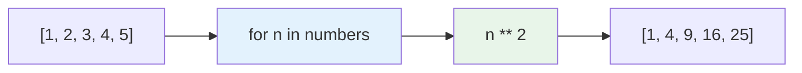
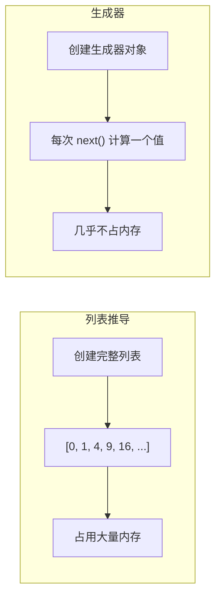

# 列表推导与生成器

> **所属路径**：`01_基础能力/01_开发环境与技术英语/01_编程语言基础/04_列表推导与生成器`
> **预计学习时间**：45 分钟
> **难度等级**：⭐⭐

---

## 前置知识

- [变量与数据类型](../01_变量与数据类型/01_变量与数据类型.md)（理解列表和基本数据类型）
- [条件与循环](../02_条件与循环/02_条件与循环.md)（理解 `for` 循环和条件判断）
- [函数与模块](../03_函数与模块/03_函数与模块.md)（理解函数定义和调用）

> 如果以上内容还不熟悉，建议先完成对应课程再继续。

---

## 学习目标

完成本节后，你将能够：

1. 使用列表推导式简洁地创建和变换列表
2. 使用带条件的列表推导式过滤数据
3. 理解生成器的概念和惰性求值机制
4. 使用生成器表达式和 `yield` 关键字创建生成器
5. 判断何时使用列表推导、何时使用生成器

---

## 正文讲解

### 1. 从"for 循环 + append"说起

在前面的课程中，你可能写过很多这样的代码模式——用 `for` 循环遍历列表，对每个元素做处理，把结果追加到新列表中：

```python
# 将列表中的每个数字平方
numbers = [1, 2, 3, 4, 5]
squares = []
for n in numbers:
    squares.append(n ** 2)
print(squares)  # [1, 4, 9, 16, 25]
```

这段代码没问题，但 Python 提供了一种更简洁、更 "Pythonic" 的写法——**列表推导式（List Comprehension）** 。

### 2. 列表推导式

**列表推导式（List Comprehension）** 用一行代码就能完成"创建列表 → 循环 → 追加"的整个过程：

```python
squares = [n ** 2 for n in numbers]
print(squares)  # [1, 4, 9, 16, 25]
```

它的基本语法是：

```python
[表达式 for 变量 in 可迭代对象]
```



> 📌 **图解说明**：列表推导式从左到右依次：输入序列 → 循环变量 → 表达式变换 → 输出列表。

更多例子：

```python
# 字符串处理
names = ["alice", "bob", "charlie"]
upper_names = [name.upper() for name in names]
# ['ALICE', 'BOB', 'CHARLIE']

# 类型转换
str_numbers = ["1", "2", "3", "4"]
int_numbers = [int(s) for s in str_numbers]
# [1, 2, 3, 4]

# 调用函数
lengths = [len(name) for name in names]
# [5, 3, 7]
```

### 3. 带条件过滤的列表推导

你可以在列表推导式中加入 `if` 条件来过滤元素：

```python
# 只保留偶数
numbers = range(1, 11)
evens = [n for n in numbers if n % 2 == 0]
print(evens)  # [2, 4, 6, 8, 10]

# 只保留正数的平方
data = [-3, -1, 0, 2, 5, -4, 8]
positive_squares = [x ** 2 for x in data if x > 0]
print(positive_squares)  # [4, 25, 64]
```

你还可以用 `if...else` 做条件变换（注意位置不同）：

```python
# 条件过滤：if 放在 for 后面
[x for x in data if x > 0]

# 条件变换：if...else 放在 for 前面
labels = ["正" if x > 0 else "零" if x == 0 else "负" for x in data]
print(labels)  # ['负', '负', '零', '正', '正', '负', '正']
```

> 💡 **AI 连接**：列表推导在数据预处理中非常常用。比如从数据集中筛选有效样本、对文本进行批量清洗、提取特征等。它比 `for` 循环不仅更简洁，通常还更快（Python 内部对列表推导做了优化）。

### 4. 嵌套列表推导

列表推导可以嵌套，用来处理二维数据：

```python
# 展平二维列表
matrix = [[1, 2, 3], [4, 5, 6], [7, 8, 9]]
flat = [x for row in matrix for x in row]
print(flat)  # [1, 2, 3, 4, 5, 6, 7, 8, 9]

# 等价的 for 循环写法
flat = []
for row in matrix:
    for x in row:
        flat.append(x)
```

> ⚠️ **可读性警告**：超过两层的嵌套列表推导会变得很难读懂。如果逻辑复杂，宁可用普通的 `for` 循环——代码可读性比简洁性更重要。

### 5. 字典推导和集合推导

类似的语法还可以用于创建字典和集合：

```python
# 字典推导
names = ["Alice", "Bob", "Charlie"]
name_lengths = {name: len(name) for name in names}
print(name_lengths)  # {'Alice': 5, 'Bob': 3, 'Charlie': 7}

# 集合推导（自动去重）
words = ["hello", "world", "hello", "python"]
unique_lengths = {len(w) for w in words}
print(unique_lengths)  # {5, 6}
```

### 6. 生成器：处理大数据的利器

列表推导有一个问题——它会一次性创建整个列表并存储在内存中。如果数据量很大（比如上亿个元素），内存就不够用了。

**生成器（Generator）** 解决了这个问题。它不会一次性生成所有元素，而是 **按需生成（惰性求值）** ——每次只计算并返回一个元素。

最简单的生成器是把列表推导的方括号 `[]` 换成圆括号 `()` ：

```python
# 列表推导：一次性创建整个列表
squares_list = [n ** 2 for n in range(10)]     # 占用内存存储10个元素

# 生成器表达式：按需生成
squares_gen = (n ** 2 for n in range(10))       # 几乎不占内存
print(type(squares_gen))  # <class 'generator'>
```

你可以用 `for` 循环遍历生成器，也可以用 `next()` 逐个获取：

```python
gen = (n ** 2 for n in range(5))
print(next(gen))  # 0
print(next(gen))  # 1
print(next(gen))  # 4

# 用 for 循环消费剩余元素
for value in gen:
    print(value, end=" ")  # 9 16
```



> 📌 **图解说明**：列表推导一次性把所有结果存入内存；生成器则像"流水线"，每次只生产一个产品。

### 7. yield 关键字

对于更复杂的生成逻辑，可以用 `yield` 关键字定义 **生成器函数** ：

```python
def fibonacci(n):
    """生成前 n 个斐波那契数"""
    a, b = 0, 1
    count = 0
    while count < n:
        yield a          # 暂停并返回 a，下次调用从这里继续
        a, b = b, a + b
        count += 1

# 使用
for num in fibonacci(10):
    print(num, end=" ")  # 0 1 1 2 3 5 8 13 21 34
```

`yield` 和 `return` 的区别：

- `return` 返回值后函数 **终止**
- `yield` 返回值后函数 **暂停**，下次调用时从暂停点继续执行

> 💡 **AI 连接**：在深度学习中，数据加载器（DataLoader）本质上就是一个生成器——它不会把所有训练数据一次性加载到内存，而是按 batch 逐批生成。后续在 [深度学习框架](../../../02_核心原理/03_深度学习/) 的数据加载课程中，你会经常使用 `yield` 来实现自定义数据管道。

### 8. 列表推导 vs 生成器：如何选择？

| 场景 | 推荐方式 | 原因 |
| ---- | -------- | ---- |
| 数据量小（< 万级元素） | 列表推导 | 简单直接，可以多次遍历 |
| 数据量大（百万级以上） | 生成器 | 节省内存，按需计算 |
| 需要索引访问（`data[i]`） | 列表推导 | 生成器不支持索引 |
| 只需遍历一次 | 生成器 | 更节省资源 |
| 需要 `len()` 或切片 | 列表推导 | 生成器不支持这些操作 |
| 数据管道（链式处理） | 生成器 | 多步处理时不会产生中间列表 |

---

## 动手实践

```python
# 文件：code/comprehension_demo.py
# 演示列表推导和生成器的各种用法

import sys

# ========== 1. 列表推导基础 ==========
print("=== 列表推导基础 ===")

# 数据清洗：提取有效成绩
raw = ["85", "N/A", "92", "", "78", "error", "96"]
valid_scores = [int(x) for x in raw if x.isdigit()]
print(f"  有效成绩：{valid_scores}")
print(f"  平均分：{sum(valid_scores) / len(valid_scores):.1f}")

# 特征缩放：Min-Max 归一化
data = [10, 45, 20, 80, 55, 30]
min_val, max_val = min(data), max(data)
normalized = [(x - min_val) / (max_val - min_val) for x in data]
print(f"  原始数据：{data}")
print(f"  归一化后：{[f'{x:.3f}' for x in normalized]}")

# ========== 2. 嵌套和字典推导 ==========
print("\n=== 嵌套和字典推导 ===")

# 矩阵转置
matrix = [[1, 2, 3], [4, 5, 6], [7, 8, 9]]
transposed = [[row[i] for row in matrix] for i in range(len(matrix[0]))]
print(f"  原矩阵：{matrix}")
print(f"  转置后：{transposed}")

# 词频统计
text = "the cat sat on the mat the cat"
word_count = {}
for word in text.split():
    word_count[word] = word_count.get(word, 0) + 1
# 用字典推导过滤出现2次以上的词
frequent = {word: count for word, count in word_count.items() if count >= 2}
print(f"  高频词：{frequent}")

# ========== 3. 生成器 vs 列表 内存对比 ==========
print("\n=== 内存对比 ===")

# 列表：占用大量内存
list_data = [i ** 2 for i in range(100_000)]
list_size = sys.getsizeof(list_data)

# 生成器：几乎不占内存
gen_data = (i ** 2 for i in range(100_000))
gen_size = sys.getsizeof(gen_data)

print(f"  列表占用内存：{list_size:>10,} 字节")
print(f"  生成器占用内存：{gen_size:>10,} 字节")
print(f"  节省比例：{(1 - gen_size / list_size) * 100:.1f}%")

# ========== 4. 生成器函数 ==========
print("\n=== 生成器函数：数据批处理 ===")

def batch_generator(data, batch_size):
    """将数据分成指定大小的批次"""
    for i in range(0, len(data), batch_size):
        yield data[i:i + batch_size]

dataset = list(range(1, 11))  # [1, 2, ..., 10]
print(f"  数据集：{dataset}")
print(f"  批大小：3")
for batch_idx, batch in enumerate(batch_generator(dataset, 3)):
    print(f"    Batch {batch_idx}: {batch}")

# ========== 5. 生成器管道 ==========
print("\n=== 生成器管道 ===")

def read_data():
    """模拟读取数据"""
    raw = [" 85 ", "N/A", " 92", "78 ", "", "error", "96", " 45 "]
    for item in raw:
        yield item.strip()

def filter_valid(items):
    """过滤有效数字"""
    for item in items:
        if item and item.isdigit():
            yield int(item)

def normalize(items, min_val=0, max_val=100):
    """归一化到 [0, 1]"""
    for item in items:
        yield round(item / max_val, 3)

# 链式处理：读取 → 过滤 → 归一化
pipeline = normalize(filter_valid(read_data()))
results = list(pipeline)
print(f"  管道输出：{results}")
```

**运行说明**：
- 环境要求：Python 3.10+
- 运行命令：`python code/comprehension_demo.py`

**预期输出**：
```
=== 列表推导基础 ===
  有效成绩：[85, 92, 78, 96]
  平均分：87.8
  原始数据：[10, 45, 20, 80, 55, 30]
  归一化后：['0.000', '0.500', '0.143', '1.000', '0.643', '0.286']

=== 嵌套和字典推导 ===
  原矩阵：[[1, 2, 3], [4, 5, 6], [7, 8, 9]]
  转置后：[[1, 4, 7], [2, 5, 8], [3, 6, 9]]
  高频词：{'the': 3, 'cat': 2}

=== 内存对比 ===
  列表占用内存：    800,984 字节
  生成器占用内存：        200 字节
  节省比例：100.0%

=== 生成器函数：数据批处理 ===
  数据集：[1, 2, 3, 4, 5, 6, 7, 8, 9, 10]
  批大小：3
    Batch 0: [1, 2, 3]
    Batch 1: [4, 5, 6]
    Batch 2: [7, 8, 9]
    Batch 3: [10]

=== 生成器管道 ===
  管道输出：[0.85, 0.92, 0.78, 0.96, 0.45]
```

---

## 典型误区

| 误区 | 正确理解 |
| ---- | -------- |
| "列表推导能替代所有循环" | 列表推导适合简单的映射和过滤。包含复杂逻辑、副作用或多步计算的循环仍应使用普通 `for` |
| "生成器和列表一样可以多次遍历" | 生成器是一次性的，遍历完后就耗尽了。如果需要多次遍历，用列表或重新创建生成器 |
| "列表推导总是比 for 循环快" | 通常是的，但差距很小。选择的首要依据是可读性，而非微小的性能差异 |
| "嵌套推导越多越好" | 超过两层嵌套会严重影响可读性。复杂逻辑应拆成多步或用普通循环 |

---

## 练习题

### 练习 1：数据清洗推导式（难度：⭐）

使用列表推导式完成：从一个混合列表中提取所有字符串并转为小写。

```python
data = [1, "Hello", 3.14, "WORLD", True, "Python", None]
```

<details>
<summary>💡 提示</summary>

使用 `isinstance(x, str)` 判断是否为字符串，用 `.lower()` 转小写。

</details>

<details>
<summary>✅ 参考答案</summary>

```python
data = [1, "Hello", 3.14, "WORLD", True, "Python", None]
result = [x.lower() for x in data if isinstance(x, str)]
print(result)  # ['hello', 'world', 'python']
```

</details>

### 练习 2：斐波那契生成器（难度：⭐⭐）

编写一个生成器函数 `fib_generator()`，无限生成斐波那契数列。然后使用它获取前 20 个斐波那契数。

<details>
<summary>💡 提示</summary>

生成器函数可以用 `while True` 实现无限循环，因为 `yield` 会暂停执行。在外部用计数器控制获取数量。

</details>

<details>
<summary>✅ 参考答案</summary>

```python
def fib_generator():
    a, b = 0, 1
    while True:
        yield a
        a, b = b, a + b

# 获取前20个
from itertools import islice
first_20 = list(islice(fib_generator(), 20))
print(first_20)

# 或者手动控制
gen = fib_generator()
for i in range(20):
    print(next(gen), end=" ")
```

</details>

### 练习 3：数据管道（难度：⭐⭐）

使用生成器实现一个三步数据管道：
1. 从列表中读取原始字符串数据
2. 过滤掉非数字项
3. 将有效数字转为浮点数并计算运行平均值

```python
raw_data = ["3.14", "abc", "2.71", "", "1.41", "N/A", "1.73"]
```

<details>
<summary>💡 提示</summary>

每一步都用一个生成器函数实现，然后将它们链式组合。运行平均值可以在最终的消费循环中累加计算。

</details>

<details>
<summary>✅ 参考答案</summary>

```python
def clean(items):
    for item in items:
        stripped = item.strip()
        if stripped:
            yield stripped

def to_float(items):
    for item in items:
        try:
            yield float(item)
        except ValueError:
            pass  # 跳过无法转换的项

raw_data = ["3.14", "abc", "2.71", "", "1.41", "N/A", "1.73"]
pipeline = to_float(clean(raw_data))

total, count = 0, 0
for value in pipeline:
    count += 1
    total += value
    running_avg = total / count
    print(f"  第{count}个值: {value:.2f}，运行平均: {running_avg:.2f}")
```

</details>

---

## 下一步学习

- 📖 下一个知识点：[异常处理](../05_异常处理/05_异常处理.md) — 学习如何优雅地处理程序错误
- 🔗 相关知识点：[迭代器与函数式工具](../../04_迭代器与函数式工具/) — 深入学习迭代器协议和 `itertools`
- 📚 拓展阅读：[NumPy 基础](../../../01_基础能力/04_数值计算与科学计算/01_NumPy基础/) — 用向量化操作替代列表推导处理数值数据

---

## 参考资料

1. [Python 官方教程 - 列表推导式](https://docs.python.org/zh-cn/3/tutorial/datastructures.html#list-comprehensions) — 列表推导的官方教程（官方文档）
2. [Python 官方文档 - 生成器](https://docs.python.org/zh-cn/3/howto/functional.html#generators) — 生成器的详细说明（官方文档）
3. [Real Python - List Comprehensions](https://realpython.com/list-comprehension-python/) — 列表推导的全面教程（公开教程）
4. [Real Python - Introduction to Generators](https://realpython.com/introduction-to-python-generators/) — 生成器入门教程（公开教程）
