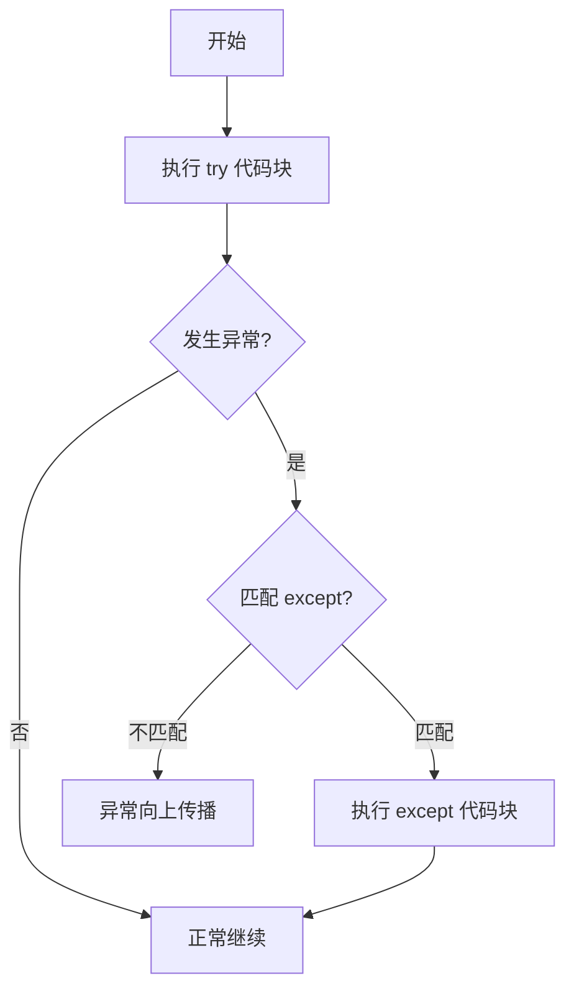
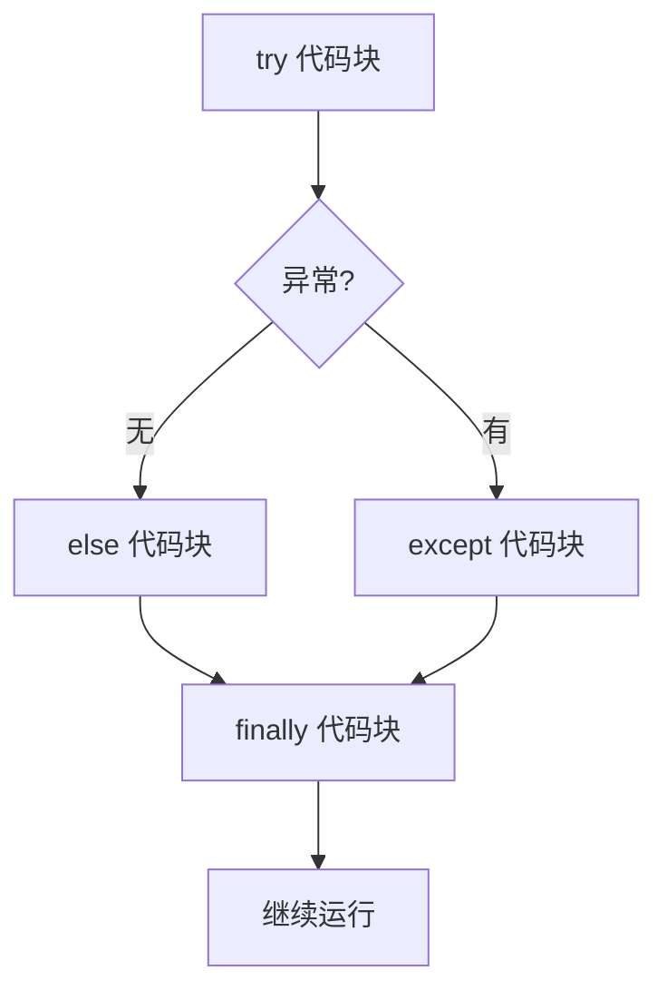

# 异常处理

> **所属路径**：`01_基础能力/01_开发环境与技术英语/01_编程语言基础/05_异常处理`
> **预计学习时间**：45 分钟
> **难度等级**：⭐⭐

---

## 前置知识

- [变量与数据类型](../01_变量与数据类型/01_变量与数据类型.md)（理解数据类型和类型转换）
- [条件与循环](../02_条件与循环/02_条件与循环.md)（理解条件判断和循环控制）
- [函数与模块](../03_函数与模块/03_函数与模块.md)（理解函数定义和调用）

> 如果以上内容还不熟悉，建议先完成对应课程再继续。

---

## 学习目标

完成本节后，你将能够：

1. 解释什么是异常以及 Python 异常处理的机制
2. 使用 `try` / `except` / `else` / `finally` 结构捕获和处理异常
3. 识别常见的内置异常类型（`ValueError`、`TypeError`、`KeyError` 等）
4. 使用 `raise` 主动抛出异常
5. 设计合理的异常处理策略，编写健壮的程序

---

## 正文讲解

### 1. 程序会"崩溃"

你一定遇到过这样的场景：程序运行到一半突然停止，屏幕上打印出一堆红色的错误信息。比如：

```python
number = int("abc")  # 把 "abc" 转成整数？
```

运行后 Python 会抛出错误：

```
Traceback (most recent call last):
  File "demo.py", line 1, in <module>
    number = int("abc")
ValueError: invalid literal for int() with base 10: 'abc'
```

这就是一个 **异常（Exception）** ——程序在运行过程中遇到了无法正常处理的情况。如果不对异常做任何处理，程序就会直接终止（"崩溃"）。

但在真实的应用中——尤其是数据处理和 AI 系统——数据质量参差不齐，网络可能中断，文件可能不存在。我们需要让程序在遇到问题时 **优雅地处理** 而不是直接崩溃。这就是 **异常处理（Exception Handling）** 的价值。

### 2. try / except：捕获异常

Python 使用 `try` / `except` 语句来捕获和处理异常：

```python
try:
    number = int(input("请输入一个整数："))
    print(f"你输入的是：{number}")
except ValueError:
    print("输入无效！请输入一个整数。")
```



> 📌 **图解说明**：`try` 代码块中的代码正常执行；如果发生异常，Python 会查找匹配的 `except` 子句；如果找到就执行对应的处理代码，然后继续运行程序。

### 3. 常见的内置异常

Python 定义了很多内置异常类型，每种对应一类特定的错误。以下是你最常遇到的几种：

| 异常类型 | 触发场景 | 示例 |
| -------- | -------- | ---- |
| `ValueError` | 值不合法 | `int("abc")` |
| `TypeError` | 类型不匹配 | `"hello" + 5` |
| `KeyError` | 字典中键不存在 | `d = {}; d["key"]` |
| `IndexError` | 索引越界 | `lst = [1]; lst[5]` |
| `ZeroDivisionError` | 除以零 | `1 / 0` |
| `FileNotFoundError` | 文件不存在 | `open("不存在的文件.txt")` |
| `AttributeError` | 对象没有该属性 | `"hello".push("!")` |
| `ImportError` | 模块导入失败 | `import 不存在的模块` |
| `StopIteration` | 迭代器耗尽 | `next(iter([]))` |

你可以捕获多种异常：

```python
data = {"name": "Alice"}

try:
    value = data["age"]
    result = int(value)
except KeyError:
    print("键不存在")
except ValueError:
    print("值无法转换为整数")
except (TypeError, AttributeError) as e:
    print(f"发生了其他错误：{e}")
```

> ⚠️ **注意**：不要使用空的 `except:` 或 `except Exception:` 来捕获所有异常，除非你确实知道自己在做什么。"吞掉"所有异常会隐藏真正的 bug，让程序看似正常运行但实际上产生了错误结果——这在 AI 项目中尤其危险（模型静默地使用了错误数据却不报告）。

### 4. else 和 finally

`try` / `except` 还可以搭配 `else` 和 `finally` ：

```python
try:
    f = open("data.txt", "r")
    content = f.read()
except FileNotFoundError:
    print("文件不存在，使用默认数据")
    content = "default"
else:
    # 只在 try 中没有异常时执行
    print(f"成功读取 {len(content)} 个字符")
finally:
    # 无论是否发生异常，都会执行
    print("清理工作完成")
```

`finally` 的典型用途是 **资源清理** ——关闭文件、释放数据库连接、释放 GPU 内存等。不管程序是正常结束还是出了异常，`finally` 都会执行。



> 📌 **图解说明**：完整的异常处理流程—— `else` 在无异常时执行， `finally` 总是执行。

### 5. 主动抛出异常

有时你需要在自己的代码中主动 **抛出异常（Raise Exception）** ，告诉调用者"输入不合法"或"操作不允许"：

```python
def calculate_average(scores):
    """计算平均分，要求输入非空列表"""
    if not isinstance(scores, list):
        raise TypeError("scores 必须是列表类型")
    if len(scores) == 0:
        raise ValueError("scores 列表不能为空")
    return sum(scores) / len(scores)

# 正常调用
print(calculate_average([85, 92, 78]))  # 85.0

# 异常调用
try:
    print(calculate_average([]))
except ValueError as e:
    print(f"错误：{e}")  # 错误：scores 列表不能为空
```

> 💡 **AI 连接**：在机器学习代码中，参数验证是常见的 `raise` 使用场景。比如检查学习率是否为正数、batch size 是否大于 0、输入张量的维度是否正确等。后续在 [深度学习框架](../../../02_核心原理/03_深度学习/) 的训练循环中你会看到大量这样的检查。

### 6. 异常处理的最佳实践

经过前面的学习，你已经掌握了异常处理的语法。但更重要的是 **何时** 以及 **如何** 使用异常处理。以下是一些实用原则：

1. **精确捕获**：只捕获你预期且知道如何处理的异常类型，不要 `except Exception`
2. **快速失败**：对于明显的编程错误（如参数类型错误），应该让程序直接报错而不是静默处理
3. **有意义的错误消息**：在 `raise` 或日志中提供清晰的错误描述
4. **资源清理用 finally**：或者更好的选择是使用 `with` 语句（在 [装饰器与上下文管理器](../06_装饰器与上下文管理器/06_装饰器与上下文管理器.md) 中学习）
5. **不要用异常控制流程**：异常处理是给"异常情况"用的，不应该替代 `if/else` 做正常的逻辑判断

---

## 动手实践

```python
# 文件：code/exception_demo.py
# 演示异常处理的各种场景

# ========== 1. 安全的数据转换 ==========
def safe_convert(value, target_type=float):
    """安全地将值转换为目标类型，失败时返回 None"""
    try:
        return target_type(value)
    except (ValueError, TypeError):
        return None

print("=== 安全数据转换 ===")
test_values = ["3.14", "abc", "42", None, "", "1e-5"]
for v in test_values:
    result = safe_convert(v)
    status = "✓" if result is not None else "✗"
    print(f"  {status} '{v}' → {result}")

# ========== 2. 批量数据处理（容错） ==========
print("\n=== 批量数据处理 ===")
raw_data = ["85", "92", "N/A", "78", "error", "96", ""]
valid_scores = []
errors = []

for i, item in enumerate(raw_data):
    try:
        score = float(item)
        if not (0 <= score <= 100):
            raise ValueError(f"成绩超出范围: {score}")
        valid_scores.append(score)
    except ValueError as e:
        errors.append((i, item, str(e)))

print(f"  有效数据：{valid_scores}")
print(f"  错误记录：{len(errors)} 条")
for idx, val, msg in errors:
    print(f"    位置 {idx}：'{val}' — {msg}")

if valid_scores:
    avg = sum(valid_scores) / len(valid_scores)
    print(f"  有效平均分：{avg:.1f}")

# ========== 3. 自定义异常 ==========
print("\n=== 自定义验证 ===")

class ValidationError(Exception):
    """自定义验证异常"""
    pass

def validate_config(config):
    """验证模型配置参数"""
    if "learning_rate" not in config:
        raise ValidationError("缺少 learning_rate 参数")
    lr = config["learning_rate"]
    if not isinstance(lr, (int, float)):
        raise ValidationError(f"learning_rate 必须是数字，实际是 {type(lr).__name__}")
    if lr <= 0:
        raise ValidationError(f"learning_rate 必须为正数，实际值为 {lr}")
    print(f"  配置验证通过：lr={lr}")

configs = [
    {"learning_rate": 0.001},
    {"learning_rate": -0.01},
    {"batch_size": 32},
    {"learning_rate": "fast"},
]

for i, cfg in enumerate(configs):
    try:
        validate_config(cfg)
    except ValidationError as e:
        print(f"  配置 {i} 验证失败：{e}")

# ========== 4. try/except/else/finally 完整结构 ==========
print("\n=== 完整异常处理结构 ===")

def process_file(filename):
    """演示完整的异常处理流程"""
    f = None
    try:
        f = open(filename, "r")
        data = f.read()
    except FileNotFoundError:
        print(f"  文件 '{filename}' 不存在")
        data = None
    else:
        print(f"  成功读取 {len(data)} 个字符")
    finally:
        if f is not None:
            f.close()
            print("  文件已关闭")
        print("  处理结束")
    return data

process_file("不存在的文件.txt")
```

**运行说明**：
- 环境要求：Python 3.10+
- 运行命令：`python code/exception_demo.py`

**预期输出**：
```
=== 安全数据转换 ===
  ✓ '3.14' → 3.14
  ✗ 'abc' → None
  ✓ '42' → 42.0
  ✗ 'None' → None
  ✗ '' → None
  ✓ '1e-5' → 1e-05

=== 批量数据处理 ===
  有效数据：[85.0, 92.0, 78.0, 96.0]
  错误记录：3 条
    位置 2：'N/A' — could not convert string to float: 'N/A'
    位置 4：'error' — could not convert string to float: 'error'
    位置 6：'' — could not convert string to float: ''
  有效平均分：87.8

=== 自定义验证 ===
  配置验证通过：lr=0.001
  配置 1 验证失败：learning_rate 必须为正数，实际值为 -0.01
  配置 2 验证失败：缺少 learning_rate 参数
  配置 3 验证失败：learning_rate 必须是数字，实际是 str

=== 完整异常处理结构 ===
  文件 '不存在的文件.txt' 不存在
  处理结束
```

---

## 典型误区

| 误区 | 正确理解 |
| ---- | -------- |
| "用 `except:` 捕获所有异常更安全" | 这会隐藏真正的 bug。应该只捕获你预期且知道如何处理的异常 |
| "异常处理可以替代 `if` 判断" | 对于可预测的情况（如空列表），应该用 `if` 检查而非依赖异常 |
| " `finally` 只在异常时执行" | `finally` 无论有无异常都会执行，是做资源清理的最佳位置 |
| "自定义异常没有必要" | 自定义异常让错误更具语义，方便调用者根据不同类型做不同处理 |
| "捕获了异常就一定要打印" | 有时记录日志比 `print` 更合适，有时甚至需要重新 `raise` 让上层处理 |

---

## 练习题

### 练习 1：安全除法器（难度：⭐）

编写一个函数 `safe_divide(a, b)`，返回 `a / b` 的结果。如果 `b` 为 0，返回 `None` 并打印提示信息。

<details>
<summary>💡 提示</summary>

使用 `try/except` 捕获 `ZeroDivisionError`。

</details>

<details>
<summary>✅ 参考答案</summary>

```python
def safe_divide(a, b):
    try:
        return a / b
    except ZeroDivisionError:
        print(f"警告：除数为零（{a}/{b}）")
        return None

print(safe_divide(10, 3))   # 3.333...
print(safe_divide(10, 0))   # None
```

</details>

### 练习 2：健壮的数据加载器（难度：⭐⭐）

编写一个函数 `load_scores(filename)`，从文件中读取成绩数据（每行一个数字），返回浮点数列表。要求：
- 处理文件不存在的情况
- 跳过无法转换为数字的行
- 跳过空行
- 返回有效数据列表和错误计数

<details>
<summary>💡 提示</summary>

用 `try/except FileNotFoundError` 处理文件不存在，在循环内用 `try/except ValueError` 处理无效数据。

</details>

<details>
<summary>✅ 参考答案</summary>

```python
def load_scores(filename):
    scores = []
    error_count = 0
    try:
        with open(filename, "r") as f:
            for line_num, line in enumerate(f, 1):
                line = line.strip()
                if not line:
                    continue
                try:
                    score = float(line)
                    scores.append(score)
                except ValueError:
                    error_count += 1
                    print(f"  第{line_num}行无效：'{line}'")
    except FileNotFoundError:
        print(f"文件 '{filename}' 不存在")
        return [], 0
    return scores, error_count
```

</details>

### 练习 3：参数验证器（难度：⭐⭐）

编写一个函数 `create_training_config(epochs, lr, batch_size)`，验证以下条件并在不满足时抛出合适的异常：
- `epochs` 必须是正整数
- `lr` 必须是正浮点数
- `batch_size` 必须是 2 的幂次（如 1, 2, 4, 8, 16, 32...）

<details>
<summary>💡 提示</summary>

判断一个数是否是 2 的幂：`n > 0 and (n & (n - 1)) == 0`（使用位运算）。对于不同的错误类型，使用 `TypeError` 或 `ValueError`。

</details>

<details>
<summary>✅ 参考答案</summary>

```python
def create_training_config(epochs, lr, batch_size):
    if not isinstance(epochs, int) or epochs <= 0:
        raise ValueError(f"epochs 必须是正整数，实际值为 {epochs}")
    if not isinstance(lr, (int, float)) or lr <= 0:
        raise ValueError(f"lr 必须是正数，实际值为 {lr}")
    if not isinstance(batch_size, int) or batch_size <= 0 or (batch_size & (batch_size - 1)) != 0:
        raise ValueError(f"batch_size 必须是2的幂，实际值为 {batch_size}")

    return {"epochs": epochs, "learning_rate": lr, "batch_size": batch_size}

# 测试
try:
    cfg = create_training_config(10, 0.001, 32)
    print(f"配置有效：{cfg}")
except ValueError as e:
    print(f"配置无效：{e}")

try:
    cfg = create_training_config(10, 0.001, 13)
except ValueError as e:
    print(f"配置无效：{e}")
```

</details>

---

## 下一步学习

- 📖 下一个知识点：[装饰器与上下文管理器](../06_装饰器与上下文管理器/06_装饰器与上下文管理器.md) — `with` 语句是 `try/finally` 的优雅替代
- 🔗 相关知识点：[文件操作与IO](../07_文件操作与IO/07_文件操作与IO.md) — 学习如何读写文件，异常处理的重要应用场景
- 🔗 相关知识点：[调试](../../11_调试/) — 学习如何系统地定位和修复错误

---

## 参考资料

1. [Python 官方教程 - 错误和异常](https://docs.python.org/zh-cn/3/tutorial/errors.html) — 异常处理的官方教程（官方文档）
2. [Python 内置异常列表](https://docs.python.org/zh-cn/3/library/exceptions.html) — 所有内置异常的完整列表和层次结构（官方文档）
3. [Real Python - Exception Handling](https://realpython.com/python-exceptions/) — 异常处理的详细教程和最佳实践（公开教程）
