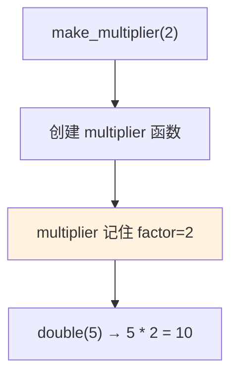
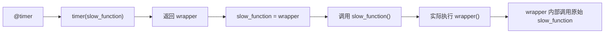
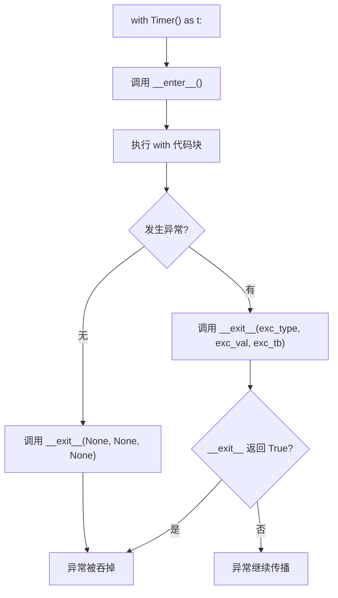

# 装饰器与上下文管理器

> **所属路径**：`01_基础能力/01_开发环境与技术英语/01_编程语言基础/06_装饰器与上下文管理器`
> **预计学习时间**：55 分钟
> **难度等级**：⭐⭐⭐

---

## 前置知识

- [函数与模块](../03_函数与模块/03_函数与模块.md)（理解函数定义、参数传递和作用域）
- [列表推导与生成器](../04_列表推导与生成器/04_列表推导与生成器.md)（理解 `yield` 关键字）
- [异常处理](../05_异常处理/05_异常处理.md)（理解 `try/finally` 结构）

> 如果以上内容还不熟悉，建议先完成对应课程再继续。

---

## 学习目标

完成本节后，你将能够：

1. 理解"函数是一等公民"的含义——函数可以作为参数传递和返回
2. 编写和使用装饰器来增强函数功能
3. 使用 `functools.wraps` 保持被装饰函数的元信息
4. 理解上下文管理器的原理和 `with` 语句的工作机制
5. 使用 `contextlib.contextmanager` 快速创建上下文管理器

---

## 正文讲解

### 1. 函数是"一等公民"

在 Python 中，函数和整数、字符串一样，是一个 **对象** 。这意味着函数可以：

- 赋值给变量
- 作为参数传递给另一个函数
- 作为另一个函数的返回值

```python
def add(a, b):
    return a + b

# 函数赋值给变量
operation = add
print(operation(3, 5))  # 8

# 函数作为参数传递
def apply(func, x, y):
    return func(x, y)

print(apply(add, 10, 20))  # 30
```

这个特性是理解装饰器的基础。

### 2. 闭包：函数记住外部变量

**闭包（Closure）** 是指一个函数可以"记住"它被定义时所在作用域中的变量：

```python
def make_multiplier(factor):
    """返回一个乘以 factor 的函数"""
    def multiplier(x):
        return x * factor  # factor 来自外部函数
    return multiplier

double = make_multiplier(2)
triple = make_multiplier(3)

print(double(5))   # 10
print(triple(5))   # 15
```

`multiplier` 函数"记住"了它创建时的 `factor` 值。这就是闭包——内部函数引用了外部函数的变量。



> 📌 **图解说明**：闭包让内部函数"记住"了创建时的环境。即使外部函数已经返回，内部函数仍然可以访问外部变量。

### 3. 装饰器：给函数"穿外套"

**装饰器（Decorator）** 是一种用于增强函数功能的设计模式。它接受一个函数作为输入，返回一个"增强版"的函数。

假设你想在每个函数调用前后打印日志。不用装饰器，你需要在每个函数里手动添加日志代码。用装饰器，你只需在函数定义上方加一行 `@` 标记：

```python
import time

def timer(func):
    """计时装饰器：测量函数执行时间"""
    def wrapper(*args, **kwargs):
        start = time.time()
        result = func(*args, **kwargs)
        elapsed = time.time() - start
        print(f"  [{func.__name__}] 耗时: {elapsed:.4f}秒")
        return result
    return wrapper

@timer
def slow_function(n):
    """模拟一个耗时操作"""
    total = sum(range(n))
    return total

result = slow_function(1_000_000)
print(f"  结果：{result}")
```

`@timer` 等价于 `slow_function = timer(slow_function)` 。它做了三件事：

1. 把 `slow_function` 作为参数传给 `timer`
2. `timer` 返回一个新函数 `wrapper`
3. 用 `wrapper` 替换原来的 `slow_function`



> 📌 **图解说明**：装饰器在原函数外面包了一层 `wrapper`，每次调用时先执行装饰器的逻辑（计时），再调用原函数。

### 4. 保持函数元信息：functools.wraps

装饰器有一个副作用——被装饰后的函数名和文档字符串会变成 `wrapper` 的：

```python
print(slow_function.__name__)  # 'wrapper'（不是 'slow_function'！）
print(slow_function.__doc__)   # None
```

使用 `functools.wraps` 可以修复这个问题：

```python
import functools

def timer(func):
    @functools.wraps(func)  # 关键：保留原函数的元信息
    def wrapper(*args, **kwargs):
        start = time.time()
        result = func(*args, **kwargs)
        elapsed = time.time() - start
        print(f"  [{func.__name__}] 耗时: {elapsed:.4f}秒")
        return result
    return wrapper
```

> ⚠️ **最佳实践**：写装饰器时，**始终** 在 `wrapper` 上使用 `@functools.wraps(func)`。这不仅保持了函数名和文档字符串，还保留了其他元信息，便于调试和文档生成。

### 5. 带参数的装饰器

有时你需要装饰器本身接受参数。这需要再嵌套一层函数：

```python
import functools

def retry(max_attempts=3):
    """重试装饰器：函数失败后自动重试"""
    def decorator(func):
        @functools.wraps(func)
        def wrapper(*args, **kwargs):
            for attempt in range(1, max_attempts + 1):
                try:
                    return func(*args, **kwargs)
                except Exception as e:
                    print(f"  第{attempt}次尝试失败：{e}")
                    if attempt == max_attempts:
                        raise
        return wrapper
    return decorator

@retry(max_attempts=3)
def unstable_api_call():
    """模拟不稳定的 API 调用"""
    import random
    if random.random() < 0.7:
        raise ConnectionError("网络超时")
    return "成功！"
```

> 💡 **AI 连接**：在机器学习工程中，装饰器非常常用——比如自动重试（网络请求）、缓存（避免重复计算）、日志记录（追踪函数调用）、参数验证（检查输入类型）等。PyTorch 中的 `@torch.no_grad()` 就是一个经典的装饰器，用于在推理时禁用梯度计算。

### 6. 上下文管理器：安全的资源管理

你可能已经在一些 Python 代码中见过 `with` 语句——比如打开文件时写 `with open(...) as f:`。`with` 语句背后的机制就是 **上下文管理器（Context Manager）** ，下一节 [文件操作与IO](../07_文件操作与IO/07_文件操作与IO.md) 课程中会大量使用它。

上下文管理器确保资源在使用后被正确释放——即使发生异常也不会泄露。它通过实现 `__enter__` 和 `__exit__` 两个方法来工作：

```python
class Timer:
    """计时上下文管理器"""
    def __enter__(self):
        self.start = time.time()
        print("  ⏱ 计时开始")
        return self
    
    def __exit__(self, exc_type, exc_val, exc_tb):
        self.elapsed = time.time() - self.start
        print(f"  ⏱ 计时结束，耗时：{self.elapsed:.4f}秒")
        return False  # 不吞掉异常

# 使用
with Timer() as t:
    total = sum(range(1_000_000))
    print(f"  计算结果：{total}")
```



> 📌 **图解说明**：`with` 语句保证 `__exit__` 总是被调用，不管代码块是正常结束还是抛出异常。

### 7. 用 contextmanager 简化创建

定义一个类来实现上下文管理器有些繁琐。`contextlib.contextmanager` 装饰器让你用生成器函数快速创建上下文管理器：

```python
from contextlib import contextmanager
import time

@contextmanager
def timer(label=""):
    """简洁的计时上下文管理器"""
    start = time.time()
    print(f"  ⏱ [{label}] 开始")
    yield  # yield 之前是 __enter__，之后是 __exit__
    elapsed = time.time() - start
    print(f"  ⏱ [{label}] 结束，耗时：{elapsed:.4f}秒")

with timer("求和"):
    total = sum(range(1_000_000))
```

`yield` 将函数分成两部分：

- `yield` 之前的代码 = `__enter__`（进入时执行）
- `yield` 之后的代码 = `__exit__`（退出时执行）

```python
@contextmanager
def managed_resource(name):
    """模拟资源获取和释放"""
    print(f"  获取资源：{name}")
    try:
        yield name  # yield 的值可以通过 as 获取
    finally:
        print(f"  释放资源：{name}")

with managed_resource("GPU_0") as gpu:
    print(f"  使用 {gpu} 进行训练...")
```

> 💡 **AI 连接**：上下文管理器在 AI 工程中用于管理 GPU 内存、数据库连接、临时文件、分布式训练的通信上下文等。PyTorch 中的 `torch.no_grad()` 既可以作为装饰器也可以作为上下文管理器使用：`with torch.no_grad(): ...`

---

## 动手实践

```python
# 文件：code/decorator_context_demo.py
# 演示装饰器和上下文管理器

import time
import functools
from contextlib import contextmanager

# ========== 1. 实用装饰器：日志 ==========
print("=== 日志装饰器 ===")

def log_call(func):
    @functools.wraps(func)
    def wrapper(*args, **kwargs):
        args_str = ", ".join(repr(a) for a in args)
        kwargs_str = ", ".join(f"{k}={v!r}" for k, v in kwargs.items())
        all_args = ", ".join(filter(None, [args_str, kwargs_str]))
        print(f"  📞 调用 {func.__name__}({all_args})")
        result = func(*args, **kwargs)
        print(f"  ✅ 返回 {result!r}")
        return result
    return wrapper

@log_call
def add(a, b):
    return a + b

@log_call
def greet(name, greeting="你好"):
    return f"{greeting}，{name}！"

add(3, 5)
greet("小明", greeting="早上好")

# ========== 2. 实用装饰器：缓存 ==========
print("\n=== 缓存装饰器 ===")

def cache(func):
    """简单的缓存装饰器"""
    memo = {}
    @functools.wraps(func)
    def wrapper(*args):
        if args not in memo:
            memo[args] = func(*args)
            print(f"  🔄 计算 {func.__name__}{args} = {memo[args]}")
        else:
            print(f"  💾 缓存 {func.__name__}{args} = {memo[args]}")
        return memo[args]
    return wrapper

@cache
def fibonacci(n):
    if n < 2:
        return n
    return fibonacci(n - 1) + fibonacci(n - 2)

print(f"  fib(6) = {fibonacci(6)}")
print(f"  fib(5) = {fibonacci(5)}")  # 直接从缓存获取

# ========== 3. 上下文管理器：临时设置 ==========
print("\n=== 上下文管理器：临时配置 ===")

class Config:
    """全局配置"""
    verbose = False
    precision = 4

@contextmanager
def temp_config(**overrides):
    """临时修改配置，退出后自动恢复"""
    originals = {}
    for key, value in overrides.items():
        originals[key] = getattr(Config, key)
        setattr(Config, key, value)
        print(f"  📝 设置 {key} = {value}（原值：{originals[key]}）")
    try:
        yield Config
    finally:
        for key, value in originals.items():
            setattr(Config, key, value)
            print(f"  ↩️  恢复 {key} = {value}")

print(f"  当前 verbose={Config.verbose}, precision={Config.precision}")
with temp_config(verbose=True, precision=8):
    print(f"  临时 verbose={Config.verbose}, precision={Config.precision}")
print(f"  恢复 verbose={Config.verbose}, precision={Config.precision}")

# ========== 4. 装饰器 + 上下文管理器组合 ==========
print("\n=== 组合使用 ===")

@contextmanager
def timer(label):
    start = time.time()
    yield
    elapsed = time.time() - start
    print(f"  ⏱ [{label}] {elapsed:.4f}秒")

with timer("列表推导"):
    data = [i ** 2 for i in range(1_000_000)]

with timer("生成器求和"):
    total = sum(i ** 2 for i in range(1_000_000))
```

**运行说明**：
- 环境要求：Python 3.10+
- 运行命令：`python code/decorator_context_demo.py`

**预期输出**：
```
=== 日志装饰器 ===
  📞 调用 add(3, 5)
  ✅ 返回 8
  📞 调用 greet('小明', greeting='早上好')
  ✅ 返回 '早上好，小明！'

=== 缓存装饰器 ===
  🔄 计算 fibonacci(6) = ...
  ...（缓存命中若干次）
  fib(6) = 8
  💾 缓存 fibonacci(5) = 5

=== 上下文管理器：临时配置 ===
  当前 verbose=False, precision=4
  📝 设置 verbose = True（原值：False）
  📝 设置 precision = 8（原值：4）
  临时 verbose=True, precision=8
  ↩️  恢复 verbose = False
  ↩️  恢复 precision = 4
  恢复 verbose=False, precision=4

=== 组合使用 ===
  ⏱ [列表推导] 0.XXXX秒
  ⏱ [生成器求和] 0.XXXX秒
```

---

## 典型误区

| 误区 | 正确理解 |
| ---- | -------- |
| "装饰器改变了原函数的代码" | 装饰器不修改原函数，而是在外面包了一层。原函数依然完整存在 |
| "忘记 `@functools.wraps`" | 不加 `wraps` 会导致函数名、文档等元信息丢失，影响调试 |
| " `with` 语句只能用于文件" | `with` 适用于任何实现了 `__enter__` / `__exit__` 的对象，如锁、数据库连接、GPU 上下文等 |
| "装饰器和上下文管理器是完全不同的东西" | 它们是解决不同问题的工具：装饰器增强函数行为，上下文管理器管理资源生命周期。但它们可以组合使用 |
| " `yield` 在 `@contextmanager` 中只能出现一次" | 正确。`@contextmanager` 装饰的生成器函数中只能有一个 `yield` |

---

## 练习题

### 练习 1：计数装饰器（难度：⭐）

编写一个装饰器 `count_calls`，统计被装饰函数被调用的次数。

<details>
<summary>💡 提示</summary>

可以使用 `wrapper.call_count` 属性来存储计数（函数也是对象，可以添加属性）。

</details>

<details>
<summary>✅ 参考答案</summary>

```python
import functools

def count_calls(func):
    @functools.wraps(func)
    def wrapper(*args, **kwargs):
        wrapper.call_count += 1
        print(f"  {func.__name__} 被调用了 {wrapper.call_count} 次")
        return func(*args, **kwargs)
    wrapper.call_count = 0
    return wrapper

@count_calls
def say_hello(name):
    print(f"  Hello, {name}!")

say_hello("Alice")  # 第 1 次
say_hello("Bob")    # 第 2 次
say_hello("Charlie")# 第 3 次
print(f"总调用次数：{say_hello.call_count}")  # 3
```

</details>

### 练习 2：工作目录上下文管理器（难度：⭐⭐）

使用 `@contextmanager` 编写一个上下文管理器 `working_directory(path)`，临时切换工作目录，退出时自动恢复。

<details>
<summary>💡 提示</summary>

使用 `os.getcwd()` 获取当前目录，`os.chdir()` 切换目录。在 `try/finally` 中恢复。

</details>

<details>
<summary>✅ 参考答案</summary>

```python
import os
from contextlib import contextmanager

@contextmanager
def working_directory(path):
    original = os.getcwd()
    os.chdir(path)
    try:
        yield path
    finally:
        os.chdir(original)

print(f"当前目录：{os.getcwd()}")
with working_directory("/tmp") as p:
    print(f"临时目录：{os.getcwd()}")
print(f"恢复目录：{os.getcwd()}")
```

</details>

### 练习 3：带参数的验证装饰器（难度：⭐⭐⭐）

编写一个装饰器 `validate_range(min_val, max_val)`，检查函数的返回值是否在指定范围内。如果不在范围内，抛出 `ValueError`。

<details>
<summary>💡 提示</summary>

这是一个带参数的装饰器，需要三层嵌套函数。外层接收参数，中层接收函数，内层是实际的 wrapper。

</details>

<details>
<summary>✅ 参考答案</summary>

```python
import functools

def validate_range(min_val, max_val):
    def decorator(func):
        @functools.wraps(func)
        def wrapper(*args, **kwargs):
            result = func(*args, **kwargs)
            if not (min_val <= result <= max_val):
                raise ValueError(
                    f"{func.__name__} 返回值 {result} 不在 [{min_val}, {max_val}] 范围内"
                )
            return result
        return wrapper
    return decorator

@validate_range(0.0, 1.0)
def predict_probability(x):
    return x * 0.5

print(predict_probability(0.8))  # 0.4 ✓

try:
    print(predict_probability(3.0))  # 1.5 → ValueError
except ValueError as e:
    print(f"验证失败：{e}")
```

</details>

---

## 下一步学习

- 📖 下一个知识点：[文件操作与IO](../07_文件操作与IO/07_文件操作与IO.md) — 运用上下文管理器安全读写文件
- 🔗 相关知识点：[元编程与高级特性](../../10_元编程与高级特性/) — 描述符、元类等更高级的 Python 特性
- 🔗 相关知识点：[迭代器与函数式工具](../../04_迭代器与函数式工具/) — 迭代器协议和函数式编程工具

---

## 参考资料

1. [Python 官方文档 - 装饰器](https://docs.python.org/zh-cn/3/glossary.html#term-decorator) — 装饰器的官方定义（官方文档）
2. [Python 官方文档 - contextlib](https://docs.python.org/zh-cn/3/library/contextlib.html) — 上下文管理器工具库（官方文档）
3. [Real Python - Primer on Decorators](https://realpython.com/primer-on-python-decorators/) — 装饰器的详细教程（公开教程）
4. [Real Python - Context Managers](https://realpython.com/python-with-statement/) — 上下文管理器教程（公开教程）
