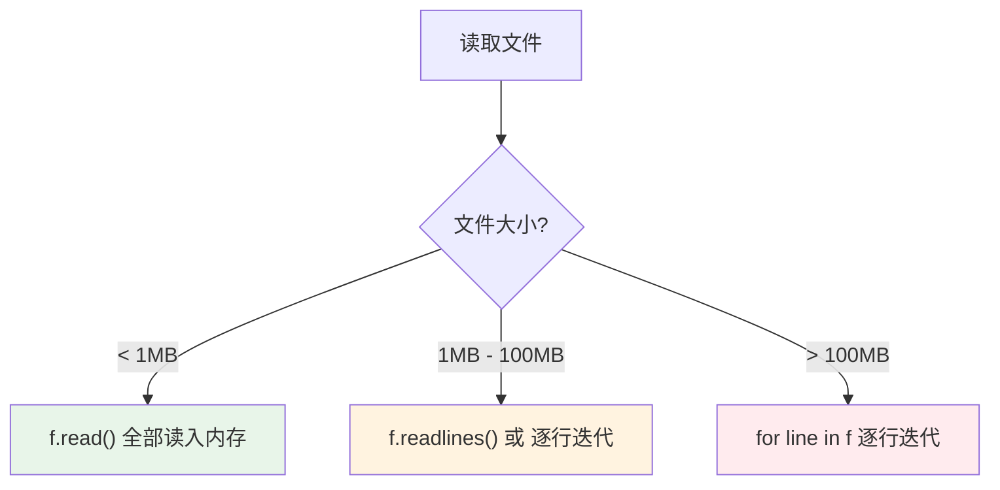

# 文件操作与IO

> **所属路径**：`01_基础能力/01_开发环境与技术英语/01_编程语言基础/07_文件操作与IO`
> **预计学习时间**：50 分钟
> **难度等级**：⭐⭐

---

## 前置知识

- [变量与数据类型](../01_变量与数据类型/01_变量与数据类型.md)（理解字符串和基本数据类型）
- [函数与模块](../03_函数与模块/03_函数与模块.md)（理解函数定义和模块导入）
- [异常处理](../05_异常处理/05_异常处理.md)（理解 `try/except` 和 `FileNotFoundError`）
- [装饰器与上下文管理器](../06_装饰器与上下文管理器/06_装饰器与上下文管理器.md)（理解 `with` 语句和上下文管理器机制）
- [高中复习/信息素养/文件与文件夹管理](../../../../00_高中复习/03_信息素养/01_文件与文件夹管理/)（理解路径和文件系统基本概念）

> 如果以上内容还不熟悉，建议先完成对应课程再继续。

---

## 学习目标

完成本节后，你将能够：

1. 使用 `open()` 函数和 `with` 语句安全地读写文件
2. 区分文本模式和二进制模式，理解编码问题
3. 使用 `os` 和 `pathlib` 模块操作文件路径和目录
4. 读写 CSV 和 JSON 等常用数据格式
5. 处理大文件的逐行读取策略

---

## 正文讲解

### 1. 为什么文件操作如此重要？

在 AI 工作流中，几乎每一步都涉及文件操作：

- **数据**：训练数据通常存储在 CSV、JSON、Parquet 等文件中
- **模型**：训练好的模型权重保存为文件（`.pt`、`.h5`、`.onnx`）
- **配置**：超参数和实验配置存储在 YAML 或 JSON 文件中
- **日志**：训练日志、评估结果写入文本文件
- **结果**：预测结果导出为 CSV 或 JSON 供下游系统使用

学会高效、安全地读写文件，是构建任何 AI 项目的基本功。

### 2. open() 与 with 语句

Python 使用 `open()` 函数打开文件。最安全的方式是搭配 `with` 语句：

```python
# 写入文件
with open("hello.txt", "w", encoding="utf-8") as f:
    f.write("你好，世界！\n")
    f.write("Hello, World!\n")

# 读取文件
with open("hello.txt", "r", encoding="utf-8") as f:
    content = f.read()
    print(content)
```

`with` 语句的好处是 **自动关闭文件** ——即使中途发生异常，文件也会被正确关闭。这比手动调用 `f.close()` 更安全、更简洁。

`open()` 的第二个参数是 **模式（Mode）** ：

| 模式 | 含义 | 文件不存在时 | 文件已存在时 |
| ---- | ---- | ------------ | ------------ |
| `"r"` | 只读（默认） | 报错 | 从头读取 |
| `"w"` | 只写 | 创建新文件 | **清空**内容后写入 |
| `"a"` | 追加 | 创建新文件 | 在末尾追加 |
| `"x"` | 独占创建 | 创建新文件 | 报错（防止覆盖） |

> ⚠️ **注意**：`"w"` 模式会 **清空** 原有内容！如果你想在文件末尾追加数据，使用 `"a"` 模式。这是初学者最常犯的错误之一。

### 3. 读取文件的多种方式

根据文件大小和使用场景，有不同的读取策略：

```python
# 方式1：一次性读取全部内容（适合小文件）
with open("data.txt", "r", encoding="utf-8") as f:
    content = f.read()           # 返回整个文件的字符串

# 方式2：读取所有行到列表（适合中等文件）
with open("data.txt", "r", encoding="utf-8") as f:
    lines = f.readlines()        # 返回行列表，每行末尾保留 \n

# 方式3：逐行遍历（适合大文件，内存友好）
with open("data.txt", "r", encoding="utf-8") as f:
    for line in f:               # 文件对象本身是迭代器
        line = line.strip()      # 去掉首尾空白和换行符
        print(line)
```



> 📌 **图解说明**：选择读取方式时，主要考虑文件大小。大文件务必使用逐行读取，避免一次性把整个文件加载到内存中导致内存不足。

> 💡 **AI 连接**：在处理大型数据集（动辄几 GB 甚至几十 GB）时，逐行读取或分块读取是必须的技能。后续在 [Pandas 基础](../../04_数值计算与科学计算/02_Pandas基础/) 课程中，你会学到 `pd.read_csv(chunksize=...)` 这种分块读取的高级用法。

### 4. 编码：让中文正确显示

你可能遇到过打开文件后看到乱码的情况。这是因为文件的 **编码（Encoding）** 不匹配。

- **UTF-8**：最通用的编码，支持所有语言的字符，是当今的标准
- **GBK/GB2312**：中文 Windows 系统的默认编码
- **ASCII**：只支持英文字母和基本符号

```python
# 总是明确指定编码
with open("data.txt", "r", encoding="utf-8") as f:
    content = f.read()

# 如果遇到编码错误
try:
    with open("old_data.txt", "r", encoding="utf-8") as f:
        content = f.read()
except UnicodeDecodeError:
    # 尝试其他编码
    with open("old_data.txt", "r", encoding="gbk") as f:
        content = f.read()
```

> ⚠️ **最佳实践**：始终在 `open()` 中显式指定 `encoding="utf-8"`。虽然 Python 3 在大多数系统上默认使用 UTF-8，但在某些 Windows 环境下默认编码可能是 GBK，导致跨平台不兼容。更深入的编码知识会在 [字符串与编码](../../02_字符串与编码/) 课程中讲解。

### 5. 路径操作：os 和 pathlib

操作文件离不开路径处理。Python 提供了两种方式：传统的 `os.path` 模块和现代的 `pathlib` 模块。

```python
from pathlib import Path
import os

# ===== pathlib（推荐） =====
data_dir = Path("data")
file_path = data_dir / "scores.csv"    # 用 / 运算符拼接路径

print(file_path.exists())     # 文件是否存在
print(file_path.suffix)       # 文件扩展名：'.csv'
print(file_path.stem)         # 文件名（无扩展名）：'scores'
print(file_path.parent)       # 父目录：'data'

# 创建目录
data_dir.mkdir(exist_ok=True)  # exist_ok=True 避免目录已存在时报错

# 遍历目录中的所有 CSV 文件
for csv_file in data_dir.glob("*.csv"):
    print(csv_file)

# ===== os.path（传统方式） =====
file_path = os.path.join("data", "scores.csv")
print(os.path.exists(file_path))
print(os.path.splitext(file_path))  # ('data/scores', '.csv')
```

> 💡 **推荐使用 `pathlib`** ：它的面向对象 API 更直观，`/` 运算符拼接路径比 `os.path.join()` 更易读，且自动处理跨平台路径分隔符。

### 6. 读写 CSV 文件

**CSV（Comma-Separated Values）** 是 AI 领域最常用的数据格式之一。Python 标准库提供了 `csv` 模块：

```python
import csv

# 写入 CSV
students = [
    ["姓名", "数学", "英语", "编程"],
    ["Alice", 85, 92, 88],
    ["Bob", 78, 65, 95],
    ["Charlie", 92, 88, 76],
]

with open("students.csv", "w", newline="", encoding="utf-8") as f:
    writer = csv.writer(f)
    writer.writerows(students)

# 读取 CSV
with open("students.csv", "r", encoding="utf-8") as f:
    reader = csv.reader(f)
    header = next(reader)  # 读取表头
    print(f"列名：{header}")
    for row in reader:
        name = row[0]
        scores = [int(s) for s in row[1:]]
        avg = sum(scores) / len(scores)
        print(f"  {name}: 平均分 {avg:.1f}")
```

对于复杂的 CSV 处理，使用 `csv.DictReader` 更方便：

```python
with open("students.csv", "r", encoding="utf-8") as f:
    reader = csv.DictReader(f)
    for row in reader:
        print(f"  {row['姓名']}: 数学={row['数学']}")
```

### 7. 读写 JSON 文件

**JSON（JavaScript Object Notation）** 是配置文件和 API 数据的标准格式：

```python
import json

# 写入 JSON
config = {
    "model": "ResNet50",
    "learning_rate": 0.001,
    "epochs": 100,
    "augmentation": ["flip", "rotate", "crop"],
}

with open("config.json", "w", encoding="utf-8") as f:
    json.dump(config, f, indent=2, ensure_ascii=False)

# 读取 JSON
with open("config.json", "r", encoding="utf-8") as f:
    loaded = json.load(f)
    print(f"模型：{loaded['model']}")
    print(f"学习率：{loaded['learning_rate']}")
```

> 💡 **小贴士**：`json.dump()` 中 `indent=2` 让输出格式化便于阅读，`ensure_ascii=False` 让中文正常显示而不是被转义成 `\uXXXX`。

---

## 动手实践

```python
# 文件：code/file_io_demo.py
# 演示文件操作的各种场景

import json
import csv
import os
from pathlib import Path

# 在临时目录中操作，避免污染当前目录
work_dir = Path("demo_output")
work_dir.mkdir(exist_ok=True)

# ========== 1. 文本文件读写 ==========
print("=== 文本文件读写 ===")
poem_file = work_dir / "poem.txt"

# 写入
with open(poem_file, "w", encoding="utf-8") as f:
    f.write("静夜思\n")
    f.write("床前明月光，\n")
    f.write("疑是地上霜。\n")
    f.write("举头望明月，\n")
    f.write("低头思故乡。\n")

# 逐行读取
with open(poem_file, "r", encoding="utf-8") as f:
    for i, line in enumerate(f, 1):
        print(f"  第{i}行：{line.strip()}")

# ========== 2. CSV 文件 ==========
print("\n=== CSV 文件操作 ===")
csv_file = work_dir / "scores.csv"

# 写入
scores_data = [
    {"name": "Alice", "math": 85, "english": 92, "python": 88},
    {"name": "Bob", "math": 78, "english": 65, "python": 95},
    {"name": "Charlie", "math": 92, "english": 88, "python": 76},
    {"name": "Diana", "math": 90, "english": 85, "python": 91},
]

with open(csv_file, "w", newline="", encoding="utf-8") as f:
    fieldnames = ["name", "math", "english", "python"]
    writer = csv.DictWriter(f, fieldnames=fieldnames)
    writer.writeheader()
    writer.writerows(scores_data)

# 读取并分析
with open(csv_file, "r", encoding="utf-8") as f:
    reader = csv.DictReader(f)
    for row in reader:
        scores = [int(row["math"]), int(row["english"]), int(row["python"])]
        avg = sum(scores) / len(scores)
        print(f"  {row['name']:8s} → 平均分: {avg:.1f}")

# ========== 3. JSON 文件 ==========
print("\n=== JSON 配置文件 ===")
json_file = work_dir / "experiment.json"

experiment = {
    "name": "MNIST分类实验",
    "model": {"type": "CNN", "layers": [32, 64, 128]},
    "training": {"epochs": 50, "batch_size": 64, "learning_rate": 0.001},
    "results": {"accuracy": 0.987, "loss": 0.045},
}

with open(json_file, "w", encoding="utf-8") as f:
    json.dump(experiment, f, indent=2, ensure_ascii=False)

with open(json_file, "r", encoding="utf-8") as f:
    loaded = json.load(f)
    print(f"  实验名称：{loaded['name']}")
    print(f"  模型类型：{loaded['model']['type']}")
    print(f"  准确率：{loaded['results']['accuracy']:.1%}")

# ========== 4. 路径操作 ==========
print("\n=== 路径操作 ===")
for f in work_dir.iterdir():
    size = f.stat().st_size
    print(f"  {f.name:20s}  大小: {size:>6d} 字节  扩展名: {f.suffix}")

# 清理：删除演示文件
import shutil
shutil.rmtree(work_dir)
print(f"\n已清理临时目录：{work_dir}")
```

**运行说明**：
- 环境要求：Python 3.10+
- 运行命令：`python code/file_io_demo.py`

**预期输出**：
```
=== 文本文件读写 ===
  第1行：静夜思
  第2行：床前明月光，
  第3行：疑是地上霜。
  第4行：举头望明月，
  第5行：低头思故乡。

=== CSV 文件操作 ===
  Alice    → 平均分: 88.3
  Bob      → 平均分: 79.3
  Charlie  → 平均分: 85.3
  Diana    → 平均分: 88.7

=== JSON 配置文件 ===
  实验名称：MNIST分类实验
  模型类型：CNN
  准确率：98.7%

=== 路径操作 ===
  poem.txt              大小:    123 字节  扩展名: .txt
  scores.csv            大小:    112 字节  扩展名: .csv
  experiment.json       大小:    267 字节  扩展名: .json

已清理临时目录：demo_output
```

---

## 典型误区

| 误区 | 正确理解 |
| ---- | -------- |
| "不用 `with` 也没关系" | 不用 `with` 可能导致文件未正确关闭，尤其是异常发生时。始终使用 `with` |
| " `w` 模式是安全的" | `w` 模式会 **清空** 现有文件内容！想追加内容用 `a`，想保护现有文件用 `x` |
| "不指定编码也能正常工作" | 在你的电脑上可能正常，但换一台电脑（尤其是 Windows）可能就乱码。始终指定 `encoding='utf-8'` |
| "用字符串拼接路径" | 手动拼接路径（`"data/" + "file.csv"`）在 Windows 上会出错。使用 `pathlib` 或 `os.path.join()` |
| " `f.read()` 适合任何文件" | 对于几 GB 的大文件，`f.read()` 会耗尽内存。大文件应逐行读取 |

---

## 练习题

### 练习 1：单词计数器（难度：⭐）

编写一个函数，读取一个文本文件，统计并返回文件中的行数、单词数和字符数。

<details>
<summary>💡 提示</summary>

逐行读取文件，用 `line.split()` 拆分单词，累加各项计数。

</details>

<details>
<summary>✅ 参考答案</summary>

```python
def word_count(filename):
    lines = words = chars = 0
    with open(filename, "r", encoding="utf-8") as f:
        for line in f:
            lines += 1
            words += len(line.split())
            chars += len(line)
    return lines, words, chars

# 测试
with open("test.txt", "w", encoding="utf-8") as f:
    f.write("Hello World\nPython is great\nAI is the future\n")

l, w, c = word_count("test.txt")
print(f"行数: {l}, 单词数: {w}, 字符数: {c}")
# 行数: 3, 单词数: 9, 字符数: 48
```

</details>

### 练习 2：CSV 成绩分析器（难度：⭐⭐）

给定一个 CSV 文件（包含 name, math, english, python 四列），编写程序：
1. 读取数据
2. 计算每个学生的平均分
3. 找出各科最高分的学生
4. 将结果写入新的 JSON 文件

<details>
<summary>💡 提示</summary>

先用 `csv.DictReader` 读取，处理数据后用 `json.dump` 写入。注意数据类型转换——CSV 读出来的都是字符串。

</details>

<details>
<summary>✅ 参考答案</summary>

```python
import csv
import json

def analyze_scores(csv_path, json_path):
    students = []
    with open(csv_path, "r", encoding="utf-8") as f:
        for row in csv.DictReader(f):
            scores = {k: int(v) for k, v in row.items() if k != "name"}
            avg = sum(scores.values()) / len(scores)
            students.append({"name": row["name"], "scores": scores, "average": round(avg, 1)})

    # 各科最高分
    subjects = ["math", "english", "python"]
    top_students = {}
    for subj in subjects:
        best = max(students, key=lambda s: s["scores"][subj])
        top_students[subj] = {"name": best["name"], "score": best["scores"][subj]}

    result = {"students": students, "top_per_subject": top_students}
    with open(json_path, "w", encoding="utf-8") as f:
        json.dump(result, f, indent=2, ensure_ascii=False)
    return result
```

</details>

### 练习 3：日志文件合并器（难度：⭐⭐）

编写一个函数，将指定目录下所有 `.log` 文件的内容合并到一个输出文件中，并在每个文件的内容前加上文件名标题。使用 `pathlib` 操作路径。

<details>
<summary>💡 提示</summary>

使用 `Path.glob("*.log")` 找到所有日志文件，然后逐个读取并写入目标文件。

</details>

<details>
<summary>✅ 参考答案</summary>

```python
from pathlib import Path

def merge_logs(log_dir, output_file):
    log_dir = Path(log_dir)
    log_files = sorted(log_dir.glob("*.log"))
    
    if not log_files:
        print("未找到日志文件")
        return
    
    with open(output_file, "w", encoding="utf-8") as out:
        for log_file in log_files:
            out.write(f"{'='*40}\n")
            out.write(f"文件：{log_file.name}\n")
            out.write(f"{'='*40}\n")
            with open(log_file, "r", encoding="utf-8") as f:
                out.write(f.read())
            out.write("\n\n")
    
    print(f"已合并 {len(log_files)} 个文件到 {output_file}")
```

</details>

---

## 下一步学习

- 📖 下一个知识点：[类型提示与静态检查](../08_类型提示与静态检查/08_类型提示与静态检查.md) — 让代码更清晰、更不容易出错
- 🔗 相关知识点：[字符串与编码](../../02_字符串与编码/) — 深入理解 Unicode 和编码问题
- 🔗 相关知识点：[数据格式与序列化](../../../01_基础能力/05_数据能力/13_数据格式与序列化/) — 学习更多数据格式（Parquet、HDF5 等）

---

## 参考资料

1. [Python 官方教程 - 输入输出](https://docs.python.org/zh-cn/3/tutorial/inputoutput.html) — 文件读写的官方教程（官方文档）
2. [Python pathlib 文档](https://docs.python.org/zh-cn/3/library/pathlib.html) — pathlib 模块的完整参考（官方文档）
3. [Python csv 模块文档](https://docs.python.org/zh-cn/3/library/csv.html) — CSV 文件处理的官方参考（官方文档）
4. [Real Python - Working with Files](https://realpython.com/working-with-files-in-python/) — 文件操作的综合教程（公开教程）
