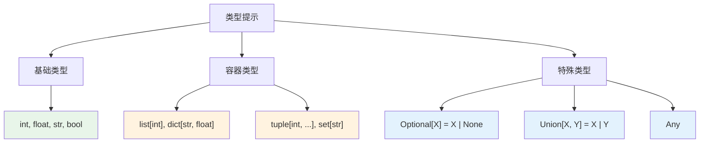

# 类型提示与静态检查

> **所属路径**：`01_基础能力/01_开发环境与技术英语/01_编程语言基础/08_类型提示与静态检查`
> **预计学习时间**：45 分钟
> **难度等级**：⭐⭐

---

## 前置知识

- [变量与数据类型](../01_变量与数据类型/01_变量与数据类型.md)（理解 Python 的数据类型系统）
- [函数与模块](../03_函数与模块/03_函数与模块.md)（理解函数定义、参数和返回值）
- [异常处理](../05_异常处理/05_异常处理.md)（理解类型相关的运行时错误）

> 如果以上内容还不熟悉，建议先完成对应课程再继续。

---

## 学习目标

完成本节后，你将能够：

1. 为函数参数和返回值添加类型提示
2. 使用 `list[int]`、`dict[str, float]` 等泛型类型标注容器
3. 使用 `Optional`、`Union`、`Any` 等特殊类型处理复杂场景
4. 使用 `mypy` 进行静态类型检查
5. 理解类型提示的价值和局限性

---

## 正文讲解

### 1. Python 的"自由"带来的问题

Python 是动态类型语言——变量不需要声明类型，函数参数也不需要指定类型。这让 Python 写起来很自由，但自由是有代价的：

```python
def calculate_discount(price, rate):
    return price * rate

# 正确使用
print(calculate_discount(100, 0.8))  # 80.0

# 错误使用——但 Python 不会报错！
print(calculate_discount("100", 0.8))  # '100100100100100100100100'（字符串重复）
```

当代码量增大、参与开发的人增多时，这类"静默错误"会越来越多、越来越难以排查。

**类型提示（Type Hint）** 就是解决这个问题的工具——它让你在代码中声明"这个参数应该是什么类型"、"这个函数返回什么类型"，然后用工具自动检查是否有违反。

### 2. 基础类型提示语法

Python 3.5 引入了类型提示语法。给函数添加类型提示：

```python
def calculate_discount(price: float, rate: float) -> float:
    """计算折后价格"""
    return price * rate

def greet(name: str) -> str:
    """打招呼"""
    return f"你好，{name}！"

def is_adult(age: int) -> bool:
    """判断是否成年"""
    return age >= 18
```

语法很直观：

- 参数后面用 `: 类型` 标注
- 返回值用 `-> 类型` 标注

> ⚠️ **重要**：类型提示只是"标注"，Python 解释器 **不会** 在运行时检查类型。即使你标注了 `price: float`，传入字符串仍然不会报错。类型提示的价值在于配合 **静态检查工具**（如 `mypy`）在运行前发现问题。

变量也可以添加类型提示：

```python
name: str = "Alice"
age: int = 25
scores: list = [85, 92, 78]
config: dict = {"lr": 0.001}
```

### 3. 容器类型标注

对于列表、字典等容器类型，你可以进一步标注容器内元素的类型：

```python
# Python 3.9+ 可以直接使用内置类型的泛型标注
def calculate_average(scores: list[float]) -> float:
    return sum(scores) / len(scores)

def get_student_info() -> dict[str, str | int]:
    return {"name": "Alice", "age": 20}

# 元组：固定长度用具体类型，可变长度用省略号
point: tuple[float, float] = (3.14, 2.72)
numbers: tuple[int, ...] = (1, 2, 3, 4, 5)

# 集合
unique_ids: set[int] = {1, 2, 3}
```

> 💡 **版本兼容**：Python 3.9+ 支持直接写 `list[int]`、`dict[str, int]`。如果你需要兼容更早的版本，需要从 `typing` 模块导入：`from typing import List, Dict`。

### 4. 特殊类型

实际编程中，经常遇到"参数可能是 None"、"参数可以是多种类型"等复杂情况。`typing` 模块提供了一些特殊类型来处理：

```python
from typing import Optional, Union, Any

# Optional[X] 等价于 X | None
def find_user(user_id: int) -> Optional[dict]:
    """查找用户，找不到返回 None"""
    if user_id == 1:
        return {"name": "Alice", "age": 20}
    return None

# Union[X, Y] 表示可以是 X 或 Y（Python 3.10+ 可用 X | Y）
def process(data: Union[str, list[str]]) -> list[str]:
    """处理字符串或字符串列表"""
    if isinstance(data, str):
        return [data]
    return data

# Any 表示任意类型（相当于不做检查）
def debug_print(value: Any) -> None:
    print(f"DEBUG: {value!r}")
```



> 📌 **图解说明**：Python 类型提示从基础类型到容器类型再到特殊类型，覆盖了绝大多数编程场景。

### 5. 可调用对象和回调函数

标注函数类型（回调函数）使用 `Callable` ：

```python
from collections.abc import Callable

def apply_transform(data: list[float], transform: Callable[[float], float]) -> list[float]:
    """对列表中的每个元素应用变换函数"""
    return [transform(x) for x in data]

# 使用
import math
result = apply_transform([1, 4, 9, 16], math.sqrt)
print(result)  # [1.0, 2.0, 3.0, 4.0]
```

### 6. 使用 mypy 进行静态检查

类型提示的真正威力来自于 **静态类型检查工具** 。`mypy` 是 Python 社区最主流的静态类型检查器：

```bash
# 安装 mypy
pip install mypy

# 检查文件
mypy my_code.py
```

来看一个例子。假设你有这样一个文件 `demo.py`：

```python
def add(a: int, b: int) -> int:
    return a + b

result = add("hello", "world")  # 类型错误！
print(result + 1)               # 运行时也会出错
```

运行 `mypy demo.py` 会报告：

```
demo.py:4: error: Argument 1 to "add" has incompatible type "str"; expected "int"
demo.py:4: error: Argument 2 to "add" has incompatible type "str"; expected "int"
```

在代码运行之前就发现了错误！这在大型项目中非常有价值。

#### 渐进式类型检查

mypy 支持渐进式使用——你不需要一次性给所有代码加上类型提示。没有类型提示的代码，mypy 会跳过不检查。这意味着你可以：

1. 先给新写的代码加类型提示
2. 逐步给旧代码补充类型提示
3. 最终实现全覆盖

> 💡 **AI 连接**：类型提示在 AI 项目中尤其有用。比如标注张量的维度和类型（`torch.Tensor`）、模型配置的结构（`TypedDict`）、数据管道的输入输出类型等。PyTorch 和 TensorFlow 都提供了详细的类型存根（type stubs），配合 mypy 可以在编码阶段就发现维度不匹配等错误。

### 7. TypedDict 和 dataclass

对于复杂的字典结构，`TypedDict` 可以定义精确的键值类型：

```python
from typing import TypedDict

class ModelConfig(TypedDict):
    name: str
    learning_rate: float
    epochs: int
    layers: list[int]

# 正确的配置
config: ModelConfig = {
    "name": "ResNet",
    "learning_rate": 0.001,
    "epochs": 100,
    "layers": [64, 128, 256],
}
```

对于更复杂的数据结构，推荐使用 `dataclass` ：

```python
from dataclasses import dataclass

@dataclass
class TrainingResult:
    model_name: str
    accuracy: float
    loss: float
    epochs: int
    
    def summary(self) -> str:
        return f"{self.model_name}: acc={self.accuracy:.2%}, loss={self.loss:.4f}"

result = TrainingResult("BERT", 0.956, 0.123, 50)
print(result.summary())  # BERT: acc=95.60%, loss=0.1230
```

---

## 动手实践

```python
# 文件：code/type_hints_demo.py
# 演示类型提示的各种用法

from typing import Optional, TypedDict
from collections.abc import Callable
from dataclasses import dataclass, field
import math

# ========== 1. 基础类型提示 ==========
print("=== 基础类型提示 ===")

def normalize(values: list[float], method: str = "minmax") -> list[float]:
    """归一化数据"""
    if method == "minmax":
        min_v, max_v = min(values), max(values)
        if max_v == min_v:
            return [0.0] * len(values)
        return [(v - min_v) / (max_v - min_v) for v in values]
    elif method == "zscore":
        mean = sum(values) / len(values)
        std = math.sqrt(sum((v - mean) ** 2 for v in values) / len(values))
        if std == 0:
            return [0.0] * len(values)
        return [(v - mean) / std for v in values]
    else:
        raise ValueError(f"未知方法：{method}")

data = [10.0, 45.0, 20.0, 80.0, 55.0]
print(f"  MinMax: {[f'{x:.3f}' for x in normalize(data, 'minmax')]}")
print(f"  Z-Score: {[f'{x:.3f}' for x in normalize(data, 'zscore')]}")

# ========== 2. Optional 和错误处理 ==========
print("\n=== Optional 类型 ===")

def safe_divide(a: float, b: float) -> Optional[float]:
    """安全除法，除数为零返回 None"""
    if b == 0:
        return None
    return a / b

pairs = [(10, 3), (10, 0), (7, 2)]
for a, b in pairs:
    result = safe_divide(a, b)
    if result is not None:
        print(f"  {a} / {b} = {result:.2f}")
    else:
        print(f"  {a} / {b} = 无法计算（除数为零）")

# ========== 3. Callable 回调 ==========
print("\n=== Callable 回调 ===")

def apply_transform(
    data: list[float], 
    transform: Callable[[float], float],
    label: str = ""
) -> list[float]:
    result = [transform(x) for x in data]
    if label:
        print(f"  {label}: {[f'{x:.3f}' for x in result]}")
    return result

values = [1.0, 4.0, 9.0, 16.0, 25.0]
apply_transform(values, math.sqrt, "平方根")
apply_transform(values, lambda x: x ** 2, "平方")
apply_transform(values, lambda x: math.log(x + 1), "对数")

# ========== 4. TypedDict ==========
print("\n=== TypedDict 配置 ===")

class ExperimentConfig(TypedDict):
    name: str
    model: str
    learning_rate: float
    batch_size: int
    epochs: int

def run_experiment(config: ExperimentConfig) -> dict[str, float]:
    """模拟运行实验"""
    print(f"  实验：{config['name']}")
    print(f"  模型：{config['model']}, lr={config['learning_rate']}, bs={config['batch_size']}")
    # 模拟结果
    return {"accuracy": 0.95, "loss": 0.15}

exp = ExperimentConfig(
    name="MNIST基线",
    model="CNN",
    learning_rate=0.001,
    batch_size=64,
    epochs=10,
)
results = run_experiment(exp)
print(f"  结果：{results}")

# ========== 5. dataclass ==========
print("\n=== dataclass ===")

@dataclass
class ModelMetrics:
    """模型评估指标"""
    accuracy: float
    precision: float
    recall: float
    f1_score: float = 0.0
    
    def __post_init__(self):
        if self.f1_score == 0.0 and (self.precision + self.recall) > 0:
            self.f1_score = 2 * self.precision * self.recall / (self.precision + self.recall)
    
    def summary(self) -> str:
        return (f"Acc={self.accuracy:.2%}, "
                f"P={self.precision:.2%}, "
                f"R={self.recall:.2%}, "
                f"F1={self.f1_score:.2%}")

metrics = ModelMetrics(accuracy=0.95, precision=0.92, recall=0.88)
print(f"  {metrics.summary()}")
print(f"  对象表示：{metrics}")
```

**运行说明**：
- 环境要求：Python 3.10+
- 运行命令：`python code/type_hints_demo.py`

**预期输出**：
```
=== 基础类型提示 ===
  MinMax: ['0.000', '0.500', '0.143', '1.000', '0.643']
  Z-Score: ['-1.268', '0.085', '-0.882', '1.437', '0.627']

=== Optional 类型 ===
  10 / 3 = 3.33
  10 / 0 = 无法计算（除数为零）
  7 / 2 = 3.50

=== Callable 回调 ===
  平方根: ['1.000', '2.000', '3.000', '4.000', '5.000']
  平方: ['1.000', '16.000', '81.000', '256.000', '625.000']
  对数: ['0.693', '1.609', '2.303', '2.833', '3.258']

=== TypedDict 配置 ===
  实验：MNIST基线
  模型：CNN, lr=0.001, bs=64
  结果：{'accuracy': 0.95, 'loss': 0.15}

=== dataclass ===
  Acc=95.00%, P=92.00%, R=88.00%, F1=89.96%
  对象表示：ModelMetrics(accuracy=0.95, precision=0.92, recall=0.88, f1_score=0.8977...)
```

---

## 典型误区

| 误区 | 正确理解 |
| ---- | -------- |
| "类型提示会让 Python 变成静态语言" | 类型提示是可选的标注，不影响运行。Python 仍然是动态语言 |
| "类型提示会降低代码性能" | 类型提示在运行时被忽略，不会影响性能（除非使用 `@dataclass` 等会生成代码的工具） |
| "所有代码都必须加类型提示" | 渐进式类型检查意味着你可以逐步添加。优先给公共 API 和复杂函数加 |
| " `Any` 是万能的好选择" | 过度使用 `Any` 等于放弃类型检查。应该尽量使用具体类型 |
| " `Optional[X]` 和 `X` 一样" | `Optional[X]` 表示值可能是 `None`，提醒调用者需要做空值检查 |

---

## 练习题

### 练习 1：给函数添加类型提示（难度：⭐）

为以下函数添加完整的类型提示：

```python
def filter_positive(numbers):
    return [n for n in numbers if n > 0]

def word_count(text):
    words = text.split()
    counts = {}
    for w in words:
        counts[w] = counts.get(w, 0) + 1
    return counts
```

<details>
<summary>💡 提示</summary>

`filter_positive` 接收数字列表，返回数字列表。`word_count` 接收字符串，返回字典。

</details>

<details>
<summary>✅ 参考答案</summary>

```python
def filter_positive(numbers: list[float]) -> list[float]:
    return [n for n in numbers if n > 0]

def word_count(text: str) -> dict[str, int]:
    words = text.split()
    counts: dict[str, int] = {}
    for w in words:
        counts[w] = counts.get(w, 0) + 1
    return counts
```

</details>

### 练习 2：使用 dataclass（难度：⭐⭐）

用 `dataclass` 定义一个 `Dataset` 类，包含以下字段：
- `name`: 数据集名称（字符串）
- `size`: 样本数量（整数）
- `features`: 特征数量（整数）
- `labels`: 标签列表（字符串列表，默认为空列表）

添加一个 `info()` 方法返回数据集描述字符串。

<details>
<summary>💡 提示</summary>

使用 `field(default_factory=list)` 设置可变默认值（不要直接写 `labels: list[str] = []`）。

</details>

<details>
<summary>✅ 参考答案</summary>

```python
from dataclasses import dataclass, field

@dataclass
class Dataset:
    name: str
    size: int
    features: int
    labels: list[str] = field(default_factory=list)
    
    def info(self) -> str:
        return (f"数据集'{self.name}': "
                f"{self.size}个样本, "
                f"{self.features}个特征, "
                f"{len(self.labels)}个标签类别")

ds = Dataset("MNIST", 60000, 784, ["0", "1", "2", "3", "4", "5", "6", "7", "8", "9"])
print(ds.info())
# 数据集'MNIST': 60000个样本, 784个特征, 10个标签类别
```

</details>

### 练习 3：泛型函数（难度：⭐⭐）

编写一个带类型提示的函数 `top_k`，从字典中返回值最大的 k 个键值对：

```python
# 用法示例
scores = {"Alice": 85, "Bob": 92, "Charlie": 78, "Diana": 96}
print(top_k(scores, 2))  # [('Diana', 96), ('Bob', 92)]
```

<details>
<summary>💡 提示</summary>

返回类型是 `list[tuple[str, float]]`。使用 `sorted()` 函数和 `key` 参数排序。

</details>

<details>
<summary>✅ 参考答案</summary>

```python
def top_k(data: dict[str, float], k: int) -> list[tuple[str, float]]:
    """返回字典中值最大的 k 个键值对"""
    sorted_items = sorted(data.items(), key=lambda x: x[1], reverse=True)
    return sorted_items[:k]

scores = {"Alice": 85, "Bob": 92, "Charlie": 78, "Diana": 96}
print(top_k(scores, 2))  # [('Diana', 96), ('Bob', 92)]
```

</details>

---

## 下一步学习

- 📖 下一个知识主题：[字符串与编码](../../02_字符串与编码/) — 深入学习字符串处理、Unicode 与编解码
- 🔗 相关知识点：[容器类型深入](../../03_容器类型深入/) — 深入学习 collections 模块
- 🔗 相关知识点：[Python 项目实践](../../18_Python项目实践/) — 在实际项目中应用类型提示

---

## 参考资料

1. [Python 官方文档 - typing 模块](https://docs.python.org/zh-cn/3/library/typing.html) — 类型提示的完整参考（官方文档）
2. [mypy 官方文档](https://mypy.readthedocs.io/) — mypy 静态检查器的使用指南（开源项目文档）
3. [PEP 484 – Type Hints](https://peps.python.org/pep-0484/) — 类型提示的设计规范（Python 官方提案）
4. [Real Python - Type Checking](https://realpython.com/python-type-checking/) — 类型检查的实用教程（公开教程）
